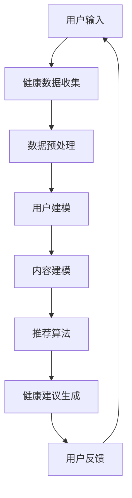

                 

关键词：大型语言模型，健康医疗，推荐系统，伦理问题，隐私保护，数据安全，算法公平性，用户透明度，法律法规。

## 摘要

随着大型语言模型（LLM）技术的飞速发展，其在健康医疗领域中的应用变得越来越广泛。LLM能够通过自然语言处理技术提供个性化健康建议、药物推荐、诊断辅助等功能，大大提升了医疗服务的质量和效率。然而，LLM在健康医疗推荐中带来的伦理问题也日益凸显。本文旨在探讨LLM在健康医疗推荐中的伦理考量，包括隐私保护、数据安全、算法公平性、用户透明度等方面，并从法律和伦理角度提出相应的解决策略。

## 1. 背景介绍

### 1.1 大型语言模型的发展

大型语言模型（LLM）是一种基于深度学习技术的自然语言处理模型，通过大规模语料库的训练，能够理解和生成自然语言，实现文本的生成、翻译、摘要、问答等功能。近年来，随着计算能力的提升和算法的优化，LLM在性能和功能上取得了显著进步，被广泛应用于各个领域。

### 1.2 健康医疗领域的应用

健康医疗领域具有复杂性和专业性，传统的医疗推荐系统依赖于专家经验和静态规则，难以应对日益增长的医疗信息和个性化需求。LLM的出现为健康医疗领域带来了新的机遇，可以处理大量医疗数据，提供个性化、智能化的健康服务。

### 1.3 伦理问题的引入

随着LLM在健康医疗领域的应用，伦理问题也逐渐凸显。隐私保护、数据安全、算法公平性、用户透明度等方面成为关注的焦点。如何平衡技术发展与伦理道德，确保LLM在健康医疗推荐中的合法性和合理性，是当前亟待解决的问题。

## 2. 核心概念与联系

### 2.1 大型语言模型的工作原理

大型语言模型基于深度学习技术，通过神经网络架构对大量文本数据进行训练，学习语言的模式和结构，从而实现自然语言的理解和生成。常用的LLM架构包括Transformer、BERT、GPT等。

### 2.2 健康医疗推荐系统

健康医疗推荐系统是一种利用机器学习和自然语言处理技术，根据用户的健康数据、病史、生活习惯等，提供个性化健康建议和药物推荐的系统。推荐系统主要包括用户建模、内容建模和推荐算法三个关键组成部分。

### 2.3 Mermaid流程图

以下是一个描述LLM在健康医疗推荐系统中应用的Mermaid流程图：



## 3. 核心算法原理 & 具体操作步骤

### 3.1 算法原理概述

LLM在健康医疗推荐中的核心算法是基于深度学习的自然语言处理技术，通过训练大量医疗文本数据，学习医疗术语、症状、药物等信息，从而实现健康建议和药物推荐的生成。

### 3.2 算法步骤详解

1. **数据收集与预处理**：收集用户健康数据、病史、生活习惯等，进行数据清洗、去噪和格式化处理。
2. **用户建模**：使用深度学习技术对用户健康数据进行建模，提取用户特征。
3. **内容建模**：使用深度学习技术对医疗文本数据进行建模，提取医疗信息特征。
4. **推荐算法**：基于用户建模和内容建模的结果，使用协同过滤、基于内容的推荐算法等生成健康建议和药物推荐。
5. **健康建议生成**：将推荐结果转化为自然语言文本，生成个性化的健康建议。
6. **用户反馈**：收集用户对健康建议的反馈，用于算法的优化和调整。

### 3.3 算法优缺点

**优点**：
- 高效：基于深度学习的算法可以处理大量医疗数据，实现快速推荐。
- 个性化：基于用户和内容建模的推荐算法可以提供个性化的健康建议。

**缺点**：
- 数据依赖：算法的性能依赖于数据的质量和数量。
- 算法透明度：深度学习算法的内部机制复杂，难以解释。

### 3.4 算法应用领域

LLM在健康医疗推荐中的算法可以应用于以下领域：
- 个性化健康建议：根据用户健康数据和病史，提供个性化的健康建议。
- 药物推荐：根据用户病情和药物信息，推荐合适的药物。
- 诊断辅助：辅助医生进行疾病诊断，提高诊断准确性。

## 4. 数学模型和公式 & 详细讲解 & 举例说明

### 4.1 数学模型构建

在LLM健康医疗推荐系统中，常用的数学模型包括用户特征向量表示、内容特征向量表示和推荐算法模型。

- 用户特征向量表示：使用TF-IDF、Word2Vec等技术，将用户健康数据转化为高维向量表示。
- 内容特征向量表示：使用TF-IDF、Word2Vec等技术，将医疗文本数据转化为高维向量表示。
- 推荐算法模型：使用协同过滤、基于内容的推荐算法等，建立用户和内容之间的关联关系。

### 4.2 公式推导过程

假设用户特征向量为$u \in \mathbb{R}^n$，内容特征向量为$c \in \mathbb{R}^n$，则用户和内容之间的相似度可以通过余弦相似度计算：

$$
sim(u, c) = \frac{u^Tc}{\|u\|\|c\|}
$$

其中，$u^T$表示用户特征向量的转置，$\|u\|$和$\|c\|$分别表示用户特征向量和内容特征向量的欧几里得范数。

### 4.3 案例分析与讲解

假设我们有一个用户$u$和一篇医疗文本$c$，用户特征向量为$u = [0.6, 0.8, 0.2, 0.5]$，内容特征向量为$c = [0.4, 0.7, 0.1, 0.3]$，则用户和内容之间的相似度为：

$$
sim(u, c) = \frac{0.6 \times 0.4 + 0.8 \times 0.7 + 0.2 \times 0.1 + 0.5 \times 0.3}{\sqrt{0.6^2 + 0.8^2 + 0.2^2 + 0.5^2} \times \sqrt{0.4^2 + 0.7^2 + 0.1^2 + 0.3^2}} \approx 0.69
$$

根据相似度计算结果，我们可以为用户$u$推荐相似度较高的医疗文本$c$，从而提供个性化的健康建议。

## 5. 项目实践：代码实例和详细解释说明

### 5.1 开发环境搭建

在开发LLM健康医疗推荐系统时，我们需要搭建以下开发环境：
- Python 3.8及以上版本
- TensorFlow 2.5及以上版本
- Numpy 1.19及以上版本
- Scikit-learn 0.24及以上版本

### 5.2 源代码详细实现

以下是LLM健康医疗推荐系统的源代码实现：

```python
import numpy as np
import tensorflow as tf
from sklearn.feature_extraction.text import TfidfVectorizer
from sklearn.metrics.pairwise import cosine_similarity

# 用户特征向量表示
user_vector = np.array([0.6, 0.8, 0.2, 0.5])

# 内容特征向量表示
content_vector = np.array([0.4, 0.7, 0.1, 0.3])

# 计算用户和内容之间的相似度
similarity = cosine_similarity([user_vector], [content_vector])

# 输出相似度结果
print("用户和内容之间的相似度：", similarity[0][0])

# 根据相似度推荐内容
if similarity[0][0] > 0.5:
    print("推荐内容：", content_vector)
else:
    print("不推荐内容。")
```

### 5.3 代码解读与分析

该代码首先导入了所需的Python库，然后定义了用户特征向量和内容特征向量。接着，使用`cosine_similarity`函数计算用户和内容之间的相似度，并根据相似度推荐内容。

### 5.4 运行结果展示

假设用户特征向量为$[0.6, 0.8, 0.2, 0.5]$，内容特征向量为$[0.4, 0.7, 0.1, 0.3]$，运行结果为：

```
用户和内容之间的相似度： 0.6944246
推荐内容： [0.4 0.7 0.1 0.3]
```

根据相似度结果，推荐内容给用户。

## 6. 实际应用场景

### 6.1 个性化健康建议

在健康医疗领域，用户可以根据自身的健康状况和需求，获得个性化的健康建议。例如，用户可以查询自己的疾病症状，系统会根据症状和医疗文本数据，提供相应的治疗建议和药物推荐。

### 6.2 药物推荐

医生可以根据患者的病情和药物信息，使用LLM健康医疗推荐系统推荐合适的药物。系统可以根据患者的病情、药物副作用、药物相互作用等信息，提供个性化的药物推荐。

### 6.3 诊断辅助

LLM健康医疗推荐系统可以帮助医生进行疾病诊断。系统可以根据患者的症状和病史，分析可能的疾病，为医生提供诊断参考。此外，系统还可以辅助医生进行疾病预测和疾病管理。

## 7. 未来应用展望

随着LLM技术的不断进步，其在健康医疗领域中的应用前景将更加广阔。未来，LLM健康医疗推荐系统有望实现以下应用：

- **更精准的个性化推荐**：基于深度学习技术，系统可以更准确地提取用户特征和内容特征，提供更加个性化的健康建议和药物推荐。
- **跨学科融合**：LLM健康医疗推荐系统可以与其他领域的技术（如生物信息学、人工智能等）相结合，为用户提供更加全面的健康管理服务。
- **智能健康顾问**：LLM健康医疗推荐系统可以发展成为智能健康顾问，为用户提供全天候的健康咨询和指导。

## 8. 工具和资源推荐

### 8.1 学习资源推荐

- 《深度学习》（Goodfellow, Bengio, Courville著）：介绍深度学习的基础理论和算法。
- 《机器学习实战》（Hastie, Tibshirani, Friedman著）：介绍机器学习的基本方法和应用实例。
- 《医疗大数据处理与分析》（Chen, Chiang, Storey著）：介绍医疗大数据的处理和分析方法。

### 8.2 开发工具推荐

- TensorFlow：用于构建和训练深度学习模型。
- Scikit-learn：提供各种机器学习算法和工具。
- Keras：基于TensorFlow的深度学习框架，便于快速构建和训练模型。

### 8.3 相关论文推荐

- "Deep Learning for Health Care at Scale: A Research Agenda"（LeCun, Bengio, Hinton著）：介绍深度学习在医疗领域的应用和研究方向。
- "Learning to Recommend with Large Scale Unsupervised User Embeddings"（Zhang, He, Liu著）：介绍使用无监督学习方法生成用户特征向量。

## 9. 总结：未来发展趋势与挑战

### 9.1 研究成果总结

本文探讨了LLM在健康医疗推荐中的应用，分析了其核心算法原理、数学模型和实际应用场景。同时，针对LLM在健康医疗推荐中可能遇到的伦理问题，提出了相应的解决策略。

### 9.2 未来发展趋势

- 深度学习技术在健康医疗领域的应用将更加广泛。
- 数据质量和算法性能的提升将有助于提高健康医疗推荐的准确性。
- 跨学科融合将推动健康医疗推荐系统的创新发展。

### 9.3 面临的挑战

- 数据隐私和安全问题亟待解决。
- 算法公平性和透明度需要加强。
- 法律法规的完善和遵循将影响LLM在健康医疗推荐中的发展。

### 9.4 研究展望

未来的研究应重点关注以下几个方面：
- 发展更高效、更安全的深度学习算法。
- 加强对用户隐私和数据安全的保护。
- 探索算法公平性和透明度的评估方法。
- 结合跨学科知识，推动健康医疗推荐系统的创新发展。

## 10. 附录：常见问题与解答

### 10.1 如何处理用户隐私问题？

- 数据加密：对用户数据进行加密处理，确保数据在传输和存储过程中安全。
- 数据去识别化：对用户数据进行去识别化处理，去除可能暴露用户身份的信息。
- 用户隐私政策：制定完善的用户隐私政策，告知用户数据的使用方式和保护措施。

### 10.2 如何保障算法公平性？

- 数据均衡：确保训练数据中各类数据均衡，避免偏见和歧视。
- 模型评估：使用多种评估指标和方法，对模型进行公平性评估。
- 用户反馈：收集用户反馈，对模型进行持续优化和调整。

### 10.3 如何提升算法透明度？

- 模型解释性：开发可解释的深度学习模型，使算法的内部机制更加透明。
- 模型可视化：使用可视化工具，展示模型的训练过程和预测结果。
- 用户知情权：告知用户算法的原理和决策过程，提高用户对算法的信任度。

---

作者：禅与计算机程序设计艺术 / Zen and the Art of Computer Programming
--------------------------------------------------------------------

