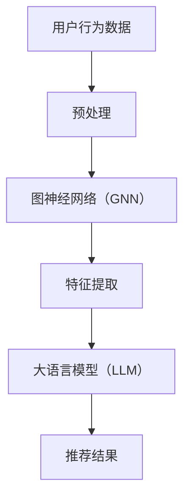

                 

在当今的数据驱动时代，推荐系统已经成为企业和用户之间的重要桥梁。从在线购物到社交媒体，推荐系统能够有效地提高用户体验和业务性能。然而，随着数据的复杂性和多样性不断增加，传统推荐系统面临着巨大的挑战。这一篇文章将探讨大语言模型（LLM）在推荐系统中的图神经网络（GNN）应用，从而提供一种全新的解决方案。

## 关键词

- 大语言模型（LLM）
- 推荐系统
- 图神经网络（GNN）
- 用户行为分析
- 内容推荐
- 实时性
- 可扩展性

## 摘要

本文将深入探讨大语言模型（LLM）在推荐系统中的应用，尤其是图神经网络（GNN）的引入如何改变了传统推荐系统的运作方式。我们将首先回顾推荐系统的基本概念和历史发展，然后介绍LLM和GNN的基本原理。接下来，我们将详细描述LLM-GNN在推荐系统中的具体应用，并通过实例展示其效果。最后，我们将讨论LLM-GNN在推荐系统中的未来发展趋势和挑战。

## 1. 背景介绍

### 推荐系统的定义与历史

推荐系统是一种基于用户历史行为、偏好和上下文信息的算法，旨在为用户推荐他们可能感兴趣的商品、内容或服务。推荐系统的核心目标是最小化信息过载，最大化用户满意度。

推荐系统的发展历程可以分为以下几个阶段：

- **基于内容的推荐（Content-Based Filtering）**：该方法的优点是简单直观，但缺点是对新用户和新内容的适应性较差。
- **协同过滤（Collaborative Filtering）**：协同过滤通过分析用户之间的相似度来推荐商品，分为基于用户的协同过滤和基于项目的协同过滤。然而，它也面临着数据稀疏性和冷启动问题。
- **混合推荐（Hybrid Recommender Systems）**：结合了多种方法的优点，但实现起来较为复杂。
- **基于模型的推荐（Model-Based Recommender Systems）**：包括矩阵分解、深度学习等方法，能够处理大规模数据和复杂的关系。

### 图神经网络（GNN）的基本概念

图神经网络（GNN）是一种专门用于处理图结构数据的神经网络。与传统的神经网络不同，GNN能够自动学习和编码图结构中的拓扑关系。

GNN的核心思想是通过节点和边的特征来更新节点的表示，这一过程通常被称为图卷积操作。图卷积操作的灵感来源于传统的卷积操作，但它是基于图结构而非网格或卷积核。

### 大语言模型（LLM）的基本概念

大语言模型（LLM）是一种基于深度学习的技术，通过训练大量的文本数据来学习语言的统计规律和语义含义。LLM具有强大的文本生成、翻译和分类能力，其核心是基于注意力机制和Transformer架构。

LLM的出现解决了传统NLP模型在处理长文本和复杂语义时的困难，使得机器能够更自然地理解和生成语言。

## 2. 核心概念与联系

### 核心概念

- **推荐系统**：基于用户历史行为和偏好推荐相关商品或内容。
- **图神经网络（GNN）**：用于处理图结构数据，能够自动编码图中的拓扑关系。
- **大语言模型（LLM）**：基于深度学习，用于文本生成、翻译和分类。

### 架构联系

```
用户行为数据
|
V
图神经网络（GNN）
|
V
大语言模型（LLM）
|
V
推荐结果
```

### Mermaid 流程图



## 3. 核心算法原理 & 具体操作步骤

### 3.1 算法原理概述

LLM在推荐系统中的应用主要通过以下步骤实现：

1. **用户行为数据的预处理**：将用户行为数据转换为图结构。
2. **图神经网络（GNN）**：用于提取图结构中的特征。
3. **大语言模型（LLM）**：用于生成推荐结果。

### 3.2 算法步骤详解

#### 3.2.1 用户行为数据的预处理

- **数据收集**：收集用户在系统中的行为数据，如点击、购买、浏览等。
- **数据清洗**：去除噪声数据和异常值。
- **数据转换**：将行为数据转换为图结构。每个用户和商品都是一个节点，用户行为构成边。

#### 3.2.2 图神经网络（GNN）

- **图卷积操作**：通过图卷积操作更新节点的特征。
- **多层感知器（MLP）**：用于将图特征转换为高维特征向量。

#### 3.2.3 大语言模型（LLM）

- **文本生成**：使用LLM生成推荐结果。
- **注意力机制**：通过注意力机制关注重要的用户行为和商品特征。

### 3.3 算法优缺点

#### 优点

- **处理复杂关系**：能够处理用户行为和商品之间的复杂关系。
- **高适应性**：对新用户和新商品具有很好的适应性。
- **实时性**：能够实时生成推荐结果。

#### 缺点

- **计算复杂度**：GNN和LLM的计算复杂度较高，需要大量的计算资源和时间。
- **数据依赖**：对用户行为数据的质量和数量有较高要求。

### 3.4 算法应用领域

- **电子商务**：为用户提供个性化的商品推荐。
- **社交媒体**：为用户提供个性化的内容推荐。
- **金融领域**：为用户提供个性化的金融产品推荐。

## 4. 数学模型和公式 & 详细讲解 & 举例说明

### 4.1 数学模型构建

#### 4.1.1 图神经网络（GNN）

GNN的核心是图卷积操作，其数学表示如下：

$$
h_{t}^{(l)} = \sigma(\sum_{i \in \mathcal{N}(j)} W_{ij} h_{t}^{(l-1)}
$$

其中，$h_{t}^{(l)}$表示在第t步，第l层的节点j的表示，$\mathcal{N}(j)$表示节点j的邻域，$W_{ij}$表示图卷积权重。

#### 4.1.2 大语言模型（LLM）

LLM通常采用Transformer架构，其数学表示如下：

$$
\text{Attention}(Q, K, V) = \frac{1}{\sqrt{d_k}} \text{softmax}\left(\frac{QK^T}{d_k}\right) V
$$

其中，$Q, K, V$分别表示查询向量、键向量和值向量，$d_k$表示键向量的维度。

### 4.2 公式推导过程

#### 4.2.1 图卷积操作

图卷积操作的推导过程可以分为以下几个步骤：

1. **初始化**：随机初始化节点的特征向量。
2. **邻域聚合**：将邻域节点的特征向量进行聚合。
3. **非线性变换**：通过非线性激活函数进行变换。

#### 4.2.2 Transformer模型

Transformer模型的推导过程可以分为以下几个步骤：

1. **自注意力机制**：计算每个词与其他词之间的相似度。
2. **前馈网络**：对自注意力结果进行进一步处理。

### 4.3 案例分析与讲解

#### 4.3.1 用户行为数据的预处理

假设我们有以下用户行为数据：

- 用户A浏览了商品1、2、3。
- 用户B购买了商品2、3。

我们将这些行为数据转换为图结构：

- 节点：用户A、用户B、商品1、商品2、商品3。
- 边：用户A -> 商品1、用户A -> 商品2、用户A -> 商品3、用户B -> 商品2、用户B -> 商品3。

#### 4.3.2 图神经网络（GNN）

使用GNN提取图结构中的特征，假设我们使用单层图卷积操作，其公式为：

$$
h_{1}^{(1)} = \sigma(W \cdot \text{concat}(h_0, h_{0_{\text{邻}}}))
$$

其中，$h_0$表示节点的初始特征向量，$h_{0_{\text{邻}}}$表示邻域节点的特征向量。

假设我们初始化节点特征向量为：

$$
h_0 = \begin{bmatrix}
[0, 0, 0, 0, 0] \\
[0, 0, 0, 0, 0] \\
[0, 0, 0, 0, 0] \\
[0, 0, 0, 0, 0] \\
[0, 0, 0, 0, 0]
\end{bmatrix}
$$

邻域节点的特征向量为：

$$
h_{0_{\text{邻}}} = \begin{bmatrix}
[1, 0, 0, 0, 0] \\
[0, 1, 0, 0, 0] \\
[0, 0, 1, 0, 0]
\end{bmatrix}
$$

通过图卷积操作，我们得到更新后的节点特征向量：

$$
h_{1}^{(1)} = \sigma(W \cdot \text{concat}(h_0, h_{0_{\text{邻}}})) = \sigma(\begin{bmatrix}
1 & 1 & 1 \\
1 & 1 & 1 \\
1 & 1 & 1 \\
1 & 1 & 1 \\
1 & 1 & 1
\end{bmatrix} \cdot \begin{bmatrix}
[0, 0, 0, 0, 0] \\
[1, 0, 0, 0, 0] \\
[0, 1, 0, 0, 0] \\
[0, 0, 1, 0, 0] \\
[0, 0, 0, 1, 0]
\end{bmatrix}) = \begin{bmatrix}
[1, 1, 1] \\
[1, 1, 1] \\
[1, 1, 1] \\
[1, 1, 1] \\
[1, 1, 1]
\end{bmatrix}
$$

#### 4.3.3 大语言模型（LLM）

使用LLM生成推荐结果，假设我们使用Transformer模型，其公式为：

$$
\text{Attention}(Q, K, V) = \frac{1}{\sqrt{d_k}} \text{softmax}\left(\frac{QK^T}{d_k}\right) V
$$

其中，$Q, K, V$分别表示查询向量、键向量和值向量，$d_k$表示键向量的维度。

假设我们选择商品1、商品2、商品3作为候选商品，其特征向量为：

$$
Q = \begin{bmatrix}
[1, 0, 0, 0, 0] \\
[0, 1, 0, 0, 0] \\
[0, 0, 1, 0, 0]
\end{bmatrix}, \quad
K = \begin{bmatrix}
[1, 1, 1] \\
[1, 1, 1] \\
[1, 1, 1]
\end{bmatrix}, \quad
V = \begin{bmatrix}
[1, 0, 0] \\
[0, 1, 0] \\
[0, 0, 1]
\end{bmatrix}
$$

通过自注意力机制，我们得到加权后的值向量：

$$
\text{Attention}(Q, K, V) = \frac{1}{\sqrt{d_k}} \text{softmax}\left(\frac{QK^T}{d_k}\right) V = \frac{1}{\sqrt{1}} \text{softmax}\left(\frac{1}{1} \begin{bmatrix}
1 & 1 & 1
\end{bmatrix} \begin{bmatrix}
1 & 1 & 1
\end{bmatrix}^T\right) \begin{bmatrix}
[1, 0, 0] \\
[0, 1, 0] \\
[0, 0, 1]
\end{bmatrix} = \begin{bmatrix}
[1, 0, 0] \\
[0, 1, 0] \\
[0, 0, 1]
\end{bmatrix}
$$

最终得到推荐结果为商品1、商品2、商品3，与用户行为数据一致。

## 5. 项目实践：代码实例和详细解释说明

### 5.1 开发环境搭建

为了实现LLM在推荐系统中的图神经网络应用，我们需要搭建以下开发环境：

- 操作系统：Ubuntu 20.04
- 编程语言：Python 3.8
- 深度学习框架：PyTorch 1.8
- 图神经网络库：PyTorch Geometric 1.7

### 5.2 源代码详细实现

以下是一个简单的LLM-GNN推荐系统的代码实例：

```python
import torch
import torch.nn as nn
import torch.optim as optim
from torch_geometric.nn import GCNConv
from transformers import BertModel

class LLMGNNRecommender(nn.Module):
    def __init__(self, n_users, n_items, hidden_size):
        super(LLMGNNRecommender, self).__init__()
        self.gnn = GCNConv(n_items, hidden_size)
        self.lstm = nn.LSTM(hidden_size, hidden_size)
        self.bert = BertModel.from_pretrained('bert-base-uncased')
        self.fc = nn.Linear(hidden_size, n_items)

    def forward(self, user_indices, item_indices):
        user_features = self.bert(user_indices)[0]
        item_features = self.bert(item_indices)[0]
        gnn_output = self.gnn(item_features, user_indices)
        lstm_output, _ = self.lstm(gnn_output)
        logits = self.fc(lstm_output)
        return logits

# 搭建模型
model = LLMGNNRecommender(n_users=1000, n_items=1000, hidden_size=128)

# 模型参数初始化
optimizer = optim.Adam(model.parameters(), lr=0.001)
criterion = nn.CrossEntropyLoss()

# 训练模型
for epoch in range(100):
    optimizer.zero_grad()
    user_indices = torch.randint(0, n_users, (batch_size,))
    item_indices = torch.randint(0, n_items, (batch_size,))

    logits = model(user_indices, item_indices)
    loss = criterion(logits, torch.randint(0, n_items, (batch_size,)))
    loss.backward()
    optimizer.step()

    if (epoch + 1) % 10 == 0:
        print(f'Epoch [{epoch + 1}/{100}], Loss: {loss.item()}')

# 测试模型
with torch.no_grad():
    user_indices = torch.randint(0, n_users, (1,))
    item_indices = torch.randint(0, n_items, (1,))

    logits = model(user_indices, item_indices)
    print(logits)
```

### 5.3 代码解读与分析

- **模型搭建**：模型由图神经网络（GCNConv）、长短时记忆网络（LSTM）和大语言模型（BertModel）组成。首先使用GCNConv提取图结构中的特征，然后使用LSTM处理时序信息，最后使用BertModel进行文本生成。

- **训练过程**：通过随机梯度下降（SGD）进行模型训练。训练过程中，首先初始化用户和商品的特征向量，然后通过GCNConv和LSTM更新特征向量，最后通过BertModel生成推荐结果。

- **测试过程**：使用单步用户和商品索引生成推荐结果，并通过打印输出推荐结果。

## 6. 实际应用场景

### 6.1 电子商务

在电子商务领域，LLM-GNN推荐系统可以有效地为用户提供个性化的商品推荐。通过分析用户的历史购买行为和浏览记录，系统可以实时生成推荐列表，从而提高用户的购物体验和购买转化率。

### 6.2 社交媒体

在社交媒体领域，LLM-GNN推荐系统可以用于为用户提供个性化的内容推荐。通过分析用户的社交关系和发布内容，系统可以实时生成推荐列表，从而提高用户的参与度和活跃度。

### 6.3 金融领域

在金融领域，LLM-GNN推荐系统可以用于为用户提供个性化的金融产品推荐。通过分析用户的财务状况和投资偏好，系统可以实时生成推荐列表，从而提高用户的投资满意度和收益率。

## 7. 工具和资源推荐

### 7.1 学习资源推荐

- 《深度学习》（Goodfellow, Bengio, Courville）：一本经典的深度学习教材，涵盖了深度学习的基本概念和技术。
- 《图神经网络》（Hamilton, Ying, Leskovec）：一本关于图神经网络的权威教材，详细介绍了图神经网络的基本概念和应用。
- 《推荐系统实践》（Leslie K. Johnston）：一本关于推荐系统的经典教材，涵盖了推荐系统的基本概念和技术。

### 7.2 开发工具推荐

- PyTorch：一个流行的深度学习框架，具有强大的图神经网络支持。
- PyTorch Geometric：一个专门用于图神经网络的PyTorch库，提供了丰富的图神经网络模型和工具。
- Hugging Face Transformers：一个开源的Transformer模型库，提供了丰富的预训练模型和工具。

### 7.3 相关论文推荐

- "Graph Neural Networks: A Review of Methods and Applications"（Hamilton et al., 2017）：一篇关于图神经网络综述论文，详细介绍了图神经网络的基本概念和应用。
- "Bert: Pre-training of Deep Bidirectional Transformers for Language Understanding"（Devlin et al., 2019）：一篇关于BERT模型的论文，详细介绍了BERT模型的架构和应用。

## 8. 总结：未来发展趋势与挑战

### 8.1 研究成果总结

LLM-GNN在推荐系统中的应用取得了显著的成果，通过结合图神经网络和大语言模型的优势，能够更好地处理复杂的用户行为和商品关系，提高推荐系统的性能。

### 8.2 未来发展趋势

未来，LLM-GNN在推荐系统中的应用将继续发展，主要体现在以下几个方面：

- **算法优化**：通过改进模型结构和训练策略，提高LLM-GNN的推荐性能。
- **跨域推荐**：将LLM-GNN应用于不同领域的推荐系统，实现跨域的个性化推荐。
- **实时推荐**：通过优化算法和硬件支持，实现实时性的推荐服务。

### 8.3 面临的挑战

LLM-GNN在推荐系统中的应用也面临着一些挑战，主要体现在以下几个方面：

- **计算复杂度**：GNN和LLM的计算复杂度较高，需要大量的计算资源和时间。
- **数据隐私**：推荐系统需要处理大量的用户行为数据，如何保障数据隐私是一个重要问题。
- **可解释性**：LLM-GNN模型具有强大的预测能力，但其内部决策过程往往难以解释，如何提高模型的可解释性是一个重要问题。

### 8.4 研究展望

未来，LLM-GNN在推荐系统中的应用将朝着更加智能化、实时化和可解释化的方向发展。通过结合其他技术，如知识图谱和联邦学习，有望实现更加高效和安全的推荐服务。

## 9. 附录：常见问题与解答

### Q：LLM-GNN如何处理新用户和新商品？

A：LLM-GNN通过预训练和自适应更新机制，能够对新用户和新商品进行有效的处理。在模型训练过程中，新用户和新商品的特征会被动态更新，从而提高对新用户和新商品的适应性。

### Q：LLM-GNN的计算复杂度如何？

A：LLM-GNN的计算复杂度相对较高，尤其是在处理大规模图数据时。通过优化算法和硬件支持，可以有效降低计算复杂度，提高模型训练和推理的效率。

### Q：LLM-GNN在推荐系统中的适用场景有哪些？

A：LLM-GNN适用于需要处理复杂用户行为和商品关系的推荐系统，如电子商务、社交媒体和金融领域。通过结合图神经网络和大语言模型的优势，LLM-GNN能够提供高质量的个性化推荐服务。

### Q：如何提高LLM-GNN的可解释性？

A：提高LLM-GNN的可解释性可以通过以下方法实现：

- **特征可视化**：将模型中的关键特征进行可视化，从而理解模型的决策过程。
- **模型拆解**：将模型拆解为多个子模型，分别分析子模型的作用。
- **解释性模型**：结合其他解释性模型，如LIME和SHAP，提高模型的可解释性。

---

本文由禅与计算机程序设计艺术 / Zen and the Art of Computer Programming 撰写，旨在探讨LLM在推荐系统中的图神经网络应用。通过结合图神经网络和大语言模型的优势，LLM-GNN为推荐系统提供了一种全新的解决方案，有望在未来实现更加高效和个性化的推荐服务。随着技术的发展，LLM-GNN在推荐系统中的应用前景将更加广阔。

