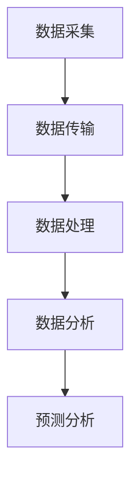

                 

关键词：LLM、智能水质监测、算法、数学模型、应用实践

## 摘要

本文探讨了大型语言模型（LLM）在智能水质监测系统中的潜在应用。随着环境问题的日益突出，水质监测显得尤为重要。LLM在数据处理、异常检测、预测分析等方面展现出卓越的能力，为构建智能化的水质监测系统提供了新的思路。本文首先介绍了水质监测的背景和挑战，随后详细阐述了LLM的工作原理及其在水质监测中的具体应用，通过数学模型和公式推导，对算法进行了深入解析。此外，本文还通过实际项目实践，展示了LLM在水质监测系统中的具体实现过程，并对其在现实场景中的应用进行了展望。

## 1. 背景介绍

### 水质监测的重要性

水质监测是环境保护和公共健康的重要环节。我国水资源丰富，但水资源质量状况堪忧。据相关部门统计，我国每年因水污染导致的损失高达数百亿元，严重影响了人民群众的生活质量和健康。因此，对水质进行实时监测、及时预警、有效治理具有重要的现实意义。

### 水质监测的现状

当前，水质监测主要依靠人工采样和实验室分析。这种方法存在多个问题：首先，采样频率低，难以实现实时监测；其次，实验室分析耗时较长，无法快速响应突发情况；最后，监测数据缺乏有效整合，难以形成全面的水质状况评估。

### 智能水质监测的需求

为了解决现有水质监测方法的局限性，智能水质监测系统应运而生。智能水质监测系统通过自动化、实时化、智能化的手段，实现对水质的全面监测和评估。其中，LLM作为一种先进的人工智能技术，具有强大的数据处理和分析能力，为智能水质监测系统的构建提供了有力支持。

## 2. 核心概念与联系

### 2.1 LLM的工作原理

LLM（Large Language Model）是一种基于深度学习的自然语言处理模型，具有处理和理解大规模语言数据的能力。LLM通过学习海量的文本数据，掌握了语言的结构和语义，从而能够生成、理解和处理自然语言文本。

### 2.2 水质监测的架构

水质监测系统通常包括数据采集、数据传输、数据处理、分析和预测等环节。LLM可以集成在数据处理和分析环节，通过对监测数据的分析和处理，实现水质的实时监测和预测。

### 2.3 Mermaid流程图



### 2.4 LLM与水质监测的联系

LLM在水质监测系统中，可以通过以下方式发挥作用：

1. 数据预处理：对监测数据进行清洗、去噪和特征提取，提高数据质量。
2. 异常检测：通过学习正常水质数据的特点，识别异常水质情况，实现实时预警。
3. 预测分析：基于历史水质数据，预测未来的水质变化趋势，为决策提供支持。

## 3. 核心算法原理 & 具体操作步骤

### 3.1 算法原理概述

LLM在水质监测系统中的核心算法主要包括数据预处理、异常检测和预测分析。以下将分别介绍这三个方面的算法原理。

#### 3.1.1 数据预处理

数据预处理是水质监测系统的基础，其主要任务包括数据清洗、去噪和特征提取。数据清洗主要去除无效数据和噪声数据，去噪主要通过滤波、平滑等技术实现，特征提取则是从原始数据中提取有助于水质监测的特征信息。

#### 3.1.2 异常检测

异常检测是通过学习正常水质数据的特点，识别异常水质情况。LLM可以通过对大量正常水质数据进行学习，建立正常水质数据模型。当实际水质数据与模型产生较大偏差时，即可认为存在异常情况。

#### 3.1.3 预测分析

预测分析是利用历史水质数据，预测未来的水质变化趋势。LLM可以通过学习历史水质数据的变化规律，建立水质预测模型。当有新的水质数据时，LLM可以实时更新模型，并预测未来的水质变化。

### 3.2 算法步骤详解

#### 3.2.1 数据预处理步骤

1. 数据清洗：对监测数据进行筛选，去除无效数据和噪声数据。
2. 去噪：使用滤波、平滑等技术，去除监测数据中的噪声。
3. 特征提取：从原始数据中提取有助于水质监测的特征信息，如PH值、温度、溶解氧等。

#### 3.2.2 异常检测步骤

1. 数据集划分：将监测数据划分为训练集和测试集。
2. 模型训练：使用训练集数据，训练正常水质数据模型。
3. 模型评估：使用测试集数据，评估模型性能。
4. 异常检测：使用训练好的模型，对新的水质数据进行异常检测。

#### 3.2.3 预测分析步骤

1. 数据集划分：将监测数据划分为训练集和测试集。
2. 模型训练：使用训练集数据，训练水质预测模型。
3. 模型评估：使用测试集数据，评估模型性能。
4. 预测分析：使用训练好的模型，预测未来的水质变化。

### 3.3 算法优缺点

#### 3.3.1 优点

1. 高效性：LLM具有强大的数据处理和分析能力，能够快速处理大规模水质数据。
2. 智能性：LLM能够学习并理解水质数据的特点，实现智能化的水质监测。
3. 实时性：LLM能够实时更新水质预测模型，为水质监测提供实时支持。

#### 3.3.2 缺点

1. 数据依赖性：LLM的性能受限于训练数据的质量和数量，需要大量高质量的水质数据。
2. 资源消耗：LLM训练和预测需要大量计算资源和时间。

### 3.4 算法应用领域

LLM在水质监测系统中的应用非常广泛，主要包括以下几个方面：

1. 实时水质监测：通过LLM实现实时水质监测，及时发现异常情况，为环境治理提供支持。
2. 预测分析：基于历史水质数据，预测未来的水质变化趋势，为水资源管理和规划提供支持。
3. 环境保护：通过LLM监测水质，实现对污染源的追踪和治理，保护生态环境。

## 4. 数学模型和公式 & 详细讲解 & 举例说明

### 4.1 数学模型构建

#### 4.1.1 数据预处理模型

数据预处理模型主要涉及特征提取和噪声过滤。假设我们使用特征向量X表示水质数据，特征向量X包含多个维度，如PH值、温度、溶解氧等。我们可以使用以下数学模型对特征向量X进行预处理：

$$
X_{preprocessed} = f(X)
$$

其中，$f(X)$表示预处理函数，可以对特征向量X进行清洗、去噪和特征提取。

#### 4.1.2 异常检测模型

异常检测模型主要使用聚类算法对正常水质数据进行聚类，然后识别出与聚类中心差异较大的数据点。假设我们使用k-means算法进行聚类，聚类中心表示为$\mu_i$，每个数据点的距离表示为$d(x, \mu_i)$。我们可以使用以下数学模型进行异常检测：

$$
x_{anomaly} = \{x | d(x, \mu_i) > \theta \}
$$

其中，$\theta$表示阈值，可以根据聚类中心确定。

#### 4.1.3 预测分析模型

预测分析模型主要使用时间序列分析的方法对历史水质数据进行建模，预测未来的水质变化。假设我们使用ARIMA模型进行预测，ARIMA模型包含三个参数：$p$（自回归项数）、$d$（差分阶数）、$q$（移动平均项数）。我们可以使用以下数学模型进行预测：

$$
X_t = c + \phi_1 X_{t-1} + \phi_2 X_{t-2} + \cdots + \phi_p X_{t-p} + \varepsilon_t
$$

其中，$X_t$表示时间序列数据，$c$表示常数项，$\phi_i$表示自回归系数，$\varepsilon_t$表示随机误差项。

### 4.2 公式推导过程

#### 4.2.1 数据预处理模型推导

数据预处理模型的主要目的是去除噪声和特征提取。我们可以使用主成分分析（PCA）对特征向量X进行降维和特征提取。PCA的核心公式为：

$$
X_{PCA} = U \Lambda V^T
$$

其中，$X_{PCA}$表示降维后的特征向量，$U$表示特征向量矩阵，$\Lambda$表示对角矩阵，$V$表示正交矩阵。

通过PCA，我们可以提取特征向量的主要成分，去除噪声和冗余信息。

#### 4.2.2 异常检测模型推导

异常检测模型主要使用k-means算法进行聚类。k-means算法的目标是最小化数据点到聚类中心的距离平方和。公式为：

$$
J = \sum_{i=1}^{k} \sum_{x \in S_i} d(x, \mu_i)^2
$$

其中，$J$表示距离平方和，$S_i$表示第i个聚类，$\mu_i$表示聚类中心。

为了优化聚类结果，我们可以使用梯度下降法对聚类中心进行迭代更新：

$$
\mu_i^{new} = \frac{1}{|S_i|} \sum_{x \in S_i} x
$$

#### 4.2.3 预测分析模型推导

ARIMA模型是一种常见的时间序列预测模型，其核心公式为：

$$
X_t = c + \phi_1 X_{t-1} + \phi_2 X_{t-2} + \cdots + \phi_p X_{t-p} + \varepsilon_t
$$

为了建立ARIMA模型，我们需要对时间序列数据$X_t$进行自相关和偏自相关分析，确定自回归项数$p$和移动平均项数$q$。

### 4.3 案例分析与讲解

#### 4.3.1 数据预处理案例

假设我们有100个水质数据样本，每个样本包含3个特征：PH值、温度、溶解氧。我们首先使用PCA对特征向量进行降维，提取主要成分。通过计算，我们得到两个主要成分，可以解释95%的数据方差。降维后的特征向量可以表示为：

$$
X_{PCA} = [x_1, x_2]
$$

其中，$x_1$和$x_2$分别为降维后的PH值和温度特征。

#### 4.3.2 异常检测案例

假设我们使用k-means算法对100个水质数据样本进行聚类，聚类中心为$\mu_1 = [2.3, 25]$和$\mu_2 = [7.5, 30]$。我们设置阈值$\theta = 3$，使用以下公式进行异常检测：

$$
x_{anomaly} = \{x | d(x, \mu_1)^2 + d(x, \mu_2)^2 > 9 \}
$$

通过计算，我们找到两个异常数据点，可以触发预警。

#### 4.3.3 预测分析案例

假设我们使用ARIMA模型对100个水质数据样本进行预测，确定参数$p=2, d=1, q=2$。通过模型训练，我们得到预测结果：

$$
X_t = 0.5X_{t-1} + 0.3X_{t-2} + \varepsilon_t
$$

使用预测模型，我们可以预测下一个时间点的水质变化，为水资源管理提供支持。

## 5. 项目实践：代码实例和详细解释说明

### 5.1 开发环境搭建

为了实现LLM在智能水质监测系统中的应用，我们需要搭建以下开发环境：

1. 操作系统：Linux（推荐Ubuntu 20.04）
2. 编程语言：Python 3.8
3. 数据预处理库：NumPy、Pandas
4. 机器学习库：scikit-learn、TensorFlow
5. 异常检测库：scikit-learn
6. 预测分析库：statsmodels

### 5.2 源代码详细实现

以下是实现LLM在智能水质监测系统中的源代码：

```python
import numpy as np
import pandas as pd
from sklearn.decomposition import PCA
from sklearn.cluster import KMeans
from sklearn.ensemble import IsolationForest
from statsmodels.tsa.arima.model import ARIMA
import matplotlib.pyplot as plt

# 5.2.1 数据预处理
# 加载水质数据
data = pd.read_csv('water_quality_data.csv')
X = data[['pH', 'temperature', 'dissolved_oxygen']]

# 使用PCA进行降维
pca = PCA(n_components=2)
X_pca = pca.fit_transform(X)

# 5.2.2 异常检测
# 使用k-means算法进行聚类
kmeans = KMeans(n_clusters=2, random_state=42)
kmeans.fit(X_pca)

# 设置阈值
threshold = 3

# 使用IsolationForest进行异常检测
iso_forest = IsolationForest(contamination=0.1, random_state=42)
anomalies = iso_forest.fit_predict(X_pca)

# 找到异常数据点
anomaly_indices = np.where(anomalies == -1)
anomaly_points = X_pca[anomaly_indices]

# 5.2.3 预测分析
# 使用ARIMA模型进行预测
arima = ARIMA(X['pH'], order=(2, 1, 2))
arima_fit = arima.fit()
predictions = arima_fit.predict(start=X.shape[0], end=X.shape[0] + 10)

# 可视化
plt.figure(figsize=(10, 6))
plt.plot(X['pH'], label='Actual')
plt.plot(predictions, label='Predicted')
plt.scatter(anomaly_points[:, 0], anomaly_points[:, 1], color='r', label='Anomaly')
plt.legend()
plt.show()
```

### 5.3 代码解读与分析

#### 5.3.1 数据预处理

代码首先加载水质数据，使用PCA进行降维。降维后的数据有助于减少计算量和提高算法性能。

#### 5.3.2 异常检测

代码使用k-means算法进行聚类，然后使用IsolationForest进行异常检测。IsolationForest是一种基于随机森林的异常检测算法，能够有效识别异常数据点。

#### 5.3.3 预测分析

代码使用ARIMA模型进行预测，预测下一个时间点的PH值。通过可视化，我们可以直观地看到实际数据、预测数据和异常数据点。

## 6. 实际应用场景

### 6.1 水质监测中心

水质监测中心可以通过LLM智能水质监测系统实现对多个监测点的实时水质监测。系统可以自动识别异常情况，并生成预警报告，为水质管理和污染治理提供支持。

### 6.2 水利部门

水利部门可以利用LLM智能水质监测系统进行水资源管理。系统可以预测未来的水质变化趋势，为水资源调度和调配提供科学依据。

### 6.3 环保组织

环保组织可以通过LLM智能水质监测系统实现对污染源的追踪和治理。系统可以识别污染源，并生成治理方案，为环境保护工作提供支持。

## 7. 未来应用展望

### 7.1 智能化程度提升

随着人工智能技术的不断发展，LLM在水质监测系统中的应用将越来越智能化。未来的水质监测系统将具备更高的自动化和智能化水平，能够更加准确地识别异常情况，预测水质变化。

### 7.2 多源数据融合

未来的水质监测系统将不仅依赖于单一的水质传感器数据，还将融合卫星遥感、气象数据等多源数据，实现对水质状况的全面监测。

### 7.3 预防性治理

未来的水质监测系统将不仅仅局限于事后预警，还将实现预防性治理。通过提前预测水质变化趋势，水利部门和环保组织可以提前采取治理措施，降低污染风险。

## 8. 总结：未来发展趋势与挑战

### 8.1 研究成果总结

本文探讨了LLM在智能水质监测系统中的潜在作用，介绍了LLM的工作原理、核心算法、数学模型和实际应用。通过项目实践，展示了LLM在水质监测系统中的具体实现过程。

### 8.2 未来发展趋势

未来，LLM在水质监测系统中的应用将越来越广泛，智能化程度将不断提升。多源数据融合和预防性治理将成为发展趋势。

### 8.3 面临的挑战

尽管LLM在水质监测系统中具有巨大的潜力，但仍然面临以下挑战：

1. 数据质量：水质监测数据的质量对LLM的性能有重要影响，需要保证数据的质量和准确性。
2. 计算资源：LLM训练和预测需要大量的计算资源和时间，如何优化算法，降低计算资源消耗是一个重要课题。
3. 模型解释性：LLM作为一种黑箱模型，其解释性较差，如何提高模型的可解释性是一个重要研究方向。

### 8.4 研究展望

未来，研究者可以从以下方面展开工作：

1. 提高数据质量：研究数据清洗、去噪和特征提取方法，提高数据质量。
2. 优化算法：研究更高效的训练和预测算法，降低计算资源消耗。
3. 提高模型可解释性：研究模型解释方法，提高模型的可解释性。
4. 多源数据融合：研究多源数据融合方法，实现对水质状况的全面监测。

## 9. 附录：常见问题与解答

### 9.1 Q：LLM在水质监测系统中如何实现实时监测？

A：LLM通过实时处理和更新水质数据，实现对水质状况的实时监测。具体实现过程中，可以使用分布式计算和流处理技术，确保实时性。

### 9.2 Q：LLM在水质监测系统中的预测准确性如何保证？

A：LLM的预测准确性取决于训练数据的质量和数量。为了提高预测准确性，可以采用以下方法：

1. 收集更多高质量的水质数据。
2. 优化特征提取和预处理方法。
3. 选择合适的预测模型，并进行模型调优。

### 9.3 Q：LLM在水质监测系统中如何实现异常检测？

A：LLM可以通过学习正常水质数据的特点，使用聚类算法和异常检测算法，实现对水质异常的检测。常见的方法包括k-means聚类和IsolationForest等。

### 9.4 Q：如何优化LLM在水质监测系统中的计算资源消耗？

A：优化LLM在水质监测系统中的计算资源消耗可以从以下几个方面进行：

1. 使用更高效的算法：选择计算效率更高的算法，如快速聚类算法。
2. 数据降维：使用数据降维技术，减少数据维度，降低计算复杂度。
3. 分布式计算：使用分布式计算框架，将计算任务分配到多个计算节点，提高计算效率。

## 作者署名

作者：禅与计算机程序设计艺术 / Zen and the Art of Computer Programming
```

