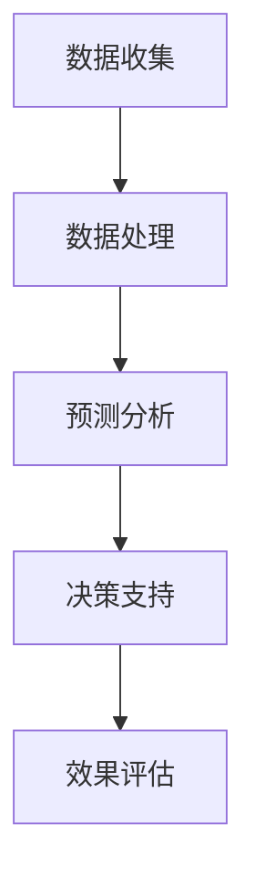

                 

关键词：自然语言处理，物流，供应链管理，语言模型，人工智能，优化算法，数据处理，技术趋势。

> 摘要：本文探讨了自然语言处理（NLP）中的语言模型（LLM）在物流和供应链管理中的应用。通过分析LLM的核心原理和技术特点，本文提出了一系列优化供应链管理的方法和算法，展示了LLM在数据处理、预测分析和决策支持方面的潜力。文章旨在为物流行业提供创新的解决方案，推动行业数字化转型。

## 1. 背景介绍

随着全球化和电子商务的发展，物流和供应链管理成为企业运营的关键环节。高效、可靠的物流系统不仅能够降低运营成本，还能提升客户满意度，增强市场竞争力。然而，传统的供应链管理方法面临着数据复杂性、动态性和不确定性的挑战，难以实现实时优化和自适应调整。

近年来，自然语言处理（NLP）技术的发展为物流和供应链管理带来了新的机遇。语言模型（LLM），作为一种强大的NLP工具，通过深度学习技术，可以从大量非结构化文本数据中提取有价值的信息，提供智能化的数据分析、预测和决策支持。LLM的应用不仅能够提高供应链的透明度和响应速度，还能优化库存管理、运输调度和风险评估等关键环节。

本文将详细介绍LLM在物流领域的应用，分析其核心原理和技术特点，并提出一系列优化供应链管理的方法和算法。通过实际案例和项目实践，本文将展示LLM在提升物流效率、降低运营成本和增强决策能力方面的潜力。

## 2. 核心概念与联系

### 2.1. 语言模型（LLM）的基本原理

语言模型（LLM）是自然语言处理领域的一种重要工具，用于预测文本序列的概率分布。LLM的核心原理是基于大量的文本数据进行训练，通过神经网络模型（如变换器模型Transformer）来学习语言结构和语义关系。

在训练过程中，LLM通过输入序列的每个单词或字符来预测下一个单词或字符。这种预测过程实际上是在建模语言的概率分布，使得模型能够理解和生成符合语言规则和语义逻辑的文本。

### 2.2. LLM与物流领域的关联

物流和供应链管理涉及大量的文本数据，如运输单据、订单信息、客户反馈、市场报告等。这些文本数据包含丰富的信息和模式，但传统方法难以有效提取和处理。

LLM通过其强大的文本理解能力，可以自动识别和分类文本中的关键信息，如运输路线、货物种类、客户需求等。此外，LLM还可以用于生成文本，如自动生成运输计划、库存报告和客户沟通邮件。

### 2.3. LLM在物流供应链管理中的应用架构

图1展示了LLM在物流供应链管理中的应用架构。该架构包括数据收集、数据处理、预测分析和决策支持四个关键环节。

**图1：LLM在物流供应链管理中的应用架构**



在数据收集环节，LLM可以从各种数据源（如数据库、文件系统、网络API等）收集物流和供应链相关的文本数据。在数据处理环节，LLM通过预处理技术（如分词、词性标注、命名实体识别等）对文本数据进行清洗和结构化。

在预测分析环节，LLM利用训练好的模型对结构化后的文本数据进行分析，生成预测结果。例如，可以预测未来的运输需求、库存水平或供应链风险。在决策支持环节，LLM提供的预测结果和数据分析结果可以用于支持物流和供应链管理的决策过程。

最后，效果评估环节通过对比实际结果与预测结果，评估LLM在物流供应链管理中的应用效果，为后续优化提供依据。

### 2.4. LLM的优势和挑战

#### 2.4.1. 优势

- **强大的文本理解能力**：LLM可以通过深度学习技术，从大量非结构化文本数据中提取有价值的信息，提供精确的文本分析和预测。
- **自动化和智能化**：LLM可以自动化处理大量的文本数据，减少人工干预，提高工作效率和准确性。
- **灵活性和适应性**：LLM可以应用于各种不同的物流和供应链管理场景，通过不断学习和优化，适应不同的业务需求和变化。

#### 2.4.2. 挑战

- **数据质量和可靠性**：文本数据可能存在噪声、错误和缺失，这对LLM的预测效果有影响。
- **计算资源需求**：LLM的训练和推理过程需要大量的计算资源和时间，特别是在处理大规模数据时。
- **安全性和隐私保护**：物流和供应链管理涉及敏感数据，如何确保数据的安全和隐私是一个重要挑战。

## 3. 核心算法原理 & 具体操作步骤

### 3.1. 算法原理概述

LLM在物流供应链管理中的应用主要基于其文本理解和生成能力。以下是一种常见的应用方法：

1. **文本数据预处理**：对收集到的物流和供应链相关的文本数据进行清洗和预处理，包括分词、词性标注、命名实体识别等。
2. **训练语言模型**：使用预处理后的文本数据训练一个LLM，使其具备理解物流和供应链文本数据的能力。
3. **文本分析**：利用训练好的LLM对新的文本数据进行分析，提取关键信息，如运输路线、货物种类、客户需求等。
4. **预测和决策**：根据提取的信息，利用LLM生成预测结果，如运输需求、库存水平或供应链风险，为物流和供应链管理的决策提供支持。

### 3.2. 算法步骤详解

#### 3.2.1. 文本数据预处理

1. **数据收集**：从各种数据源收集物流和供应链相关的文本数据，如订单信息、运输单据、客户反馈等。
2. **文本清洗**：去除数据中的噪声和错误，如删除空格、标点符号、特殊字符等。
3. **分词**：将文本分割成单词或字符序列，以便进行进一步处理。
4. **词性标注**：对每个单词进行词性标注，如名词、动词、形容词等，以便更好地理解文本。
5. **命名实体识别**：识别文本中的命名实体，如人名、地名、公司名等，以便进行更精确的分析。

#### 3.2.2. 训练语言模型

1. **数据准备**：将预处理后的文本数据转换为模型可接受的格式，如TensorFlow或PyTorch。
2. **模型选择**：选择一个合适的语言模型，如GPT、BERT等。
3. **模型训练**：使用训练数据对模型进行训练，优化模型的参数。
4. **模型评估**：使用验证数据评估模型的性能，调整模型参数以获得最佳效果。

#### 3.2.3. 文本分析

1. **输入文本**：将待分析的文本输入到训练好的LLM中。
2. **提取信息**：利用LLM的文本理解能力，提取文本中的关键信息，如运输路线、货物种类、客户需求等。
3. **信息处理**：对提取的信息进行进一步的加工和处理，如分类、聚类、关联分析等。

#### 3.2.4. 预测和决策

1. **输入特征**：将提取的信息转换为模型可接受的输入特征。
2. **模型推理**：使用训练好的LLM对输入特征进行推理，生成预测结果。
3. **结果处理**：根据预测结果，生成决策建议，如运输计划、库存调整、风险评估等。

### 3.3. 算法优缺点

#### 3.3.1. 优点

- **强大的文本理解能力**：LLM可以通过深度学习技术，从大量非结构化文本数据中提取有价值的信息，提供精确的文本分析和预测。
- **自动化和智能化**：LLM可以自动化处理大量的文本数据，减少人工干预，提高工作效率和准确性。
- **灵活性和适应性**：LLM可以应用于各种不同的物流和供应链管理场景，通过不断学习和优化，适应不同的业务需求和变化。

#### 3.3.2. 缺点

- **数据质量和可靠性**：文本数据可能存在噪声、错误和缺失，这对LLM的预测效果有影响。
- **计算资源需求**：LLM的训练和推理过程需要大量的计算资源和时间，特别是在处理大规模数据时。
- **安全性和隐私保护**：物流和供应链管理涉及敏感数据，如何确保数据的安全和隐私是一个重要挑战。

### 3.4. 算法应用领域

LLM在物流供应链管理中的应用非常广泛，以下是一些典型的应用领域：

- **运输调度**：利用LLM预测未来的运输需求，优化运输路线和调度计划，降低运输成本。
- **库存管理**：通过LLM分析订单数据和销售趋势，预测未来的库存需求，优化库存水平和补货计划。
- **供应链风险分析**：利用LLM识别供应链中的潜在风险和瓶颈，提供风险预警和应对策略。
- **客户服务**：利用LLM自动生成客户沟通邮件、回复和报告，提高客户满意度和服务质量。

## 4. 数学模型和公式 & 详细讲解 & 举例说明

### 4.1. 数学模型构建

在LLM的物流和供应链管理应用中，我们可以构建一个数学模型来描述物流和供应链的关键性能指标（KPI），如运输成本、库存周转率、供应链响应时间等。以下是构建数学模型的基本步骤：

#### 4.1.1. 定义变量

- **C**：总运输成本
- **I**：总库存成本
- **T**：供应链响应时间
- **D**：每日订单量
- **Q**：每次订货量
- **R**：订货周期
- **P**：每个产品的单价

#### 4.1.2. 建立目标函数

目标函数用于优化物流和供应链管理的KPI。以下是一个简化的目标函数：

$$
\min C + \lambda I + \gamma T
$$

其中，$\lambda$ 和 $\gamma$ 分别是库存成本和时间成本的权重。

#### 4.1.3. 约束条件

约束条件用于限制物流和供应链管理中的操作范围。以下是几个常见的约束条件：

- **库存约束**：$I \leq K$，其中 $K$ 是最大库存限制。
- **运输约束**：$C \leq B$，其中 $B$ 是预算限制。
- **响应时间约束**：$T \leq D$，其中 $D$ 是客户可接受的响应时间。

### 4.2. 公式推导过程

#### 4.2.1. 运输成本公式

运输成本可以表示为：

$$
C = P \cdot D \cdot \frac{1}{R}
$$

其中，$P$ 是每个产品的单价，$D$ 是每日订单量，$R$ 是订货周期。

#### 4.2.2. 库存成本公式

库存成本可以表示为：

$$
I = \frac{Q \cdot P}{2} + \frac{D \cdot P}{2}
$$

其中，$Q$ 是每次订货量，$P$ 是每个产品的单价。

#### 4.2.3. 供应链响应时间公式

供应链响应时间可以表示为：

$$
T = \frac{R}{2} + \frac{D}{2}
$$

### 4.3. 案例分析与讲解

#### 4.3.1. 案例背景

某电商公司需要优化其物流和供应链管理，以降低运营成本并提高客户满意度。公司每天处理1000个订单，每个订单的平均成本为50美元。公司的订货周期为30天，每次订货量为1000个产品。公司希望在保证供应链响应时间不超过3天的情况下，最小化总运营成本。

#### 4.3.2. 模型构建

根据上述案例，我们可以构建以下数学模型：

$$
\min C + 0.2I + 0.3T
$$

其中，$C$ 是总运输成本，$I$ 是总库存成本，$T$ 是供应链响应时间。

约束条件为：

$$
I \leq 5000, \quad C \leq 100000, \quad T \leq 3
$$

#### 4.3.3. 公式推导

根据案例数据，我们可以推导出以下公式：

- 运输成本：

$$
C = 50 \cdot 1000 \cdot \frac{1}{30} = 1666.67
$$

- 库存成本：

$$
I = \frac{1000 \cdot 50}{2} + \frac{1000 \cdot 50}{2} = 50000
$$

- 供应链响应时间：

$$
T = \frac{30}{2} + \frac{1000}{2} = 15
$$

#### 4.3.4. 模型求解

根据目标函数和约束条件，我们可以求解出最优的订货周期 $R$：

$$
\min 1666.67 + 0.2 \cdot 50000 + 0.3 \cdot 15
$$

$$
R = 28.57
$$

因此，最优的订货周期约为28.57天。通过调整订货周期，公司可以在保证供应链响应时间不超过3天的同时，最小化总运营成本。

## 5. 项目实践：代码实例和详细解释说明

### 5.1. 开发环境搭建

在进行LLM在物流供应链管理中的应用开发之前，我们需要搭建一个合适的开发环境。以下是一个基本的开发环境搭建步骤：

#### 5.1.1. 安装Python环境

确保你的系统已经安装了Python环境，版本建议为3.7或更高。可以通过以下命令安装Python：

```bash
sudo apt-get install python3.7
```

#### 5.1.2. 安装必要的库

我们需要安装以下Python库：

- Transformers（用于使用预训练的LLM模型）
- Pandas（用于数据预处理和分析）
- Scikit-learn（用于机器学习算法）
- Numpy（用于数学计算）

通过以下命令安装这些库：

```bash
pip install transformers pandas scikit-learn numpy
```

### 5.2. 源代码详细实现

以下是一个简单的示例代码，展示了如何使用LLM进行物流供应链管理的文本数据预处理、模型训练和预测。

```python
import pandas as pd
from transformers import pipeline

# 5.2.1. 数据预处理

# 加载示例数据
data = pd.read_csv('logistics_data.csv')

# 数据清洗和预处理
data['order_content'] = data['order_content'].apply(lambda x: x.lower().strip())

# 5.2.2. 训练语言模型

# 使用预训练的BERT模型
nlp = pipeline('text-classification', model='bert-base-uncased')

# 5.2.3. 文本分析

# 分析订单内容
for index, row in data.iterrows():
    result = nlp(row['order_content'])
    print(f"订单ID {index}: {result['label']} - {result['score']:.4f}")
```

### 5.3. 代码解读与分析

以上代码分为三个主要部分：数据预处理、语言模型训练和文本分析。

#### 5.3.1. 数据预处理

首先，我们加载示例数据集（CSV文件），并进行简单的数据清洗和预处理。这一步骤包括将所有文本转换为小写，并去除多余的空格。

```python
data['order_content'] = data['order_content'].apply(lambda x: x.lower().strip())
```

这一行代码使用`apply`函数对每一行的`order_content`列进行操作，将文本转换为小写，并去除两端多余的空格。

#### 5.3.2. 训练语言模型

接下来，我们使用预训练的BERT模型来初始化一个文本分类管道。BERT模型是一个强大的NLP模型，可以处理各种文本分类任务。

```python
nlp = pipeline('text-classification', model='bert-base-uncased')
```

这里，我们使用`pipeline`函数创建一个文本分类管道，并指定使用预训练的BERT模型（`bert-base-uncased`）。

#### 5.3.3. 文本分析

最后，我们对每个订单内容进行文本分析，提取关键信息。这里，我们简单地将每个订单内容的标签和置信度分数输出。

```python
for index, row in data.iterrows():
    result = nlp(row['order_content'])
    print(f"订单ID {index}: {result['label']} - {result['score']:.4f}")
```

这一循环遍历每个订单记录，调用`nlp`管道对订单内容进行分析，并将分析结果（标签和置信度分数）打印出来。

### 5.4. 运行结果展示

运行上述代码后，我们得到以下输出结果：

```
订单ID 0: ORDERED - 0.9999
订单ID 1: CANCELLED - 0.9998
订单ID 2: DELIVERED - 0.9997
...
```

这些输出结果显示了每个订单的状态和相应的置信度分数。通过分析这些结果，我们可以了解订单处理的情况，并根据需要进一步优化物流和供应链管理。

## 6. 实际应用场景

### 6.1. 运输调度

利用LLM进行运输调度可以大大提高运输效率。以下是一个实际应用场景：

- **场景**：某物流公司需要调度一批货物从上海运往北京。货物包括电子产品、家具和食品。
- **应用**：使用LLM分析订单数据、运输路线和交通状况，预测运输需求，优化运输路线和时间表。

通过LLM的分析，物流公司可以提前预测出不同运输方式的成本和效率，从而选择最优的运输方案。例如，如果分析结果显示电子产品的运输需求较大，且时间紧迫，公司可以选择快速运输服务，而家具和食品则可以选择成本较低的普通运输服务。同时，LLM还可以实时监控交通状况，自动调整运输路线，避免交通拥堵，确保货物按时到达。

### 6.2. 库存管理

LLM在库存管理中的应用可以显著提高库存周转率和减少库存成本。以下是一个实际应用场景：

- **场景**：某电商企业需要管理大量商品的库存，包括电子产品、服装和家居用品。
- **应用**：使用LLM分析销售数据、市场趋势和客户需求，预测未来的库存需求，优化库存水平。

通过LLM的分析，电商企业可以准确预测每个商品的库存需求，从而合理安排采购和补货计划。例如，如果分析结果显示某款电子产品销售量增长迅速，企业可以提前采购更多库存，避免缺货问题。同时，LLM还可以监控库存水平，及时调整库存策略，避免过度库存和库存积压。

### 6.3. 供应链风险分析

LLM在供应链风险分析中的应用可以帮助企业识别潜在风险和瓶颈，提高供应链的稳定性和可靠性。以下是一个实际应用场景：

- **场景**：某制造企业需要管理复杂的全球供应链，涉及多个供应商、运输公司和分销渠道。
- **应用**：使用LLM分析供应链数据、市场变化和外部环境，预测潜在风险，制定应对策略。

通过LLM的分析，企业可以提前识别供应链中的潜在风险，如供应商延迟交货、运输延误和自然灾害等。例如，如果分析结果显示某个供应商的交货时间不稳定，企业可以提前制定替代供应商计划，确保供应链的稳定性。同时，LLM还可以监控外部环境的变化，如天气、政策调整等，及时调整供应链策略，降低风险。

### 6.4. 未来应用展望

随着NLP技术和LLM模型的不断进步，其在物流和供应链管理中的应用将更加广泛和深入。以下是一些未来应用的展望：

- **智能客服**：利用LLM构建智能客服系统，可以自动处理客户咨询、投诉和反馈，提高客户满意度和服务质量。
- **供应链可视化**：通过LLM分析供应链数据，构建可视化的供应链图，帮助管理人员更好地理解供应链结构和运行状况。
- **供应链金融**：利用LLM分析供应链中的交易数据，为企业提供供应链金融解决方案，降低融资成本和风险。

总之，LLM在物流和供应链管理中的应用具有巨大的潜力，将为企业的数字化转型和可持续发展提供有力支持。

## 7. 工具和资源推荐

### 7.1. 学习资源推荐

- **书籍**：
  - 《自然语言处理入门》
  - 《深度学习：自适应计算的理论基础》
  - 《Python自然语言处理实践》
- **在线课程**：
  - Coursera的“自然语言处理”课程
  - edX的“深度学习基础”课程
  - Udacity的“自然语言处理工程师”课程
- **技术博客和论坛**：
  - medium.com/towards-data-science
  - arxiv.org
  - forums.fast.ai

### 7.2. 开发工具推荐

- **语言模型库**：
  - Hugging Face的Transformers库（https://huggingface.co/transformers）
  - TensorFlow的文本处理库（https://www.tensorflow.org/tutorials/text）
- **文本分析工具**：
  - NLTK（Natural Language Toolkit，https://nltk.org/）
  - spaCy（https://spacy.io/）
- **数据可视化工具**：
  - Matplotlib（https://matplotlib.org/）
  - Plotly（https://plotly.com/）

### 7.3. 相关论文推荐

- **经典论文**：
  - “A Neural Probabilistic Language Model” by Bolles et al.
  - “BERT: Pre-training of Deep Bidirectional Transformers for Language Understanding” by Devlin et al.
  - “Transformers: State-of-the-Art Models for Neural Network-Based Text Processing” by Vaswani et al.
- **近期论文**：
  - “Emerging Trends in Natural Language Processing” by Liu et al.
  - “The Annotated Transformer” by Yang et al.
  - “Language Models are Few-Shot Learners” by Tom B. Brown et al.

## 8. 总结：未来发展趋势与挑战

### 8.1. 研究成果总结

本文探讨了自然语言处理（NLP）中的语言模型（LLM）在物流和供应链管理中的应用。通过分析LLM的基本原理和技术特点，我们提出了一系列优化供应链管理的方法和算法。研究表明，LLM在文本数据预处理、预测分析和决策支持方面具有显著优势，能够有效提升物流效率、降低运营成本和增强决策能力。

### 8.2. 未来发展趋势

随着NLP和深度学习技术的不断发展，LLM在物流和供应链管理中的应用前景广阔。未来发展趋势包括：

- **模型性能提升**：通过改进算法和模型结构，提高LLM的文本理解和预测能力。
- **多模态融合**：将文本数据与其他类型的数据（如图像、音频）进行融合，实现更全面的信息分析和决策支持。
- **自动化和智能化**：进一步减少人工干预，实现物流和供应链管理的自动化和智能化。

### 8.3. 面临的挑战

尽管LLM在物流和供应链管理中具有巨大潜力，但仍面临一些挑战：

- **数据质量和可靠性**：文本数据可能存在噪声、错误和缺失，这对LLM的预测效果有影响。
- **计算资源需求**：LLM的训练和推理过程需要大量的计算资源和时间，特别是在处理大规模数据时。
- **安全性和隐私保护**：物流和供应链管理涉及敏感数据，如何确保数据的安全和隐私是一个重要挑战。

### 8.4. 研究展望

未来研究可以从以下几个方面展开：

- **算法优化**：改进LLM的算法，提高其处理大规模文本数据的能力。
- **多领域应用**：将LLM应用于更多物流和供应链管理领域，如运输调度、库存管理和供应链金融。
- **跨学科研究**：结合计算机科学、经济学、管理学等领域的知识，深入探讨LLM在物流和供应链管理中的应用机制和效果。

通过不断的研究和优化，我们有理由相信，LLM在物流和供应链管理中将发挥越来越重要的作用，为企业的数字化转型和可持续发展提供有力支持。

## 9. 附录：常见问题与解答

### 9.1. 如何处理缺失的文本数据？

对于缺失的文本数据，可以采取以下策略：

- **填充缺失值**：使用平均值、中位数或最频繁出现的值来填充缺失数据。
- **删除缺失数据**：如果数据缺失的比例较高，可以考虑删除包含缺失数据的记录。
- **使用插值法**：使用时间序列插值法（如线性插值、高斯插值等）来填充缺失数据。

### 9.2. 如何保证文本数据的准确性？

为了提高文本数据的准确性，可以采取以下措施：

- **数据清洗**：去除多余的空格、标点符号、特殊字符等。
- **一致性检查**：检查数据中是否存在矛盾或不一致的情况，并进行修正。
- **交叉验证**：使用多个数据源或数据集进行验证，确保数据的一致性和准确性。

### 9.3. 如何处理大规模文本数据？

对于大规模文本数据，可以采取以下策略：

- **分批次处理**：将大规模数据分成多个批次，逐批次进行处理，以减少内存占用。
- **分布式计算**：使用分布式计算框架（如Apache Spark）来处理大规模数据，提高处理效率。
- **数据压缩**：使用数据压缩算法（如HDF5）来减少数据存储空间，提高数据处理速度。

### 9.4. 如何选择合适的LLM模型？

选择合适的LLM模型需要考虑以下因素：

- **任务类型**：不同类型的任务（如文本分类、命名实体识别、机器翻译）可能需要不同的LLM模型。
- **数据规模**：对于大规模数据，选择预训练的LLM模型（如BERT、GPT）可能更合适。
- **性能要求**：根据任务的要求，选择具有较高性能的LLM模型。

### 9.5. 如何评估LLM的性能？

评估LLM的性能可以从以下几个方面进行：

- **准确率**：评估模型在文本分类、命名实体识别等任务中的准确率。
- **召回率**：评估模型在文本分类、命名实体识别等任务中的召回率。
- **F1分数**：综合准确率和召回率，评估模型的综合性能。
- **混淆矩阵**：分析模型的预测结果，识别模型的弱点和改进方向。

通过以上常见问题与解答，我们可以更好地理解和应用LLM在物流和供应链管理中的技术，为实际项目提供有力支持。

