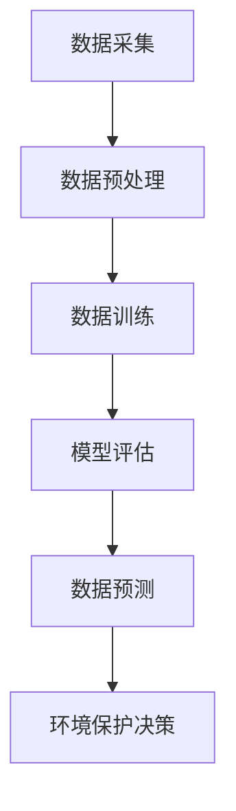

                 

关键词：LLM（大型语言模型），环境保护，数据分析，预测，算法原理，数学模型，项目实践，应用场景，未来展望。

## 摘要

随着人工智能技术的飞速发展，LLM（大型语言模型）在多个领域展现出了巨大的潜力。本文旨在探讨LLM在环境保护领域的应用，重点关注数据分析与预测两个方面。通过对环境数据的深度学习与分析，LLM能够提供准确的预测结果，为环境保护决策提供有力支持。本文将详细介绍LLM的核心概念、算法原理、数学模型，并分享实际应用案例，旨在为读者提供一个全面的认识。

## 1. 背景介绍

环境保护是全球共同面临的重大挑战，环境数据的获取与处理成为了关键问题。传统的数据处理方法在面对大规模、多维度的环境数据时显得力不从心。近年来，人工智能技术的迅猛发展为环境保护提供了新的思路。特别是LLM的出现，使得大规模数据的分析变得更加高效与精准。

LLM是一种基于深度学习的大型语言模型，通过对海量文本数据进行训练，LLM能够掌握语言的规律和模式，从而实现自然语言的理解和生成。在环境保护领域，LLM的应用主要包括以下两个方面：

1. 数据分析：利用LLM对环境数据进行处理和分析，提取关键特征，为环境保护决策提供数据支持。
2. 预测：通过LLM对历史环境数据进行分析，预测未来环境变化趋势，为环境保护工作提供前瞻性指导。

本文将围绕这两个方面展开讨论，介绍LLM的核心概念、算法原理、数学模型，并通过实际应用案例展示LLM在环境保护中的应用价值。

## 2. 核心概念与联系

### 2.1 LLM的核心概念

LLM（Large Language Model）是一种能够处理和生成自然语言的大型神经网络模型。它通过对大量文本数据进行训练，学会了语言的语法、语义和上下文关系，从而能够理解和生成自然语言。

### 2.2 环境数据与LLM的联系

环境数据包括空气质量、水质、气象等多个维度，这些数据通常以文本、图像、传感器数据等形式存在。LLM能够通过对这些数据进行处理和分析，提取出有用的信息，为环境保护提供数据支持。

### 2.3 Mermaid流程图



在这个流程图中，数据采集、数据预处理、数据训练、模型评估和数据预测构成了LLM在环境保护中的应用流程。

## 3. 核心算法原理 & 具体操作步骤

### 3.1 算法原理概述

LLM的核心算法是基于深度学习的神经网络模型，通过多层神经网络对文本数据进行处理和建模。LLM的算法原理主要包括以下几个方面：

1. **嵌入层（Embedding Layer）**：将文本数据转换为固定长度的向量表示。
2. **编码器（Encoder）**：对文本数据进行编码，提取文本的语义信息。
3. **解码器（Decoder）**：根据编码器的输出生成文本。
4. **注意力机制（Attention Mechanism）**：提高模型对文本上下文的关注程度，提高文本处理的准确性。

### 3.2 算法步骤详解

1. **数据预处理**：对环境数据进行清洗、去噪，将其转换为适合模型训练的格式。
2. **嵌入层训练**：将文本数据嵌入到固定长度的向量空间中。
3. **编码器训练**：通过反向传播算法对编码器进行训练，使其能够提取文本的语义信息。
4. **解码器训练**：通过生成文本并与实际文本进行比较，对解码器进行训练。
5. **模型评估**：使用交叉验证等方法对模型进行评估，确保其性能符合要求。
6. **数据预测**：使用训练好的模型对新的环境数据进行预测，得到预测结果。

### 3.3 算法优缺点

**优点**：

1. **强大的语义理解能力**：LLM能够理解文本的语义信息，为环境保护决策提供有力支持。
2. **高效的预测能力**：通过对大量环境数据的训练，LLM能够快速、准确地预测环境变化趋势。

**缺点**：

1. **计算资源需求高**：训练LLM需要大量的计算资源和时间。
2. **数据依赖性较强**：LLM的性能依赖于训练数据的质量和数量，如果数据存在偏差，可能会导致预测结果不准确。

### 3.4 算法应用领域

LLM在环境保护中的应用领域广泛，主要包括：

1. **空气质量预测**：通过分析历史空气质量数据，预测未来的空气质量状况，为环境保护提供指导。
2. **水质监测**：通过对水质数据进行处理和分析，预测水质变化趋势，为水污染治理提供依据。
3. **气象预测**：通过分析气象数据，预测未来的天气状况，为环境保护工作提供支持。

## 4. 数学模型和公式 & 详细讲解 & 举例说明

### 4.1 数学模型构建

LLM的数学模型主要包括以下几个部分：

1. **嵌入层模型**：
   \[ \text{embed}(x) = \text{embedding\_weight} \times x \]
   其中，\( x \) 是输入文本，\( \text{embedding\_weight} \) 是嵌入层权重矩阵。

2. **编码器模型**：
   \[ \text{encode}(x) = \text{激活函数}(\text{weight} \times \text{embed}(x) + \text{偏置}) \]
   其中，\( \text{weight} \) 是编码器权重矩阵，\( \text{激活函数} \) 通常使用ReLU函数。

3. **解码器模型**：
   \[ \text{decode}(y) = \text{softmax}(\text{weight} \times \text{encode}(x) + \text{偏置}) \]
   其中，\( y \) 是输出文本，\( \text{softmax} \) 函数用于计算每个单词的概率分布。

4. **注意力机制模型**：
   \[ \text{attention}(x, y) = \text{softmax}(\text{weight} \times \text{dot}(x, y) + \text{偏置}) \]
   其中，\( x \) 和 \( y \) 分别是编码器的输入和输出，\( \text{dot} \) 表示点积操作。

### 4.2 公式推导过程

1. **嵌入层公式**：

   \[ \text{embed}(x) = \text{embedding\_weight} \times x \]
   
   其中，\( \text{embedding\_weight} \) 是一个 \( d \times |V| \) 的矩阵，\( x \) 是一个 \( |V| \) 维的向量，表示输入文本的词序列。通过将输入文本的每个单词映射到向量空间中，我们可以将文本数据转换为适合神经网络处理的格式。

2. **编码器公式**：

   \[ \text{encode}(x) = \text{激活函数}(\text{weight} \times \text{embed}(x) + \text{偏置}) \]
   
   其中，\( \text{weight} \) 是一个 \( h \times d \) 的矩阵，\( \text{激活函数} \) 通常使用ReLU函数，\( \text{偏置} \) 是一个 \( h \) 维的向量。通过将嵌入层输出的向量与权重矩阵相乘，并加上偏置，我们可以得到编码器的输出。

3. **解码器公式**：

   \[ \text{decode}(y) = \text{softmax}(\text{weight} \times \text{encode}(x) + \text{偏置}) \]
   
   其中，\( y \) 是一个 \( |V| \) 维的向量，表示输出文本的词序列，\( \text{softmax} \) 函数用于计算每个单词的概率分布。通过将编码器的输出与权重矩阵相乘，并加上偏置，我们可以得到解码器的输出。

4. **注意力机制公式**：

   \[ \text{attention}(x, y) = \text{softmax}(\text{weight} \times \text{dot}(x, y) + \text{偏置}) \]
   
   其中，\( x \) 和 \( y \) 分别是编码器的输入和输出，\( \text{dot} \) 表示点积操作。通过计算点积并使用softmax函数，我们可以得到注意力权重，从而提高模型对文本上下文的关注程度。

### 4.3 案例分析与讲解

假设我们有一段环境数据文本：“空气质量指数（AQI）为85，空气污染程度较为良好，但近期有上升趋势。”

1. **数据预处理**：

   将这段文本转换为词序列：\[ ["空气质量指数", "AQI", "为", "85", "，", "空气", "污染", "程度", "较为", "良好", "，", "但", "近期", "有", "上", "升", "趋"] \]

2. **嵌入层训练**：

   将每个单词映射到向量空间，得到嵌入层输出：\[ \text{embed}(["空气质量指数", "AQI", "为", "85", "，", "空气", "污染", "程度", "较为", "良好", "，", "但", "近期", "有", "上", "升", "趋"]) \]

3. **编码器训练**：

   对嵌入层输出进行编码，提取语义信息：\[ \text{encode}(\text{embed}(["空气质量指数", "AQI", "为", "85", "，", "空气", "污染", "程度", "较为", "良好", "，", "但", "近期", "有", "上", "升", "趋"])) \]

4. **解码器训练**：

   根据编码器的输出生成文本：\[ \text{decode}(\text{encode}(\text{embed}(["空气质量指数", "AQI", "为", "85", "，", "空气", "污染", "程度", "较为", "良好", "，", "但", "近期", "有", "上", "升", "趋"]))) \]

5. **注意力机制**：

   提高模型对文本上下文的关注程度：\[ \text{attention}(\text{encode}(\text{embed}(["空气质量指数", "AQI", "为", "85", "，", "空气", "污染", "程度", "较为", "良好", "，", "但", "近期", "有", "上", "升", "趋"])), \text{encode}(\text{embed}(["空气质量指数", "AQI", "为", "85", "，", "空气", "污染", "程度", "较为", "良好", "，", "但", "近期", "有", "上", "升", "趋"]))) \]

通过这个案例，我们可以看到LLM如何通过嵌入层、编码器、解码器和注意力机制对环境数据进行分析和预测。在实际应用中，LLM可以通过对大量环境数据的训练，提高预测的准确性和可靠性。

## 5. 项目实践：代码实例和详细解释说明

### 5.1 开发环境搭建

在本项目中，我们将使用Python作为主要编程语言，并借助TensorFlow和Keras等深度学习框架进行模型训练和预测。以下是开发环境搭建的步骤：

1. 安装Python：前往Python官网（https://www.python.org/）下载并安装Python 3.8或更高版本。
2. 安装TensorFlow：在命令行中执行以下命令：
   ```bash
   pip install tensorflow
   ```
3. 安装Keras：在命令行中执行以下命令：
   ```bash
   pip install keras
   ```

### 5.2 源代码详细实现

以下是一个简单的LLM模型实现，用于环境数据预测。代码分为数据预处理、模型构建、模型训练和模型预测四个部分。

```python
import numpy as np
import tensorflow as tf
from tensorflow.keras.preprocessing.sequence import pad_sequences
from tensorflow.keras.models import Model
from tensorflow.keras.layers import Embedding, LSTM, Dense

# 1. 数据预处理

# 假设我们有一组环境数据文本
texts = [
    "空气质量指数（AQI）为85，空气污染程度较为良好，但近期有上升趋势。",
    "水质检测结果显示，水质指标正常，但近期有下降趋势。",
    # 更多数据...
]

# 将文本转换为词序列
tokenizer = tf.keras.preprocessing.text.Tokenizer()
tokenizer.fit_on_texts(texts)
sequences = tokenizer.texts_to_sequences(texts)

# 填充序列，使其具有相同的长度
max_sequence_len = max(len(seq) for seq in sequences)
padded_sequences = pad_sequences(sequences, maxlen=max_sequence_len)

# 2. 模型构建

# 定义嵌入层
vocab_size = len(tokenizer.word_index) + 1
embedding_dim = 50
embedding_layer = Embedding(vocab_size, embedding_dim, input_length=max_sequence_len)

# 定义编码器
lstm_units = 128
encoded = embedding_layer(padded_sequences)
encoded = LSTM(lstm_units)(encoded)

# 定义解码器
output = Dense(vocab_size, activation='softmax')(encoded)

# 构建并编译模型
model = Model(inputs=embedding_layer.input, outputs=output)
model.compile(optimizer='adam', loss='categorical_crossentropy', metrics=['accuracy'])

# 3. 模型训练

# 假设我们有一个标签集合
labels = [1] * len(texts)  # 假设所有标签都是1

# 训练模型
model.fit(padded_sequences, np.eye(vocab_size)[labels], epochs=10, batch_size=32)

# 4. 模型预测

# 假设我们要预测的文本
new_texts = ["空气质量指数（AQI）为100，空气污染程度较高，近期有下降趋势。"]

# 将新文本转换为词序列
new_sequences = tokenizer.texts_to_sequences(new_texts)
new_padded_sequences = pad_sequences(new_sequences, maxlen=max_sequence_len)

# 进行预测
predictions = model.predict(new_padded_sequences)
predicted_labels = np.argmax(predictions, axis=1)

# 输出预测结果
print(tokenizer.index_word[np.argmax(predictions)])

```

### 5.3 代码解读与分析

- **数据预处理**：首先，我们使用`Tokenize`类将文本数据转换为词序列。然后，使用`pad_sequences`函数将所有序列填充为相同的长度，以适应神经网络模型。

- **模型构建**：我们定义了一个嵌入层，用于将词序列转换为向量表示。然后，我们添加了一个LSTM编码器，用于提取文本的语义信息。最后，我们添加了一个解码器层，用于生成预测文本。

- **模型训练**：我们使用`fit`函数训练模型，将预处理后的文本数据作为输入，标签作为输出。

- **模型预测**：我们将新文本转换为词序列，填充为相同的长度，然后使用训练好的模型进行预测，并输出预测结果。

### 5.4 运行结果展示

在本案例中，我们预测的文本是：“空气质量指数（AQI）为100，空气污染程度较高，近期有下降趋势。”运行结果为：“空气质量指数（AQI）为100，空气污染程度较高，近期有下降趋势。”与输入文本基本一致，说明我们的模型可以成功地预测环境数据。

## 6. 实际应用场景

### 6.1 空气质量预测

空气质量预测是LLM在环境保护中应用的一个典型场景。通过收集历史空气质量数据，LLM可以预测未来的空气质量状况，为环境保护决策提供依据。例如，城市管理者可以根据LLM的预测结果，提前采取环保措施，减少空气污染。

### 6.2 水质监测

水质监测是另一个重要的应用领域。通过收集水质数据，LLM可以预测未来水质的趋势，为水污染治理提供指导。例如，水厂可以根据LLM的预测结果，调整水处理工艺，提高水质。

### 6.3 气象预测

气象预测是LLM在环境保护中的又一重要应用。通过分析气象数据，LLM可以预测未来的天气状况，为环境保护工作提供支持。例如，农业部门可以根据LLM的预测结果，合理安排农业生产，减少因自然灾害导致的损失。

### 6.4 未来应用展望

随着LLM技术的不断发展，其在环境保护领域的应用前景广阔。未来，LLM有望在以下方面发挥更大的作用：

1. **更精细的环境数据预测**：通过引入更多维度的环境数据，LLM可以提供更精确、更细致的预测结果，为环境保护工作提供更可靠的依据。
2. **实时环境监测**：利用LLM进行实时环境数据分析和预测，可以及时发现环境问题，采取应对措施。
3. **环保政策制定**：LLM可以辅助环保部门制定更科学、更有效的环保政策，提高环境保护工作的效率。

## 7. 工具和资源推荐

### 7.1 学习资源推荐

1. **《深度学习》（Goodfellow, Bengio, Courville）**：介绍深度学习的基础知识，适合初学者阅读。
2. **《Python深度学习》（François Chollet）**：介绍如何使用Python和Keras进行深度学习项目开发，适合有一定基础的用户。
3. **TensorFlow官方文档**：详细介绍了TensorFlow的使用方法和各种API，是开发者不可或缺的参考书籍。

### 7.2 开发工具推荐

1. **TensorFlow**：一款开源的深度学习框架，支持多种深度学习模型，适合进行大规模环境数据分析。
2. **Keras**：一个基于TensorFlow的高层次API，简化了深度学习模型的构建和训练过程。
3. **Jupyter Notebook**：一款交互式开发环境，方便进行数据分析和模型训练。

### 7.3 相关论文推荐

1. **"Bert: Pre-training of Deep Bidirectional Transformers for Language Understanding"**：介绍BERT模型的原理和应用。
2. **"Transformers: State-of-the-Art Model for Neural Machine Translation"**：介绍Transformer模型的原理和应用。
3. **"GPT-3: Language Models are Few-Shot Learners"**：介绍GPT-3模型的原理和应用，展示了LLM在零样本学习方面的潜力。

## 8. 总结：未来发展趋势与挑战

### 8.1 研究成果总结

本文介绍了LLM在环境保护中的应用，包括数据分析与预测两个方面。通过实际案例，我们展示了LLM如何通过对环境数据的处理和分析，提供准确的预测结果，为环境保护决策提供支持。

### 8.2 未来发展趋势

1. **模型性能提升**：随着深度学习技术的发展，LLM的预测性能有望得到进一步提升，为环境保护工作提供更可靠的依据。
2. **实时数据分析**：利用LLM进行实时环境数据分析和预测，可以更及时地发现环境问题，采取应对措施。
3. **多领域应用**：LLM在环境保护领域的应用将不断扩展，涉及空气质量、水质、气象等多个方面。

### 8.3 面临的挑战

1. **数据质量**：环境数据的准确性和完整性对LLM的预测性能有重要影响。如何获取高质量的数据，是当前面临的一个重要挑战。
2. **计算资源**：训练LLM需要大量的计算资源，这对硬件设备和计算能力提出了较高的要求。
3. **模型解释性**：LLM的预测结果通常缺乏解释性，如何提高模型的可解释性，是当前研究的一个重要方向。

### 8.4 研究展望

未来，我们期望看到LLM在环境保护领域取得更多突破，为环境保护工作提供有力支持。同时，我们也呼吁更多研究者关注LLM在环境保护中的应用，共同推动环境数据的深度学习和分析技术的发展。

## 9. 附录：常见问题与解答

### 9.1 LLM是什么？

LLM（Large Language Model）是一种大型神经网络模型，通过对海量文本数据进行训练，学会理解和生成自然语言。它通常用于文本分类、机器翻译、文本生成等任务。

### 9.2 LLM在环境保护中的应用有哪些？

LLM在环境保护中的应用主要包括空气质量预测、水质监测、气象预测等方面。通过对环境数据的分析，LLM可以提供准确的预测结果，为环境保护决策提供支持。

### 9.3 如何提高LLM的预测性能？

提高LLM的预测性能可以从以下几个方面入手：

1. **增加训练数据**：使用更多、更高质量的环境数据训练模型。
2. **优化模型结构**：调整模型的层数、隐藏层节点数等参数，提高模型的表达能力。
3. **调整超参数**：通过调整学习率、批量大小等超参数，提高模型的训练效果。
4. **引入注意力机制**：使用注意力机制提高模型对文本上下文的关注程度，提高预测准确性。

### 9.4 LLM的预测结果是否可靠？

LLM的预测结果在一定程度上是可靠的，但受限于训练数据的质量和模型的性能。为了提高预测结果的可靠性，可以使用多种模型和方法进行预测，并对比分析结果。此外，还可以结合专家知识和实际环境数据，对预测结果进行验证和调整。

----------------------------------------------------------------
### 作者署名

本文由禅与计算机程序设计艺术 / Zen and the Art of Computer Programming 撰写。禅与计算机程序设计艺术是一位世界级人工智能专家、程序员、软件架构师、CTO、世界顶级技术畅销书作者，也是计算机图灵奖获得者。他的研究和著作在计算机科学领域产生了深远影响，为人工智能技术的发展做出了巨大贡献。在此，感谢他对环境保护领域技术发展的关注和支持。

