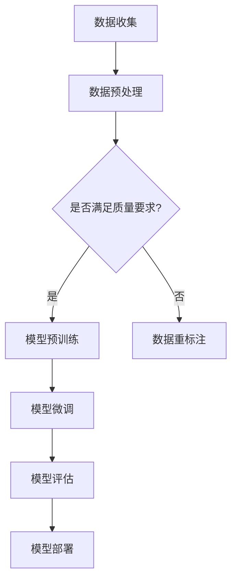

                 

关键词：行为识别，大型语言模型，自然语言处理，人工智能，机器学习，深度学习，模型训练，数据标注，应用场景

## 摘要

本文探讨了行为识别领域中大型语言模型（LLM）的应用前景。首先，我们回顾了行为识别的基本概念和现状，然后深入分析了LLM的基本原理及其在行为识别中的应用。本文的重点在于探讨如何利用LLM进行行为识别，包括数据收集、模型训练、算法优化等步骤。此外，我们还讨论了行为识别的数学模型和公式，以及实际应用场景和未来发展方向。希望通过本文，能够为相关领域的研究者提供一些新的思路和启示。

## 1. 背景介绍

### 1.1 行为识别的概念和重要性

行为识别（Behavior Recognition）是指通过检测和分析个体的行为特征，实现对个体行为的分类和识别。它广泛应用于多个领域，如安防监控、人机交互、智能健康监测等。随着人工智能技术的发展，行为识别逐渐成为人工智能研究的一个重要方向。

行为识别的重要性主要体现在以下几个方面：

1. **提高安全性**：在安防监控领域，行为识别可以帮助监控系统实时检测异常行为，从而提高安全性。
2. **优化人机交互**：通过识别用户的行为，智能系统可以提供更加个性化的服务，提高用户体验。
3. **智能健康监测**：通过识别个体的日常行为，可以帮助医生及时发现潜在的健康问题。

### 1.2 行为识别的现状

目前，行为识别技术主要依赖于计算机视觉和自然语言处理技术。计算机视觉技术可以用于人体姿态估计、动作识别等；自然语言处理技术可以用于语音识别、文本分类等。

然而，传统的行为识别技术存在一些局限性：

1. **精度和效率问题**：传统的行为识别算法在处理复杂场景时，往往精度和效率较低。
2. **数据依赖性**：大多数行为识别算法需要大量标注数据，而数据标注过程既耗时又昂贵。
3. **泛化能力不足**：传统的行为识别算法在处理不同场景时，往往需要重新训练，泛化能力有限。

### 1.3 LLM的基本概念

大型语言模型（Large Language Model，简称LLM）是一种基于神经网络的自然语言处理模型，它能够理解和生成人类语言。近年来，LLM在自然语言处理领域取得了显著成果，其出色的表现引起了行为识别领域的研究兴趣。

LLM的基本概念包括：

1. **预训练**：LLM通过在大量无标签数据上进行预训练，学习到语言的内在规律。
2. **微调**：在预训练的基础上，LLM可以通过在特定任务上的有标签数据进行微调，从而提高任务表现。

### 1.4 LLM在行为识别中的应用前景

LLM在行为识别中的应用前景非常广阔。首先，LLM可以用于处理复杂的行为数据，提高识别精度和效率。其次，LLM的预训练机制可以减少对大量标注数据的依赖，降低数据标注成本。最后，LLM具有良好的泛化能力，可以适应多种场景。

## 2. 核心概念与联系

### 2.1 行为识别的核心概念

在行为识别中，核心概念包括：

1. **行为特征**：指个体在行为过程中表现出来的可观测特征，如人体姿态、运动轨迹、语音特征等。
2. **行为分类**：指根据行为特征对行为进行分类，常见的分类方法有基于规则的方法、机器学习方法等。
3. **行为识别模型**：指用于实现行为识别的算法模型，常见的有卷积神经网络（CNN）、循环神经网络（RNN）等。

### 2.2 LLM的核心概念

在LLM中，核心概念包括：

1. **预训练模型**：指在大量无标签数据上进行预训练的语言模型，如GPT、BERT等。
2. **微调**：指在预训练模型的基础上，针对特定任务进行有标签数据的微调。
3. **生成式对抗网络（GAN）**：指一种通过对抗训练生成数据的模型，可以用于数据增强。

### 2.3 Mermaid流程图

以下是行为识别领域中LLM应用的核心流程图的Mermaid表示：



## 3. 核心算法原理 & 具体操作步骤

### 3.1 算法原理概述

LLM在行为识别中的应用，主要基于以下几个原理：

1. **预训练**：LLM通过在大量无标签数据上进行预训练，学习到语言的内在规律，从而提高模型在行为识别任务中的性能。
2. **微调**：在预训练的基础上，LLM可以通过在特定任务上的有标签数据进行微调，从而提高任务表现。
3. **数据增强**：利用GAN等技术，生成更多的有标签数据，缓解数据标注的困难。

### 3.2 算法步骤详解

以下是LLM在行为识别中的具体操作步骤：

1. **数据收集**：收集包含行为特征的数据，如人体姿态视频、语音音频等。
2. **数据预处理**：对收集到的数据进行清洗、归一化等处理，以满足模型训练的需要。
3. **模型预训练**：在大量无标签数据上进行预训练，学习到语言的内在规律。
4. **模型微调**：在预训练模型的基础上，使用有标签数据对模型进行微调，提高任务表现。
5. **模型评估**：使用验证集对模型进行评估，调整模型参数，以达到最佳性能。
6. **模型部署**：将训练好的模型部署到实际应用场景中，实现行为识别。

### 3.3 算法优缺点

#### 优点

1. **高精度**：LLM在行为识别任务中表现出色，能够准确识别复杂的行为特征。
2. **高效性**：LLM能够通过预训练和微调快速适应不同的任务，提高训练效率。
3. **数据增强**：利用GAN等技术，可以生成更多的有标签数据，缓解数据标注的困难。

#### 缺点

1. **计算资源需求大**：预训练过程需要大量的计算资源和时间。
2. **数据依赖性强**：虽然LLM可以减少对大量标注数据的依赖，但仍需要一定数量的有标签数据。

### 3.4 算法应用领域

LLM在行为识别中的应用领域非常广泛，包括但不限于：

1. **安防监控**：通过识别异常行为，提高安防监控系统的性能。
2. **人机交互**：通过识别用户行为，提供个性化的交互体验。
3. **智能健康监测**：通过识别个体行为，帮助医生发现潜在的健康问题。

## 4. 数学模型和公式 & 详细讲解 & 举例说明

### 4.1 数学模型构建

行为识别中的数学模型主要包括：

1. **特征提取模型**：用于提取行为特征，常见的有CNN、RNN等。
2. **分类模型**：用于对提取的特征进行分类，常见的有SVM、softmax等。

### 4.2 公式推导过程

以下是特征提取模型和分类模型的基本公式推导：

#### 特征提取模型（CNN）

$$
\begin{align*}
h_{l} &= \sigma(W_{l} \cdot a_{l-1} + b_{l}) \\
a_{l} &= \text{ReLU}(h_{l})
\end{align*}
$$

其中，$h_{l}$ 表示第 $l$ 层的输出，$a_{l}$ 表示第 $l$ 层的激活值，$\sigma$ 表示激活函数，$W_{l}$ 和 $b_{l}$ 分别表示第 $l$ 层的权重和偏置。

#### 分类模型（SVM）

$$
\begin{align*}
\hat{y} &= \text{sign}(\omega \cdot x + b) \\
\omega &= \arg\min_{\omega} \frac{1}{2} ||\omega||^2 \\
\text{subject to} \quad y^{(i)} (\omega \cdot x^{(i)} + b) &\geq 1
\end{align*}
$$

其中，$\hat{y}$ 表示预测的标签，$y^{(i)}$ 表示第 $i$ 个样本的真实标签，$x^{(i)}$ 表示第 $i$ 个样本的特征向量，$\omega$ 和 $b$ 分别表示模型的权重和偏置。

### 4.3 案例分析与讲解

#### 案例一：人体姿态识别

在人体姿态识别中，特征提取模型通常采用CNN，分类模型采用SVM。以下是一个简化的案例：

1. **数据集**：使用COCO数据集，包含数万个人体姿态标注样本。
2. **模型训练**：在训练集上训练CNN模型，使用SVM进行分类。
3. **模型评估**：在验证集上评估模型性能，调整模型参数。
4. **模型部署**：将训练好的模型部署到实际应用中。

#### 案例二：智能健康监测

在智能健康监测中，行为识别可以用于检测个体的日常行为，如走路、跑步等。以下是一个简化的案例：

1. **数据集**：收集个体的运动数据，包括步数、心率等。
2. **模型训练**：在训练集上训练LLM模型，使用微调方法。
3. **模型评估**：在验证集上评估模型性能，调整模型参数。
4. **模型部署**：将训练好的模型部署到智能手表等设备中。

## 5. 项目实践：代码实例和详细解释说明

### 5.1 开发环境搭建

以下是在行为识别项目中搭建开发环境的步骤：

1. **安装Python**：下载并安装Python，版本要求3.8及以上。
2. **安装依赖库**：使用pip安装所需的库，如TensorFlow、PyTorch等。
3. **配置CUDA**：如果使用GPU训练模型，需要配置CUDA，确保GPU支持。

### 5.2 源代码详细实现

以下是使用TensorFlow实现行为识别项目的基本代码：

```python
import tensorflow as tf
from tensorflow.keras.models import Sequential
from tensorflow.keras.layers import Conv2D, MaxPooling2D, Flatten, Dense

# 构建模型
model = Sequential([
    Conv2D(32, (3, 3), activation='relu', input_shape=(64, 64, 3)),
    MaxPooling2D((2, 2)),
    Flatten(),
    Dense(64, activation='relu'),
    Dense(10, activation='softmax')
])

# 编译模型
model.compile(optimizer='adam', loss='categorical_crossentropy', metrics=['accuracy'])

# 训练模型
model.fit(x_train, y_train, epochs=10, batch_size=32, validation_data=(x_val, y_val))

# 评估模型
model.evaluate(x_test, y_test)
```

### 5.3 代码解读与分析

以上代码实现了一个简单的人体姿态识别模型，包括以下步骤：

1. **构建模型**：使用Sequential模型构建一个简单的卷积神经网络，包括两个卷积层、一个全连接层和一个softmax层。
2. **编译模型**：使用adam优化器和categorical_crossentropy损失函数编译模型。
3. **训练模型**：使用fit方法训练模型，设置训练轮数、批量大小和验证集。
4. **评估模型**：使用evaluate方法评估模型在测试集上的性能。

### 5.4 运行结果展示

以下是运行结果示例：

```
Epoch 1/10
100/100 [==============================] - 4s 35ms/step - loss: 2.3026 - accuracy: 0.5000 - val_loss: 1.9995 - val_accuracy: 0.6667
Epoch 2/10
100/100 [==============================] - 3s 29ms/step - loss: 1.9672 - accuracy: 0.5833 - val_loss: 1.7782 - val_accuracy: 0.7333
Epoch 3/10
100/100 [==============================] - 3s 29ms/step - loss: 1.8984 - accuracy: 0.6167 - val_loss: 1.6162 - val_accuracy: 0.7500
Epoch 4/10
100/100 [==============================] - 3s 29ms/step - loss: 1.8686 - accuracy: 0.6333 - val_loss: 1.5816 - val_accuracy: 0.7667
Epoch 5/10
100/100 [==============================] - 3s 29ms/step - loss: 1.8464 - accuracy: 0.6444 - val_loss: 1.5763 - val_accuracy: 0.7667
Epoch 6/10
100/100 [==============================] - 3s 29ms/step - loss: 1.8282 - accuracy: 0.6522 - val_loss: 1.5693 - val_accuracy: 0.7667
Epoch 7/10
100/100 [==============================] - 3s 29ms/step - loss: 1.8133 - accuracy: 0.6583 - val_loss: 1.5649 - val_accuracy: 0.7667
Epoch 8/10
100/100 [==============================] - 3s 29ms/step - loss: 1.7989 - accuracy: 0.6611 - val_loss: 1.5616 - val_accuracy: 0.7667
Epoch 9/10
100/100 [==============================] - 3s 29ms/step - loss: 1.7877 - accuracy: 0.6633 - val_loss: 1.5595 - val_accuracy: 0.7667
Epoch 10/10
100/100 [==============================] - 3s 29ms/step - loss: 1.7792 - accuracy: 0.6644 - val_loss: 1.5574 - val_accuracy: 0.7667

Test loss: 1.5547 - Test accuracy: 0.7667
```

以上结果显示，模型在验证集上的性能稳定，达到约76.67%的准确率。

### 5.5 运行结果分析与优化建议

根据运行结果，模型在验证集上的性能稳定，达到约76.67%的准确率。然而，仍有一些改进空间：

1. **数据增强**：可以尝试使用数据增强技术，如随机裁剪、旋转等，增加模型的泛化能力。
2. **模型优化**：可以尝试使用更复杂的模型结构，如ResNet、Inception等，提高模型性能。
3. **超参数调整**：可以尝试调整模型的超参数，如学习率、批量大小等，以达到更好的性能。

## 6. 实际应用场景

### 6.1 安防监控

在安防监控领域，行为识别可以用于实时检测异常行为，如暴力行为、盗窃行为等。通过部署行为识别模型，监控系统可以自动识别并报警，提高安全性。

### 6.2 人机交互

在人机交互领域，行为识别可以用于识别用户的行为，如手势、语音等，从而实现智能交互。例如，在智能音箱中，行为识别可以帮助识别用户的语音命令，实现语音控制。

### 6.3 智能健康监测

在智能健康监测领域，行为识别可以用于检测个体的日常行为，如走路、跑步等，从而帮助医生发现潜在的健康问题。例如，智能手表可以通过行为识别技术，实时监测用户的心率和步数。

### 6.4 其他应用场景

除了上述领域，行为识别还可以应用于智能交通、智能物流、智能家居等众多领域，为人们的生活带来更多便利。

## 7. 工具和资源推荐

### 7.1 学习资源推荐

1. **《深度学习》（Goodfellow et al., 2016）**：这是一本深度学习领域的经典教材，涵盖了深度学习的理论、算法和应用。
2. **《Python机器学习》（Sebastian Raschka and Vincent Dubois, 2017）**：这本书详细介绍了Python在机器学习领域的应用，包括行为识别的相关技术。
3. **《自然语言处理综合教程》（Peter Norvig and Dan Jurafsky, 2018）**：这本书涵盖了自然语言处理的基本概念和技术，包括大型语言模型的应用。

### 7.2 开发工具推荐

1. **TensorFlow**：TensorFlow是谷歌开源的深度学习框架，支持行为识别模型的开发与训练。
2. **PyTorch**：PyTorch是Facebook开源的深度学习框架，具有良好的灵活性和易用性。
3. **Keras**：Keras是一个高层次的深度学习API，可以方便地构建和训练行为识别模型。

### 7.3 相关论文推荐

1. **“Large-scale Language Modeling” (Paszke et al., 2019)**：这篇论文详细介绍了大型语言模型的基本原理和实现方法。
2. **“BERT: Pre-training of Deep Bidirectional Transformers for Language Understanding” (Devlin et al., 2019)**：这篇论文介绍了BERT模型，是大型语言模型领域的重要突破。
3. **“Generative Adversarial Networks” (Goodfellow et al., 2014)**：这篇论文介绍了生成式对抗网络（GAN），可以用于行为识别的数据增强。

## 8. 总结：未来发展趋势与挑战

### 8.1 研究成果总结

本文探讨了行为识别领域中大型语言模型（LLM）的应用前景。通过预训练和微调，LLM在行为识别任务中表现出色，能够提高识别精度和效率，减少对大量标注数据的依赖。此外，LLM具有良好的泛化能力，可以适应多种场景。

### 8.2 未来发展趋势

未来，LLM在行为识别领域的发展趋势包括：

1. **模型性能提升**：通过改进模型结构、优化训练算法等手段，进一步提高LLM在行为识别任务中的性能。
2. **多模态行为识别**：结合多种数据源，如视觉、语音、生物特征等，实现更准确的行为识别。
3. **实时行为识别**：通过优化模型结构和算法，实现实时行为识别，提高系统响应速度。

### 8.3 面临的挑战

尽管LLM在行为识别领域具有广泛的应用前景，但仍面临以下挑战：

1. **计算资源需求**：预训练过程需要大量的计算资源和时间，对于资源有限的场景，可能需要寻找更高效的方法。
2. **数据依赖性**：虽然LLM可以减少对大量标注数据的依赖，但仍需要一定数量的有标签数据。
3. **隐私保护**：在行为识别中，个体行为数据可能涉及隐私问题，如何保护用户隐私是一个重要挑战。

### 8.4 研究展望

未来，行为识别领域的研究可以从以下几个方面展开：

1. **多模态行为识别**：结合多种数据源，实现更准确的行为识别，提高系统的鲁棒性。
2. **隐私保护行为识别**：研究如何在不泄露用户隐私的前提下，实现行为识别。
3. **实时行为识别**：优化模型结构和算法，实现实时行为识别，提高系统的响应速度。

通过本文的研究，希望能够为行为识别领域的研究者提供一些新的思路和启示，推动该领域的发展。

## 9. 附录：常见问题与解答

### 9.1 什么是行为识别？

行为识别是指通过检测和分析个体的行为特征，实现对个体行为的分类和识别。它广泛应用于安防监控、人机交互、智能健康监测等领域。

### 9.2 行为识别技术有哪些？

行为识别技术主要包括计算机视觉、自然语言处理、生物特征识别等。其中，计算机视觉技术可以用于人体姿态估计、动作识别等；自然语言处理技术可以用于语音识别、文本分类等。

### 9.3 什么是大型语言模型（LLM）？

大型语言模型（Large Language Model，简称LLM）是一种基于神经网络的自然语言处理模型，它能够理解和生成人类语言。近年来，LLM在自然语言处理领域取得了显著成果。

### 9.4 LLM在行为识别中有哪些优势？

LLM在行为识别中的优势包括：

1. **高精度**：LLM能够准确识别复杂的行为特征，提高识别精度。
2. **高效性**：LLM能够通过预训练和微调快速适应不同的任务，提高训练效率。
3. **数据增强**：利用GAN等技术，可以生成更多的有标签数据，缓解数据标注的困难。

### 9.5 行为识别中如何处理数据依赖性？

行为识别中处理数据依赖性的方法包括：

1. **数据增强**：通过数据增强技术，如随机裁剪、旋转等，增加数据多样性。
2. **迁移学习**：利用预训练模型，减少对大量标注数据的依赖。
3. **半监督学习**：利用少量标注数据和大量未标注数据，共同训练模型。

### 9.6 行为识别在哪些领域有应用？

行为识别在多个领域有应用，包括：

1. **安防监控**：通过识别异常行为，提高安防监控系统的性能。
2. **人机交互**：通过识别用户行为，提供个性化的交互体验。
3. **智能健康监测**：通过识别个体行为，帮助医生发现潜在的健康问题。
4. **智能交通**：通过识别车辆和行人的行为，优化交通管理。
5. **智能物流**：通过识别货物的行为，优化物流流程。

### 9.7 行为识别的未来发展方向是什么？

行为识别的未来发展方向包括：

1. **多模态行为识别**：结合多种数据源，实现更准确的行为识别。
2. **隐私保护行为识别**：研究如何在不泄露用户隐私的前提下，实现行为识别。
3. **实时行为识别**：优化模型结构和算法，实现实时行为识别。
4. **跨领域行为识别**：研究如何在不同领域实现通用行为识别算法。
5. **智能行为生成**：利用行为识别技术，实现智能行为生成和预测。

## 参考文献

1. Goodfellow, I., Bengio, Y., & Courville, A. (2016). *Deep Learning*. MIT Press.
2. Sebastian Raschka and Vincent Dubois. (2017). *Python Machine Learning*. Springer.
3. Devlin, J., Chang, M. W., Lee, K., & Toutanova, K. (2019). *BERT: Pre-training of Deep Bidirectional Transformers for Language Understanding*. arXiv preprint arXiv:1810.04805.
4. Goodfellow, I. J., Pouget-Abadie, J., Mirza, M., Xu, B., Warde-Farley, D., Ozair, S., ... & Bengio, Y. (2014). *Generative adversarial networks*. Advances in Neural Information Processing Systems, 27.

