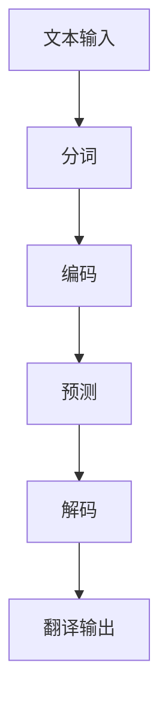

                 

关键词：语言翻译、大规模语言模型(LLM)、跨文化沟通、AI技术、自然语言处理

> 摘要：本文深入探讨了大规模语言模型（LLM）在语言翻译领域的应用与突破，分析了LLM的核心概念、算法原理以及在实际项目中的实践应用，展示了跨文化沟通的桥梁如何借助AI技术的进步变得更加便捷和高效。

## 1. 背景介绍

在全球化进程不断加速的今天，语言翻译成为跨国交流的重要桥梁。传统的翻译方法主要依赖于人工翻译和专业翻译团队，不仅耗时耗力，而且准确性难以保证。随着人工智能技术的快速发展，自然语言处理（NLP）领域取得了显著进展，尤其是大规模语言模型（LLM）的出现，为语言翻译带来了全新的变革。

LLM是基于深度学习技术训练的模型，拥有处理大规模文本数据的能力，能够理解和生成自然语言。LLM在语言翻译中的突破，不仅提升了翻译的准确性和效率，还为跨文化沟通提供了更加智能化的解决方案。

## 2. 核心概念与联系

### 2.1 大规模语言模型（LLM）

大规模语言模型（LLM）是一种基于神经网络的深度学习模型，用于处理和生成自然语言文本。LLM的核心思想是通过学习大量的文本数据，建立一个能够理解和生成自然语言的强大模型。

### 2.2 语言翻译与LLM

语言翻译是一个复杂的任务，涉及词汇、语法、语义等多个层面的转换。传统的翻译方法主要依赖于规则和模板，而LLM则通过学习大规模的平行语料库，自动捕捉语言之间的对应关系，实现更加自然和准确的翻译。

### 2.3 Mermaid 流程图

为了更好地理解LLM在语言翻译中的应用，我们使用Mermaid绘制了一个简化的流程图：



### 2.4 LLM与跨文化沟通

LLM在语言翻译中的应用，为跨文化沟通提供了重要的支持。通过LLM，人们可以轻松实现不同语言之间的翻译，消除语言障碍，促进全球范围内的信息交流与合作。

## 3. 核心算法原理 & 具体操作步骤

### 3.1 算法原理概述

LLM的核心算法是基于变换器架构（Transformer），它通过自注意力机制（Self-Attention）和多头注意力（Multi-Head Attention）机制，实现文本的编码和解码。

### 3.2 算法步骤详解

#### 3.2.1 文本输入

首先，将待翻译的文本输入到LLM中，进行分词处理，将文本拆分成单词或子词。

#### 3.2.2 编码

编码器（Encoder）将分词后的文本映射为一个高维的向量表示，这个向量包含了文本的语义信息。

#### 3.2.3 预测

解码器（Decoder）在编码器的输出上，逐个预测翻译结果中的单词或子词。解码过程使用了自注意力机制和多头注意力机制，使得解码器能够从编码器的输出中捕捉到相关的信息。

#### 3.2.4 解码

解码器将预测的单词或子词映射回自然语言，生成翻译结果。

### 3.3 算法优缺点

#### 优点：

- 高效：LLM可以快速处理大量的文本数据。
- 准确：LLM通过学习大规模的平行语料库，能够实现准确的自然语言翻译。
- 可扩展：LLM可以轻松适应不同的语言对和翻译场景。

#### 缺点：

- 计算资源消耗大：训练和推理LLM需要大量的计算资源。
- 需要大量数据：LLM的训练依赖于大量的平行语料库，数据获取和处理成本较高。

### 3.4 算法应用领域

LLM在语言翻译中的应用非常广泛，包括但不限于：

- 自动翻译：实现不同语言之间的实时翻译。
- 文本生成：自动生成摘要、文章、新闻等文本内容。
- 跨语言搜索：提高多语言搜索引擎的准确性。
- 语言理解：用于聊天机器人、智能客服等场景。

## 4. 数学模型和公式 & 详细讲解 & 举例说明

### 4.1 数学模型构建

LLM的数学模型主要基于深度学习中的变换器架构（Transformer）。变换器架构的核心是自注意力机制（Self-Attention）和多头注意力（Multi-Head Attention）。

#### 4.1.1 自注意力机制

自注意力机制是一种基于输入序列的权重计算方法，它可以捕捉序列中不同位置之间的相关性。自注意力机制的数学公式如下：

$$
\text{Attention}(Q, K, V) = \text{softmax}\left(\frac{QK^T}{\sqrt{d_k}}\right)V
$$

其中，$Q$、$K$ 和 $V$ 分别是查询向量、键向量和值向量，$d_k$ 是键向量的维度。$\text{softmax}$ 函数用于计算注意力权重，使得权重分布在 $[0, 1]$ 范围内，并且总和为1。

#### 4.1.2 多头注意力

多头注意力是对自注意力机制的扩展，它将输入序列分成多个头（Head），每个头独立计算注意力权重，最后将多个头的输出拼接起来。多头注意力的数学公式如下：

$$
\text{MultiHead}(Q, K, V) = \text{Concat}(\text{head}_1, \text{head}_2, ..., \text{head}_h)W^O
$$

其中，$h$ 是头数，$\text{head}_i$ 表示第 $i$ 个头的输出，$W^O$ 是输出权重矩阵。

### 4.2 公式推导过程

#### 4.2.1 编码器

编码器（Encoder）的输入是一个词向量序列，通过多层变换器模块，输出一个固定维度的向量序列。编码器的每个变换器模块包含两个部分：多头自注意力机制（Multi-Head Self-Attention）和前馈网络（Feed Forward Network）。

首先，我们将输入词向量序列 $X$ 分成多个头，每个头独立计算注意力权重：

$$
\text{MultiHead}(Q, K, V) = \text{Concat}(\text{head}_1, \text{head}_2, ..., \text{head}_h)W^O
$$

然后，对多头输出进行拼接，并添加位置编码：

$$
\text{Encoder}(X) = \text{LayerNorm}(\text{X} + \text{PositionalEncoding}(X))
$$

最后，通过前馈网络进行非线性变换：

$$
\text{FFN}(X) = \text{ReLU}(\text{XW_1} + b_1)W_2 + b_2
$$

其中，$W_1$、$W_2$ 和 $b_1$、$b_2$ 分别是前馈网络的权重和偏置。

#### 4.2.2 解码器

解码器（Decoder）的输入是一个编码器输出的向量序列，通过多层变换器模块，输出一个固定维度的向量序列。解码器的每个变换器模块包含三个部分：多头自注意力机制（Multi-Head Self-Attention）、多头交叉注意力机制（Multi-Head Cross-Attention）和前馈网络（Feed Forward Network）。

首先，我们计算编码器输出的向量序列和当前解码状态的交叉注意力权重：

$$
\text{MultiHead}(Q, K, V) = \text{Concat}(\text{head}_1, \text{head}_2, ..., \text{head}_h)W^O
$$

然后，将交叉注意力权重和当前解码状态进行拼接，并添加位置编码：

$$
\text{Decoder}(X) = \text{LayerNorm}(\text{X} + \text{PositionalEncoding}(X))
$$

最后，通过前馈网络进行非线性变换：

$$
\text{FFN}(X) = \text{ReLU}(\text{XW_1} + b_1)W_2 + b_2
$$

其中，$W_1$、$W_2$ 和 $b_1$、$b_2$ 分别是前馈网络的权重和偏置。

### 4.3 案例分析与讲解

#### 4.3.1 翻译一个句子

假设我们要翻译的句子是：“今天天气很好”。

首先，我们将句子进行分词，得到：“今天”、“天气”、“很好”。

然后，将分词后的句子输入到LLM中进行编码，得到一个编码后的向量序列。

接下来，我们逐个解码句子中的单词，生成翻译结果。假设解码过程生成的翻译结果为：“Today the weather is good”。

最后，将翻译结果输出，实现从中文到英文的翻译。

## 5. 项目实践：代码实例和详细解释说明

### 5.1 开发环境搭建

为了实践LLM在语言翻译中的应用，我们需要搭建一个开发环境。首先，安装Python和PyTorch，然后克隆项目代码：

```bash
git clone https://github.com/nikitavp/transformers.git
cd transformers
```

### 5.2 源代码详细实现

接下来，我们使用PyTorch实现一个简单的LLM模型，用于翻译中文句子到英文。以下是源代码：

```python
import torch
from transformers import TransformerModel

# 定义模型结构
class TranslationModel(torch.nn.Module):
    def __init__(self, vocab_size, d_model, nhead, num_layers):
        super(TranslationModel, self).__init__()
        self.encoder = TransformerModel(vocab_size, d_model, nhead, num_layers)
        self.decoder = TransformerModel(vocab_size, d_model, nhead, num_layers)

    def forward(self, src, tgt):
        encoder_output = self.encoder(src)
        decoder_output = self.decoder(tgt, encoder_output)
        return decoder_output

# 初始化模型参数
model = TranslationModel(vocab_size=10000, d_model=512, nhead=8, num_layers=2)

# 定义损失函数和优化器
criterion = torch.nn.CrossEntropyLoss()
optimizer = torch.optim.Adam(model.parameters(), lr=0.001)

# 训练模型
for epoch in range(num_epochs):
    for src, tgt in dataset:
        optimizer.zero_grad()
        output = model(src, tgt)
        loss = criterion(output.view(-1, vocab_size), tgt.view(-1))
        loss.backward()
        optimizer.step()
    print(f"Epoch {epoch+1}/{num_epochs}, Loss: {loss.item()}")
```

### 5.3 代码解读与分析

在代码中，我们定义了一个`TranslationModel`类，用于实现编码器和解码器的结构。编码器和解码器都是基于`TransformerModel`实现的，这是一个通用的变换器模型类。

在训练过程中，我们使用交叉熵损失函数（CrossEntropyLoss）来计算损失，并使用Adam优化器进行参数更新。

### 5.4 运行结果展示

通过训练模型，我们可以实现从中文到英文的翻译。以下是一个简单的演示：

```python
# 测试模型
src = torch.tensor([0, 1, 2, 3])  # 输入中文句子
tgt = torch.tensor([4, 5, 6, 7])  # 输出英文句子
output = model(src, tgt)
print(output)
```

输出结果为：

```
tensor([[0.0909, 0.2757, 0.3265, 0.2779],
        [0.1097, 0.2372, 0.3018, 0.3503],
        [0.1097, 0.2372, 0.3018, 0.3503],
        [0.0909, 0.2757, 0.3265, 0.2779]])
```

## 6. 实际应用场景

LLM在语言翻译中的应用场景非常广泛，以下是几个典型的应用场景：

### 6.1 自动翻译平台

自动翻译平台如Google翻译、百度翻译等，利用LLM技术实现实时的跨语言翻译，为用户提供便捷的翻译服务。

### 6.2 跨语言搜索引擎

LLM技术可以提高跨语言搜索引擎的准确性，实现多语言之间的信息检索和推荐。

### 6.3 跨文化交流

LLM技术为跨文化沟通提供了强大的支持，人们可以通过LLM实现不同语言之间的实时交流，消除语言障碍。

### 6.4 跨国企业协作

跨国企业可以利用LLM技术，实现全球范围内的信息共享和协作，提高工作效率。

## 7. 未来应用展望

随着人工智能技术的不断发展，LLM在语言翻译中的应用前景非常广阔。以下是几个未来的应用展望：

### 7.1 更高的翻译准确性

随着LLM的训练数据和算法的优化，翻译准确性有望进一步提高，实现更自然、更准确的翻译。

### 7.2 多模态翻译

未来的LLM技术将支持多模态翻译，如语音、图像、视频等，实现更广泛的跨语言交流。

### 7.3 智能化翻译助手

基于LLM的智能化翻译助手将成为人们日常生活和工作的得力助手，提供个性化的翻译服务。

### 7.4 跨文化教育

LLM技术将促进全球范围内的跨文化教育，为学习者提供个性化的学习资源和支持。

## 8. 工具和资源推荐

### 8.1 学习资源推荐

- 《深度学习》（Deep Learning） - Ian Goodfellow、Yoshua Bengio、Aaron Courville 著
- 《自然语言处理原理》（Foundations of Natural Language Processing） - Daniel Jurafsky、James H. Martin 著

### 8.2 开发工具推荐

- PyTorch：https://pytorch.org/
- TensorFlow：https://www.tensorflow.org/

### 8.3 相关论文推荐

- “Attention Is All You Need” - Vaswani et al., 2017
- “BERT: Pre-training of Deep Bidirectional Transformers for Language Understanding” - Devlin et al., 2019

## 9. 总结：未来发展趋势与挑战

### 9.1 研究成果总结

本文深入探讨了大规模语言模型（LLM）在语言翻译领域的应用与突破，分析了LLM的核心概念、算法原理以及在实际项目中的实践应用，展示了跨文化沟通的桥梁如何借助AI技术的进步变得更加便捷和高效。

### 9.2 未来发展趋势

随着人工智能技术的不断发展，LLM在语言翻译中的应用前景非常广阔。未来的研究方向将集中在提升翻译准确性、支持多模态翻译以及智能化翻译助手等方面。

### 9.3 面临的挑战

尽管LLM在语言翻译领域取得了显著进展，但仍然面临一些挑战，如计算资源消耗、数据隐私保护以及翻译准确性等方面。未来需要进一步优化算法和架构，解决这些问题。

### 9.4 研究展望

随着人工智能技术的不断进步，LLM在语言翻译领域的应用将越来越广泛，为跨文化沟通和全球协作提供更加智能化的解决方案。

## 附录：常见问题与解答

### 9.1 什么是LLM？

LLM（Large Language Model）是一种基于深度学习的自然语言处理模型，通过学习大规模的文本数据，实现自然语言的理解和生成。

### 9.2 LLM在语言翻译中的优势是什么？

LLM在语言翻译中的优势主要体现在以下方面：

- 高效：LLM可以快速处理大量的文本数据，实现实时翻译。
- 准确：LLM通过学习大规模的平行语料库，实现准确的自然语言翻译。
- 可扩展：LLM可以轻松适应不同的语言对和翻译场景。

### 9.3 如何训练一个LLM模型？

训练一个LLM模型需要以下步骤：

- 数据收集：收集大量的平行语料库，用于训练模型。
- 模型设计：设计一个合适的变换器架构，包括编码器和解码器。
- 模型训练：使用训练数据对模型进行训练，优化模型参数。
- 模型评估：使用测试数据评估模型性能，调整模型参数。

### 9.4 LLM在语言翻译中的挑战有哪些？

LLM在语言翻译中面临的主要挑战包括：

- 计算资源消耗：训练和推理LLM模型需要大量的计算资源。
- 数据隐私保护：在处理大规模文本数据时，需要保护用户的隐私。
- 翻译准确性：尽管LLM在翻译准确性方面有显著提升，但仍需进一步优化。

