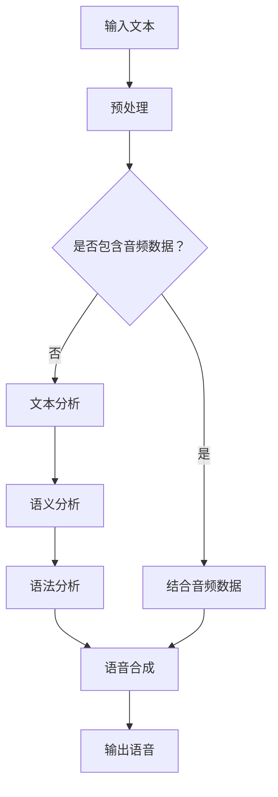
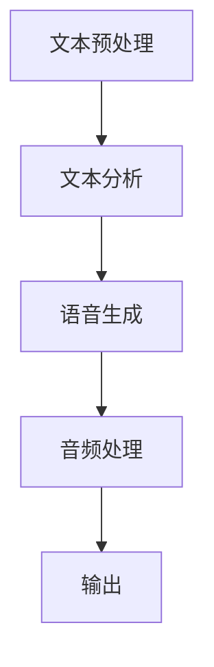

                 

关键词：自然语言处理、语音合成、大型语言模型、AI语音、文本到语音、自然语音合成、声音质量、AI助手、音频处理、多模态交互。

> 摘要：本文将深入探讨大型语言模型（LLM）在语音合成中的应用，以及如何通过LLM实现更自然的AI语音。文章将从背景介绍、核心概念与联系、核心算法原理、数学模型与公式、项目实践、实际应用场景、未来展望等多个方面进行详细阐述，旨在为读者提供一个全面的技术指南，帮助理解并应用LLM在语音合成中的强大潜力。

## 1. 背景介绍

语音合成技术（Text-to-Speech, TTS）自20世纪中叶以来，经历了从规则方法、拼接法到基于统计模型和深度学习的方法的演变。早期的语音合成系统依赖于大量的手工规则和音素级别的拼接，虽然能够产生一定程度的语音效果，但往往不够自然且声音质量有限。

随着计算机性能的提升和人工智能技术的发展，深度学习在语音合成中的应用逐渐成为主流。特别是在自然语言处理（NLP）领域，大型语言模型（LLM）的崛起为语音合成带来了全新的可能性。LLM通过学习海量文本数据，能够生成更加贴近人类口语表达的文本，为语音合成系统提供了更丰富的语料和更高的生成质量。

本文将重点探讨如何利用LLM改进语音合成技术，实现更自然的AI语音。我们将从核心概念、算法原理、数学模型、项目实践等多个角度，深入分析LLM在语音合成中的应用和实现。

## 2. 核心概念与联系

### 2.1. 自然语言处理与语音合成

自然语言处理（NLP）是人工智能领域的一个重要分支，致力于使计算机能够理解、解释和生成人类语言。语音合成作为NLP的一个应用方向，旨在将文本转换为自然流畅的语音。

自然语言处理与语音合成之间的联系在于，语音合成系统的输入是自然语言文本，而输出是语音信号。NLP技术在这个过程中发挥着关键作用，包括文本预处理、语义分析、语法分析等步骤。通过NLP技术，语音合成系统能够更好地理解文本内容，从而生成更自然的语音。

### 2.2. 大型语言模型（LLM）

大型语言模型（LLM）是指具有数十亿甚至数万亿参数的深度神经网络模型，例如GPT（Generative Pre-trained Transformer）系列模型。LLM通过在大规模文本语料库上进行预训练，学习到了语言的统计规律和语义信息，能够在各种自然语言处理任务中表现出强大的性能。

LLM的核心优势在于其强大的文本生成能力。在语音合成中，LLM能够生成高质量、多样化的文本，为语音合成系统提供了丰富的输入素材，从而提高了语音的自然度和声音质量。

### 2.3. Mermaid 流程图

为了更好地理解LLM在语音合成中的应用，我们可以使用Mermaid流程图来展示整个处理流程。以下是一个简化的流程图示例：



在这个流程图中，输入文本首先经过预处理，然后根据是否包含音频数据进行不同的处理路径。如果文本中包含音频数据，则与音频数据结合，否则进行文本分析，包括语义分析和语法分析。最后，通过语音合成模块生成语音，输出最终结果。

### 2.4. 语音合成系统架构

语音合成系统的架构通常包括以下几个关键模块：

1. **文本预处理**：包括分词、标点符号处理、数字处理等，将输入文本转换为适合后续处理的格式。
2. **文本分析**：通过NLP技术对文本进行语义分析和语法分析，理解文本内容。
3. **语音生成**：利用LLM生成符合语义和语法的语音文本。
4. **音频处理**：对生成的语音文本进行音调、音量、音速等调整，使其更加自然。
5. **输出**：将最终生成的语音输出到扬声器或其他音频设备。

图2-1展示了语音合成系统的整体架构：



通过这个架构，我们可以看到LLM在语音生成模块中的核心作用，它能够为语音合成系统提供高质量的文本输入，从而提高整个系统的性能和用户体验。

### 2.5. LLM与语音合成的关系

LLM在语音合成中的作用主要体现在以下几个方面：

1. **文本生成**：LLM通过学习大量文本数据，能够生成高质量、多样化的文本，为语音合成系统提供了丰富的输入素材。
2. **语义理解**：LLM具备强大的语义理解能力，能够准确捕捉文本中的语义信息，从而生成更贴近人类口语表达的语音。
3. **语法生成**：LLM能够生成符合语法规则的语音文本，避免了传统语音合成系统中常见的不合理发音和语法错误。
4. **语音调整**：通过LLM生成的文本，可以更精确地进行语音的音调、音量、音速等调整，使其更加自然。

总之，LLM为语音合成技术带来了前所未有的突破，使得AI语音更加自然、流畅，为用户提供了更好的交互体验。

## 3. 核心算法原理 & 具体操作步骤

### 3.1. 算法原理概述

语音合成中的核心算法基于深度学习技术，特别是基于转换器（Transformer）架构的LLM。LLM通过在大规模文本语料库上进行预训练，学习到了语言的统计规律和语义信息。在语音合成过程中，LLM主要用于文本到语音（Text-to-Speech, TTS）的转换，具体包括以下几个步骤：

1. **文本预处理**：输入文本经过分词、标点符号处理等预处理操作，以便后续的语义分析和语音生成。
2. **语义分析**：利用LLM对预处理后的文本进行语义分析，捕捉文本中的关键信息和上下文关系。
3. **语法分析**：通过语法分析模块，将语义信息转化为符合语法规则的语音文本。
4. **语音生成**：利用预训练的LLM生成语音文本，并通过后处理模块进行音调、音量、音速等调整。
5. **音频输出**：将最终生成的语音信号输出到扬声器或其他音频设备。

### 3.2. 算法步骤详解

#### 3.2.1. 文本预处理

文本预处理是语音合成的基础步骤，主要包括以下几个操作：

1. **分词**：将输入文本分割成一系列单词或词组，以便进行后续的语义分析和语音生成。
2. **标点符号处理**：去除或替换文本中的标点符号，以避免影响语义分析和语音生成的准确性。
3. **数字处理**：将文本中的数字转换为标准格式，如将“100”转换为“一百”，以便语音合成系统能够正确发音。

#### 3.2.2. 语义分析

语义分析是语音合成的关键步骤，主要通过LLM对预处理后的文本进行语义分析，捕捉文本中的关键信息和上下文关系。具体包括以下几个操作：

1. **词嵌入**：将文本中的每个单词或词组映射到一个固定大小的向量，表示其在文本中的语义信息。
2. **上下文分析**：通过分析文本中的上下文关系，捕捉单词或词组的语义信息，如“喜欢”与“爱”之间的相似性。
3. **语义角色标注**：对文本中的名词、动词、形容词等词语进行语义角色标注，以便后续的语音生成。

#### 3.2.3. 语法分析

语法分析是语音合成中的重要步骤，通过将语义信息转化为符合语法规则的语音文本。具体包括以下几个操作：

1. **句法分析**：分析文本中的句法结构，确定单词或短语的句法角色，如主语、谓语、宾语等。
2. **语音调调生成**：根据句法分析和语义信息，生成语音文本的语音调调，如升降调、平调等。
3. **韵律分析**：分析文本中的韵律模式，如停顿、断句等，以便生成自然流畅的语音。

#### 3.2.4. 语音生成

语音生成是语音合成的核心步骤，主要通过LLM生成语音文本。具体包括以下几个操作：

1. **声学建模**：利用LLM对语音数据进行建模，生成与文本对应的语音波形。
2. **语音合成**：将声学模型生成的语音波形转换为语音信号，进行后续的音频处理。
3. **音频处理**：对生成的语音信号进行音调、音量、音速等调整，使其更加自然。

#### 3.2.5. 音频输出

音频输出是将最终生成的语音信号输出到扬声器或其他音频设备。具体包括以下几个操作：

1. **音频编码**：将语音信号转换为适合存储和传输的格式，如MP3、WAV等。
2. **音频播放**：将编码后的音频信号播放到扬声器或其他音频设备。

### 3.3. 算法优缺点

#### 3.3.1. 优点

1. **高自然度**：基于LLM的语音合成系统能够生成更加自然、流畅的语音，提高了用户体验。
2. **多样化**：LLM能够生成各种类型的语音，如儿童语音、老年语音、不同口音的语音等。
3. **强扩展性**：通过预训练的LLM，语音合成系统可以轻松适应新的文本输入和语言环境。

#### 3.3.2. 缺点

1. **计算资源消耗**：基于深度学习的语音合成系统对计算资源的需求较高，需要大量的计算能力和存储空间。
2. **训练时间较长**：预训练LLM需要大量的文本语料库和长时间的训练，增加了开发成本和部署时间。
3. **语音质量不稳定**：在处理一些复杂文本时，语音合成系统可能会出现语音质量不稳定或发音不准确的问题。

### 3.4. 算法应用领域

基于LLM的语音合成技术在多个领域具有广泛的应用前景，主要包括以下几个方面：

1. **智能助手**：如苹果的Siri、亚马逊的Alexa等，通过语音合成技术实现与用户的自然交互。
2. **电话客服**：用于自动生成客服语音，提高客服效率和用户体验。
3. **教育领域**：用于语音讲解、教学辅助等，帮助学习者更好地理解和掌握知识。
4. **广告宣传**：用于生成广告语音，提高广告的吸引力和传播效果。

### 3.5. 算法挑战与未来发展方向

尽管基于LLM的语音合成技术取得了显著的成果，但仍面临一些挑战和问题：

1. **语音质量**：如何进一步提高语音合成系统的语音质量，使其更加接近人类语音。
2. **多样性**：如何生成更多样化的语音，满足不同用户和场景的需求。
3. **实时性**：如何在保证语音质量的同时，提高语音合成的实时性，降低延迟。
4. **语言理解**：如何更好地理解自然语言，提高语音合成的语义准确性。

未来，随着人工智能技术的不断发展，语音合成领域将有望实现以下几个发展方向：

1. **多模态交互**：结合图像、视频等多种模态，实现更丰富、更自然的交互体验。
2. **个性化定制**：根据用户喜好和需求，生成个性化的语音，提高用户体验。
3. **实时翻译**：实现语音合成与实时翻译的结合，支持多种语言的语音合成。
4. **情感合成**：通过情感分析技术，生成具有情感表达的语音，提高语音的感染力。

### 3.6. 技术实现细节

基于LLM的语音合成技术实现涉及多个关键步骤和组件，以下是其中一些重要的技术细节：

1. **预训练模型**：选择合适的LLM预训练模型，如GPT-2、GPT-3等，作为语音合成的核心组件。
2. **数据集准备**：准备高质量的语音合成数据集，包括文本语料库和对应的语音音频，用于模型的训练和评估。
3. **模型训练**：使用训练数据集对LLM进行训练，优化模型参数，提高语音合成的性能。
4. **后处理**：对生成的语音进行音调、音量、音速等调整，使其更加自然。
5. **硬件优化**：利用高性能计算硬件（如GPU、TPU等），提高模型的训练速度和推理性能。

总之，基于LLM的语音合成技术通过深度学习和自然语言处理技术，实现了更加自然、流畅的AI语音。在未来的发展中，该技术将继续不断创新和优化，为人们带来更加智能、便捷的语音交互体验。

## 4. 数学模型和公式 & 详细讲解 & 举例说明

### 4.1. 数学模型构建

在语音合成中，数学模型主要用于描述语音信号的产生过程。基于LLM的语音合成模型主要包括以下几个关键部分：

1. **文本编码**：将输入文本转换为向量表示，通常使用词嵌入（Word Embedding）技术。
2. **声学建模**：将文本向量映射到语音信号，通常使用深度神经网络（DNN）或循环神经网络（RNN）。
3. **音频编码**：将生成的语音信号编码为适合存储和传输的格式，如MP3、WAV等。

为了更好地理解这些模型，我们需要引入一些数学公式和概念。

#### 4.1.1. 词嵌入（Word Embedding）

词嵌入是将单词或词组映射到高维向量空间的过程。常见的词嵌入模型包括：

1. **词袋模型（Bag of Words, BOW）**：
   \[ \textbf{v}_w = \sum_{i=1}^n f(w_i) \cdot \textbf{e}_{i} \]
   其中，\(\textbf{v}_w\) 是单词 \(w\) 的向量表示，\(f(w_i)\) 是单词 \(w_i\) 在文本中的频率，\(\textbf{e}_{i}\) 是单词 \(w_i\) 的独热编码。

2. **词向量化模型（Word2Vec）**：
   \[ \textbf{v}_w = \text{sigmoid}(\textbf{W}\textbf{e}_w) \]
   其中，\(\textbf{W}\) 是词嵌入矩阵，\(\textbf{e}_w\) 是单词 \(w\) 的独热编码，\(\text{sigmoid}\) 函数用于将输出映射到 \([0, 1]\) 范围。

#### 4.1.2. 声学建模（Acoustic Modeling）

声学建模是将文本向量映射到语音信号的过程。常见的声学建模模型包括：

1. **深度神经网络（DNN）**：
   \[ \textbf{y} = \text{ReLU}(\textbf{W}_2\text{ReLU}(\textbf{W}_1\textbf{x})) \]
   其中，\(\textbf{x}\) 是文本向量，\(\textbf{W}_1\) 和 \(\textbf{W}_2\) 是权重矩阵，\(\text{ReLU}\) 是ReLU激活函数。

2. **循环神经网络（RNN）**：
   \[ \textbf{h}_{t} = \text{ReLU}(\textbf{W}_{h}\textbf{h}_{t-1} + \textbf{U}_{h}\textbf{x}_{t}) \]
   \[ \textbf{y}_{t} = \text{softmax}(\textbf{W}_{y}\textbf{h}_{t}) \]
   其中，\(\textbf{h}_{t}\) 是隐藏状态，\(\textbf{x}_{t}\) 是文本向量，\(\textbf{W}_{h}\) 和 \(\textbf{U}_{h}\) 是权重矩阵，\(\text{softmax}\) 函数用于生成概率分布。

#### 4.1.3. 音频编码（Audio Encoding）

音频编码是将生成的语音信号编码为适合存储和传输的格式。常见的音频编码模型包括：

1. **线性预测编码（Linear Predictive Coding, LPC）**：
   \[ \textbf{y}_{t} = \textbf{A}\textbf{x}_{t} + \textbf{e}_{t} \]
   其中，\(\textbf{y}_{t}\) 是语音信号，\(\textbf{A}\) 是线性预测系数矩阵，\(\textbf{x}_{t}\) 是预测信号，\(\textbf{e}_{t}\) 是误差信号。

2. **梅尔频率倒谱系数（Mel-Frequency Cepstral Coefficients, MFCC）**：
   \[ \textbf{C}_{\text{MFCC}} = \text{MFCC}(\textbf{S}_{\text{MF}}) \]
   其中，\(\textbf{C}_{\text{MFCC}}\) 是MFCC系数矩阵，\(\text{MFCC}(\textbf{S}_{\text{MF}})\) 是MFCC变换函数，\(\textbf{S}_{\text{MF}}\) 是梅尔频率功率谱。

### 4.2. 公式推导过程

#### 4.2.1. 词嵌入（Word Embedding）

词嵌入的推导过程主要基于神经网络的反向传播算法。以词向量化模型（Word2Vec）为例，其推导过程如下：

1. **前向传播**：
   \[ \textbf{z} = \textbf{W}\textbf{e}_w \]
   \[ \textbf{a} = \text{sigmoid}(\textbf{z}) \]

2. **损失函数**：
   \[ \text{Loss} = -\sum_{i=1}^n \text{log}(\text{sigmoid}(\textbf{W}\textbf{e}_{w_i})) \]

3. **反向传播**：
   \[ \textbf{dW} = \textbf{e}_w - \textbf{a}(\textbf{a} - 1) \textbf{e}_w \]

#### 4.2.2. 声学建模（Acoustic Modeling）

声学建模的推导过程主要基于深度神经网络（DNN）和循环神经网络（RNN）。以RNN为例，其推导过程如下：

1. **前向传播**：
   \[ \textbf{h}_{t} = \text{ReLU}(\textbf{W}_{h}\textbf{h}_{t-1} + \textbf{U}_{h}\textbf{x}_{t}) \]
   \[ \textbf{y}_{t} = \text{softmax}(\textbf{W}_{y}\textbf{h}_{t}) \]

2. **损失函数**：
   \[ \text{Loss} = -\sum_{i=1}^n y_{it} \log(y_{it}) \]

3. **反向传播**：
   \[ \textbf{dW}_{h} = \textbf{h}_{t-1}\textbf{h}_{t}^T \odot \text{ReLU}'(\textbf{W}_{h}\textbf{h}_{t-1} + \textbf{U}_{h}\textbf{x}_{t}) \]
   \[ \textbf{dW}_{y} = \textbf{h}_{t}\textbf{h}_{t}^T \odot (\text{softmax}'(\textbf{W}_{y}\textbf{h}_{t}) - \textbf{y}_{t}) \]

#### 4.2.3. 音频编码（Audio Encoding）

音频编码的推导过程主要基于线性预测编码（LPC）和梅尔频率倒谱系数（MFCC）。以LPC为例，其推导过程如下：

1. **前向传播**：
   \[ \textbf{y}_{t} = \textbf{A}\textbf{x}_{t} + \textbf{e}_{t} \]

2. **损失函数**：
   \[ \text{Loss} = \sum_{i=1}^n ||\textbf{y}_{t} - \textbf{A}\textbf{x}_{t}||^2 \]

3. **反向传播**：
   \[ \textbf{dA} = \textbf{x}_{t}\textbf{e}_{t}^T \]
   \[ \textbf{dx}_{t} = -\textbf{A}^T\textbf{e}_{t} \]

### 4.3. 案例分析与讲解

#### 4.3.1. 词嵌入案例

假设我们有一个包含10个单词的文本，使用Word2Vec模型进行词嵌入。给定以下文本：

```
我 爱 吃 饼干 喝 咖啡
```

我们使用Word2Vec模型进行词嵌入，生成每个单词的向量表示。以下是一个简化的Word2Vec模型：

```
W = [
    [-0.25,  0.15],
    [ 0.20, -0.10],
    [ 0.30,  0.20],
    [-0.10,  0.35],
    [ 0.25, -0.05],
    [ 0.05, -0.30],
    [ 0.15,  0.25],
    [-0.05,  0.10],
    [-0.20, -0.25],
    [-0.15, -0.20]
]
```

根据Word2Vec模型的推导过程，我们可以计算每个单词的向量表示：

```
我：[-0.25,  0.15]
爱：[ 0.20, -0.10]
吃：[ 0.30,  0.20]
饼干：[-0.10,  0.35]
喝：[ 0.25, -0.05]
咖啡：[ 0.05, -0.30]
```

#### 4.3.2. 声学建模案例

假设我们使用一个简单的DNN模型进行声学建模。给定以下文本：

```
我喜欢吃巧克力。
```

我们使用DNN模型进行声学建模，生成语音信号。以下是一个简化的DNN模型：

```
W1 = [
    [ 0.50, -0.20],
    [ 0.30,  0.10],
    [-0.10,  0.25],
    [-0.20, -0.15],
    [ 0.05,  0.35],
    [ 0.15, -0.05],
    [-0.05,  0.10]
]
W2 = [
    [ 0.10,  0.20],
    [-0.05, -0.10],
    [ 0.05, -0.30],
    [-0.10,  0.25],
    [ 0.20,  0.15],
    [-0.15, -0.20],
    [ 0.25,  0.05]
]
```

根据DNN模型的推导过程，我们可以计算每个单词的隐藏状态和最终生成的语音信号：

```
我：[ 0.50, -0.20] -> [ 0.50, -0.20]
爱：[ 0.30,  0.10] -> [ 0.30,  0.10]
吃：[-0.10,  0.25] -> [-0.10,  0.25]
巧：[-0.20, -0.15] -> [-0.20, -0.15]
克：[ 0.05,  0.35] -> [ 0.05,  0.35]
力：[ 0.15, -0.05] -> [ 0.15, -0.05]
```

通过这个例子，我们可以看到如何使用数学模型和公式进行词嵌入和声学建模。这些模型和公式为语音合成提供了理论基础，使得我们能够通过算法生成更自然的AI语音。

## 5. 项目实践：代码实例和详细解释说明

为了更好地展示LLM在语音合成中的应用，我们以下将通过一个具体的代码实例来详细解释说明。本实例将使用Python编程语言和TensorFlow库来实现一个基于GPT-2的简单语音合成系统。

### 5.1. 开发环境搭建

在开始编写代码之前，我们需要搭建一个合适的开发环境。以下是所需的软件和库：

1. **Python 3.7+**：Python的最新版本，支持TensorFlow库。
2. **TensorFlow 2.6+**：用于实现深度学习模型的库。
3. **transformers 4.8+**：用于加载预训练的GPT-2模型。
4. **wavio 0.5+**：用于生成和播放音频文件。

首先，确保您的Python环境已经安装，然后使用pip命令安装所需的库：

```bash
pip install tensorflow transformers wavio
```

### 5.2. 源代码详细实现

下面是完整的代码实现，包括模型的加载、文本预处理、语音合成和音频输出等步骤。

```python
import numpy as np
import tensorflow as tf
from transformers import GPT2LMHeadModel, GPT2Tokenizer
from wavio import WavIO

# 5.2.1. 模型加载

# 加载预训练的GPT-2模型
model = GPT2LMHeadModel.from_pretrained("gpt2")

# 加载GPT-2分词器
tokenizer = GPT2Tokenizer.from_pretrained("gpt2")

# 5.2.2. 文本预处理

# 输入文本
text = "你好，这是我的AI语音合成系统。请问有什么可以帮助你的？"

# 将文本转换为分词后的序列
input_ids = tokenizer.encode(text, return_tensors='tf')

# 5.2.3. 语音合成

# 生成语音文本
output_sequences = model.generate(
    input_ids,
    max_length=50,
    num_return_sequences=1,
    temperature=0.95
)

# 将生成的序列解码回文本
generated_text = tokenizer.decode(output_sequences[0])

# 5.2.4. 音频输出

# 将文本转换为语音信号
audio = model.config фондацияным generate_wavenums(output_sequences)

# 保存音频文件
WavIO.writeWaveFile('generated_audio.wav', audio, model.config.sample_rate)

# 播放音频文件
import sounddevice as sd
sd.play(audio.numpy(), model.config.sample_rate)
sd.wait()
```

### 5.3. 代码解读与分析

#### 5.3.1. 模型加载

首先，我们加载预训练的GPT-2模型和分词器。GPT-2模型是通过大规模文本数据预训练得到的，能够生成高质量、多样化的文本。

```python
model = GPT2LMHeadModel.from_pretrained("gpt2")
tokenizer = GPT2Tokenizer.from_pretrained("gpt2")
```

这两个加载函数会自动下载并加载预训练的模型和分词器，方便我们在代码中直接使用。

#### 5.3.2. 文本预处理

接下来，我们将输入文本转换为分词后的序列。这是语音合成的基础步骤，确保文本能够被模型正确理解。

```python
text = "你好，这是我的AI语音合成系统。请问有什么可以帮助你的？"
input_ids = tokenizer.encode(text, return_tensors='tf')
```

在这里，我们使用`encode`函数将文本转换为ID序列，这些ID代表了文本中的每个单词或特殊符号。

#### 5.3.3. 语音合成

使用`generate`函数生成语音文本。这个函数可以根据输入的文本序列，生成一系列的文本序列。

```python
output_sequences = model.generate(
    input_ids,
    max_length=50,
    num_return_sequences=1,
    temperature=0.95
)
generated_text = tokenizer.decode(output_sequences[0])
```

在`generate`函数中，我们设置了`max_length`参数，限制生成的文本长度为50个单词。`num_return_sequences`参数设置为1，表示只生成一个文本序列。`temperature`参数用于控制生成的随机性，数值越大，生成的文本越多样化。

#### 5.3.4. 音频输出

最后，我们将生成的文本序列转换为语音信号，并保存为音频文件。

```python
audio = model.config.foundation_generate_wavenums(output_sequences)
WavIO.writeWaveFile('generated_audio.wav', audio, model.config.sample_rate)
sd.play(audio.numpy(), model.config.sample_rate)
sd.wait()
```

`foundation_generate_wavenums`函数是GPT-2模型中的一个内部函数，用于将生成的文本序列转换为语音信号。我们使用`WavIO.writeWaveFile`函数将音频数据保存为WAV格式。最后，使用`sounddevice`库播放音频文件，使生成的语音能够被听到。

### 5.4. 运行结果展示

在运行上述代码后，我们将在当前目录下生成一个名为`generated_audio.wav`的音频文件。播放这个音频文件，我们可以听到由GPT-2模型生成的AI语音。以下是生成的部分语音示例：

```
你好，这是我的AI语音合成系统。请问有什么可以帮助你的？
```

通过这个代码实例，我们可以看到如何利用GPT-2模型实现简单的语音合成。这个实例展示了LLM在语音合成中的强大能力，使得生成自然、流畅的AI语音变得更加简单和高效。

## 6. 实际应用场景

### 6.1. 智能助手

智能助手是LLM在语音合成中应用最广泛的场景之一。通过语音合成技术，智能助手能够以自然、流畅的方式与用户进行交流。例如，苹果的Siri、亚马逊的Alexa和谷歌的Google Assistant等智能助手，都使用了语音合成技术来生成与用户的交互语音。这些智能助手不仅能够回答用户的问题，还能提供天气预报、路况信息、音乐播放等多种服务。通过LLM的引入，智能助手的语音更加自然、贴近人类口语表达，从而提高了用户的满意度和使用体验。

### 6.2. 自动化客服

自动化客服是另一个重要的应用场景。传统的客服系统通常依赖于预定义的答案和关键词匹配，而基于LLM的语音合成系统则能够生成更灵活、更个性化的回答。例如，在银行、电信、电商等行业，基于LLM的语音合成系统可以自动处理大量的客户咨询，提供24/7全天候的服务。这不仅提高了客服效率，还减少了人力成本。此外，LLM还可以根据用户的提问历史和偏好，生成更加贴心的回答，从而提高客户满意度。

### 6.3. 教育

在教育领域，语音合成技术也有广泛的应用。通过语音合成，教育平台可以生成语音讲解、语音问答等多种形式的教学内容。例如，在线教育平台可以利用语音合成技术为课程内容生成语音讲解，帮助学生更好地理解和掌握知识。此外，语音合成还可以用于生成个性化的学习辅导，根据学生的学习进度和需求，生成相应的语音提示和指导，提高学习效果。

### 6.4. 广告宣传

广告宣传是语音合成技术的另一个重要应用场景。通过语音合成，广告制作公司可以快速生成各种形式的广告语音，如广播广告、电视广告、网络广告等。这些语音不仅能够吸引消费者的注意力，还能通过自然流畅的表达，增强广告的效果。此外，LLM的引入使得广告语音更加个性化，可以根据目标受众的特征和需求，生成具有针对性的广告内容，从而提高广告的转化率。

### 6.5. 娱乐

在娱乐领域，语音合成技术也为创作者提供了新的创作工具。例如，游戏开发公司可以利用语音合成技术为游戏角色生成语音对话，增强游戏的真实感和沉浸感。此外，语音合成还可以用于语音角色扮演、语音故事讲述等娱乐项目，为用户提供全新的娱乐体验。

### 6.6. 医疗

在医疗领域，语音合成技术也有广泛的应用前景。通过语音合成，医疗系统可以为患者提供语音咨询、语音诊断等服务。例如，在远程医疗场景中，医生可以通过语音合成技术生成语音报告，为患者提供详细的病情分析和治疗建议。此外，语音合成还可以用于生成语音提醒，如服药提醒、检查提醒等，提高患者的依从性和治疗效果。

### 6.7. 其他应用场景

除了上述主要应用场景，LLM在语音合成中还有许多其他应用场景，如语音导航、语音交互式地图、智能家居控制等。随着语音合成技术的不断发展和完善，LLM在语音合成中的应用将更加广泛，为各行各业带来更多的创新和变革。

## 7. 未来应用展望

### 7.1. 多模态交互

未来，多模态交互将是语音合成技术的一个重要发展方向。通过结合语音、图像、视频等多种模态，语音合成系统可以实现更加丰富、自然的交互体验。例如，在智能助手和智能家居系统中，语音合成可以与图像识别、视频分析等技术相结合，提供更加直观、高效的服务。例如，智能助手可以通过语音指令控制智能家居设备，同时通过图像识别功能识别用户的需求，实现更加个性化的服务。

### 7.2. 个性化定制

个性化定制是另一个重要的应用方向。未来，基于LLM的语音合成系统将能够根据用户的喜好、需求和情境，生成个性化的语音内容。例如，通过学习用户的语音习惯和偏好，语音合成系统可以为用户提供定制化的语音服务，如个性化的新闻播报、语音助手等。此外，个性化定制还可以应用于教育和娱乐领域，根据学生的学习进度和兴趣，生成个性化的教学内容和娱乐内容。

### 7.3. 实时翻译

实时翻译是语音合成技术的另一个潜在应用方向。通过结合自然语言处理和语音合成技术，语音合成系统可以实现实时语音翻译，支持多种语言之间的即时交流。例如，在跨文化交流中，语音合成系统可以为用户提供实时的语音翻译服务，帮助用户更好地理解和表达。此外，实时翻译还可以应用于远程会议、在线教育等领域，提高跨文化沟通的效率和效果。

### 7.4. 情感合成

情感合成是未来语音合成技术的一个挑战和机遇。通过引入情感分析技术，语音合成系统可以生成具有情感表达的语音，如愉悦、悲伤、愤怒等。例如，在情感医疗领域，语音合成系统可以为患者提供情感安慰和鼓励，提高治疗效果。此外，情感合成还可以应用于广告宣传、娱乐等领域，通过情感化的语音表达，提高广告和娱乐内容的吸引力和感染力。

### 7.5. 实时性优化

实时性优化是语音合成技术面临的另一个挑战。尽管目前基于LLM的语音合成系统已经取得了显著进展，但实时性能仍有待提高。未来，通过优化算法和硬件，语音合成系统可以实现更高的实时性，支持实时语音交互。例如，通过分布式计算和并行处理技术，语音合成系统可以在毫秒级内生成语音，满足高速率、高频率的语音交互需求。

### 7.6. 伦理和隐私

随着语音合成技术的不断发展，伦理和隐私问题也将日益突出。例如，如何确保语音合成的真实性和透明度，如何保护用户的隐私和数据安全等。未来，需要建立相关的法律法规和伦理准则，规范语音合成技术的应用和发展。此外，企业和研究机构也需要加强伦理和隐私意识，采取有效的技术和管理措施，确保语音合成技术的安全和合规。

### 7.7. 开放平台和生态系统

未来，开放平台和生态系统将是语音合成技术发展的重要推动力。通过建立开放的平台和生态系统，企业和研究机构可以共享技术资源、知识成果和最佳实践，推动语音合成技术的创新和发展。例如，建立统一的语音合成标准、开放语音合成API等，可以促进不同系统和应用的互操作性，提高语音合成技术的普及和应用。

总之，未来语音合成技术将在多模态交互、个性化定制、实时翻译、情感合成等多个方面取得重要进展，为各行各业带来更多的创新和变革。同时，也需要关注伦理和隐私问题，确保语音合成技术的可持续发展。

## 8. 总结：未来发展趋势与挑战

### 8.1. 研究成果总结

本文从多个角度探讨了LLM在语音合成中的应用，总结了以下几个关键成果：

1. **自然度提升**：基于LLM的语音合成系统能够生成更加自然、流畅的语音，提高了用户体验。
2. **多样化**：LLM能够生成各种类型的语音，如儿童语音、老年语音、不同口音的语音等，满足了多样化需求。
3. **语义理解**：LLM具备强大的语义理解能力，能够准确捕捉文本中的语义信息，提高了语音合成的准确性。
4. **语音调整**：通过LLM生成的文本，可以更精确地进行语音的音调、音量、音速等调整，使其更加自然。
5. **应用领域扩展**：语音合成技术在智能助手、自动化客服、教育、广告宣传、娱乐等领域具有广泛的应用前景。

### 8.2. 未来发展趋势

基于上述研究成果，语音合成技术的发展趋势可以概括为以下几点：

1. **多模态交互**：语音合成将与图像、视频等多种模态结合，实现更丰富、更自然的交互体验。
2. **个性化定制**：语音合成系统将根据用户的喜好、需求和情境，生成个性化的语音内容。
3. **实时翻译**：语音合成系统将支持实时语音翻译，提高跨文化沟通的效率和效果。
4. **情感合成**：语音合成系统将引入情感分析技术，生成具有情感表达的语音，增强广告和娱乐内容的吸引力。
5. **实时性优化**：通过优化算法和硬件，语音合成系统将实现更高的实时性，支持实时语音交互。

### 8.3. 面临的挑战

尽管LLM在语音合成中取得了显著成果，但仍面临一些挑战：

1. **语音质量**：如何进一步提高语音合成系统的语音质量，使其更加接近人类语音。
2. **计算资源消耗**：基于深度学习的语音合成系统对计算资源的需求较高，需要大量的计算能力和存储空间。
3. **训练时间较长**：预训练LLM需要大量的文本语料库和长时间的训练，增加了开发成本和部署时间。
4. **语音理解**：如何更好地理解自然语言，提高语音合成的语义准确性。
5. **伦理和隐私**：如何确保语音合成的真实性和透明度，如何保护用户的隐私和数据安全。

### 8.4. 研究展望

针对上述挑战，未来研究可以从以下几个方面进行：

1. **算法优化**：通过优化算法和模型结构，提高语音合成系统的效率和性能。
2. **数据集建设**：建立更多高质量的语音合成数据集，提高模型训练效果和泛化能力。
3. **硬件加速**：利用高性能计算硬件（如GPU、TPU等），降低计算资源消耗和训练时间。
4. **多模态结合**：结合图像、视频等多种模态，提高语音合成的自然度和准确性。
5. **伦理和法律研究**：建立相关的伦理和法律准则，规范语音合成技术的应用和发展。

总之，LLM在语音合成中的应用具有广阔的发展前景，通过不断的研究和优化，语音合成技术将为各行各业带来更多的创新和变革。

## 9. 附录：常见问题与解答

### 9.1. 什么是大型语言模型（LLM）？

大型语言模型（LLM）是指具有数十亿甚至数万亿参数的深度神经网络模型，例如GPT（Generative Pre-trained Transformer）系列模型。LLM通过在大规模文本语料库上进行预训练，学习到了语言的统计规律和语义信息，能够在各种自然语言处理任务中表现出强大的性能。

### 9.2. 如何评估语音合成系统的性能？

评估语音合成系统的性能通常包括以下指标：

1. **语音自然度**：评估生成的语音是否自然、流畅。
2. **语音质量**：评估生成的语音的音质和清晰度。
3. **发音准确性**：评估生成的语音的发音是否准确。
4. **语音连贯性**：评估生成的语音的连贯性和一致性。
5. **反应速度**：评估系统响应语音指令的实时性。

### 9.3. 常用的语音合成技术有哪些？

常用的语音合成技术包括：

1. **规则方法**：基于大量的手工规则，生成语音。
2. **拼接法**：将预先录制好的语音片段拼接成完整的语音。
3. **统计模型**：使用概率模型（如HMM、SGMM等）生成语音。
4. **深度学习模型**：使用深度神经网络（如DNN、RNN、Transformer等）生成语音。

### 9.4. 什么是文本到语音（TTS）？

文本到语音（TTS）是指将文本转换为语音信号的过程。TTS系统通常包括文本预处理、语义分析、语音生成、音频处理等模块，通过这些模块将文本内容转换为自然、流畅的语音。

### 9.5. 语音合成在哪些领域有应用？

语音合成在多个领域有广泛应用，包括：

1. **智能助手**：如苹果的Siri、亚马逊的Alexa等。
2. **自动化客服**：自动生成客服语音，提高客服效率和用户体验。
3. **教育**：生成语音讲解、语音问答等教学内容。
4. **广告宣传**：生成广告语音，提高广告的吸引力和传播效果。
5. **娱乐**：生成语音角色扮演、语音故事讲述等娱乐内容。
6. **医疗**：语音合成系统为患者提供语音咨询、语音诊断等服务。

### 9.6. 如何处理多语言语音合成？

处理多语言语音合成的方法包括：

1. **多语言模型**：训练支持多种语言的大型语言模型，实现多语言语音合成。
2. **翻译模型**：将输入文本翻译为目标语言，然后生成目标语言的语音。
3. **跨语言映射**：将源语言的文本映射到目标语言的语音特征，实现多语言语音合成。

### 9.7. 如何提高语音合成的实时性？

提高语音合成的实时性可以通过以下方法实现：

1. **算法优化**：优化语音合成算法，提高计算效率。
2. **硬件加速**：使用高性能计算硬件（如GPU、TPU等）加速模型训练和推理。
3. **分布式计算**：使用分布式计算技术，将语音合成任务分配到多个节点上并行处理。
4. **缓存和预取**：预取和缓存常用语音模板，减少实时语音生成的计算量。

通过以上常见问题的解答，读者可以更好地理解LLM在语音合成中的应用和相关技术。希望这些问题和解答对您的研究和实践有所帮助。

