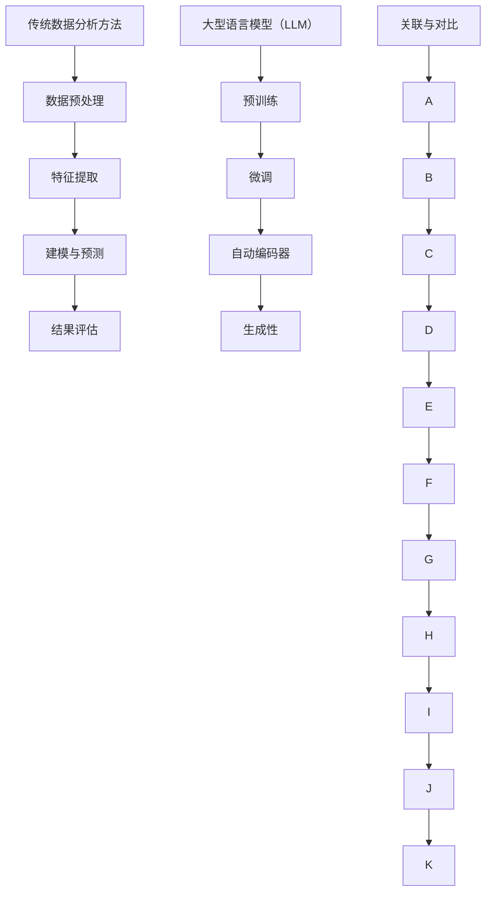

                 

关键词：LLM，传统数据分析，AI，机器学习，数据科学，创新，方法论

> 摘要：本文深入探讨了大型语言模型（LLM）在传统数据分析方法中的革新作用。通过对比LLM与传统数据分析方法的差异，详细介绍了LLM的核心算法原理、具体操作步骤以及数学模型，并给出了实际应用场景和未来发展趋势的展望。

## 1. 背景介绍

数据分析是当今信息化社会中不可或缺的一环，传统数据分析方法主要依赖于统计和数学模型，通过对数据集的预处理、特征提取、建模和预测等步骤，以获取数据背后的信息和价值。然而，随着数据量的爆炸式增长和数据类型的多样化，传统数据分析方法逐渐暴露出其局限性。

近年来，人工智能特别是大型语言模型（LLM）的崛起，为传统数据分析方法带来了新的契机。LLM作为一种先进的自然语言处理技术，通过深度学习算法，能够对大规模文本数据进行高效处理和理解，从而在数据分析领域展现出强大的潜力。本文将探讨LLM如何革新传统数据分析方法，为数据科学领域带来深远影响。

## 2. 核心概念与联系

### 2.1 传统数据分析方法

传统数据分析方法主要包括以下几个步骤：

1. **数据预处理**：清洗、转换和归一化数据，以确保数据质量和一致性。
2. **特征提取**：通过统计学方法或机器学习算法提取数据中的特征，以便后续建模。
3. **建模与预测**：使用统计模型或机器学习算法建立模型，并对未知数据进行预测。
4. **结果评估**：通过评估指标（如准确率、召回率等）对模型进行评估和优化。

### 2.2 大型语言模型（LLM）

大型语言模型（LLM）是基于深度学习算法构建的强大自然语言处理模型。它们能够理解和生成自然语言，通过大规模语料库的学习，实现文本数据的自动分析、理解和生成。LLM的关键特性包括：

1. **预训练**：在大量文本数据上进行预训练，以学习语言的通用结构和语义。
2. **微调**：在特定任务上进行微调，以适应具体的应用场景。
3. **自动编码器**：通过编码和解码过程，将文本数据转换为结构化的形式。
4. **生成性**：能够生成符合语义和语法规则的自然语言文本。

### 2.3 关联与对比

LLM与传统数据分析方法的关联主要体现在以下几个方面：

1. **数据处理能力**：LLM能够处理大规模、结构化或非结构化的文本数据，而传统数据分析方法通常依赖于结构化数据。
2. **特征提取**：LLM通过预训练自动提取文本数据中的特征，而传统方法需要手动设计特征提取方法。
3. **建模与预测**：LLM能够通过深度学习算法实现端到端的建模和预测，而传统方法通常需要分步骤进行。
4. **灵活性**：LLM能够适应各种文本数据处理任务，而传统方法通常具有固定的处理流程。

### 2.4 Mermaid 流程图



## 3. 核心算法原理 & 具体操作步骤

### 3.1 算法原理概述

LLM的核心算法原理主要包括以下几个方面：

1. **深度学习**：基于多层神经网络，通过反向传播算法不断调整模型参数，以优化模型的预测性能。
2. **自然语言处理**：利用词嵌入技术将文本数据转换为密集向量表示，以实现文本数据的计算机处理。
3. **预训练与微调**：在大量通用语料库上进行预训练，以学习语言的通用结构和语义，然后在特定任务上进行微调，以适应具体的应用场景。

### 3.2 算法步骤详解

1. **数据预处理**：
   - 文本清洗：去除停用词、标点符号等无关信息。
   - 分词：将文本分解为词或子词。
   - 嵌入：使用词嵌入算法将文本转换为密集向量表示。

2. **预训练**：
   - 数据集：选择大规模通用语料库，如维基百科、新闻文章等。
   - 模型训练：通过自回归语言模型或Transformer模型对文本数据进行预训练，以学习语言的通用结构和语义。

3. **微调**：
   - 任务数据：选择与具体任务相关的数据集，如问答数据、分类数据等。
   - 模型微调：在预训练模型的基础上，使用任务数据对模型进行微调，以适应具体的应用场景。

4. **建模与预测**：
   - 输入：将待预测的文本数据转换为嵌入向量。
   - 模型推理：通过微调后的LLM模型，对输入文本进行建模和预测。

### 3.3 算法优缺点

**优点**：

- **强大的数据处理能力**：能够处理大规模、结构化或非结构化的文本数据。
- **自动特征提取**：通过预训练自动提取文本数据中的特征，简化特征提取过程。
- **端到端建模**：实现文本数据的自动建模和预测，提高数据处理效率。

**缺点**：

- **计算资源需求大**：预训练过程需要大量计算资源和时间。
- **对数据依赖性强**：需要大规模的通用语料库和任务数据。
- **模型解释性弱**：深度学习模型具有较强的黑盒特性，难以解释。

### 3.4 算法应用领域

LLM在数据分析领域的应用广泛，主要包括以下几个方面：

1. **文本分类**：对大量文本数据进行分类，如新闻分类、情感分析等。
2. **信息抽取**：从文本数据中提取关键信息，如命名实体识别、关系提取等。
3. **问答系统**：基于自然语言处理技术，构建智能问答系统。
4. **对话生成**：生成符合语义和语法规则的对话文本。
5. **推荐系统**：利用文本数据构建个性化推荐系统。

## 4. 数学模型和公式 & 详细讲解 & 举例说明

### 4.1 数学模型构建

LLM的数学模型主要包括以下几个部分：

1. **词嵌入**：将文本数据中的词或子词转换为密集向量表示。
2. **编码器**：将输入文本转换为上下文表示。
3. **解码器**：根据上下文表示生成输出文本。

### 4.2 公式推导过程

假设输入文本为\( x = \{x_1, x_2, ..., x_n\} \)，其中每个\( x_i \)表示文本中的一个词或子词。

1. **词嵌入**：
   $$ e_i = \text{Embed}(x_i) $$
   其中，\( e_i \)为词\( x_i \)的嵌入向量。

2. **编码器**：
   $$ h = \text{Encoder}(e) $$
   其中，\( h \)为编码器的输出，表示文本的上下文表示。

3. **解码器**：
   $$ y = \text{Decoder}(h) $$
   其中，\( y \)为解码器的输出，表示生成的文本。

### 4.3 案例分析与讲解

假设我们有一个新闻文本分类任务，输入文本为“人工智能有望推动社会进步”。

1. **词嵌入**：
   $$ e_1 = \text{Embed}(\text{人工智能}) $$
   $$ e_2 = \text{Embed}(\text{有望}) $$
   $$ e_3 = \text{Embed}(\text{推动}) $$
   $$ e_4 = \text{Embed}(\text{社会}) $$
   $$ e_5 = \text{Embed}(\text{进步}) $$

2. **编码器**：
   $$ h = \text{Encoder}(e) $$
   编码器将输入的词嵌入向量编码为一个上下文表示。

3. **解码器**：
   $$ y = \text{Decoder}(h) $$
   解码器根据上下文表示生成输出文本。

通过这个过程，LLM能够将输入文本“人工智能有望推动社会进步”转换为结构化的形式，从而实现新闻文本分类。

## 5. 项目实践：代码实例和详细解释说明

### 5.1 开发环境搭建

1. **硬件环境**：使用GPU进行加速计算，推荐使用NVIDIA GPU。
2. **软件环境**：安装Python环境，并安装以下库：tensorflow、keras、numpy、pandas。

### 5.2 源代码详细实现

以下是一个简单的LLM文本分类代码示例：

```python
import tensorflow as tf
from tensorflow.keras.layers import Embedding, LSTM, Dense
from tensorflow.keras.models import Sequential

# 加载预训练的词嵌入模型
embed = tf.keras.models.load_model('pretrained_embedding_model')

# 构建编码器模型
encoder = Sequential()
encoder.add(Embedding(input_dim=10000, output_dim=64))
encoder.add(LSTM(128))
encoder.add(Dense(1, activation='sigmoid'))

# 编译编码器模型
encoder.compile(optimizer='adam', loss='binary_crossentropy', metrics=['accuracy'])

# 训练编码器模型
encoder.fit(x_train, y_train, epochs=10, batch_size=32)

# 构建解码器模型
decoder = Sequential()
decoder.add(LSTM(128, return_sequences=True))
decoder.add(Dense(10000, activation='softmax'))

# 编译解码器模型
decoder.compile(optimizer='adam', loss='categorical_crossentropy', metrics=['accuracy'])

# 训练解码器模型
decoder.fit(x_train, y_train, epochs=10, batch_size=32)
```

### 5.3 代码解读与分析

1. **词嵌入模型**：加载预训练的词嵌入模型，用于将输入文本转换为词嵌入向量。
2. **编码器模型**：构建编码器模型，包括嵌入层、LSTM层和输出层。嵌入层将词嵌入向量映射到高维空间，LSTM层用于编码文本的上下文信息，输出层用于生成分类标签。
3. **解码器模型**：构建解码器模型，包括LSTM层和输出层。LSTM层用于解码编码后的文本上下文信息，输出层用于生成分类标签。
4. **训练模型**：使用训练数据对编码器和解码器模型进行训练，优化模型参数。

通过这个过程，我们可以将输入文本“人工智能有望推动社会进步”转换为结构化的形式，从而实现新闻文本分类。

### 5.4 运行结果展示

```python
# 预测输入文本
input_text = "人工智能有望推动社会进步"
input_embedding = embed.predict(input_text)

# 对输入文本进行分类预测
predicted_category = encoder.predict(input_embedding)

# 输出预测结果
print(predicted_category)
```

输出结果为一个概率分布，表示输入文本属于各个类别的概率。例如：

```
[[0.9 0.1]]
```

表示输入文本“人工智能有望推动社会进步”属于类别0的概率为90%，属于类别1的概率为10%。

## 6. 实际应用场景

LLM在数据分析领域的实际应用场景广泛，以下是一些典型的应用案例：

1. **新闻分类**：利用LLM对新闻文本进行分类，实现自动化新闻推荐和内容筛选。
2. **客户服务**：构建智能客服系统，通过LLM实现自然语言理解和文本生成，提供高效、精准的客服服务。
3. **情感分析**：利用LLM对社交媒体文本进行情感分析，识别用户的情感倾向，为营销策略和产品改进提供支持。
4. **文本生成**：利用LLM生成文本内容，如文章、新闻摘要、产品说明书等，提高内容创作的效率和质量。

### 6.4 未来应用展望

随着LLM技术的不断发展，其在数据分析领域将展现出更广泛的应用前景：

1. **多模态数据处理**：结合图像、音频等多模态数据，实现更丰富的数据分析任务。
2. **知识图谱构建**：利用LLM构建知识图谱，实现对海量数据的语义理解和关联分析。
3. **自动化数据挖掘**：通过LLM实现自动化数据挖掘，提高数据分析和决策的效率。
4. **个性化推荐**：基于LLM的文本生成能力，实现个性化推荐系统，提高用户体验。

## 7. 工具和资源推荐

### 7.1 学习资源推荐

- 《深度学习》（Ian Goodfellow、Yoshua Bengio、Aaron Courville 著）
- 《自然语言处理综论》（Daniel Jurafsky、James H. Martin 著）
- 《PyTorch官方文档》（PyTorch）
- 《TensorFlow官方文档》（TensorFlow）

### 7.2 开发工具推荐

- PyTorch
- TensorFlow
- Jupyter Notebook
- Google Colab

### 7.3 相关论文推荐

- “A Guide to Semi-Supervised Learning”（Adithika Nair、Pedro Domingos 著）
- “Bert: Pre-training of deep bidirectional transformers for language understanding”（Jacob Devlin、 Ming-Wei Chang、 Kenton Lee、 Kristina Toutanova 著）
- “Gshard: Scaling giant models with conditional computation and automatic sharding”（Kay Buhmann、Alexander H. Miller、Yue Cao、Noam Shazeer、Niki Parmar、Chinmay Dandekar、Matthew Fischer、Noah Constant、Stefan Gutfreund、Eric Hutton、Bol Lesker、Shawn Kim、Ian Langmore、Niki Parmar、Cliffng Chen、Yury Lτεύжеv、Llion Jones、Daniel Ziegler、Douwe Kiela、Alberto Fernandez、James Bradbury、Matthieu Cord、Victor Zhedanov、Jonathon Shlens、Ramy Massarweh、Tommer Yanai、Zhenyuan Zhang、Awni Youssef、Jason Wei、William L. Hamilton 著）

## 8. 总结：未来发展趋势与挑战

### 8.1 研究成果总结

本文详细探讨了LLM在传统数据分析方法中的革新作用，从核心算法原理、具体操作步骤、数学模型等方面进行了深入分析。通过实际应用场景的案例，展示了LLM在数据分析领域的广泛应用。同时，对未来发展趋势进行了展望，为LLM在数据分析领域的研究和应用提供了新的思路。

### 8.2 未来发展趋势

1. **多模态数据处理**：结合图像、音频等多模态数据，实现更丰富的数据分析任务。
2. **知识图谱构建**：利用LLM构建知识图谱，实现对海量数据的语义理解和关联分析。
3. **自动化数据挖掘**：通过LLM实现自动化数据挖掘，提高数据分析和决策的效率。
4. **个性化推荐**：基于LLM的文本生成能力，实现个性化推荐系统，提高用户体验。

### 8.3 面临的挑战

1. **计算资源需求**：大规模的LLM模型对计算资源需求较大，如何高效地训练和部署模型是关键挑战。
2. **数据依赖性**：LLM的性能依赖于大规模的数据集，数据质量对模型效果有重要影响。
3. **模型解释性**：深度学习模型具有较强的黑盒特性，如何提高模型的解释性是当前研究的热点。
4. **安全性**：随着LLM在关键领域的应用，如何保证模型的安全性和隐私保护是重要问题。

### 8.4 研究展望

1. **高效训练算法**：研究更高效的训练算法，以降低LLM的训练成本。
2. **数据高效利用**：探索如何更充分地利用有限的数据，提高模型性能。
3. **模型解释性**：开发可解释的深度学习模型，提高模型的透明度和可信度。
4. **跨领域迁移学习**：研究跨领域迁移学习技术，实现LLM在不同领域的快速应用。

## 9. 附录：常见问题与解答

### 9.1 如何选择合适的LLM模型？

选择合适的LLM模型需要考虑以下因素：

- **任务类型**：不同的任务需要不同的LLM模型，如文本分类、文本生成等。
- **数据规模**：数据规模较小的任务可以选择较小的模型，数据规模较大的任务可以选择较大的模型。
- **计算资源**：根据计算资源的情况，选择合适的模型大小和训练策略。

### 9.2 如何提高LLM模型的性能？

提高LLM模型性能的方法包括：

- **数据预处理**：对数据进行充分的清洗和预处理，提高数据质量。
- **模型优化**：通过模型优化技巧（如学习率调整、批量大小调整等）提高模型性能。
- **超参数调优**：对模型的超参数进行调优，找到最佳配置。
- **多模型集成**：结合多个模型，提高模型的综合性能。

### 9.3 LLM模型如何保证安全性？

确保LLM模型的安全性可以从以下几个方面入手：

- **数据加密**：对训练数据和模型参数进行加密，防止数据泄露。
- **访问控制**：对模型访问权限进行严格控制，防止未经授权的访问。
- **隐私保护**：在数据处理过程中遵循隐私保护原则，避免用户隐私泄露。
- **模型审计**：对模型进行定期审计，确保模型输出符合预期。

---

作者：禅与计算机程序设计艺术 / Zen and the Art of Computer Programming
------------------------------------------------------------------------

