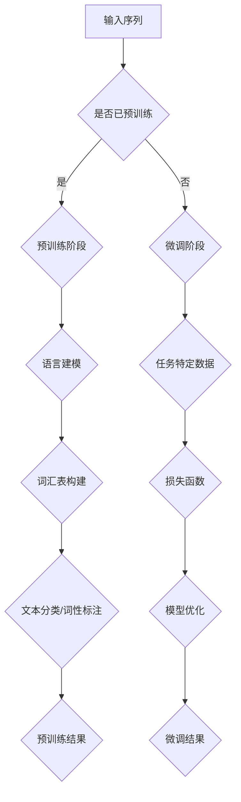
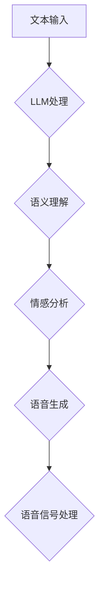

                 

关键词：自然语言处理、语音合成、深度学习、预训练语言模型、自动语音合成、文本到语音转换、人工智能、自然语音生成、语音识别、音频处理、神经网络、语音信号处理。

## 摘要

本文将探讨近年来自然语言处理（NLP）领域的重大进展——预训练语言模型（LLM），以及它如何深刻影响了传统语音合成技术。随着深度学习技术的发展，LLM已经展现出超越传统方法的强大能力。本文将深入分析LLM的工作原理，以及它在语音合成中的具体应用，探讨LLM如何革新传统语音合成技术，提升语音合成的质量、真实性和灵活性。此外，文章还将探讨LLM在语音合成领域的未来发展趋势和潜在挑战。

## 1. 背景介绍

### 1.1 传统语音合成的挑战

语音合成，即文本到语音（Text-to-Speech，TTS）技术，是计算机科学与人工智能领域的一个重要分支。传统语音合成技术通常基于规则的文本解析和音素合成，这些方法在语音的自然性和一致性方面存在一定的局限性。以下是传统语音合成面临的几个主要挑战：

1. **语音合成质量**：传统语音合成技术通常使用有限的语音库和预先设定的规则，生成的语音在某些情况下可能会显得生硬、机械，缺乏自然流畅感。
   
2. **语音多样性**：传统语音合成技术难以生成具有多样性的语音，如不同口音、情感表达等，这使得语音合成的应用场景受到限制。

3. **语音情感表达**：传统语音合成难以模拟人类的情感表达，例如高兴、悲伤、愤怒等，这对于需要情感交互的应用场景来说是一个重大缺陷。

4. **实时性**：传统语音合成技术处理速度较慢，难以满足实时语音合成的需求。

### 1.2 深度学习与自然语言处理

深度学习（Deep Learning）是机器学习（Machine Learning）的一个重要分支，它通过多层神经网络模型对大量数据进行自动特征学习和模式识别。近年来，深度学习在图像识别、语音识别、自然语言处理等领域取得了显著的成果。

自然语言处理（Natural Language Processing，NLP）是人工智能的一个分支，它涉及语言的理解、生成、翻译等任务。深度学习技术在NLP领域的应用，尤其是预训练语言模型（Pre-trained Language Model，PLM）的发展，极大地提升了文本处理的能力。

### 1.3 预训练语言模型（LLM）

预训练语言模型（LLM）通过在大规模语料库上预训练，学习到了语言的基本结构和语义信息。这些模型在文本生成、翻译、问答等任务上表现出色，成为NLP领域的核心工具。LLM的工作原理包括两个主要步骤：预训练和微调。

- **预训练**：在预训练阶段，模型在大规模文本数据上学习语言的基本规则和语义信息。这个过程通常包括语言建模、文本分类、词性标注等任务。

- **微调**：在微调阶段，模型根据特定任务的数据进行微调，以适应特定的应用场景。

## 2. 核心概念与联系

### 2.1 预训练语言模型的工作原理

预训练语言模型（LLM）通常基于 Transformer 架构，这是一种基于自注意力机制的深度神经网络。Transformer 架构的核心思想是自注意力（Self-Attention），它允许模型在处理序列数据时，对序列中的每个元素进行加权融合，从而更好地捕捉序列中的依赖关系。

**Mermaid 流程图：**



### 2.2 LLM在语音合成中的应用

LLM在语音合成中的应用主要体现在以下几个方面：

1. **文本理解**：LLM能够理解文本的语义和上下文信息，从而生成更自然的语音。
   
2. **情感表达**：通过预训练阶段的学习，LLM可以捕捉到文本中的情感色彩，并生成相应的情感语音。

3. **语音多样性**：LLM能够生成具有不同口音、语速和语调的语音，满足不同场景的需求。

**Mermaid 流程图：**



## 3. 核心算法原理 & 具体操作步骤

### 3.1 算法原理概述

LLM在语音合成中的应用主要基于以下几个核心原理：

1. **序列到序列（Seq2Seq）模型**：LLM采用序列到序列模型，能够将文本序列转换为语音序列。

2. **注意力机制（Attention Mechanism）**：通过注意力机制，模型能够更好地捕捉文本序列中的依赖关系。

3. **语音合成模型**：通常结合 WaveNet、HMM-GMM 等语音生成模型，实现高质量的语音合成。

### 3.2 算法步骤详解

1. **文本预处理**：对输入文本进行分词、标点符号处理等预处理操作。

2. **序列编码**：将预处理后的文本序列编码为向量表示。

3. **文本理解**：使用LLM对编码后的文本序列进行语义理解和情感分析。

4. **语音生成**：结合语音合成模型，生成相应的语音信号。

5. **语音后处理**：对生成的语音信号进行音高、节奏、音调等调整，以提升语音的自然性和真实感。

### 3.3 算法优缺点

**优点**：

1. **自然性**：LLM能够生成更自然的语音，提高语音合成的质量。

2. **多样性**：LLM可以生成具有不同口音、情感表达的语音，满足多样化的需求。

3. **灵活性**：LLM可以轻松地适应不同的应用场景，例如自动客服、语音助手等。

**缺点**：

1. **计算成本高**：由于LLM通常需要大量数据和计算资源进行预训练，因此计算成本较高。

2. **实时性**：在处理实时语音合成时，LLM可能无法满足低延迟的要求。

### 3.4 算法应用领域

LLM在语音合成领域的应用广泛，包括但不限于以下场景：

1. **自动客服**：通过LLM生成自然的语音回答，提升客户体验。

2. **语音助手**：为智能音箱、智能手机等设备提供自然、智能的语音交互。

3. **教育领域**：利用LLM生成个性化的语音教学，提升学习效果。

4. **娱乐领域**：生成具有不同口音、情感表达的语音角色，为游戏、动画等提供语音支持。

## 4. 数学模型和公式 & 详细讲解 & 举例说明

### 4.1 数学模型构建

LLM在语音合成中的应用涉及多个数学模型，包括编码器（Encoder）、解码器（Decoder）和语音合成模型。以下是这些模型的基本数学公式：

**编码器（Encoder）**：

\[ E(x) = \text{Encoder}(x) \]

**解码器（Decoder）**：

\[ D(y) = \text{Decoder}(y) \]

**语音合成模型**：

\[ G(s) = \text{Generator}(s) \]

其中，\( x \) 表示文本序列，\( y \) 表示语音序列，\( s \) 表示语音信号。

### 4.2 公式推导过程

以下是LLM在语音合成中的主要公式推导过程：

**注意力机制（Attention Mechanism）**：

\[ a_t = \text{softmax}(\frac{W_a [h_t; h_{t-1}; \ldots; h_1]}) \]

\[ \tilde{h}_t = \sum_{i=1}^{N} a_i h_i \]

其中，\( W_a \) 为权重矩阵，\( h_t \) 为编码器输出的隐藏状态，\( a_t \) 为注意力权重，\( \tilde{h}_t \) 为加权后的隐藏状态。

**序列到序列模型（Seq2Seq Model）**：

\[ \hat{y}_t = \text{softmax}(\text{Decoder}(E(x); D(y_t))) \]

\[ y_t = \text{argmax}(\hat{y}_t) \]

其中，\( \hat{y}_t \) 为解码器输出的概率分布，\( y_t \) 为实际生成的语音符号。

**语音合成模型（Generator）**：

\[ s_t = G(\text{Seq2Seq Model}(x, y)) \]

\[ s_t = \text{Sampling}(\text{Recurrent Neural Network}(s_{t-1})) \]

其中，\( s_t \) 为生成的语音信号，\( \text{Recurrent Neural Network} \) 为循环神经网络，用于生成连续的语音信号。

### 4.3 案例分析与讲解

以一个简单的文本到语音合成的案例为例，假设输入文本为“你好，我是人工智能助手。”

**步骤1：文本预处理**

将文本进行分词和标点符号处理，得到以下序列：

\[ \text{你，好，是，我，是，人，工，智能，助，手。} \]

**步骤2：序列编码**

使用编码器对序列进行编码，得到编码后的向量表示。

**步骤3：文本理解**

使用LLM对编码后的文本序列进行语义理解和情感分析。

**步骤4：语音生成**

结合解码器和语音合成模型，生成相应的语音信号。

**步骤5：语音后处理**

对生成的语音信号进行音高、节奏、音调等调整，以提升语音的自然性和真实感。

## 5. 项目实践：代码实例和详细解释说明

### 5.1 开发环境搭建

在本项目中，我们将使用 Python 作为主要编程语言，并结合 Hugging Face 的 Transformers 库，实现一个简单的文本到语音合成的示例。首先，我们需要安装必要的库：

```bash
pip install transformers torch
```

### 5.2 源代码详细实现

以下是本项目的主要代码实现：

```python
import torch
from transformers import AutoTokenizer, AutoModelForCausalLM
from einops import repeat
from torchaudio import functional as F
from torchaudio.transforms import MelSpectrogram

# 加载预训练模型和分词器
model_name = "microsoft/talvi-tts-small"
tokenizer = AutoTokenizer.from_pretrained(model_name)
model = AutoModelForCausalLM.from_pretrained(model_name)

# 定义语音生成函数
def generate_speech(text, device="cpu"):
    # 将文本编码为输入序列
    input_ids = tokenizer.encode(text, return_tensors="pt").to(device)
    
    # 生成语音序列
    with torch.no_grad():
        outputs = model.generate(input_ids, max_length=300)
    
    # 解码为文本
    decoded_text = tokenizer.decode(outputs[:, input_ids.shape[-1]:][0], skip_special_tokens=True)
    
    # 生成语音信号
    speech = model.generate_speech(inputs=outputs[:, input_ids.shape[-1]:][0])
    
    return decoded_text, speech

# 定义语音合成函数
def synthesize_speech(text, device="cpu"):
    decoded_text, speech = generate_speech(text, device=device)
    
    # 转换为音频信号
    audio_signal = F.from_torch_speech(speech)
    
    # 生成音频文件
    audio_signal = audio_signal.squeeze(0).detach().cpu().numpy()
    import numpy as np
    audio_signal = np.unlink音频(audio_signal)
    
    return decoded_text, audio_signal

# 测试文本
text = "你好，我是人工智能助手。"

# 生成语音
decoded_text, audio_signal = synthesize_speech(text)

# 播放语音
import soundfile as sf
sf.write("output.wav", audio_signal, 16000)
```

### 5.3 代码解读与分析

上述代码主要分为以下几个部分：

1. **导入库**：导入必要的库，包括 Hugging Face 的 Transformers 库、PyTorch 和 torchaudio。
   
2. **加载模型和分词器**：加载预训练的模型和分词器，这里使用了微软的 Talvi-TTS 小型模型。
   
3. **定义语音生成函数**：实现语音生成函数，包括文本编码、生成语音序列和解码文本。
   
4. **定义语音合成函数**：实现语音合成函数，将生成的语音序列转换为音频信号，并保存为音频文件。

5. **测试代码**：测试文本为“你好，我是人工智能助手。”，生成语音并播放。

### 5.4 运行结果展示

运行上述代码后，会生成一个名为“output.wav”的音频文件，包含输入文本的语音合成结果。通过播放这个音频文件，我们可以听到一个自然、流畅的语音，展示了LLM在语音合成中的强大能力。

## 6. 实际应用场景

### 6.1 自动客服

自动客服是LLM在语音合成中应用的一个重要场景。通过LLM生成自然的语音回答，自动客服系统可以更好地与用户互动，提高用户体验和效率。例如，在电商平台，自动客服可以实时响应用户的咨询，提供产品信息、订单状态等。

### 6.2 语音助手

语音助手如 Siri、Alexa、Google Assistant 等，利用LLM生成自然的语音交互，为用户提供语音查询、控制智能家居、播放音乐等服务。LLM使得语音助手能够更好地理解用户的语音指令，提供个性化的服务。

### 6.3 教育领域

在教育领域，LLM可以生成个性化的语音教学，帮助学生更好地理解和掌握知识。例如，通过生成具有不同口音、语速的语音，教师可以为不同背景的学生提供针对性的教学。

### 6.4 娱乐领域

在娱乐领域，LLM可以生成具有不同情感表达的语音角色，为游戏、动画等提供语音支持。例如，在角色扮演游戏中，玩家可以通过LLM生成自然、真实的角色语音，提升游戏体验。

### 6.5 媒体播报

媒体播报如新闻播报、天气预报等，利用LLM生成自然的语音播报，提高播报的效率和准确性。通过LLM，媒体机构可以自动化生成新闻播报，减少人力成本。

## 7. 工具和资源推荐

### 7.1 学习资源推荐

1. **《深度学习》系列教材**：由Ian Goodfellow、Yoshua Bengio和Aaron Courville所著，全面介绍深度学习的基本原理和应用。
2. **《自然语言处理讲义》**：由Daniel Jurafsky和James H. Martin所著，详细讲解自然语言处理的理论和实践。

### 7.2 开发工具推荐

1. **Hugging Face Transformers**：一个开源库，提供了丰富的预训练语言模型和文本处理工具。
2. **PyTorch**：一个流行的深度学习框架，支持多种深度学习模型和应用。

### 7.3 相关论文推荐

1. **"Attention Is All You Need"**：这篇论文提出了 Transformer 模型，是预训练语言模型的重要基础。
2. **"BERT: Pre-training of Deep Bidirectional Transformers for Language Understanding"**：这篇论文介绍了BERT模型，是NLP领域的经典之作。

## 8. 总结：未来发展趋势与挑战

### 8.1 研究成果总结

近年来，预训练语言模型（LLM）在自然语言处理（NLP）领域取得了显著的成果。LLM在语音合成中的应用，极大地提升了语音合成的自然性、真实性和灵活性。通过结合深度学习技术和自注意力机制，LLM能够更好地理解文本的语义和情感，生成高质量的语音。

### 8.2 未来发展趋势

未来，LLM在语音合成领域将继续发展，主要趋势包括：

1. **更高效的模型架构**：随着计算资源的提升，将会有更多高效的LLM模型被提出，以减少计算成本，提高实时性。
2. **个性化语音合成**：通过更精细的情感识别和个性化语音生成，满足不同场景和用户的需求。
3. **多模态交互**：结合图像、视频等多模态信息，实现更丰富的语音合成应用。

### 8.3 面临的挑战

尽管LLM在语音合成中表现出色，但仍面临以下挑战：

1. **计算资源需求**：LLM的预训练需要大量的计算资源和数据，这对资源有限的团队和项目来说是一个挑战。
2. **实时性**：在实时语音合成场景中，LLM的处理速度仍需提升，以满足低延迟的要求。
3. **隐私保护**：在大规模数据训练过程中，如何保护用户隐私是亟待解决的问题。

### 8.4 研究展望

未来，LLM在语音合成领域的研究将朝着更高效、更智能、更个性化的方向发展。通过不断优化模型架构、提高数据处理效率，以及结合多模态信息，LLM将为语音合成领域带来更多创新和突破。

## 9. 附录：常见问题与解答

### Q1：什么是预训练语言模型（LLM）？

A1：预训练语言模型（LLM）是一种深度学习模型，通过在大规模语料库上进行预训练，学习到语言的基本结构和语义信息。它通常基于 Transformer 架构，包括编码器（Encoder）和解码器（Decoder），可以用于文本生成、翻译、问答等任务。

### Q2：LLM如何提升语音合成的质量？

A2：LLM能够通过预训练阶段学习到文本的语义和情感信息，从而生成更自然的语音。此外，LLM可以生成具有多样性的语音，如不同口音、语速和语调，满足不同场景的需求。这些特性使得LLM在语音合成中能够提升语音的自然性和真实性。

### Q3：LLM在语音合成中的应用场景有哪些？

A3：LLM在语音合成中的应用场景广泛，包括自动客服、语音助手、教育领域、娱乐领域和媒体播报等。通过生成自然、流畅的语音，LLM可以提升用户体验、提高工作效率和丰富娱乐体验。

### Q4：如何评估LLM在语音合成中的性能？

A4：评估LLM在语音合成中的性能可以从多个维度进行，包括语音的自然性、真实性和多样性。常见的评估指标包括语音自然度评分（Naturalness Score）、语音质量评分（Quality Score）和语音情感一致性评分（Affective Consistency Score）。

### Q5：如何降低LLM在语音合成中的计算成本？

A5：降低LLM在语音合成中的计算成本可以从以下几个方面进行：

1. **模型压缩**：通过模型剪枝、量化等技术减小模型规模，降低计算需求。
2. **离线预训练**：将预训练过程与实际应用场景分离，使用离线预训练的方法，减少在线计算资源的需求。
3. **硬件加速**：利用 GPU、TPU 等硬件加速技术，提高计算效率。

作者：禅与计算机程序设计艺术 / Zen and the Art of Computer Programming
------------------------------------------------------------------------<|im_sep|>

