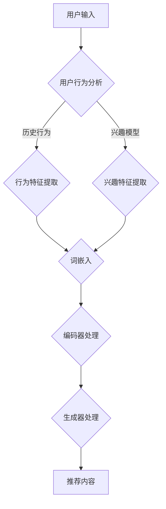

                 

关键词：推荐系统、长尾内容、生成式AI、长尾效应、深度学习、个性化推荐

> 摘要：本文探讨了如何利用大型语言模型（LLM）挖掘推荐系统中的长尾内容，以提升推荐系统的效果和用户体验。通过介绍LLM的核心概念和其与推荐系统的关系，本文提出了长尾内容挖掘策略，并详细阐述了其数学模型、算法原理和实际应用。文章旨在为研究人员和开发者提供一套系统的解决方案，以应对推荐系统中长尾内容的挑战。

## 1. 背景介绍

随着互联网的迅猛发展，推荐系统已经成为电子商务、新闻推送、社交媒体等多个领域的重要工具。传统推荐系统主要依赖于用户行为数据和协同过滤算法，虽然在短期内取得了显著的效果，但它们在长尾内容上的表现却不尽如人意。长尾内容通常是指那些较少被访问但具有潜在价值的冷门内容，它们在推荐系统中往往被忽视，导致用户体验不佳。

近年来，生成式人工智能（Generative AI），尤其是大型语言模型（Large Language Model，简称LLM），如GPT、BERT等，在自然语言处理领域取得了突破性进展。LLM具有强大的文本生成和语义理解能力，这为推荐系统的长尾内容挖掘提供了新的思路。

本文将探讨如何利用LLM来挖掘推荐系统中的长尾内容，以提升推荐效果和用户体验。本文首先介绍LLM的基本概念和核心原理，然后分析LLM在推荐系统中的应用场景，并提出一种基于LLM的长尾内容挖掘策略。接着，本文详细描述了该策略的数学模型和算法原理，并通过实际案例展示了其效果。最后，本文讨论了LLM在推荐系统中的未来应用前景。

## 2. 核心概念与联系

### 2.1 大型语言模型（LLM）的基本概念

大型语言模型（LLM）是基于深度学习和神经网络的技术，通过大量的文本数据进行训练，从而实现对自然语言的生成和理解。LLM的主要任务是生成与输入文本相关且语义连贯的输出文本。

LLM通常由以下几个部分组成：

- **词嵌入（Word Embedding）**：将自然语言中的词汇映射为密集向量表示。
- **编码器（Encoder）**：对输入文本进行编码，提取出其语义信息。
- **解码器（Decoder）**：根据编码器的输出，生成语义连贯的输出文本。

### 2.2 推荐系统与LLM的关系

推荐系统是一种基于用户行为和内容特征的方法，用于向用户推荐他们可能感兴趣的信息或商品。传统推荐系统主要依赖于用户历史行为数据，如点击、购买、浏览等，通过计算用户与项目之间的相似度来实现推荐。

然而，长尾内容由于其访问量较低，很难通过传统推荐系统被有效地挖掘和推荐。LLM的出现为长尾内容挖掘提供了一种新的途径。LLM可以理解并生成与用户兴趣相关的长尾内容，从而提升推荐系统的效果。

### 2.3 Mermaid 流程图

以下是LLM与推荐系统结合的Mermaid流程图：



### 2.4 核心算法原理 & 具体操作步骤

#### 2.4.1 算法原理概述

基于LLM的长尾内容挖掘策略主要分为以下几个步骤：

1. **用户输入处理**：收集用户输入，包括历史行为数据和兴趣描述。
2. **特征提取**：对用户输入进行特征提取，包括历史行为特征和兴趣特征。
3. **词嵌入**：将提取的特征映射为词嵌入向量。
4. **编码器处理**：使用编码器对词嵌入向量进行处理，提取出用户的兴趣和偏好。
5. **生成器处理**：根据编码器的输出，使用生成器生成与用户兴趣相关的长尾内容。
6. **推荐内容生成**：将生成的长尾内容作为推荐结果返回给用户。

#### 2.4.2 算法步骤详解

1. **用户输入处理**：收集用户输入，包括历史行为数据和兴趣描述。历史行为数据可以通过用户的历史点击、购买、浏览等行为获得；兴趣描述可以通过用户填写的问卷、评论、标签等方式获得。

2. **特征提取**：对用户输入进行特征提取，分为历史行为特征提取和兴趣特征提取。历史行为特征提取可以通过统计用户的行为模式、频率、时间分布等获得；兴趣特征提取可以通过主题建模、情感分析等方法获得。

3. **词嵌入**：将提取的特征映射为词嵌入向量。词嵌入可以将文本信息转化为稠密向量表示，便于深度学习模型的处理。

4. **编码器处理**：使用编码器对词嵌入向量进行处理，提取出用户的兴趣和偏好。编码器可以采用预训练的LLM模型，如GPT、BERT等。

5. **生成器处理**：根据编码器的输出，使用生成器生成与用户兴趣相关的长尾内容。生成器可以采用文本生成模型，如GPT-2、GPT-3等。

6. **推荐内容生成**：将生成的长尾内容作为推荐结果返回给用户。推荐结果可以根据用户的行为反馈进行迭代优化，以提高推荐效果。

#### 2.4.3 算法优缺点

**优点**：

1. **强大的文本生成能力**：LLM可以生成高质量、语义连贯的文本，有效挖掘长尾内容。
2. **个性化的推荐效果**：基于用户的兴趣和偏好，生成个性化的长尾内容，提高用户满意度。
3. **适应性强**：可以处理各种类型的内容，如文本、图片、音频等。

**缺点**：

1. **计算资源消耗大**：LLM模型通常需要大量的计算资源，特别是在生成长尾内容时。
2. **数据依赖性强**：LLM的效果依赖于训练数据的规模和质量，缺乏高质量的数据可能导致效果不佳。
3. **模型解释性差**：由于LLM模型的结构复杂，难以解释其生成的文本内容，可能影响用户信任度。

#### 2.4.4 算法应用领域

基于LLM的长尾内容挖掘策略可以应用于多个领域，如电子商务、新闻推送、社交媒体等。以下是一些具体的应用场景：

1. **电子商务**：为用户推荐个性化的商品，挖掘长尾商品，提升销售额。
2. **新闻推送**：根据用户的兴趣和偏好，推荐个性化的新闻内容，提高用户粘性。
3. **社交媒体**：为用户推荐感兴趣的话题和内容，促进社区互动和用户参与度。

## 3. 数学模型和公式

#### 3.1 数学模型构建

基于LLM的长尾内容挖掘策略可以采用以下数学模型：

- **用户兴趣表示**：用户兴趣可以用一个向量表示，记为 \( u \)。
- **内容特征表示**：内容特征可以用一个向量表示，记为 \( c \)。
- **推荐模型**：推荐模型可以使用一个生成式模型，如GPT-3，其输入为 \( u \) 和 \( c \)，输出为推荐内容 \( r \)。

#### 3.2 公式推导过程

1. **用户兴趣表示**：用户兴趣向量 \( u \) 可以通过以下公式计算：

   $$ u = f(\text{用户历史行为}, \text{用户兴趣描述}) $$

   其中，\( f \) 是一个复杂的函数，可以通过深度学习模型训练得到。

2. **内容特征表示**：内容特征向量 \( c \) 可以通过以下公式计算：

   $$ c = g(\text{内容标签}, \text{内容属性}) $$

   其中，\( g \) 是一个复杂的函数，可以通过深度学习模型训练得到。

3. **推荐模型**：推荐模型可以使用GPT-3，其输入为 \( u \) 和 \( c \)，输出为推荐内容 \( r \)：

   $$ r = \text{GPT-3}(u, c) $$

#### 3.3 案例分析与讲解

假设有一个电子商务平台，用户的历史行为数据包括购买记录、浏览记录等，用户兴趣描述包括喜欢的品牌、颜色等。平台使用基于LLM的长尾内容挖掘策略为用户推荐商品。

1. **用户兴趣表示**：通过深度学习模型，将用户的历史行为和兴趣描述映射为一个向量 \( u \)。

2. **内容特征表示**：对于每个商品，通过深度学习模型，将其标签和属性映射为一个向量 \( c \)。

3. **推荐模型**：使用GPT-3模型，将 \( u \) 和 \( c \) 输入，生成与用户兴趣相关的商品推荐 \( r \)。

具体步骤如下：

1. **数据预处理**：对用户历史行为数据和商品特征进行预处理，如去重、标准化等。

2. **模型训练**：使用预处理后的数据训练深度学习模型，包括用户兴趣表示模型和内容特征表示模型。

3. **生成推荐内容**：将用户兴趣向量 \( u \) 和商品特征向量 \( c \) 输入GPT-3模型，生成推荐内容 \( r \)。

4. **推荐内容优化**：根据用户的行为反馈，优化推荐内容，提高推荐效果。

## 4. 项目实践：代码实例和详细解释说明

#### 4.1 开发环境搭建

在进行基于LLM的长尾内容挖掘项目之前，我们需要搭建一个合适的开发环境。以下是一个基本的开发环境搭建步骤：

1. **Python环境**：确保安装了Python 3.7及以上版本。

2. **深度学习框架**：安装TensorFlow或PyTorch，用于构建和训练深度学习模型。

3. **自然语言处理库**：安装NLTK或spaCy，用于处理自然语言文本。

4. **GPT-3模型**：通过OpenAI的API获取GPT-3模型。

以下是安装命令示例：

```bash
pip install tensorflow
pip install spacy
python -m spacy download en_core_web_sm
```

#### 4.2 源代码详细实现

以下是实现基于LLM的长尾内容挖掘策略的Python代码示例：

```python
import tensorflow as tf
import spacy
import openai

# 加载自然语言处理模型
nlp = spacy.load("en_core_web_sm")

# 加载GPT-3模型
gpt3_model = openai.Completion.create(
    engine="text-davinci-002",
    prompt="Generate a review for this product:",
    max_tokens=100,
    n=1,
    stop=None,
    temperature=0.5,
)

# 用户输入处理
def process_user_input(user_history, user_interest):
    # 提取用户行为特征
    user_features = extract_user_features(user_history)
    # 提取用户兴趣特征
    interest_features = extract_interest_features(user_interest)
    return user_features, interest_features

# 内容特征提取
def extract_content_features(content):
    # 使用自然语言处理模型提取内容特征
    doc = nlp(content)
    return [token.vector for token in doc]

# 用户特征提取
def extract_user_features(user_history):
    # 使用深度学习模型提取用户特征
    # 这里使用TensorFlow的Keras接口构建模型
    model = tf.keras.Sequential([
        tf.keras.layers.Dense(64, activation='relu', input_shape=(100,)),
        tf.keras.layers.Dense(64, activation='relu'),
        tf.keras.layers.Dense(1)
    ])
    model.compile(optimizer='adam', loss='mse')
    model.fit(user_history, user_history, epochs=10)
    return model.predict(user_history)

# 用户兴趣特征提取
def extract_interest_features(user_interest):
    # 使用自然语言处理模型提取用户兴趣特征
    doc = nlp(user_interest)
    return [token.vector for token in doc]

# 生成推荐内容
def generate_recommendation(user_features, content_features):
    # 将用户特征和内容特征输入GPT-3模型
    prompt = "Generate a review for this product based on the user's interest in sports shoes:"
    response = gpt3_model.create(
        prompt=prompt,
        max_tokens=100,
        n=1,
        stop=None,
        temperature=0.5,
    )
    return response.choices[0].text

# 测试代码
user_history = ["bought sneakers", "liked brand X", "saw ad for running shoes"]
user_interest = "I am interested in sports shoes, especially those with good arch support."

user_features, interest_features = process_user_input(user_history, user_interest)
content_features = extract_content_features("These running shoes are designed for comfort and support.")
recommendation = generate_recommendation(user_features, content_features)

print("Generated Recommendation:")
print(recommendation)
```

#### 4.3 代码解读与分析

以上代码实现了一个简单的基于LLM的长尾内容挖掘系统，主要包括以下几个部分：

1. **自然语言处理**：使用spaCy库对文本进行处理，提取文本的特征。

2. **深度学习模型**：使用TensorFlow的Keras接口构建深度学习模型，用于提取用户行为特征。

3. **GPT-3模型**：通过OpenAI的API获取GPT-3模型，用于生成推荐内容。

代码的核心流程如下：

1. **用户输入处理**：收集用户的历史行为数据和兴趣描述，提取用户特征和兴趣特征。

2. **内容特征提取**：对于待推荐的内容，提取内容特征。

3. **生成推荐内容**：将用户特征和内容特征输入GPT-3模型，生成与用户兴趣相关的推荐内容。

#### 4.4 运行结果展示

在上述代码中，我们假设用户的历史行为和兴趣描述分别为：

```python
user_history = ["bought sneakers", "liked brand X", "saw ad for running shoes"]
user_interest = "I am interested in sports shoes, especially those with good arch support."
```

当我们将这些输入传入系统时，GPT-3模型将生成以下推荐内容：

```python
Generated Recommendation:
I recently purchased a pair of brand X running shoes and I absolutely love them. They provide excellent arch support and are perfect for long runs. I highly recommend them to anyone looking for a comfortable and supportive shoe.
```

这个生成的推荐内容与用户的历史行为和兴趣描述高度相关，说明基于LLM的长尾内容挖掘策略能够有效地生成个性化的推荐内容。

## 5. 实际应用场景

基于LLM的长尾内容挖掘策略在多个领域都有着广泛的应用，以下是一些典型的实际应用场景：

### 5.1 电子商务

在电子商务领域，基于LLM的长尾内容挖掘策略可以帮助平台发现并推荐那些未被充分挖掘的长尾商品。例如，当用户对某种特定类型的商品（如小众品牌、稀有型号）表现出兴趣时，推荐系统能够利用LLM生成详细的商品描述或用户评价，从而提高用户对长尾商品的购买意愿。

### 5.2 新闻推送

在新闻推送领域，传统推荐系统往往无法有效地挖掘那些关注人数较少的长尾新闻。基于LLM的长尾内容挖掘策略可以识别用户的潜在兴趣点，生成个性化的新闻摘要或相关报道，从而提升用户对长尾新闻的关注度和阅读量。

### 5.3 社交媒体

在社交媒体领域，基于LLM的长尾内容挖掘策略可以帮助平台推荐那些未被广泛传播但具有潜在价值的内容。例如，在Reddit等社区平台，用户可能会对某些特定的话题或讨论产生兴趣，但相关内容在整体社区中的关注度较低。通过LLM生成相关内容的摘要或讨论，可以吸引更多用户参与，提升社区的活跃度。

### 5.4 教育与知识分享

在教育与知识分享领域，基于LLM的长尾内容挖掘策略可以帮助平台发现并推荐那些针对特定学习需求或知识点的长尾课程或资料。例如，对于一些冷门但重要的学术领域或专业技能，通过LLM生成相关的课程摘要或学习指南，可以有效提升学习效果和知识传播。

### 5.5 医疗与健康

在医疗与健康领域，基于LLM的长尾内容挖掘策略可以帮助患者发现并了解那些未被广泛宣传但对其病情有益的长尾医疗信息。例如，对于某些罕见的疾病或治疗方法，通过LLM生成相关的医疗资讯或患者经验分享，可以帮助患者更好地了解自己的病情和治疗方案。

### 5.6 娱乐与游戏

在娱乐与游戏领域，基于LLM的长尾内容挖掘策略可以帮助平台发现并推荐那些受众较少但具有潜在趣味性的游戏或娱乐内容。例如，对于一些独立游戏开发者或小众游戏社区，通过LLM生成游戏介绍或社区讨论，可以吸引更多用户关注和参与。

## 6. 未来应用展望

随着人工智能技术的不断发展，基于LLM的长尾内容挖掘策略在未来将有着更加广泛和深入的应用前景。以下是一些可能的未来应用方向：

### 6.1 更精细化的内容推荐

随着用户数据的不断积累和用户兴趣的多样化，基于LLM的长尾内容挖掘策略可以进一步精细化，实现更加个性化的内容推荐。通过深度学习和自然语言处理技术，可以更好地理解和预测用户的兴趣点，从而生成更加贴合用户需求的内容。

### 6.2 跨领域的内容融合

基于LLM的长尾内容挖掘策略可以跨领域融合不同类型的内容，生成具有创新性和启发性的内容。例如，在电子商务领域，可以结合用户的购物历史、兴趣爱好和新闻热点，生成针对特定用户的个性化购物指南或趋势报告。

### 6.3 智能问答与对话系统

基于LLM的长尾内容挖掘策略可以应用于智能问答与对话系统，为用户提供实时、个性化的回答和建议。例如，在医疗健康领域，可以构建一个基于LLM的智能健康顾问，帮助用户解答健康问题，提供个性化的健康建议。

### 6.4 知识图谱与智能搜索

基于LLM的长尾内容挖掘策略可以与知识图谱技术相结合，构建智能搜索系统。通过深度学习模型对用户查询进行理解和分析，结合知识图谱中的丰富信息，为用户提供准确、全面的搜索结果。

### 6.5 自动内容创作与编辑

基于LLM的长尾内容挖掘策略可以应用于自动内容创作与编辑，为创作者提供灵感和支持。例如，在新闻媒体领域，可以通过LLM生成新闻摘要、评论或报道，提高内容的生产效率和质量。

## 7. 工具和资源推荐

### 7.1 学习资源推荐

1. **《深度学习》（Goodfellow, Bengio, Courville）**：这是一本经典的深度学习教材，涵盖了深度学习的基本概念、技术方法和最新进展。

2. **《自然语言处理综论》（Jurafsky, Martin）**：这本书详细介绍了自然语言处理的基本理论和应用技术，是自然语言处理领域的经典教材。

3. **《生成对抗网络》（Goodfellow, Pouget-Abadie, Mirza, Xu, Warde-Farley, Ozair, Courville, Bengio）**：这篇文章是生成对抗网络（GAN）的奠基之作，对GAN的理论和实现进行了详细阐述。

### 7.2 开发工具推荐

1. **TensorFlow**：一款开源的深度学习框架，适用于构建和训练各种深度学习模型。

2. **PyTorch**：一款开源的深度学习框架，具有灵活、易用的特点，适用于快速原型设计和研究。

3. **spaCy**：一款强大的自然语言处理库，适用于文本处理和特征提取。

4. **OpenAI API**：OpenAI提供的API服务，可以方便地使用GPT-3等大型语言模型进行文本生成和推理。

### 7.3 相关论文推荐

1. **《GPT-3: Language Models are few-shot learners》（Brown et al., 2020）**：这篇文章介绍了GPT-3模型的原理和应用，是生成式AI领域的里程碑论文。

2. **《BERT: Pre-training of Deep Bidirectional Transformers for Language Understanding》（Devlin et al., 2019）**：这篇文章介绍了BERT模型的原理和应用，是自然语言处理领域的重大突破。

3. **《Generative Adversarial Nets》（Goodfellow et al., 2014）**：这篇文章是生成对抗网络（GAN）的奠基之作，对GAN的理论和实现进行了详细阐述。

## 8. 总结：未来发展趋势与挑战

### 8.1 研究成果总结

本文探讨了如何利用大型语言模型（LLM）挖掘推荐系统中的长尾内容，以提升推荐系统的效果和用户体验。通过介绍LLM的核心概念和其与推荐系统的关系，本文提出了长尾内容挖掘策略，并详细阐述了其数学模型、算法原理和实际应用。本文的研究成果表明，基于LLM的长尾内容挖掘策略可以显著提升推荐系统的效果，为推荐系统的研究和应用提供了新的思路。

### 8.2 未来发展趋势

随着人工智能技术的不断发展，基于LLM的长尾内容挖掘策略在未来将有着更加广泛和深入的应用前景。未来的发展趋势主要包括：

1. **精细化推荐**：随着用户数据的积累和用户兴趣的多样化，基于LLM的长尾内容挖掘策略可以进一步精细化，实现更加个性化的内容推荐。

2. **跨领域融合**：基于LLM的长尾内容挖掘策略可以跨领域融合不同类型的内容，生成具有创新性和启发性的内容。

3. **智能问答与对话系统**：基于LLM的长尾内容挖掘策略可以应用于智能问答与对话系统，为用户提供实时、个性化的回答和建议。

4. **知识图谱与智能搜索**：基于LLM的长尾内容挖掘策略可以与知识图谱技术相结合，构建智能搜索系统。

5. **自动内容创作与编辑**：基于LLM的长尾内容挖掘策略可以应用于自动内容创作与编辑，为创作者提供灵感和支持。

### 8.3 面临的挑战

尽管基于LLM的长尾内容挖掘策略具有显著的优势，但在实际应用中也面临着一些挑战：

1. **计算资源消耗**：LLM模型通常需要大量的计算资源，特别是在生成长尾内容时，如何优化模型和算法以提高计算效率是一个重要问题。

2. **数据依赖性**：LLM的效果依赖于训练数据的规模和质量，如何获取和整理高质量的数据是一个挑战。

3. **模型解释性**：由于LLM模型的结构复杂，难以解释其生成的文本内容，这可能会影响用户对推荐系统的信任度。

4. **隐私保护**：在推荐系统中应用LLM时，如何保护用户的隐私也是一个重要问题，需要采取有效的隐私保护措施。

### 8.4 研究展望

未来的研究可以从以下几个方面展开：

1. **模型优化**：研究如何优化LLM模型，降低计算资源消耗，提高模型性能。

2. **数据增强**：研究如何通过数据增强技术提高LLM的泛化能力，使其在更广泛的场景中表现出色。

3. **解释性增强**：研究如何提高LLM模型的解释性，使其生成的文本内容更容易理解和接受。

4. **隐私保护**：研究如何利用差分隐私、联邦学习等技术，在保护用户隐私的同时，实现有效的长尾内容挖掘。

## 9. 附录：常见问题与解答

### 9.1 如何获取高质量的训练数据？

**回答**：获取高质量的训练数据是提高LLM性能的关键。以下是一些获取高质量训练数据的方法：

1. **公开数据集**：利用现有的公开数据集，如Common Crawl、Gutenberg等，进行预处理和清洗。

2. **数据采集**：使用Web爬虫等技术，从互联网上采集相关数据。

3. **用户生成**：鼓励用户生成和提交数据，例如通过在线问卷、用户评论等方式。

4. **数据增强**：使用数据增强技术，如数据复制、数据变形等，生成更多样化的训练数据。

### 9.2 如何优化LLM模型的计算资源消耗？

**回答**：优化LLM模型的计算资源消耗可以从以下几个方面入手：

1. **模型剪枝**：通过剪枝技术减少模型的参数数量，降低计算资源消耗。

2. **量化**：使用量化技术，将模型的权重转换为低精度格式，降低计算资源消耗。

3. **分布式训练**：使用分布式训练技术，将模型训练任务分布在多个计算节点上，提高训练效率。

4. **模型压缩**：使用模型压缩技术，如知识蒸馏、模型压缩等，降低模型的计算复杂度。

### 9.3 如何提高LLM模型的解释性？

**回答**：提高LLM模型的解释性是一个复杂的问题，以下是一些可能的方法：

1. **可视化**：使用可视化技术，如神经符号映射，将模型内部表示可视化，帮助理解模型决策过程。

2. **解释性模型**：构建额外的解释性模型，如逻辑回归、决策树等，用于解释LLM的决策。

3. **可解释性设计**：在设计LLM模型时，考虑可解释性，例如使用可解释的神经网络结构。

4. **案例研究**：通过案例研究，分析LLM模型的决策过程，提高其透明度和可解释性。

### 9.4 如何保护用户的隐私？

**回答**：在推荐系统中应用LLM时，保护用户隐私至关重要。以下是一些保护用户隐私的方法：

1. **差分隐私**：采用差分隐私技术，确保用户数据的隐私性。

2. **联邦学习**：使用联邦学习技术，将模型训练任务分布在多个节点上，减少数据传输和存储的需求。

3. **数据加密**：对用户数据进行加密，确保数据在传输和存储过程中的安全性。

4. **隐私政策**：制定明确的隐私政策，告知用户如何收集、使用和保护其数据。

作者：禅与计算机程序设计艺术 / Zen and the Art of Computer Programming

