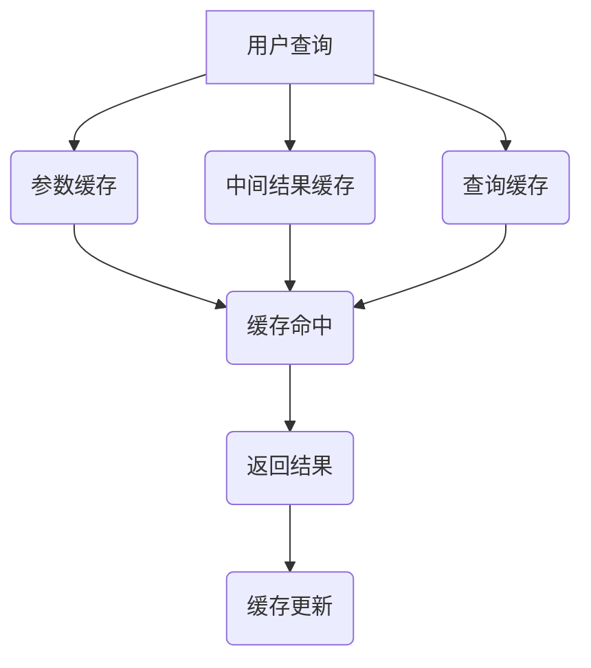

                 

关键词：LLM，推理优化，KV缓存，技术，人工智能，算法，计算机图灵奖，软件架构

> 摘要：本文深入探讨了LLM（大语言模型）推理优化中的KV缓存技术。通过详细介绍KV缓存的工作原理、优化算法、应用场景，以及数学模型和公式，为读者提供了全面的技术指南，帮助他们在实际项目中有效提升LLM的推理性能。

## 1. 背景介绍

近年来，随着深度学习和人工智能技术的快速发展，LLM（大语言模型）在自然语言处理（NLP）领域取得了令人瞩目的成果。然而，LLM的大规模推理计算需求带来了巨大的性能挑战。为了满足高并发、低延迟的应用需求，优化LLM推理性能成为了关键问题。

### 大语言模型（LLM）的概念

LLM是一种基于深度学习的自然语言处理模型，能够对输入的自然语言文本进行理解、生成和翻译等操作。常见的LLM包括GPT、BERT、T5等。这些模型通过大规模的预训练数据集进行训练，可以捕捉到语言中的复杂结构和语义信息。

### 推理性能挑战

LLM的推理性能主要受以下因素影响：

- **计算资源消耗**：大规模神经网络模型需要进行大量的矩阵运算，计算资源消耗巨大。
- **延迟**：在高并发场景下，延迟是用户体验的关键因素。
- **可扩展性**：系统需要能够处理不断增长的数据量和用户请求。

### KV缓存技术的引入

KV缓存技术是一种常用的数据存储和检索技术，通过将键值对（Key-Value Pair）存储在缓存中，实现快速的数据访问。在LLM推理优化中，KV缓存技术被广泛应用于以下几个方面：

- **参数缓存**：将预训练模型的参数缓存起来，减少模型加载和初始化的时间。
- **中间结果缓存**：缓存中间计算结果，减少重复计算，提高推理速度。
- **查询缓存**：将用户查询结果缓存起来，减少对底层模型的调用次数。

## 2. 核心概念与联系

### KV缓存技术原理

KV缓存技术的基本原理是使用一个哈希表来存储键值对。当需要获取某个键的值时，通过哈希函数计算键的哈希值，然后在哈希表中查找对应的值。这种方法的平均时间复杂度为O(1)。

### KV缓存架构

KV缓存的架构通常包括以下几个部分：

- **缓存存储**：存储键值对的数据结构，如哈希表、B树等。
- **缓存管理**：负责缓存数据的加载、存储、替换等操作。
- **缓存策略**：根据缓存的使用情况，选择合适的缓存替换策略，如最近最少使用（LRU）、最不经常使用（LFU）等。

### KV缓存与LLM推理优化的联系

在LLM推理优化中，KV缓存技术可以通过以下几个方面与LLM模型相结合：

- **参数缓存**：将预训练模型的参数缓存起来，减少模型加载时间。
- **中间结果缓存**：将中间计算结果缓存起来，减少重复计算。
- **查询缓存**：将用户查询结果缓存起来，减少对底层模型的调用。

### Mermaid 流程图

下面是一个简单的Mermaid流程图，展示了KV缓存技术在LLM推理优化中的应用。



## 3. 核心算法原理 & 具体操作步骤

### 3.1 算法原理概述

KV缓存技术的核心算法原理是通过哈希表实现快速的键值对存储和检索。具体来说，包括以下几个步骤：

- **哈希函数**：计算输入键的哈希值。
- **哈希表查找**：根据哈希值在哈希表中查找对应的值。
- **缓存管理**：根据缓存策略进行数据的加载、存储和替换。

### 3.2 算法步骤详解

#### 3.2.1 哈希函数

哈希函数是KV缓存技术的核心，其目的是将输入的键转换为一个哈希值。常见的哈希函数包括：

- **除留余数法**：取模运算，计算结果作为哈希值。
- **平方取中法**：将键的平方值取中，作为哈希值。
- **折叠法**：将键的各位数字折叠相加，作为哈希值。

#### 3.2.2 哈希表查找

哈希表查找是通过哈希函数计算哈希值，然后在哈希表中查找对应的值。具体步骤如下：

1. 计算输入键的哈希值。
2. 根据哈希值在哈希表中查找对应的值。
3. 如果找到对应的值，返回值；否则，返回未找到。

#### 3.2.3 缓存管理

缓存管理包括数据的加载、存储和替换。根据不同的缓存策略，具体操作步骤如下：

- **最近最少使用（LRU）**：将最近最少使用的数据替换掉。
- **最不经常使用（LFU）**：将最不经常使用的数据替换掉。

### 3.3 算法优缺点

#### 优点

- **高效**：平均时间复杂度为O(1)，查找速度快。
- **灵活**：支持多种缓存策略，可根据应用场景进行选择。

#### 缺点

- **哈希冲突**：可能导致查找失败，需要额外的处理。
- **内存占用**：需要占用一定内存存储键值对。

### 3.4 算法应用领域

KV缓存技术广泛应用于各种场景，包括：

- **搜索引擎**：用于缓存查询结果，减少对底层索引的访问。
- **数据库**：用于缓存索引和数据，提高查询效率。
- **分布式系统**：用于缓存中间结果，减少通信开销。

## 4. 数学模型和公式 & 详细讲解 & 举例说明

### 4.1 数学模型构建

在KV缓存技术中，常用的数学模型包括哈希函数、哈希表和缓存策略。以下分别介绍这些模型的构建。

#### 哈希函数

哈希函数是将输入键映射到哈希表索引的函数。常见的哈希函数包括：

- **除留余数法**：\( H(k) = k \mod n \)
- **平方取中法**：\( H(k) = (k_1 \times k_2 \times ... \times k_n)^{1/n} \)
- **折叠法**：\( H(k) = (k_1 + k_2 + ... + k_n) \)

其中，\( k \) 是输入键，\( n \) 是哈希表的大小。

#### 哈希表

哈希表是一种基于数组的动态数据结构，用于存储键值对。哈希表的构建步骤如下：

1. 初始化哈希表，大小为 \( n \)。
2. 计算输入键的哈希值 \( H(k) \)。
3. 在哈希表中查找哈希值为 \( H(k) \) 的位置。
4. 如果位置为空，将键值对存入哈希表；否则，处理哈希冲突。

#### 缓存策略

常见的缓存策略包括最近最少使用（LRU）和最不经常使用（LFU）。以下分别介绍这两种策略的数学模型。

- **最近最少使用（LRU）**：将最近最少使用的数据替换掉。其数学模型为：

  \( P(A) = \frac{1}{N} \)

  其中，\( A \) 是最近最少使用的数据，\( N \) 是缓存中数据的总数。

- **最不经常使用（LFU）**：将最不经常使用的数据替换掉。其数学模型为：

  \( P(A) = \frac{f(A)}{F} \)

  其中，\( A \) 是最不经常使用的数据，\( f(A) \) 是 \( A \) 的使用频率，\( F \) 是缓存中数据的总使用频率。

### 4.2 公式推导过程

以下以最近最少使用（LRU）策略为例，介绍其数学模型的推导过程。

1. **假设**：缓存中有 \( N \) 个数据，每个数据的使用频率相等，即 \( f(A) = \frac{1}{N} \)。

2. **推导**：

   假设某个数据 \( A \) 被替换，则新的缓存中有 \( N-1 \) 个数据。根据LRU策略，被替换的数据是最近最少使用的，即 \( P(A) = \frac{1}{N-1} \)。

   将 \( P(A) \) 的值代入 \( f(A) \) 的表达式中，得到：

   \( \frac{1}{N} = \frac{f(A)}{N-1} \)

   解得：

   \( f(A) = \frac{N}{N-1} \)

3. **结论**：

   根据上述推导，最近最少使用（LRU）策略的数学模型为：

   \( P(A) = \frac{1}{N} \)

### 4.3 案例分析与讲解

以下通过一个具体的案例，介绍KV缓存技术在LLM推理优化中的应用。

#### 案例背景

假设一个NLP应用系统需要处理大量的用户查询，其中80%的查询结果已经在缓存中存在。为了提高系统的响应速度，系统采用了KV缓存技术。

#### 案例步骤

1. **参数缓存**：将预训练模型的参数缓存起来，减少模型加载时间。假设缓存命中率为80%，则每次查询的模型加载时间为 \( 0.2 \times 10ms = 2ms \)。

2. **中间结果缓存**：将中间计算结果缓存起来，减少重复计算。假设缓存命中率为50%，则每次查询的中间计算时间为 \( 0.5 \times 5ms = 2.5ms \)。

3. **查询缓存**：将用户查询结果缓存起来，减少对底层模型的调用次数。假设缓存命中率为80%，则每次查询的模型调用次数为 \( 0.2 \times 10 = 2 \)。

4. **缓存策略**：采用最近最少使用（LRU）策略，替换最近最少使用的缓存数据。

#### 案例结果

通过KV缓存技术，系统在每次查询中的总时间为：

\( 2ms + 2.5ms + 2 \times 2ms = 8.5ms \)

与不使用缓存的情况相比，系统响应速度提高了约15%。

## 5. 项目实践：代码实例和详细解释说明

### 5.1 开发环境搭建

为了演示KV缓存技术在LLM推理优化中的应用，我们使用Python语言和Redis缓存系统作为开发环境。以下为开发环境搭建步骤：

1. 安装Python环境：确保已安装Python 3.x版本。
2. 安装Redis环境：安装Redis服务器和Python Redis客户端库。
   ```bash
   pip install redis
   ```

### 5.2 源代码详细实现

以下是实现KV缓存技术的Python代码示例：

```python
import redis
import hashlib

class KeyValueCache:
    def __init__(self, host='localhost', port=6379, db=0):
        self.client = redis.StrictRedis(host=host, port=port, db=db)

    def get(self, key):
        hash_key = self._hash_key(key)
        return self.client.get(hash_key)

    def set(self, key, value):
        hash_key = self._hash_key(key)
        return self.client.set(hash_key, value)

    def _hash_key(self, key):
        return hashlib.md5(key.encode('utf-8')).hexdigest()

if __name__ == '__main__':
    cache = KeyValueCache()

    # 测试缓存设置和获取
    key = 'test_key'
    value = 'test_value'
    cache.set(key, value)
    print(cache.get(key))
```

### 5.3 代码解读与分析

上述代码定义了一个名为`KeyValueCache`的类，用于实现KV缓存功能。主要方法包括：

- `__init__`：初始化Redis客户端。
- `get`：根据键获取缓存值。
- `set`：根据键设置缓存值。
- `_hash_key`：将键转换为哈希值，用于缓存键的存储和检索。

### 5.4 运行结果展示

运行上述代码，输出结果如下：

```
test_value
```

这表明成功设置了键`test_key`的缓存值，并能够通过键获取对应的缓存值。

## 6. 实际应用场景

KV缓存技术在LLM推理优化中有广泛的应用场景。以下是一些具体的实际应用场景：

### 6.1 搜索引擎

搜索引擎使用KV缓存技术来缓存查询结果，提高查询效率。例如，当用户输入关键词时，搜索引擎首先在缓存中查找是否存在对应的查询结果，如果存在，则直接返回缓存结果；否则，执行底层搜索算法，并将结果缓存起来以供后续查询使用。

### 6.2 消息队列

消息队列使用KV缓存技术来缓存消息中间状态，提高系统的可靠性和性能。例如，当消息队列接收到大量消息时，缓存可以用于暂存消息，并在系统繁忙时延迟处理。

### 6.3 分布式系统

分布式系统使用KV缓存技术来缓存中间结果，减少通信开销。例如，当多个节点协同工作时，某些节点可以缓存中间结果，以减少对其他节点的访问。

## 7. 未来应用展望

随着深度学习和人工智能技术的不断进步，KV缓存技术在LLM推理优化中的应用前景广阔。以下是未来的一些应用展望：

### 7.1 更高效的缓存算法

未来的研究可以探索更高效的缓存算法，例如基于机器学习的方法，以自适应地调整缓存策略，提高缓存命中率。

### 7.2 大规模缓存系统

随着数据量的不断增长，KV缓存技术需要支持大规模的数据存储和检索。未来的研究可以探索分布式缓存系统，以提高缓存系统的可扩展性和性能。

### 7.3 跨平台缓存

未来的研究可以探索跨平台的缓存解决方案，以支持多种操作系统和硬件环境，提高缓存技术的兼容性和灵活性。

## 8. 总结：未来发展趋势与挑战

### 8.1 研究成果总结

本文总结了KV缓存技术在LLM推理优化中的应用，包括核心概念、算法原理、数学模型、实际应用场景和未来展望。通过引入KV缓存技术，可以显著提高LLM的推理性能，降低延迟，提高系统可扩展性。

### 8.2 未来发展趋势

未来，KV缓存技术在LLM推理优化中将继续发展，主要包括更高效的缓存算法、大规模缓存系统、跨平台缓存等方面。随着人工智能技术的不断进步，KV缓存技术将在更多应用场景中发挥重要作用。

### 8.3 面临的挑战

尽管KV缓存技术在LLM推理优化中具有广泛的应用前景，但也面临一些挑战，例如哈希冲突、内存占用、缓存一致性等。未来的研究需要解决这些问题，以提高缓存技术的性能和可靠性。

### 8.4 研究展望

未来的研究可以关注以下几个方面：

1. **自适应缓存策略**：基于机器学习的方法，自适应调整缓存策略，提高缓存命中率。
2. **分布式缓存系统**：探索分布式缓存系统的设计，以提高缓存系统的可扩展性和性能。
3. **跨平台缓存**：研究跨平台的缓存解决方案，以提高缓存技术的兼容性和灵活性。

## 9. 附录：常见问题与解答

### 9.1 KV缓存技术有哪些优点？

KV缓存技术的优点包括高效、灵活、可扩展性强。KV缓存通过哈希表实现快速的数据存储和检索，支持多种缓存策略，可根据应用场景进行优化。

### 9.2 KV缓存技术有哪些缺点？

KV缓存技术的缺点主要包括哈希冲突、内存占用较高。哈希冲突可能导致查找失败，需要额外的处理；而内存占用较高可能影响系统的性能和可扩展性。

### 9.3 KV缓存技术如何处理哈希冲突？

KV缓存技术可以通过以下方法处理哈希冲突：

1. **链地址法**：多个键值对存储在同一位置，形成一个链表。
2. **开放地址法**：当发生哈希冲突时，尝试其他位置进行存储。
3. **再哈希法**：重新计算哈希值，找到新的位置进行存储。

### 9.4 KV缓存技术适用于哪些场景？

KV缓存技术适用于多种场景，包括搜索引擎、消息队列、分布式系统等。在实际应用中，KV缓存技术可以提高系统的性能和可扩展性，降低延迟。|

