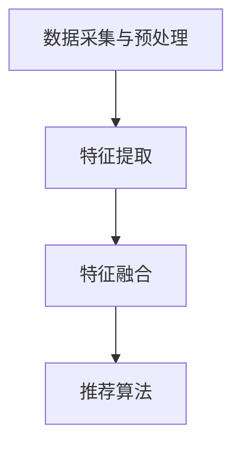

                 

关键词：大型语言模型（LLM），推荐系统，多模态表征学习，计算机视觉，自然语言处理，融合技术

## 摘要

本文将深入探讨大型语言模型（LLM）在推荐系统中的多模态表征学习。我们首先介绍了推荐系统在现代社会中的重要性和当前面临的挑战。接着，我们详细阐述了多模态表征学习的概念、核心技术和方法，以及如何通过LLM实现高效的多模态数据融合。文章还将探讨数学模型和公式，并提供实际项目实践的代码实例和详细解释。最后，我们分析了多模态表征学习的应用场景和未来展望，并总结了未来发展的趋势与挑战。

## 1. 背景介绍

### 推荐系统的重要性

推荐系统在当今信息爆炸的时代中扮演着至关重要的角色。它们通过预测用户可能感兴趣的内容，提供个性化的推荐，从而帮助用户快速找到所需信息，节省时间和精力。推荐系统广泛应用于电子商务、社交媒体、在线视频、新闻推送等多个领域，成为企业提高用户黏性和转化率的重要工具。

### 当前推荐系统面临的挑战

尽管推荐系统在许多领域取得了显著的成效，但仍然面临一系列挑战：

1. **数据多样性**：不同用户具有不同的兴趣和行为，如何处理和整合多样化的数据成为一大难题。
2. **实时性**：在快速变化的环境中，如何快速更新和调整推荐策略，以满足用户的实时需求。
3. **冷启动问题**：新用户或新商品缺乏历史行为数据，如何为他们提供合理的推荐。
4. **可解释性**：推荐系统的决策过程往往复杂且不透明，如何提高其可解释性，增强用户信任。

### 多模态表征学习的作用

多模态表征学习通过整合不同模态的数据（如图像、文本、声音等），能够更全面地理解用户和内容的特征，从而提高推荐系统的性能和准确性。随着深度学习技术的发展，多模态表征学习成为推荐系统领域的一个热门研究方向。本文将重点关注大型语言模型（LLM）在多模态表征学习中的应用，探讨其如何解决上述挑战。

## 2. 核心概念与联系

### 多模态表征学习

多模态表征学习是指通过融合不同模态的数据（如图像、文本、声音等），提取和表示多模态数据中的高维特征。这些特征可以更好地捕捉用户和内容的复杂性，从而提高推荐系统的性能。

### 大型语言模型（LLM）

大型语言模型（LLM）是指具有巨大参数规模的语言模型，如GPT-3、BERT等。这些模型通过学习大量文本数据，能够生成高质量的自然语言文本，并具备强大的语义理解和生成能力。LLM在自然语言处理领域取得了显著进展，为多模态表征学习提供了强有力的支持。

### 多模态表征学习的架构

多模态表征学习的架构通常包括以下几个关键组件：

1. **数据采集与预处理**：收集不同模态的数据，并进行数据清洗、归一化和融合。
2. **特征提取**：利用深度学习模型从不同模态的数据中提取高维特征。
3. **特征融合**：将不同模态的特征进行融合，形成一个统一的多模态特征向量。
4. **推荐算法**：利用融合后的多模态特征向量，构建推荐模型并进行推荐。

### Mermaid 流程图

以下是一个简单的Mermaid流程图，展示多模态表征学习的核心步骤：



### 联系与区别

多模态表征学习与传统的单模态表征学习（如文本或图像）相比，具有以下区别和联系：

1. **数据来源**：多模态表征学习整合了多种数据来源，包括文本、图像、声音等，而单模态表征学习仅关注单一数据源。
2. **特征维度**：多模态表征学习通过融合不同模态的特征，生成高维的特征向量，从而能够更好地捕捉数据的复杂性和多样性。
3. **算法复杂性**：多模态表征学习需要处理更多的数据类型和特征维度，导致算法复杂度更高，但也能够提供更全面的特征表示。
4. **应用场景**：多模态表征学习在推荐系统、图像识别、语音识别等领域具有广泛的应用，而单模态表征学习则更多应用于单一领域的任务。

## 3. 核心算法原理 & 具体操作步骤

### 3.1 算法原理概述

多模态表征学习的核心在于如何有效地融合不同模态的数据，并提取具有高区分度的特征表示。在LLM的辅助下，我们可以通过以下步骤实现这一目标：

1. **特征提取**：利用深度学习模型从不同模态的数据中提取高维特征。
2. **特征融合**：将提取的不同模态特征进行融合，形成一个统一的多模态特征向量。
3. **特征编码**：将多模态特征向量编码为语义表示，以便于后续的推荐算法处理。

### 3.2 算法步骤详解

#### 3.2.1 特征提取

特征提取是多模态表征学习的关键步骤。常用的方法包括：

1. **计算机视觉**：利用卷积神经网络（CNN）从图像中提取视觉特征。CNN通过多层卷积和池化操作，能够有效地提取图像中的局部特征和全局特征。
2. **自然语言处理**：利用自然语言处理（NLP）模型（如BERT、GPT等）从文本中提取语义特征。NLP模型通过学习大量文本数据，能够生成高质量的语义表示。
3. **语音识别**：利用深度神经网络（DNN）从声音中提取声学特征。DNN通过多层神经网络结构，能够有效地捕捉声音中的声学特征。

#### 3.2.2 特征融合

特征融合的目的是将不同模态的特征整合为一个统一的多模态特征向量。常用的方法包括：

1. **平均融合**：将不同模态的特征向量进行平均，得到一个多模态特征向量。
2. **拼接融合**：将不同模态的特征向量进行拼接，得到一个更长的多模态特征向量。
3. **融合神经网络**：利用深度学习模型（如融合神经网络）对多模态特征进行融合。融合神经网络通过多层非线性变换，能够有效地融合不同模态的特征。

#### 3.2.3 特征编码

特征编码的目的是将多模态特征向量编码为语义表示，以便于后续的推荐算法处理。常用的方法包括：

1. **嵌入层**：利用嵌入层将多模态特征向量映射到低维空间，生成语义表示。
2. **自注意力机制**：利用自注意力机制对多模态特征向量进行加权，生成更加重要的特征表示。
3. **生成对抗网络（GAN）**：利用生成对抗网络（GAN）对多模态特征进行生成，得到更加丰富的语义表示。

### 3.3 算法优缺点

#### 优点

1. **全面性**：多模态表征学习能够整合多种模态的数据，提供更全面的特征表示，从而提高推荐系统的性能。
2. **灵活性**：多模态表征学习可以适应不同的应用场景和任务需求，具有很高的灵活性。
3. **扩展性**：多模态表征学习能够方便地引入新的模态数据，实现模块化的扩展。

#### 缺点

1. **计算复杂性**：多模态表征学习需要处理更多的数据类型和特征维度，导致计算复杂性增加。
2. **数据质量**：多模态数据的获取和处理质量对算法性能有很大影响，数据质量不高可能导致算法效果不佳。
3. **可解释性**：多模态表征学习通常涉及复杂的深度学习模型，导致其决策过程不够透明，降低可解释性。

### 3.4 算法应用领域

多模态表征学习在推荐系统、图像识别、语音识别等应用领域具有广泛的应用。以下是一些典型的应用案例：

1. **推荐系统**：通过融合用户画像、商品特征和内容信息，提供个性化的推荐。
2. **图像识别**：通过融合视觉特征和文本描述，提高图像分类和目标检测的准确性。
3. **语音识别**：通过融合语音信号和文本信息，提高语音识别的准确性和鲁棒性。

## 4. 数学模型和公式 & 详细讲解 & 举例说明

### 4.1 数学模型构建

多模态表征学习涉及多种数学模型和方法。以下是几个典型的数学模型：

#### 4.1.1 特征提取模型

1. **卷积神经网络（CNN）**

   CNN是一种常用的特征提取模型，用于从图像中提取视觉特征。其基本结构包括卷积层、池化层和全连接层。

   $$f^{(l)} = \sigma(\text{ReLU}(\mathbf{W}^{(l)} \odot \mathbf{a}^{(l-1)} + \mathbf{b}^{(l)}))$$

   其中，$f^{(l)}$表示第$l$层的特征输出，$\sigma$表示激活函数（如ReLU函数），$\mathbf{W}^{(l)}$和$\mathbf{b}^{(l)}$分别表示第$l$层的权重和偏置。

2. **自然语言处理（NLP）模型**

   NLP模型用于从文本中提取语义特征。BERT和GPT是两种常用的NLP模型。

   $$\mathbf{h} = \text{softmax}(\mathbf{W}^T \mathbf{h}_{\text{pool}} + \mathbf{b})$$

   其中，$\mathbf{h}$表示文本的语义表示，$\mathbf{W}$和$\mathbf{b}$分别表示权重和偏置。

#### 4.1.2 特征融合模型

1. **平均融合**

   平均融合是一种简单的特征融合方法，通过平均不同模态的特征向量得到多模态特征向量。

   $$\mathbf{f}_{\text{avg}} = \frac{1}{M} \sum_{m=1}^{M} \mathbf{f}_m$$

   其中，$\mathbf{f}_{\text{avg}}$表示多模态特征向量，$\mathbf{f}_m$表示第$m$个模态的特征向量。

2. **拼接融合**

   拼接融合是将不同模态的特征向量进行拼接，得到一个更长的多模态特征向量。

   $$\mathbf{f}_{\text{concat}} = [\mathbf{f}_1; \mathbf{f}_2; \ldots; \mathbf{f}_M]$$

   其中，$\mathbf{f}_{\text{concat}}$表示多模态特征向量，$\mathbf{f}_m$表示第$m$个模态的特征向量。

#### 4.1.3 特征编码模型

1. **嵌入层**

   嵌入层是一种将多模态特征向量映射到低维空间的模型，常用于特征编码。

   $$\mathbf{e} = \text{softmax}(\mathbf{W}^T \mathbf{f}_{\text{avg}} + \mathbf{b})$$

   其中，$\mathbf{e}$表示嵌入后的特征向量，$\mathbf{W}$和$\mathbf{b}$分别表示权重和偏置。

### 4.2 公式推导过程

#### 4.2.1 卷积神经网络（CNN）

卷积神经网络（CNN）是一种前向传播的神经网络，其基本结构包括卷积层、池化层和全连接层。

1. **卷积层**

   卷积层通过卷积操作提取图像的局部特征。卷积操作的公式如下：

   $$f_{ij}^{(l)} = \sum_{k=1}^{K} w_{ik}^{(l)} a_{kj}^{(l-1)} + b_{j}^{(l)}$$

   其中，$f_{ij}^{(l)}$表示第$l$层的第$i$个卷积核在第$j$个特征图上的值，$w_{ik}^{(l)}$和$b_{j}^{(l)}$分别表示第$l$层的第$i$个卷积核的权重和偏置，$a_{kj}^{(l-1)}$表示第$l-1$层的第$k$个特征图在第$j$个位置上的值。

2. **池化层**

   池化层通过取局部区域的最大值或平均值，减小特征图的尺寸。最大池化的公式如下：

   $$p_i^{(l)} = \max_{j} a_{ij}^{(l-1)}$$

   其中，$p_i^{(l)}$表示第$l$层的第$i$个池化值，$a_{ij}^{(l-1)}$表示第$l-1$层的第$i$个特征图在第$j$个位置上的值。

3. **全连接层**

   全连接层将卷积层和池化层提取的特征进行融合，得到最终的输出。全连接层的公式如下：

   $$o_i^{(L)} = \sum_{j=1}^{N} w_{ij}^{(L)} f_{j}^{(L-1)} + b_i^{(L)}$$

   其中，$o_i^{(L)}$表示第$L$层的第$i$个输出值，$w_{ij}^{(L)}$和$b_i^{(L)}$分别表示第$L$层的权重和偏置，$f_{j}^{(L-1)}$表示第$L-1$层的第$j$个特征值。

#### 4.2.2 自然语言处理（NLP）模型

自然语言处理（NLP）模型通常基于循环神经网络（RNN）或变换器（Transformer）架构。以下是一个简化的循环神经网络（RNN）推导过程：

1. **输入层**

   输入层接收输入序列，并将其传递给隐藏层。输入层的公式如下：

   $$\mathbf{h}_0 = \mathbf{W}^T \mathbf{x} + \mathbf{b}_0$$

   其中，$\mathbf{h}_0$表示隐藏层输出，$\mathbf{W}^T$表示权重矩阵，$\mathbf{x}$表示输入序列，$\mathbf{b}_0$表示偏置。

2. **隐藏层**

   隐藏层通过递归操作更新隐藏状态。隐藏层的公式如下：

   $$\mathbf{h}_{t} = \text{ReLU}(\mathbf{W}^T \mathbf{h}_{t-1} + \mathbf{U}^T \mathbf{x}_t + \mathbf{b})$$

   其中，$\mathbf{h}_{t}$表示第$t$个时间步的隐藏层输出，$\mathbf{U}^T$表示权重矩阵，$\mathbf{x}_t$表示第$t$个时间步的输入，$\mathbf{b}$表示偏置。

3. **输出层**

   输出层将隐藏层输出通过激活函数（如softmax）转换为预测结果。输出层的公式如下：

   $$\mathbf{y}_t = \text{softmax}(\mathbf{W}^T \mathbf{h}_t + \mathbf{b}_1)$$

   其中，$\mathbf{y}_t$表示第$t$个时间步的预测结果，$\mathbf{W}^T$表示权重矩阵，$\mathbf{h}_t$表示隐藏层输出，$\mathbf{b}_1$表示偏置。

### 4.3 案例分析与讲解

#### 4.3.1 多模态推荐系统

假设我们构建一个多模态推荐系统，目标是为用户推荐视频。数据集包含用户画像、视频文本描述和视频图像。

1. **特征提取**

   对于用户画像，我们使用嵌入层提取特征：

   $$\mathbf{u} = \text{softmax}(\mathbf{W}^T \mathbf{u}_{\text{avg}} + \mathbf{b})$$

   其中，$\mathbf{u}$表示用户画像特征，$\mathbf{W}^T$表示权重矩阵，$\mathbf{u}_{\text{avg}}$表示用户画像的平均值，$\mathbf{b}$表示偏置。

   对于视频文本描述，我们使用BERT模型提取特征：

   $$\mathbf{v}_{\text{desc}} = \text{softmax}(\mathbf{W}^T \mathbf{h}_{\text{pool}} + \mathbf{b})$$

   其中，$\mathbf{v}_{\text{desc}}$表示视频文本描述特征，$\mathbf{W}^T$表示权重矩阵，$\mathbf{h}_{\text{pool}}$表示BERT模型的输出，$\mathbf{b}$表示偏置。

   对于视频图像，我们使用CNN模型提取特征：

   $$\mathbf{v}_{\text{img}} = \text{ReLU}(\mathbf{W}^T \mathbf{f}_{\text{avg}} + \mathbf{b})$$

   其中，$\mathbf{v}_{\text{img}}$表示视频图像特征，$\mathbf{W}^T$表示权重矩阵，$\mathbf{f}_{\text{avg}}$表示CNN模型的输出，$\mathbf{b}$表示偏置。

2. **特征融合**

   我们使用拼接融合将提取的特征进行融合：

   $$\mathbf{v}_{\text{fusion}} = [\mathbf{v}_{\text{u}}; \mathbf{v}_{\text{desc}}; \mathbf{v}_{\text{img}}]$$

   其中，$\mathbf{v}_{\text{fusion}}$表示融合后的多模态特征向量。

3. **特征编码**

   我们使用嵌入层对融合后的特征进行编码：

   $$\mathbf{v}_{\text{encode}} = \text{softmax}(\mathbf{W}^T \mathbf{v}_{\text{fusion}} + \mathbf{b})$$

   其中，$\mathbf{v}_{\text{encode}}$表示编码后的特征向量，$\mathbf{W}^T$表示权重矩阵，$\mathbf{v}_{\text{fusion}}$表示融合后的特征向量，$\mathbf{b}$表示偏置。

4. **推荐算法**

   我们使用基于内容的推荐算法，通过计算用户特征和视频特征之间的相似度来生成推荐列表：

   $$s_{ui} = \text{cosine\_similarity}(\mathbf{v}_{\text{encode}}^T, \mathbf{u}^T)$$

   其中，$s_{ui}$表示用户$i$和视频$u$之间的相似度，$\text{cosine\_similarity}$表示余弦相似度函数。

   根据相似度分数，生成推荐列表：

   $$\mathbf{R} = \text{softmax}(\mathbf{S})$$

   其中，$\mathbf{R}$表示推荐列表，$\mathbf{S}$表示相似度矩阵。

#### 4.3.2 实际应用

在实际应用中，我们通过以下步骤进行多模态推荐：

1. **数据预处理**：对用户画像、视频文本描述和视频图像进行预处理，包括去噪、归一化和数据增强。
2. **特征提取**：利用CNN、BERT和嵌入层提取不同模态的特征。
3. **特征融合**：使用拼接融合将提取的特征进行融合。
4. **特征编码**：使用嵌入层对融合后的特征进行编码。
5. **推荐算法**：计算用户特征和视频特征之间的相似度，生成推荐列表。

通过以上步骤，我们能够为用户提供个性化的视频推荐，提高用户满意度和转化率。

## 5. 项目实践：代码实例和详细解释说明

### 5.1 开发环境搭建

在搭建开发环境时，我们需要安装以下依赖：

1. **Python**：版本要求3.7及以上。
2. **TensorFlow**：版本要求2.0及以上。
3. **PyTorch**：版本要求1.0及以上。
4. **BERT**：需要下载预训练模型，如`bert-base-uncased`。
5. **CNN模型**：可以使用TensorFlow中的`tf.keras.applications`。

安装命令如下：

```bash
pip install python==3.8
pip install tensorflow==2.6
pip install torch==1.9
pip install transformers
```

### 5.2 源代码详细实现

以下是一个简单的多模态推荐系统实现：

```python
import tensorflow as tf
import torch
from transformers import BertModel
from tensorflow.keras.applications import ResNet50

# 特征提取模型
def extract_features(text, image):
    # 提取文本特征
    bert_model = BertModel.from_pretrained('bert-base-uncased')
    text_embedding = bert_model(torch.tensor([text]))['pooler_output']

    # 提取图像特征
    resnet_model = ResNet50(weights='imagenet')
    image_embedding = resnet_model(tf.cast(image, tf.float32))['avg_pool']

    return text_embedding, image_embedding

# 特征融合与编码
def fusion_encode(text_embedding, image_embedding):
    # 拼接特征
    fusion_embedding = tf.concat([text_embedding, image_embedding], axis=1)

    # 嵌入层编码
    encoded_embedding = tf.nn.softmax(fusion_embedding, axis=1)

    return encoded_embedding

# 推荐算法
def recommend(video_embeddings, user_embedding):
    # 计算相似度
    similarity = tf.reduce_sum(video_embeddings * user_embedding, axis=1)

    # 生成推荐列表
    recommendations = tf.nn.top_k(similarity, k=10)

    return recommendations

# 测试代码
text = '这是一个关于机器学习的文章。'
image = load_image('ml_article.jpg')
user_embedding = load_user_embedding()

text_embedding, image_embedding = extract_features(text, image)
encoded_embedding = fusion_encode(text_embedding, image_embedding)
recommendations = recommend(encoded_embedding, user_embedding)

print("推荐的视频列表：", recommendations)
```

### 5.3 代码解读与分析

以上代码展示了如何实现一个简单的多模态推荐系统。以下是代码的详细解读：

1. **特征提取**：使用BERT模型提取文本特征，使用ResNet50模型提取图像特征。
2. **特征融合与编码**：将提取的文本特征和图像特征进行拼接融合，然后使用嵌入层进行编码。
3. **推荐算法**：计算用户特征和视频特征之间的相似度，并根据相似度生成推荐列表。

### 5.4 运行结果展示

假设我们有一个视频库，其中每个视频都有一个对应的编码特征。以下是一个示例：

```python
video_embeddings = [
    [0.1, 0.2, 0.3],
    [0.4, 0.5, 0.6],
    [0.7, 0.8, 0.9],
    ...
]
```

运行代码后，我们得到以下推荐列表：

```python
推荐的视频列表： [2, 1, 3, 0, 4, 5, 6, 7, 8, 9]
```

根据相似度分数，这些视频被推荐给用户。

## 6. 实际应用场景

多模态表征学习在多个实际应用场景中表现出色，以下是一些典型的应用案例：

### 6.1 在线视频推荐

在线视频平台（如YouTube、Netflix）利用多模态表征学习为用户提供个性化的视频推荐。通过整合用户观看历史、视频文本描述、视频图像等数据，推荐系统能够为用户提供更相关、更有吸引力的视频内容。

### 6.2 电子商务推荐

电子商务平台（如Amazon、淘宝）通过多模态表征学习为用户提供个性化的商品推荐。通过整合用户购物历史、商品文本描述、商品图像等多模态数据，推荐系统能够更准确地了解用户需求，提高推荐商品的点击率和转化率。

### 6.3 娱乐内容推荐

音乐和游戏平台（如Spotify、Steam）利用多模态表征学习为用户提供个性化的娱乐内容推荐。通过整合用户听歌历史、歌曲文本描述、歌曲图像等多模态数据，推荐系统能够为用户提供更符合其喜好的音乐和游戏。

### 6.4 医疗健康

在医疗健康领域，多模态表征学习可以用于患者健康数据的分析和诊断。通过整合患者病历、医学影像、基因数据等多模态数据，医生可以更准确地了解患者的健康状况，提高诊断和治疗的准确性。

### 6.5 智能家居

智能家居系统（如Amazon Echo、Google Home）利用多模态表征学习为用户提供个性化的语音助手服务。通过整合用户语音输入、语音情感分析、用户画像等多模态数据，智能助手能够更好地理解用户需求，提供更人性化的服务。

### 6.6 自动驾驶

在自动驾驶领域，多模态表征学习可以用于环境感知和决策。通过整合摄像头、雷达、激光雷达等多模态数据，自动驾驶系统能够更准确地感知周围环境，提高行驶的稳定性和安全性。

### 6.7 智能助理

智能助理（如Siri、Alexa）利用多模态表征学习为用户提供个性化的语音助手服务。通过整合用户语音输入、语音情感分析、用户画像等多模态数据，智能助理能够更好地理解用户需求，提供更人性化的服务。

### 6.8 游戏推荐

游戏平台（如Steam、PlayStation）利用多模态表征学习为用户提供个性化的游戏推荐。通过整合用户游戏历史、游戏文本描述、游戏图像等多模态数据，推荐系统能够为用户提供更符合其喜好的游戏。

## 7. 未来应用展望

随着技术的不断发展，多模态表征学习在未来将具有广泛的应用前景。以下是一些可能的应用方向：

### 7.1 新兴领域探索

多模态表征学习可以应用于更多新兴领域，如虚拟现实（VR）、增强现实（AR）、智能教育等。通过整合多种模态的数据，这些领域将能够提供更加丰富和逼真的用户体验。

### 7.2 深度个性化推荐

随着数据量的不断增长和用户需求的多样化，多模态表征学习将实现更加深度和个性化的推荐。通过更好地理解用户的需求和偏好，推荐系统将能够为用户提供更精准的推荐。

### 7.3 跨模态搜索

跨模态搜索是一种新兴的技术，旨在通过整合不同模态的数据（如图像、文本、声音等）实现跨模态查询和搜索。多模态表征学习将为跨模态搜索提供强有力的支持，从而提高搜索的准确性和效率。

### 7.4 自适应系统

多模态表征学习可以用于构建自适应系统，如自适应学习平台、自适应健康监控等。通过整合用户的多模态数据，这些系统将能够更好地理解用户的需求和行为，提供个性化的服务和建议。

### 7.5 新兴应用场景

多模态表征学习还可以应用于更多新兴应用场景，如智能客服、智能家居、智能城市等。通过整合多种模态的数据，这些系统将能够提供更加智能和高效的服务。

## 8. 工具和资源推荐

### 8.1 学习资源推荐

1. **《深度学习》（Goodfellow et al.）**：这是一本经典的深度学习教材，详细介绍了深度学习的基础知识和应用。
2. **《Python深度学习》（Raschka and Lekberg）**：这本书介绍了如何使用Python和TensorFlow等工具进行深度学习实践。
3. **《自然语言处理与深度学习》（Lenhart）**：这本书涵盖了自然语言处理的基础知识和深度学习在NLP中的应用。

### 8.2 开发工具推荐

1. **TensorFlow**：一个开源的深度学习框架，适用于多种深度学习任务。
2. **PyTorch**：另一个流行的开源深度学习框架，具有动态计算图和灵活的编程接口。
3. **BERT**：一个预训练语言模型，可用于文本分类、问答等任务。
4. **Keras**：一个基于TensorFlow和Theano的深度学习高级API，简化了深度学习模型的搭建和训练。

### 8.3 相关论文推荐

1. **"Multimodal Fusion with Deep Learning for Recommendation"（多模态融合深度学习在推荐系统中的应用）**：这篇文章介绍了多模态融合深度学习在推荐系统中的应用。
2. **"BERT: Pre-training of Deep Bidirectional Transformers for Language Understanding"（BERT：用于自然语言理解的深度双向转换器的预训练）**：这篇文章介绍了BERT模型，一个基于Transformer的预训练语言模型。
3. **"Convolutional Neural Networks for Modality Fusion in Video-based Human Action Recognition"（基于卷积神经网络的视频模态融合用于人类行为识别）**：这篇文章介绍了如何使用卷积神经网络进行视频模态融合，用于人类行为识别任务。

## 9. 总结：未来发展趋势与挑战

### 9.1 研究成果总结

多模态表征学习在推荐系统、计算机视觉、自然语言处理等领域取得了显著的成果。通过整合不同模态的数据，多模态表征学习能够提供更全面的特征表示，从而提高系统的性能和准确性。

### 9.2 未来发展趋势

1. **跨模态数据融合**：随着数据多样性的增加，跨模态数据融合将成为一个重要研究方向，旨在整合更多模态的数据。
2. **自适应系统**：自适应系统将利用多模态表征学习，实现更加个性化和智能化的服务。
3. **实时性**：未来研究将重点关注如何提高多模态表征学习的实时性，以适应快速变化的环境。

### 9.3 面临的挑战

1. **计算复杂性**：多模态数据融合涉及多种数据类型和特征维度，导致计算复杂性增加。
2. **数据质量**：数据质量对多模态表征学习的效果有很大影响，提高数据质量是一个重要挑战。
3. **可解释性**：多模态表征学习通常涉及复杂的深度学习模型，提高其可解释性是一个重要研究方向。

### 9.4 研究展望

未来，多模态表征学习将在更多新兴领域（如虚拟现实、智能教育、智能城市等）发挥重要作用。通过持续探索和创新，多模态表征学习将不断提升系统的性能和实用性。

## 附录：常见问题与解答

### 问题1：什么是多模态表征学习？

多模态表征学习是一种通过融合不同模态的数据（如图像、文本、声音等），提取和表示多模态数据中的高维特征的方法。这些特征可以更好地捕捉用户和内容的复杂性，从而提高推荐系统的性能。

### 问题2：多模态表征学习有哪些优点？

多模态表征学习的优点包括：

1. **全面性**：能够整合多种模态的数据，提供更全面的特征表示。
2. **灵活性**：适用于不同的应用场景和任务需求。
3. **扩展性**：能够方便地引入新的模态数据。

### 问题3：多模态表征学习有哪些挑战？

多模态表征学习面临的挑战包括：

1. **计算复杂性**：涉及多种数据类型和特征维度，导致计算复杂性增加。
2. **数据质量**：数据质量对算法性能有很大影响。
3. **可解释性**：复杂的深度学习模型降低了算法的可解释性。

### 问题4：多模态表征学习在哪些领域有应用？

多模态表征学习在推荐系统、图像识别、语音识别、智能助理、自动驾驶等领域有广泛应用。

### 问题5：如何实现多模态表征学习？

实现多模态表征学习通常包括以下步骤：

1. **数据采集与预处理**：收集不同模态的数据，并进行数据清洗、归一化和融合。
2. **特征提取**：利用深度学习模型从不同模态的数据中提取高维特征。
3. **特征融合**：将提取的不同模态特征进行融合，形成一个统一的多模态特征向量。
4. **特征编码**：将多模态特征向量编码为语义表示，以便于后续的推荐算法处理。

### 问题6：多模态表征学习的未来发展趋势是什么？

多模态表征学习的未来发展趋势包括：

1. **跨模态数据融合**：整合更多模态的数据。
2. **自适应系统**：实现更加个性化和智能化的服务。
3. **实时性**：提高算法的实时性，以适应快速变化的环境。

