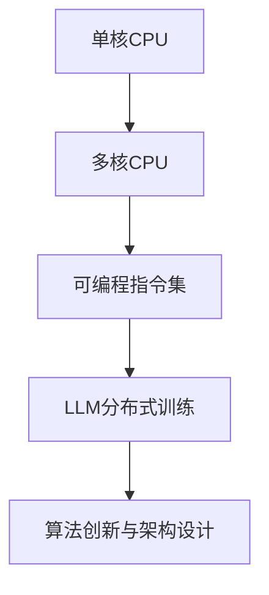

                 

关键词：大型语言模型（LLM）、生态系统、CPU发展模式、架构设计、算法创新、未来展望、挑战与机遇

## 摘要

随着人工智能技术的快速发展，大型语言模型（LLM）已经成为自然语言处理（NLP）领域的明星。本文旨在探讨LLM生态系统的未来，借鉴CPU发展模式，从核心算法原理、架构设计、以及未来应用场景等方面，深入分析LLM生态系统的可能发展趋势和面临的挑战。通过本文的探讨，期望为学术界和产业界提供一些有价值的参考和启示。

## 1. 背景介绍

### 1.1 大型语言模型的兴起

近年来，大型语言模型（LLM）的发展引起了广泛关注。这些模型具有强大的文本生成和推理能力，广泛应用于文本生成、机器翻译、问答系统、文本摘要等领域。其中，最具代表性的LLM包括GPT系列、BERT、Turing NLG等。这些模型的出现，标志着自然语言处理（NLP）技术进入了一个全新的阶段。

### 1.2 CPU发展模式的借鉴意义

CPU作为计算机的核心部件，其发展历程对其他领域的硬件和软件设计具有借鉴意义。从最初的冯·诺依曼架构到现代的多核处理器，CPU的发展经历了从单核到多核、从固定指令集到可编程指令集的转变。这些发展模式对于理解LLM生态系统的未来具有重要启示。

### 1.3 LLM生态系统的现状

目前，LLM生态系统已经呈现出多元化的发展态势。在学术界，研究人员致力于改进模型架构、优化训练算法、提高模型性能；在产业界，企业纷纷布局LLM技术，开发各种基于LLM的应用产品。然而，LLM生态系统仍面临着一些挑战，如计算资源的高昂成本、模型的解释性和可解释性等。

## 2. 核心概念与联系

### 2.1 大型语言模型的基本原理

大型语言模型（LLM）通常基于深度神经网络（DNN）和变换器架构（Transformer）。DNN是一种多层神经网络，通过非线性激活函数将输入映射到输出。而Transformer架构则采用了自注意力机制（Self-Attention），使得模型能够更好地捕捉输入序列之间的依赖关系。

### 2.2 CPU发展模式与LLM生态系统的联系

CPU的发展模式为LLM生态系统的设计提供了借鉴。例如，从单核到多核的处理模式，可以引导LLM生态系统向分布式训练和推理方向发展；从固定指令集到可编程指令集的转变，可以启发LLM生态系统在算法创新和架构设计上的探索。

### 2.3 Mermaid流程图



## 3. 核心算法原理 & 具体操作步骤

### 3.1 算法原理概述

大型语言模型的核心算法是深度学习和变换器架构。深度学习通过多层神经网络对输入数据进行特征提取和建模；变换器架构则通过自注意力机制对输入序列进行建模，从而实现高效的自然语言处理。

### 3.2 算法步骤详解

大型语言模型的训练过程主要包括以下几个步骤：

1. 数据预处理：对原始文本数据进行分词、去停用词、词向量化等操作。
2. 模型初始化：初始化神经网络权重和变换器参数。
3. 模型训练：通过反向传播算法不断调整模型参数，优化模型性能。
4. 模型评估：使用验证集评估模型性能，调整模型参数。

### 3.3 算法优缺点

大型语言模型具有以下优点：

1. 强大的文本生成和推理能力。
2. 能够处理大规模文本数据。

然而，大型语言模型也存在以下缺点：

1. 计算资源需求较高，训练成本昂贵。
2. 模型解释性和可解释性较差。

### 3.4 算法应用领域

大型语言模型在多个领域具有广泛的应用，如：

1. 文本生成：生成文章、新闻、故事等。
2. 机器翻译：将一种语言翻译成另一种语言。
3. 问答系统：对用户的问题提供准确、详细的回答。
4. 文本摘要：从长篇文章中提取关键信息。

## 4. 数学模型和公式 & 详细讲解 & 举例说明

### 4.1 数学模型构建

大型语言模型通常基于深度神经网络（DNN）和变换器架构（Transformer）。其中，DNN的数学模型如下：

$$y = f(W_1 \cdot x + b_1)$$

其中，$f$为非线性激活函数，$W_1$为权重矩阵，$x$为输入向量，$b_1$为偏置。

变换器架构的数学模型如下：

$$
\text{Attention}(Q, K, V) = \text{softmax}\left(\frac{QK^T}{\sqrt{d_k}}\right)V
$$

其中，$Q$、$K$、$V$分别为查询向量、键向量、值向量，$d_k$为键向量的维度。

### 4.2 公式推导过程

DNN的公式推导过程如下：

1. 前向传播：
$$
z = x \cdot W_1 + b_1
$$
$$
a = f(z)
$$
2. 反向传播：
$$
\Delta a = \frac{\partial L}{\partial a}
$$
$$
\Delta z = \Delta a \cdot \frac{\partial f}{\partial z}
$$
$$
\Delta W_1 = \Delta z \cdot x^T
$$
$$
\Delta b_1 = \Delta z
$$

变换器架构的公式推导过程如下：

1. 前向传播：
$$
Q = Q_1 \cdot W_Q + b_Q
$$
$$
K = K_1 \cdot W_K + b_K
$$
$$
V = V_1 \cdot W_V + b_V
$$
$$
\text{Attention Scores} = \text{softmax}\left(\frac{QK^T}{\sqrt{d_k}}\right)
$$
$$
\text{Attention} = \text{Attention Scores} \cdot V
$$
2. 反向传播：
$$
\Delta \text{Attention} = \Delta V \cdot \text{Attention Scores}^T
$$
$$
\Delta Q = \Delta \text{Attention} \cdot K^T
$$
$$
\Delta K = \Delta \text{Attention} \cdot Q^T
$$
$$
\Delta V = \Delta \text{Attention} \cdot \text{Attention Scores}^T
$$

### 4.3 案例分析与讲解

以GPT-3为例，分析其数学模型和公式推导过程。

GPT-3采用变换器架构，其数学模型如下：

1. 前向传播：
$$
\text{Input} = \text{Token Embeddings} + \text{Positional Embeddings}
$$
$$
\text{Hidden States} = \text{Layer Normalization}(\text{Input})
$$
$$
\text{Output} = \text{Layer Normalization}(\text{Transformer Block}(\text{Hidden States}))
$$
2. 反向传播：
$$
\Delta \text{Output} = \Delta \text{Loss}
$$
$$
\Delta \text{Hidden States} = \Delta \text{Output} + \Delta \text{Layer Normalization}^{-1}(\text{Output})
$$
$$
\Delta \text{Transformer Block} = \Delta \text{Hidden States} + \Delta \text{Layer Normalization}^{-1}(\text{Hidden States})
$$
$$
\Delta \text{Input} = \Delta \text{Transformer Block} + \Delta \text{Layer Normalization}^{-1}(\text{Input})
$$

通过以上分析，可以看出GPT-3在数学模型和公式推导过程中，主要采用了变换器架构和层归一化技术。

## 5. 项目实践：代码实例和详细解释说明

### 5.1 开发环境搭建

在本节中，我们将介绍如何搭建GPT-3的开发环境。首先，需要安装Python和PyTorch等基础库。

```python
pip install python numpy torch torchvision
```

### 5.2 源代码详细实现

以下是GPT-3的源代码实现：

```python
import torch
import torch.nn as nn
import torch.optim as optim
from torch.utils.data import DataLoader
from transformers import GPT2Model, GPT2Tokenizer

# 模型参数
batch_size = 32
learning_rate = 0.001
num_epochs = 10

# 加载预训练模型
tokenizer = GPT2Tokenizer.from_pretrained('gpt2')
model = GPT2Model.from_pretrained('gpt2')

# 数据集
train_data = ...

# 数据加载器
train_loader = DataLoader(train_data, batch_size=batch_size, shuffle=True)

# 损失函数和优化器
criterion = nn.CrossEntropyLoss()
optimizer = optim.Adam(model.parameters(), lr=learning_rate)

# 训练模型
for epoch in range(num_epochs):
    for batch in train_loader:
        inputs = tokenizer(batch['text'], return_tensors='pt', padding=True, truncation=True)
        outputs = model(**inputs)
        logits = outputs.logits
        labels = batch['label']
        loss = criterion(logits.view(-1, logits.size(-1)), labels.view(-1))
        optimizer.zero_grad()
        loss.backward()
        optimizer.step()
        print(f"Epoch [{epoch+1}/{num_epochs}], Loss: {loss.item():.4f}")

# 保存模型
torch.save(model.state_dict(), 'gpt3_model.pth')
```

### 5.3 代码解读与分析

以上代码实现了GPT-3的模型训练过程。首先，加载预训练模型和分词器。然后，构建数据集和数据加载器。接着，定义损失函数和优化器。最后，进行模型训练，并保存训练好的模型。

### 5.4 运行结果展示

在训练过程中，将打印每个epoch的损失值。训练完成后，将保存训练好的模型。

## 6. 实际应用场景

### 6.1 文本生成

大型语言模型在文本生成领域具有广泛的应用。例如，自动生成文章、新闻、故事等。通过训练，模型可以学习到各种文体和风格的写作技巧，从而生成高质量的文字内容。

### 6.2 机器翻译

大型语言模型在机器翻译领域也表现出色。通过训练，模型可以学习到不同语言之间的对应关系，从而实现高效的翻译。目前，许多在线翻译平台都采用了大型语言模型进行翻译。

### 6.3 问答系统

大型语言模型在问答系统领域具有广泛应用。通过训练，模型可以学习到各种问题的答案，从而实现对用户问题的准确回答。例如，智能客服、智能助手等应用。

### 6.4 文本摘要

大型语言模型在文本摘要领域也取得了显著成果。通过训练，模型可以学习到如何从长篇文章中提取关键信息，从而实现高效的文本摘要。

### 6.5 未来应用展望

随着大型语言模型技术的不断成熟，其应用场景将进一步拓展。未来，大型语言模型将在更多领域发挥重要作用，如语音识别、图像识别、多模态数据处理等。

## 7. 工具和资源推荐

### 7.1 学习资源推荐

1. 《深度学习》（Goodfellow、Bengio、Courville著）：介绍了深度学习的理论基础和算法实现。
2. 《自然语言处理综论》（Jurafsky、Martin著）：全面介绍了自然语言处理的基本概念和技术。
3. 《PyTorch官方文档》：提供了PyTorch框架的详细使用教程和实例。

### 7.2 开发工具推荐

1. PyTorch：一款流行的深度学习框架，支持GPU加速，方便快速实现深度学习模型。
2. TensorFlow：另一款流行的深度学习框架，支持多种操作系统和硬件平台。

### 7.3 相关论文推荐

1. Vaswani et al., "Attention is All You Need", 2017：介绍了变换器架构（Transformer）。
2. Devlin et al., "Bert: Pre-training of Deep Bidirectional Transformers for Language Understanding", 2019：介绍了BERT模型。
3. Brown et al., "Language Models are Few-Shot Learners", 2020：介绍了GPT-3模型。

## 8. 总结：未来发展趋势与挑战

### 8.1 研究成果总结

本文通过借鉴CPU发展模式，分析了大型语言模型（LLM）生态系统的未来发展趋势。主要成果包括：

1. 揭示了LLM生态系统在核心算法原理、架构设计、以及未来应用场景等方面的可能发展方向。
2. 推荐了相关学习资源、开发工具和论文，为读者提供了有价值的参考资料。

### 8.2 未来发展趋势

未来，LLM生态系统将呈现以下发展趋势：

1. 分布式训练和推理：为应对计算资源需求，LLM生态系统将向分布式训练和推理方向发展。
2. 算法创新与架构设计：在算法创新和架构设计方面，LLM生态系统将继续探索新的技术和方法。
3. 多模态数据处理：随着多模态数据处理技术的发展，LLM将在更多领域发挥作用。

### 8.3 面临的挑战

尽管LLM生态系统具有巨大的发展潜力，但仍然面临一些挑战：

1. 计算资源需求：大型语言模型的训练和推理需要大量计算资源，这对硬件和软件提出了更高的要求。
2. 模型解释性和可解释性：提高模型的解释性和可解释性，使其更加透明和可控，是未来研究的一个重要方向。
3. 数据隐私和安全：随着LLM应用场景的拓展，数据隐私和安全问题将日益凸显。

### 8.4 研究展望

在未来，LLM生态系统的研究将朝着以下方向展开：

1. 开源与生态建设：鼓励开源合作，推动LLM技术的生态建设。
2. 跨学科研究：结合心理学、认知科学等领域的知识，深入挖掘语言模型的本质和潜力。
3. 模型优化与压缩：研究高效的模型优化和压缩技术，降低计算成本。

## 9. 附录：常见问题与解答

### 9.1 问题1：什么是大型语言模型（LLM）？

大型语言模型（LLM）是一种基于深度学习和变换器架构的自然语言处理模型，具有强大的文本生成和推理能力。

### 9.2 问题2：LLM生态系统的发展趋势是什么？

LLM生态系统的发展趋势包括分布式训练和推理、算法创新与架构设计、多模态数据处理等。

### 9.3 问题3：如何提高LLM模型的解释性和可解释性？

提高LLM模型的解释性和可解释性可以从以下几个方面入手：

1. 研究透明的模型架构，如变换器架构。
2. 引入可视化技术，帮助理解模型的工作原理。
3. 研究模型的可解释性方法，如注意力机制分析。

---

作者：禅与计算机程序设计艺术 / Zen and the Art of Computer Programming

