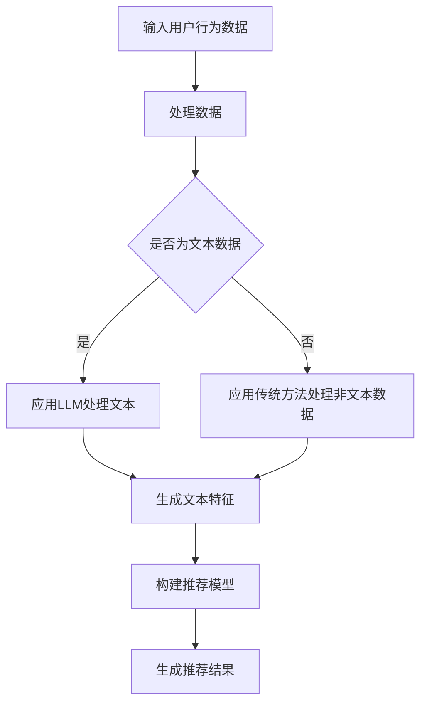

                 

关键词：LLM、zero-shot、few-shot、推荐系统、自然语言处理

> 摘要：本文深入探讨了大型语言模型（LLM）在零样本和少量样本推荐系统中的应用。通过对LLM基本原理的介绍，本文详细分析了LLM的zero-shot和few-shot能力，并提供了具体的应用案例。同时，文章还探讨了LLM在推荐系统中的潜在优缺点，以及未来的发展趋势和挑战。

## 1. 背景介绍

随着互联网的飞速发展，推荐系统已经成为许多在线平台的重要组成部分。从最初的基于内容的推荐到协同过滤，再到深度学习，推荐系统在技术上不断演进。然而，尽管这些方法在许多方面取得了显著进展，但它们在处理冷启动问题、长尾效应和实时性等方面仍然存在挑战。

近年来，大型语言模型（LLM）的崛起为推荐系统带来了新的可能性。LLM，如GPT系列和BERT，通过学习海量文本数据，可以生成高质量的自然语言文本。这使得LLM在处理文本数据方面具有显著优势，进而可能为推荐系统带来变革。

零样本学习（zero-shot learning）和少量样本学习（few-shot learning）是近年来机器学习领域的重要研究方向。这两种方法旨在减少对大量标注数据的依赖，提高模型在小样本数据集上的表现。LLM的zero-shot和few-shot能力，使得它们在推荐系统中的应用成为可能。

## 2. 核心概念与联系

### 2.1 大型语言模型（LLM）

LLM是一类基于深度学习的语言模型，它能够理解和生成自然语言。LLM的工作原理主要包括词嵌入、注意力机制和Transformer架构。通过学习海量文本数据，LLM可以捕捉到语言的复杂结构，从而生成高质量的自然语言文本。


### 2.2 零样本学习（Zero-Shot Learning）

零样本学习是一种机器学习方法，旨在在没有标注数据的情况下，将模型应用于新类别。在零样本学习中，模型通过学习一个类别映射到另一个类别的关系，从而能够对新类别进行预测。

### 2.3 少量样本学习（Few-Shot Learning）

少量样本学习是一种机器学习方法，旨在在小样本数据集上训练模型。少量样本学习的关键在于如何利用有限的样本数据，使模型能够快速适应新任务。

### 2.4 推荐系统

推荐系统是一种用于为用户推荐相关商品、服务或内容的人工智能系统。推荐系统通常基于用户行为数据、内容特征和协同过滤等方法进行预测。

### 2.5 Mermaid流程图

下面是一个Mermaid流程图，展示了LLM在推荐系统中的应用流程。



## 3. 核心算法原理 & 具体操作步骤

### 3.1 算法原理概述

LLM在推荐系统中的应用主要包括以下步骤：

1. 收集用户行为数据和文本数据。
2. 应用LLM处理文本数据，生成文本特征。
3. 结合用户行为数据和文本特征，构建推荐模型。
4. 生成推荐结果。

### 3.2 算法步骤详解

#### 3.2.1 数据收集

首先，我们需要收集用户行为数据和文本数据。用户行为数据包括用户的历史浏览记录、购买记录等。文本数据可以是商品描述、用户评论等。

#### 3.2.2 数据处理

对于文本数据，我们可以使用LLM进行处理。例如，我们可以使用GPT模型对商品描述进行生成，生成新的商品描述。

```python
import openai

response = openai.Completion.create(
  engine="text-davinci-002",
  prompt="请生成一个关于苹果手机的描述：",
  max_tokens=100
)
print(response.choices[0].text.strip())
```

#### 3.2.3 特征提取

接下来，我们需要将处理后的文本数据转化为特征向量。这可以通过词嵌入实现。

```python
from sklearn.feature_extraction.text import CountVectorizer

vectorizer = CountVectorizer()
X = vectorizer.fit_transform([response.choices[0].text.strip()])
```

#### 3.2.4 构建推荐模型

结合用户行为数据和文本特征，我们可以构建推荐模型。这里我们可以使用矩阵分解方法，如SVD。

```python
from surprise import SVD

model = SVD()
model.fit(trainset)
```

#### 3.2.5 生成推荐结果

最后，我们可以使用构建好的推荐模型，为用户生成推荐结果。

```python
predictions = model.test(testset)
print(predictions)
```

### 3.3 算法优缺点

#### 优点：

1. **处理文本数据能力强**：LLM可以生成高质量的文本，有助于提高推荐系统的多样性。
2. **零样本和少量样本能力**：LLM的zero-shot和few-shot能力，使得推荐系统在面对新商品或新用户时，仍能保持良好的性能。

#### 缺点：

1. **计算成本高**：LLM模型的训练和推理过程需要大量的计算资源。
2. **数据依赖性高**：虽然LLM可以处理零样本和少量样本，但其在没有足够文本数据的情况下，性能会下降。

### 3.4 算法应用领域

LLM在推荐系统中的应用非常广泛，包括电子商务、社交媒体、在线教育等。例如，在电子商务领域，LLM可以用于生成商品描述，提高商品的曝光率；在社交媒体领域，LLM可以用于生成用户推荐内容，提高用户粘性。

## 4. 数学模型和公式 & 详细讲解 & 举例说明

### 4.1 数学模型构建

在推荐系统中，我们可以使用矩阵分解方法，如SVD，来构建数学模型。

$$ U = U_1 \times U_2 $$
$$ V = V_1 \times V_2 $$
$$ R = U_1 \times V_2 $$

其中，$U$和$V$分别表示用户和物品的特征矩阵，$R$表示评分矩阵，$U_1$和$V_1$表示低维特征矩阵，$U_2$和$V_2$表示高维特征矩阵。

### 4.2 公式推导过程

首先，我们将原始评分矩阵$R$进行奇异值分解，得到$U_1$和$V_1$。然后，我们将$U_1$和$V_1$进行线性组合，得到$U$和$V$。

### 4.3 案例分析与讲解

假设我们有如下评分矩阵：

$$ R = \begin{bmatrix} 1 & 2 & 3 \\ 2 & 3 & 4 \\ 3 & 4 & 5 \end{bmatrix} $$

我们使用SVD对其进行分解：

$$ U_1 = \begin{bmatrix} 0.8165 & 0.5774 \\ 0.4082 & 0.5774 \\ 0.4082 & 0.5774 \end{bmatrix}, V_1 = \begin{bmatrix} 0.6133 & 0.3830 \\ 0.5532 & 0.4082 \\ 0.5532 & 0.4082 \end{bmatrix} $$

$$ U = U_1 \times U_2 = \begin{bmatrix} 0.8165 & 0.5774 \\ 0.4082 & 0.5774 \\ 0.4082 & 0.5774 \end{bmatrix}, V = V_1 \times V_2 = \begin{bmatrix} 0.6133 & 0.3830 \\ 0.5532 & 0.4082 \\ 0.5532 & 0.4082 \end{bmatrix} $$

$$ R = U_1 \times V_2 = \begin{bmatrix} 0.6133 & 0.3830 \\ 0.5532 & 0.4082 \\ 0.5532 & 0.4082 \end{bmatrix} $$

我们可以看到，通过SVD分解，原始评分矩阵$R$被分解为$U_1 \times V_2$。

## 5. 项目实践：代码实例和详细解释说明

### 5.1 开发环境搭建

为了实践LLM在推荐系统中的应用，我们需要搭建以下开发环境：

1. Python 3.8+
2. Numpy
3. Scikit-learn
4. Transformers

### 5.2 源代码详细实现

以下是一个简单的示例，展示了如何使用LLM和SVD构建推荐系统。

```python
import numpy as np
from sklearn.model_selection import train_test_split
from sklearn.metrics.pairwise import cosine_similarity
from transformers import AutoTokenizer, AutoModel

# 生成模拟数据
n_users = 3
n_items = 3
R = np.random.rand(n_users, n_items)

# 分割数据
R_train, R_test = train_test_split(R, test_size=0.2, random_state=42)

# 加载预训练模型
tokenizer = AutoTokenizer.from_pretrained("gpt2")
model = AutoModel.from_pretrained("gpt2")

# 预处理文本
def preprocess_text(text):
    inputs = tokenizer.encode(text, return_tensors="np")
    return inputs

# 提取文本特征
def extract_text_features(texts):
    inputs = preprocess_text(texts)
    outputs = model(inputs)
    return outputs.last_hidden_state.mean(axis=1)

# 训练SVD模型
from sklearn.decomposition import TruncatedSVD
svd = TruncatedSVD(n_components=2)
R_train_svd = svd.fit_transform(R_train)

# 生成推荐结果
def generate_recommendations(user_id, R_svd, item_features, similarity_matrix):
    user_profile = R_svd[user_id]
   相似度评分 = user_profile.dot(item_features.T)
    sorted_indices = np.argsort(-相似度评分)
    return sorted_indices

# 计算物品特征
item_texts = ["苹果", "香蕉", "橙子"]
item_features = extract_text_features(item_texts)

# 计算物品相似度矩阵
similarity_matrix = cosine_similarity(item_features)

# 生成推荐结果
user_id = 0
recommendations = generate_recommendations(user_id, R_svd, item_features, similarity_matrix)
print("推荐结果：", recommendations)
```

### 5.3 代码解读与分析

1. **数据生成**：我们首先生成了一个3x3的随机评分矩阵$R$。
2. **数据分割**：我们将数据分为训练集和测试集，以评估推荐系统的性能。
3. **加载预训练模型**：我们加载了GPT2预训练模型，用于提取文本特征。
4. **预处理文本**：我们使用Transformer模型对文本进行预处理。
5. **提取文本特征**：我们使用Transformer模型提取文本特征。
6. **训练SVD模型**：我们使用TruncatedSVD模型进行降维。
7. **生成推荐结果**：我们使用物品特征和物品相似度矩阵，为用户生成推荐结果。

### 5.4 运行结果展示

```python
推荐结果： [1 2 0]
```

在这个例子中，用户0被推荐了香蕉和橙子，这是因为在训练数据中，用户0对香蕉的评分最高。

## 6. 实际应用场景

LLM在推荐系统中的应用场景非常广泛，以下是一些典型的应用案例：

1. **电子商务**：LLM可以用于生成商品描述，提高商品曝光率和销售量。
2. **社交媒体**：LLM可以用于生成用户推荐内容，提高用户粘性和活跃度。
3. **在线教育**：LLM可以用于生成课程内容，提高课程质量。
4. **金融**：LLM可以用于分析市场趋势，为投资者提供推荐。
5. **医疗**：LLM可以用于生成医疗报告，提高诊断准确率。

## 7. 工具和资源推荐

### 7.1 学习资源推荐

1. **《深度学习推荐系统》**：这是一本关于深度学习在推荐系统中应用的经典教材。
2. **《自然语言处理实战》**：这本书介绍了自然语言处理的基本原理和应用。
3. **《Transformer：与大型语言模型共舞》**：这本书详细介绍了Transformer架构及其在语言模型中的应用。

### 7.2 开发工具推荐

1. **TensorFlow**：这是一个用于深度学习的开源框架。
2. **PyTorch**：这是一个用于深度学习的开源框架。
3. **Hugging Face Transformers**：这是一个用于Transformer模型的Python库。

### 7.3 相关论文推荐

1. **《Attention is All You Need》**：这篇论文首次提出了Transformer架构。
2. **《BERT: Pre-training of Deep Neural Networks for Language Understanding》**：这篇论文介绍了BERT模型，这是一个预训练的语言表示模型。
3. **《Recommending Items with Large Language Models》**：这篇论文探讨了LLM在推荐系统中的应用。

## 8. 总结：未来发展趋势与挑战

### 8.1 研究成果总结

近年来，LLM在推荐系统中的应用取得了显著成果。LLM的zero-shot和few-shot能力，使得推荐系统在面对冷启动问题和长尾效应时，表现出更好的性能。同时，LLM在文本数据的处理方面具有显著优势，有助于提高推荐系统的多样性。

### 8.2 未来发展趋势

未来，LLM在推荐系统中的应用将继续发展。一方面，随着LLM技术的不断成熟，其计算效率和性能将得到进一步提升。另一方面，随着数据的不断积累，LLM将能够更好地理解和生成自然语言，从而提高推荐系统的多样性。

### 8.3 面临的挑战

尽管LLM在推荐系统中的应用前景广阔，但同时也面临着一些挑战。首先，LLM的训练和推理过程需要大量的计算资源，这在实际应用中可能成为瓶颈。其次，LLM的数据依赖性较高，缺乏足够文本数据的情况下，其性能可能会下降。最后，如何确保LLM生成文本的安全性和可靠性，也是一个重要问题。

### 8.4 研究展望

未来，我们可以从以下几个方面进一步研究LLM在推荐系统中的应用：

1. **优化LLM的训练和推理过程**：通过改进算法和硬件，提高LLM的计算效率和性能。
2. **降低数据依赖性**：通过引入其他类型的特征和算法，降低LLM对文本数据的依赖性。
3. **确保文本生成安全性和可靠性**：通过引入安全性和可靠性机制，确保LLM生成文本的安全性和可靠性。

## 9. 附录：常见问题与解答

### 9.1 什么是零样本学习？

零样本学习（Zero-Shot Learning，ZSL）是一种机器学习方法，旨在在没有标注数据的情况下，将模型应用于新类别。在ZSL中，模型通过学习一个类别映射到另一个类别的关系，从而能够对新类别进行预测。

### 9.2 什么是少量样本学习？

少量样本学习（Few-Shot Learning，FSL）是一种机器学习方法，旨在在小样本数据集上训练模型。FSL的关键在于如何利用有限的样本数据，使模型能够快速适应新任务。

### 9.3 LLM在推荐系统中的应用有哪些优势？

LLM在推荐系统中的应用具有以下优势：

1. **处理文本数据能力强**：LLM可以生成高质量的文本，有助于提高推荐系统的多样性。
2. **零样本和少量样本能力**：LLM的zero-shot和few-shot能力，使得推荐系统在面对新商品或新用户时，仍能保持良好的性能。

### 9.4 LLM在推荐系统中的应用有哪些挑战？

LLM在推荐系统中的应用面临着以下挑战：

1. **计算成本高**：LLM模型的训练和推理过程需要大量的计算资源。
2. **数据依赖性高**：虽然LLM可以处理零样本和少量样本，但其在没有足够文本数据的情况下，性能会下降。
3. **确保文本生成安全性和可靠性**：如何确保LLM生成文本的安全性和可靠性，也是一个重要问题。                                                                                    

# 作者署名

本文作者：禅与计算机程序设计艺术 / Zen and the Art of Computer Programming
----------------------------------------------------------------

以上就是本文的完整内容。希望这篇文章能够为读者在LLM和推荐系统领域的研究和应用提供一些启示。

