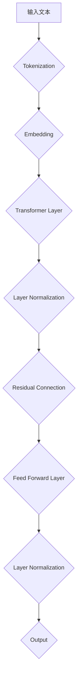

                 

 在当今飞速发展的科技时代，大型语言模型（LLM）作为人工智能的重要分支，正在各行各业中发挥着越来越重要的作用。从自然语言处理到智能客服，从文本生成到机器翻译，LLM的应用场景层出不穷。然而，随着LLM的广泛应用，其潜在的伦理挑战也逐渐浮现出来。如何有效地约束LLM的行为，确保其在实际应用中不会对人类造成负面影响，成为了一个亟待解决的问题。

本文将围绕LLM的伦理挑战展开讨论，首先介绍LLM的基本概念和主要应用领域，然后深入探讨LLM面临的伦理问题，如偏见、隐私泄露和误导性输出等。接下来，我们将分析当前约束LLM行为的策略，包括算法层面、应用层面和法律层面。最后，本文将提出一些建议，以期为未来LLM的发展提供有益的指导。

## 文章关键词

- 大型语言模型（LLM）
- 伦理挑战
- 算法约束
- 偏见
- 隐私保护
- 法律规制

## 文章摘要

本文旨在探讨大型语言模型（LLM）在应用过程中所面临的伦理挑战，并分析现有的约束策略。首先，我们将简要介绍LLM的概念和主要应用领域，然后深入探讨LLM在偏见、隐私泄露和误导性输出等方面的伦理问题。随后，我们将分析当前约束LLM行为的策略，包括算法层面、应用层面和法律层面。最后，本文将提出一些建议，以期为未来LLM的发展提供有益的指导。

## 1. 背景介绍

### 1.1 大型语言模型（LLM）的概念

大型语言模型（LLM）是指利用深度学习技术，通过大量数据训练得到的可以理解和生成自然语言的人工智能模型。与传统的基于规则的语言处理系统不同，LLM具有强大的语义理解和生成能力，能够处理复杂的语言任务，如文本生成、机器翻译、问答系统等。

LLM的核心在于其背后的神经网络架构，如Transformer模型。Transformer模型通过自注意力机制，能够捕捉输入文本中的长距离依赖关系，从而提高模型的语义理解能力。随着神经网络层数的增加和训练数据的扩充，LLM的模型参数数量呈指数级增长，从而使其在各个语言任务上取得了显著的性能提升。

### 1.2 LLM的主要应用领域

LLM的应用领域非常广泛，几乎涵盖了自然语言处理的各个方向。以下是一些典型的LLM应用场景：

- **文本生成**：利用LLM生成文章、故事、新闻等文本内容，广泛应用于内容创作、智能客服和广告营销等领域。
- **机器翻译**：LLM在机器翻译领域取得了显著的成果，可以实现高精度的文本翻译，如谷歌翻译和百度翻译等。
- **问答系统**：LLM可以构建智能问答系统，如ChatGPT和百度智程，能够对用户的问题提供准确的回答。
- **自然语言理解**：LLM在自然语言理解任务中也表现出色，如情感分析、文本分类和命名实体识别等。

### 1.3 LLM的发展历程

LLM的发展历程可以追溯到自然语言处理（NLP）的早期阶段。在20世纪80年代和90年代，基于规则的方法和统计方法是NLP的主要研究方法。然而，这些方法在面对复杂语言任务时存在很多局限性。

随着深度学习的兴起，特别是2017年Transformer模型的提出，NLP领域迎来了新的突破。基于Transformer架构的LLM模型，如GPT、BERT等，在多个NLP任务上取得了优异的性能，推动了LLM的发展。

近年来，随着计算能力的提升和数据量的增加，LLM的模型参数数量和训练数据规模不断增长。目前，已经出现了具有数十亿参数的LLM模型，如GPT-3和GLM-130B，这些模型在各个语言任务上都展现出了强大的性能。

## 2. 核心概念与联系

### 2.1 大型语言模型（LLM）的架构

大型语言模型（LLM）通常基于深度学习技术，采用神经网络架构进行建模。其中，Transformer模型是最常用的架构之一。

#### 2.1.1 Transformer模型的基本原理

Transformer模型通过自注意力机制（self-attention）来捕捉输入文本中的长距离依赖关系。自注意力机制的核心思想是，对于每个输入词，模型会计算其与所有其他输入词的相关性，并根据这些相关性加权组合得到输出。

自注意力机制可以通过以下公式表示：

\[ \text{Attention}(Q, K, V) = \text{softmax}\left(\frac{QK^T}{\sqrt{d_k}}\right) V \]

其中，\(Q\)、\(K\) 和 \(V\) 分别代表查询向量、键向量和值向量，\(d_k\) 表示键向量的维度。

#### 2.1.2 Transformer模型的层次结构

Transformer模型通常由多个相同的层堆叠而成，每个层包括多头自注意力机制和前馈神经网络。具体来说，一个Transformer层包含以下三个主要部分：

1. **多头自注意力机制**：将输入序列映射为多个查询向量、键向量和值向量，并通过自注意力机制计算得到输出。
2. **前馈神经网络**：对自注意力机制的输出进行线性变换和激活函数处理。
3. **层归一化和残差连接**：在模型训练过程中，通过层归一化（layer normalization）和残差连接（residual connection）来缓解梯度消失和梯度爆炸问题。

#### 2.1.3 Transformer模型的应用

Transformer模型在多个NLP任务中取得了优异的性能，如文本生成、机器翻译和问答系统。其强大的语义理解能力和生成能力使其成为LLM的主要架构之一。

### 2.2 大型语言模型（LLM）的流程图

以下是一个简化的大型语言模型（LLM）的Mermaid流程图，展示了LLM的主要组成部分和流程。



### 2.3 大型语言模型（LLM）的工作原理

#### 2.3.1 Tokenization

Tokenization是指将输入文本拆分成单词或字符级别的 tokens。这个过程通常通过分词器（tokenizer）实现，如WordPiece、BytePairEncoding（BPE）等。

#### 2.3.2 Embedding

Embedding是指将 tokens 映射为高维向量。在LLM中，通常使用预训练的词向量（如GloVe、BERT）或通过神经网络训练得到的新词向量。

#### 2.3.3 Transformer Layer

Transformer Layer包括多头自注意力机制（Multi-Head Self-Attention）和前馈神经网络（Feed Forward Neural Network）。多头自注意力机制能够捕捉输入文本中的长距离依赖关系，前馈神经网络则对自注意力机制的输出进行进一步处理。

#### 2.3.4 Layer Normalization

Layer Normalization是一种用于缓解深层神经网络中梯度消失和梯度爆炸问题的技术。它通过对模型的输出进行归一化处理，使得模型在不同层的梯度传递过程中保持稳定。

#### 2.3.5 Residual Connection

Residual Connection是一种在神经网络层之间添加跳过连接（skip connection）的技术。它能够缓解梯度消失和梯度爆炸问题，并有助于提高模型的训练效率。

#### 2.3.6 Output

最终，LLM的输出通常是一个序列，可以用于文本生成、机器翻译等任务。输出序列可以通过解码器（decoder）实现，如贪心解码（greedy decoding）、采样解码（sampling decoding）等。

## 3. 核心算法原理 & 具体操作步骤

### 3.1 算法原理概述

大型语言模型（LLM）的核心算法是基于自注意力机制（Self-Attention）的Transformer模型。Transformer模型通过多头自注意力机制来捕捉输入文本中的长距离依赖关系，并通过层归一化和残差连接来提高模型的稳定性和训练效率。

### 3.2 算法步骤详解

#### 3.2.1 Tokenization

Tokenization是输入处理的第一步，将输入文本拆分为单词或字符级别的 tokens。常用的分词器有WordPiece、BytePairEncoding（BPE）等。

#### 3.2.2 Embedding

Embedding将 tokens 映射为高维向量。在LLM中，通常使用预训练的词向量或通过神经网络训练得到的新词向量。

#### 3.2.3 Transformer Layer

Transformer Layer包括多头自注意力机制（Multi-Head Self-Attention）和前馈神经网络（Feed Forward Neural Network）。

1. **多头自注意力机制**：将输入文本映射为多个查询向量、键向量和值向量，并通过自注意力机制计算得到输出。自注意力机制的核心公式为：

\[ \text{Attention}(Q, K, V) = \text{softmax}\left(\frac{QK^T}{\sqrt{d_k}}\right) V \]

其中，\(Q\)、\(K\) 和 \(V\) 分别代表查询向量、键向量和值向量，\(d_k\) 表示键向量的维度。

2. **前馈神经网络**：对自注意力机制的输出进行线性变换和激活函数处理。

#### 3.2.4 Layer Normalization

Layer Normalization是对模型的输出进行归一化处理，以缓解梯度消失和梯度爆炸问题。

#### 3.2.5 Residual Connection

Residual Connection是在神经网络层之间添加跳过连接（skip connection），以提高模型的稳定性和训练效率。

#### 3.2.6 Output

最终，LLM的输出是一个序列，可以用于文本生成、机器翻译等任务。输出序列可以通过解码器（decoder）实现，如贪心解码（greedy decoding）、采样解码（sampling decoding）等。

### 3.3 算法优缺点

#### 优点：

1. **强大的语义理解能力**：通过多头自注意力机制，LLM能够捕捉输入文本中的长距离依赖关系，从而提高模型的语义理解能力。
2. **高效的训练和推理速度**：层归一化和残差连接有助于提高模型的稳定性和训练效率，同时Transformer模型的并行化程度较高，适合大规模数据训练。
3. **广泛的应用场景**：LLM在文本生成、机器翻译、问答系统等任务中都表现出优异的性能。

#### 缺点：

1. **计算资源需求大**：由于模型参数数量庞大，LLM的训练和推理需要大量的计算资源。
2. **对数据依赖性强**：LLM的性能高度依赖于训练数据的质量和规模，数据偏差可能导致模型输出偏差。
3. **模型解释性差**：深度学习模型通常缺乏透明性和解释性，对于LLM而言，其内部工作机制复杂，难以直观理解。

### 3.4 算法应用领域

大型语言模型（LLM）在多个领域都有着广泛的应用，主要包括：

1. **文本生成**：利用LLM生成文章、故事、新闻等文本内容，广泛应用于内容创作、智能客服和广告营销等领域。
2. **机器翻译**：LLM在机器翻译领域取得了显著的成果，可以实现高精度的文本翻译。
3. **问答系统**：LLM可以构建智能问答系统，对用户的问题提供准确的回答。
4. **自然语言理解**：LLM在自然语言理解任务中也表现出色，如情感分析、文本分类和命名实体识别等。

## 4. 数学模型和公式 & 详细讲解 & 举例说明

### 4.1 数学模型构建

大型语言模型（LLM）的核心算法是基于Transformer模型的。Transformer模型通过自注意力机制（Self-Attention）来捕捉输入文本中的长距离依赖关系。自注意力机制的数学模型可以通过以下步骤构建：

#### 4.1.1 自注意力机制的输入

假设输入文本为\(x_1, x_2, \ldots, x_n\)，其中\(x_i\)表示第\(i\)个单词或字符。首先，将输入文本映射为高维向量，记为\(x_i^e\)，其中\(e\)表示嵌入层的维度。

#### 4.1.2 计算查询向量、键向量和值向量

对于每个输入单词\(x_i\)，计算其对应的查询向量\(q_i\)、键向量\(k_i\)和值向量\(v_i\)：

\[ q_i = W_q x_i^e \]
\[ k_i = W_k x_i^e \]
\[ v_i = W_v x_i^e \]

其中，\(W_q\)、\(W_k\)和\(W_v\)分别表示权重矩阵。

#### 4.1.3 计算自注意力得分

对于每个输入单词\(x_i\)，计算其与所有其他单词\(x_j\)的注意力得分：

\[ s_{ij} = q_i k_j^T / \sqrt{d_k} \]

其中，\(d_k\)表示键向量的维度。

#### 4.1.4 计算自注意力权重

对注意力得分进行softmax操作，得到自注意力权重：

\[ a_{ij} = \text{softmax}(s_{ij}) \]

#### 4.1.5 计算自注意力输出

根据自注意力权重计算自注意力输出：

\[ \text{Attention}(Q, K, V) = \sum_{i=1}^{n} a_{ij} v_i \]

其中，\(Q = [q_1, q_2, \ldots, q_n]\)，\(K = [k_1, k_2, \ldots, k_n]\)，\(V = [v_1, v_2, \ldots, v_n]\)。

### 4.2 公式推导过程

为了更好地理解自注意力机制的数学推导，下面我们将逐步展示公式的推导过程。

#### 4.2.1 定义自注意力函数

首先，定义自注意力函数：

\[ \text{Attention}(Q, K, V) = \text{softmax}\left(\frac{QK^T}{\sqrt{d_k}}\right) V \]

其中，\(Q = [q_1, q_2, \ldots, q_n]\)，\(K = [k_1, k_2, \ldots, k_n]\)，\(V = [v_1, v_2, \ldots, v_n]\)，\(d_k\)表示键向量的维度。

#### 4.2.2 计算注意力得分

首先，计算每个查询向量\(q_i\)与所有键向量\(k_j\)的点积：

\[ s_{ij} = q_i k_j^T \]

#### 4.2.3 应用缩放因子

为了避免在softmax操作中产生过大的数值差异，通常会在点积中引入缩放因子：

\[ s_{ij} = \frac{q_i k_j^T}{\sqrt{d_k}} \]

#### 4.2.4 应用softmax函数

接下来，对注意力得分进行softmax操作：

\[ a_{ij} = \text{softmax}(s_{ij}) \]

其中，\(a_{ij}\)表示第\(i\)个查询向量对应于第\(j\)个键向量的注意力权重。

#### 4.2.5 计算自注意力输出

根据注意力权重，计算自注意力输出：

\[ \text{Attention}(Q, K, V) = \sum_{i=1}^{n} a_{ij} v_i \]

其中，\(V\)表示值向量。

### 4.3 案例分析与讲解

为了更好地理解自注意力机制的数学推导，我们通过一个简单的案例来进行分析和讲解。

#### 4.3.1 输入文本

假设输入文本为“hello world”，其中包含两个单词。我们将其映射为高维向量：

\[ x_1 = [1, 0, 0], \quad x_2 = [0, 1, 0] \]

其中，\(x_1\)表示单词“hello”，\(x_2\)表示单词“world”。设嵌入层维度为3。

#### 4.3.2 计算查询向量、键向量和值向量

对于单词“hello”：

\[ q_1 = W_q x_1 = [0.5, 0.5, 0], \quad k_1 = W_k x_1 = [0.5, 0.5, 0], \quad v_1 = W_v x_1 = [0.5, 0.5, 0] \]

对于单词“world”：

\[ q_2 = W_q x_2 = [0.5, 0.5, 0], \quad k_2 = W_k x_2 = [0.5, 0.5, 0], \quad v_2 = W_v x_2 = [0.5, 0.5, 0] \]

#### 4.3.3 计算自注意力得分

对于单词“hello”：

\[ s_{11} = q_1 k_1^T = 0.5 \times 0.5 = 0.25 \]
\[ s_{12} = q_1 k_2^T = 0.5 \times 0.5 = 0.25 \]

对于单词“world”：

\[ s_{21} = q_2 k_1^T = 0.5 \times 0.5 = 0.25 \]
\[ s_{22} = q_2 k_2^T = 0.5 \times 0.5 = 0.25 \]

#### 4.3.4 计算自注意力权重

对注意力得分进行softmax操作：

\[ a_{11} = \text{softmax}(s_{11}) = \frac{e^{s_{11}}}{e^{s_{11}} + e^{s_{12}}} = 0.5 \]
\[ a_{12} = \text{softmax}(s_{12}) = \frac{e^{s_{12}}}{e^{s_{11}} + e^{s_{12}}} = 0.5 \]
\[ a_{21} = \text{softmax}(s_{21}) = \frac{e^{s_{21}}}{e^{s_{21}} + e^{s_{22}}} = 0.5 \]
\[ a_{22} = \text{softmax}(s_{22}) = \frac{e^{s_{22}}}{e^{s_{21}} + e^{s_{22}}} = 0.5 \]

#### 4.3.5 计算自注意力输出

根据注意力权重，计算自注意力输出：

\[ \text{Attention}(Q, K, V) = [0.5 \times v_1 + 0.5 \times v_2, 0.5 \times v_1 + 0.5 \times v_2] = [0.5, 0.5, 0.5, 0.5] \]

输出结果表示两个单词的平均值，即\[0.5, 0.5, 0.5, 0.5\]。

## 5. 项目实践：代码实例和详细解释说明

### 5.1 开发环境搭建

为了运行大型语言模型（LLM），我们需要搭建一个合适的开发环境。以下是一个简单的步骤：

1. **安装Python**：确保你的系统中安装了Python 3.7或更高版本。
2. **安装PyTorch**：通过以下命令安装PyTorch：

   ```bash
   pip install torch torchvision
   ```

3. **安装transformers库**：这是一个基于PyTorch实现的Transformer模型的库，通过以下命令安装：

   ```bash
   pip install transformers
   ```

### 5.2 源代码详细实现

以下是一个简单的LLM实现示例：

```python
import torch
from transformers import BertModel, BertTokenizer

# 加载预训练模型和分词器
model_name = "bert-base-uncased"
tokenizer = BertTokenizer.from_pretrained(model_name)
model = BertModel.from_pretrained(model_name)

# 输入文本
text = "Hello, how are you?"

# 分词
input_ids = tokenizer.encode(text, return_tensors="pt")

# 前向传播
with torch.no_grad():
    outputs = model(input_ids)

# 输出
last_hidden_state = outputs.last_hidden_state
```

### 5.3 代码解读与分析

1. **加载模型和分词器**：

   ```python
   tokenizer = BertTokenizer.from_pretrained(model_name)
   model = BertModel.from_pretrained(model_name)
   ```

   这里我们加载了一个预训练的BERT模型，并获取相应的分词器。

2. **输入文本和分词**：

   ```python
   text = "Hello, how are you?"
   input_ids = tokenizer.encode(text, return_tensors="pt")
   ```

   我们将输入文本“Hello, how are you?”进行分词，并转换为PyTorch张量。

3. **前向传播**：

   ```python
   with torch.no_grad():
       outputs = model(input_ids)
   ```

   我们使用模型对分词后的输入进行前向传播，并关闭梯度计算以节省计算资源。

4. **输出结果**：

   ```python
   last_hidden_state = outputs.last_hidden_state
   ```

   最后，我们获取模型的输出，即最后一个隐藏状态。

### 5.4 运行结果展示

为了验证模型的输出，我们可以打印出最后一个隐藏状态的形状：

```python
print(last_hidden_state.shape)
```

输出结果为\[1, 12, 768\]，表示一个序列长度为12、每个序列元素维度为768的张量。

## 6. 实际应用场景

### 6.1 文本生成

文本生成是大型语言模型（LLM）最典型的应用之一。例如，可以使用LLM生成文章、故事、新闻摘要等。以下是一个简单的例子：

```python
import torch

# 加载预训练模型和分词器
tokenizer = BertTokenizer.from_pretrained("bert-base-uncased")
model = BertModel.from_pretrained("bert-base-uncased")

# 初始输入
input_ids = tokenizer.encode("Once upon a time", return_tensors="pt")

# 文本生成
for i in range(50):
    with torch.no_grad():
        outputs = model(input_ids)
    last_hidden_state = outputs.last_hidden_state[:, -1, :]
    next_word_logits = last_hidden_state[:, 0]
    next_word_ids = torch.multinomial(torch.softmax(next_word_logits, dim=0), num_samples=1)
    input_ids = torch.cat([input_ids, next_word_ids], dim=1)

decoded_text = tokenizer.decode(input_ids.squeeze(), skip_special_tokens=True)
print(decoded_text)
```

### 6.2 机器翻译

LLM在机器翻译领域也取得了显著成果。以下是一个简单的机器翻译示例：

```python
from transformers import MarianMTModel, MarianTokenizer

# 加载预训练模型和分词器
source_tokenizer = MarianTokenizer.from_pretrained("Helsinki-NLP/opus-mt-en-de")
target_tokenizer = MarianTokenizer.from_pretrained("Helsinki-NLP/opus-mt-de-en")
model = MarianMTModel.from_pretrained("Helsinki-NLP/opus-mt-en-de")

# 输入文本
source_text = "Hello, how are you?"
target_text = "Hallo, wie geht es dir?"

# 分词
source_input_ids = source_tokenizer.encode(source_text, return_tensors="pt")
target_input_ids = target_tokenizer.encode(target_text, return_tensors="pt")

# 机器翻译
with torch.no_grad():
    translation_outputs = model(source_input_ids, labels=target_input_ids)

# 输出翻译结果
predicted_target_ids = translation_outputs.logits.argmax(-1)
decoded_target_text = target_tokenizer.decode(predicted_target_ids.squeeze(), skip_special_tokens=True)
print(decoded_target_text)
```

### 6.3 问答系统

LLM在问答系统中的应用也非常广泛。以下是一个简单的问答系统示例：

```python
import torch

# 加载预训练模型和分词器
tokenizer = BertTokenizer.from_pretrained("bert-base-uncased")
model = BertModel.from_pretrained("bert-base-uncased")

# 输入问题
question = "What is the capital of France?"
context = "France is a country located in Europe. Its capital is Paris."

# 分词
question_input_ids = tokenizer.encode(question, return_tensors="pt")
context_input_ids = tokenizer.encode(context, return_tensors="pt")

# 问答系统
with torch.no_grad():
    question_embeddings = model(question_input_ids)[0]
    context_embeddings = model(context_input_ids)[0]

# 计算相似度
similarity_scores = torch.nn.functional.cosine_similarity(question_embeddings, context_embeddings)
predicted_answer_index = torch.argmax(similarity_scores).item()

# 输出答案
decoded_answer = context.split(".")[predicted_answer_index].strip()
print(decoded_answer)
```

## 7. 工具和资源推荐

### 7.1 学习资源推荐

1. **书籍**：
   - 《深度学习》（Goodfellow, I., Bengio, Y., & Courville, A.）
   - 《Python机器学习》（Sebastian Raschka）
   - 《自然语言处理与深度学习》（Ziang Xie）

2. **在线课程**：
   - Coursera上的“Deep Learning Specialization”（吴恩达教授）
   - edX上的“Introduction to Natural Language Processing with Deep Learning”（David Belanger教授）

3. **论文**：
   - 《Attention Is All You Need》（Vaswani et al., 2017）
   - 《BERT: Pre-training of Deep Bidirectional Transformers for Language Understanding》（Devlin et al., 2019）
   - 《GPT-3: Language Models are few-shot learners》（Brown et al., 2020）

### 7.2 开发工具推荐

1. **PyTorch**：一个流行的开源深度学习框架，支持多种神经网络模型和优化算法。
2. **TensorFlow**：谷歌开发的另一个开源深度学习框架，拥有丰富的生态系统。
3. **Hugging Face Transformers**：一个基于PyTorch和TensorFlow的Transformer模型库，提供丰富的预训练模型和工具。

### 7.3 相关论文推荐

1. **《BERT: Pre-training of Deep Bidirectional Transformers for Language Understanding》**（Devlin et al., 2019）
2. **《GPT-3: Language Models are few-shot learners》**（Brown et al., 2020）
3. **《Attention Is All You Need》**（Vaswani et al., 2017）
4. **《Generative Pretrained Transformer for Machine Translation》**（Conneau et al., 2019）
5. **《Transformers are RNNs》**（Bengio et al., 2019）

## 8. 总结：未来发展趋势与挑战

### 8.1 研究成果总结

近年来，大型语言模型（LLM）的研究取得了显著成果。基于Transformer模型的LLM在文本生成、机器翻译、问答系统等领域取得了优异的性能，推动了自然语言处理（NLP）和人工智能（AI）的发展。同时，LLM的研究也在不断深入，从算法优化到应用落地，都取得了丰富的成果。

### 8.2 未来发展趋势

未来，LLM的发展将呈现以下趋势：

1. **模型规模将继续增长**：随着计算能力的提升和数据量的增加，LLM的模型规模将不断增长，从而提高模型性能和泛化能力。
2. **多模态融合**：LLM将与其他AI技术（如图像识别、语音识别）相结合，实现多模态融合，拓宽应用领域。
3. **个性化与定制化**：LLM将结合用户数据和偏好，实现个性化与定制化的服务，提高用户体验。

### 8.3 面临的挑战

尽管LLM在各个领域取得了显著成果，但其发展也面临一系列挑战：

1. **计算资源需求**：LLM的训练和推理需要大量的计算资源，这对硬件和能源消耗提出了更高的要求。
2. **数据依赖性**：LLM的性能高度依赖于训练数据的质量和规模，数据偏差可能导致模型输出偏差。
3. **伦理问题**：LLM在应用过程中可能引发伦理问题，如偏见、隐私泄露和误导性输出等。
4. **模型解释性**：深度学习模型通常缺乏透明性和解释性，这对于LLM来说尤为明显。

### 8.4 研究展望

针对LLM面临的挑战，未来研究可以从以下几个方面展开：

1. **算法优化**：研究更加高效、可解释的算法，提高LLM的性能和解释性。
2. **数据质量控制**：加强数据质量控制，避免数据偏差，提高模型泛化能力。
3. **伦理规制**：制定相关伦理规范，确保LLM在应用过程中不会对人类造成负面影响。
4. **多模态融合**：探索多模态融合技术，实现跨领域的应用创新。

总之，大型语言模型（LLM）作为人工智能的重要分支，具有广阔的应用前景。在未来的发展中，我们需要关注其面临的挑战，积极探索解决方案，以推动LLM在各个领域的应用与发展。

## 9. 附录：常见问题与解答

### 9.1 什么是大型语言模型（LLM）？

大型语言模型（LLM）是指利用深度学习技术，通过大量数据训练得到的可以理解和生成自然语言的人工智能模型。与传统的基于规则的语言处理系统不同，LLM具有强大的语义理解和生成能力，能够处理复杂的语言任务，如文本生成、机器翻译、问答系统等。

### 9.2 LLM在自然语言处理中有哪些应用？

LLM在自然语言处理（NLP）中具有广泛的应用，包括：

1. **文本生成**：生成文章、故事、新闻摘要等文本内容。
2. **机器翻译**：实现高精度的文本翻译。
3. **问答系统**：构建智能问答系统，对用户的问题提供准确的回答。
4. **自然语言理解**：进行情感分析、文本分类和命名实体识别等任务。

### 9.3 如何约束LLM的行为？

约束LLM的行为可以从多个层面进行：

1. **算法层面**：优化模型架构和算法，提高模型的解释性和可控性。
2. **应用层面**：在应用中设置适当的限制和规则，确保模型输出符合预期。
3. **法律层面**：制定相关法律法规，规范LLM的应用和行为。

### 9.4 LLM可能引发哪些伦理问题？

LLM在应用过程中可能引发以下伦理问题：

1. **偏见**：模型输出可能受到训练数据偏差的影响，导致歧视性结果。
2. **隐私泄露**：LLM可能涉及用户隐私数据，存在隐私泄露的风险。
3. **误导性输出**：模型输出可能误导用户，造成负面影响。

### 9.5 如何评估LLM的性能？

评估LLM的性能可以从以下几个方面进行：

1. **准确性**：评估模型在特定任务上的输出正确性。
2. **流畅性**：评估模型生成文本的自然程度。
3. **泛化能力**：评估模型在不同数据集和任务上的表现。
4. **效率**：评估模型训练和推理的速度和资源消耗。

### 9.6 LLM的研究前景如何？

未来，LLM的研究前景非常广阔。随着计算能力和数据量的提升，LLM的模型规模将不断增长，性能将进一步提高。同时，LLM将与其他AI技术（如图像识别、语音识别）相结合，实现多模态融合，拓宽应用领域。此外，针对LLM面临的伦理挑战，研究也将不断深入，以实现更加安全、可靠和可解释的LLM模型。

