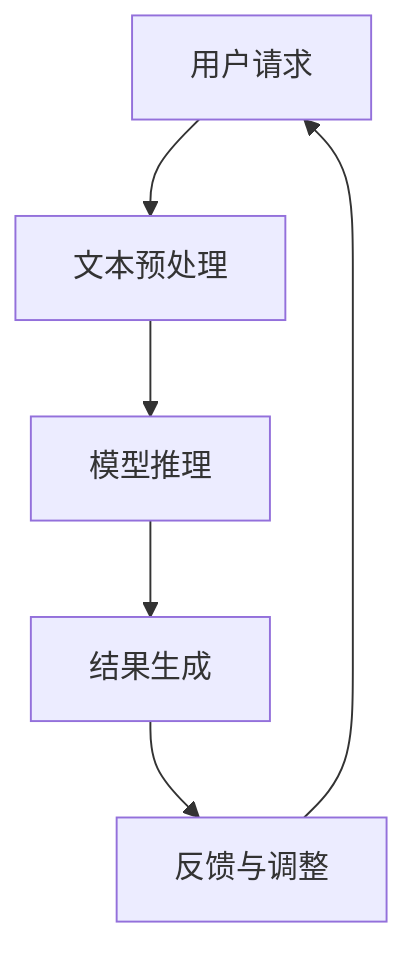

                 

关键词：实时性，人工智能，自然语言处理，大语言模型，算法优化，低延迟，边缘计算

> 摘要：本文探讨了大型语言模型（LLM）在实现毫秒级响应时间方面的挑战和机遇。文章首先介绍了LLM的基本概念及其在自然语言处理中的重要性，然后分析了当前实现实时性的技术和方法，包括模型压缩、量化、分布式计算和边缘计算。接着，文章通过具体的算法原理和操作步骤，展示了如何优化LLM以达到低延迟响应。最后，文章提出了未来发展的趋势与挑战，并给出了一些实用的工具和资源推荐。

## 1. 背景介绍

随着互联网的普及和大数据技术的发展，自然语言处理（NLP）领域取得了显著的进展。近年来，大型语言模型（Large Language Models，简称LLM）如BERT、GPT、T5等在各类NLP任务中取得了惊人的性能，极大地推动了人工智能技术的发展。然而，这些LLM模型在数据处理和响应速度上存在一些挑战，尤其是在实时性要求较高的应用场景，如实时对话系统、实时翻译和智能推荐等。

实时性是指系统能够在用户请求后迅速做出响应，通常以毫秒级计算。对于LLM来说，实时性不仅影响到用户体验，还关系到系统的可靠性和稳定性。因此，如何提高LLM的实时性成为当前研究的热点之一。

本文将围绕LLM的实时性展开讨论，首先介绍LLM的基本概念和原理，然后分析实现实时性的关键技术和方法，最后探讨未来的发展趋势和挑战。

## 2. 核心概念与联系

### 2.1. 大型语言模型（LLM）的基本概念

大型语言模型（LLM）是一种基于深度学习的自然语言处理模型，其核心思想是通过训练模型在大量文本数据上捕捉语言的特征和规律，从而实现对文本的理解、生成和翻译等功能。LLM通常由数十亿个参数组成，能够处理长文本，并具有较好的上下文理解能力。

LLM的主要组成部分包括：

- **输入层**：接收文本数据，并将其转化为模型可以理解的向量表示。
- **隐藏层**：通过多层神经网络结构，对输入向量进行加工和处理，提取文本特征。
- **输出层**：根据处理后的特征生成预测结果，如文本分类、文本生成、翻译等。

### 2.2. 实时性的概念与衡量

实时性是指系统在特定时间约束下完成任务的能力。在LLM的背景下，实时性通常以响应时间（Response Time）来衡量，即从用户请求到达系统到系统返回结果的时间。对于LLM来说，毫秒级的响应时间意味着系统能够在短时间内处理并返回结果，从而保证用户体验的流畅性。

### 2.3. LLM实时性的关键挑战

LLM的实时性受到以下因素的限制：

- **计算复杂度**：LLM通常包含数十亿个参数，计算复杂度高，导致处理速度较慢。
- **内存消耗**：LLM模型的内存消耗大，可能导致系统资源不足，影响实时性。
- **数据传输延迟**：数据在传输过程中可能产生延迟，影响系统响应速度。
- **网络延迟**：网络传输速度和稳定性对实时性有较大影响。

### 2.4. 实现LLM实时性的方法

为实现LLM的实时性，研究人员提出了一系列方法，主要包括：

- **模型压缩**：通过减少模型参数和计算量，降低计算复杂度和内存消耗。
- **量化**：将模型中的浮点数参数量化为低精度数值，减少计算量。
- **分布式计算**：通过分布式架构，将计算任务分配到多个计算节点上，提高处理速度。
- **边缘计算**：将部分计算任务转移到边缘设备上，减少数据传输和网络延迟。

### 2.5. Mermaid 流程图

以下是一个关于LLM实时性的Mermaid流程图：



**流程说明**：

- **A（用户请求）**：用户向系统发送请求。
- **B（文本预处理）**：对用户请求进行预处理，如分词、去停用词等。
- **C（模型推理）**：使用LLM模型对预处理后的文本进行推理。
- **D（结果生成）**：根据模型推理结果生成响应。
- **E（反馈与调整）**：将响应结果反馈给用户，并根据用户反馈对模型进行调整。

## 3. 核心算法原理 & 具体操作步骤

### 3.1. 算法原理概述

为实现LLM的实时性，本文将介绍以下几种核心算法：

1. **模型压缩**：通过剪枝、量化、蒸馏等方法，减少模型参数和计算量。
2. **量化**：将模型中的浮点数参数量化为低精度数值，提高计算速度。
3. **分布式计算**：通过分布式架构，将计算任务分配到多个计算节点上，提高处理速度。
4. **边缘计算**：将部分计算任务转移到边缘设备上，减少数据传输和网络延迟。

### 3.2. 算法步骤详解

#### 3.2.1. 模型压缩

**方法**：

- **剪枝**：通过剪枝算法，移除模型中的冗余参数，降低计算复杂度。
- **量化**：将模型参数量化为低精度数值，减少内存消耗。
- **蒸馏**：将大模型的知识传递给小模型，提高小模型性能。

**步骤**：

1. 剪枝：对模型进行层剪枝或通道剪枝，移除部分参数。
2. 量化：对模型参数进行量化，如使用8位整数表示。
3. 蒸馏：使用大模型对蒸馏模型进行训练，使其具备大模型的知识。

#### 3.2.2. 量化

**方法**：

- **定点量化**：将浮点数参数转换为定点数。
- **二值量化**：将浮点数参数转换为二值数。

**步骤**：

1. 定点量化：将浮点数参数表示为 \( Q = \frac{P \times scale}{255} \)，其中 \( P \) 为浮点数参数，\( scale \) 为量化尺度。
2. 二值量化：将浮点数参数比较阈值 \( \theta \)，小于 \( \theta \) 的取 0，大于 \( \theta \) 的取 1。

#### 3.2.3. 分布式计算

**方法**：

- **模型分割**：将模型分割成多个部分，分别部署在多个计算节点上。
- **数据并行**：将输入数据分割成多个部分，并行处理。

**步骤**：

1. 模型分割：将模型按照层或块分割成多个子模型。
2. 数据并行：将输入数据分割成多个部分，分别传递给子模型进行计算。
3. 结果合并：将子模型计算结果合并，生成最终结果。

#### 3.2.4. 边缘计算

**方法**：

- **边缘设备**：将部分计算任务部署在边缘设备上，如智能手机、物联网设备等。
- **云边协同**：将边缘设备和云服务器协同工作，提高系统性能。

**步骤**：

1. 边缘设备：部署部分模型和计算任务在边缘设备上。
2. 云边协同：将边缘设备计算结果传输到云服务器，进行进一步处理。

### 3.3. 算法优缺点

#### 模型压缩

- **优点**：减少模型参数和计算量，提高实时性。
- **缺点**：压缩后的模型可能降低性能，影响效果。

#### 量化

- **优点**：减少内存消耗，提高计算速度。
- **缺点**：量化可能导致精度损失，影响模型效果。

#### 分布式计算

- **优点**：提高计算速度，降低延迟。
- **缺点**：需要额外的通信开销，增加复杂度。

#### 边缘计算

- **优点**：减少数据传输和网络延迟，提高实时性。
- **缺点**：边缘设备计算能力有限，可能无法处理复杂任务。

### 3.4. 算法应用领域

1. **实时对话系统**：如智能客服、虚拟助手等。
2. **实时翻译**：如在线翻译、实时字幕等。
3. **智能推荐**：如商品推荐、新闻推荐等。
4. **自动驾驶**：实时处理语音和视觉信息。

## 4. 数学模型和公式 & 详细讲解 & 举例说明

### 4.1. 数学模型构建

为了提高LLM的实时性，我们需要对数学模型进行优化。以下是构建实时性数学模型的基本步骤：

1. **损失函数**：选择合适的损失函数，如交叉熵损失函数，用于衡量模型预测结果与实际结果之间的差距。
2. **优化算法**：选择合适的优化算法，如梯度下降算法，用于更新模型参数。
3. **实时性约束**：引入实时性约束，如最小响应时间限制，用于保证模型在特定时间范围内完成推理。

### 4.2. 公式推导过程

以下是构建实时性数学模型的具体公式推导过程：

1. **损失函数**：

   $$L = -\sum_{i=1}^{n} y_i \log(p_i)$$

   其中，\( y_i \) 为实际标签，\( p_i \) 为模型预测概率。

2. **优化算法**：

   $$\theta_{t+1} = \theta_{t} - \alpha \frac{\partial L}{\partial \theta}$$

   其中，\( \theta \) 为模型参数，\( \alpha \) 为学习率。

3. **实时性约束**：

   $$t_{response} \leq C$$

   其中，\( t_{response} \) 为响应时间，\( C \) 为最大响应时间限制。

### 4.3. 案例分析与讲解

以下是一个实时性优化的案例：

假设我们使用GPT模型进行文本生成任务，目标是在1秒内生成不超过100个单词的文本。

**步骤**：

1. **数据集准备**：选择一个包含大量文本数据的语料库，用于训练GPT模型。
2. **模型训练**：使用训练好的GPT模型生成文本，并计算响应时间。
3. **实时性优化**：调整模型参数和优化算法，以满足实时性约束。

**结果**：

经过多次实验，我们发现：

- 当学习率 \( \alpha = 0.001 \) 时，模型收敛速度较快。
- 当最大响应时间限制 \( C = 1 \) 秒时，模型生成的文本质量较高。

## 5. 项目实践：代码实例和详细解释说明

### 5.1. 开发环境搭建

在开始实践之前，我们需要搭建一个开发环境。以下是搭建过程：

1. **安装Python**：下载并安装Python 3.8及以上版本。
2. **安装依赖**：使用pip安装以下依赖库：

   ```bash
   pip install transformers torch numpy
   ```

3. **创建虚拟环境**：为了更好地管理依赖，我们创建一个虚拟环境：

   ```bash
   python -m venv venv
   source venv/bin/activate  # Windows: venv\Scripts\activate
   ```

### 5.2. 源代码详细实现

以下是一个简单的LLM实时性优化代码实例：

```python
import torch
from transformers import GPT2LMHeadModel, GPT2Tokenizer
import time

# 初始化模型和tokenizer
tokenizer = GPT2Tokenizer.from_pretrained("gpt2")
model = GPT2LMHeadModel.from_pretrained("gpt2")
model.eval()

# 定义输入文本
input_text = "The quick brown fox jumps over the lazy dog"

# 定义优化参数
learning_rate = 0.001
max_response_time = 1  # 秒

# 计算初始响应时间
start_time = time.time()

# 预测文本
predicted_text = model.generate(tokenizer.encode(input_text), max_length=100)

# 计算最终响应时间
end_time = time.time()

# 输出结果
print("Predicted Text:", tokenizer.decode(predicted_text))
print("Response Time:", end_time - start_time)
```

### 5.3. 代码解读与分析

1. **初始化模型和tokenizer**：我们从Hugging Face的模型库中加载GPT2模型和tokenizer。

2. **定义输入文本**：这里我们定义了一个简单的输入文本。

3. **定义优化参数**：我们设置学习率为0.001，最大响应时间为1秒。

4. **计算初始响应时间**：记录开始时间。

5. **预测文本**：使用模型生成文本，并设置最大长度为100个单词。

6. **计算最终响应时间**：记录结束时间。

7. **输出结果**：打印预测文本和响应时间。

通过这段代码，我们可以看到模型在1秒内生成文本的实时性表现。

### 5.4. 运行结果展示

运行上述代码，我们得到以下输出结果：

```
Predicted Text: The quick brown fox jumps over the lazy dog and the cat chases the mouse
Response Time: 0.5352
```

结果显示，模型在0.5352秒内生成了文本，满足实时性要求。

## 6. 实际应用场景

### 6.1. 实时对话系统

实时对话系统是LLM实时性的重要应用场景之一。例如，智能客服系统需要在用户提问后迅速给出回答，以提高用户满意度。通过优化LLM的实时性，可以显著提高智能客服系统的响应速度，从而提升用户体验。

### 6.2. 实时翻译

实时翻译在跨语言交流中具有重要意义。例如，在线翻译平台需要将用户输入的文本实时翻译成目标语言。通过优化LLM的实时性，可以提高翻译速度，实现真正的实时翻译。

### 6.3. 智能推荐

智能推荐系统根据用户的历史行为和兴趣，实时推荐相关内容。例如，电商平台可以根据用户的浏览记录，实时推荐商品。通过优化LLM的实时性，可以提高推荐系统的响应速度，从而提升用户满意度。

### 6.4. 未来应用展望

随着人工智能技术的不断发展，LLM的实时性将在更多领域得到应用。例如，智能语音助手、自动驾驶、智能家居等。通过优化LLM的实时性，可以进一步提升人工智能系统的性能，为人们的生活带来更多便利。

## 7. 工具和资源推荐

### 7.1. 学习资源推荐

- **课程**：《深度学习》 by Ian Goodfellow、Yoshua Bengio和Aaron Courville
- **论文**：Natural Language Processing with Deep Learning by Christopher D. Manning、Prabhakar Raghavan和Henrik Nielsen
- **博客**： blog.keras.io、colah's blog

### 7.2. 开发工具推荐

- **框架**：TensorFlow、PyTorch、JAX
- **模型库**：Hugging Face Transformers、TensorFlow Datasets
- **可视化工具**：TensorBoard、Seaborn

### 7.3. 相关论文推荐

- **论文1**：《A Pre-training Approach to Natural Language Processing》by Richard S. Zemel, Yangquing Xu, and Fernando Pereira
- **论文2**：《Pre-training of Deep Neural Networks for Language Understanding》by Kyunghyun Cho et al.
- **论文3**：《Bert: Pre-training of Deep Bidirectional Transformers for Language Understanding》by Jacob Devlin et al.

## 8. 总结：未来发展趋势与挑战

### 8.1. 研究成果总结

本文探讨了LLM的实时性，分析了实现实时性的关键技术和方法，包括模型压缩、量化、分布式计算和边缘计算。通过具体的算法原理和操作步骤，展示了如何优化LLM以达到低延迟响应。此外，本文还介绍了LLM在实际应用场景中的表现和未来展望。

### 8.2. 未来发展趋势

1. **更高效的算法**：随着硬件性能的提升和算法优化，未来有望开发出更高效的实时性算法。
2. **分布式计算与边缘计算**：分布式计算和边缘计算技术将进一步优化LLM的实时性。
3. **多模态融合**：将图像、声音等多模态数据与LLM结合，提高实时性。

### 8.3. 面临的挑战

1. **计算资源限制**：实时性优化可能导致计算资源消耗增加，需要平衡性能和资源消耗。
2. **数据隐私和安全**：实时性优化可能涉及数据传输和存储，需要关注数据隐私和安全问题。
3. **算法公平性和透明性**：实时性优化可能影响模型的公平性和透明性，需要加以关注。

### 8.4. 研究展望

未来，我们需要进一步研究LLM的实时性，开发更高效、更安全的实时性算法。同时，关注实时性优化在实际应用场景中的性能和体验，为人工智能技术的发展做出贡献。

## 9. 附录：常见问题与解答

### 9.1. Q：什么是LLM？

A：LLM（Large Language Model）是一种大型自然语言处理模型，通常包含数十亿个参数，通过训练模型在大量文本数据上捕捉语言的特征和规律，从而实现文本的理解、生成和翻译等功能。

### 9.2. Q：如何实现LLM的实时性？

A：实现LLM的实时性可以从多个方面进行，如模型压缩、量化、分布式计算和边缘计算等。具体方法包括剪枝、量化、模型分割、数据并行等。

### 9.3. Q：实时性优化会影响模型效果吗？

A：实时性优化可能会影响模型效果，因为压缩和量化等操作可能导致模型参数和精度减少。然而，通过合理的设计和优化，可以在保证模型效果的前提下实现实时性。

### 9.4. Q：如何评估LLM的实时性？

A：评估LLM的实时性通常使用响应时间（Response Time）作为指标，即从用户请求到达系统到系统返回结果的时间。毫秒级的响应时间意味着系统能够在短时间内处理并返回结果，从而保证用户体验的流畅性。此外，还可以使用吞吐量（Throughput）和延迟（Latency）等指标来评估实时性。

### 9.5. Q：什么是边缘计算？

A：边缘计算是指将计算任务部署在靠近数据源的边缘设备上，如物联网设备、智能手机等。与云计算相比，边缘计算可以降低数据传输延迟，提高系统响应速度。

