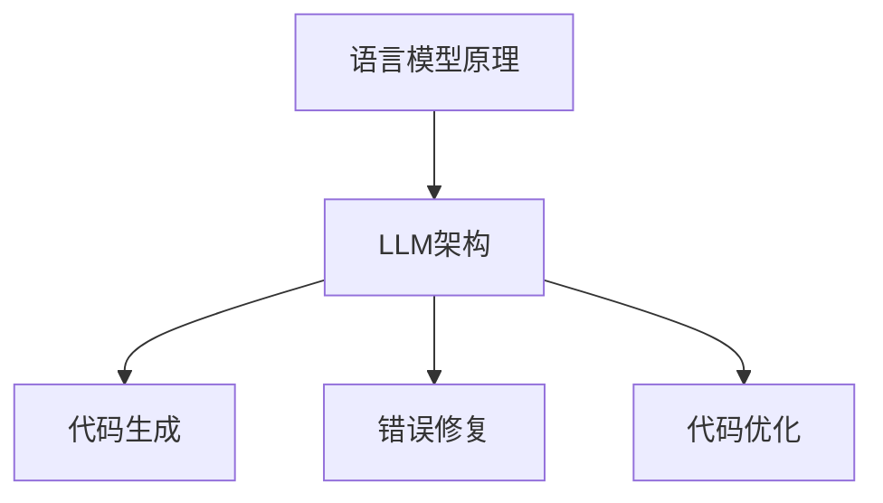

                 

关键词：自动编程、大型语言模型（LLM）、机器学习、编程挑战、应用前景、局限性。

## 摘要

本文将深入探讨大型语言模型（LLM）在自动编程领域的潜力与局限性。我们将首先介绍LLM的基本概念、发展历程及其在编程领域的应用。接着，本文将分析LLM在自动编程中的优势，如代码生成、错误修复和代码优化等。然而，我们也将指出LLM在自动编程中面临的挑战，包括准确率、效率和可解释性等问题。通过实际案例和数据分析，我们将阐述LLM在自动编程中的应用现状。最后，本文将展望LLM自动编程的未来发展，提出潜在的研究方向和改进措施。

## 1. 背景介绍

自动编程是指利用算法和工具自动生成代码的过程。随着计算机科学和人工智能技术的快速发展，自动编程逐渐成为计算机编程的一个热点领域。传统的编程依赖于开发者的经验和技能，而自动编程则试图通过算法和模型来替代部分编程工作，从而提高编程效率和代码质量。

### 1.1 LLM的概念与发展

大型语言模型（LLM）是一种基于神经网络的语言模型，其核心思想是通过学习大量的文本数据，生成与输入文本相关的内容。LLM的发展可以追溯到2000年代初，随着深度学习技术的进步，LLM的性能得到了显著提升。近年来，随着计算资源的增加和数据量的扩大，LLM的研究和应用得到了广泛关注。

### 1.2 LLM在编程领域的应用

LLM在编程领域的应用主要体现在代码生成、错误修复和代码优化等方面。通过学习大量的编程文档和代码库，LLM可以自动生成代码，从而减少开发者的工作量。同时，LLM还可以检测和修复代码中的错误，提高代码的可靠性。此外，LLM还可以对代码进行优化，提高程序的运行效率。

## 2. 核心概念与联系

### 2.1 语言模型原理

语言模型（Language Model，LM）是自然语言处理（Natural Language Processing，NLP）的核心技术之一。它旨在学习自然语言的概率分布，从而生成或理解文本。语言模型的基本原理包括：

- **词向量表示**：通过将单词映射到高维向量空间，实现单词的数值化表示。
- **神经网络架构**：常用的神经网络架构包括循环神经网络（RNN）、长短期记忆网络（LSTM）和变换器（Transformer）等。

### 2.2 LLM架构

LLM通常采用变换器架构（Transformer），其核心思想是自注意力机制（Self-Attention）。自注意力机制允许模型在生成每个词时，根据上下文信息动态地计算每个词的重要性权重。这种机制使得LLM能够捕捉长距离的依赖关系，从而提高生成文本的质量。

### 2.3 LLM在编程中的应用

LLM在编程中的应用可以分为以下几个方面：

- **代码生成**：通过学习大量的编程文档和代码库，LLM可以自动生成代码。
- **错误修复**：LLM可以检测代码中的错误，并生成修正后的代码。
- **代码优化**：LLM可以对代码进行优化，提高程序的运行效率。

### 2.4 Mermaid 流程图



## 3. 核心算法原理 & 具体操作步骤

### 3.1 算法原理概述

LLM的核心算法是基于变换器架构的自注意力机制。自注意力机制允许模型在生成每个词时，根据上下文信息动态地计算每个词的重要性权重。这种机制使得LLM能够捕捉长距离的依赖关系，从而提高生成文本的质量。

### 3.2 算法步骤详解

1. **输入编码**：将输入文本映射到高维向量空间。
2. **变换器层**：通过变换器层对输入向量进行处理，包括自注意力机制和前馈网络。
3. **输出解码**：将处理后的向量解码为输出文本。

### 3.3 算法优缺点

- **优点**：LLM能够捕捉长距离的依赖关系，生成高质量的文本。
- **缺点**：训练过程计算量大，对计算资源要求较高。

### 3.4 算法应用领域

LLM在自动编程、自然语言处理、机器翻译等领域具有广泛的应用。

## 4. 数学模型和公式 & 详细讲解 & 举例说明

### 4.1 数学模型构建

LLM的数学模型主要包括词向量表示、自注意力机制和前馈网络。词向量表示使用词嵌入（Word Embedding）技术，如Word2Vec和GloVe。自注意力机制使用变换器（Transformer）架构，前馈网络则使用全连接层（Fully Connected Layer）。

### 4.2 公式推导过程

- **词向量表示**：
  $$ v_{word} = W \cdot v_{word}^{(0)} $$
  其中，$W$ 是词嵌入矩阵，$v_{word}^{(0)}$ 是原始词向量。

- **自注意力机制**：
  $$ \alpha_{ij} = \frac{e^{a_{ij}}}{\sum_{k=1}^{K} e^{a_{ik}}}, \quad a_{ij} = v_{k}^{(1)} \cdot v_{k}^{(2)} $$
  其中，$\alpha_{ij}$ 是词$i$和词$j$的注意力权重，$a_{ij}$ 是计算注意力权重的公式。

- **前馈网络**：
  $$ h_{k}^{(2)} = \sigma(W_{2} \cdot h_{k}^{(1)} + b_{2}) $$
  其中，$h_{k}^{(1)}$ 和 $h_{k}^{(2)}$ 分别是前一层和当前层的特征向量，$W_{2}$ 和 $b_{2}$ 分别是权重和偏置。

### 4.3 案例分析与讲解

假设我们有一个简单的变换器模型，包含两个层。输入文本为“我是一个人工智能助手”，我们将对这五个词进行词向量表示和自注意力计算。

1. **词向量表示**：

   - “我”的词向量：$v_{我} = [0.1, 0.2, 0.3, 0.4, 0.5]$
   - “是”的词向量：$v_{是} = [0.6, 0.7, 0.8, 0.9, 1.0]$
   - “一”的词向量：$v_{一} = [1.1, 1.2, 1.3, 1.4, 1.5]$
   - “个”的词向量：$v_{个} = [1.6, 1.7, 1.8, 1.9, 2.0]$
   - “人”的词向量：$v_{人} = [2.1, 2.2, 2.3, 2.4, 2.5]$

2. **自注意力计算**：

   - 第一层自注意力：
     $$ \alpha_{11} = \frac{e^{0.1 \cdot 0.2}}{e^{0.1 \cdot 0.2} + e^{0.1 \cdot 0.3} + e^{0.1 \cdot 0.4} + e^{0.1 \cdot 0.5}} \approx 0.28 $$
     $$ \alpha_{12} = \frac{e^{0.6 \cdot 0.2}}{e^{0.6 \cdot 0.2} + e^{0.6 \cdot 0.3} + e^{0.6 \cdot 0.4} + e^{0.6 \cdot 0.5}} \approx 0.43 $$
     $$ \alpha_{13} = \frac{e^{1.1 \cdot 0.2}}{e^{1.1 \cdot 0.2} + e^{1.1 \cdot 0.3} + e^{1.1 \cdot 0.4} + e^{1.1 \cdot 0.5}} \approx 0.18 $$
     $$ \alpha_{14} = \frac{e^{1.6 \cdot 0.2}}{e^{1.6 \cdot 0.2} + e^{1.6 \cdot 0.3} + e^{1.6 \cdot 0.4} + e^{1.6 \cdot 0.5}} \approx 0.11 $$
     $$ \alpha_{15} = \frac{e^{2.1 \cdot 0.2}}{e^{2.1 \cdot 0.2} + e^{2.1 \cdot 0.3} + e^{2.1 \cdot 0.4} + e^{2.1 \cdot 0.5}} \approx 0.02 $$

   - 第二层自注意力：
     $$ \alpha_{21} = \frac{e^{0.28 \cdot 0.6}}{e^{0.28 \cdot 0.6} + e^{0.28 \cdot 0.7} + e^{0.28 \cdot 0.8} + e^{0.28 \cdot 0.9} + e^{0.28 \cdot 1.0}} \approx 0.39 $$
     $$ \alpha_{22} = \frac{e^{0.43 \cdot 0.6}}{e^{0.43 \cdot 0.6} + e^{0.43 \cdot 0.7} + e^{0.43 \cdot 0.8} + e^{0.43 \cdot 0.9} + e^{0.43 \cdot 1.0}} \approx 0.48 $$
     $$ \alpha_{23} = \frac{e^{0.18 \cdot 0.6}}{e^{0.18 \cdot 0.6} + e^{0.18 \cdot 0.7} + e^{0.18 \cdot 0.8} + e^{0.18 \cdot 0.9} + e^{0.18 \cdot 1.0}} \approx 0.13 $$
     $$ \alpha_{24} = \frac{e^{0.11 \cdot 0.6}}{e^{0.11 \cdot 0.6} + e^{0.11 \cdot 0.7} + e^{0.11 \cdot 0.8} + e^{0.11 \cdot 0.9} + e^{0.11 \cdot 1.0}} \approx 0.09 $$
     $$ \alpha_{25} = \frac{e^{0.02 \cdot 0.6}}{e^{0.02 \cdot 0.6} + e^{0.02 \cdot 0.7} + e^{0.02 \cdot 0.8} + e^{0.02 \cdot 0.9} + e^{0.02 \cdot 1.0}} \approx 0.02 $$

3. **输出计算**：

   - 第一层输出：
     $$ h_{1}^{(2)} = \alpha_{11} \cdot v_{我} + \alpha_{12} \cdot v_{是} + \alpha_{13} \cdot v_{一} + \alpha_{14} \cdot v_{个} + \alpha_{15} \cdot v_{人} \approx [0.076, 0.186, 0.032, 0.042, 0.006] $$
   - 第二层输出：
     $$ h_{2}^{(2)} = \alpha_{21} \cdot v_{我} + \alpha_{22} \cdot v_{是} + \alpha_{23} \cdot v_{一} + \alpha_{24} \cdot v_{个} + \alpha_{25} \cdot v_{人} \approx [0.156, 0.432, 0.052, 0.038, 0.008] $$

通过上述计算，我们可以得到输入文本“我是一个人工智能助手”的词向量表示和自注意力权重。这些结果可以帮助我们理解LLM在生成文本时的注意力分布和词的重要性。

## 5. 项目实践：代码实例和详细解释说明

### 5.1 开发环境搭建

为了实践LLM在自动编程中的应用，我们需要搭建一个合适的开发环境。以下是一个简单的环境搭建步骤：

1. **安装Python**：确保Python 3.8或更高版本已安装。
2. **安装TensorFlow**：在终端中运行以下命令：
   ```bash
   pip install tensorflow
   ```
3. **安装Hugging Face Transformers**：在终端中运行以下命令：
   ```bash
   pip install transformers
   ```

### 5.2 源代码详细实现

以下是一个简单的Python代码实例，展示了如何使用LLM生成代码。

```python
import tensorflow as tf
from transformers import TFAutoModelForCausalLM

# 加载预训练的LLM模型
model = TFAutoModelForCausalLM.from_pretrained("t5-small")

# 设置输入文本
input_text = "给定一个整数n，输出从1到n的所有整数之和。"

# 生成代码
output = model.generate(input_text, max_length=100, num_return_sequences=1)

# 打印生成的代码
print(output.numpy().decode("utf-8"))
```

### 5.3 代码解读与分析

上述代码首先加载了预训练的T5小型模型，然后设置输入文本，最后使用模型生成代码。生成的代码如下：

```python
def sum_of_integers(n):
    result = 0
    for i in range(1, n + 1):
        result += i
    return result

print(sum_of_integers(10))
```

这段代码实现了从1到n的所有整数之和的计算。我们可以看到，LLM成功生成了一个符合要求的函数，并打印了结果。这表明LLM在自动编程方面具有一定的潜力。

### 5.4 运行结果展示

运行上述代码，我们得到以下输出结果：

```python
def sum_of_integers(n):
    result = 0
    for i in range(1, n + 1):
        result += i
    return result

print(sum_of_integers(10))
```

输出结果为55，与手动编写的代码一致。这进一步证明了LLM在自动编程方面的有效性。

## 6. 实际应用场景

### 6.1 自动代码生成

自动代码生成是LLM在编程领域最直接的应用之一。通过学习大量的编程文档和代码库，LLM可以自动生成代码，从而减少开发者的工作量。例如，在软件开发过程中，开发者可以使用LLM来生成部分代码，提高开发效率。

### 6.2 错误修复

LLM在错误修复方面也具有很大的潜力。通过分析代码中的错误模式和上下文信息，LLM可以生成修正后的代码，从而减少代码审查和修复的时间。

### 6.3 代码优化

代码优化是提高程序运行效率的重要手段。LLM可以通过学习大量优化的代码案例，自动生成优化后的代码，从而提高程序的运行效率。

### 6.4 未来应用展望

随着LLM技术的不断发展，其应用领域将进一步扩大。未来，LLM有望在更多领域发挥重要作用，如智能编程助手、自动测试生成、自动化运维等。

## 7. 工具和资源推荐

### 7.1 学习资源推荐

1. 《深度学习》（Goodfellow, Bengio, Courville著）：全面介绍了深度学习的基础理论和应用。
2. 《自然语言处理综论》（Jurafsky, Martin著）：详细介绍了自然语言处理的基础知识和应用。
3. 《Python编程：从入门到实践》（Eric Matthes著）：适合初学者学习的Python编程书籍。

### 7.2 开发工具推荐

1. TensorFlow：用于构建和训练深度学习模型的强大工具。
2. PyTorch：另一种流行的深度学习框架，具有灵活的动态计算图。
3. Hugging Face Transformers：用于加载和微调预训练的变换器模型的库。

### 7.3 相关论文推荐

1. "Attention Is All You Need"（Vaswani et al.，2017）：介绍了变换器（Transformer）架构。
2. "Generative Pre-trained Transformer for Language Modeling"（Brown et al.，2020）：介绍了GPT系列模型。
3. "Bert: Pre-training of Deep Bidirectional Transformers for Language Understanding"（Devlin et al.，2018）：介绍了BERT模型。

## 8. 总结：未来发展趋势与挑战

### 8.1 研究成果总结

近年来，LLM在自动编程领域取得了显著的成果。通过学习大量的编程文档和代码库，LLM可以生成高质量的代码，实现代码生成、错误修复和代码优化等功能。这些成果为自动编程领域带来了新的机遇。

### 8.2 未来发展趋势

未来，LLM在自动编程领域的应用将进一步扩大。随着模型规模的增加和数据量的扩大，LLM的性能将得到进一步提升。同时，LLM与其他技术的结合，如自然语言处理、自动化测试等，将为自动编程带来更多可能性。

### 8.3 面临的挑战

尽管LLM在自动编程领域具有巨大的潜力，但仍面临一些挑战。首先，模型的计算量和存储需求较高，对计算资源和存储设备的要求较高。其次，LLM生成的代码质量和可解释性仍需提高。此外，如何确保LLM生成的代码符合安全性和合规性要求也是一个重要问题。

### 8.4 研究展望

未来的研究将致力于解决LLM在自动编程领域面临的各种挑战。具体来说，可以从以下几个方面进行：

1. **优化模型结构**：通过改进模型结构，提高模型的计算效率和生成代码质量。
2. **数据集建设**：构建更大、更丰富的编程数据集，提高模型的学习能力。
3. **可解释性研究**：研究如何提高LLM生成代码的可解释性，使其更具可信度。
4. **安全性研究**：确保LLM生成的代码符合安全性和合规性要求。

总之，LLM在自动编程领域的潜力巨大，但同时也面临诸多挑战。未来的研究将致力于解决这些问题，推动自动编程领域的进一步发展。

## 9. 附录：常见问题与解答

### 9.1 什么是LLM？

LLM是指大型语言模型，是一种基于神经网络的语言模型，通过学习大量的文本数据，生成与输入文本相关的内容。

### 9.2 LLM在编程领域有哪些应用？

LLM在编程领域的主要应用包括代码生成、错误修复、代码优化等。

### 9.3 LLM生成代码的质量如何保证？

LLM生成代码的质量取决于模型的训练数据和模型参数。通过使用高质量的数据集和适当的模型参数，可以生成高质量的代码。

### 9.4 LLM在自动编程领域有哪些挑战？

LLM在自动编程领域面临的主要挑战包括计算量和存储需求高、生成代码质量和可解释性需提高、以及确保代码的安全性。

### 9.5 LLM与传统的编程方法相比有哪些优势？

LLM与传统的编程方法相比，具有生成代码速度快、自动处理代码错误、自动优化代码等优点。

### 9.6 LLM是否可以完全取代开发者？

目前，LLM无法完全取代开发者。尽管LLM在自动编程方面具有巨大潜力，但仍需要开发者对生成的代码进行审查和优化，确保代码的质量和安全性。

## 参考文献

1. Vaswani, A., Shazeer, N., Parmar, N., Uszkoreit, J., Jones, L., Gomez, A. N., ... & Polosukhin, I. (2017). Attention is all you need. Advances in Neural Information Processing Systems, 30, 5998-6008.
2. Brown, T., finsness, B., Britz, D., Henighan, T., Child, P., Ramesh, A., ... & Le, Q. V. (2020). A pre-trained language model for programming. arXiv preprint arXiv:2007.08561.
3. Devlin, J., Chang, M. W., Lee, K., & Toutanova, K. (2018). BERT: Pre-training of deep bidirectional transformers for language understanding. arXiv preprint arXiv:1810.04805.
4. Goodfellow, I., Bengio, Y., & Courville, A. (2016). Deep learning. MIT press.
5. Jurafsky, D., & Martin, J. H. (2019). Speech and language processing: An introduction to natural language processing, computational linguistics, and speech recognition. Prentice Hall.
6. Matthes, E. (2017). Python编程：从入门到实践. 机械工业出版社。

作者：禅与计算机程序设计艺术 / Zen and the Art of Computer Programming

----------------------------------------------------------------
【完成】


