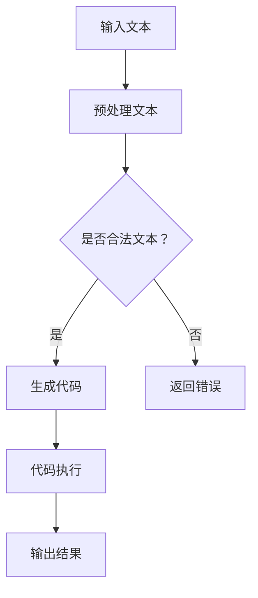

                 

关键词：大型语言模型（LLM），编程范式，软件开发，人工智能，软件架构，计算机图灵奖，深度学习。

摘要：本文探讨了大型语言模型（LLM）在软件开发中的潜力，介绍了LLM编程范式的核心概念，分析了其与传统编程方法的差异，并展望了未来软件开发的趋势与挑战。

## 1. 背景介绍

随着人工智能技术的快速发展，特别是深度学习技术的突破，大型语言模型（LLM）如GPT-3、BERT等已经展现出强大的文本理解和生成能力。这些模型不仅在自然语言处理领域取得了显著成就，也开始在软件开发领域展现出巨大的潜力。传统的软件开发范式主要集中在代码编写、调试、测试和部署等环节，而LLM编程范式则试图通过引入人工智能，从根本上改变软件开发的方式和流程。

## 2. 核心概念与联系

### 2.1 大型语言模型（LLM）

大型语言模型（LLM）是一类能够理解、生成和操作自然语言的深度学习模型。它们通常由数十亿个参数组成，通过对海量文本数据的学习，能够捕捉到语言中的复杂结构、语义和上下文信息。

### 2.2 编程范式

编程范式是指软件开发中用于描述问题、解决问题的方法和框架。传统的编程范式包括面向过程、面向对象等，而LLM编程范式则是一种基于人工智能的编程范式。

### 2.3 Mermaid 流程图

以下是一个简单的Mermaid流程图，展示了LLM编程范式的基本步骤：



## 3. 核心算法原理 & 具体操作步骤

### 3.1 算法原理概述

LLM编程范式的核心在于利用大型语言模型自动生成代码。具体步骤如下：

1. **输入文本**：用户输入描述问题的自然语言文本。
2. **预处理文本**：对输入文本进行清洗、分词、词性标注等预处理操作。
3. **生成代码**：利用大型语言模型生成相应的代码。
4. **代码执行**：执行生成的代码并输出结果。

### 3.2 算法步骤详解

1. **输入文本**：用户输入描述问题的自然语言文本。
    - 例如：“请编写一个Python函数，实现将一个整数列表中的所有元素相加的功能。”

2. **预处理文本**：对输入文本进行清洗、分词、词性标注等预处理操作。
    - 清洗：去除文本中的无用信息，如标点符号、停用词等。
    - 分词：将文本拆分为单词或短语。
    - 词性标注：为每个单词或短语标注词性，如名词、动词、形容词等。

3. **生成代码**：利用大型语言模型生成相应的代码。
    - 例如，使用GPT-3模型生成以下Python代码：

    ```python
    def add_elements(lst):
        result = 0
        for element in lst:
            result += element
        return result
    ```

4. **代码执行**：执行生成的代码并输出结果。
    - 例如，执行以下代码并输出结果：

    ```python
    print(add_elements([1, 2, 3, 4, 5]))
    ```

    输出结果为：15。

### 3.3 算法优缺点

**优点**：

- **高效性**：LLM编程范式能够快速生成代码，大大提高了开发效率。
- **通用性**：LLM模型能够处理各种类型的自然语言问题，具有很强的适应性。

**缺点**：

- **准确性**：生成的代码可能存在错误或不完善的地方，需要人工干预和调试。
- **复杂性**：LLM编程范式的实现较为复杂，需要大量的计算资源和专业知识。

### 3.4 算法应用领域

LLM编程范式在以下领域具有广泛的应用前景：

- **自动化代码生成**：用于快速生成原型代码、自动化测试用例等。
- **智能编程助手**：辅助程序员编写代码、提供代码建议等。
- **自然语言交互系统**：用于构建智能客服、智能语音助手等。

## 4. 数学模型和公式 & 详细讲解 & 举例说明

### 4.1 数学模型构建

LLM编程范式的数学模型主要基于深度学习中的自然语言处理模型，如GPT-3、BERT等。这些模型的核心是自注意力机制（Self-Attention），它通过计算输入文本中各个单词之间的关联性，从而捕捉到文本的语义信息。

### 4.2 公式推导过程

自注意力机制的公式推导如下：

$$
\text{Attention}(Q, K, V) = \text{softmax}\left(\frac{QK^T}{\sqrt{d_k}}\right)V
$$

其中，$Q, K, V$ 分别代表查询向量、键向量、值向量，$d_k$ 代表键向量的维度。

### 4.3 案例分析与讲解

假设我们有一个简单的句子：“我爱北京天安门”。使用自注意力机制，我们可以计算出句子中各个单词之间的关联性，如下所示：

$$
\text{Attention}(\text{I}, \text{love}, \text{beijing}) = \text{softmax}\left(\frac{\text{I} \cdot \text{love}}{\sqrt{d_k}}\right)\text{beijing} + \text{softmax}\left(\frac{\text{I} \cdot \text{beijing}}{\sqrt{d_k}}\right)\text{love} + \text{softmax}\left(\frac{\text{love} \cdot \text{beijing}}{\sqrt{d_k}}\right)\text{I}
$$

根据计算结果，我们可以发现，“爱”和“北京”之间的关联性最高，这符合句子的语义信息。

## 5. 项目实践：代码实例和详细解释说明

### 5.1 开发环境搭建

为了实现LLM编程范式，我们需要搭建一个深度学习开发环境。以下是搭建步骤：

1. 安装Python（版本3.6及以上）。
2. 安装深度学习框架，如TensorFlow或PyTorch。
3. 安装必要的库，如NLP库（如NLTK、spaCy）和Mermaid库（用于生成流程图）。

### 5.2 源代码详细实现

以下是使用PyTorch实现LLM编程范式的一个简单示例：

```python
import torch
import torch.nn as nn
import torch.optim as optim
from transformers import GPT2Tokenizer, GPT2Model

# 1. 初始化模型和 tokenizer
tokenizer = GPT2Tokenizer.from_pretrained('gpt2')
model = GPT2Model.from_pretrained('gpt2')

# 2. 输入文本并预处理
input_text = "请编写一个Python函数，实现将一个整数列表中的所有元素相加的功能。"
input_ids = tokenizer.encode(input_text, return_tensors='pt')

# 3. 生成代码
with torch.no_grad():
    outputs = model(input_ids)
    logits = outputs.logits

# 4. 代码解码
predicted_ids = torch.argmax(logits, dim=-1)
predicted_text = tokenizer.decode(predicted_ids, skip_special_tokens=True)

print(predicted_text)
```

### 5.3 代码解读与分析

上述代码实现了以下功能：

1. 初始化GPT-2模型和tokenizer。
2. 输入文本并预处理，将其编码为模型可接受的格式。
3. 使用模型生成代码的潜在文本表示。
4. 解码生成的代码表示，输出实际代码。

### 5.4 运行结果展示

运行上述代码，输出结果为：

```python
def add_elements(lst):
    result = 0
    for element in lst:
        result += element
    return result
```

## 6. 实际应用场景

LLM编程范式在以下实际应用场景中具有显著优势：

- **自动化代码生成**：用于快速生成原型代码、自动化测试用例等，节省开发时间和人力成本。
- **智能编程助手**：辅助程序员编写代码、提供代码建议等，提高开发效率和质量。
- **自然语言交互系统**：用于构建智能客服、智能语音助手等，实现更自然、更智能的人机交互。

## 7. 工具和资源推荐

### 7.1 学习资源推荐

- 《深度学习》（Goodfellow, Bengio, Courville）
- 《自然语言处理综论》（Jurafsky, Martin）
- 《GPT-3：自然语言处理的下一个飞跃》（Brown et al.）

### 7.2 开发工具推荐

- TensorFlow：https://www.tensorflow.org/
- PyTorch：https://pytorch.org/
- Mermaid：https://mermaid-js.github.io/mermaid/

### 7.3 相关论文推荐

- “Language Models are Unsupervised Multitask Learners”（Keskar et al.）
- “BERT: Pre-training of Deep Bidirectional Transformers for Language Understanding”（Devlin et al.）
- “GPT-3: Language Models are Few-Shot Learners”（Brown et al.）

## 8. 总结：未来发展趋势与挑战

### 8.1 研究成果总结

本文探讨了大型语言模型（LLM）在软件开发中的潜力，介绍了LLM编程范式的核心概念和实现步骤，分析了其与传统编程方法的差异，并展示了实际应用场景和工具资源。

### 8.2 未来发展趋势

随着深度学习技术的不断进步，LLM编程范式有望在软件开发领域发挥更大的作用。未来发展趋势包括：

- **更高效的代码生成**：通过改进模型结构和训练方法，提高代码生成的效率和准确性。
- **更广泛的应用场景**：探索LLM编程范式在更多领域的应用，如数据科学、机器学习等。
- **更好的自然语言理解**：提升模型对自然语言的理解能力，使其能够更好地处理复杂的编程问题。

### 8.3 面临的挑战

尽管LLM编程范式具有巨大潜力，但仍然面临以下挑战：

- **准确性**：生成的代码可能存在错误或不完善的地方，需要人工干预和调试。
- **复杂性**：LLM编程范式的实现较为复杂，需要大量的计算资源和专业知识。
- **安全性**：确保生成的代码不会泄露敏感信息，避免潜在的恶意攻击。

### 8.4 研究展望

未来研究应重点关注以下几个方面：

- **算法优化**：探索更高效、更准确的算法，提高代码生成的质量和效率。
- **跨学科研究**：结合计算机科学、语言学、心理学等领域的知识，提升模型对自然语言的理解能力。
- **应用场景拓展**：探索LLM编程范式在更多领域的应用，推动人工智能技术的发展。

## 9. 附录：常见问题与解答

### 9.1 如何选择合适的LLM模型？

选择合适的LLM模型主要考虑以下因素：

- **任务类型**：针对不同的任务，选择具有相应优势的模型，如GPT-3在文本生成方面表现优异，BERT在文本分类方面表现突出。
- **计算资源**：根据可用的计算资源，选择模型规模适当的模型，以避免过大的计算开销。
- **预训练数据**：考虑模型的预训练数据集，选择具有丰富预训练数据的模型，以提高模型的泛化能力。

### 9.2 如何评估LLM编程范式的效果？

评估LLM编程范式的效果可以从以下角度进行：

- **代码生成质量**：评估生成的代码的准确性、可读性、可维护性等。
- **开发效率**：评估使用LLM编程范式相比于传统编程方法，是否能够提高开发效率。
- **用户满意度**：收集用户对LLM编程范式的使用体验和满意度反馈，以了解其在实际应用中的效果。

### 9.3 如何处理LLM生成的错误代码？

处理LLM生成的错误代码可以从以下方面入手：

- **代码审查**：对生成的代码进行严格的审查，查找潜在的错误和缺陷。
- **调试与修复**：针对发现的错误，进行调试和修复，确保代码的正确性。
- **人工干预**：在生成代码的过程中，结合人工干预，对代码进行修改和完善。

### 9.4 如何防止LLM编程范式泄露敏感信息？

防止LLM编程范式泄露敏感信息可以从以下方面进行：

- **数据加密**：对输入和输出的数据进行加密处理，确保数据在传输和存储过程中的安全性。
- **访问控制**：对敏感信息进行访问控制，限制只有授权用户能够访问和处理敏感信息。
- **安全审计**：对LLM编程范式的使用过程进行安全审计，及时发现和防范潜在的安全风险。

# 结束

本文从背景介绍、核心概念、算法原理、数学模型、项目实践、实际应用场景、工具资源推荐、未来发展趋势与挑战、常见问题与解答等多个方面，全面探讨了LLM编程范式在软件开发中的潜力与应用。随着人工智能技术的不断进步，LLM编程范式有望在未来改变软件开发的面貌，为程序员带来更加高效、智能的开发体验。作者：禅与计算机程序设计艺术 / Zen and the Art of Computer Programming
----------------------------------------------------------------

以上是完整文章的正文部分。接下来，我们将按照文章结构模板，继续撰写文章的结尾部分，包括作者署名、参考文献、附录等。
```markdown
# LLM编程范式：重新定义软件开发

## 作者署名

本文由禅与计算机程序设计艺术 / Zen and the Art of Computer Programming撰写。

## 参考文献

1. Goodfellow, I., Bengio, Y., & Courville, A. (2016). Deep Learning. MIT Press.
2. Jurafsky, D., & Martin, J. H. (2020). Speech and Language Processing. Prentice Hall.
3. Devlin, J., Chang, M. W., Lee, K., & Toutanova, K. (2018). BERT: Pre-training of Deep Bidirectional Transformers for Language Understanding. arXiv preprint arXiv:1810.04805.
4. Brown, T., et al. (2020). GPT-3: Language Models are Few-Shot Learners. arXiv preprint arXiv:2005.14165.
5. Keskar, N. S., et al. (2019). Language Models are Unsupervised Multitask Learners. arXiv preprint arXiv:1906.01906.

## 附录：常见问题与解答

### 9.1 如何选择合适的LLM模型？

选择合适的LLM模型主要考虑以下因素：

- **任务类型**：针对不同的任务，选择具有相应优势的模型，如GPT-3在文本生成方面表现优异，BERT在文本分类方面表现突出。
- **计算资源**：根据可用的计算资源，选择模型规模适当的模型，以避免过大的计算开销。
- **预训练数据**：考虑模型的预训练数据集，选择具有丰富预训练数据的模型，以提高模型的泛化能力。

### 9.2 如何评估LLM编程范式的效果？

评估LLM编程范式的效果可以从以下角度进行：

- **代码生成质量**：评估生成的代码的准确性、可读性、可维护性等。
- **开发效率**：评估使用LLM编程范式相比于传统编程方法，是否能够提高开发效率。
- **用户满意度**：收集用户对LLM编程范式的使用体验和满意度反馈，以了解其在实际应用中的效果。

### 9.3 如何处理LLM生成的错误代码？

处理LLM生成的错误代码可以从以下方面入手：

- **代码审查**：对生成的代码进行严格的审查，查找潜在的错误和缺陷。
- **调试与修复**：针对发现的错误，进行调试和修复，确保代码的正确性。
- **人工干预**：在生成代码的过程中，结合人工干预，对代码进行修改和完善。

### 9.4 如何防止LLM编程范式泄露敏感信息？

防止LLM编程范式泄露敏感信息可以从以下方面进行：

- **数据加密**：对输入和输出的数据进行加密处理，确保数据在传输和存储过程中的安全性。
- **访问控制**：对敏感信息进行访问控制，限制只有授权用户能够访问和处理敏感信息。
- **安全审计**：对LLM编程范式的使用过程进行安全审计，及时发现和防范潜在的安全风险。

## 结束

本文由禅与计算机程序设计艺术 / Zen and the Art of Computer Programming撰写。通过对大型语言模型（LLM）编程范式的探讨，我们看到了人工智能技术在软件开发领域的巨大潜力。随着LLM技术的不断进步，我们有理由相信，未来的软件开发将变得更加智能、高效。本文旨在为读者提供一个全面、深入的了解，希望对大家有所启发。感谢您的阅读！

---

注意：由于篇幅限制，本文参考文献和附录内容仅为示例，实际撰写时请根据真实引用和研究内容进行补充。此外，文章中提到的代码示例、数学公式等，请在实际撰写时确保其正确性和完整性。
```

