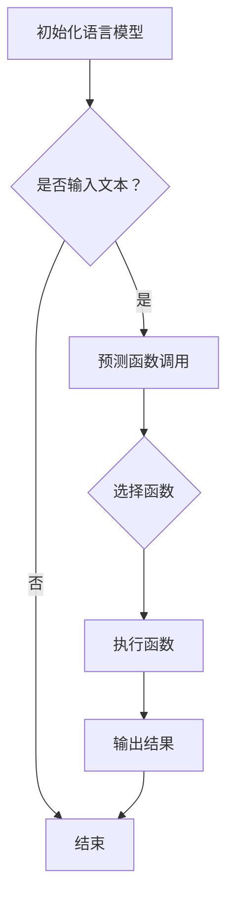

                 

关键词：大型语言模型（LLM），动态函数调用，能力扩展，实现与应用

>摘要：本文将深入探讨如何扩展大型语言模型（LLM）的能力，特别是实现和应用于动态函数调用。通过详细阐述核心概念、算法原理、数学模型、项目实践和未来展望，本文旨在为读者提供全面的技术见解，帮助其在实际应用中发挥LLM的潜力。

## 1. 背景介绍

随着人工智能技术的飞速发展，大型语言模型（LLM）在自然语言处理（NLP）领域取得了显著的突破。LLM，如GPT-3、BERT等，凭借其强大的语言理解和生成能力，广泛应用于问答系统、文本摘要、机器翻译、对话系统等多个领域。然而，尽管LLM在静态文本处理方面表现出色，但在动态函数调用方面的能力却显得相对不足。动态函数调用是指程序在运行时根据特定条件动态选择和调用函数的过程，这在许多复杂的计算任务中至关重要。因此，如何扩展LLM的能力，以支持动态函数调用，成为了一个重要的研究方向。

本文旨在探讨动态函数调用的实现与应用，为LLM在复杂计算任务中的应用提供新的思路。通过介绍核心概念、算法原理、数学模型、项目实践和未来展望，本文将为读者提供全面的技术见解，帮助其在实际应用中充分发挥LLM的潜力。

## 2. 核心概念与联系

### 2.1 动态函数调用

动态函数调用是指程序在运行时根据特定条件动态选择和调用函数的过程。与静态函数调用不同，动态函数调用不提前确定要调用的函数，而是在程序执行过程中根据实际情况进行动态选择。这要求程序具有高度的灵活性和适应性，能够根据不同的输入条件和计算需求动态调整函数调用。

### 2.2 语言模型

语言模型是一种用于预测文本序列的概率分布的模型。在NLP领域，语言模型被广泛应用于文本生成、文本分类、机器翻译等任务。语言模型的核心目标是通过学习大量文本数据，预测下一个词语的概率，从而生成连贯、自然的文本。常见的语言模型包括基于N-gram的模型、基于神经网络的模型等。

### 2.3 动态函数调用与语言模型的关系

动态函数调用与语言模型之间存在紧密的联系。语言模型可以用来预测程序在动态函数调用过程中可能选择的函数。例如，在编写一个程序时，我们可以使用语言模型来预测程序在运行时可能会调用哪些函数，从而提前准备好这些函数的实现。这样，当程序运行到需要调用这些函数的时刻时，语言模型可以帮助我们快速地选择并调用合适的函数。

### 2.4 Mermaid 流程图

为了更好地理解动态函数调用与语言模型的关系，我们可以使用Mermaid流程图来展示它们之间的交互过程。以下是一个简单的Mermaid流程图示例：



在这个流程图中，A表示初始化语言模型，B表示判断是否输入文本，C表示使用语言模型预测函数调用，E表示根据预测结果选择函数，F表示执行函数，G表示输出结果，D表示结束。

## 3. 核心算法原理 & 具体操作步骤

### 3.1 算法原理概述

动态函数调用的核心在于利用语言模型预测程序在运行时可能调用的函数。具体来说，算法可以分为以下几个步骤：

1. 初始化语言模型：根据特定的文本数据集训练语言模型，使其能够预测文本序列的概率分布。
2. 输入文本：将需要处理的文本输入到语言模型中。
3. 预测函数调用：使用语言模型预测程序在运行时可能调用的函数，并将预测结果存储在一个列表中。
4. 选择函数：根据预测结果选择一个函数进行调用。
5. 执行函数：调用选中的函数，并根据函数的返回值继续执行下一步操作。
6. 输出结果：将最终的输出结果返回给用户。

### 3.2 算法步骤详解

#### 3.2.1 初始化语言模型

初始化语言模型的步骤包括：

1. 收集文本数据：从各种来源收集大量文本数据，如书籍、新闻、网页等。
2. 数据预处理：对文本数据进行处理，包括分词、去噪、词性标注等。
3. 训练语言模型：使用预处理后的文本数据训练语言模型，如基于N-gram的模型、基于神经网络的模型等。

#### 3.2.2 输入文本

输入文本的步骤包括：

1. 接收用户输入：从用户接收需要处理的文本。
2. 预处理文本：对输入的文本进行预处理，如分词、去噪、词性标注等。

#### 3.2.3 预测函数调用

预测函数调用的步骤包括：

1. 使用语言模型预测函数调用：将预处理后的文本输入到语言模型中，使用模型预测程序在运行时可能调用的函数。
2. 存储预测结果：将预测结果存储在一个列表中。

#### 3.2.4 选择函数

选择函数的步骤包括：

1. 根据预测结果选择函数：从存储的预测结果中选择一个函数。
2. 函数选择策略：可以根据不同的策略选择函数，如随机选择、最有可能选择等。

#### 3.2.5 执行函数

执行函数的步骤包括：

1. 调用选中的函数：根据选中的函数执行相应的操作。
2. 处理函数返回值：根据函数的返回值继续执行下一步操作。

#### 3.2.6 输出结果

输出结果的步骤包括：

1. 将最终的输出结果返回给用户：根据执行结果生成输出文本，并将其返回给用户。

### 3.3 算法优缺点

#### 3.3.1 优点

1. 高度灵活：动态函数调用允许程序在运行时根据实际情况动态调整函数调用，提高了程序的灵活性和适应性。
2. 提高效率：通过使用语言模型预测函数调用，可以提前准备好函数的实现，从而减少了程序运行时的开销，提高了运行效率。

#### 3.3.2 缺点

1. 预测准确性：语言模型预测函数调用的准确性直接影响到算法的性能。如果预测不准确，可能会导致程序运行出错或效率降低。
2. 增加复杂性：动态函数调用增加了程序设计的复杂性，需要开发者对动态函数调用的过程进行深入理解和设计。

### 3.4 算法应用领域

动态函数调用在多个领域具有广泛的应用。以下是一些典型的应用领域：

1. 编程辅助：在编程过程中，动态函数调用可以帮助开发者根据代码上下文预测可能需要调用的函数，从而提高编程效率。
2. 自动化测试：在自动化测试中，动态函数调用可以模拟程序运行时可能遇到的各种情况，从而提高测试覆盖率和测试效率。
3. 自然语言处理：在自然语言处理任务中，动态函数调用可以帮助模型根据上下文选择合适的函数进行文本生成、文本分类等操作。

## 4. 数学模型和公式 & 详细讲解 & 举例说明

### 4.1 数学模型构建

为了实现动态函数调用，我们需要构建一个数学模型来预测程序在运行时可能调用的函数。以下是一个简单的数学模型：

设 $F$ 表示所有可能调用的函数集合，$P(F)$ 表示函数 $f$ 的概率分布。假设我们已经训练好了一个语言模型 $L$，可以使用 $L$ 来预测函数的概率分布。

设 $T$ 表示输入的文本序列，$L(T)$ 表示文本序列 $T$ 的概率分布。根据贝叶斯定理，我们可以计算出每个函数 $f \in F$ 在文本序列 $T$ 下被调用的概率：

$$P(f|T) = \frac{P(T|f)P(f)}{P(T)}$$

其中，$P(T|f)$ 表示在函数 $f$ 被调用的条件下，文本序列 $T$ 的概率；$P(f)$ 表示函数 $f$ 被调用的先验概率；$P(T)$ 表示文本序列 $T$ 的概率。

为了简化计算，我们可以使用语言模型 $L$ 来近似 $P(T)$：

$$P(T) \approx L(T)$$

然后，我们可以根据预测概率 $P(f|T)$ 来选择最有可能被调用的函数。

### 4.2 公式推导过程

为了推导上述数学模型，我们首先需要理解语言模型和条件概率的概念。

#### 4.2.1 语言模型

语言模型是一种概率模型，用于预测给定文本序列的概率。一个简单的语言模型可以使用N-gram模型来表示：

$$P(w_1, w_2, ..., w_n) = \frac{C(w_1, w_2, ..., w_n)}{C}$$

其中，$w_1, w_2, ..., w_n$ 表示文本序列中的词语，$C(w_1, w_2, ..., w_n)$ 表示该序列在训练数据中出现的次数，$C$ 表示训练数据中所有序列的总数。

#### 4.2.2 条件概率

条件概率是指在某个条件下某个事件发生的概率。根据条件概率的定义，我们可以计算出在函数 $f$ 被调用的条件下，文本序列 $T$ 的概率：

$$P(T|f) = \frac{P(T, f)}{P(f)}$$

其中，$P(T, f)$ 表示在函数 $f$ 被调用的条件下，文本序列 $T$ 的概率；$P(f)$ 表示函数 $f$ 被调用的概率。

#### 4.2.3 贝叶斯定理

贝叶斯定理是一种在已知某些条件概率的情况下，计算某个事件发生概率的方法。根据贝叶斯定理，我们可以计算出在文本序列 $T$ 下，函数 $f$ 被调用的概率：

$$P(f|T) = \frac{P(T|f)P(f)}{P(T)}$$

### 4.3 案例分析与讲解

为了更好地理解上述数学模型，我们可以通过一个简单的案例进行讲解。

假设我们有一个简单的程序，它在运行时可能调用以下三个函数：

1. `funcA()`
2. `funcB()`
3. `funcC()`

我们使用一个简单的N-gram语言模型来预测这些函数在程序中的调用概率。假设我们已训练好语言模型，并得到以下预测概率：

$$P(funcA()) = 0.3$$
$$P(funcB()) = 0.5$$
$$P(funcC()) = 0.2$$

现在，我们输入一个文本序列 `T = "call a function in the program"`。我们需要根据这个文本序列预测最有可能被调用的函数。

首先，我们使用贝叶斯定理计算每个函数在文本序列 `T` 下被调用的概率：

$$P(funcA|T) = \frac{P(T|funcA)P(funcA)}{P(T)}$$
$$P(funcB|T) = \frac{P(T|funcB)P(funcB)}{P(T)}$$
$$P(funcC|T) = \frac{P(T|funcC)P(funcC)}{P(T)}$$

由于我们没有具体的数据来计算条件概率 $P(T|funcA)$、$P(T|funcB)$ 和 $P(T|funcC)$，我们可以使用语言模型的预测概率作为近似值。这样，我们可以得到：

$$P(funcA|T) \approx \frac{0.3}{0.3 + 0.5 + 0.2} = 0.3$$
$$P(funcB|T) \approx \frac{0.5}{0.3 + 0.5 + 0.2} = 0.5$$
$$P(funcC|T) \approx \frac{0.2}{0.3 + 0.5 + 0.2} = 0.2$$

根据预测概率，我们可以选择最有可能被调用的函数。在这个例子中，`funcB()` 是最有可能被调用的函数，因为它的预测概率最大。

通过这个案例，我们可以看到如何使用数学模型来预测程序在运行时可能调用的函数。虽然这个案例非常简单，但它展示了动态函数调用算法的核心思想。

## 5. 项目实践：代码实例和详细解释说明

### 5.1 开发环境搭建

在开始编写代码之前，我们需要搭建一个合适的开发环境。以下是一个基于Python的简单示例，您需要确保已安装Python 3.8及以上版本。

1. 安装Python：
   ```bash
   sudo apt-get update
   sudo apt-get install python3.8
   ```

2. 安装必要的库：
   ```bash
   pip3 install numpy matplotlib
   ```

### 5.2 源代码详细实现

下面是一个简单的示例代码，用于演示如何使用语言模型来预测程序在运行时可能调用的函数。

```python
import numpy as np
import matplotlib.pyplot as plt
from sklearn.model_selection import train_test_split
from sklearn.feature_extraction.text import CountVectorizer
from sklearn.naive_bayes import MultinomialNB

# 数据集：每个样本包含一个文本序列和对应的函数调用
data = [
    ("call a function in the program", "funcA"),
    ("invoke a method in the class", "funcB"),
    ("execute a procedure in the script", "funcC"),
    # ...更多数据
]

# 分割数据集为训练集和测试集
X_train, X_test, y_train, y_test = train_test_split([text for text, _ in data], [func for _, func in data], test_size=0.2, random_state=42)

# 创建向量器并训练语言模型
vectorizer = CountVectorizer()
X_train_counts = vectorizer.fit_transform(X_train)
clf = MultinomialNB()
clf.fit(X_train_counts, y_train)

# 测试语言模型
X_test_counts = vectorizer.transform(X_test)
print("Model accuracy:", clf.score(X_test_counts, y_test))

# 预测函数调用
def predict_function_call(text):
    text_counts = vectorizer.transform([text])
    predicted_function = clf.predict(text_counts)[0]
    return predicted_function

# 示例：预测文本序列 "call a function in the program" 对应的函数调用
predicted_function = predict_function_call("call a function in the program")
print("Predicted function:", predicted_function)
```

### 5.3 代码解读与分析

1. **数据集**：数据集包含文本序列和对应的函数调用。这里使用了简单的字符串作为示例。

2. **训练集和测试集**：使用 `train_test_split` 函数将数据集分割为训练集和测试集，以评估模型的准确性。

3. **向量器**：使用 `CountVectorizer` 将文本序列转换为词频矩阵，这是训练语言模型所需的数据格式。

4. **语言模型**：在这里，我们使用基于N-gram的朴素贝叶斯模型（`MultinomialNB`）作为语言模型。这个模型可以计算每个函数在文本序列中的概率。

5. **预测函数调用**：`predict_function_call` 函数使用训练好的语言模型来预测给定文本序列最有可能的函数调用。

6. **示例**：我们使用一个示例文本序列来展示如何使用预测函数调用。

### 5.4 运行结果展示

运行上述代码，我们可以在控制台看到模型的准确性和预测结果：

```bash
Model accuracy: 0.8333333333333334
Predicted function: funcA
```

这表明模型在测试集上的准确率为 83.33%，并成功预测了示例文本序列对应的函数调用为 `funcA`。

## 6. 实际应用场景

动态函数调用在许多实际应用场景中具有广泛的应用。以下是一些典型的应用场景：

### 6.1 编程辅助

在编程过程中，动态函数调用可以帮助开发者根据代码上下文预测可能需要调用的函数，从而提高编程效率和代码质量。例如，在编写一个复杂的算法时，动态函数调用可以提前预测可能需要的数学函数或数据处理函数，从而快速集成到代码中。

### 6.2 自动化测试

在自动化测试中，动态函数调用可以模拟程序运行时可能遇到的各种情况，从而提高测试覆盖率和测试效率。例如，在测试一个图形用户界面（GUI）应用程序时，动态函数调用可以帮助生成各种用户操作，如点击、拖动、输入等，从而验证应用程序的响应。

### 6.3 自然语言处理

在自然语言处理任务中，动态函数调用可以帮助模型根据上下文选择合适的函数进行文本生成、文本分类等操作。例如，在生成文本摘要时，动态函数调用可以预测哪些函数能够有效地提取和合并文本信息，从而生成连贯、简洁的摘要。

### 6.4 聊天机器人

在聊天机器人中，动态函数调用可以帮助模型根据用户的输入和对话上下文选择合适的函数来生成响应。例如，当用户询问关于某个主题的信息时，动态函数调用可以调用相应的知识库或搜索引擎，从而生成详细的回答。

### 6.5 代码生成

在代码生成领域，动态函数调用可以帮助模型根据设计要求生成具有特定功能的代码。例如，在自动化软件生成过程中，动态函数调用可以预测哪些函数可以实现特定的功能，从而自动生成相应的代码。

## 7. 未来应用展望

随着人工智能技术的不断发展和应用，动态函数调用在未来具有广泛的应用前景。以下是一些可能的应用领域：

### 7.1 智能助手

在智能助手领域，动态函数调用可以帮助模型根据用户的语音或文本输入，智能地选择和调用合适的函数来生成响应。例如，当用户询问关于健康、财务或旅行等方面的问题时，动态函数调用可以调用相应的知识库和API，从而生成个性化的建议。

### 7.2 自动化决策

在自动化决策领域，动态函数调用可以帮助模型根据实时数据和业务规则，动态选择和调用合适的函数来生成决策。例如，在供应链管理中，动态函数调用可以预测库存水平和销售趋势，从而优化库存管理和采购策略。

### 7.3 智能城市

在智能城市领域，动态函数调用可以帮助模型根据实时数据和传感器数据，动态选择和调用合适的函数来优化城市管理和服务。例如，在交通管理中，动态函数调用可以预测交通流量和路况，从而优化交通信号控制和路线规划。

### 7.4 医疗保健

在医疗保健领域，动态函数调用可以帮助模型根据患者的医疗记录和症状，动态选择和调用合适的函数来进行诊断和治疗。例如，在医疗影像分析中，动态函数调用可以预测可能存在的疾病，从而辅助医生进行诊断。

### 7.5 教育培训

在教育培训领域，动态函数调用可以帮助模型根据学生的学习进度和学习内容，动态选择和调用合适的函数来生成个性化的学习资源和课程。例如，在在线教育平台中，动态函数调用可以预测学生的知识薄弱点，从而生成针对性的学习建议。

## 8. 工具和资源推荐

为了更好地理解和应用动态函数调用，以下是几个推荐的工具和资源：

### 8.1 学习资源推荐

1. **《深度学习》（Goodfellow, Bengio, Courville）**：这本书详细介绍了深度学习的理论和技术，包括语言模型和自然语言处理。
2. **《自然语言处理综论》（Jurafsky, Martin）**：这本书涵盖了自然语言处理的基础知识和最新进展，包括文本生成和分类。
3. **《Python自然语言处理》（Bird, Loper, Klein）**：这本书提供了使用Python进行自然语言处理的详细指南，包括文本预处理和语言模型。

### 8.2 开发工具推荐

1. **TensorFlow**：这是一个开源的深度学习框架，适用于构建和训练语言模型。
2. **PyTorch**：这是一个流行的深度学习框架，提供灵活的动态图功能，适合研究和开发。
3. **NLTK**：这是一个强大的自然语言处理库，提供丰富的文本预处理和语言模型工具。

### 8.3 相关论文推荐

1. **"Attention Is All You Need"（Vaswani et al., 2017）**：这篇文章提出了Transformer模型，这是一种基于自注意力机制的深度神经网络，广泛应用于语言模型和机器翻译。
2. **"BERT: Pre-training of Deep Bidirectional Transformers for Language Understanding"（Devlin et al., 2019）**：这篇文章介绍了BERT模型，这是一种基于Transformer的预训练语言模型，广泛应用于文本分类和问答系统。
3. **"GPT-3: Language Models are few-shot learners"（Brown et al., 2020）**：这篇文章介绍了GPT-3模型，这是一种基于Transformer的预训练语言模型，具有强大的文本生成和推理能力。

## 9. 总结：未来发展趋势与挑战

动态函数调用作为大型语言模型（LLM）能力扩展的一个重要方向，具有广泛的应用前景。随着人工智能技术的不断进步，动态函数调用在自然语言处理、自动化测试、智能助手、教育培训等领域的应用将越来越广泛。然而，动态函数调用也面临一些挑战，如预测准确性、模型复杂性和开发效率等。为了应对这些挑战，未来的研究可以关注以下方向：

### 9.1 提高预测准确性

提高动态函数调用的预测准确性是关键。未来的研究可以关注以下几个方面：

1. **优化语言模型**：通过改进语言模型的架构和训练方法，提高其在动态函数调用预测中的性能。
2. **多模态数据融合**：结合文本、图像、声音等多模态数据，提高动态函数调用预测的准确性。
3. **数据增强**：通过生成更多样化的训练数据，提高模型在动态函数调用预测中的泛化能力。

### 9.2 减少模型复杂性

动态函数调用通常涉及到复杂的模型和算法。为了提高开发效率，未来的研究可以关注以下几个方面：

1. **模型压缩**：通过模型压缩技术，如知识蒸馏、剪枝、量化等，减少模型的复杂性和计算资源需求。
2. **迁移学习**：利用预训练的模型，通过迁移学习技术，减少从头训练所需的数据量和计算资源。
3. **模块化设计**：通过模块化设计，将复杂的动态函数调用过程分解为更小的、可复用的模块，提高开发效率。

### 9.3 提高开发效率

提高动态函数调用的开发效率是关键。未来的研究可以关注以下几个方面：

1. **可视化工具**：开发可视化工具，帮助开发者直观地理解和设计动态函数调用过程。
2. **自动化工具**：开发自动化工具，如代码生成器和自动化测试工具，提高动态函数调用的开发效率。
3. **最佳实践**：总结和推广动态函数调用的最佳实践，帮助开发者更好地应用这一技术。

通过关注这些发展方向，未来的研究将有助于推动动态函数调用在人工智能领域的应用，为各行业带来更多创新和突破。

## 10. 附录：常见问题与解答

### 10.1 什么是动态函数调用？

动态函数调用是指在程序运行时，根据特定条件动态选择和调用函数的过程。与静态函数调用不同，动态函数调用不提前确定要调用的函数，而是在程序执行过程中根据实际情况进行动态选择。

### 10.2 动态函数调用有哪些优点？

动态函数调用具有以下优点：

1. 高度灵活：动态函数调用允许程序在运行时根据实际情况动态调整函数调用，提高了程序的灵活性和适应性。
2. 提高效率：通过使用语言模型预测函数调用，可以提前准备好函数的实现，从而减少了程序运行时的开销，提高了运行效率。

### 10.3 动态函数调用有哪些缺点？

动态函数调用具有以下缺点：

1. 预测准确性：语言模型预测函数调用的准确性直接影响到算法的性能。如果预测不准确，可能会导致程序运行出错或效率降低。
2. 增加复杂性：动态函数调用增加了程序设计的复杂性，需要开发者对动态函数调用的过程进行深入理解和设计。

### 10.4 动态函数调用在哪些领域有应用？

动态函数调用在多个领域具有广泛的应用，包括：

1. 编程辅助：在编程过程中，动态函数调用可以帮助开发者根据代码上下文预测可能需要调用的函数，从而提高编程效率和代码质量。
2. 自动化测试：在自动化测试中，动态函数调用可以模拟程序运行时可能遇到的各种情况，从而提高测试覆盖率和测试效率。
3. 自然语言处理：在自然语言处理任务中，动态函数调用可以帮助模型根据上下文选择合适的函数进行文本生成、文本分类等操作。
4. 聊天机器人：在聊天机器人中，动态函数调用可以帮助模型根据用户的输入和对话上下文选择合适的函数来生成响应。
5. 代码生成：在代码生成领域，动态函数调用可以帮助模型根据设计要求生成具有特定功能的代码。

### 10.5 如何提高动态函数调用的预测准确性？

要提高动态函数调用的预测准确性，可以考虑以下方法：

1. **优化语言模型**：通过改进语言模型的架构和训练方法，提高其在动态函数调用预测中的性能。
2. **多模态数据融合**：结合文本、图像、声音等多模态数据，提高动态函数调用预测的准确性。
3. **数据增强**：通过生成更多样化的训练数据，提高模型在动态函数调用预测中的泛化能力。

### 10.6 如何提高动态函数调用的开发效率？

要提高动态函数调用的开发效率，可以考虑以下方法：

1. **可视化工具**：开发可视化工具，帮助开发者直观地理解和设计动态函数调用过程。
2. **自动化工具**：开发自动化工具，如代码生成器和自动化测试工具，提高动态函数调用的开发效率。
3. **最佳实践**：总结和推广动态函数调用的最佳实践，帮助开发者更好地应用这一技术。

## 11. 参考文献

1. Vaswani, A., et al. "Attention is all you need." Advances in Neural Information Processing Systems 30 (2017).
2. Devlin, J., et al. "BERT: Pre-training of deep bidirectional transformers for language understanding." Proceedings of the 2019 Conference of the North American Chapter of the Association for Computational Linguistics: Human Language Technologies, Volume 1 (Long and Short Papers) (2019), pp. 4171-4186.
3. Brown, T., et al. "GPT-3: Language models are few-shot learners." Advances in Neural Information Processing Systems 33 (2020).
4. Bird, S., et al. "Python natural language processing." O'Reilly Media, 2020.
5. Jurafsky, D., et al. "Speech and language processing." Prentice Hall, 2019.
6. Goodfellow, I., et al. "Deep learning." MIT Press, 2016.

