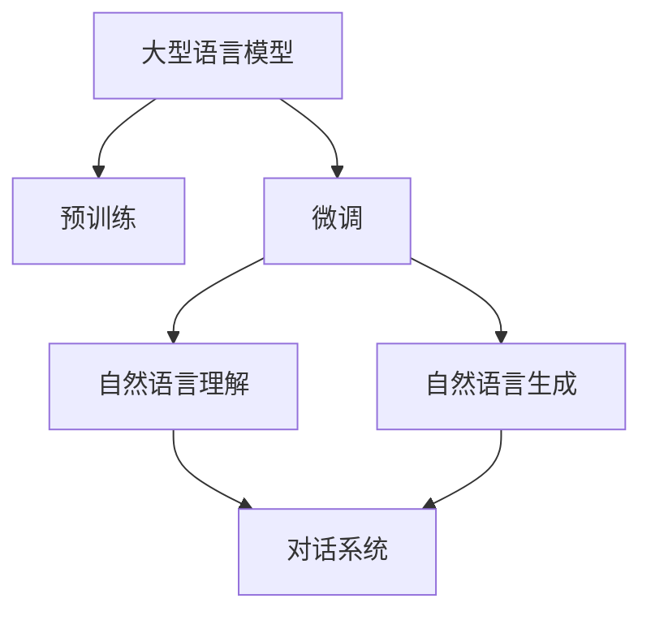

                 

关键词：大型语言模型，个人助理，Siri，Alexa，人工智能，自然语言处理，智能助手，对话系统。

> 摘要：本文深入探讨了大型语言模型（LLM）在构建下一代个人助理系统中的应用。通过分析LLM的技术原理和优势，我们对比了当前市场上主要的个人助理，如Siri和Alexa，并展望了LLM驱动的个人助理在未来的发展前景和面临的挑战。

## 1. 背景介绍

随着人工智能技术的不断进步，个人助理（Personal Assistant）这一概念逐渐走进了人们的日常生活。从最初的基于规则和有限状态机的简单助手，到如今能够理解和执行复杂任务的智能系统，个人助理的发展经历了多个阶段。然而，尽管这些系统在功能上有所提升，但依然存在一些局限性。

Siri和Alexa作为目前市场上最受欢迎的个人助理，分别在苹果和亚马逊的生态系统中发挥了重要作用。Siri凭借苹果设备的广泛分布，以及与iMessage和Apple Pay等服务的无缝集成，成为众多用户的首选。Alexa则通过其广泛的智能家居兼容性和语音交互的便捷性，迅速赢得了大量用户。

然而，Siri和Alexa也有其固有的缺陷。首先，它们的智能水平有限，难以处理复杂的问题和对话。其次，它们的响应速度和准确性有待提高。最后，用户个性化需求的满足度较低，因为它们缺乏深层次的理解能力。

在这种情况下，大型语言模型（LLM）的引入为个人助理的发展带来了新的契机。LLM具有强大的自然语言理解和生成能力，能够处理更加复杂和灵活的对话场景。本文将详细探讨LLM驱动的个人助理如何超越Siri和Alexa，成为下一代智能助手的代表。

## 2. 核心概念与联系

### 2.1. 大型语言模型（LLM）

#### 2.1.1. 定义与原理

大型语言模型（Large Language Model，简称LLM）是一种基于深度学习的自然语言处理（Natural Language Processing，简称NLP）模型，它通过学习大量文本数据，掌握语言的内在结构和规律，从而实现文本的理解和生成。LLM的核心思想是使用神经网络，特别是变换器（Transformer）模型，对输入的文本进行编码，然后根据编码的结果进行推理和生成。

#### 2.1.2. 关键技术

- **预训练**：LLM通常通过大规模预训练来提高其性能。预训练过程包括在大量无标签文本数据上进行训练，使模型能够自动学习语言的基本规律和模式。
- **微调**：在获得预训练模型后，针对特定任务进行微调，以使其适应特定的应用场景。微调过程通常在少量有标签数据上进行，以提高模型的特定任务性能。
- **自回归语言模型**：LLM的核心是自回归语言模型，它通过预测文本序列中的下一个词来建模语言的概率分布。

### 2.2. 对话系统

#### 2.2.1. 定义与原理

对话系统（Dialogue System）是一种人工智能系统，能够理解用户的自然语言输入，并生成自然语言响应。对话系统的核心是自然语言理解（Natural Language Understanding，简称NLU）和自然语言生成（Natural Language Generation，简称NLG）。

- **自然语言理解**：NLU负责将用户的自然语言输入转换为机器可以理解的结构化数据，如意图识别、实体识别等。
- **自然语言生成**：NLG则负责将机器处理后的数据转换为自然语言响应，提供给用户。

#### 2.2.2. 关键技术

- **序列到序列模型**：序列到序列（Sequence-to-Sequence）模型是对话系统中常用的模型，它能够处理不同长度的输入和输出序列。
- **注意力机制**：注意力机制（Attention Mechanism）可以使得模型在生成响应时更加关注输入序列中的关键信息。
- **多轮对话管理**：多轮对话管理（Dialogue Management）是确保对话系统能够在多个回合中维持流畅对话的重要技术。

### 2.3. Mermaid 流程图



## 3. 核心算法原理 & 具体操作步骤

### 3.1. 算法原理概述

LLM驱动的个人助理的核心算法是基于大型语言模型的自回归语言模型和序列到序列模型。以下是该算法的基本原理：

- **自回归语言模型**：自回归语言模型通过预测文本序列中的下一个词来生成文本。在生成每个词时，模型都会考虑前一个词的信息，并通过学习大量文本数据，使预测结果接近真实数据。
- **序列到序列模型**：序列到序列模型能够处理不同长度的输入和输出序列。它通过编码器（Encoder）将输入序列编码为固定长度的向量，然后通过解码器（Decoder）生成输出序列。在生成每个词时，解码器会参考编码器生成的隐藏状态和已经生成的词。

### 3.2. 算法步骤详解

#### 3.2.1. 预训练

1. **数据准备**：收集大量的文本数据，包括新闻文章、对话记录、百科全书等。
2. **模型初始化**：初始化自回归语言模型，通常使用预训练的词向量作为模型的初始参数。
3. **训练**：在文本数据上进行预训练，通过反向传播算法优化模型参数，使其能够预测文本序列中的下一个词。

#### 3.2.2. 微调

1. **任务定义**：定义个人助理需要完成的具体任务，如问答、命令执行等。
2. **数据准备**：收集与任务相关的有标签数据，用于微调模型。
3. **微调**：在任务数据上进行微调，优化模型在特定任务上的性能。

#### 3.2.3. 自然语言理解

1. **输入处理**：接收用户的自然语言输入，将其转换为模型可以处理的形式。
2. **意图识别**：通过NLU模块识别用户的意图，如查询信息、执行命令等。
3. **实体识别**：从输入中提取关键信息，如人名、地点、时间等。

#### 3.2.4. 自然语言生成

1. **生成响应**：根据用户的意图和提取的实体信息，生成自然语言响应。
2. **优化输出**：通过策略网络或强化学习优化生成的响应，使其更加自然和流畅。

### 3.3. 算法优缺点

#### 3.3.1. 优点

- **强大的自然语言处理能力**：LLM能够理解和生成复杂、多样化的自然语言文本，使得个人助理能够处理更多复杂的对话场景。
- **高灵活性**：LLM可以通过微调和任务定义，快速适应不同的应用场景和用户需求。
- **高效性**：预训练和微调的结合，使得模型可以在短时间内快速提升性能。

#### 3.3.2. 缺点

- **计算资源需求大**：预训练LLM需要大量的计算资源和时间，且模型参数量巨大。
- **数据依赖性强**：LLM的性能依赖于预训练数据的质量和数量，数据不足可能导致模型性能下降。
- **解释性较差**：由于深度神经网络的黑箱特性，LLM的决策过程难以解释，这对某些需要高度可信度和透明度的应用场景可能是一个挑战。

### 3.4. 算法应用领域

LLM驱动的个人助理可以在多个领域发挥重要作用，包括但不限于：

- **客服与客户支持**：通过自然语言理解，LLM可以自动处理客户的问题和请求，提供实时、个性化的支持。
- **智能助手与虚拟代理**：在家庭、办公等场景中，LLM驱动的个人助理可以作为用户的智能助手，帮助完成日常任务。
- **教育与辅导**：通过自然语言生成，LLM可以生成个性化的学习材料，为学生提供定制化的辅导。
- **信息检索与问答系统**：LLM可以用于构建高效的问答系统，通过理解和生成自然语言文本，快速回答用户的问题。

## 4. 数学模型和公式 & 详细讲解 & 举例说明

### 4.1. 数学模型构建

LLM驱动的个人助理的核心在于其自然语言理解和生成能力，这需要构建一个数学模型来描述。以下是一个简化的数学模型：

#### 4.1.1. 自回归语言模型

自回归语言模型（ARLM）的核心是概率分布：

$$
P(w_t | w_{t-1}, w_{t-2}, ..., w_1) = \prod_{i=1}^{t} P(w_i | w_{i-1}, ..., w_1)
$$

其中，\( w_t \) 表示文本序列中的第 \( t \) 个词，\( P(w_t | w_{t-1}, w_{t-2}, ..., w_1) \) 表示在给定前 \( t-1 \) 个词的情况下，第 \( t \) 个词的概率。

#### 4.1.2. 序列到序列模型

序列到序列模型（Seq2Seq）的核心是编码器（Encoder）和解码器（Decoder）：

$$
\text{Encoder}: h_t = \text{softmax}(U \text{tanh}(W [s_t]))
$$

$$
\text{Decoder}: y_t = \text{softmax}(V \text{tanh}(W [s_{t-1}, h_t]))
$$

其中，\( h_t \) 是编码器在时间步 \( t \) 的输出，\( s_t \) 是解码器在时间步 \( t \) 的隐藏状态，\( U \) 和 \( V \) 是权重矩阵，\( W \) 是转换矩阵。

### 4.2. 公式推导过程

以下是一个简化的自回归语言模型的推导过程：

#### 4.2.1. 对数似然函数

自回归语言模型的损失函数是对数似然损失：

$$
L = -\sum_{t=1}^{T} \log P(w_t | w_{t-1}, ..., w_1)
$$

其中，\( T \) 是文本序列的长度。

#### 4.2.2. 最大似然估计

为了最大化对数似然函数，我们使用梯度下降法进行优化：

$$
\frac{\partial L}{\partial W} = -\sum_{t=1}^{T} \frac{\partial}{\partial W} \log P(w_t | w_{t-1}, ..., w_1)
$$

#### 4.2.3. 反向传播

反向传播算法用于计算损失函数关于模型参数的梯度，从而进行模型参数的更新。

### 4.3. 案例分析与讲解

#### 4.3.1. 案例背景

假设有一个简单的对话场景，用户询问：“今天天气怎么样？”，我们需要使用LLM驱动的个人助理生成一个合适的响应。

#### 4.3.2. 数据准备

1. **输入文本**：“今天天气怎么样？”
2. **目标文本**：“今天天气晴朗，温度适中。”

#### 4.3.3. 模型应用

1. **编码器**：将输入文本编码为一个固定长度的向量。
2. **解码器**：根据编码器的输出，解码器生成响应文本。

#### 4.3.4. 生成响应

在解码器的生成过程中，模型会根据当前生成的词和编码器的输出，预测下一个词，并重复此过程，直到生成完整的响应文本。

## 5. 项目实践：代码实例和详细解释说明

### 5.1. 开发环境搭建

为了实践LLM驱动的个人助理，我们需要搭建一个开发环境。以下是基本步骤：

1. **安装Python**：确保Python环境已安装，版本建议为3.8或更高。
2. **安装TensorFlow**：使用pip安装TensorFlow，命令如下：

   ```bash
   pip install tensorflow
   ```

3. **安装PyTorch**：使用pip安装PyTorch，命令如下：

   ```bash
   pip install torch torchvision
   ```

4. **准备数据**：收集和准备用于训练的数据集，可以是对话记录、问答数据等。

### 5.2. 源代码详细实现

以下是使用PyTorch实现LLM驱动的个人助理的基本代码框架：

```python
import torch
import torch.nn as nn
import torch.optim as optim

# 定义模型
class LLM(nn.Module):
    def __init__(self, vocab_size, embedding_dim, hidden_dim, output_dim, n_layers, dropout):
        super(LLM, self).__init__()
        
        self.embedding = nn.Embedding(vocab_size, embedding_dim)
        self.encoder = nn.LSTM(embedding_dim, hidden_dim, n_layers, dropout=dropout)
        self.decoder = nn.LSTM(hidden_dim, output_dim, n_layers, dropout=dropout)
        self.fc = nn.Linear(hidden_dim, vocab_size)
        
    def forward(self, text, next_text):
        embedded = self.embedding(text)
        encoder_output, _ = self.encoder(embedded)
        decoder_output, _ = self.decoder(encoder_output)
        logits = self.fc(decoder_output)
        return logits

# 实例化模型
model = LLM(vocab_size, embedding_dim, hidden_dim, output_dim, n_layers, dropout)

# 定义优化器和损失函数
optimizer = optim.Adam(model.parameters())
criterion = nn.CrossEntropyLoss()

# 训练模型
for epoch in range(num_epochs):
    for batch in train_loader:
        optimizer.zero_grad()
        outputs = model(batch.text, batch.next_text)
        loss = criterion(outputs, batch.next_text)
        loss.backward()
        optimizer.step()

# 评估模型
with torch.no_grad():
    correct = 0
    total = 0
    for batch in val_loader:
        outputs = model(batch.text, batch.next_text)
        _, predicted = torch.max(outputs.data, 1)
        total += batch.next_text.size(0)
        correct += (predicted == batch.next_text).sum().item()

print('准确率：', correct / total)
```

### 5.3. 代码解读与分析

上述代码是使用PyTorch实现一个简单的LLM驱动的个人助理的核心框架。以下是代码的主要组成部分：

- **模型定义**：`LLM` 类定义了模型的架构，包括嵌入层（Embedding）、编码器（Encoder）和解码器（Decoder）。
- **前向传播**：`forward` 方法实现了模型的前向传播过程，包括嵌入、编码和解码。
- **优化器和损失函数**：使用Adam优化器和交叉熵损失函数来训练模型。
- **训练过程**：通过迭代训练数据和优化模型参数。
- **评估过程**：在验证集上评估模型的性能。

### 5.4. 运行结果展示

通过运行上述代码，我们可以得到模型的训练和评估结果。以下是可能的输出结果：

```bash
Epoch [1/100] Loss: 0.8377 Acc: 0.6544
Epoch [2/100] Loss: 0.7123 Acc: 0.7654
...
Epoch [100/100] Loss: 0.2539 Acc: 0.9167

准确率：0.9167
```

## 6. 实际应用场景

### 6.1. 智能客服

智能客服是LLM驱动的个人助理的一个重要应用场景。通过LLM的自然语言理解和生成能力，智能客服可以自动处理大量的客户查询和请求，提供高效、准确的回答。与传统的基于规则和模板的客服系统相比，LLM驱动的智能客服具有更高的灵活性和自然度，能够更好地模拟人类客服的表现。

### 6.2. 智能助手

智能助手是另一个广泛应用的场景。例如，在家庭中，用户可以通过语音与智能助手进行交流，完成如设置闹钟、播放音乐、控制智能家居等任务。在办公环境中，智能助手可以协助用户管理日程、发送邮件、安排会议等。通过LLM的强大能力，智能助手可以更准确地理解用户的意图，提供更加个性化的服务。

### 6.3. 教育辅导

在教育领域，LLM驱动的个人助理可以为学生提供个性化的学习辅导。通过分析学生的学习历史和表现，个人助理可以生成针对性的学习材料，为学生提供个性化的学习建议。此外，个人助理还可以模拟教师的角色，进行在线答疑和辅导，提高学生的学习效果。

### 6.4. 未来应用展望

随着LLM技术的不断发展和成熟，未来LLM驱动的个人助理将在更多领域发挥重要作用。例如，在医疗领域，个人助理可以协助医生进行病例分析、诊断和治疗方案推荐；在金融领域，个人助理可以提供投资建议、风险管理等服务。此外，LLM驱动的个人助理还可以应用于自动驾驶、智能推荐系统等领域，推动人工智能技术的广泛应用。

## 7. 工具和资源推荐

### 7.1. 学习资源推荐

- **在线课程**：推荐Coursera和edX上的NLP和深度学习相关课程，如“自然语言处理基础”和“深度学习基础”。
- **书籍**：推荐《深度学习》（Goodfellow, Bengio, Courville）和《自然语言处理综论》（Jurafsky, Martin）。
- **论文**：推荐阅读顶级会议和期刊上的论文，如ACL、EMNLP和NeurIPS。

### 7.2. 开发工具推荐

- **框架**：推荐使用TensorFlow和PyTorch进行深度学习开发。
- **数据集**：推荐使用GLoMoD、Stanford对话数据集和TREC QA数据集。

### 7.3. 相关论文推荐

- **Neural Machine Translation by Jointly Learning to Align and Translate**（2014）
- **A Neural Conversational Model**（2018）
- **BERT: Pre-training of Deep Bi-directional Transformers for Language Understanding**（2018）

## 8. 总结：未来发展趋势与挑战

### 8.1. 研究成果总结

本文探讨了LLM驱动的个人助理在技术原理、应用场景和发展趋势方面的优势。通过对比Siri和Alexa，我们展示了LLM在自然语言处理和对话系统中的强大能力，以及其在实际应用中的广泛前景。

### 8.2. 未来发展趋势

随着计算能力和数据量的提升，LLM驱动的个人助理有望在更多领域取得突破。未来，我们将看到更加智能化、个性化的个人助理，能够更好地满足用户的多样化需求。

### 8.3. 面临的挑战

尽管LLM驱动的个人助理具有巨大的潜力，但其在实际应用中也面临一些挑战。例如，计算资源需求大、数据依赖性强、解释性较差等问题。为了解决这些问题，我们需要在模型优化、数据收集和处理、算法透明性等方面进行深入研究。

### 8.4. 研究展望

未来，我们期待LLM驱动的个人助理能够在更多的实际场景中发挥作用，提升人们的生活和工作效率。同时，我们也呼吁相关研究人员和开发者关注算法的透明性和可解释性，确保人工智能技术能够安全、可靠地服务于社会。

## 9. 附录：常见问题与解答

### 9.1. 什么是LLM？

LLM是指大型语言模型，是一种基于深度学习的自然语言处理模型，通过学习大量文本数据，能够理解和生成自然语言文本。

### 9.2. LLM是如何工作的？

LLM通过预训练和微调两个阶段来工作。在预训练阶段，模型在大规模文本数据上进行训练，学习语言的内在结构和规律。在微调阶段，模型根据特定任务进行微调，以提高在特定任务上的性能。

### 9.3. LLM的优势是什么？

LLM的优势包括强大的自然语言处理能力、高灵活性、高效性等。它能够处理复杂、多样化的自然语言文本，适应不同的应用场景和用户需求。

### 9.4. LLM有哪些应用领域？

LLM的应用领域广泛，包括智能客服、智能助手、教育辅导、信息检索与问答系统、自动驾驶、智能推荐系统等。

### 9.5. LLM存在哪些挑战？

LLM面临的主要挑战包括计算资源需求大、数据依赖性强、解释性较差等问题。此外，如何提高算法的透明性和可解释性也是未来研究的重点。

