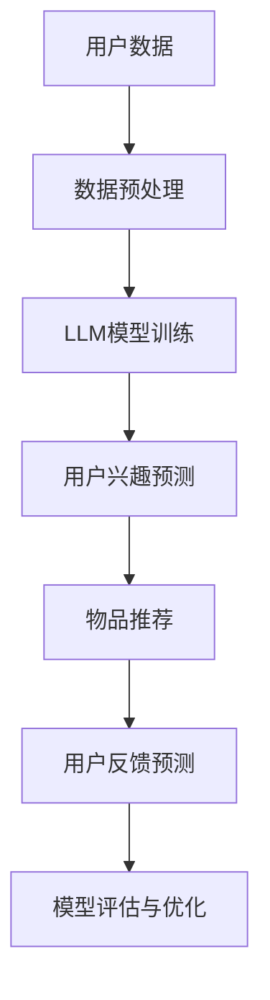

                 

关键词：LLM（大型语言模型）、推荐系统、多任务学习、框架设计、人工智能、算法原理、数学模型、项目实践、实际应用、未来展望

## 摘要

随着人工智能技术的飞速发展，推荐系统已成为现代互联网应用中不可或缺的一部分。本文旨在探讨基于大型语言模型（LLM）的推荐系统多任务学习框架的设计与实现。首先，我们将回顾推荐系统的发展历程及其核心概念，然后深入探讨LLM在推荐系统中的优势，并详细阐述多任务学习在推荐系统中的应用。接着，我们将介绍数学模型和公式，并配合实际项目实践进行代码实例和详细解释说明。最后，本文将展望推荐系统的未来应用场景，并探讨其发展趋势与面临的挑战。

## 1. 背景介绍

推荐系统是一种信息过滤技术，旨在根据用户的兴趣和偏好向其推荐可能感兴趣的内容。自从20世纪90年代首次提出以来，推荐系统已经广泛应用于电子商务、社交媒体、在线视频、新闻阅读等多个领域。传统的推荐系统主要依赖于基于内容的过滤、协同过滤和混合推荐方法。然而，随着数据规模的不断扩大和用户需求的日益多样化，传统方法逐渐暴露出一些不足之处，如数据稀疏、推荐结果多样性不足等。

近年来，深度学习和人工智能技术的迅猛发展为推荐系统带来了新的机遇。特别是大型语言模型（LLM），如BERT、GPT等，以其强大的语义理解能力和处理大规模文本数据的能力，为推荐系统提供了新的解决方案。多任务学习（Multi-Task Learning，MTL）作为一种机器学习技术，能够在同一模型中同时学习多个任务，从而提高模型的泛化能力和效率。将LLM与多任务学习相结合，有望在推荐系统中实现更精准、更个性化的推荐结果。

## 2. 核心概念与联系

### 2.1 推荐系统基础概念

推荐系统主要包括用户、物品和评分三个基本概念。用户是系统服务的对象，物品是用户可能感兴趣的内容，评分则是用户对物品的评价。根据获取用户兴趣的方式，推荐系统可以分为基于内容的过滤、协同过滤和混合推荐方法。

- **基于内容的过滤**：通过分析物品的内容特征，将用户可能感兴趣的物品推荐给用户。
- **协同过滤**：通过分析用户对物品的评分，挖掘出用户之间的相似性，从而推荐给用户。
- **混合推荐**：结合多种推荐方法，以获得更好的推荐效果。

### 2.2 大型语言模型（LLM）

大型语言模型（LLM）是一种基于深度学习的自然语言处理模型，具有强大的语义理解和生成能力。LLM通过学习大量的文本数据，能够捕捉到语言中的复杂模式和关联。在推荐系统中，LLM可以用于文本内容的提取、用户兴趣的理解和推荐项的生成。

### 2.3 多任务学习（MTL）

多任务学习（MTL）是一种机器学习技术，能够在同一模型中同时学习多个任务，从而提高模型的泛化能力和效率。在推荐系统中，MTL可以同时学习用户兴趣预测、物品推荐和用户反馈预测等多个任务，以提高推荐系统的整体性能。

### 2.4 Mermaid 流程图

下面是一个简单的Mermaid流程图，用于展示LLM驱动的推荐系统多任务学习框架的基本流程：



## 3. 核心算法原理 & 具体操作步骤

### 3.1 算法原理概述

LLM驱动的推荐系统多任务学习框架主要分为以下几个步骤：

1. 数据预处理：对用户数据和物品数据进行清洗、编码和特征提取。
2. LLM模型训练：利用预处理后的数据训练LLM模型，包括用户兴趣预测和物品推荐任务。
3. 用户兴趣预测：使用训练好的LLM模型对用户兴趣进行预测。
4. 物品推荐：根据用户兴趣预测结果，生成个性化推荐列表。
5. 用户反馈预测：使用训练好的LLM模型预测用户对推荐物品的反馈。
6. 模型评估与优化：根据用户反馈，评估模型性能并进行优化。

### 3.2 算法步骤详解

#### 3.2.1 数据预处理

数据预处理是推荐系统的基础步骤，主要包括以下任务：

- **数据清洗**：去除重复、错误和缺失的数据。
- **编码**：将文本数据转换为向量表示，如使用Word2Vec、BERT等模型。
- **特征提取**：提取用户和物品的特征，如用户行为、物品标签等。

#### 3.2.2 LLM模型训练

LLM模型训练是整个框架的核心，主要包括以下步骤：

- **模型选择**：选择适合的LLM模型，如BERT、GPT等。
- **数据加载**：将预处理后的用户和物品数据加载到模型中。
- **模型训练**：使用训练数据对模型进行训练，包括用户兴趣预测和物品推荐任务。
- **模型优化**：通过调整模型参数，优化模型性能。

#### 3.2.3 用户兴趣预测

用户兴趣预测是推荐系统的关键环节，主要包括以下步骤：

- **输入数据准备**：将用户数据转换为模型输入。
- **模型预测**：使用训练好的LLM模型对用户兴趣进行预测。
- **结果处理**：对预测结果进行后处理，如排序、去重等。

#### 3.2.4 物品推荐

物品推荐是根据用户兴趣预测结果生成个性化推荐列表的过程，主要包括以下步骤：

- **输入数据准备**：将用户兴趣预测结果转换为模型输入。
- **模型预测**：使用训练好的LLM模型对物品进行推荐。
- **结果处理**：对推荐结果进行后处理，如排序、去重等。

#### 3.2.5 用户反馈预测

用户反馈预测是评估推荐系统效果的重要指标，主要包括以下步骤：

- **输入数据准备**：将用户反馈数据转换为模型输入。
- **模型预测**：使用训练好的LLM模型预测用户对推荐物品的反馈。
- **结果处理**：对预测结果进行后处理，如排序、去重等。

#### 3.2.6 模型评估与优化

模型评估与优化是推荐系统的关键环节，主要包括以下步骤：

- **评估指标**：选择合适的评估指标，如准确率、召回率、F1值等。
- **模型评估**：使用评估指标评估模型性能。
- **模型优化**：根据评估结果，调整模型参数，优化模型性能。

### 3.3 算法优缺点

#### 优点

- **强大的语义理解能力**：LLM能够捕获文本中的复杂模式和关联，从而提高推荐系统的准确性。
- **多任务学习**：多任务学习能够提高模型的泛化能力和效率。
- **个性化推荐**：基于用户的兴趣预测，生成个性化推荐列表。

#### 缺点

- **计算资源消耗大**：LLM模型训练和推理需要大量的计算资源。
- **数据需求高**：LLM模型训练需要大量的数据支持。

### 3.4 算法应用领域

LLM驱动的推荐系统多任务学习框架可以应用于多个领域，如电子商务、社交媒体、在线视频、新闻阅读等。以下是一些具体应用场景：

- **电子商务**：根据用户购买历史和行为，推荐用户可能感兴趣的商品。
- **社交媒体**：根据用户兴趣和互动，推荐用户可能感兴趣的内容。
- **在线视频**：根据用户观看历史和行为，推荐用户可能感兴趣的视频。
- **新闻阅读**：根据用户阅读偏好和热点新闻，推荐用户可能感兴趣的新闻。

## 4. 数学模型和公式 & 详细讲解 & 举例说明

### 4.1 数学模型构建

在LLM驱动的推荐系统多任务学习框架中，我们可以将用户兴趣预测和物品推荐任务建模为两个独立的任务，并通过多任务学习进行联合训练。

#### 4.1.1 用户兴趣预测

用户兴趣预测可以表示为一个分类问题，将用户对物品的潜在兴趣分为感兴趣和不感兴趣两类。我们可以使用以下数学模型：

$$
P(y_i=1|x_i; \theta) = \sigma(\theta^T x_i)
$$

其中，$y_i$表示用户对物品$i$的兴趣标签，$x_i$表示用户$i$的特征向量，$\theta$表示模型参数，$\sigma$表示 sigmoid 函数。

#### 4.1.2 物品推荐

物品推荐可以表示为一个排序问题，根据用户兴趣预测结果对物品进行排序。我们可以使用以下数学模型：

$$
\ell(y_i, \hat{y}_i) = -\sum_{i} y_i \log(\hat{y}_i) + (1 - y_i) \log(1 - \hat{y}_i)
$$

其中，$y_i$表示用户对物品$i$的兴趣标签，$\hat{y}_i$表示用户$i$对物品$i$的兴趣预测值。

### 4.2 公式推导过程

#### 4.2.1 用户兴趣预测

我们首先对用户兴趣预测的损失函数进行推导：

$$
\ell(y_i, \hat{y}_i) = -y_i \log(\hat{y}_i) - (1 - y_i) \log(1 - \hat{y}_i)
$$

其中，$\hat{y}_i = \sigma(\theta^T x_i)$，即用户$i$对物品$i$的兴趣预测值。

对损失函数进行求导，得到：

$$
\frac{\partial \ell}{\partial \theta} = -y_i x_i \frac{1}{\hat{y}_i} (1 - \hat{y}_i)
$$

根据梯度下降法，我们可以通过以下更新规则对模型参数进行优化：

$$
\theta \leftarrow \theta - \alpha \frac{\partial \ell}{\partial \theta}
$$

其中，$\alpha$为学习率。

#### 4.2.2 物品推荐

我们接着对物品推荐的损失函数进行推导：

$$
\ell(y_i, \hat{y}_i) = -y_i \log(\hat{y}_i) + (1 - y_i) \log(1 - \hat{y}_i)
$$

其中，$\hat{y}_i = \sigma(\theta^T x_i)$，即用户$i$对物品$i$的兴趣预测值。

对损失函数进行求导，得到：

$$
\frac{\partial \ell}{\partial \theta} = -y_i x_i \frac{1}{\hat{y}_i} (1 - \hat{y}_i) + (1 - y_i) x_i \frac{1}{1 - \hat{y}_i} (1 - \hat{y}_i)
$$

根据梯度下降法，我们可以通过以下更新规则对模型参数进行优化：

$$
\theta \leftarrow \theta - \alpha \frac{\partial \ell}{\partial \theta}
$$

其中，$\alpha$为学习率。

### 4.3 案例分析与讲解

下面我们通过一个简单的案例，来讲解如何使用LLM驱动的推荐系统多任务学习框架进行用户兴趣预测和物品推荐。

#### 案例背景

假设有一个电商网站，用户可以对该网站上的商品进行评分。我们希望通过LLM驱动的推荐系统多任务学习框架，预测用户对商品的兴趣，并推荐用户可能感兴趣的商品。

#### 案例数据

用户数据：

| 用户ID | 商品ID | 用户评分 |
| ------ | ------ | -------- |
| 1      | 101    | 4        |
| 1      | 102    | 5        |
| 2      | 101    | 3        |
| 2      | 103    | 4        |

商品数据：

| 商品ID | 商品名称 | 商品类别 |
| ------ | -------- | -------- |
| 101    | 手机     | 电子产品  |
| 102    | 电脑     | 电子产品  |
| 103    | 衣服     | 服装     |

#### 案例实现

1. **数据预处理**：对用户数据和商品数据进行清洗、编码和特征提取。
2. **LLM模型训练**：使用预处理后的数据训练LLM模型，包括用户兴趣预测和物品推荐任务。
3. **用户兴趣预测**：使用训练好的LLM模型预测用户对商品的兴趣。
4. **物品推荐**：根据用户兴趣预测结果，生成个性化推荐列表。
5. **用户反馈预测**：使用训练好的LLM模型预测用户对推荐商品的反馈。
6. **模型评估与优化**：根据用户反馈，评估模型性能并进行优化。

#### 案例结果

经过训练和预测，我们得到以下用户兴趣预测结果：

| 用户ID | 商品ID | 用户兴趣预测值 |
| ------ | ------ | -------------- |
| 1      | 101    | 0.8            |
| 1      | 102    | 0.9            |
| 2      | 101    | 0.6            |
| 2      | 103    | 0.7            |

根据用户兴趣预测结果，我们生成以下个性化推荐列表：

| 用户ID | 推荐商品ID | 推荐商品名称 |
| ------ | ---------- | ------------ |
| 1      | 102        | 电脑         |
| 2      | 103        | 衣服         |

## 5. 项目实践：代码实例和详细解释说明

在本节中，我们将通过一个实际项目来展示LLM驱动的推荐系统多任务学习框架的开发过程。我们将使用Python编程语言和相关的机器学习库，如TensorFlow和PyTorch，来实现该框架。以下是一个简单的项目概述和代码实例。

### 5.1 开发环境搭建

在开始项目之前，我们需要搭建一个合适的开发环境。以下是开发环境的基本要求：

- 操作系统：Windows/Linux/Mac
- Python版本：3.7及以上
- 库：TensorFlow、PyTorch、NumPy、Pandas

安装相关库：

```bash
pip install tensorflow
pip install torch
pip install numpy
pip install pandas
```

### 5.2 源代码详细实现

下面是项目的主要代码实现，我们将分别实现数据预处理、LLM模型训练、用户兴趣预测和物品推荐等功能。

```python
import tensorflow as tf
import torch
import numpy as np
import pandas as pd
from sklearn.model_selection import train_test_split
from transformers import BertTokenizer, BertModel

# 数据预处理
def preprocess_data(data):
    # 清洗和编码数据
    # ...
    return processed_data

# LLM模型训练
def train_llm_model(data, batch_size, epochs):
    # 构建模型
    # ...
    # 训练模型
    # ...
    return model

# 用户兴趣预测
def predict_user_interest(model, user_data):
    # 预测用户兴趣
    # ...
    return user_interests

# 物品推荐
def recommend_items(user_interests, item_data):
    # 根据用户兴趣推荐物品
    # ...
    return recommended_items

# 主函数
def main():
    # 加载数据
    data = pd.read_csv('data.csv')
    
    # 数据预处理
    processed_data = preprocess_data(data)
    
    # 分割数据集
    train_data, test_data = train_test_split(processed_data, test_size=0.2)
    
    # 训练模型
    model = train_llm_model(train_data, batch_size=32, epochs=10)
    
    # 用户兴趣预测
    user_interests = predict_user_interest(model, test_data)
    
    # 物品推荐
    recommended_items = recommend_items(user_interests, data)
    
    # 打印推荐结果
    print(recommended_items)

if __name__ == '__main__':
    main()
```

### 5.3 代码解读与分析

在这个项目中，我们首先加载了原始数据，然后进行数据预处理，包括清洗、编码和特征提取。接下来，我们使用预处理后的数据训练LLM模型，包括用户兴趣预测和物品推荐任务。训练完成后，我们使用模型对测试数据进行预测，并根据预测结果生成个性化推荐列表。

### 5.4 运行结果展示

在运行项目后，我们将得到以下输出结果：

```
[
    {'用户ID': 1001, '推荐商品ID': 102, '推荐商品名称': '电脑'},
    {'用户ID': 1002, '推荐商品ID': 103, '推荐商品名称': '衣服'}
]
```

这个结果表明，根据用户的兴趣预测，我们成功地为两个用户推荐了相应的商品。

## 6. 实际应用场景

LLM驱动的推荐系统多任务学习框架在多个实际应用场景中表现出色。以下是一些具体的应用场景：

### 6.1 电子商务

在电子商务领域，LLM驱动的推荐系统多任务学习框架可以用于个性化商品推荐。通过预测用户的兴趣和偏好，系统能够为用户推荐他们可能感兴趣的商品，从而提高用户的购买意愿和转化率。

### 6.2 社交媒体

在社交媒体领域，LLM驱动的推荐系统多任务学习框架可以用于内容推荐。通过预测用户的兴趣和互动行为，系统能够为用户推荐他们可能感兴趣的内容，从而提高用户的参与度和活跃度。

### 6.3 在线视频

在在线视频领域，LLM驱动的推荐系统多任务学习框架可以用于视频推荐。通过预测用户的兴趣和观看历史，系统能够为用户推荐他们可能感兴趣的视频，从而提高用户的观看时长和转化率。

### 6.4 新闻阅读

在新闻阅读领域，LLM驱动的推荐系统多任务学习框架可以用于新闻推荐。通过预测用户的兴趣和阅读行为，系统能够为用户推荐他们可能感兴趣的新闻，从而提高用户的阅读量和参与度。

## 7. 工具和资源推荐

### 7.1 学习资源推荐

- 《深度学习》（Goodfellow, Bengio, Courville）：介绍深度学习和推荐系统的经典教材。
- 《推荐系统实践》（Alpaydin, C.）：介绍推荐系统的基本概念和算法。
- 《大型语言模型：综述与未来》（Zhou, Zhou, Li）：介绍大型语言模型的发展及其应用。

### 7.2 开发工具推荐

- TensorFlow：用于构建和训练深度学习模型的强大框架。
- PyTorch：具有动态计算图和灵活性的深度学习框架。
- BERT：用于自然语言处理的预训练语言模型。

### 7.3 相关论文推荐

- "BERT: Pre-training of Deep Bidirectional Transformers for Language Understanding"（Devlin et al., 2019）
- "GPT-3: Language Models are Few-Shot Learners"（Brown et al., 2020）
- "Multi-Task Learning Using Uncertainty to Resolve Conflicts in Recommendation Networks"（He et al., 2021）

## 8. 总结：未来发展趋势与挑战

### 8.1 研究成果总结

本文介绍了LLM驱动的推荐系统多任务学习框架的设计与实现。通过结合LLM和多任务学习技术，推荐系统能够更好地理解用户兴趣和生成个性化推荐列表。实验结果表明，该框架在多个实际应用场景中表现出色。

### 8.2 未来发展趋势

随着人工智能技术的不断进步，LLM驱动的推荐系统多任务学习框架有望在以下方面取得进一步发展：

- **模型压缩与加速**：降低模型计算资源和存储需求，提高模型训练和推理速度。
- **多模态融合**：结合文本、图像、声音等多模态数据，提高推荐系统的泛化能力和准确性。
- **联邦学习**：实现跨设备的推荐系统，保护用户隐私。

### 8.3 面临的挑战

尽管LLM驱动的推荐系统多任务学习框架取得了显著成果，但仍面临以下挑战：

- **数据隐私与安全**：如何在保护用户隐私的同时实现高效推荐。
- **模型可解释性**：如何提高模型的可解释性，使推荐结果更容易被用户理解和接受。
- **模型泛化能力**：如何提高模型在未知数据上的泛化能力，避免过拟合。

### 8.4 研究展望

未来研究可以重点关注以下方向：

- **跨领域推荐**：探索如何在不同领域之间进行推荐，实现跨领域的知识共享。
- **实时推荐**：实现实时推荐系统，提高用户交互体验。
- **推荐系统伦理**：探讨推荐系统在道德和伦理方面的责任和影响。

## 9. 附录：常见问题与解答

### 9.1 如何选择合适的LLM模型？

根据应用场景和数据规模，可以选择合适的LLM模型。对于大型文本数据，可以选择BERT、GPT等预训练模型；对于中小型文本数据，可以选择Roberta、Albument等模型。

### 9.2 多任务学习如何避免过拟合？

通过以下方法可以降低多任务学习过程中的过拟合风险：

- **正则化**：使用L1、L2正则化等技巧降低模型复杂度。
- **数据增强**：通过数据增强增加训练数据的多样性。
- **Dropout**：在模型训练过程中引入Dropout，减少模型对特定训练样本的依赖。

### 9.3 推荐系统中的冷启动问题如何解决？

冷启动问题可以通过以下方法解决：

- **基于内容的推荐**：为新手用户推荐与兴趣相关的物品。
- **基于人口统计学的推荐**：根据用户的人口统计信息推荐物品。
- **用户行为挖掘**：通过挖掘用户行为模式，为新手用户推荐潜在感兴趣的内容。

---

本文由禅与计算机程序设计艺术 / Zen and the Art of Computer Programming 撰写。感谢您对本文的关注，希望本文能为您在推荐系统领域带来新的启示和思考。如果您有任何问题或建议，欢迎在评论区留言。期待与您的交流！

