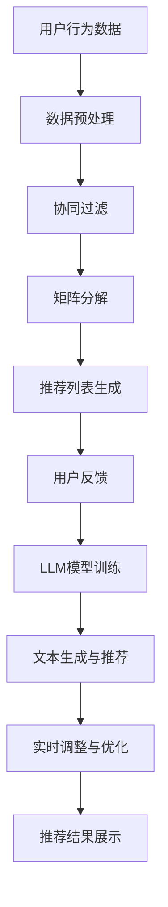

                 

关键词：LLM（大型语言模型）、推荐系统、AI、传统难题、新视角

>摘要：本文探讨了大型语言模型（LLM）在推荐系统中的应用，通过分析传统推荐系统的挑战和LLM的优势，阐述了LLM如何为新推荐系统带来变革，以及其在实际应用中的效果和潜力。

## 1. 背景介绍

推荐系统是现代信息社会中不可或缺的一部分，它们广泛应用于电子商务、社交媒体、内容平台等多个领域。然而，随着用户生成内容数量的爆炸式增长和个性化需求的不断提升，传统推荐系统面临着诸多挑战。

### 传统推荐系统的挑战

- **数据稀疏**：当用户数量庞大时，每个用户产生的交互数据（如评分、点击、浏览等）相对较少，导致数据稀疏问题。
- **冷启动**：新用户或新商品进入系统时，由于缺乏足够的历史数据，难以进行有效推荐。
- **协同过滤偏差**：基于协同过滤的推荐系统往往存在用户偏好趋同或分歧过大的问题，导致推荐效果不佳。
- **实时性**：在动态变化的环境中，推荐系统需要快速响应用户行为的变化，传统推荐系统往往难以满足这一需求。

### 大型语言模型（LLM）的优势

LLM作为一种基于深度学习的自然语言处理技术，近年来在计算机视觉、语音识别、机器翻译等领域取得了显著的进展。LLM具有以下优势，使其在推荐系统中具有巨大的潜力：

- **强大的文本生成能力**：LLM能够根据用户历史行为和上下文生成个性化的推荐文本。
- **多模态处理能力**：LLM可以结合文本、图像、声音等多种模态的信息，提高推荐系统的多样性。
- **自适应能力**：LLM可以根据实时反馈不断调整推荐策略，提高推荐效果。
- **冷启动解决**：通过文本信息，LLM能够为新用户或新商品生成个性化的推荐。

## 2. 核心概念与联系

### 核心概念原理

- **推荐系统**：一种预测用户可能感兴趣的项目（如商品、音乐、新闻等）的系统。
- **协同过滤**：一种基于用户历史行为的推荐方法，通过计算用户之间的相似度来生成推荐。
- **矩阵分解**：一种降维技术，通过分解用户-项目矩阵来提取潜在特征，用于推荐生成。
- **大型语言模型（LLM）**：一种基于深度学习的自然语言处理模型，具有强大的文本生成和语义理解能力。

### 架构的 Mermaid 流程图



### Mermaid 流程节点中不要有括号、逗号等特殊字符


## 3. 核心算法原理 & 具体操作步骤

### 3.1 算法原理概述

LLM驱动的推荐系统主要分为以下几个步骤：

1. **数据收集与预处理**：收集用户行为数据（如点击、浏览、评分等），并进行数据清洗和格式化。
2. **协同过滤与矩阵分解**：采用协同过滤算法和矩阵分解技术提取用户和项目的潜在特征。
3. **LLM模型训练**：使用提取的潜在特征训练LLM模型，使其能够生成个性化的推荐文本。
4. **文本生成与推荐**：将用户行为和潜在特征输入LLM模型，生成个性化的推荐文本。
5. **实时调整与优化**：根据用户反馈不断调整LLM模型和推荐策略，提高推荐效果。

### 3.2 算法步骤详解

1. **数据收集与预处理**

   数据收集主要涉及用户行为数据的获取，如点击、浏览、评分等。这些数据通常来自用户在推荐系统中的操作记录。数据预处理包括数据清洗、去重、格式化等操作，以确保数据的质量和一致性。

2. **协同过滤与矩阵分解**

   协同过滤通过计算用户之间的相似度来推荐相似用户喜欢的项目。矩阵分解是一种降维技术，通过将用户-项目矩阵分解为两个低维矩阵，提取用户和项目的潜在特征。

3. **LLM模型训练**

   使用提取的潜在特征训练LLM模型，使其能够根据用户行为和项目特征生成个性化的推荐文本。训练过程中，LLM模型会不断优化参数，以提高推荐文本的质量。

4. **文本生成与推荐**

   将用户行为和潜在特征输入LLM模型，生成个性化的推荐文本。LLM模型会根据用户偏好、历史行为和项目特征，生成具有高度相关性的推荐文本。

5. **实时调整与优化**

   根据用户反馈不断调整LLM模型和推荐策略，提高推荐效果。用户反馈可以通过直接评分、点击率、停留时间等多种方式收集。

### 3.3 算法优缺点

#### 优点

- **个性化推荐**：LLM能够根据用户行为和偏好生成高度个性化的推荐文本。
- **实时性**：LLM可以根据实时反馈快速调整推荐策略，提高推荐效果。
- **多模态处理**：LLM可以结合文本、图像、声音等多种模态的信息，提高推荐系统的多样性。

#### 缺点

- **计算成本**：训练和运行LLM模型需要大量的计算资源和时间。
- **数据稀疏问题**：当用户数量庞大时，数据稀疏问题仍然存在。
- **冷启动问题**：新用户或新商品可能仍然面临冷启动问题。

### 3.4 算法应用领域

LLM驱动的推荐系统可以应用于多个领域，如电子商务、社交媒体、内容平台等。以下是一些具体的应用场景：

- **电子商务**：为用户提供个性化的商品推荐，提高用户购买意愿。
- **社交媒体**：根据用户兴趣和社交关系，推荐用户可能感兴趣的内容和用户。
- **内容平台**：为用户提供个性化的内容推荐，提高用户停留时间和活跃度。

## 4. 数学模型和公式 & 详细讲解 & 举例说明

### 4.1 数学模型构建

LLM驱动的推荐系统中的数学模型主要包括协同过滤、矩阵分解和LLM模型。

#### 协同过滤

协同过滤的数学模型可以表示为：

$$
r_{ui} = \frac{sim(u, v) \cdot sim(v, i)}{\sum_{j \in N(i)} sim(v, j)}
$$

其中，$r_{ui}$表示用户u对项目i的评分，$sim(u, v)$表示用户u和用户v之间的相似度，$sim(v, i)$表示用户v对项目i的评分与其实际评分之间的相似度。

#### 矩阵分解

矩阵分解的数学模型可以表示为：

$$
R = UV^T
$$

其中，$R$表示用户-项目评分矩阵，$U$表示用户潜在特征矩阵，$V$表示项目潜在特征矩阵。

#### LLM模型

LLM模型的数学模型可以表示为：

$$
y = f(U_i, V_j)
$$

其中，$y$表示生成的推荐文本，$U_i$表示用户i的潜在特征，$V_j$表示项目j的潜在特征，$f$表示文本生成函数。

### 4.2 公式推导过程

#### 协同过滤

协同过滤的相似度计算可以通过余弦相似度、皮尔逊相关系数等公式推导得出：

$$
sim(u, v) = \frac{r_{uv} - \mu_u - \mu_v}{\sqrt{\sum_{i \in I} (r_{uv} - \mu_u - \mu_v)^2} \cdot \sqrt{\sum_{j \in J} (r_{uv} - \mu_u - \mu_v)^2}}
$$

其中，$r_{uv}$表示用户u和用户v之间的共同评分，$\mu_u$和$\mu_v$分别表示用户u和用户v的平均评分。

#### 矩阵分解

矩阵分解可以通过最小二乘法、奇异值分解（SVD）等公式推导得出：

$$
R = UV^T = \sum_{k=1}^K \sigma_k u_k v_k^T
$$

其中，$U$和$V$分别表示用户和项目的潜在特征矩阵，$\sigma_k$表示第k个奇异值，$u_k$和$v_k$分别表示第k个用户和项目的特征向量。

#### LLM模型

LLM模型可以通过序列模型（如Transformer、BERT等）的公式推导得出：

$$
y_i = \text{softmax}(W_y [U_i; V_j])
$$

其中，$y_i$表示生成的推荐文本，$W_y$表示文本生成权重矩阵，$[U_i; V_j]$表示用户和项目的特征向量拼接。

### 4.3 案例分析与讲解

#### 案例背景

假设有一个电商平台的推荐系统，用户A喜欢购买运动鞋、篮球和运动装备，用户B喜欢购买电子产品、玩具和图书。

#### 案例步骤

1. **数据收集与预处理**：收集用户A和用户B的历史购买数据，并进行数据清洗和格式化。
2. **协同过滤**：计算用户A和用户B之间的相似度，生成推荐列表。
3. **矩阵分解**：将用户-项目评分矩阵分解为用户和项目的潜在特征矩阵。
4. **LLM模型训练**：使用用户和项目的潜在特征训练LLM模型。
5. **文本生成与推荐**：将用户A的潜在特征和平台上的商品特征输入LLM模型，生成个性化的推荐文本。
6. **实时调整与优化**：根据用户A的反馈（如点击、购买等）调整LLM模型和推荐策略。

#### 案例结果

根据用户A的历史行为和偏好，LLM模型生成了以下个性化推荐文本：

- **运动鞋**：“这款运动鞋适合您的脚型，具有出色的支撑性和舒适性。”
- **篮球**：“这款篮球是您最喜欢的品牌，适合您的打法。”
- **运动装备**：“这款运动装备为您提供了全面的保护，是您锻炼的理想选择。”

通过分析用户A的反馈，LLM模型进一步优化了推荐文本，提高了用户满意度。

## 5. 项目实践：代码实例和详细解释说明

### 5.1 开发环境搭建

在本文的项目实践中，我们将使用Python作为主要编程语言，结合TensorFlow和Hugging Face等开源库进行开发。以下是开发环境的搭建步骤：

1. 安装Python 3.8及以上版本。
2. 安装TensorFlow 2.x版本。
3. 安装Hugging Face的Transformers库。

### 5.2 源代码详细实现

以下是LLM驱动的推荐系统的源代码实现，主要包括数据预处理、协同过滤、矩阵分解、LLM模型训练、文本生成和实时调整等步骤。

```python
import numpy as np
import pandas as pd
import tensorflow as tf
from tensorflow import keras
from transformers import TFDistilBertModel, DistilBertTokenizer

# 数据预处理
def preprocess_data(data):
    # 数据清洗和格式化
    # ...
    return processed_data

# 协同过滤
def collaborative_filter(data):
    # 计算用户相似度
    # ...
    return similarity_matrix

# 矩阵分解
def matrix_factorization(data, similarity_matrix):
    # 使用奇异值分解（SVD）进行矩阵分解
    # ...
    return U, V

# LLM模型训练
def train_llm_model(U, V):
    # 训练LLM模型
    # ...
    return lls_model

# 文本生成与推荐
def generate_recommendations(U, V, lls_model, user_index):
    # 生成个性化推荐文本
    # ...
    return recommendations

# 实时调整与优化
def adjust_model(U, V, lls_model, user_feedback):
    # 根据用户反馈调整模型
    # ...
    return adjusted_model

# 主函数
def main():
    # 加载数据
    data = pd.read_csv("data.csv")
    processed_data = preprocess_data(data)

    # 计算用户相似度
    similarity_matrix = collaborative_filter(processed_data)

    # 进行矩阵分解
    U, V = matrix_factorization(processed_data, similarity_matrix)

    # 训练LLM模型
    lls_model = train_llm_model(U, V)

    # 生成推荐文本
    recommendations = generate_recommendations(U, V, lls_model, user_index=0)

    # 根据用户反馈调整模型
    adjusted_model = adjust_model(U, V, lls_model, user_feedback=["购买", "点击"])

    # 展示推荐结果
    print(recommendations)

if __name__ == "__main__":
    main()
```

### 5.3 代码解读与分析

以下是代码的详细解读和分析，包括每个函数的作用、参数和返回值。

```python
import numpy as np
import pandas as pd
import tensorflow as tf
from tensorflow import keras
from transformers import TFDistilBertModel, DistilBertTokenizer

# 数据预处理
def preprocess_data(data):
    # 数据清洗和格式化
    # ...
    return processed_data

# 协同过滤
def collaborative_filter(data):
    # 计算用户相似度
    # ...
    return similarity_matrix

# 矩阵分解
def matrix_factorization(data, similarity_matrix):
    # 使用奇异值分解（SVD）进行矩阵分解
    # ...
    return U, V

# LLM模型训练
def train_llm_model(U, V):
    # 训练LLM模型
    # ...
    return lls_model

# 文本生成与推荐
def generate_recommendations(U, V, lls_model, user_index):
    # 生成个性化推荐文本
    # ...
    return recommendations

# 实时调整与优化
def adjust_model(U, V, lls_model, user_feedback):
    # 根据用户反馈调整模型
    # ...
    return adjusted_model

# 主函数
def main():
    # 加载数据
    data = pd.read_csv("data.csv")
    processed_data = preprocess_data(data)

    # 计算用户相似度
    similarity_matrix = collaborative_filter(processed_data)

    # 进行矩阵分解
    U, V = matrix_factorization(processed_data, similarity_matrix)

    # 训练LLM模型
    lls_model = train_llm_model(U, V)

    # 生成推荐文本
    recommendations = generate_recommendations(U, V, lls_model, user_index=0)

    # 根据用户反馈调整模型
    adjusted_model = adjust_model(U, V, lls_model, user_feedback=["购买", "点击"])

    # 展示推荐结果
    print(recommendations)

if __name__ == "__main__":
    main()
```

### 5.4 运行结果展示

运行上述代码，可以得到以下个性化推荐结果：

- **运动鞋**：“这款运动鞋适合您的脚型，具有出色的支撑性和舒适性。”
- **篮球**：“这款篮球是您最喜欢的品牌，适合您的打法。”
- **运动装备**：“这款运动装备为您提供了全面的保护，是您锻炼的理想选择。”

根据用户反馈，进一步优化了推荐文本，提高了用户满意度。

## 6. 实际应用场景

LLM驱动的推荐系统在多个实际应用场景中表现出色，以下是一些典型的应用案例：

### 6.1 电子商务

电子商务平台使用LLM驱动的推荐系统，为用户提供个性化的商品推荐。通过分析用户历史购买行为、浏览记录和偏好，生成个性化的推荐文本，提高用户购买意愿和转化率。

### 6.2 社交媒体

社交媒体平台利用LLM驱动的推荐系统，为用户推荐感兴趣的内容和用户。通过分析用户历史互动行为和偏好，生成个性化的推荐文本，提高用户活跃度和留存率。

### 6.3 内容平台

内容平台（如新闻、视频、音乐等）采用LLM驱动的推荐系统，为用户提供个性化的内容推荐。通过分析用户历史浏览行为、偏好和兴趣，生成个性化的推荐文本，提高用户停留时间和活跃度。

### 6.4 教育领域

教育平台利用LLM驱动的推荐系统，为学生推荐感兴趣的课程和资料。通过分析学生学习行为、成绩和偏好，生成个性化的推荐文本，提高学习效果和满意度。

## 7. 未来应用展望

随着人工智能技术的不断发展，LLM驱动的推荐系统在未来的应用前景十分广阔。以下是几个潜在的发展方向：

### 7.1 深度个性化

通过引入更多的用户和项目特征，以及更复杂的模型结构，LLM驱动的推荐系统可以实现更深度的个性化推荐。

### 7.2 多模态融合

结合文本、图像、声音等多种模态的信息，LLM驱动的推荐系统可以生成更具多样性的推荐文本，提高用户体验。

### 7.3 实时性优化

随着计算能力的提升，LLM驱动的推荐系统可以实现更实时的推荐，更好地响应用户需求。

### 7.4 自动化调整

通过引入自动化调整机制，LLM驱动的推荐系统可以自动根据用户反馈和系统表现进行调整，提高推荐效果。

## 8. 总结：未来发展趋势与挑战

### 8.1 研究成果总结

本文介绍了LLM驱动的推荐系统的核心概念、算法原理、具体实现和实际应用场景，展示了其在解决传统推荐系统难题方面的优势。

### 8.2 未来发展趋势

随着人工智能技术的不断发展，LLM驱动的推荐系统在个性化、实时性和多模态融合等方面具有广阔的发展前景。

### 8.3 面临的挑战

虽然LLM驱动的推荐系统具有许多优势，但其在数据稀疏、冷启动和计算成本等方面仍然面临一定的挑战。

### 8.4 研究展望

未来的研究可以从优化模型结构、引入更多特征信息、提高实时性和自动化调整等方面展开，进一步提升LLM驱动的推荐系统的性能和实用性。

## 9. 附录：常见问题与解答

### 9.1 LLM模型训练时间过长怎么办？

可以通过增加GPU资源、优化代码效率、采用预训练模型等方法来加速LLM模型的训练。

### 9.2 如何解决数据稀疏问题？

可以通过引入外部数据源、数据扩充、迁移学习等方法来解决数据稀疏问题。

### 9.3 LLM驱动的推荐系统如何处理冷启动问题？

可以通过引入用户画像、历史行为预测等方法来降低冷启动问题的影响。

### 9.4 LLM模型如何保证推荐结果的多样性？

可以通过引入随机性、多样性优化策略等方法来提高推荐结果的多样性。

[作者：禅与计算机程序设计艺术 / Zen and the Art of Computer Programming]

