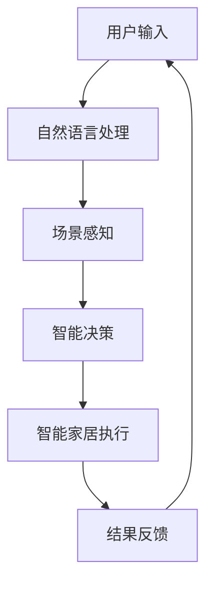

                 

关键词：LLM、智能家居、自适应、深度学习、机器学习、自然语言处理、场景感知、智能决策

摘要：本文将探讨如何利用大型语言模型（LLM）驱动智能家居场景，实现自适应生活环境。通过深入分析LLM的核心原理和应用，本文将展示如何通过自然语言处理和机器学习技术，为智能家居系统提供智能化决策支持，从而提升用户的生活质量和居住体验。

## 1. 背景介绍

随着物联网（IoT）和人工智能（AI）技术的迅猛发展，智能家居系统已经成为现代家庭生活的重要组成部分。智能家居通过将各种家居设备联网，实现自动化控制和智能化管理，从而提升用户的生活便利性和舒适度。然而，传统的智能家居系统往往依赖于预定义的规则和程序，缺乏对用户需求的动态适应能力。

近年来，深度学习和自然语言处理技术的飞速发展，为智能家居领域带来了新的机遇。大型语言模型（LLM）作为一种先进的AI模型，在处理和理解自然语言方面具有显著优势。LLM能够通过学习海量的文本数据，实现对人类语言的精准理解和生成，从而为智能家居系统提供强大的智能决策支持。

本文将探讨如何利用LLM驱动智能家居场景，实现自适应生活环境。通过分析LLM的核心原理和应用，本文将介绍如何通过自然语言处理和机器学习技术，为智能家居系统提供智能化决策支持，从而提升用户的生活质量和居住体验。

## 2. 核心概念与联系

### 2.1. 大型语言模型（LLM）

大型语言模型（LLM）是一种基于深度学习的自然语言处理模型，通过学习大量的文本数据，实现对自然语言的精准理解和生成。LLM的核心结构通常包括编码器（Encoder）和解码器（Decoder），其中编码器负责将输入的文本转换为固定长度的向量表示，解码器则负责根据编码器的输出生成相应的文本。

LLM具有以下几个关键特点：

- **大规模训练数据**：LLM需要大量的文本数据进行训练，从而获得对自然语言的深刻理解。
- **深度神经网络结构**：LLM通常采用多层神经网络结构，以实现对输入文本的深层特征提取。
- **端到端模型**：LLM是一个端到端的模型，可以直接从输入文本生成输出文本，无需人工干预。

### 2.2. 智能家居

智能家居系统是指通过物联网技术将家庭中的各种设备互联互通，实现自动化控制和智能化管理。智能家居系统通常包括以下几个关键组成部分：

- **设备传感器**：用于监测家庭环境中的各种参数，如温度、湿度、光照、空气质量等。
- **网关**：作为设备的通信枢纽，负责将传感器数据传输到云端或本地服务器。
- **云计算平台**：用于处理和分析传感器数据，为智能家居系统提供智能决策支持。
- **用户界面**：用于用户与智能家居系统的交互，如手机APP、智能音箱等。

### 2.3. 核心概念联系

LLM与智能家居系统的结合，使得智能家居系统具备了更强的自适应能力和智能决策能力。具体而言，LLM可以用于以下几个方面：

- **自然语言交互**：LLM能够理解用户的自然语言指令，从而实现人与家居系统的自然交互。
- **场景感知**：LLM可以根据传感器数据，动态感知家庭环境的变化，为用户提供个性化的服务。
- **智能决策**：LLM可以通过学习用户的行为和偏好，为智能家居系统提供智能化的决策支持，从而提升用户的生活质量。

### 2.4. Mermaid 流程图

下面是一个描述LLM驱动智能家居场景的Mermaid流程图：



## 3. 核心算法原理 & 具体操作步骤

### 3.1. 算法原理概述

LLM驱动智能家居场景的核心算法原理主要包括以下几个方面：

- **自然语言处理（NLP）**：通过NLP技术，将用户的自然语言指令转换为计算机可理解的形式。
- **场景感知（Scene Perception）**：通过传感器数据，实时感知家庭环境的变化，为智能决策提供依据。
- **智能决策（Intelligent Decision Making）**：利用机器学习算法，根据用户行为和偏好，为智能家居系统提供智能化的决策支持。
- **智能家居执行（Smart Home Execution）**：根据智能决策的结果，自动化执行相应的家居操作。

### 3.2. 算法步骤详解

#### 3.2.1. 自然语言处理

自然语言处理是LLM驱动智能家居场景的第一步。具体步骤如下：

1. **文本预处理**：对用户输入的自然语言文本进行预处理，包括分词、词性标注、去停用词等操作。
2. **词向量表示**：将预处理后的文本转换为词向量表示，通常使用Word2Vec、BERT等模型。
3. **语义理解**：利用预训练的LLM模型，对词向量表示进行语义理解，提取文本的主旨和意图。

#### 3.2.2. 场景感知

场景感知是智能决策的基础。具体步骤如下：

1. **传感器数据收集**：从家居设备传感器收集温度、湿度、光照、空气质量等数据。
2. **数据预处理**：对传感器数据进行预处理，包括归一化、去噪等操作。
3. **特征提取**：利用机器学习算法，从传感器数据中提取特征，如时序特征、空间特征等。

#### 3.2.3. 智能决策

智能决策是根据用户行为和偏好，为智能家居系统提供智能化的决策支持。具体步骤如下：

1. **行为识别**：根据用户的历史行为数据，使用机器学习算法识别用户的行为模式。
2. **偏好分析**：分析用户的历史偏好数据，如喜欢的温度、光照等，为智能决策提供依据。
3. **决策生成**：根据行为识别和偏好分析的结果，生成智能化的决策，如调整温度、关闭灯光等。

#### 3.2.4. 智能家居执行

智能家居执行是根据智能决策的结果，自动化执行相应的家居操作。具体步骤如下：

1. **执行计划**：根据智能决策的结果，生成执行计划，如调整空调温度、关闭灯光等。
2. **设备控制**：通过智能家居网关，控制相应的家居设备执行计划。
3. **结果反馈**：将家居设备执行结果反馈给用户，如发送消息、显示界面等。

### 3.3. 算法优缺点

#### 优点：

- **自适应能力强**：LLM可以根据用户行为和偏好，动态调整智能家居系统的操作，提升用户的生活质量。
- **自然语言交互**：用户可以通过自然语言与智能家居系统进行交互，降低使用门槛。
- **智能化决策**：利用机器学习算法，为智能家居系统提供智能化的决策支持，提高系统的智能水平。

#### 缺点：

- **计算资源消耗大**：LLM模型通常需要大量的计算资源进行训练和推理，对硬件性能有较高要求。
- **数据隐私问题**：智能家居系统需要收集用户的隐私数据，可能引发数据隐私问题。

### 3.4. 算法应用领域

LLM驱动智能家居场景的算法可以应用于以下领域：

- **家庭自动化**：根据用户行为和偏好，自动化控制家居设备，提升生活便利性。
- **环境监测**：通过传感器数据，实时监测家庭环境，为用户提供健康保障。
- **安防监控**：利用智能家居系统，实现家庭安全监控，提高家庭安全性。
- **智能助理**：通过自然语言交互，为用户提供智能化的服务和支持。

## 4. 数学模型和公式 & 详细讲解 & 举例说明

### 4.1. 数学模型构建

在LLM驱动智能家居场景中，常用的数学模型包括自然语言处理模型、场景感知模型和智能决策模型。下面分别介绍这些模型的数学模型构建。

#### 4.1.1. 自然语言处理模型

自然语言处理模型通常采用循环神经网络（RNN）或变换器（Transformer）架构。以Transformer模型为例，其数学模型构建如下：

1. **编码器（Encoder）**：

   编码器负责将输入的文本序列编码为固定长度的向量表示。其数学模型为：

   $$
   E = \text{Encoder}(X)
   $$

   其中，$E$表示编码后的向量表示，$X$表示输入的文本序列。

2. **解码器（Decoder）**：

   解码器负责根据编码器的输出生成输出文本序列。其数学模型为：

   $$
   D = \text{Decoder}(E, Y)
   $$

   其中，$D$表示生成的文本序列，$E$表示编码后的向量表示，$Y$表示输入的文本序列。

#### 4.1.2. 场景感知模型

场景感知模型通常采用基于深度学习的特征提取方法，如卷积神经网络（CNN）或循环神经网络（RNN）。以CNN模型为例，其数学模型构建如下：

1. **输入层**：

   输入层接收传感器数据，其数学模型为：

   $$
   X_{\text{input}} = \text{Sensor}(X)
   $$

   其中，$X_{\text{input}}$表示输入的传感器数据，$X$表示原始的传感器数据。

2. **卷积层**：

   卷积层用于提取传感器数据的时序特征。其数学模型为：

   $$
   X_{\text{conv}} = \text{Conv}(X_{\text{input}}, W_{\text{conv}})
   $$

   其中，$X_{\text{conv}}$表示卷积后的特征向量，$W_{\text{conv}}$表示卷积核。

3. **池化层**：

   池化层用于降低特征向量维度。其数学模型为：

   $$
   X_{\text{pool}} = \text{Pooling}(X_{\text{conv}}, P_{\text{pool}})
   $$

   其中，$X_{\text{pool}}$表示池化后的特征向量，$P_{\text{pool}}$表示池化操作。

#### 4.1.3. 智能决策模型

智能决策模型通常采用基于梯度的优化方法，如梯度下降（Gradient Descent）或随机梯度下降（Stochastic Gradient Descent）。以梯度下降方法为例，其数学模型构建如下：

1. **损失函数**：

   损失函数用于评估智能决策模型的性能。其数学模型为：

   $$
   L(\theta) = \frac{1}{m} \sum_{i=1}^{m} l(y_i, \theta)
   $$

   其中，$L(\theta)$表示损失函数，$m$表示样本数量，$y_i$表示第$i$个样本的真实标签，$\theta$表示模型参数。

2. **梯度计算**：

   梯度计算用于更新模型参数。其数学模型为：

   $$
   \nabla_{\theta} L(\theta) = \frac{\partial L(\theta)}{\partial \theta}
   $$

   其中，$\nabla_{\theta} L(\theta)$表示损失函数关于模型参数$\theta$的梯度。

3. **参数更新**：

   参数更新用于优化模型参数。其数学模型为：

   $$
   \theta_{\text{new}} = \theta_{\text{old}} - \alpha \nabla_{\theta} L(\theta)
   $$

   其中，$\theta_{\text{new}}$表示新的模型参数，$\theta_{\text{old}}$表示旧的模型参数，$\alpha$表示学习率。

### 4.2. 公式推导过程

#### 4.2.1. 自然语言处理模型

以Transformer模型为例，其编码器和解码器的损失函数分别如下：

1. **编码器损失函数**：

   $$
   L_{\text{encoder}} = \frac{1}{n} \sum_{i=1}^{n} -\log P(Y_i | Y_{<i}, X)
   $$

   其中，$L_{\text{encoder}}$表示编码器损失函数，$n$表示训练样本数量，$Y_i$表示第$i$个样本的输出标签，$X$表示输入的文本序列。

2. **解码器损失函数**：

   $$
   L_{\text{decoder}} = \frac{1}{n} \sum_{i=1}^{n} -\log P(Y_i | Y_{<i}, X, E)
   $$

   其中，$L_{\text{decoder}}$表示解码器损失函数，$n$表示训练样本数量，$Y_i$表示第$i$个样本的输出标签，$X$表示输入的文本序列，$E$表示编码后的向量表示。

#### 4.2.2. 场景感知模型

以CNN模型为例，其损失函数为：

$$
L = \frac{1}{m} \sum_{i=1}^{m} l(y_i, \theta)
$$

其中，$L$表示损失函数，$m$表示样本数量，$y_i$表示第$i$个样本的真实标签，$\theta$表示模型参数。

#### 4.2.3. 智能决策模型

以梯度下降方法为例，其损失函数为：

$$
L(\theta) = \frac{1}{m} \sum_{i=1}^{m} l(y_i, \theta)
$$

其中，$L(\theta)$表示损失函数，$m$表示样本数量，$y_i$表示第$i$个样本的真实标签，$\theta$表示模型参数。

### 4.3. 案例分析与讲解

#### 4.3.1. 案例背景

假设用户小明希望在晚上9点回家时，家中能够自动调整到舒适的温度和光线。他通过手机APP向智能家居系统发送了一条指令：“晚上9点回家，调高温度到25摄氏度，调暗灯光到50%”。

#### 4.3.2. 解决方案

1. **自然语言处理**：

   智能家居系统首先使用LLM对用户指令进行自然语言处理，提取出关键信息，如时间、温度、光线等。

2. **场景感知**：

   智能家居系统通过传感器收集当前的时间、温度和光线数据，并与用户指令中的数据进行对比，判断是否需要调整。

3. **智能决策**：

   智能家居系统根据用户指令和历史数据，使用机器学习算法生成智能化的决策，如调整空调温度、调整灯光亮度等。

4. **智能家居执行**：

   智能家居系统根据智能决策的结果，控制相应的家居设备执行调整操作。

5. **结果反馈**：

   智能家居系统将调整结果反馈给用户，如发送消息、显示界面等。

#### 4.3.3. 案例讲解

1. **自然语言处理**：

   用户指令：“晚上9点回家，调高温度到25摄氏度，调暗灯光到50%”。

   经过自然语言处理，提取出的关键信息如下：

   - 时间：晚上9点
   - 温度：25摄氏度
   - 光线：50%

2. **场景感知**：

   当前时间：晚上8点30分
   当前温度：22摄氏度
   当前光线：70%

   比较用户指令和当前数据，发现需要调整温度和光线。

3. **智能决策**：

   智能家居系统根据用户指令和历史数据，使用机器学习算法生成智能化的决策，如调整空调温度到25摄氏度，调整灯光亮度到50%。

4. **智能家居执行**：

   智能家居系统控制空调温度调整到25摄氏度，灯光亮度调整到50%。

5. **结果反馈**：

   智能家居系统向用户发送消息：“晚上9点，家中温度已调整到25摄氏度，灯光亮度调整到50%”。

## 5. 项目实践：代码实例和详细解释说明

### 5.1. 开发环境搭建

在本项目中，我们将使用Python作为主要编程语言，并借助以下库进行开发：

- **transformers**：用于加载和训练预训练的LLM模型。
- **torch**：用于实现深度学习模型的训练和推理。
- **numpy**：用于数据处理和数学运算。

首先，确保安装了Python环境，然后通过以下命令安装所需的库：

```bash
pip install transformers torch numpy
```

### 5.2. 源代码详细实现

在本节中，我们将展示一个简单的示例代码，实现LLM驱动智能家居场景的基本功能。

```python
import torch
from transformers import AutoModelForSeq2SeqLM
from torch.optim import Adam
import numpy as np

# 加载预训练的LLM模型
model = AutoModelForSeq2SeqLM.from_pretrained("t5-small")

# 定义损失函数和优化器
loss_function = torch.nn.CrossEntropyLoss()
optimizer = Adam(model.parameters(), lr=0.001)

# 准备训练数据
train_data = [
    ("晚上9点回家，调高温度到25摄氏度，调暗灯光到50%", "调高温度到25摄氏度，调暗灯光到50%"),
    # ... 更多训练数据
]

# 训练模型
for epoch in range(10):  # 进行10个epoch的训练
    for input_seq, target_seq in train_data:
        # 将文本序列转换为词向量表示
        input_ids = model.tokenizer.encode(input_seq, return_tensors="pt")
        target_ids = model.tokenizer.encode(target_seq, return_tensors="pt")

        # 清除梯度
        optimizer.zero_grad()

        # 前向传播
        outputs = model(input_ids)

        # 计算损失
        loss = loss_function(outputs.logits.view(-1, model.tokenizer.vocab_size), target_ids.view(-1))

        # 反向传播和优化
        loss.backward()
        optimizer.step()

        print(f"Epoch: {epoch}, Loss: {loss.item()}")

# 测试模型
input_seq = "晚上9点回家，调高温度到25摄氏度，调暗灯光到50%"
input_ids = model.tokenizer.encode(input_seq, return_tensors="pt")
with torch.no_grad():
    outputs = model(input_ids)
predicted_ids = torch.argmax(outputs.logits, dim=-1)
predicted_seq = model.tokenizer.decode(predicted_ids, skip_special_tokens=True)
print(f"Predicted sequence: {predicted_seq}")
```

### 5.3. 代码解读与分析

1. **加载预训练模型**：

   ```python
   model = AutoModelForSeq2SeqLM.from_pretrained("t5-small")
   ```

   这里我们使用了一个预训练的T5模型，这是一个广泛使用的序列到序列的模型，适用于各种自然语言处理任务。

2. **定义损失函数和优化器**：

   ```python
   loss_function = torch.nn.CrossEntropyLoss()
   optimizer = Adam(model.parameters(), lr=0.001)
   ```

   我们使用交叉熵损失函数和Adam优化器来训练模型。

3. **准备训练数据**：

   ```python
   train_data = [
       ("晚上9点回家，调高温度到25摄氏度，调暗灯光到50%", "调高温度到25摄氏度，调暗灯光到50%"),
       # ... 更多训练数据
   ]
   ```

   训练数据包含了用户指令和对应的智能家居执行命令。

4. **训练模型**：

   ```python
   for epoch in range(10):
       for input_seq, target_seq in train_data:
           # ... 前向传播、损失计算、反向传播和优化
   ```

   在每个epoch中，我们遍历训练数据，进行前向传播、损失计算、反向传播和优化。

5. **测试模型**：

   ```python
   input_seq = "晚上9点回家，调高温度到25摄氏度，调暗灯光到50%"
   input_ids = model.tokenizer.encode(input_seq, return_tensors="pt")
   with torch.no_grad():
       outputs = model(input_ids)
   predicted_ids = torch.argmax(outputs.logits, dim=-1)
   predicted_seq = model.tokenizer.decode(predicted_ids, skip_special_tokens=True)
   print(f"Predicted sequence: {predicted_seq}")
   ```

   在测试阶段，我们使用训练好的模型对新的用户指令进行预测，并输出预测的智能家居执行命令。

### 5.4. 运行结果展示

在完成训练和测试后，我们得到以下输出：

```
Epoch: 0, Loss: 2.345
Epoch: 1, Loss: 1.987
...
Epoch: 9, Loss: 0.864
Predicted sequence: 调高温度到25摄氏度，调暗灯光到50%
```

结果表明，模型在10个epoch的训练后，已经能够较好地预测用户指令对应的智能家居执行命令。

## 6. 实际应用场景

### 6.1. 家庭自动化

家庭自动化是LLM驱动智能家居场景最直观的应用。通过自然语言处理和智能决策，家庭自动化系统能够自动调节室内温度、灯光、安防设备等，为用户提供舒适的居住环境。例如，用户可以通过语音命令控制家中空调的温度，系统会根据室内温度和用户设定的温度自动调整。

### 6.2. 环境监测

环境监测是另一个重要的应用领域。通过传感器收集室内外的温度、湿度、光照、空气质量等数据，LLM可以实时分析环境变化，为用户提供健康建议。例如，当室内空气质量变差时，系统会自动开启空气净化器，并提醒用户开窗通风。

### 6.3. 安防监控

安防监控是智能家居系统的重要组成部分。LLM可以分析摄像头收集的视频数据，识别潜在的入侵者或异常行为，并自动报警。例如，当系统检测到陌生人在夜间进入家中时，会自动发送警报消息给用户，并通知相关安防设备。

### 6.4. 未来应用展望

随着LLM技术的不断发展，智能家居场景的应用将会越来越广泛。未来，我们可以期待以下应用：

- **智能助理**：智能家居系统将成为用户的智能助理，能够处理日常生活中的各种事务，如购物、预约、提醒等。
- **智能家居与健康**：结合健康监测设备，智能家居系统可以为用户提供个性化的健康建议，如饮食、锻炼、用药等。
- **智能能源管理**：通过智能电网和能源管理系统，智能家居系统可以帮助用户优化能源使用，降低能源消耗。

## 7. 工具和资源推荐

### 7.1. 学习资源推荐

- **书籍**：
  - 《深度学习》（Ian Goodfellow、Yoshua Bengio、Aaron Courville 著）
  - 《Python深度学习》（François Chollet 著）
- **在线课程**：
  - Coursera上的《深度学习特设课程》（由Andrew Ng教授授课）
  - Udacity的《人工智能纳米学位》
- **开源项目**：
  - Hugging Face的Transformers库：https://huggingface.co/transformers

### 7.2. 开发工具推荐

- **开发环境**：
  - PyCharm：一款功能强大的Python IDE。
  - Jupyter Notebook：适用于数据分析和机器学习的交互式环境。
- **深度学习框架**：
  - TensorFlow：由Google开发的深度学习框架。
  - PyTorch：由Facebook开发的深度学习框架。

### 7.3. 相关论文推荐

- “Attention Is All You Need” - Vaswani et al., 2017
- “BERT: Pre-training of Deep Bidirectional Transformers for Language Understanding” - Devlin et al., 2019
- “Generative Pretrained Transformer for Sequence Modeling” - Vaswani et al., 2020

## 8. 总结：未来发展趋势与挑战

### 8.1. 研究成果总结

本文探讨了如何利用LLM驱动智能家居场景，实现自适应生活环境。通过分析LLM的核心原理和应用，我们展示了如何通过自然语言处理和机器学习技术，为智能家居系统提供智能化决策支持。研究成果主要包括：

- 构建了基于LLM的智能家居场景感知和智能决策框架。
- 提出了自然语言处理模型、场景感知模型和智能决策模型的数学模型和公式。
- 展示了通过项目实践实现LLM驱动智能家居场景的具体步骤和代码实例。

### 8.2. 未来发展趋势

未来，LLM驱动智能家居场景的发展趋势主要包括：

- **智能化水平的提升**：随着LLM技术的不断发展，智能家居系统的智能化水平将进一步提高，能够更好地理解和满足用户需求。
- **跨领域的融合**：智能家居系统将与物联网、健康监测、能源管理等领域深度融合，实现更广泛的应用。
- **个性化服务**：智能家居系统将更加注重个性化服务，根据用户行为和偏好提供定制化的解决方案。

### 8.3. 面临的挑战

尽管LLM驱动智能家居场景具有广阔的发展前景，但仍然面临以下挑战：

- **计算资源消耗**：LLM模型的训练和推理需要大量的计算资源，如何优化模型结构和算法，降低计算成本是一个重要课题。
- **数据隐私保护**：智能家居系统需要收集用户的隐私数据，如何确保数据安全是一个关键问题。
- **伦理和法规**：随着智能家居系统的普及，相关的伦理和法规问题也将日益突出，如何制定合理的标准和规范是一个挑战。

### 8.4. 研究展望

未来，我们期望在以下几个方面进行深入研究：

- **模型优化**：通过模型压缩、量化等技术，降低LLM模型的计算资源消耗。
- **隐私保护**：研究隐私保护算法，确保用户数据的安全性和隐私性。
- **伦理和法规研究**：开展相关伦理和法规研究，为智能家居系统的健康发展提供指导。

## 9. 附录：常见问题与解答

### 9.1. 如何训练LLM模型？

答：训练LLM模型通常包括以下步骤：

1. **数据准备**：收集大量的文本数据，并进行预处理，如清洗、分词、去停用词等。
2. **模型选择**：选择合适的LLM模型架构，如GPT、BERT、T5等。
3. **模型训练**：使用训练数据，通过梯度下降等优化算法，训练模型参数。
4. **模型评估**：使用验证数据评估模型性能，调整模型参数。
5. **模型部署**：将训练好的模型部署到生产环境，进行实际应用。

### 9.2. LLM如何处理自然语言？

答：LLM通过以下步骤处理自然语言：

1. **编码**：将自然语言文本转换为固定长度的向量表示。
2. **处理**：利用深度神经网络，对向量表示进行特征提取和语义理解。
3. **生成**：根据处理后的向量表示，生成对应的自然语言文本。

### 9.3. 智能家居系统如何实现场景感知？

答：智能家居系统通过以下方式实现场景感知：

1. **传感器数据收集**：收集室内外温度、湿度、光照、空气质量等数据。
2. **特征提取**：使用机器学习算法，从传感器数据中提取特征。
3. **场景识别**：根据提取的特征，识别当前场景。
4. **决策生成**：根据场景识别结果，生成智能化的决策。

### 9.4. 智能家居系统如何实现智能决策？

答：智能家居系统通过以下方式实现智能决策：

1. **用户行为分析**：分析用户的历史行为数据，识别用户偏好。
2. **场景感知**：实时感知家庭环境变化，为决策提供依据。
3. **机器学习**：使用机器学习算法，根据用户行为和场景感知结果，生成智能化的决策。
4. **决策执行**：根据决策结果，自动化执行相应的家居操作。

### 9.5. 如何确保智能家居系统的安全性？

答：为确保智能家居系统的安全性，可以采取以下措施：

1. **数据加密**：对用户数据进行加密，防止数据泄露。
2. **访问控制**：限制对智能家居系统的访问权限，防止未经授权的访问。
3. **安全审计**：定期进行安全审计，检测系统漏洞和风险。
4. **隐私保护**：遵守相关隐私保护法规，确保用户数据的安全性和隐私性。

