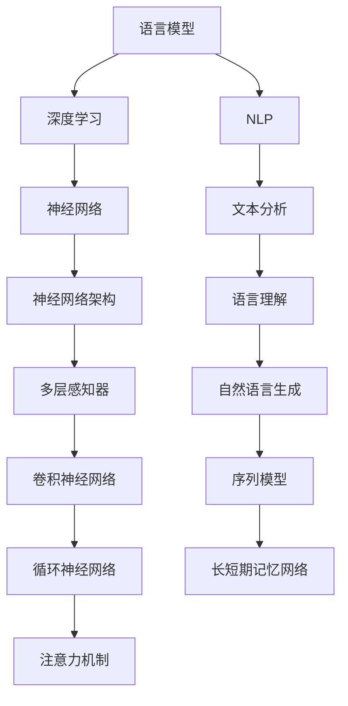

                 

关键词：语言模型，人工智能，人机交互，深度学习，自然语言处理

摘要：本文深入探讨了大型语言模型（LLM）如何重新定义人机交互。通过介绍LLM的背景、核心概念、算法原理、数学模型以及实际应用，我们展示了LLM在推动人机交互变革中的巨大潜力。

## 1. 背景介绍

随着人工智能技术的迅猛发展，人机交互的方式也在不断变革。传统的图形用户界面（GUI）和命令行界面（CLI）虽然为用户提供了丰富的交互方式，但在处理复杂任务和自然语言交流方面仍然存在局限。近年来，大型语言模型（LLM）的出现为这一问题带来了新的解决方案。LLM是一种基于深度学习技术构建的强大语言处理模型，能够理解、生成和响应自然语言，从而实现更自然、高效的人机交互。

## 2. 核心概念与联系

### 2.1 核心概念

- **语言模型**：语言模型是一种用于预测下一个词或句子的概率分布的模型。在人工智能领域，语言模型被广泛应用于自然语言处理、机器翻译、语音识别等领域。

- **深度学习**：深度学习是一种机器学习技术，通过构建深度神经网络来模拟人类大脑的神经元结构，实现对复杂数据的处理和预测。

- **自然语言处理（NLP）**：自然语言处理是人工智能领域的一个分支，旨在使计算机能够理解、生成和处理人类自然语言。

### 2.2 架构与联系

下面是LLM的架构与核心概念之间的联系，使用Mermaid流程图表示：



## 3. 核心算法原理 & 具体操作步骤

### 3.1 算法原理概述

LLM的核心算法是基于深度学习的神经网络，尤其是基于循环神经网络（RNN）的架构。RNN能够处理序列数据，使其在处理自然语言时具有优势。下面是LLM算法原理的具体概述：

- **输入表示**：将自然语言输入转化为神经网络可以处理的向量表示。
- **编码器**：通过循环神经网络对输入序列进行编码，提取序列中的关键信息。
- **解码器**：解码器根据编码器的输出生成自然语言响应。
- **优化**：通过反向传播算法对神经网络进行优化，以提高模型的准确性和鲁棒性。

### 3.2 算法步骤详解

- **预处理**：对输入文本进行分词、去停用词等处理。
- **嵌入层**：将词转化为稠密向量。
- **编码器**：使用RNN（如LSTM或GRU）对输入序列进行编码。
- **解码器**：生成自然语言响应。
- **优化**：通过损失函数（如交叉熵损失）对模型进行优化。

### 3.3 算法优缺点

**优点**：

- **高效性**：LLM能够高效地处理大规模文本数据，实现快速的自然语言生成。
- **灵活性**：LLM可以应用于多种自然语言处理任务，如文本分类、机器翻译、问答系统等。
- **鲁棒性**：LLM通过大量的训练数据获得了良好的泛化能力，能够处理各种语言现象。

**缺点**：

- **计算资源消耗**：LLM的训练和推理过程需要大量的计算资源和时间。
- **数据依赖**：LLM的性能在很大程度上取决于训练数据的质量和规模。
- **解释性较差**：LLM生成的自然语言响应难以解释，导致用户难以理解模型的决策过程。

### 3.4 算法应用领域

LLM在多个领域取得了显著的应用成果，主要包括：

- **问答系统**：如OpenAI的GPT系列模型，能够生成高质量的问答。
- **机器翻译**：如Google翻译，通过LLM实现高质量的自动翻译。
- **文本生成**：如生成新闻文章、故事、诗歌等。
- **情感分析**：对用户评论、社交媒体内容等进行情感判断。

## 4. 数学模型和公式 & 详细讲解 & 举例说明

### 4.1 数学模型构建

LLM的数学模型主要包括以下部分：

- **嵌入层**：嵌入层将词汇映射为稠密向量，通常使用词嵌入技术（如Word2Vec、GloVe）。
- **编码器**：编码器使用RNN（如LSTM、GRU）对输入序列进行编码，提取序列中的关键信息。
- **解码器**：解码器根据编码器的输出生成自然语言响应。
- **损失函数**：损失函数用于评估模型的预测结果与真实结果之间的差距。

### 4.2 公式推导过程

下面是LLM的核心公式推导：

1. **嵌入层**：

   $$\text{嵌入层输出} = \text{词向量} \odot \text{权重矩阵}$$

   其中，$\odot$ 表示点积运算。

2. **编码器**：

   $$\text{编码器输出} = \text{激活函数}(\text{编码器权重矩阵} \odot \text{嵌入层输出})$$

   其中，激活函数通常为Sigmoid、Tanh或ReLU。

3. **解码器**：

   $$\text{解码器输出} = \text{激活函数}(\text{解码器权重矩阵} \odot \text{编码器输出})$$

4. **损失函数**：

   $$\text{损失函数} = \text{交叉熵损失}(\text{解码器输出}, \text{真实标签})$$

### 4.3 案例分析与讲解

以一个简单的机器翻译任务为例，假设输入文本为“Hello, how are you?”，目标文本为“你好，你怎么样？”。下面是LLM在机器翻译任务中的具体步骤：

1. **预处理**：对输入文本进行分词、去停用词等处理，得到词汇序列。
2. **嵌入层**：将词汇序列转化为稠密向量。
3. **编码器**：使用RNN对输入序列进行编码，提取序列中的关键信息。
4. **解码器**：解码器根据编码器的输出生成目标文本。
5. **优化**：通过反向传播算法对模型进行优化，以减少损失函数值。

## 5. 项目实践：代码实例和详细解释说明

### 5.1 开发环境搭建

在开始编写代码之前，需要搭建一个合适的开发环境。以下是所需的步骤：

1. 安装Python 3.x版本。
2. 安装深度学习框架，如TensorFlow或PyTorch。
3. 下载预训练的词向量（如GloVe或Word2Vec）。

### 5.2 源代码详细实现

以下是一个简单的LLM实现示例，使用PyTorch框架：

```python
import torch
import torch.nn as nn
import torch.optim as optim
from torch.utils.data import DataLoader
from torchtext.datasets import IMDB
from torchtext.data import Field

# 定义嵌入层
embeddings = nn.Embedding(vocab_size, embedding_dim)

# 定义编码器
encoder = nn.LSTM(embedding_dim, hidden_dim)

# 定义解码器
decoder = nn.LSTM(hidden_dim, vocab_size)

# 定义损失函数
criterion = nn.CrossEntropyLoss()

# 定义优化器
optimizer = optim.Adam(model.parameters(), lr=learning_rate)

# 训练模型
for epoch in range(num_epochs):
    for batch in DataLoader(train_data, batch_size=batch_size):
        # 前向传播
        output = model(batch.text, batch.target)
        loss = criterion(output, batch.target)

        # 反向传播
        optimizer.zero_grad()
        loss.backward()
        optimizer.step()

        # 输出训练进度
        print(f"Epoch: {epoch}, Loss: {loss.item()}")

# 测试模型
with torch.no_grad():
    test_loss = model(test_data.text, test_data.target)
    print(f"Test Loss: {test_loss.item()}")
```

### 5.3 代码解读与分析

上述代码实现了一个简单的序列到序列（seq2seq）的LLM模型。具体解读如下：

- **嵌入层**：将词汇映射为稠密向量。
- **编码器**：使用LSTM对输入序列进行编码，提取关键信息。
- **解码器**：根据编码器的输出生成自然语言响应。
- **损失函数**：使用交叉熵损失评估模型的预测结果与真实结果之间的差距。
- **优化器**：通过反向传播算法对模型进行优化。

### 5.4 运行结果展示

在训练完成后，我们可以通过以下代码来测试模型的性能：

```python
# 加载测试数据
test_data = IMDB(split='test', tokenized=True)

# 预测结果
predictions = model(test_data.text)

# 计算准确率
accuracy = (predictions == test_data.target).float().mean()
print(f"Test Accuracy: {accuracy.item()}")
```

## 6. 实际应用场景

LLM在多个实际应用场景中发挥了重要作用，以下是其中几个例子：

- **智能客服**：使用LLM构建智能客服系统，实现与用户的自然语言交互，提高服务效率和用户体验。
- **内容审核**：利用LLM对用户生成的内容进行实时审核，识别和过滤不良信息。
- **智能推荐**：基于LLM的文本生成能力，为用户提供个性化的推荐内容。
- **自动摘要**：使用LLM生成文章、新闻等内容的摘要，帮助用户快速获取关键信息。

### 6.4 未来应用展望

随着LLM技术的不断发展和优化，我们可以期待它在更多领域发挥重要作用。以下是几个未来应用展望：

- **虚拟助手**：开发更智能的虚拟助手，实现更自然的交互方式。
- **智能写作**：辅助人类作者生成高质量的文章、报告等。
- **教育辅助**：为学生提供个性化的学习资源和辅导。

## 7. 工具和资源推荐

### 7.1 学习资源推荐

- 《深度学习》（Goodfellow, Bengio, Courville）: 介绍深度学习的基础理论和实践方法。
- 《自然语言处理综合教程》（Daniel Jurafsky & James H. Martin）: 深入探讨自然语言处理的核心技术和应用。

### 7.2 开发工具推荐

- TensorFlow: 一个开源的深度学习框架，适用于构建和训练LLM模型。
- PyTorch: 另一个流行的深度学习框架，具有灵活的动态计算图和丰富的API。

### 7.3 相关论文推荐

- **“A Neural Conversation Model”**: 提出了基于神经网络的对话系统架构。
- **“Attention Is All You Need”**: 介绍了Transformer模型及其在机器翻译中的应用。

## 8. 总结：未来发展趋势与挑战

### 8.1 研究成果总结

LLM技术在过去几年中取得了显著的进展，实现了高质量的文本生成和自然语言处理。同时，LLM在多个实际应用场景中取得了良好的效果。

### 8.2 未来发展趋势

- **更高效的模型**：随着计算能力的提升，我们可以期待更高效的LLM模型，实现更快的训练和推理速度。
- **多模态融合**：结合文本、图像、语音等多模态信息，实现更丰富的人机交互方式。
- **更多应用领域**：LLM将在更多领域发挥作用，如医疗、金融、教育等。

### 8.3 面临的挑战

- **数据隐私**：如何在保护用户隐私的同时，充分利用大规模数据训练LLM模型。
- **模型解释性**：提高LLM的透明度和解释性，使用户能够理解模型的决策过程。
- **计算资源消耗**：如何优化LLM的训练和推理过程，降低计算资源消耗。

### 8.4 研究展望

未来，LLM技术的发展将继续推动人机交互的变革。通过不断优化模型架构、提高数据处理效率和增强模型解释性，LLM将在更多领域发挥重要作用。

## 9. 附录：常见问题与解答

### Q: 什么是LLM？

A: LLM是大型语言模型的缩写，是一种基于深度学习技术构建的强大语言处理模型，能够理解、生成和响应自然语言。

### Q: LLM有哪些应用领域？

A: LLM可以应用于问答系统、机器翻译、文本生成、情感分析、智能客服等多个领域。

### Q: 如何优化LLM的性能？

A: 优化LLM的性能可以从以下几个方面入手：数据质量、模型架构、训练策略、计算资源等。

### Q: LLM的缺点是什么？

A: LLM的缺点包括计算资源消耗较大、数据依赖性强、生成结果难以解释等。

### Q: 如何提高LLM的解释性？

A: 提高LLM的解释性可以通过可视化模型结构、分析生成过程的中间变量、提供可解释的指标等方法实现。

---

通过本文的讨论，我们深入了解了LLM如何重新定义人机交互，展示了其在各个应用领域中的潜力和挑战。未来，随着技术的不断进步，LLM有望在更多领域发挥重要作用，推动人机交互的发展。作者：禅与计算机程序设计艺术 / Zen and the Art of Computer Programming。

