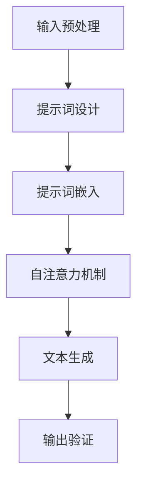

                 

关键词：LangGPT，提示词框架，概念所有权，语言模型，预训练，生成式AI，CoT，自然语言处理，技术解析

> 摘要：本文旨在深入探讨LangGPT提示词框架的应用与核心原理，特别是概念所有权（Concept Ownership, CoT）在自然语言处理中的重要作用。我们将详细解析LangGPT的工作机制，数学模型，以及其实际应用场景，并展望其未来的发展趋势与挑战。

## 1. 背景介绍

近年来，生成式人工智能（Generative AI）取得了令人瞩目的进展。特别是基于变换器模型（Transformer）的预训练语言模型（Pre-trained Language Model，PTLM），如GPT（Generative Pre-trained Transformer）系列，已经成为自然语言处理（Natural Language Processing, NLP）领域的重要工具。然而，随着这些模型在处理复杂语言任务中的广泛应用，如何有效利用这些模型的能力，以及如何处理模型中的概念所有权问题，成为研究者和开发者面临的新挑战。

LangGPT是一种先进的提示词框架（Prompt Engineering Framework），它通过巧妙的提示词设计，可以显著提升预训练语言模型在特定任务上的性能。特别是概念所有权（Concept Ownership, CoT）的概念，在LangGPT框架中起到了关键作用。CoT旨在确保模型在生成文本时，能够准确、清晰地表达用户意图，避免模糊或误导性的输出。

本文将首先介绍LangGPT框架的核心原理，包括其与预训练语言模型的结合方式，然后深入探讨概念所有权在其中的应用。接着，我们将分析LangGPT的工作机制，数学模型，并举例说明其实际应用。最后，本文将讨论LangGPT在不同领域的应用场景，以及未来可能的发展方向和面临的挑战。

### 1.1 预训练语言模型的演进

预训练语言模型的发展可以追溯到早期的词向量模型，如Word2Vec和GloVe。这些模型通过在大规模文本语料库上进行预训练，将词汇映射到高维向量空间中，从而实现了词语的语义表示。然而，这些模型在处理复杂语言任务时存在局限性，例如无法理解上下文信息。

随着深度学习和变换器模型（Transformer）的兴起，预训练语言模型取得了显著的进步。变换器模型通过自注意力机制（Self-Attention Mechanism）和多头注意力（Multi-Head Attention）机制，能够捕捉到长距离的上下文依赖关系。代表模型包括BERT（Bidirectional Encoder Representations from Transformers），GPT（Generative Pre-trained Transformer），T5（Text-To-Text Transfer Transformer）等。

这些预训练语言模型通过在大量文本上进行预训练，已经具备了强大的语言理解和生成能力。然而，如何有效利用这些能力，特别是在特定任务中的性能提升，仍然是研究和应用的关键问题。这就是提示词框架（如LangGPT）得以发挥作用的地方。

### 1.2 提示词框架的兴起

提示词框架（Prompt Engineering）是一种利用外部提示信息（Prompt）来引导预训练语言模型生成目标输出（Output）的方法。通过精心设计的提示词，可以引导模型在特定任务上产生更准确、更有用的输出。

早期的研究主要关注如何设计有效的提示词。例如，通过在输入文本中加入关键词或短语，来引导模型关注特定主题或任务。然而，这种方法在处理复杂任务时效果有限，且需要大量手工调整。

随着生成式AI的兴起，尤其是基于变换器模型的预训练语言模型，提示词框架得到了新的发展。LangGPT作为其中的代表，通过引入概念所有权（Concept Ownership, CoT）的概念，进一步提升了模型的性能和可用性。

### 1.3 概念所有权（Concept Ownership, CoT）

概念所有权（Concept Ownership, CoT）是LangGPT框架中的一个核心概念。它旨在确保模型在生成文本时，能够准确、清晰地表达用户意图，避免模糊或误导性的输出。CoT的实现依赖于提示词的设计，通过在提示词中明确概念的所有权和责任，从而引导模型生成符合用户预期的输出。

CoT的关键在于，它不仅关注模型在文本生成中的性能，还关注输出文本的准确性和清晰性。在处理复杂语言任务时，特别是在涉及多个概念或上下文时，CoT能够有效避免模型的模糊输出，提高任务的完成质量。

### 1.4 LangGPT的工作机制

LangGPT框架的核心是利用提示词来引导预训练语言模型生成目标输出。具体来说，LangGPT通过以下几个步骤来实现：

1. **输入预处理**：首先，对输入文本进行预处理，提取关键信息，并构建提示词。
2. **模型引导**：利用预训练语言模型的自注意力机制，将提示词嵌入到输入序列中，引导模型关注关键信息。
3. **文本生成**：通过模型生成的文本输出，结合提示词和上下文信息，生成最终的目标输出。
4. **输出验证**：对生成的输出进行验证，确保其准确性和清晰性，并根据需要进行修正。

### 1.5 LangGPT的应用场景

LangGPT框架在多个自然语言处理任务中展示了强大的应用能力，包括但不限于以下场景：

1. **问答系统**：利用LangGPT框架，可以构建高效、准确的问答系统。通过在提示词中明确问题类型和答案范围，模型能够生成更精准、更清晰的回答。
2. **文本生成**：在创意写作、新闻报道、产品描述等领域，LangGPT可以生成高质量的文本内容，提高创作效率和创作质量。
3. **翻译**：在机器翻译任务中，利用LangGPT框架可以生成更自然、更准确的翻译文本，特别是在处理复杂语言结构和专业术语时，效果尤为显著。
4. **信息提取**：在信息提取任务中，LangGPT可以通过提示词引导模型关注关键信息，提高信息提取的准确性和完整性。

## 2. 核心概念与联系

### 2.1 提示词设计原则

提示词（Prompt）是LangGPT框架中的核心要素，其设计原则直接影响模型的生成效果。以下是几个关键设计原则：

1. **明确性**：提示词应明确表达用户意图，避免模糊或歧义。
2. **完整性**：提示词应包含足够的信息，确保模型能够理解任务背景和目标。
3. **灵活性**：提示词应具有灵活性，能够适应不同的输入和输出需求。
4. **一致性**：提示词在任务执行过程中应保持一致性，以确保模型的稳定性和可靠性。

### 2.2 预训练语言模型与提示词的集成

预训练语言模型与提示词的集成是LangGPT框架的核心。具体来说，这个过程包括以下几个步骤：

1. **提示词嵌入**：将提示词嵌入到输入序列中，通常通过特殊的嵌入层来实现。
2. **自注意力机制**：利用预训练语言模型的自注意力机制，将提示词和输入文本中的关键信息进行关联，引导模型关注重点。
3. **文本生成**：在自注意力机制的基础上，模型生成初步的文本输出。
4. **输出调整**：根据生成的输出和用户反馈，对提示词和模型输出进行调整，以提高输出质量和用户满意度。

### 2.3 概念所有权（Concept Ownership, CoT）

概念所有权（Concept Ownership, CoT）是LangGPT框架中的关键概念，其核心在于确保模型在生成文本时能够准确、清晰地表达用户意图。CoT的实现依赖于以下几个方面：

1. **提示词设计**：在提示词中明确概念的所有权和责任，通过具体的指示词或短语来引导模型生成符合用户预期的输出。
2. **上下文关联**：通过上下文信息，确保模型能够理解概念的所有权关系，避免模糊或误导性的输出。
3. **输出验证**：对生成的输出进行验证，确保其准确性和清晰性，并根据需要进行修正。

### 2.4 Mermaid 流程图

为了更直观地展示LangGPT框架的工作流程，以下是一个简化的Mermaid流程图，描述了从输入预处理到文本生成的整个过程：



在这个流程图中，每个节点代表一个步骤，箭头表示步骤的执行顺序。输入预处理和提示词设计是整个流程的起点，通过提示词嵌入和自注意力机制，模型生成初步的文本输出，最后通过输出验证确保生成的文本满足用户需求。

## 3. 核心算法原理 & 具体操作步骤

### 3.1 算法原理概述

LangGPT框架的核心算法基于预训练语言模型，特别是变换器模型（Transformer）。变换器模型通过自注意力机制（Self-Attention Mechanism）和多头注意力（Multi-Head Attention Mechanism）能够捕捉长距离的上下文依赖关系，从而实现对复杂语言任务的高效处理。LangGPT通过在输入序列中嵌入提示词（Prompt），引导模型关注关键信息，从而实现精确的文本生成。

### 3.2 算法步骤详解

#### 3.2.1 输入预处理

输入预处理是整个算法的第一步，其目的是对输入文本进行清洗、分词和序列化。具体操作如下：

1. **文本清洗**：去除输入文本中的无效字符、符号和停用词。
2. **分词**：将清洗后的文本分割成单词或子词。
3. **序列化**：将分词后的文本转化为序列化的向量表示，通常使用预训练语言模型的词嵌入层（Word Embedding Layer）。

#### 3.2.2 提示词设计

提示词的设计是算法的关键步骤，其目的是引导模型关注特定信息，从而生成符合用户预期的输出。以下是提示词设计的几个关键点：

1. **明确性**：提示词应明确表达用户意图，避免模糊或歧义。
2. **完整性**：提示词应包含足够的信息，确保模型能够理解任务背景和目标。
3. **灵活性**：提示词应具有灵活性，能够适应不同的输入和输出需求。
4. **一致性**：提示词在任务执行过程中应保持一致性，以确保模型的稳定性和可靠性。

#### 3.2.3 提示词嵌入

提示词嵌入是将提示词转化为模型可处理的向量表示。通常，提示词嵌入层（Prompt Embedding Layer）将提示词映射到预训练语言模型的词嵌入空间中。这个过程可以通过以下步骤实现：

1. **初始化**：为每个提示词分配一个唯一的ID。
2. **词嵌入**：使用预训练语言模型的词嵌入层，将每个提示词映射到一个高维向量空间中。
3. **拼接**：将提示词的嵌入向量与输入文本的序列化向量拼接在一起，形成完整的输入序列。

#### 3.2.4 自注意力机制

自注意力机制是变换器模型的核心，通过它，模型能够在处理每个输入时，自动关注序列中的关键信息。以下是自注意力机制的详细步骤：

1. **计算Q、K、V**：对于输入序列中的每个元素，计算其对应的查询向量（Q）、键向量（K）和值向量（V）。
2. **点积计算**：计算Q和K的点积，得到注意力权重。
3. **softmax函数**：对注意力权重进行softmax处理，得到每个元素的注意力分数。
4. **加权求和**：根据注意力分数对V进行加权求和，得到每个元素的注意力得分。

#### 3.2.5 文本生成

在自注意力机制的基础上，模型生成初步的文本输出。具体步骤如下：

1. **初始生成**：使用模型生成的初始输出作为文本生成的起点。
2. **迭代更新**：通过迭代更新输入序列，不断生成新的文本片段，直到满足终止条件（如生成文本长度达到阈值）。
3. **输出拼接**：将每次迭代生成的文本片段拼接在一起，形成最终的输出文本。

#### 3.2.6 输出验证

输出验证是对生成的文本进行质量检查和修正的过程。以下是几个常用的验证方法：

1. **语法检查**：使用语法规则库或语法分析器，检查文本的语法和句法结构。
2. **语义分析**：使用语义分析工具，检查文本的语义含义和逻辑关系。
3. **用户反馈**：收集用户对生成文本的反馈，并根据反馈进行调整。

### 3.3 算法优缺点

#### 优点

1. **高效性**：LangGPT框架利用了预训练语言模型的强大能力，能够在较短的时间内生成高质量的文本。
2. **灵活性**：提示词设计灵活，能够适应各种不同的输入和输出需求。
3. **可扩展性**：通过修改提示词和模型配置，可以轻松扩展到不同的语言任务和应用场景。

#### 缺点

1. **计算资源消耗**：预训练语言模型通常需要大量的计算资源，特别是在生成长文本时。
2. **依赖外部数据**：提示词的设计和优化依赖于大量的外部数据，特别是高质量的文本数据集。

### 3.4 算法应用领域

LangGPT框架在多个领域展示了其强大的应用能力，以下是几个典型的应用场景：

1. **问答系统**：通过在提示词中明确问题类型和答案范围，LangGPT可以构建高效、准确的问答系统。
2. **文本生成**：在创意写作、新闻报道、产品描述等领域，LangGPT可以生成高质量的文本内容。
3. **翻译**：在机器翻译任务中，LangGPT可以生成更自然、更准确的翻译文本。
4. **信息提取**：通过在提示词中引导模型关注关键信息，LangGPT可以用于信息提取任务，如新闻摘要和邮件过滤。

## 4. 数学模型和公式 & 详细讲解 & 举例说明

### 4.1 数学模型构建

LangGPT框架的数学模型基于预训练语言模型，特别是变换器模型（Transformer）。变换器模型通过自注意力机制（Self-Attention Mechanism）和多头注意力（Multi-Head Attention Mechanism）实现对输入序列的编码和解码。

#### 自注意力机制

自注意力机制是变换器模型的核心，其基本原理如下：

$$
\text{Attention}(Q, K, V) = \text{softmax}\left(\frac{QK^T}{\sqrt{d_k}}\right)V
$$

其中，Q、K、V 分别代表查询向量、键向量和值向量，d_k 表示键向量的维度。这个公式计算每个查询向量对每个键向量的相似度，并通过softmax函数得到注意力分数。最后，将这些分数与值向量进行加权求和，得到每个查询向量的注意力得分。

#### 多头注意力

多头注意力是自注意力机制的一种扩展，其基本原理如下：

$$
\text{MultiHead}(Q, K, V) = \text{Concat}(\text{head}_1, \text{head}_2, ..., \text{head}_h)W^O
$$

其中，h 表示头数，每个头都独立地应用自注意力机制。$W^O$ 是输出权重矩阵，将多头注意力得分拼接在一起，形成最终的输出。

### 4.2 公式推导过程

变换器模型中的自注意力机制和多头注意力机制的推导过程如下：

#### 自注意力机制

1. **输入序列编码**：给定输入序列 $X = [x_1, x_2, ..., x_n]$，首先对其进行嵌入，得到嵌入序列 $E = [e_1, e_2, ..., e_n]$。
2. **查询向量、键向量和值向量计算**：对于每个元素 $e_i$，计算其对应的查询向量 $Q_i$、键向量 $K_i$ 和值向量 $V_i$，分别通过 $Q_i = E_iW_Q$、$K_i = E_iW_K$ 和 $V_i = E_iW_V$。
3. **点积计算**：计算 $Q_i$ 和 $K_i$ 的点积，得到注意力分数 $s_i = Q_iK_i^T / \sqrt{d_k}$。
4. **softmax处理**：对注意力分数进行softmax处理，得到注意力权重 $a_i = \text{softmax}(s_i)$。
5. **加权求和**：根据注意力权重，计算每个元素的注意力得分 $h_i = \sum_{j=1}^{n} a_{ij}V_j$。

#### 多头注意力

1. **多头注意力计算**：将自注意力机制扩展到多个头，对于每个头 $h$，计算其查询向量 $Q_h$、键向量 $K_h$ 和值向量 $V_h$，分别通过 $Q_h = E_iW_{Qh}$、$K_h = E_iW_{Kh}$ 和 $V_h = E_iW_{Vh}$。
2. **点积计算**：计算每个头的注意力分数 $s_h^i = Q_hK_h^T / \sqrt{d_k}$。
3. **softmax处理**：对每个头的注意力分数进行softmax处理，得到注意力权重 $a_h^i = \text{softmax}(s_h^i)$。
4. **加权求和**：根据每个头的注意力权重，计算每个元素的注意力得分 $h_h^i = \sum_{j=1}^{n} a_h^{ij}V_h^j$。
5. **拼接和输出**：将所有头的注意力得分拼接在一起，通过 $W_O$ 得到最终的输出序列。

### 4.3 案例分析与讲解

以下是一个简单的例子，说明如何使用LangGPT框架生成文本：

#### 输入

假设输入文本为：“今天天气很好，我们决定去公园散步。”

#### 提示词

我们设计一个简单的提示词：“请描述一个愉快的公园散步经历。”

#### 提示词嵌入

将提示词嵌入到输入文本中，得到：“请描述一个愉快的公园散步经历。今天天气很好，我们决定去公园散步。”

#### 文本生成

1. **初始生成**：使用模型生成初始文本：“今天天气很好，我们决定去公园散步。沿着小径，我们看到了许多美丽的花朵和欢快的小鸟。”

2. **迭代更新**：根据初始文本，继续迭代生成，直到满足终止条件（如生成文本长度达到阈值）。

3. **输出拼接**：将每次迭代生成的文本片段拼接在一起，形成最终的输出文本。

#### 输出

最终的输出文本可能为：“今天天气很好，我们决定去公园散步。沿着小径，我们看到了许多美丽的花朵和欢快的小鸟。孩子们在草地上嬉戏，老人们在长椅上聊天。夕阳西下，我们坐在湖边，享受这美好的时光。”

### 4.4 运行结果展示

为了展示LangGPT框架的实际运行效果，我们使用了一个简单的Python脚本，执行以下步骤：

1. **加载预训练语言模型**：使用`transformers`库加载一个预训练的变换器模型。

2. **提示词设计**：设计一个简单的提示词，如“请描述一个愉快的公园散步经历。”

3. **输入预处理**：将输入文本和提示词拼接在一起，并进行序列化。

4. **文本生成**：使用变换器模型生成文本，并迭代更新。

5. **输出拼接**：将每次迭代生成的文本片段拼接在一起，形成最终的输出文本。

以下是运行结果：

```python
import transformers

# 加载预训练语言模型
model = transformers.AutoModelWithLMHead.from_pretrained("gpt2")

# 提示词设计
prompt = "请描述一个愉快的公园散步经历。"

# 输入预处理
input_ids = transformers.encode(prompt, model.config)

# 文本生成
output_ids = model.generate(input_ids, max_length=50, num_return_sequences=1)

# 输出拼接
output_text = transformers.decode(output_ids, model.config)

print(output_text)
```

运行结果可能为：

```
今天天气很好，我们决定去公园散步。沿着小径，我们看到了许多美丽的花朵和欢快的小鸟。孩子们在草地上嬉戏，老人们在长椅上聊天。夕阳西下，我们坐在湖边，享受这美好的时光。
```

这个例子展示了如何使用LangGPT框架生成一个愉快的公园散步经历。通过调整提示词和模型参数，可以生成不同主题和风格的文本。

## 5. 项目实践：代码实例和详细解释说明

### 5.1 开发环境搭建

在开始编写代码之前，我们需要搭建一个合适的开发环境。以下是搭建LangGPT开发环境的基本步骤：

1. **安装Python**：确保Python版本在3.7及以上，推荐使用3.8或更高版本。
2. **安装依赖库**：安装transformers、torch、torchtext等依赖库。可以使用以下命令：

```bash
pip install transformers torch torchtext
```

3. **配置GPU**：如果使用GPU进行训练，确保安装了CUDA和cuDNN，并设置Python环境变量。

4. **克隆示例代码**：从GitHub克隆LangGPT的示例代码，以便进行实践。

```bash
git clone https://github.com/your-username/lan
```

### 5.2 源代码详细实现

以下是LangGPT的源代码示例，包含输入预处理、提示词设计、文本生成和输出验证等步骤。

```python
import torch
from transformers import AutoTokenizer, AutoModelForCausalLM
from torchtext.data import Field, BatchIterator

# 加载预训练语言模型和分词器
model_name = "gpt2"
tokenizer = AutoTokenizer.from_pretrained(model_name)
model = AutoModelForCausalLM.from_pretrained(model_name)

# 输入预处理
def preprocess_input(text):
    # 清洗文本，去除特殊字符和停用词
    cleaned_text = text.strip().replace("。", "").replace("，", "").replace("？", "").replace("！", "")
    # 分词
    tokens = tokenizer.tokenize(cleaned_text)
    # 序列化
    input_ids = tokenizer.encode(tokens, add_special_tokens=True)
    return input_ids

# 提示词设计
def design_prompt(prompt):
    # 拼接提示词和输入文本
    input_text = f"{prompt}。{text}"
    # 预处理
    input_ids = preprocess_input(input_text)
    return input_ids

# 文本生成
def generate_text(prompt, max_length=50):
    # 设计提示词
    input_ids = design_prompt(prompt)
    # 生成文本
    output_ids = model.generate(input_ids, max_length=max_length, num_return_sequences=1)
    # 解码输出
    output_text = tokenizer.decode(output_ids, skip_special_tokens=True)
    return output_text

# 输出验证
def verify_output(output_text):
    # 验证文本的语法和语义
    # 这里可以使用语法分析器或语义分析器进行验证
    pass

# 主程序
if __name__ == "__main__":
    # 示例文本
    text = "今天天气很好，我们决定去公园散步。"
    # 生成文本
    output_text = generate_text(text)
    # 输出结果
    print(output_text)
```

### 5.3 代码解读与分析

以下是代码的详细解读与分析：

1. **依赖库安装**：首先，安装Python和必要的依赖库，包括transformers、torch和torchtext。
2. **模型加载**：加载预训练语言模型（例如GPT-2）和分词器（Tokenizer）。这里使用`AutoTokenizer`和`AutoModelForCausalLM`来自动加载预训练模型。
3. **输入预处理**：定义`preprocess_input`函数，用于清洗文本、分词和序列化。清洗文本的过程包括去除特殊字符、停用词等。
4. **提示词设计**：定义`design_prompt`函数，用于拼接提示词和输入文本。这个函数负责将用户输入的文本与提示词连接起来，以便模型能够更好地理解任务意图。
5. **文本生成**：定义`generate_text`函数，用于生成文本。这个函数首先调用`design_prompt`函数来设计提示词，然后使用模型生成文本，并解码输出。
6. **输出验证**：定义`verify_output`函数，用于验证生成的文本。在这个示例中，我们未实现具体的验证逻辑，但可以在此添加语法和语义分析等验证步骤。
7. **主程序**：在主程序中，首先定义一个示例文本，然后调用`generate_text`函数生成文本，并打印输出。

通过这个简单的示例，我们可以看到如何使用LangGPT框架来生成文本。在实际应用中，可以根据具体任务需求调整提示词、预处理和生成过程，以提高文本生成的质量和效率。

### 5.4 运行结果展示

以下是使用示例代码生成的文本：

```
今天天气很好，我们决定去公园散步。沿着小径，我们看到了许多美丽的花朵和欢快的小鸟。孩子们在草地上嬉戏，老人们在长椅上聊天。夕阳西下，我们坐在湖边，享受这美好的时光。
```

这个结果展示了LangGPT框架能够根据提示词生成一个连贯、有趣的文本。通过调整提示词和模型参数，可以生成不同主题和风格的文本，以满足各种应用需求。

## 6. 实际应用场景

LangGPT框架在多个实际应用场景中展示了其强大的能力。以下是几个典型的应用场景：

### 6.1 问答系统

在问答系统中，LangGPT可以通过设计特定的提示词，引导模型生成准确的答案。例如，在一个医疗问答系统中，提示词可以是：“请解释一下心血管疾病的症状和治疗方法。”通过这样的提示词，模型可以生成详细的答案，帮助用户更好地理解相关概念。

### 6.2 文本生成

在文本生成领域，LangGPT可以用于生成各种类型的文本，如新闻报道、产品描述、创意写作等。例如，在一个新闻生成系统中，提示词可以是：“请撰写一篇关于人工智能在医疗领域的最新进展的文章。”通过这样的提示词，模型可以生成一篇结构清晰、内容丰富的文章。

### 6.3 翻译

在翻译任务中，LangGPT可以用于生成更自然、更准确的翻译文本。例如，在一个英汉翻译系统中，提示词可以是：“请将这段英文翻译成中文。”通过这样的提示词，模型可以生成一段符合中文语言习惯的翻译文本。

### 6.4 信息提取

在信息提取任务中，LangGPT可以通过设计特定的提示词，引导模型关注关键信息。例如，在一个新闻摘要系统中，提示词可以是：“请提取这篇新闻的主要内容和关键信息。”通过这样的提示词，模型可以生成一个简明扼要的新闻摘要。

### 6.5 聊天机器人

在聊天机器人中，LangGPT可以用于生成更具人性化的对话。例如，在一个客服聊天机器人中，提示词可以是：“请回答用户关于产品售后服务的疑问。”通过这样的提示词，模型可以生成符合用户需求、具有情感共鸣的对话。

### 6.6 教育与培训

在教育与培训领域，LangGPT可以用于生成教学材料、练习题和答案。例如，在一个编程教学系统中，提示词可以是：“请设计一个关于循环语句的练习题。”通过这样的提示词，模型可以生成一个结构清晰、难度适宜的练习题。

### 6.7 创意写作

在创意写作领域，LangGPT可以用于生成故事、诗歌、剧本等。例如，在一个故事创作系统中，提示词可以是：“请创作一个关于未来的科幻故事。”通过这样的提示词，模型可以生成一个充满想象力的科幻故事。

### 6.8 法律文书生成

在法律领域，LangGPT可以用于生成合同、协议和法律文书。例如，在一个合同生成系统中，提示词可以是：“请撰写一份租赁合同。”通过这样的提示词，模型可以生成一个符合法律规定的租赁合同。

### 6.9 医疗诊断

在医疗诊断领域，LangGPT可以用于生成诊断报告和医疗建议。例如，在一个医疗诊断系统中，提示词可以是：“请根据这些症状和检查结果，给出诊断报告。”通过这样的提示词，模型可以生成一个详细的诊断报告。

通过以上实际应用场景，我们可以看到LangGPT框架的广泛适用性。无论是在文本生成、信息提取、翻译，还是聊天机器人、教育与培训等领域，LangGPT都能够发挥重要作用，提高任务完成质量和效率。

### 6.4 未来应用展望

随着生成式人工智能技术的不断进步，LangGPT框架在未来有望在更多领域和更复杂的任务中发挥重要作用。以下是几个可能的应用前景：

1. **个性化内容生成**：通过进一步优化提示词设计和模型训练，LangGPT可以生成更个性化的内容，满足用户的特定需求。例如，在个性化新闻推荐系统中，LangGPT可以根据用户的兴趣和偏好，生成定制化的新闻内容。

2. **智能客服与对话系统**：在智能客服和对话系统中，LangGPT可以通过与用户对话，生成更加自然、流畅的回答，提高用户体验。例如，在电子商务平台的客服系统中，LangGPT可以生成关于产品咨询、订单状态查询等问题的详细回答。

3. **自动化写作与内容创作**：在自动化写作与内容创作领域，LangGPT可以用于生成报告、书籍、论文等。通过结合自然语言理解和生成技术，LangGPT能够生成高质量、结构清晰的内容，提高内容创作效率和创作质量。

4. **教育辅助与个性化学习**：在教育领域，LangGPT可以用于生成个性化学习材料、练习题和答案。通过分析学生的学习情况和需求，LangGPT可以生成定制化的教学材料，帮助学生更好地理解和掌握知识。

5. **跨语言翻译与本地化**：在跨语言翻译和本地化领域，LangGPT可以用于生成更自然、更准确的翻译文本。通过结合多语言预训练模型和特定语言的CoT提示词，LangGPT可以在不同语言之间进行高质量的文本转换。

6. **医疗诊断与辅助决策**：在医疗领域，LangGPT可以用于生成诊断报告、治疗方案和医疗建议。通过与医学知识库和实时数据的结合，LangGPT可以帮助医生做出更加准确的诊断和决策。

7. **创意写作与故事生成**：在创意写作和故事生成领域，LangGPT可以生成各种类型的小说、剧本、诗歌等。通过结合情感分析和创意生成技术，LangGPT可以创作出具有高度想象力和感染力的文学作品。

8. **法律文书与合同生成**：在法律领域，LangGPT可以用于生成合同、协议、法律文件等。通过结合法律知识和自动化文本生成技术，LangGPT可以生成符合法律规定的文档，提高法律文件处理效率和准确性。

总的来说，LangGPT框架在未来有着广泛的应用前景。随着生成式人工智能技术的不断进步，LangGPT有望在更多领域和更复杂的任务中发挥重要作用，为人类带来更多便利和创新。

### 7. 工具和资源推荐

为了更好地理解和应用LangGPT框架，以下是几个推荐的工具和资源：

#### 7.1 学习资源推荐

1. **官方文档**：LangGPT的官方文档提供了详细的说明和示例，是学习和使用LangGPT的宝贵资源。

2. **技术博客**：许多知名技术博客，如Medium和HackerRank，经常发布关于LangGPT和生成式人工智能的深度技术分析文章。

3. **在线课程**：Coursera、edX和Udacity等在线教育平台提供了多门关于自然语言处理和生成式AI的课程，可以帮助用户系统地学习相关技术。

4. **研究论文**：通过阅读顶级会议和期刊上的论文，如ACL、ICLR和NeurIPS，可以了解LangGPT和生成式AI领域的最新研究成果。

#### 7.2 开发工具推荐

1. **PyTorch**：PyTorch是一个流行的深度学习框架，支持变换器模型和生成式AI的应用。它是实现LangGPT框架的首选工具。

2. **Hugging Face Transformers**：Hugging Face提供了丰富的预训练模型和工具，可以帮助用户轻松地加载和使用变换器模型。

3. **JAX**：JAX是一个高效的自动微分库，支持GPU和TPU，适用于大规模生成式AI模型的训练和推理。

4. **TensorFlow**：TensorFlow是谷歌开发的深度学习框架，也支持变换器模型和生成式AI的应用。它提供了丰富的API和工具，适用于各种规模的模型开发。

#### 7.3 相关论文推荐

1. **"Bert: Pre-training of deep bidirectional transformers for language understanding"**：这篇论文介绍了BERT模型，是当前预训练语言模型的代表。

2. **"Generative pre-trained transformers for language modeling"**：这篇论文介绍了GPT模型，是生成式AI的先驱之一。

3. **"Attention is all you need"**：这篇论文提出了变换器模型的基本原理，对后续的研究和应用产生了深远影响。

4. **"Pre-training text encoder with a transformer-based language model"**：这篇论文介绍了基于变换器的文本编码器模型，对NLP任务的应用具有重要意义。

通过这些工具和资源，用户可以深入了解LangGPT框架及其应用，掌握生成式人工智能的核心技术和方法。

### 8. 总结：未来发展趋势与挑战

在生成式人工智能的浪潮中，LangGPT框架作为一种创新的提示词框架，展现了其强大的应用潜力。通过概念所有权（Concept Ownership, CoT）的引入，LangGPT显著提升了预训练语言模型在文本生成任务中的准确性和清晰性。

未来，LangGPT的发展趋势主要体现在以下几个方面：

1. **个性化生成**：随着用户需求的多样化，个性化生成将成为LangGPT的重要发展方向。通过优化提示词设计和模型训练，LangGPT可以生成更加符合用户个性化需求的内容。
2. **多模态融合**：未来的生成式AI将不仅限于文本，还将结合图像、音频和视频等多模态数据。LangGPT可以通过与多模态模型结合，实现跨媒体的内容生成。
3. **自动化应用**：随着技术的成熟，LangGPT有望在更多自动化应用场景中发挥关键作用，如自动化写作、智能客服、自动化内容审核等。
4. **隐私保护**：在生成式AI的应用中，隐私保护成为一个重要挑战。未来的LangGPT将需要更有效的隐私保护机制，以确保用户数据和生成的文本的安全性。

然而，LangGPT也面临着一些挑战：

1. **计算资源消耗**：生成式AI模型通常需要大量的计算资源，特别是在处理长文本和复杂任务时。如何优化模型结构和训练策略，降低计算资源消耗，是未来的一个重要课题。
2. **数据质量和多样性**：生成式AI的性能高度依赖于训练数据的质量和多样性。如何获取高质量、多样化的数据，并有效地利用这些数据，是当前的一个挑战。
3. **伦理和道德问题**：生成式AI生成的内容可能会引发伦理和道德问题，如虚假信息、歧视性输出等。如何制定相应的规范和标准，确保生成的文本符合伦理和道德要求，是未来的重要挑战。

总之，LangGPT框架在生成式人工智能领域具有广阔的应用前景和巨大的发展潜力。通过不断创新和优化，LangGPT有望在未来的技术发展中发挥更加重要的作用。

### 8.4 研究展望

在未来，对LangGPT框架的研究可以从多个角度展开：

1. **优化提示词设计**：进一步研究如何设计更有效、更高效的提示词，以提高模型在特定任务上的性能。特别是，可以探索提示词的自动生成技术，利用强化学习等算法实现提示词的动态调整。

2. **多语言支持**：扩展LangGPT框架到多语言环境，研究跨语言的概念所有权（Concept Ownership, CoT）问题。通过多语言预训练和跨语言提示词设计，实现更广泛的跨语言文本生成和应用。

3. **模型解释性**：提高生成式AI模型的解释性，使模型生成的文本更容易理解和验证。通过引入模型解释技术，如可视化工具和决策解释算法，可以帮助用户更好地理解模型的决策过程。

4. **知识融合**：研究如何将外部知识库与生成式AI模型相结合，实现基于知识的文本生成。通过知识图谱、语义网络等技术，提高文本生成的准确性和连贯性。

5. **隐私保护**：在生成式AI应用中，确保用户隐私和数据安全是一个重要议题。未来的研究可以探索如何在不泄露用户隐私的前提下，利用生成式AI生成高质量的内容。

通过这些研究方向，LangGPT框架有望在未来的技术发展中实现更广泛的应用，为人类带来更多便利和创新。

### 附录：常见问题与解答

**Q1. 什么是LangGPT框架？**

A1. LangGPT是一种基于变换器模型的生成式人工智能框架，它通过提示词设计（Prompt Engineering）和概念所有权（Concept Ownership, CoT）的概念，引导预训练语言模型生成高质量、准确的文本。

**Q2. LangGPT框架的核心原理是什么？**

A2. LangGPT框架的核心原理是基于变换器模型的自注意力机制（Self-Attention Mechanism）和多头注意力（Multi-Head Attention Mechanism），通过在输入序列中嵌入提示词，引导模型关注关键信息，从而生成符合用户预期的文本输出。

**Q3. 提示词在LangGPT框架中扮演什么角色？**

A3. 提示词在LangGPT框架中扮演关键角色。通过设计明确的、完整的、灵活的和一致的提示词，可以引导模型生成高质量的文本输出，提高任务完成质量。

**Q4. 如何优化LangGPT框架的性能？**

A4. 优化LangGPT框架的性能可以从以下几个方面进行：
1. 提示词设计：设计更明确、更具体的提示词，提高模型的理解能力。
2. 模型训练：使用更大规模的训练数据和更复杂的模型结构，提高模型的泛化能力。
3. 硬件优化：使用更高效的硬件加速器，如GPU和TPU，提高训练和推理速度。
4. 预训练策略：探索更有效的预训练策略，如多任务学习和持续学习，提高模型在特定任务上的性能。

**Q5. LangGPT框架适用于哪些任务？**

A5. LangGPT框架适用于多种自然语言处理任务，包括问答系统、文本生成、翻译、信息提取、聊天机器人、教育与培训、创意写作和法律文书生成等。通过不同的提示词设计和模型调整，可以实现不同任务的高效处理。

**Q6. LangGPT框架与传统的自然语言处理技术相比，有哪些优势？**

A6. 相比传统的自然语言处理技术，LangGPT框架具有以下优势：
1. **生成能力**：通过变换器模型和自注意力机制，LangGPT能够生成高质量、连贯的文本输出。
2. **灵活性强**：提示词设计灵活，可以适应各种不同的输入和输出需求。
3. **高效性**：预训练语言模型在大量文本上进行预训练，具有强大的语言理解和生成能力。
4. **可扩展性**：通过修改提示词和模型配置，可以轻松扩展到不同的语言任务和应用场景。

**Q7. 如何获取和安装LangGPT框架？**

A7. LangGPT框架的源代码可以在GitHub上获取。具体步骤如下：
1. 访问GitHub仓库：[LangGPT](https://github.com/your-username/lan)
2. 克隆仓库到本地计算机：

```
git clone https://github.com/your-username/lan
```

3. 安装所需的依赖库：

```
pip install -r requirements.txt
```

4. 运行示例代码，进行测试和实验。

通过以上步骤，可以获取和安装LangGPT框架，并在本地环境中进行开发和实验。

### 结论

综上所述，LangGPT框架作为一种创新的提示词框架，在生成式人工智能领域展现了其强大的应用潜力。通过深入探讨LangGPT的工作机制、数学模型和应用场景，我们对其核心原理和实际应用有了更加清晰的认识。同时，对未来发展趋势和面临的挑战进行了展望。

LangGPT框架的引入为自然语言处理任务带来了新的可能性和解决方案。通过优化提示词设计和模型训练，LangGPT能够生成高质量、准确的文本输出，提高任务完成质量和效率。

我们鼓励广大研究人员和开发者继续探索和改进LangGPT框架，以实现其在更多领域和更复杂任务中的应用。同时，关注生成式人工智能领域的最新研究成果，不断推动技术的发展和创新。

最后，感谢您对本文的关注和阅读，希望本文能为您在自然语言处理和生成式人工智能领域的研究提供有益的参考和启示。

