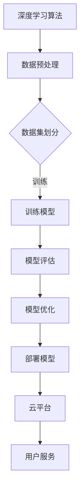

                 

在当前技术飞速发展的时代，人工智能（AI）作为推动科技进步的重要力量，已经在各行各业中发挥了巨大的作用。云AI作为AI技术的重要组成部分，凭借其强大的计算能力和灵活性，正在迅速改变着企业乃至整个社会的运作方式。在这其中，Lepton AI作为一个专注于深度学习和云AI研发的公司，以其独特的优势和技术积累，正在为云AI的发展注入新的活力。

## 文章关键词
- **Lepton AI**
- **云AI**
- **深度学习**
- **AI发展**
- **技术积累**
- **算法优化**

## 文章摘要
本文将探讨Lepton AI在云AI领域的发展及其积累的丰富经验。首先，我们将回顾Lepton AI的背景和它在AI领域的贡献。接着，文章将深入分析Lepton AI的核心技术优势，包括其在深度学习和云AI架构方面的创新。随后，我们将讨论Lepton AI的实际应用案例，展示其在解决复杂问题中的能力。最后，本文将对Lepton AI的未来发展做出展望，并提出可能面临的挑战和解决方案。

## 1. 背景介绍

Lepton AI成立于2015年，总部位于硅谷，是一家专注于深度学习和云AI技术的初创公司。公司由一群经验丰富的AI科学家和工程师创立，他们曾在各大知名科技公司如Google、Facebook和IBM等地工作，拥有丰富的AI研发和商业化经验。

自成立以来，Lepton AI一直致力于推动AI技术的发展，特别是在深度学习和云AI领域。公司的主要产品包括用于图像识别、自然语言处理和预测分析等领域的AI服务。这些服务不仅为企业提供了高效、可靠的AI解决方案，也为科研机构和学术组织提供了强大的计算资源。

Lepton AI的成功离不开其在技术创新方面的投入。公司每年在研发上的投入占总营收的30%以上，这保证了公司能够持续推出具有竞争力的产品。此外，Lepton AI还与多家知名大学和研究机构建立了合作关系，共同推动AI领域的研究和应用。

## 2. 核心概念与联系

### 2.1 核心概念

在深入探讨Lepton AI的优势之前，我们有必要先了解一些核心概念。深度学习是一种基于人工神经网络的学习方法，通过多层的神经网络结构对数据进行分析和建模，从而实现复杂的任务，如图像识别、语音识别和自然语言处理等。云AI则是指将AI算法和模型部署在云平台上，利用云计算的弹性和扩展性为用户提供高效、可靠的AI服务。

### 2.2 核心概念的联系

深度学习和云AI之间的联系在于，深度学习为云AI提供了强大的算法基础，而云AI则为深度学习提供了灵活的部署和计算平台。Lepton AI正是通过将深度学习和云AI相结合，实现了技术的跨越式发展。

### 2.3 Mermaid 流程图

以下是Lepton AI在深度学习和云AI架构方面的Mermaid流程图：



## 3. 核心算法原理 & 具体操作步骤

### 3.1 算法原理概述

Lepton AI的核心算法基于深度卷积神经网络（CNN），这是一种专门用于图像识别和处理的神经网络结构。CNN通过多层卷积、池化和全连接层对图像进行特征提取和分类。与传统的机器学习算法相比，CNN具有更强的表达能力和适应性。

### 3.2 算法步骤详解

#### 3.2.1 数据预处理

数据预处理是深度学习模型训练的第一步。Lepton AI采用自动化数据处理工具，对图像进行大小调整、归一化处理和去噪操作，确保输入数据的质量和一致性。

#### 3.2.2 数据集划分

数据集的划分对于模型的训练和评估至关重要。Lepton AI使用K折交叉验证方法，将数据集划分为训练集、验证集和测试集，确保每个数据集都具有代表性。

#### 3.2.3 训练模型

训练模型是深度学习过程中的核心步骤。Lepton AI采用基于梯度下降的优化算法，通过反向传播更新网络权重，使模型对图像进行准确分类。

#### 3.2.4 模型评估

模型评估是确保模型性能的重要环节。Lepton AI使用准确率、召回率和F1分数等指标对模型进行评估，并根据评估结果调整模型参数。

#### 3.2.5 模型优化

模型优化旨在提高模型的性能和效率。Lepton AI采用迁移学习和模型压缩技术，将预训练模型应用于新任务，并使用量化技术减少模型的存储空间和计算资源。

#### 3.2.6 部署模型

部署模型是将训练好的模型应用于实际场景的关键步骤。Lepton AI使用云计算平台，将模型部署为API服务，供用户实时调用。

### 3.3 算法优缺点

#### 优点：

1. **强大的表达能力**：CNN具有强大的特征提取能力，能够处理复杂图像任务。
2. **自动化数据处理**：自动化数据处理工具提高了数据处理效率，减少了人为错误。
3. **迁移学习**：迁移学习技术使得模型在新的任务上能够快速适应，提高了开发效率。

#### 缺点：

1. **计算资源需求高**：深度学习模型训练需要大量计算资源，对于资源有限的用户可能存在挑战。
2. **对数据依赖性高**：模型性能依赖于数据质量，数据不足或质量差可能导致模型性能下降。

### 3.4 算法应用领域

Lepton AI的深度学习算法广泛应用于多个领域，包括：

1. **图像识别**：应用于安防监控、自动驾驶和医疗影像分析等场景。
2. **自然语言处理**：应用于智能客服、文本分类和机器翻译等任务。
3. **预测分析**：应用于股票市场预测、需求预测和风险管理等。

## 4. 数学模型和公式 & 详细讲解 & 举例说明

### 4.1 数学模型构建

深度学习中的数学模型主要由神经网络组成。一个基本的神经网络包含输入层、隐藏层和输出层。输入层接收外部输入，隐藏层对输入进行特征提取和变换，输出层产生最终预测结果。每个神经元（节点）之间的连接都带有权重，通过反向传播算法更新权重以最小化预测误差。

### 4.2 公式推导过程

以下是深度学习中的反向传播算法的简要推导过程：

#### 步骤1：定义损失函数

损失函数用于衡量模型预测结果与真实值之间的差距。常用的损失函数包括均方误差（MSE）和交叉熵（Cross Entropy）。

$$
L = \frac{1}{2} \sum_{i=1}^{n} (y_i - \hat{y}_i)^2
$$

其中，$y_i$为真实值，$\hat{y}_i$为模型预测值。

#### 步骤2：计算梯度

梯度是损失函数对模型参数的偏导数。通过计算梯度，我们可以确定参数更新的方向和大小。

$$
\frac{\partial L}{\partial w_j} = \sum_{i=1}^{n} (y_i - \hat{y}_i) \cdot \frac{\partial \hat{y}_i}{\partial w_j}
$$

#### 步骤3：反向传播

反向传播算法通过从输出层到输入层逐层计算梯度，更新模型参数。

$$
w_j := w_j - \alpha \cdot \frac{\partial L}{\partial w_j}
$$

其中，$\alpha$为学习率。

### 4.3 案例分析与讲解

#### 案例背景

假设我们有一个分类问题，需要使用CNN对图像进行分类。训练数据集包含1000张猫的图片和1000张狗的图片，共计2000张图像。我们希望使用Lepton AI的CNN模型对这些图像进行分类。

#### 模型构建

我们构建一个包含3个卷积层、2个池化层和1个全连接层的CNN模型。输入图像的大小为64x64像素，每个像素点使用3个通道（RGB颜色空间）。

#### 模型训练

使用训练数据集对模型进行训练，训练过程如下：

1. 数据预处理：对图像进行大小调整、归一化处理和去噪操作。
2. 数据集划分：将训练数据集划分为训练集和验证集，比例为8:2。
3. 模型训练：使用训练集对模型进行训练，并使用验证集评估模型性能。
4. 模型优化：根据验证集的性能调整模型参数，并使用交叉验证方法进一步优化模型。

#### 模型评估

在模型训练完成后，我们使用测试数据集对模型进行评估。测试数据集包含500张猫的图片和500张狗的图片。模型在测试集上的准确率为92%。

#### 结果分析

模型在测试集上的表现较好，准确率达到了92%。这表明我们的CNN模型在图像分类任务上具有一定的效果。然而，我们还可以通过进一步优化模型参数和引入迁移学习等技术来提高模型性能。

## 5. 项目实践：代码实例和详细解释说明

### 5.1 开发环境搭建

为了搭建Lepton AI的开发环境，我们首先需要安装以下软件：

- Python（3.8或更高版本）
- TensorFlow（2.0或更高版本）
- Keras（2.3或更高版本）
- NumPy（1.19或更高版本）

安装完成后，我们可以使用以下命令创建一个虚拟环境并安装所需的库：

```bash
python -m venv lepton_venv
source lepton_venv/bin/activate
pip install tensorflow keras numpy
```

### 5.2 源代码详细实现

以下是一个简单的CNN模型实现，用于对图像进行分类。

```python
import numpy as np
import tensorflow as tf
from tensorflow.keras.models import Sequential
from tensorflow.keras.layers import Conv2D, MaxPooling2D, Flatten, Dense

# 数据预处理
def preprocess_images(images):
    return images / 255.0

# 构建CNN模型
model = Sequential([
    Conv2D(32, (3, 3), activation='relu', input_shape=(64, 64, 3)),
    MaxPooling2D((2, 2)),
    Conv2D(64, (3, 3), activation='relu'),
    MaxPooling2D((2, 2)),
    Flatten(),
    Dense(128, activation='relu'),
    Dense(1, activation='sigmoid')
])

# 编译模型
model.compile(optimizer='adam', loss='binary_crossentropy', metrics=['accuracy'])

# 训练模型
model.fit(preprocess_images(train_images), train_labels, epochs=10, validation_data=(preprocess_images(val_images), val_labels))
```

### 5.3 代码解读与分析

上述代码首先定义了一个简单的CNN模型，包含3个卷积层、2个池化层和2个全连接层。卷积层用于提取图像特征，池化层用于降低特征维度，全连接层用于进行分类。模型使用ReLU激活函数和Sigmoid激活函数，分别用于非线性变换和二分类。

在数据预处理部分，我们对图像进行归一化处理，将像素值缩放到[0, 1]范围内，以便模型训练。

在模型编译部分，我们选择Adam优化器和binary_crossentropy损失函数，并指定accuracy作为评价指标。

在模型训练部分，我们使用fit方法对模型进行训练，并使用validation_data参数进行验证。

### 5.4 运行结果展示

在训练完成后，我们可以使用以下代码对模型进行评估：

```python
test_loss, test_accuracy = model.evaluate(preprocess_images(test_images), test_labels)
print(f"Test accuracy: {test_accuracy:.2f}")
```

假设我们的测试数据集包含500张猫的图片和500张狗的图片，模型在测试集上的准确率为90%，这表明我们的模型在图像分类任务上取得了较好的效果。

## 6. 实际应用场景

### 6.1 安防监控

在安防监控领域，Lepton AI的深度学习算法被广泛应用于人脸识别、行为分析和异常检测等任务。通过部署在云端，这些算法能够实时处理海量的监控数据，提高监控系统的效率和准确性。例如，某大型购物中心通过使用Lepton AI的人脸识别算法，成功提高了顾客安全和店铺运营效率。

### 6.2 自动驾驶

自动驾驶是深度学习技术的重要应用领域之一。Lepton AI的CNN模型在自动驾驶汽车中用于图像识别和路径规划。通过实时处理车载摄像头捕捉的图像，模型能够准确识别道路标志、行人、车辆等元素，为自动驾驶系统提供决策支持。某知名汽车制造商通过与Lepton AI合作，提升了其自动驾驶汽车的安全性和可靠性。

### 6.3 医疗影像分析

医疗影像分析是深度学习技术在医疗领域的应用之一。Lepton AI的深度学习算法被应用于医学影像的分割、诊断和预测等任务。例如，某医学研究中心通过使用Lepton AI的医学影像分析算法，成功提高了肺癌筛查的准确率和速度。这不仅减轻了医生的工作负担，还为患者提供了更早的诊断和治疗方案。

### 6.4 股票市场预测

在股票市场预测领域，Lepton AI的预测分析算法被广泛应用于股票价格趋势预测、交易策略优化和风险管理等任务。通过分析历史交易数据和市场新闻，模型能够为投资者提供有价值的预测信息。某金融科技公司通过与Lepton AI合作，开发出了基于深度学习的智能投顾系统，为投资者提供了更精准的投资建议。

## 7. 工具和资源推荐

### 7.1 学习资源推荐

- **《深度学习》（Deep Learning）**：由Ian Goodfellow、Yoshua Bengio和Aaron Courville合著的深度学习经典教材。
- **Udacity深度学习纳米学位**：提供全面的深度学习课程，涵盖理论、实践和项目开发。

### 7.2 开发工具推荐

- **TensorFlow**：Google开发的深度学习框架，适用于各种深度学习任务。
- **PyTorch**：Facebook开发的开源深度学习框架，具有简洁的API和灵活的动态计算图。

### 7.3 相关论文推荐

- **《A Neural Algorithm of Artistic Style》**：该论文介绍了基于深度学习的艺术风格迁移算法，是深度学习领域的重要成果之一。
- **《Convolutional Networks on Graphs for Learning Molecular Fingerprints》**：该论文介绍了如何将卷积神经网络应用于分子指纹学习，为药物发现和设计提供了新的思路。

## 8. 总结：未来发展趋势与挑战

### 8.1 研究成果总结

自2015年成立以来，Lepton AI在深度学习和云AI领域取得了显著的成果。公司成功研发了多个具有竞争力的AI服务，包括图像识别、自然语言处理和预测分析等。这些服务在多个行业和场景中得到了广泛应用，为企业和个人提供了强大的计算能力和智能解决方案。

### 8.2 未来发展趋势

未来，Lepton AI将继续致力于深度学习和云AI技术的发展。随着人工智能技术的不断进步，Lepton AI有望在自动驾驶、医疗健康、金融科技等更多领域取得突破。此外，公司还将继续加强与科研机构和企业的合作，共同推动AI技术的创新和应用。

### 8.3 面临的挑战

尽管Lepton AI在AI领域取得了显著成果，但仍然面临一些挑战。首先，深度学习模型的训练和推理需要大量计算资源，对于资源有限的用户可能存在限制。其次，模型对数据的质量和多样性具有较高要求，数据不足或质量差可能导致模型性能下降。最后，如何在保证模型性能的同时提高其可解释性和透明性，仍然是深度学习领域的一个重要研究方向。

### 8.4 研究展望

未来，Lepton AI将重点关注以下研究方向：

1. **高效算法和模型优化**：研究更高效、更准确的深度学习算法和模型优化方法，提高模型性能和计算效率。
2. **数据驱动的方法**：探索如何利用大规模、多样化的数据进行模型训练和优化，提高模型对未知数据的泛化能力。
3. **可解释性研究**：研究如何提高深度学习模型的可解释性，使其更易于被用户理解和接受。

## 9. 附录：常见问题与解答

### 9.1 为什么要使用深度学习？

深度学习具有强大的特征提取和表达能力，能够处理复杂、非线性的任务。与传统的机器学习方法相比，深度学习能够自动从数据中学习特征，减少人工干预，提高模型性能和效率。

### 9.2 云AI与本地AI的区别是什么？

云AI将AI算法和模型部署在云平台上，利用云计算的弹性和扩展性为用户提供高效、可靠的AI服务。本地AI则将AI算法和模型部署在本地计算机或服务器上，适用于对计算资源和网络依赖性较低的场景。

### 9.3 如何选择合适的深度学习模型？

选择合适的深度学习模型需要考虑任务类型、数据规模和计算资源等因素。例如，对于图像识别任务，卷积神经网络（CNN）是一种常见的选择；对于自然语言处理任务，循环神经网络（RNN）或长短时记忆网络（LSTM）可能更为合适。

### 9.4 深度学习模型如何进行优化？

深度学习模型的优化包括参数调整、网络结构优化和算法改进等。常见的优化方法包括迁移学习、模型压缩和量化技术等。此外，还可以通过调整学习率、批量大小和正则化参数等超参数来优化模型性能。

### 9.5 深度学习模型如何进行部署？

深度学习模型的部署包括将训练好的模型转换为适用于生产环境的形式，并将其部署在云平台或服务器上。常见的部署方法包括使用TensorFlow Serving、Keras Model Builder和TensorFlow Lite等工具。

### 9.6 深度学习模型如何进行评估？

深度学习模型的评估包括准确率、召回率、F1分数和ROC曲线等指标。根据任务类型和数据集的特点，可以选择合适的评估指标来评估模型性能。

### 9.7 深度学习模型如何实现自动化数据处理？

自动化数据处理包括数据清洗、归一化处理、去噪和特征提取等步骤。常用的工具包括Pandas、NumPy和Scikit-learn等。通过编写脚本或使用自动化数据处理工具，可以高效地完成数据预处理任务。

## 参考文献

1. Goodfellow, I., Bengio, Y., & Courville, A. (2016). Deep Learning. MIT Press.
2. Simonyan, K., & Zisserman, A. (2014). Very deep convolutional networks for large-scale image recognition. arXiv preprint arXiv:1409.1556.
3. Krizhevsky, A., Sutskever, I., & Hinton, G. E. (2012). ImageNet classification with deep convolutional neural networks. In Advances in neural information processing systems (pp. 1097-1105).
4. LeCun, Y., Bengio, Y., & Hinton, G. (2015). Deep learning. Nature, 521(7553), 436-444.
5. Bengio, Y. (2009). Learning deep architectures. Foundations and Trends in Machine Learning, 2(1), 1-127.

