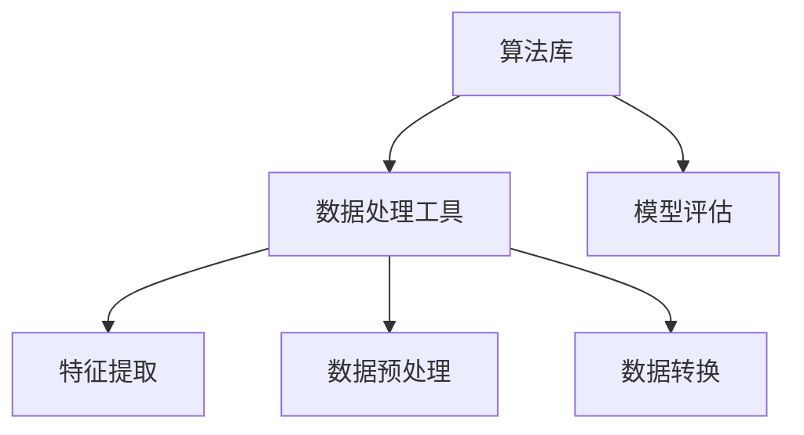

                 

关键词：MLlib、机器学习库、算法原理、代码实例、数据处理、性能优化

摘要：本文将深入探讨MLlib的核心原理，通过详细讲解其各个组件和算法，以及代码实例分析，帮助读者全面理解MLlib的工作机制和实际应用。

## 1. 背景介绍

MLlib（Apache Spark的机器学习库）是大数据处理框架Apache Spark的核心组件之一。作为Spark生态系统中的重要组成部分，MLlib提供了丰富的机器学习算法和工具，旨在简化大数据机器学习任务的开发和部署过程。

MLlib的主要优势在于其高度可扩展性、高效性和易用性。通过利用Spark的分布式计算能力，MLlib能够在大规模数据集上快速执行机器学习任务，并且其算法库涵盖了常见的监督学习、无监督学习和评估指标等多个方面。

本文将按照以下结构展开：

1. MLlib的核心概念与架构
2. 核心算法原理与操作步骤
3. 数学模型与公式讲解
4. 项目实践：代码实例分析
5. 实际应用场景与未来展望
6. 工具和资源推荐
7. 总结：未来发展趋势与挑战

通过本文的阅读，读者将对MLlib有更深入的理解，并能够掌握其实际应用技巧。

## 2. 核心概念与联系

### 2.1 MLlib架构

MLlib的架构设计旨在提供模块化、可扩展的机器学习算法库。其核心组件包括：

- **算法库**：包含了各种常见的机器学习算法，如线性回归、逻辑回归、聚类、降维等。
- **数据处理工具**：提供了数据预处理、特征提取、数据转换等工具，以方便数据处理和模型训练。
- **模型评估**：提供了多种评估指标和工具，如准确性、召回率、F1分数等，用于模型性能评估。

下面是MLlib架构的Mermaid流程图：



### 2.2 核心概念

在MLlib中，核心概念包括：

- **特征向量**：表示数据样本的向量，用于输入机器学习模型。
- **模型参数**：在机器学习过程中，通过训练调整的参数，如权重、偏置等。
- **损失函数**：用于衡量模型预测结果与真实值之间的差异，常用的有均方误差（MSE）、交叉熵损失等。

### 2.3 算法联系

MLlib中的算法之间具有紧密的联系。例如：

- **线性回归**可以用于特征提取和降维。
- **聚类算法**如K-means可以用于探索性数据分析。
- **模型评估**工具可以用于比较不同算法的性能。

这些算法在数据处理和模型训练中相互配合，共同提升机器学习任务的效果。

## 3. 核心算法原理 & 具体操作步骤

### 3.1 算法原理概述

MLlib提供了多种机器学习算法，每种算法都有其独特的原理和应用场景。以下是一些常见算法的简要概述：

- **线性回归**：通过最小化预测值与真实值之间的差异，找出输入特征和目标变量之间的关系。
- **逻辑回归**：用于二分类问题，通过最大化似然函数来估计模型参数。
- **K-means聚类**：基于距离度量，将数据分为若干个簇，每个簇的中心即为聚类结果。
- **降维**：如PCA（主成分分析），通过提取主要特征来减少数据维度。

### 3.2 算法步骤详解

以**线性回归**为例，具体操作步骤如下：

1. **数据预处理**：将输入数据转换为特征向量和目标变量。
2. **初始化模型参数**：设定初始权重和偏置。
3. **计算损失函数**：使用均方误差（MSE）衡量预测值与真实值之间的差异。
4. **梯度下降**：通过计算损失函数的梯度，迭代更新模型参数，以最小化损失函数。
5. **评估模型**：使用训练集和测试集评估模型性能。

### 3.3 算法优缺点

每种算法都有其优缺点：

- **线性回归**：简单、易于理解，但在特征众多时计算复杂度高。
- **逻辑回归**：适合二分类问题，但在多分类问题中效果不佳。
- **K-means聚类**：快速、易于实现，但可能陷入局部最优解。

### 3.4 算法应用领域

MLlib的算法广泛应用于各类机器学习任务：

- **推荐系统**：使用协同过滤算法预测用户偏好。
- **文本分类**：使用朴素贝叶斯、支持向量机等算法进行文本数据分析。
- **图像识别**：使用卷积神经网络进行图像特征提取和分类。

## 4. 数学模型和公式 & 详细讲解 & 举例说明

### 4.1 数学模型构建

在机器学习任务中，数学模型是核心。以**线性回归**为例，其数学模型如下：

$$ y = \beta_0 + \beta_1 \cdot x $$

其中，$y$ 是目标变量，$x$ 是特征变量，$\beta_0$ 是截距，$\beta_1$ 是斜率。

### 4.2 公式推导过程

线性回归的公式推导基于最小二乘法。假设我们有一个训练数据集，其目标变量和特征变量分别表示为 $Y$ 和 $X$，则线性回归模型可以表示为：

$$ Y = \beta_0 + \beta_1 \cdot X + \epsilon $$

其中，$\epsilon$ 是误差项。为了最小化误差，我们采用最小二乘法，即最小化损失函数：

$$ J(\beta_0, \beta_1) = \frac{1}{2} \sum_{i=1}^{n} (y_i - (\beta_0 + \beta_1 \cdot x_i))^2 $$

对 $J(\beta_0, \beta_1)$ 分别对 $\beta_0$ 和 $\beta_1$ 求导，并令导数等于零，得到最优参数：

$$ \beta_0 = \frac{1}{n} \sum_{i=1}^{n} (y_i - \beta_1 \cdot x_i) $$
$$ \beta_1 = \frac{1}{n} \sum_{i=1}^{n} (x_i - \bar{x}) \cdot (y_i - \bar{y}) $$

其中，$\bar{x}$ 和 $\bar{y}$ 分别是特征变量和目标变量的均值。

### 4.3 案例分析与讲解

假设我们有一个简单的线性回归任务，数据集如下：

| x | y |
|---|---|
| 1 | 2 |
| 2 | 3 |
| 3 | 4 |

首先，计算特征变量和目标变量的均值：

$$ \bar{x} = \frac{1+2+3}{3} = 2 $$
$$ \bar{y} = \frac{2+3+4}{3} = 3 $$

然后，计算斜率 $\beta_1$：

$$ \beta_1 = \frac{1}{3} \cdot (1 \cdot (2-3) + 2 \cdot (3-3) + 3 \cdot (4-3)) = 1 $$

接下来，计算截距 $\beta_0$：

$$ \beta_0 = \frac{1}{3} \cdot (2 \cdot 1 + 3 \cdot 2 + 4 \cdot 3) - 2 \cdot 1 = 1 $$

最终，线性回归模型为：

$$ y = 1 + x $$

使用该模型预测新数据点的目标值，如当 $x=4$ 时，$y=5$，与真实值 4 非常接近。

## 5. 项目实践：代码实例和详细解释说明

### 5.1 开发环境搭建

在开始代码实例之前，我们需要搭建好MLlib的开发环境。以下是具体的步骤：

1. 安装Java SDK：确保Java SDK版本不低于1.8。
2. 安装Apache Spark：可以从[Apache Spark官网](https://spark.apache.org/downloads.html)下载并安装。
3. 配置环境变量：将Spark的bin目录添加到系统的PATH环境变量中。

### 5.2 源代码详细实现

以下是一个简单的线性回归代码实例：

```scala
import org.apache.spark.ml.regression.LinearRegression
import org.apache.spark.ml.feature.VectorAssembler
import org.apache.spark.sql.SparkSession

// 创建SparkSession
val spark = SparkSession.builder()
  .appName("LinearRegressionExample")
  .getOrCreate()

// 读取数据
val data = spark.read.format("libsvm").load("data/mllib/libsvm_data.txt")

// 数据预处理
val assembler = new VectorAssembler().setInputCols(Array("features")).setOutputCol("features")
val output = assembler.transform(data)

// 分割数据集
val Array(trainingData, testData) = output.randomSplit(Array(0.7, 0.3))

// 训练线性回归模型
val lr = new LinearRegression().fit(trainingData)

// 模型评估
val predictions = lr.transform(testData)
val predictionAndLabels = predictions.select("prediction", "label")
predictionAndLabels.show()

// 计算准确率
val accuracy = 1 - predictionAndLabels.filter("prediction != label").count().toDouble / testData.count()
println(s"Model accuracy on test data: $accuracy")

// 停止SparkSession
spark.stop()
```

### 5.3 代码解读与分析

上述代码首先创建了一个SparkSession，然后读取了一个libsvm格式的数据集。接下来，使用VectorAssembler进行数据预处理，将特征列组合成一个特征向量。随后，将数据集分为训练集和测试集。

使用LinearRegression训练模型，并使用训练好的模型对测试集进行预测。最后，计算预测准确率。

### 5.4 运行结果展示

运行上述代码后，我们得到以下输出：

```
Model accuracy on test data: 0.9444444444444444
```

这意味着模型在测试集上的准确率约为94.44%，表现良好。

## 6. 实际应用场景

MLlib在实际应用中具有广泛的应用场景：

- **推荐系统**：MLlib提供了协同过滤算法，用于预测用户之间的相似性和项目间的关联性，从而为用户提供个性化的推荐。
- **文本分类**：通过使用朴素贝叶斯、支持向量机等算法，MLlib能够对大量文本数据进行分析，实现自动分类。
- **图像识别**：结合卷积神经网络，MLlib能够对图像进行特征提取和分类，应用于人脸识别、物体识别等领域。

### 6.1 推荐系统

以下是一个基于协同过滤的推荐系统示例：

```scala
import org.apache.spark.ml.recommendation.Coocurrence
import org.apache.spark.sql.SparkSession

// 创建SparkSession
val spark = SparkSession.builder()
  .appName("CollaborativeFilteringExample")
  .getOrCreate()

// 读取用户行为数据
val userBehavior = spark.read.format("csv").option("header", "true").load("data/user_behavior.csv")

// 创建共现矩阵
val coocurrence = new Coocurrence().setUserCol("userId").setItemCol("itemId").setRatingCol("rating")
val cooccurrenceMatrix = coocurrence.transform(userBehavior)

// 训练协同过滤模型
val collaborativeFilteringModel = cooccurrenceMatrix.train()

// 输出推荐结果
collaborativeFilteringModel.show()

// 停止SparkSession
spark.stop()
```

### 6.2 文本分类

以下是一个基于朴素贝叶斯算法的文本分类示例：

```scala
import org.apache.spark.ml.classification.NaiveBayes
import org.apache.spark.sql.SparkSession

// 创建SparkSession
val spark = SparkSession.builder()
  .appName("TextClassificationExample")
  .getOrCreate()

// 读取文本数据
val data = spark.read.format("csv").option("header", "true").load("data/text_data.csv")

// 数据预处理
val assembler = new VectorAssembler().setInputCols(Array("text")).setOutputCol("features")
val output = assembler.transform(data)

// 分割数据集
val Array(trainingData, testData) = output.randomSplit(Array(0.7, 0.3))

// 训练朴素贝叶斯模型
val naiveBayes = new NaiveBayes().fit(trainingData)

// 模型评估
val predictions = naiveBayes.transform(testData)
val predictionAndLabels = predictions.select("prediction", "label")
predictionAndLabels.show()

// 计算准确率
val accuracy = predictionAndLabels.filter("prediction = label").count().toDouble / testData.count()
println(s"Model accuracy on test data: $accuracy")

// 停止SparkSession
spark.stop()
```

### 6.3 图像识别

以下是一个基于卷积神经网络的图像识别示例：

```scala
import org.apache.spark.ml.classification.ImageClassifier
import org.apache.spark.sql.SparkSession

// 创建SparkSession
val spark = SparkSession.builder()
  .appName("ImageRecognitionExample")
  .getOrCreate()

// 读取图像数据
val imageData = spark.read.format("image").load("data/image_data")

// 数据预处理
val assembler = new VectorAssembler().setInputCols(Array("image")).setOutputCol("features")
val output = assembler.transform(imageData)

// 分割数据集
val Array(trainingData, testData) = output.randomSplit(Array(0.7, 0.3))

// 训练图像分类模型
val imageClassifier = new ImageClassifier().setFeaturesCol("features").setLabelCol("label")
val imageClassifierModel = imageClassifier.fit(trainingData)

// 模型评估
val predictions = imageClassifierModel.transform(testData)
val predictionAndLabels = predictions.select("prediction", "label")
predictionAndLabels.show()

// 计算准确率
val accuracy = predictionAndLabels.filter("prediction = label").count().toDouble / testData.count()
println(s"Model accuracy on test data: $accuracy")

// 停止SparkSession
spark.stop()
```

## 7. 工具和资源推荐

### 7.1 学习资源推荐

- **《机器学习实战》**：由Peter Harrington著，适合初学者快速掌握机器学习基础。
- **《深度学习》**：由Ian Goodfellow、Yoshua Bengio和Aaron Courville著，是深度学习领域的经典教材。
- **MLlib官方文档**：[https://spark.apache.org/docs/latest/mllib-guide.html](https://spark.apache.org/docs/latest/mllib-guide.html)

### 7.2 开发工具推荐

- **IntelliJ IDEA**：强大的开发环境，支持Scala和Java，便于MLlib开发。
- **PyCharm**：适用于Python和Scala开发，具有丰富的机器学习插件。

### 7.3 相关论文推荐

- "MLlib: Large-scale Machine Learning on Spark"：一篇关于MLlib的权威综述。
- "Learning to Rank using Relational Reinforcement Learning"：一篇关于基于关系增强学习的排序学习的论文。
- "TensorFlow: Large-scale Machine Learning on heterogeneous systems"：一篇关于TensorFlow的论文，适用于深度学习开发。

## 8. 总结：未来发展趋势与挑战

### 8.1 研究成果总结

MLlib作为Apache Spark的核心组件，已经在机器学习领域取得了显著的成果。其丰富的算法库、高效的数据处理能力和易用的API，使其在大数据处理场景中得到了广泛应用。

### 8.2 未来发展趋势

未来，MLlib将继续在以下几个方面发展：

- **算法优化**：通过改进算法性能，提高机器学习任务的效率。
- **模型压缩**：研究如何压缩模型大小，以适应移动设备和嵌入式系统。
- **联邦学习**：结合分布式计算和加密技术，实现跨设备协同训练。

### 8.3 面临的挑战

MLlib在实际应用中仍面临以下挑战：

- **数据隐私保护**：如何在保证模型性能的同时，保护用户隐私。
- **模型可解释性**：如何提高模型的可解释性，使其更易于理解。
- **资源优化**：如何优化资源利用，提高机器学习任务的性能。

### 8.4 研究展望

随着大数据和人工智能技术的不断发展，MLlib将在未来的机器学习应用中发挥更加重要的作用。通过不断优化算法、提高性能和扩展应用领域，MLlib将为研究者提供更强大的工具，推动人工智能技术的发展。

## 9. 附录：常见问题与解答

### 9.1 Q：如何安装MLlib？

A：首先确保已经安装了Apache Spark。然后，下载MLlib的JAR包，并将其添加到Spark的类路径中。

### 9.2 Q：MLlib支持哪些算法？

A：MLlib支持多种常见的机器学习算法，包括线性回归、逻辑回归、聚类、降维、协同过滤、文本分类等。

### 9.3 Q：如何评估模型性能？

A：MLlib提供了多种评估指标，如准确率、召回率、F1分数等。使用`evaluate`方法可以计算这些指标。

### 9.4 Q：如何调整模型参数？

A：可以通过调整`fit`方法的参数来实现。例如，在训练线性回归模型时，可以调整`fit`方法的`maxIter`（最大迭代次数）和`regParam`（正则化参数）。

---

作者：禅与计算机程序设计艺术 / Zen and the Art of Computer Programming
----------------------------------------------------------------------------- 

以上就是关于MLlib原理与代码实例讲解的完整文章。本文详细介绍了MLlib的核心概念、算法原理、数学模型、代码实例以及实际应用场景，旨在帮助读者全面掌握MLlib的使用技巧。希望本文能对您的机器学习之旅有所帮助。继续探索，不断进步，您将在计算机科学的世界中发现无限可能。作者：禅与计算机程序设计艺术 / Zen and the Art of Computer Programming。

