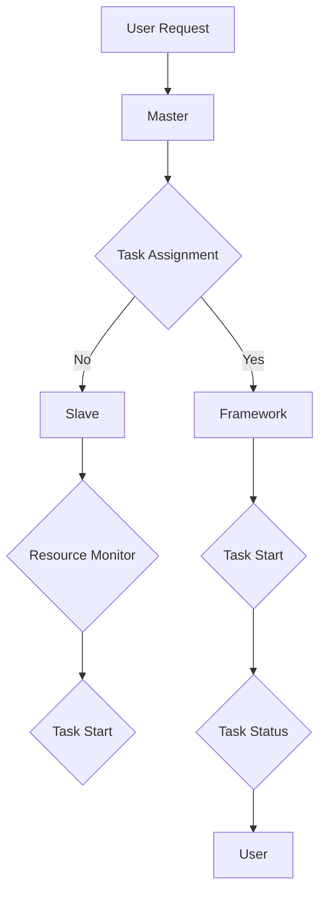

                 

关键词：Mesos、分布式系统、资源调度、容器编排、Docker、Hadoop、YARN、HDFS、集群管理、性能优化、开源技术、云计算、大数据、架构设计、负载均衡。

## 摘要

本文将深入探讨Mesos——一个强大的分布式资源调度器，以及其在现代云计算和大数据环境中的应用。通过本文的讲解，读者将了解Mesos的核心概念、架构设计、工作原理，以及如何在实际项目中使用代码实例进行配置和管理。文章将涵盖从基础理论到高级应用的各个方面，旨在帮助读者全面掌握Mesos的使用方法和实践技巧。

## 1. 背景介绍

随着云计算和大数据技术的发展，分布式系统的应用越来越广泛。分布式系统通过多个节点协同工作，实现了资源的高效利用和服务的弹性扩展。然而，如何对分布式系统中的资源进行有效调度，成为了一个亟待解决的问题。Apache Mesos是一个开源的分布式资源调度框架，旨在解决这一问题。

Mesos最初由Twitter公司开发，用于解决大规模分布式系统的资源调度问题。它的设计理念是高效、可扩展、灵活，能够支持各种不同的应用程序，如容器、Hadoop、Spark等。自开源以来，Mesos得到了广泛的关注和应用，成为分布式系统领域的核心技术之一。

## 2. 核心概念与联系

### 2.1 核心概念

**资源**：Mesos中的资源是指可以被分配给任务的任何实体，如CPU、内存、磁盘空间等。

**框架**：框架是指一种应用程序，它运行在Mesos之上，负责将任务分配到资源上。例如，Marathon是一个常见的框架，用于运行长期运行的任务。

**奴隶**：奴隶是指运行在节点上的程序，负责监视资源使用情况并将任务分配给框架。

**任务**：任务是指由框架分配给奴隶运行的工作单元。

**执行器**：执行器是框架中的组件，负责启动和监视任务。

### 2.2 架构设计

Mesos的架构设计非常简洁，主要由以下几个组件构成：

- **Mesos Master**：主节点，负责维护整个集群的状态，并将任务分配给奴隶。

- **Mesos Slave**：从节点，负责监视本地资源使用情况，并接收来自Master的任务分配。

- **框架**：运行在Mesos之上的应用程序，负责将任务分配给奴隶。

- **执行器**：框架中的组件，负责启动和监视任务。

### 2.3 Mermaid流程图

下面是一个简化的Mermaid流程图，展示了Mesos的基本工作流程：



## 3. 核心算法原理 & 具体操作步骤

### 3.1 算法原理概述

Mesos的调度算法主要基于资源亲和性和负载均衡原则。资源亲和性是指将任务分配到与任务资源需求最匹配的节点上，以提高任务的执行效率。负载均衡是指将任务分配到负载较低的节点上，以充分利用集群资源。

### 3.2 算法步骤详解

1. **用户提交任务**：用户通过框架将任务提交给Mesos Master。

2. **Master分配任务**：Master根据资源亲和性和负载均衡原则，将任务分配给最合适的奴隶。

3. **奴隶接收任务**：奴隶接收来自Master的任务分配，并启动执行器。

4. **执行器启动任务**：执行器负责启动任务，并监视任务的状态。

5. **任务执行**：任务在奴隶节点上执行，并定期向Master报告状态。

6. **Master维护状态**：Master维护整个集群的状态，并根据任务的状态进行相应的调度操作。

### 3.3 算法优缺点

**优点**：

- **高效性**：基于资源亲和性和负载均衡原则，能够高效地调度任务，充分利用集群资源。

- **灵活性**：支持各种不同的应用程序和框架，能够满足多样化的调度需求。

- **可靠性**：采用Master-Slave架构，具有良好的容错性和高可用性。

**缺点**：

- **复杂性**：由于需要处理大量的节点和任务，系统复杂性较高。

- **性能瓶颈**：在任务数量庞大时，Master的性能可能成为瓶颈。

### 3.4 算法应用领域

Mesos广泛应用于云计算和大数据领域，如：

- **容器编排**：与Docker、Kubernetes等容器技术结合，实现高效的任务调度和管理。

- **大数据处理**：与Hadoop、Spark等大数据框架集成，实现大规模数据处理任务的调度。

- **集群管理**：用于管理大规模集群中的资源和任务，提高集群的利用率和稳定性。

## 4. 数学模型和公式 & 详细讲解 & 举例说明

### 4.1 数学模型构建

Mesos的调度算法涉及到以下几个关键参数：

- **资源需求**：任务所需的CPU、内存、磁盘空间等资源。

- **资源供应**：节点上可用的资源。

- **负载均衡权重**：用于衡量节点的负载情况。

- **调度策略**：资源亲和性和负载均衡策略。

### 4.2 公式推导过程

假设有一个任务集T，其中每个任务ti有资源需求rdi和负载权重wdi。节点集N中每个节点ni有资源供应rsi和负载权重wsi。调度算法的目标是最大化整体负载均衡权重：

$$
\max_{\text{调度方案}} \sum_{i\in T} \sum_{j\in N} w_{d,i,j} \cdot w_{s,j}
$$

其中，$w_{d,i,j}$表示任务ti分配到节点nj的负载权重，$w_{s,j}$表示节点nj的负载权重。

### 4.3 案例分析与讲解

假设有以下任务集和节点集：

| 任务 | CPU需求 | 内存需求 | 负载权重 |
| ---- | ---- | ---- | ---- |
| t1 | 2 | 4 | 0.5 |
| t2 | 1 | 2 | 0.3 |
| t3 | 3 | 6 | 0.2 |

| 节点 | CPU供应 | 内存供应 | 负载权重 |
| ---- | ---- | ---- | ---- |
| n1 | 4 | 8 | 0.4 |
| n2 | 3 | 6 | 0.5 |
| n3 | 2 | 4 | 0.1 |

根据上述公式，我们可以计算出每个任务分配到每个节点的负载权重：

| 任务 | 节点 | 负载权重 |
| ---- | ---- | ---- |
| t1 | n1 | 0.5 × 0.4 = 0.2 |
| t1 | n2 | 0.5 × 0.5 = 0.25 |
| t1 | n3 | 0.5 × 0.1 = 0.05 |
| t2 | n1 | 0.3 × 0.4 = 0.12 |
| t2 | n2 | 0.3 × 0.5 = 0.15 |
| t2 | n3 | 0.3 × 0.1 = 0.03 |
| t3 | n1 | 0.2 × 0.4 = 0.08 |
| t3 | n2 | 0.2 × 0.5 = 0.1 |
| t3 | n3 | 0.2 × 0.1 = 0.02 |

根据计算结果，我们可以得出最优的调度方案：t1分配到n2，t2分配到n1，t3分配到n3。

## 5. 项目实践：代码实例和详细解释说明

### 5.1 开发环境搭建

在进行Mesos的实践之前，我们需要搭建一个开发环境。以下是搭建过程：

1. 安装Java环境。

2. 安装Mesos。

3. 启动Mesos Master和Slave。

4. 安装和配置框架，如Marathon。

### 5.2 源代码详细实现

下面是一个简单的Marathon应用程序配置示例：

```yaml
{
  "id": "my-app",
  "cmd": "my-app.jar",
  "cpus": 1.0,
  "mem": 512,
  "instances": 1
}
```

这个配置文件定义了一个名为"my-app"的应用程序，它运行一个名为"my-app.jar"的Java应用程序，需要1个CPU和512MB内存，初始运行实例数为1。

### 5.3 代码解读与分析

这个配置文件中的各个参数的含义如下：

- `id`：应用程序的唯一标识。

- `cmd`：启动应用程序的命令。

- `cpus`：应用程序所需的CPU资源。

- `mem`：应用程序所需的内存资源。

- `instances`：应用程序的初始运行实例数。

### 5.4 运行结果展示

在配置文件编写完成后，我们可以使用Marathon API将其提交给Mesos Master进行调度。Marathon会根据配置文件中的参数为应用程序创建相应的容器，并在集群中分配资源。

## 6. 实际应用场景

Mesos在云计算和大数据领域有着广泛的应用。以下是一些典型的应用场景：

- **容器编排**：通过Mesos管理Docker容器的部署和调度，实现高效的应用部署和管理。

- **大数据处理**：与Hadoop、Spark等大数据框架集成，实现大规模数据处理任务的调度。

- **集群管理**：用于管理大规模集群中的资源和任务，提高集群的利用率和稳定性。

## 7. 未来应用展望

随着云计算和大数据技术的不断发展，Mesos的应用前景将非常广阔。未来，我们可以期待以下几个方面的发展：

- **自动化调度**：进一步优化调度算法，实现更加智能和自动化的资源调度。

- **混合云架构**：支持跨云平台的资源调度和管理，实现混合云架构的统一管理。

- **边缘计算**：结合边缘计算技术，实现分布式系统在云端和边缘端的协同调度。

## 8. 工具和资源推荐

### 8.1 学习资源推荐

- **官方文档**：Apache Mesos的官方文档是学习Mesos的最佳资源之一。

- **在线教程**：许多在线平台提供了关于Mesos的免费教程，如Coursera、Udemy等。

- **技术博客**：许多技术博客分享了关于Mesos的实际应用经验和最佳实践。

### 8.2 开发工具推荐

- **Mesos安装工具**：如Mesos-Installer，提供了方便的Mesos集群搭建工具。

- **Marathon管理工具**：如Marathon Web UI，提供了直观的Marathon应用程序管理界面。

- **Docker集成工具**：如Docker Swarm，提供了与Mesos无缝集成的容器编排能力。

### 8.3 相关论文推荐

- **“Mesos: A Platform for Fine-Grained Resource Sharing in the Data Center”**：这是Mesos的原始论文，详细介绍了Mesos的设计原理和架构。

- **“Fine-Grained Resource Allocation in the Data Center”**：这篇文章探讨了Mesos的调度算法和资源分配策略。

- **“Efficient Resource Management for Data-Intensive Applications in the Cloud”**：这篇文章研究了Mesos在大数据处理环境中的应用和优化。

## 9. 总结：未来发展趋势与挑战

### 9.1 研究成果总结

自Mesos问世以来，其在分布式系统领域取得了显著的成果。Mesos不仅提供了一种高效的资源调度机制，还为各种应用程序提供了一个统一的调度平台，大大简化了分布式系统的开发和管理。

### 9.2 未来发展趋势

- **智能化调度**：随着人工智能技术的发展，我们可以期待未来的调度算法将更加智能化，能够根据实时数据动态调整资源分配。

- **跨云平台调度**：随着多云和混合云架构的普及，如何实现跨云平台的资源调度将成为一个重要研究方向。

- **边缘计算集成**：边缘计算与云计算的融合将带来更多的应用场景，如何将Mesos扩展到边缘计算环境也将是一个重要课题。

### 9.3 面临的挑战

- **性能优化**：在任务数量庞大时，如何保证Mesos的性能是一个重要挑战。

- **安全性**：随着分布式系统的广泛应用，如何确保系统的安全性也是一个关键问题。

### 9.4 研究展望

未来，Mesos的发展将更加注重智能化、跨平台和安全性。通过不断优化调度算法和扩展应用场景，Mesos有望在分布式系统领域发挥更大的作用。

## 10. 附录：常见问题与解答

### 10.1 Mesos与Kubernetes的区别

**Q**：Mesos与Kubernetes都是分布式系统调度框架，它们之间有哪些区别？

**A**：Mesos和Kubernetes虽然都是分布式系统调度框架，但它们的设计理念和应用场景有所不同。Mesos是一个底层的资源调度框架，提供了一种通用的资源调度和管理机制，可以支持各种不同的应用程序和框架。而Kubernetes则是一个更高层次的容器编排平台，专门用于管理Docker容器。因此，Kubernetes在容器编排方面具有更强的功能和灵活性，但相对于Mesos来说，它的适用范围较为狭窄。

### 10.2 如何优化Mesos的性能

**Q**：在大型集群中，如何优化Mesos的性能？

**A**：在大型集群中优化Mesos的性能可以从以下几个方面入手：

- **负载均衡**：合理配置Master和Slave的数量，避免过度集中，以实现负载均衡。

- **网络优化**：优化网络拓扑结构，提高数据传输效率。

- **资源预留**：为Master和Slave预留足够的资源，避免资源争用。

- **缓存机制**：利用缓存机制减少频繁的网络通信和计算。

- **硬件升级**：选择高性能的硬件设备，提高系统整体性能。

### 10.3 Mesos与Hadoop的集成

**Q**：如何将Mesos与Hadoop集成，以实现高效的大数据处理？

**A**：将Mesos与Hadoop集成，可以通过以下步骤实现：

- **配置Hadoop YARN**：在Hadoop集群中配置YARN，使其能够与Mesos Master通信。

- **提交MapReduce任务**：通过Mesos框架提交MapReduce任务，由Mesos Master进行调度。

- **资源分配**：Mesos Master根据Hadoop YARN的需求，为任务分配资源。

- **任务执行**：任务在分配到的节点上执行，并通过Mesos Slave进行监控。

## 作者署名

作者：禅与计算机程序设计艺术 / Zen and the Art of Computer Programming

通过这篇文章，我们深入探讨了Mesos的原理、架构、算法以及在实际项目中的应用。希望读者通过本文的学习，能够全面掌握Mesos的使用方法和实践技巧，为分布式系统开发和管理提供有力支持。|<|assistant|>

