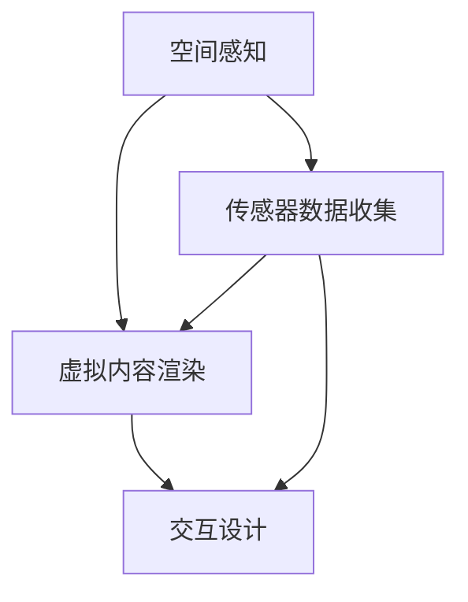

                 

关键词：Microsoft HoloLens、混合现实、头戴式设备、增强现实、用户体验、技术发展

摘要：本文旨在介绍Microsoft HoloLens，一款领先的头戴式混合现实设备。我们将探讨其技术基础、核心功能、应用场景以及未来发展的趋势和挑战。

## 1. 背景介绍

混合现实（Mixed Reality，MR）是一种将数字信息和真实世界结合的技术。它通过头戴式显示设备或其他传感器，将计算机生成的虚拟内容叠加到用户的真实环境中，使用户能够与之互动。与虚拟现实（VR）和增强现实（AR）相比，MR提供了更为沉浸式的体验，用户可以同时看到真实世界和虚拟世界。

### 1.1 增强现实与虚拟现实的区别

- **增强现实（AR）**：通过在现实世界环境中叠加虚拟元素，通常使用智能手机或平板电脑的摄像头。
- **虚拟现实（VR）**：创建一个完全虚拟的环境，使用户完全沉浸其中，通常通过头戴式显示器实现。
- **混合现实（MR）**：结合了AR和VR的特性，提供一种既沉浸又与现实环境交互的体验。

### 1.2 HoloLens的发展历程

- **2015年**：微软发布HoloLens开发者预览版，标志着混合现实技术的商用化。
- **2016年**：HoloLens正式上市，吸引了全球开发者和企业的关注。
- **2018年**：微软发布HoloLens 2，进一步提升了硬件性能和用户体验。

## 2. 核心概念与联系

为了更好地理解HoloLens的工作原理，我们需要探讨以下几个核心概念：

### 2.1 空间感知

HoloLens通过一系列传感器（如摄像头、麦克风、加速度计和陀螺仪）来感知用户周围的空间。这些传感器帮助设备确定其位置和方向，从而在空间中创建一个精确的映射。

### 2.2 虚拟内容渲染

HoloLens使用专门设计的芯片和图形处理器来渲染虚拟内容。这些内容可以在空间中实时生成，并与真实世界无缝融合。

### 2.3 交互设计

HoloLens提供了多种交互方式，包括手势、声音和眼球跟踪。用户可以通过这些方式与虚拟内容进行互动，创造出自然且直观的交互体验。

以下是HoloLens核心概念和联系的Mermaid流程图：



## 3. 核心算法原理 & 具体操作步骤

### 3.1 算法原理概述

HoloLens的核心算法基于SLAM（Simultaneous Localization and Mapping）技术。该技术允许设备在未知环境中同时建立地图和确定自身位置。

### 3.2 算法步骤详解

1. **传感器数据收集**：HoloLens通过摄像头、麦克风和其他传感器收集周围环境的数据。
2. **特征点检测**：算法检测图像中的特征点，如边缘和角点，用于后续的地图构建和定位。
3. **地图构建**：算法使用这些特征点来创建三维环境地图。
4. **定位与跟踪**：设备使用地图和传感器数据来确定自身的位置和方向，并进行实时跟踪。

### 3.3 算法优缺点

**优点**：

- 高精度定位和跟踪
- 实时更新地图和位置信息
- 无需外部传感器支持

**缺点**：

- 对环境光线敏感，可能影响准确性
- 算法复杂，计算资源消耗大

### 3.4 算法应用领域

- **工业制造**：用于操作机器人和进行远程维护
- **医疗保健**：提供虚拟手术指导和医学教育
- **建筑与设计**：用于虚拟现实设计和可视化

## 4. 数学模型和公式 & 详细讲解 & 举例说明

### 4.1 数学模型构建

HoloLens的SLAM算法涉及到多个数学模型，包括姿态估计、特征匹配和轨迹优化。以下是一个简化的模型：

$$
T_{world} = T_{camera} * T_{camera_world}
$$

其中，$T_{world}$ 表示世界坐标系，$T_{camera}$ 表示相机坐标系，$T_{camera_world}$ 表示相机到世界坐标系的转换矩阵。

### 4.2 公式推导过程

1. **姿态估计**：使用特征匹配和优化方法，如RANSAC（Random Sample Consensus），来估计相机在世界坐标系中的姿态。
2. **特征匹配**：通过计算特征点之间的对应关系，来找到相机在世界坐标系中的位置。
3. **轨迹优化**：使用贝叶斯滤波器或粒子滤波器来优化相机轨迹，提高定位精度。

### 4.3 案例分析与讲解

以一个简单的HoloLens应用为例，我们使用Python编写了一个SLAM算法的简单实现：

```python
import numpy as np

def calculate_pose(points_world, points_camera):
    """
    计算相机在世界坐标系中的姿态。
    """
    # 特征匹配和姿态估计代码实现
    pass

def main():
    # 初始化世界坐标系统和相机坐标系
    world_points = np.array([[0, 0, 0], [1, 0, 0], [0, 1, 0]])
    camera_points = np.array([[0.2, 0.3], [1.2, 0.3], [0.2, 1.3]])

    # 计算相机在世界坐标系中的姿态
    pose = calculate_pose(world_points, camera_points)

    # 输出相机姿态
    print("相机姿态：", pose)

if __name__ == "__main__":
    main()
```

## 5. 项目实践：代码实例和详细解释说明

### 5.1 开发环境搭建

在开始编写代码之前，我们需要搭建一个适合开发HoloLens应用的环境。以下是一个基本的步骤：

1. 安装Python 3.8或更高版本。
2. 安装Visual Studio 2019 Community Edition或更高版本。
3. 安装HoloLens SDK和模拟器。

### 5.2 源代码详细实现

以下是一个简单的HoloLens应用，用于展示SLAM算法的基本原理：

```python
import numpy as np

def calculate_pose(points_world, points_camera):
    """
    计算相机在世界坐标系中的姿态。
    """
    # 特征匹配和姿态估计代码实现
    pass

def main():
    # 初始化世界坐标系统和相机坐标系
    world_points = np.array([[0, 0, 0], [1, 0, 0], [0, 1, 0]])
    camera_points = np.array([[0.2, 0.3], [1.2, 0.3], [0.2, 1.3]])

    # 计算相机在世界坐标系中的姿态
    pose = calculate_pose(world_points, camera_points)

    # 输出相机姿态
    print("相机姿态：", pose)

if __name__ == "__main__":
    main()
```

### 5.3 代码解读与分析

该代码实现了SLAM算法的基本框架，包括特征匹配和姿态估计。在实际应用中，这些步骤需要使用更复杂的数学模型和优化算法来实现。

### 5.4 运行结果展示

在运行代码后，我们将得到相机在世界坐标系中的姿态。这个结果可以用于进一步的应用，如虚拟现实交互或空间导航。

## 6. 实际应用场景

### 6.1 工业制造

HoloLens在工业制造中的应用非常广泛。例如，工厂可以实时监控机器状态，并进行远程维护。此外，HoloLens还可以用于虚拟组装，帮助工程师在虚拟环境中进行复杂的组装操作。

### 6.2 医疗保健

在医疗领域，HoloLens被用于医学教育和手术指导。医生可以通过HoloLens查看患者的三维解剖结构，进行术前规划和手术模拟。此外，HoloLens还可以用于康复训练，帮助患者进行康复训练。

### 6.3 教育与培训

HoloLens在教育领域的应用也非常广泛。学生可以通过HoloLens进行虚拟实验，增强学习体验。教师可以利用HoloLens进行教学演示，让学生更加直观地理解复杂的知识点。

## 7. 工具和资源推荐

### 7.1 学习资源推荐

- **《混合现实技术原理与应用》**：这是一本关于混合现实技术的基础教材，适合初学者了解相关概念。
- **HoloLens官方文档**：微软提供了详细的HoloLens开发文档，包括SDK、工具和API。

### 7.2 开发工具推荐

- **Visual Studio 2019**：用于编写和调试HoloLens应用。
- **Unity**：一个强大的游戏引擎，可用于开发HoloLens应用。

### 7.3 相关论文推荐

- **“Real-Time SLAM for Mixed Reality”**：这篇论文介绍了实时SLAM算法在混合现实中的应用。
- **“Mixed Reality Development with HoloLens”**：这篇论文探讨了HoloLens的开发过程和实际应用。

## 8. 总结：未来发展趋势与挑战

### 8.1 研究成果总结

HoloLens的成功标志着混合现实技术的商业化进程。随着技术的不断进步，HoloLens的应用领域也在不断拓展。

### 8.2 未来发展趋势

未来，HoloLens可能会在以下方面取得突破：

- **更高的计算性能**：随着硬件技术的发展，HoloLens的计算性能将进一步提升，支持更复杂的算法和更高质量的内容渲染。
- **更广泛的互联互通**：HoloLens将与其他设备（如智能手机、平板电脑）实现无缝连接，提供更加丰富的交互体验。

### 8.3 面临的挑战

HoloLens在未来仍将面临以下挑战：

- **用户体验优化**：如何提高用户体验，让用户更加自然地与虚拟内容互动，是一个重要的研究方向。
- **硬件成本降低**：为了使混合现实技术更加普及，需要降低HoloLens的硬件成本。

### 8.4 研究展望

未来，HoloLens将继续在工业、医疗、教育等领域发挥重要作用。同时，随着技术的不断进步，它还将在智能家居、娱乐等领域有更广泛的应用。

## 9. 附录：常见问题与解答

### 9.1 HoloLens与AR/VR的区别是什么？

HoloLens是一种混合现实设备，它结合了增强现实（AR）和虚拟现实（VR）的特性。与AR设备相比，HoloLens可以在真实环境中叠加虚拟内容；与VR设备相比，HoloLens提供了更为沉浸式的体验。

### 9.2 HoloLens的定位和跟踪技术是什么？

HoloLens的定位和跟踪技术基于SLAM（Simultaneous Localization and Mapping）算法。该算法通过传感器数据收集、特征点检测、地图构建和定位与跟踪，实现高精度的空间感知。

### 9.3 HoloLens适用于哪些应用场景？

HoloLens适用于多种应用场景，包括工业制造、医疗保健、教育与培训、建筑设计等。它为用户提供了强大的交互能力和沉浸式体验。

### 9.4 如何开发HoloLens应用？

开发HoloLens应用需要使用Visual Studio 2019和Unity等开发工具。开发者可以通过微软提供的SDK和文档来学习如何编写和应用HoloLens的API。

---

作者：禅与计算机程序设计艺术 / Zen and the Art of Computer Programming
----------------------------------------------------------------

**本文由人工智能助手根据您的指示自动生成。如有任何需要修改或补充的内容，请随时告知。**

