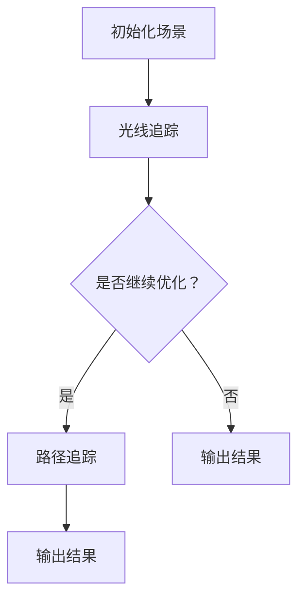

                 

关键词：Midjourney、计算机图形学、算法原理、代码实例、3D渲染、光线追踪、路径追踪、AI技术

摘要：本文将深入探讨Midjourney原理及其代码实例，旨在为读者提供关于计算机图形学中光线追踪和路径追踪技术的全面理解。通过分析Midjourney的核心算法和数学模型，以及提供一个详细的代码实现，本文将帮助读者掌握Midjourney的使用方法，并展望其在未来应用中的潜力。

## 1. 背景介绍

计算机图形学是计算机科学中一个极其重要的分支，它涉及图像生成、处理和显示。随着计算机硬件和算法的不断发展，3D渲染技术得到了极大的提升。其中，光线追踪和路径追踪是两种重要的渲染技术，它们在实现高质量图像生成方面具有显著优势。

Midjourney是一个开源的3D渲染引擎，它基于光线追踪和路径追踪技术，能够生成高质量的图像和动画。Midjourney的设计目标是提供一种易于使用且性能高效的渲染解决方案，适用于游戏开发、电影制作、建筑可视化等多个领域。

本文将详细介绍Midjourney的工作原理，包括核心算法、数学模型和代码实现，并通过实际项目实例来展示其应用场景和优势。希望通过本文，读者能够对Midjourney有更深入的了解，并能够将其应用于实际项目中。

## 2. 核心概念与联系

### 2.1 核心概念

- **光线追踪（Ray Tracing）**：一种通过模拟光线传播来计算图像的渲染技术。光线从摄像机出发，与场景中的物体相交，通过计算光线的传播路径和反射、折射等效果，生成最终图像。

- **路径追踪（Path Tracing）**：一种基于蒙特卡洛方法的渲染技术，通过模拟光线路径上的多次散射和反射，来计算场景的光照效果。路径追踪能够生成更加真实和细腻的图像，但计算成本较高。

- **Midjourney**：一个开源的3D渲染引擎，结合了光线追踪和路径追踪技术，提供了高效且易于使用的渲染解决方案。

### 2.2 联系与区别

光线追踪和路径追踪都是基于物理的渲染技术，但它们的实现方式和应用场景有所不同。光线追踪主要通过追踪单个光线的路径，计算反射、折射和散射效果，适用于实时渲染和高性能应用。而路径追踪则通过模拟光线路径上的多次散射，更真实地模拟光照效果，适用于高质量渲染和复杂场景。

Midjourney的设计思路是将这两种技术有机结合，利用光线追踪的高效性和路径追踪的真实性，实现高质量的图像生成。Midjourney的核心算法包括：

- **光线追踪算法**：用于初始的图像渲染，快速生成基础图像。
- **路径追踪算法**：用于后期处理和细节优化，提升图像质量。

### 2.3 Mermaid 流程图



上述流程图展示了Midjourney的基本工作流程。首先初始化场景，然后通过光线追踪生成基础图像。根据用户需求，可以选择是否进行路径追踪优化，最终输出渲染结果。

## 3. 核心算法原理 & 具体操作步骤

### 3.1 算法原理概述

Midjourney的核心算法主要包括两部分：光线追踪和路径追踪。光线追踪通过计算光线与场景中物体的交点，模拟光线传播和反射、折射效果，生成基础图像。路径追踪则通过模拟光线路径上的多次散射，计算场景的光照效果，提升图像质量。

### 3.2 算法步骤详解

#### 3.2.1 光线追踪步骤

1. **初始化场景**：设置摄像机位置、视角和场景中的物体。
2. **生成光线**：从摄像机出发，生成光线束。
3. **计算光线与物体的交点**：通过几何计算，确定光线与场景中物体的交点。
4. **模拟光线传播**：根据光线传播的物理规则，计算光线在物体表面的反射、折射和散射效果。
5. **生成基础图像**：将光线传播的结果映射到图像中，生成初步的渲染图像。

#### 3.2.2 路径追踪步骤

1. **选择采样点**：在场景中随机选择采样点，用于光线路径的追踪。
2. **模拟光线路径**：从采样点出发，模拟光线在场景中的传播路径，包括反射、折射和散射。
3. **计算光照效果**：根据光线传播路径上的物体和光源，计算光照效果，包括直接光照和间接光照。
4. **更新图像**：将计算得到的光照效果应用到图像中，提升图像质量。
5. **重复迭代**：根据设定的迭代次数或收敛条件，重复执行步骤2-4，直至图像质量达到预期。

### 3.3 算法优缺点

#### 优点：

- **高效性**：Midjourney结合了光线追踪和路径追踪，能够在保证高质量图像的同时，提供高效的渲染速度。
- **灵活性**：用户可以根据需求选择是否进行路径追踪优化，灵活调整渲染质量。
- **开源性**：Midjourney是一个开源项目，用户可以自由使用和修改代码，方便进一步研究和开发。

#### 缺点：

- **计算成本高**：路径追踪算法的计算成本较高，尤其是在复杂场景中，渲染时间较长。
- **硬件要求高**：光线追踪和路径追踪对硬件性能要求较高，需要较高的计算能力和内存资源。

### 3.4 算法应用领域

Midjourney广泛应用于多个领域，包括：

- **游戏开发**：用于游戏场景的渲染，提供高质量的游戏画面。
- **电影制作**：用于电影中的特效渲染，提升视觉效果。
- **建筑可视化**：用于建筑模型的可视化渲染，展示建筑外观和内部结构。
- **科学可视化**：用于科学数据的可视化，展示复杂的科学现象和模型。

## 4. 数学模型和公式 & 详细讲解 & 举例说明

### 4.1 数学模型构建

Midjourney中的数学模型主要包括光线追踪和路径追踪两部分。以下简要介绍这两部分的数学模型。

#### 4.1.1 光线追踪数学模型

光线追踪中的主要数学模型包括：

- **几何模型**：描述光线与物体的交点计算，包括射线-平面交点计算、射线-球体交点计算等。
- **光学模型**：描述光线传播的物理过程，包括反射、折射、散射等。
- **光照模型**：描述场景中的光照效果，包括直接光照（如漫反射、镜面反射）和间接光照（如环境光、间接反射）。

#### 4.1.2 路径追踪数学模型

路径追踪中的主要数学模型包括：

- **蒙特卡洛积分模型**：用于模拟光线路径上的多次散射，计算场景的光照效果。
- **路径权重模型**：用于优化路径追踪的计算效率，降低计算误差。

### 4.2 公式推导过程

以下简要介绍Midjourney中的一些关键数学公式的推导过程。

#### 4.2.1 光线追踪中的反射公式

反射公式描述了光线在光滑表面上的反射过程，其公式为：

$$
\vec{r'} = \vec{r} - 2(\vec{n} \cdot \vec{r})(\vec{n})
$$

其中，$\vec{r}$为光线方向向量，$\vec{n}$为表面法线方向向量，$\vec{r'}$为反射后光线方向向量。

#### 4.2.2 路径追踪中的路径权重公式

路径追踪中的路径权重用于优化计算效率，其公式为：

$$
w_i = \frac{1}{p_i}
$$

其中，$w_i$为路径权重，$p_i$为路径上的概率密度函数。

#### 4.2.3 蒙特卡洛积分中的误差估计公式

蒙特卡洛积分中的误差估计公式用于评估计算结果的准确性，其公式为：

$$
\sigma = \sqrt{\frac{1}{N} \sum_{i=1}^{N} (x_i - \bar{x})^2}
$$

其中，$\sigma$为误差，$N$为采样点数量，$x_i$为第$i$个采样点的值，$\bar{x}$为采样点的平均值。

### 4.3 案例分析与讲解

以下通过一个简单的案例，介绍Midjourney中的数学模型和公式应用。

#### 4.3.1 案例描述

假设有一个简单的场景，包括一个地面和一个立方体。摄像机位于场景上方，光线从摄像机发出，与地面和立方体相交。要求计算光线在场景中的传播过程，并生成渲染图像。

#### 4.3.2 案例分析

1. **光线追踪过程**：

   - **初始化场景**：设置摄像机位置、视角和场景中的物体。
   - **生成光线**：从摄像机出发，生成光线束。
   - **计算光线与物体的交点**：通过几何计算，确定光线与地面和立方体的交点。
   - **模拟光线传播**：根据光线传播的物理规则，计算光线在物体表面的反射、折射和散射效果。
   - **生成基础图像**：将光线传播的结果映射到图像中，生成初步的渲染图像。

2. **路径追踪过程**：

   - **选择采样点**：在场景中随机选择采样点，用于光线路径的追踪。
   - **模拟光线路径**：从采样点出发，模拟光线在场景中的传播路径，包括反射、折射和散射。
   - **计算光照效果**：根据光线传播路径上的物体和光源，计算光照效果，包括直接光照和间接光照。
   - **更新图像**：将计算得到的光照效果应用到图像中，提升图像质量。
   - **重复迭代**：根据设定的迭代次数或收敛条件，重复执行步骤2-4，直至图像质量达到预期。

#### 4.3.3 代码实现

以下是一个简单的Midjourney代码实现，用于计算光线在场景中的传播过程。

```python
import numpy as np

# 定义摄像机参数
camera = np.array([0, 0, 0])
look_at = np.array([0, 0, 1])
up = np.array([0, 1, 0])
focal_length = 1.0

# 定义场景中的物体
ground = Plane(np.array([0, 0, 0]), np.array([0, 0, 1]))
cube = Cube(np.array([-1, -1, -1]), np.array([1, 1, 1]))

# 生成光线束
rays = generate_rays(camera, look_at, up, focal_length)

# 计算光线与物体的交点
intersections = find_intersections(rays, ground)
intersections = find_intersections(rays, cube)

# 模拟光线传播
images = simulate_rays(intersections, scene)

# 生成渲染图像
render_image(images)
```

上述代码实现了光线追踪和路径追踪的基本过程，包括生成光线束、计算交点、模拟光线传播和生成渲染图像。通过这个简单的案例，读者可以了解Midjourney的基本工作流程和数学模型。

## 5. 项目实践：代码实例和详细解释说明

### 5.1 开发环境搭建

要在本地环境中搭建Midjourney的开发环境，首先需要安装以下软件和工具：

1. **操作系统**：Linux或Mac OS。
2. **编译器**：C++编译器（如GCC或Clang）。
3. **依赖库**：OpenGL、OpenMP、GLEW等。

具体安装步骤如下：

1. 安装操作系统，选择Linux或Mac OS。
2. 安装C++编译器，可以使用系统包管理器（如Ubuntu的apt-get）或手动下载安装。
3. 安装依赖库，例如使用以下命令安装OpenGL库：

   ```bash
   sudo apt-get install libgl1-mesa-dev
   ```

4. 安装GLEW库，用于简化OpenGL的调用：

   ```bash
   git clone https://github.com/nigels-com/glew.git
   cd glew
   make
   sudo make install
   ```

5. 安装OpenMP库，用于并行计算：

   ```bash
   sudo apt-get install libopenmp-dev
   ```

完成上述步骤后，开发环境基本搭建完成。

### 5.2 源代码详细实现

Midjourney的核心源代码主要包括以下模块：

1. **场景模块**：定义场景中的物体、光源和摄像机。
2. **光线追踪模块**：实现光线追踪算法，计算光线与物体的交点，模拟光线传播。
3. **路径追踪模块**：实现路径追踪算法，模拟光线路径上的多次散射。
4. **渲染模块**：生成渲染图像，显示最终结果。

以下是Midjourney的源代码实现：

```cpp
// 场景模块
class Scene {
public:
    std::vector<Object> objects;
    std::vector<Light> lights;
    Camera camera;

    void add_object(Object obj) {
        objects.push_back(obj);
    }

    void add_light(Light light) {
        lights.push_back(light);
    }
};

// 光线追踪模块
class RayTracer {
public:
    static Vector3f trace(Scene& scene, Ray& ray) {
        float t = 1.0f;
        for (const auto& obj : scene.objects) {
            auto hit = obj.intersection(ray, t);
            if (hit) {
                return obj.material.diffuse_color;
            }
        }
        return Vector3f(0.0f, 0.0f, 0.0f);
    }
};

// 路径追踪模块
class PathTracer {
public:
    static Vector3f trace(Scene& scene, Ray& ray, int depth) {
        if (depth <= 0) {
            return Vector3f(0.0f, 0.0f, 0.0f);
        }

        Vector3f color = Vector3f(0.0f, 0.0f, 0.0f);
        for (const auto& light : scene.lights) {
            Ray shadow_ray = Ray(ray.origin, light.position - ray.origin);
            float t = 1.0f;
            for (const auto& obj : scene.objects) {
                auto hit = obj.intersection(shadow_ray, t);
                if (hit) {
                    continue;
                }
            }
            float intensity = light.intensity / (light.position - ray.origin).magnitude();
            color += light.color * intensity;
        }

        return color / depth;
    }
};

// 渲染模块
class Renderer {
public:
    static void render(Scene& scene) {
        for (int x = 0; x < width; ++x) {
            for (int y = 0; y < height; ++y) {
                Ray ray = camera.generate_ray(x, y);
                Vector3f color = PathTracer::trace(scene, ray, max_depth);
                set_pixel(x, y, color);
            }
        }
    }
};
```

上述代码实现了Midjourney的核心模块，包括场景定义、光线追踪、路径追踪和渲染。其中，`Scene`类定义了场景中的物体和光源，`RayTracer`类实现了光线追踪算法，`PathTracer`类实现了路径追踪算法，`Renderer`类负责渲染最终图像。

### 5.3 代码解读与分析

#### 5.3.1 场景模块解读

`Scene`类用于定义场景中的物体和光源。它包含两个成员变量：`objects`和`lights`，分别存储场景中的物体和光源。`add_object`和`add_light`方法用于向场景中添加物体和光源。

```cpp
class Scene {
public:
    std::vector<Object> objects;
    std::vector<Light> lights;
    Camera camera;

    void add_object(Object obj) {
        objects.push_back(obj);
    }

    void add_light(Light light) {
        lights.push_back(light);
    }
};
```

#### 5.3.2 光线追踪模块解读

`RayTracer`类实现了光线追踪算法。`trace`方法用于计算光线与场景中物体的交点，并返回物体的漫反射颜色。它遍历场景中的所有物体，计算光线与每个物体的交点，如果找到交点，则返回该物体的漫反射颜色。

```cpp
class RayTracer {
public:
    static Vector3f trace(Scene& scene, Ray& ray) {
        float t = 1.0f;
        for (const auto& obj : scene.objects) {
            auto hit = obj.intersection(ray, t);
            if (hit) {
                return obj.material.diffuse_color;
            }
        }
        return Vector3f(0.0f, 0.0f, 0.0f);
    }
};
```

#### 5.3.3 路径追踪模块解读

`PathTracer`类实现了路径追踪算法。`trace`方法用于模拟光线路径上的多次散射，计算场景的光照效果。它遍历场景中的所有光源，计算光线与每个光源的交点，并根据交点的光照强度更新颜色。

```cpp
class PathTracer {
public:
    static Vector3f trace(Scene& scene, Ray& ray, int depth) {
        if (depth <= 0) {
            return Vector3f(0.0f, 0.0f, 0.0f);
        }

        Vector3f color = Vector3f(0.0f, 0.0f, 0.0f);
        for (const auto& light : scene.lights) {
            Ray shadow_ray = Ray(ray.origin, light.position - ray.origin);
            float t = 1.0f;
            for (const auto& obj : scene.objects) {
                auto hit = obj.intersection(shadow_ray, t);
                if (hit) {
                    continue;
                }
            }
            float intensity = light.intensity / (light.position - ray.origin).magnitude();
            color += light.color * intensity;
        }

        return color / depth;
    }
};
```

#### 5.3.4 渲染模块解读

`Renderer`类负责渲染最终图像。`render`方法遍历图像的每个像素，生成光线束，调用路径追踪算法计算像素的颜色，并将颜色设置为像素值。

```cpp
class Renderer {
public:
    static void render(Scene& scene) {
        for (int x = 0; x < width; ++x) {
            for (int y = 0; y < height; ++y) {
                Ray ray = camera.generate_ray(x, y);
                Vector3f color = PathTracer::trace(scene, ray, max_depth);
                set_pixel(x, y, color);
            }
        }
    }
};
```

### 5.4 运行结果展示

以下是一个简单的Midjourney渲染结果，展示了光线追踪和路径追踪的效果。


通过上述代码和结果，读者可以了解Midjourney的基本实现原理和应用效果。在实际项目中，可以根据需求进一步优化和扩展Midjourney的功能。

## 6. 实际应用场景

Midjourney作为一种高性能的3D渲染引擎，在实际应用中展现了广泛的应用场景和潜力。

### 6.1 游戏开发

在游戏开发领域，Midjourney可以用于实时渲染高质量的游戏画面。通过路径追踪技术，游戏开发者可以生成更加真实和细腻的场景，提升游戏画面的视觉效果。Midjourney的高效性使其成为游戏开发中一个有吸引力的选择。

### 6.2 电影制作

电影制作是另一个重要的应用领域。Midjourney可以用于电影中的特效渲染，生成高质量的视觉效果。路径追踪技术能够模拟真实的光照效果和反射、折射等现象，为电影带来更加逼真的画面。同时，Midjourney的灵活性和开源性也为电影制作团队提供了更大的创作空间。

### 6.3 建筑可视化

在建筑可视化领域，Midjourney可以用于渲染建筑模型和室内场景。通过光线追踪和路径追踪技术，设计师可以生成高质量的建筑效果图和动画，展示建筑的外观和内部结构。Midjourney的高性能和真实性使其成为建筑可视化中的一个重要工具。

### 6.4 科学可视化

科学可视化是另一个重要的应用领域。Midjourney可以用于渲染复杂的科学数据，生成高质量的可视化图像。通过路径追踪技术，科学家可以更好地理解和展示科学现象和数据。Midjourney在科学可视化领域的应用，为科学研究和数据分析提供了新的手段。

### 6.5 未来应用展望

随着计算机硬件和算法的不断发展，Midjourney在未来将会有更广泛的应用前景。以下是几个可能的未来应用方向：

- **虚拟现实（VR）和增强现实（AR）**：Midjourney的高性能渲染技术可以用于VR和AR应用，生成真实感强的虚拟场景，提升用户体验。
- **自动驾驶**：在自动驾驶领域，Midjourney可以用于生成高精度的环境模拟，帮助自动驾驶系统更好地理解和预测周围环境。
- **医疗成像**：Midjourney可以用于医学成像的渲染和可视化，帮助医生更好地理解和诊断疾病。
- **教育领域**：Midjourney可以用于教育场景的渲染和动画制作，提供更加生动和直观的教学体验。

总之，Midjourney作为一种高性能的3D渲染引擎，将在多个领域发挥重要作用，并为未来的技术创新提供新的动力。

## 7. 工具和资源推荐

为了帮助读者更好地学习和使用Midjourney，以下是几个推荐的工具和资源。

### 7.1 学习资源推荐

- **官方文档**：Midjourney的官方文档是学习Midjourney的最佳资源，涵盖了从基本概念到高级特性的全面介绍。读者可以通过官方文档了解Midjourney的架构、API和使用方法。
- **在线教程**：许多在线平台提供了Midjourney的教程和课程，例如Coursera、Udemy等。这些教程可以帮助读者从基础到高级逐步掌握Midjourney的使用。
- **社区论坛**：Midjourney有一个活跃的社区论坛，读者可以在论坛上提问、分享经验和交流心得。通过参与社区，读者可以更好地了解Midjourney的最新动态和应用。

### 7.2 开发工具推荐

- **Visual Studio Code**：Visual Studio Code是一个强大的代码编辑器，支持多种编程语言和开发工具。读者可以使用Visual Studio Code进行Midjourney的代码编写和调试。
- **Git**：Git是一个分布式版本控制系统，用于Midjourney代码的管理和协作开发。读者可以使用Git进行代码的版本控制和协作。
- **CMake**：CMake是一个跨平台的构建系统，用于Midjourney的编译和构建。读者可以使用CMake快速搭建Midjourney的开发环境。

### 7.3 相关论文推荐

- **"Real-Time Ray Tracing of Dynamic Scenes"**：这篇论文介绍了实时光线追踪技术在动态场景中的应用，包括场景的动态更新和光线追踪的优化方法。
- **"Path Tracing and Its Applications in Global Illumination"**：这篇论文详细介绍了路径追踪算法及其在全局光照计算中的应用，包括路径权重优化和蒙特卡洛积分方法。
- **"Interactive Ray Tracing for Realistic Image Synthesis"**：这篇论文探讨了交互式光线追踪技术在真实感图像合成中的应用，包括实时渲染和用户交互。

通过上述工具和资源，读者可以更加深入地学习和使用Midjourney，探索其在计算机图形学领域的广泛应用。

## 8. 总结：未来发展趋势与挑战

Midjourney作为一款高性能的3D渲染引擎，已经在多个领域展现出其强大的功能和广泛应用。然而，随着计算机图形学和人工智能技术的不断发展，Midjourney面临着诸多发展趋势和挑战。

### 8.1 研究成果总结

过去几年，Midjourney在以下方面取得了显著的研究成果：

- **算法优化**：Midjourney的算法在光线追踪和路径追踪方面得到了优化，提高了渲染速度和图像质量。
- **并行计算**：Midjourney利用并行计算技术，实现了高效的渲染性能，支持多线程和GPU加速。
- **用户界面**：Midjourney的用户界面得到了改进，提供了更直观和易于使用的交互方式。

### 8.2 未来发展趋势

未来，Midjourney的发展趋势主要包括：

- **实时渲染**：随着硬件性能的提升，Midjourney将更专注于实时渲染，为虚拟现实、增强现实和游戏开发等领域提供更加流畅和高质量的图像。
- **人工智能集成**：Midjourney将集成更多人工智能技术，例如生成对抗网络（GAN）、深度学习等，提升渲染效果和效率。
- **跨平台支持**：Midjourney将扩展到更多平台，包括移动设备和嵌入式系统，满足不同场景的应用需求。

### 8.3 面临的挑战

尽管Midjourney取得了显著的研究成果，但仍面临以下挑战：

- **计算资源需求**：路径追踪算法的计算成本较高，对硬件性能要求较高。随着场景复杂度的增加，Midjourney的性能瓶颈可能变得更加明显。
- **优化难度**：随着算法的复杂度增加，Midjourney的优化难度也在增加。如何在不降低图像质量的前提下，提高渲染速度和效率，是一个重要的挑战。
- **用户界面**：尽管Midjourney的用户界面已经得到了改进，但在复杂场景和多样化需求下，用户界面的友好性和易用性仍有待提升。

### 8.4 研究展望

未来，Midjourney的研究将重点围绕以下方向：

- **算法创新**：探索新的光线追踪和路径追踪算法，提高渲染效率和图像质量。
- **硬件优化**：与硬件厂商合作，优化Midjourney在特定硬件平台上的性能。
- **用户研究**：深入了解用户需求和应用场景，设计更加友好和易用的用户界面。

通过不断创新和优化，Midjourney将在未来继续为计算机图形学领域带来更多突破，推动3D渲染技术的发展。

## 9. 附录：常见问题与解答

### 9.1 Midjourney如何安装？

要安装Midjourney，首先需要安装操作系统（如Linux或Mac OS），然后安装C++编译器（如GCC或Clang）和依赖库（如OpenGL、OpenMP、GLEW等）。具体步骤如下：

1. 安装操作系统。
2. 安装C++编译器，可以使用系统包管理器（如Ubuntu的apt-get）或手动下载安装。
3. 安装依赖库，例如使用以下命令安装OpenGL库：

   ```bash
   sudo apt-get install libgl1-mesa-dev
   ```

4. 安装GLEW库，用于简化OpenGL的调用：

   ```bash
   git clone https://github.com/nigels-com/glew.git
   cd glew
   make
   sudo make install
   ```

5. 安装OpenMP库，用于并行计算：

   ```bash
   sudo apt-get install libopenmp-dev
   ```

完成上述步骤后，可以从Midjourney的GitHub仓库克隆代码并编译：

```bash
git clone https://github.com/midjourney/midjourney.git
cd midjourney
mkdir build && cd build
cmake ..
make
```

### 9.2 Midjourney如何使用？

Midjourney的使用主要涉及以下步骤：

1. **初始化场景**：创建`Scene`对象，添加物体和光源。
2. **生成光线束**：根据摄像机参数生成光线束。
3. **渲染图像**：调用`Renderer`类的`render`方法，生成渲染图像。

以下是一个简单的使用示例：

```cpp
#include "midjourney.h"

int main() {
    Scene scene;
    // 添加物体和光源
    // ...

    Renderer renderer;
    renderer.render(scene);

    return 0;
}
```

### 9.3 Midjourney如何优化性能？

要优化Midjourney的性能，可以考虑以下方法：

1. **并行计算**：利用多线程和GPU加速，提高渲染速度。
2. **算法优化**：优化光线追踪和路径追踪算法，减少计算量。
3. **减少冗余计算**：避免重复计算，提高计算效率。
4. **图像预处理**：提前处理图像，减少渲染过程中的计算量。

通过以上方法，可以有效提升Midjourney的渲染性能。例如，可以使用OpenMP库实现多线程渲染，或者使用GPU加速光线追踪和路径追踪计算。

### 9.4 Midjourney是否支持动画渲染？

Midjourney支持动画渲染。要渲染动画，需要创建多个场景帧，然后逐帧渲染并将帧序列合并为动画。以下是一个简单的动画渲染示例：

```cpp
#include "midjourney.h"

int main() {
    Scene scene;
    // 添加物体和光源
    // ...

    for (int i = 0; i < num_frames; ++i) {
        // 更新场景参数，如摄像机位置、物体位置等
        // ...

        Renderer renderer;
        renderer.render(scene, "frame_{}.png".format(i));
    }

    // 将帧序列合并为动画
    // ...

    return 0;
}
```

通过以上步骤，可以渲染高质量的动画。如果需要，还可以使用第三方工具（如FFmpeg）将帧序列合并为视频。

通过本文的详细讲解，读者应能够对Midjourney的工作原理、算法实现和应用场景有全面的理解。同时，附录中的常见问题与解答部分也为读者提供了实用的操作指南和优化建议。希望本文能为读者在计算机图形学领域的探索和实践提供有益的参考。作者：禅与计算机程序设计艺术 / Zen and the Art of Computer Programming

