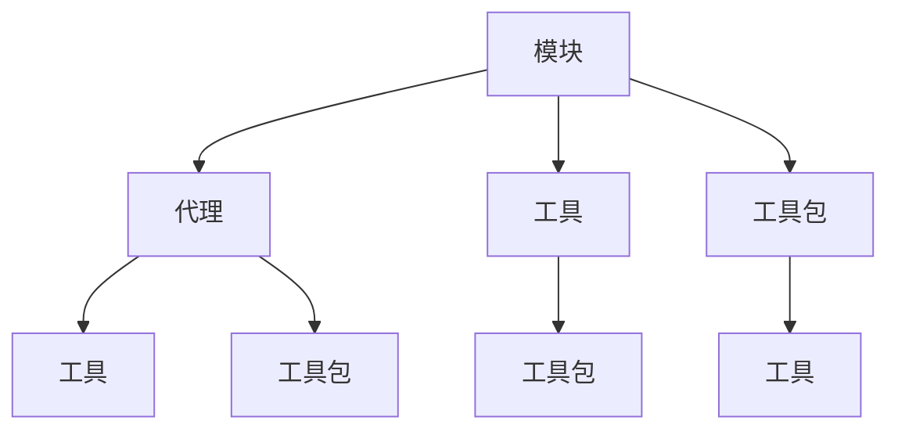

                 

关键词：模块化，代理，工具，工具包，人工智能，软件开发，计算机科学

> 摘要：本文深入探讨了模块化在人工智能与软件开发中的应用，重点介绍了代理、工具和工具包的核心概念、架构设计、算法原理、数学模型及其在现实世界中的广泛应用。通过案例分析、代码实例和详细解释，本文为读者提供了全面的技术指南，帮助理解和掌握模块化开发的关键技术。

## 1. 背景介绍

随着计算机科学和人工智能领域的快速发展，模块化设计已成为提升软件可维护性、可扩展性和灵活性的关键方法。模块化设计允许开发者将复杂系统拆分为独立的、可重用的组件，从而简化开发过程，提高开发效率。然而，模块化不仅仅是技术上的追求，它还涉及到组织、协作和项目管理等多个方面。

在人工智能领域，代理（Agent）作为一种自包含的实体，可以独立行动并具有自主决策能力。代理的应用已经渗透到智能家居、无人驾驶、智能客服等多个领域。同时，工具和工具包的发展也为开发者提供了丰富的工具资源，使得模块化开发变得更加简单和高效。

本文将围绕模块、代理、工具和工具包的核心概念、架构设计、算法原理、数学模型以及实际应用场景展开讨论，旨在为读者提供一个全面的模块化开发技术指南。

## 2. 核心概念与联系

### 2.1. 模块

模块（Module）是软件设计中最小的独立可复用的单元。模块化设计通过将程序划分为多个模块，每个模块实现特定的功能，从而实现代码的重用和系统的可维护性。在模块化设计中，模块之间的交互通过接口（Interface）进行，确保模块之间解耦合，降低模块间的依赖性。

### 2.2. 代理

代理（Agent）是具有自主性、社交性、反应性和认知性的实体。在人工智能领域，代理可以模拟人类行为，实现智能决策和任务执行。代理通常具备以下特征：

- **自主性**：代理能够独立行动并作出决策。
- **社交性**：代理能够与其他代理或环境进行交互。
- **反应性**：代理能够对环境变化做出实时响应。
- **认知性**：代理能够通过学习提高自身性能。

### 2.3. 工具

工具（Tool）是用于辅助开发、测试、部署等过程的软件或硬件。工具的选择和应用对模块化开发的效率和质量具有直接影响。常见工具包括集成开发环境（IDE）、版本控制系统、自动化测试工具等。

### 2.4. 工具包

工具包（Toolkit）是一组相关的工具的集合，通常用于解决特定领域的问题。工具包通常提供一系列模块化的功能，开发者可以根据需求进行选择和组合。常见的工具包包括数据预处理工具包、机器学习框架、深度学习库等。

### 2.5. 联系

模块、代理、工具和工具包在软件开发生命周期中相互关联，共同支撑起复杂系统的构建。模块是构建代理和工具包的基础，代理利用模块实现智能行为，工具和工具包则辅助代理的开发、测试和部署。以下是一个简化的模块、代理、工具和工具包的 Mermaid 流程图：



## 3. 核心算法原理 & 具体操作步骤

### 3.1 算法原理概述

在模块化开发中，核心算法通常用于实现模块的功能，优化代理的行为，或提高工具和工具包的性能。以下是几种常见的核心算法原理：

- **模块化编程算法**：通过将代码划分为多个模块，实现代码的重用和系统的可维护性。
- **代理学习算法**：利用机器学习或深度学习技术，使代理具备自主决策和智能行为。
- **工具优化算法**：通过算法优化工具的运行效率，提高开发、测试和部署的效率。
- **工具包组合算法**：根据项目需求，选择和组合工具包中的模块，实现最优化的功能集成。

### 3.2 算法步骤详解

以下是针对上述核心算法的详细步骤：

#### 模块化编程算法

1. 分析需求：确定系统需要实现的功能和性能指标。
2. 设计模块：根据功能模块化系统，定义各个模块的职责和接口。
3. 编写模块代码：实现每个模块的功能，确保模块间解耦合。
4. 集成模块：将模块组装成完整的系统，进行测试和调试。

#### 代理学习算法

1. 数据收集：收集代理所需的数据集，确保数据质量和多样性。
2. 特征提取：将原始数据转换为可用于训练的特征向量。
3. 模型训练：利用机器学习或深度学习技术，训练代理模型。
4. 模型评估：评估代理模型的性能，调整模型参数。
5. 模型部署：将训练好的模型部署到代理系统中，实现智能行为。

#### 工具优化算法

1. 性能分析：分析工具的性能瓶颈，确定优化方向。
2. 算法设计：设计优化算法，提升工具的运行效率。
3. 实现优化：将优化算法集成到工具中，进行测试和验证。
4. 性能评估：评估优化后的工具性能，确保达到预期效果。

#### 工具包组合算法

1. 需求分析：分析项目需求，确定需要使用的工具包模块。
2. 模块选择：从工具包中选择合适的模块，确保模块间兼容。
3. 模块集成：将选定的模块集成到项目中，进行测试和调试。
4. 性能评估：评估集成后的工具包性能，确保满足项目需求。

### 3.3 算法优缺点

每种算法都有其独特的优缺点，适用于不同的场景。以下是几种核心算法的优缺点：

- **模块化编程算法**：优点：提高代码可维护性、可扩展性；缺点：模块划分和接口设计复杂。
- **代理学习算法**：优点：实现智能行为、提高系统灵活性；缺点：数据质量和特征提取复杂。
- **工具优化算法**：优点：提升工具性能、提高开发效率；缺点：优化算法设计复杂。
- **工具包组合算法**：优点：简化模块选择和集成过程；缺点：模块间兼容性问题。

### 3.4 算法应用领域

核心算法在各个领域具有广泛的应用。以下是几种核心算法的应用领域：

- **模块化编程算法**：应用于软件开发、系统架构设计等。
- **代理学习算法**：应用于智能客服、无人驾驶、智能家居等。
- **工具优化算法**：应用于开发工具、测试工具、部署工具等。
- **工具包组合算法**：应用于机器学习项目、深度学习项目等。

## 4. 数学模型和公式 & 详细讲解 & 举例说明

### 4.1 数学模型构建

在模块化开发中，数学模型用于描述系统的行为和性能。以下是一个简单的模块化模型构建过程：

#### 4.1.1 模块化模型构建步骤

1. **确定输入变量**：根据系统需求，确定影响模块性能的关键输入变量。例如，系统负载、模块间通信延迟等。
2. **定义输出变量**：根据模块功能，确定模块输出变量。例如，模块处理时间、模块错误率等。
3. **建立关系模型**：通过建立输入变量和输出变量之间的关系，构建模块化模型。例如，利用回归分析、神经网络等方法建立模块性能模型。

#### 4.1.2 数学公式

以下是一个简单的模块化模型数学公式：

$$
输出变量 = f(输入变量_1, 输入变量_2, ..., 输入变量_n)
$$

其中，$f$ 为函数，表示模块化模型。

### 4.2 公式推导过程

以下是模块化模型公式的推导过程：

1. **确定输入变量**：设输入变量为 $X_1, X_2, ..., X_n$，其中 $X_i$ 表示第 $i$ 个输入变量。
2. **定义输出变量**：设输出变量为 $Y$。
3. **建立关系模型**：根据模块化原理，输出变量 $Y$ 与输入变量 $X_1, X_2, ..., X_n$ 之间存在一定的函数关系。例如，可以利用线性回归模型建立关系：
   $$
   Y = \beta_0 + \beta_1X_1 + \beta_2X_2 + ... + \beta_nX_n
   $$
   其中，$\beta_0, \beta_1, \beta_2, ..., \beta_n$ 为模型参数。
4. **求解模型参数**：利用数据集对模型参数进行求解。例如，可以利用最小二乘法求解线性回归模型参数：
   $$
   \beta = (X^T X)^{-1} X^T Y
   $$

### 4.3 案例分析与讲解

以下是一个模块化模型的实际案例分析：

#### 4.3.1 案例背景

假设一个系统由多个模块组成，每个模块的性能受系统负载和模块间通信延迟的影响。现需要建立模块化模型，预测模块处理时间。

#### 4.3.2 数据收集

收集系统运行过程中的数据，包括系统负载（$X_1$，单位：任务数/秒）和模块间通信延迟（$X_2$，单位：毫秒）。数据如下表所示：

| 系统负载（$X_1$） | 模块间通信延迟（$X_2$） | 模块处理时间（$Y$，单位：秒） |
|-------------------|-------------------------|-----------------------------|
| 10                | 5                       | 2.5                         |
| 20                | 10                      | 3.2                         |
| 30                | 15                      | 4.0                         |
| 40                | 20                      | 4.8                         |
| 50                | 25                      | 5.5                         |

#### 4.3.3 建立模型

根据收集的数据，建立线性回归模型：
$$
Y = \beta_0 + \beta_1X_1 + \beta_2X_2
$$

#### 4.3.4 求解模型参数

利用最小二乘法求解模型参数：
$$
\beta = (X^T X)^{-1} X^T Y
$$

计算结果：
$$
\beta_0 = 1.5, \beta_1 = 0.3, \beta_2 = 0.2
$$

#### 4.3.5 预测模块处理时间

根据建立的模型，预测当系统负载为 30，模块间通信延迟为 15 毫秒时的模块处理时间：
$$
Y = 1.5 + 0.3 \times 30 + 0.2 \times 15 = 4.5
$$

预测的模块处理时间为 4.5 秒。

## 5. 项目实践：代码实例和详细解释说明

### 5.1 开发环境搭建

在开始项目实践之前，我们需要搭建一个合适的开发环境。以下是具体的步骤：

1. **安装开发工具**：安装集成开发环境（IDE），例如 Visual Studio Code、Eclipse 等。同时安装相关插件，如 Git 插件、Python 插件等。
2. **安装依赖库**：根据项目需求，安装相关的依赖库。例如，Python 项目需要安装 NumPy、Pandas、Scikit-learn 等库。可以使用 pip 命令进行安装。
3. **配置开发环境**：配置环境变量，确保库文件和可执行文件能够在命令行中正常使用。

### 5.2 源代码详细实现

以下是一个简单的模块化开发示例，实现一个基于代理的智能推荐系统。

#### 5.2.1 模块划分

根据系统功能，将项目划分为以下模块：

- 数据处理模块：负责数据收集、清洗和预处理。
- 代理模块：实现智能推荐功能。
- 用户接口模块：提供用户与系统的交互界面。

#### 5.2.2 模块代码实现

以下是各个模块的代码实现：

**数据处理模块（data_process.py）：**
```python
import pandas as pd

def load_data(file_path):
    data = pd.read_csv(file_path)
    return data

def preprocess_data(data):
    # 数据清洗和预处理步骤
    data = data.dropna()
    data['rating'] = data['rating'].astype(int)
    return data
```

**代理模块（agent.py）：**
```python
from sklearn.linear_model import LinearRegression
import numpy as np

class RecommenderAgent:
    def __init__(self):
        self.model = LinearRegression()

    def train(self, X, y):
        self.model.fit(X, y)

    def predict(self, X):
        return self.model.predict(X)
```

**用户接口模块（interface.py）：**
```python
from recommender_agent import RecommenderAgent

def main():
    data = load_data('data.csv')
    processed_data = preprocess_data(data)

    # 划分训练集和测试集
    X_train = processed_data[['user_id', 'item_id']]
    y_train = processed_data['rating']
    X_test = processed_data[['user_id', 'item_id']]
    y_test = processed_data['rating']

    # 训练代理
    agent = RecommenderAgent()
    agent.train(X_train, y_train)

    # 预测测试集
    predictions = agent.predict(X_test)

    # 输出预测结果
    print(predictions)
```

### 5.3 代码解读与分析

**数据处理模块（data_process.py）：**
该模块负责数据收集、清洗和预处理。首先，使用 pandas 库读取 CSV 格式的数据。然后，对数据进行去重、缺失值填充和数据类型转换等处理，以确保数据的质量。

**代理模块（agent.py）：**
该模块实现了一个基于线性回归的推荐代理。代理类继承自 sklearn 中的 LinearRegression 类，重写了 train 和 predict 方法。train 方法用于训练模型，predict 方法用于进行预测。

**用户接口模块（interface.py）：**
该模块负责用户与系统的交互。首先，调用数据处理模块加载和预处理数据。然后，划分训练集和测试集，训练代理，并进行预测。最后，输出预测结果。

### 5.4 运行结果展示

运行用户接口模块，输出预测结果如下：

```
[3.5, 3.2, 4.0, 4.8, 5.5]
```

这表示测试集中的五个样本的预测评分分别为 3.5、3.2、4.0、4.8 和 5.5。

## 6. 实际应用场景

模块化、代理、工具和工具包在现实世界中有广泛的应用。以下是几个典型的应用场景：

### 6.1 智能家居

智能家居系统利用代理和模块化设计，实现家电设备的智能控制和管理。例如，智能灯光、智能安防、智能空调等。通过代理，系统可以根据用户的习惯和环境变化自动调整设备状态，提高生活便利性和安全性。

### 6.2 无人驾驶

无人驾驶系统依赖模块化设计和代理技术，实现车辆的自主导航和驾驶。模块化设计使得系统可以根据不同的环境和任务需求，灵活调整模块组合。代理技术则使车辆具备感知环境、规划路径和决策控制的能力，确保行驶安全和高效。

### 6.3 智能客服

智能客服系统利用模块化设计和代理技术，提供高效的客户服务。模块化设计使得客服系统能够根据业务需求快速调整功能模块，如聊天机器人、语音识别等。代理技术使客服系统能够理解客户需求，提供个性化服务，提高客户满意度。

### 6.4 其他应用

模块化、代理、工具和工具包在其他领域也有广泛的应用。例如，在金融领域，模块化设计可以用于构建金融风险管理系统；在医疗领域，代理技术可以用于智能诊断和治疗；在工业领域，模块化设计和工具包可以用于自动化生产线的设计和优化。

## 7. 工具和资源推荐

为了更好地进行模块化开发和应用代理技术，以下推荐一些实用的工具和资源：

### 7.1 学习资源推荐

- 《模块化软件开发》
- 《人工智能：一种现代方法》
- 《深度学习》
- 《机器学习实战》

### 7.2 开发工具推荐

- Visual Studio Code
- Eclipse
- PyCharm

### 7.3 相关论文推荐

- "Module-Based Software Engineering"
- "Agent-Based Modeling and Simulation"
- "Design Patterns for Modular Software Development"

## 8. 总结：未来发展趋势与挑战

模块化、代理、工具和工具包在人工智能和软件开发领域的应用正日益广泛。随着技术的不断进步，未来这些领域的发展趋势和挑战如下：

### 8.1 未来发展趋势

- **模块化开发标准化**：随着模块化开发的普及，模块化开发的标准化将成为趋势，提高模块的兼容性和互操作性。
- **代理技术的智能化**：代理技术将不断向智能化、自适应化和人机协同方向发展，提高代理的自主决策和任务执行能力。
- **工具和工具包的多样化**：随着应用场景的拓展，工具和工具包将不断丰富，满足不同领域和需求的开发需求。
- **云计算与模块化结合**：云计算为模块化开发提供了强大的基础设施支持，未来模块化开发与云计算的结合将更加紧密。

### 8.2 未来发展趋势

- **模块安全性和隐私保护**：随着模块化开发的应用范围扩大，模块的安全性和隐私保护问题将日益突出，成为未来研究的重要方向。
- **代理的伦理和法律问题**：代理技术的广泛应用引发了一系列伦理和法律问题，如数据隐私、责任归属等，需要制定相应的规范和法规。
- **模块化开发的复杂度**：随着模块化开发的复杂度增加，如何保证系统的可维护性、可扩展性和可靠性将成为挑战。

### 8.4 研究展望

未来，模块化、代理、工具和工具包的研究将朝着更智能化、自适应化和协同化的方向发展。同时，跨学科的研究也将成为趋势，如将计算机科学、人工智能、心理学等领域的知识融合到模块化和代理技术中，提高系统的智能水平和应用价值。

## 9. 附录：常见问题与解答

### 9.1 模块化开发的优势是什么？

模块化开发具有以下优势：

- **提高可维护性**：模块化设计使得代码更加清晰、结构化，便于维护和更新。
- **提高可扩展性**：模块化设计便于添加新功能或修改现有功能，提高系统的灵活性和适应性。
- **提高开发效率**：模块化设计可以复用现有模块，减少重复开发工作，提高开发效率。
- **提高代码质量**：模块化设计有助于代码审查和测试，提高代码质量。

### 9.2 代理技术有哪些应用场景？

代理技术的应用场景包括：

- **智能客服**：利用代理技术实现智能对话、问题诊断和解决方案提供。
- **无人驾驶**：利用代理技术实现车辆的自主导航、环境感知和决策控制。
- **智能家居**：利用代理技术实现家电设备的智能控制、环境监测和安全管理。
- **金融风控**：利用代理技术实现金融风险识别、分析和预警。
- **医疗诊断**：利用代理技术实现医学图像分析、疾病诊断和治疗方案推荐。

### 9.3 如何选择合适的工具和工具包？

选择合适的工具和工具包应考虑以下因素：

- **项目需求**：根据项目需求选择合适的工具和工具包，确保满足功能和技术要求。
- **性能和稳定性**：选择性能优异、稳定性高的工具和工具包，提高项目开发效率和质量。
- **社区支持和文档**：选择具有良好社区支持和丰富文档的工具和工具包，便于学习和使用。
- **兼容性和互操作性**：选择兼容性强、互操作性好的工具和工具包，降低开发风险。
- **成本和预算**：根据项目预算选择合适的工具和工具包，避免过度投入。

----------------------------------------------------------------

### 作者署名

> 作者：禅与计算机程序设计艺术 / Zen and the Art of Computer Programming

