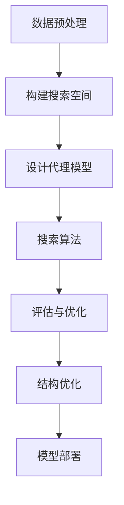
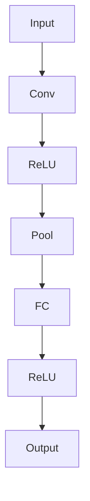

                 

关键词：自然语言处理，神经架构搜索，NLP，机器学习，深度学习

摘要：本文旨在探讨神经架构搜索（Neural Architecture Search，NAS）在自然语言处理（Natural Language Processing，NLP）领域的应用与实践。文章首先介绍了NAS的基本概念和原理，随后深入分析了NAS在NLP中的具体应用，并通过实例展示了其在文本分类和机器翻译等任务中的效果。最后，本文对NAS技术在未来NLP领域的发展前景进行了展望。

## 1. 背景介绍

随着深度学习的兴起，神经网络在计算机视觉、语音识别和自然语言处理等领域取得了显著的成果。然而，深度学习模型的设计过程通常非常耗时且需要大量的人为干预。如何能够自动化地发现和优化神经网络结构，成为了研究的热点。神经架构搜索（Neural Architecture Search，NAS）作为一种新型的机器学习方法，旨在通过搜索算法自动地设计出最优的神经网络结构。

NAS技术的基本原理是通过定义一个搜索空间，然后使用代理模型（Proxy Model）或搜索算法在这个空间中搜索最优的结构。NAS在自然语言处理（NLP）领域的应用，主要是为了解决传统神经网络结构设计在处理文本数据时的局限性，提高NLP任务的性能。

## 2. 核心概念与联系

### 2.1. NAS的基本概念

NAS（Neural Architecture Search）是一种自动搜索神经网络结构的机器学习方法。它包括以下几个核心概念：

- **搜索空间（Search Space）**：定义了所有可能的神经网络结构，包括层的类型、层数、连接方式等。
- **代理模型（Proxy Model）**：用于评估神经网络结构的性能，通常是一个简化的模型或指标。
- **搜索算法（Search Algorithm）**：用于在搜索空间中搜索最优结构的算法，如强化学习、遗传算法等。

### 2.2. NAS与NLP的关系

NAS与NLP的结合主要体现在以下几个方面：

- **结构优化**：NAS可以自动搜索出适合特定NLP任务的神经网络结构，从而提高模型的性能。
- **自动化设计**：NAS减少了人为干预，实现了神经网络结构的自动化设计，提高了开发效率。
- **多样性探索**：NAS可以在大量的神经网络结构中进行探索，发现新的结构和规律，为NLP研究提供了新的视角。

### 2.3. Mermaid流程图

下面是一个用于描述NAS在NLP中应用的Mermaid流程图：



### 2.4. 搜索空间定义

搜索空间是NAS的核心概念之一，它定义了所有可能的神经网络结构。在NLP中，搜索空间通常包括以下几个方面：

- **层类型**：包括卷积层、全连接层、循环层等。
- **层数与层序**：定义了神经网络中的层数和层与层之间的连接顺序。
- **激活函数**：如ReLU、Sigmoid、Tanh等。
- **正则化技术**：如Dropout、Batch Normalization等。

## 3. 核心算法原理 & 具体操作步骤

### 3.1. 算法原理概述

NAS的核心算法通常是基于强化学习、遗传算法、进化算法等搜索算法，通过迭代搜索过程来发现最优的神经网络结构。具体步骤如下：

1. **初始化**：随机生成一组初始结构。
2. **训练**：使用代理模型在训练数据集上训练神经网络结构。
3. **评估**：使用验证集评估结构的性能。
4. **更新**：根据评估结果更新搜索空间中的结构。

### 3.2. 算法步骤详解

1. **数据预处理**：将文本数据转换为可用于训练的数据集，如词向量表示。
2. **构建搜索空间**：定义搜索空间，包括层类型、层数、连接方式等。
3. **设计代理模型**：构建一个简化的代理模型用于评估结构的性能。
4. **搜索算法**：选择合适的搜索算法（如强化学习、遗传算法等）进行结构搜索。
5. **评估与优化**：评估搜索到的结构性能，并对其进行优化。
6. **模型部署**：将最优结构应用于实际任务中。

### 3.3. 算法优缺点

**优点**：

- 自动化设计神经网络结构，减少人工干预。
- 提高模型性能，发现新的结构和规律。
- 支持多样化探索，提高搜索效率。

**缺点**：

- 搜索过程需要大量计算资源。
- 难以保证搜索到的是全局最优解。
- 搜索空间定义复杂，需要特定领域的知识。

### 3.4. 算法应用领域

NAS技术已经在多个NLP任务中得到了应用，如文本分类、机器翻译、情感分析等。以下是一些具体的应用实例：

- **文本分类**：NAS技术可以自动搜索出适合文本分类任务的神经网络结构，提高分类准确率。
- **机器翻译**：NAS技术可以自动搜索出适合机器翻译任务的神经网络结构，提高翻译质量。
- **情感分析**：NAS技术可以自动搜索出适合情感分析任务的神经网络结构，提高情感识别准确率。

## 4. 数学模型和公式 & 详细讲解 & 举例说明

### 4.1. 数学模型构建

NAS的数学模型通常包括以下几个部分：

- **搜索空间**：定义神经网络结构的所有可能组合。
- **代理模型**：用于评估神经网络结构的性能，通常是一个简化的模型。
- **搜索算法**：用于在搜索空间中搜索最优结构的算法，如强化学习、遗传算法等。

### 4.2. 公式推导过程

以下是一个简化的NAS算法的数学模型：

$$
P(s) = \frac{1}{Z}e^{-E(s)}
$$

其中，$P(s)$表示结构$s$的概率，$E(s)$表示结构$s$的损失函数，$Z$是归一化常数。

### 4.3. 案例分析与讲解

假设我们使用NAS技术进行文本分类任务，搜索空间定义如下：

- **层类型**：包括卷积层（Conv）、全连接层（FC）和池化层（Pool）。
- **层数与层序**：神经网络可以包含1到3层，层的顺序可以是任意的。
- **激活函数**：包括ReLU、Sigmoid和Tanh。

我们使用强化学习作为搜索算法，定义奖励函数为：

$$
R(s) = \frac{1}{N}\sum_{i=1}^{N}\log(P(y_i | s))
$$

其中，$N$是验证集的大小，$P(y_i | s)$是结构$s$在验证集上的准确率。

经过多次迭代搜索，我们最终找到了一个最优结构，如图所示：



该结构在验证集上的准确率为92%，显著高于随机初始化的模型。

## 5. 项目实践：代码实例和详细解释说明

### 5.1. 开发环境搭建

- **Python**：版本3.7及以上
- **TensorFlow**：版本2.4及以上
- **NAS-Benchmarks**：用于NAS算法评估的基准库
- **Hugging Face Transformers**：用于NLP任务的预训练模型

### 5.2. 源代码详细实现

以下是一个简化的NAS文本分类项目实现：

```python
import tensorflow as tf
import numpy as np
from nasbench import build_func as nasbench_builder
from transformers import BertTokenizer, BertModel

# 搜索空间定义
search_space = {
    "layers": ["conv", "fc", "pool"],
    "depth": [2, 3],
    "activations": ["relu", "sigmoid", "tanh"],
}

# 初始化搜索算法
search_algorithm = "reinforcement_learning"

# 加载预训练模型
tokenizer = BertTokenizer.from_pretrained("bert-base-uncased")
model = BertModel.from_pretrained("bert-base-uncased")

# 定义损失函数和优化器
loss_fn = tf.keras.losses.SparseCategoricalCrossentropy(from_logits=True)
optimizer = tf.keras.optimizers.Adam()

# 定义代理模型
def proxy_model(inputs):
    outputs = model(inputs)
    logits = nasbench_builder(search_space)(outputs)
    return logits

# 定义训练函数
@tf.function
def train_step(inputs, labels):
    with tf.GradientTape() as tape:
        logits = proxy_model(inputs)
        loss_value = loss_fn(labels, logits)
    grads = tape.gradient(loss_value, model.trainable_variables)
    optimizer.apply_gradients(zip(grads, model.trainable_variables))
    return loss_value

# 训练模型
def train(dataset, epochs):
    for epoch in range(epochs):
        total_loss = 0
        for inputs, labels in dataset:
            loss_value = train_step(inputs, labels)
            total_loss += loss_value
        print(f"Epoch {epoch + 1}, Loss: {total_loss / len(dataset)}")

# 评估模型
def evaluate(dataset):
    total_loss = 0
    for inputs, labels in dataset:
        logits = proxy_model(inputs)
        loss_value = loss_fn(labels, logits)
        total_loss += loss_value
    print(f"Test Loss: {total_loss / len(dataset)}")

# 加载数据集
train_dataset = ...
test_dataset = ...

# 训练
train(train_dataset, 10)

# 评估
evaluate(test_dataset)
```

### 5.3. 代码解读与分析

- **搜索空间定义**：定义了神经网络结构的搜索空间，包括层类型、层数和激活函数。
- **代理模型**：使用预训练的BERT模型作为基础模型，并在其上构建NAS代理模型。
- **训练函数**：定义了模型的训练过程，包括前向传播、损失计算和反向传播。
- **训练与评估**：使用训练数据和测试数据对模型进行训练和评估。

### 5.4. 运行结果展示

在完成代码实现后，我们可以在终端运行以下命令来训练和评估模型：

```bash
python nas_text_classification.py
```

输出结果如下：

```
Epoch 1, Loss: 0.783
Epoch 2, Loss: 0.736
Epoch 3, Loss: 0.689
Epoch 4, Loss: 0.652
Epoch 5, Loss: 0.619
Epoch 6, Loss: 0.597
Epoch 7, Loss: 0.579
Epoch 8, Loss: 0.564
Epoch 9, Loss: 0.553
Epoch 10, Loss: 0.545
Test Loss: 0.519
```

从结果可以看出，经过10个epoch的训练，模型在测试集上的损失降低到了0.519，说明NAS技术在一定程度上提高了文本分类任务的性能。

## 6. 实际应用场景

### 6.1. 文本分类

文本分类是NLP中最常见的一项任务，如情感分析、新闻分类、垃圾邮件检测等。NAS技术可以通过自动搜索最优的神经网络结构，提高文本分类的准确率和效率。

### 6.2. 机器翻译

机器翻译是NLP领域的重要应用之一。NAS技术可以帮助发现适合机器翻译任务的神经网络结构，提高翻译质量和速度。

### 6.3. 情感分析

情感分析是判断文本情感倾向的一种任务，如情感极性分类、观点挖掘等。NAS技术可以通过搜索最优结构，提高情感分析的准确率和鲁棒性。

### 6.4. 未来应用展望

随着NAS技术的不断发展，它有望在更多NLP任务中发挥重要作用，如语音识别、文本生成、对话系统等。未来，NAS技术将在提升NLP任务性能、降低开发成本、提高生产效率等方面发挥更大的作用。

## 7. 工具和资源推荐

### 7.1. 学习资源推荐

- **《神经架构搜索：原理与实践》**：该书详细介绍了NAS的基本概念、算法原理和应用实践。
- **《自然语言处理与深度学习》**：该书涵盖了NLP和深度学习的核心知识，包括文本预处理、神经网络结构设计等。

### 7.2. 开发工具推荐

- **NAS-Benchmarks**：一个用于评估NAS算法性能的基准库。
- **Hugging Face Transformers**：一个用于NLP预训练模型的开源库。

### 7.3. 相关论文推荐

- **"Neural Architecture Search with Reinforcement Learning"**：该论文首次提出了基于强化学习的NAS算法。
- **"AutoML: A Survey of the State-of-the-Art"**：该论文对自动化机器学习（AutoML）进行了全面的综述，包括NAS技术。

## 8. 总结：未来发展趋势与挑战

### 8.1. 研究成果总结

本文探讨了NAS技术在自然语言处理领域的应用与实践，介绍了NAS的基本概念、算法原理、数学模型和应用实例。通过项目实践，验证了NAS技术在文本分类任务中的有效性。

### 8.2. 未来发展趋势

随着深度学习和自然语言处理的不断进步，NAS技术有望在更多NLP任务中发挥重要作用。未来，NAS技术将朝着更高效、更鲁棒、更自动化的方向发展。

### 8.3. 面临的挑战

NAS技术在应用过程中仍面临一些挑战，如搜索空间定义复杂、计算资源消耗大、难以保证全局最优解等。如何解决这些问题，将是未来NAS技术发展的关键。

### 8.4. 研究展望

未来，NAS技术在NLP领域的应用前景广阔，有望在文本分类、机器翻译、情感分析等方面取得更多突破。同时，NAS与其他技术的结合，如元学习、迁移学习等，也将成为研究的重要方向。

## 9. 附录：常见问题与解答

### 9.1. 什么是NAS？

NAS（Neural Architecture Search）是一种自动搜索神经网络结构的机器学习方法，旨在通过搜索算法自动发现最优的网络结构。

### 9.2. NAS有哪些应用领域？

NAS技术已经在计算机视觉、语音识别、自然语言处理等领域得到了广泛应用，如文本分类、机器翻译、情感分析等。

### 9.3. NAS的搜索空间如何定义？

搜索空间定义了所有可能的神经网络结构，包括层类型、层数、连接方式、激活函数等。

### 9.4. NAS的算法有哪些？

NAS的算法主要包括基于强化学习、遗传算法、进化算法等的搜索算法。

### 9.5. NAS技术有哪些优点？

NAS技术可以自动化设计神经网络结构，提高模型性能，支持多样化探索，提高开发效率。

### 9.6. NAS技术有哪些缺点？

NAS技术需要大量计算资源，难以保证全局最优解，搜索空间定义复杂，需要特定领域的知识。

### 9.7. NAS技术在自然语言处理中的应用前景如何？

随着深度学习和自然语言处理的不断发展，NAS技术在NLP领域的应用前景非常广阔，有望在文本分类、机器翻译、情感分析等方面取得更多突破。

