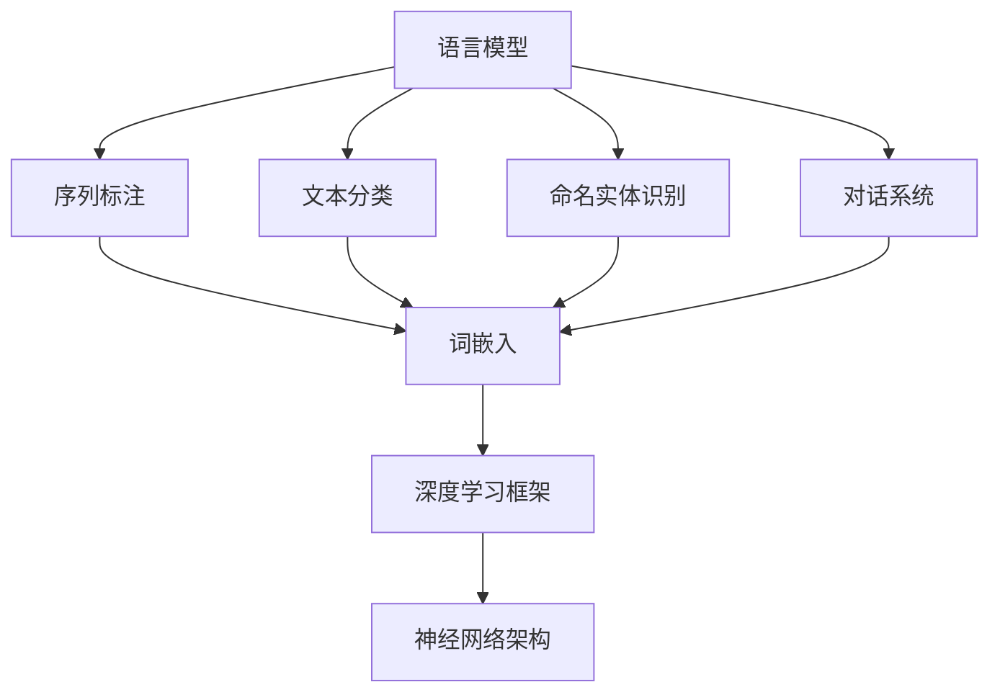

                 

关键词：自然语言处理、模型选择、算法、深度学习、语言模型、序列标注、文本分类、对话系统

> 摘要：本文将探讨自然语言处理（NLP）领域中模型选择的策略和方法。通过对不同类型NLP任务及其特点的分析，结合实际案例和数学模型，本文旨在为开发者提供一套系统的模型选择策略，以帮助他们更有效地构建高性能的NLP应用。

## 1. 背景介绍

自然语言处理（NLP）是计算机科学领域中的一个重要分支，旨在使计算机能够理解和处理人类语言。近年来，随着深度学习技术的蓬勃发展，NLP取得了显著的进展。然而，面对众多NLP任务，如何选择合适的模型成为了开发者面临的一大挑战。

NLP任务可以大致分为几类，包括但不限于语言模型、序列标注、文本分类、命名实体识别、对话系统等。每种任务都有其独特的需求和难点，因此需要针对具体任务选择合适的模型。此外，模型的选择还受到数据集、计算资源和时间成本等多方面因素的影响。

本文将围绕NLP任务中的模型选择策略展开讨论，包括核心概念、算法原理、数学模型、项目实践以及实际应用场景等内容。希望通过本文的介绍，读者能够更好地理解模型选择的重要性，并掌握一套实用的模型选择策略。

## 2. 核心概念与联系

在深入探讨模型选择策略之前，我们需要了解一些NLP中的核心概念和它们之间的关系。以下是一个用Mermaid绘制的流程图，展示了这些概念及其相互联系。



### 2.1 语言模型

语言模型（Language Model）是NLP中最基本的模型之一，它的目的是预测文本序列中下一个单词的概率。在NLP任务中，语言模型广泛应用于自动完成、机器翻译、语音识别等领域。

### 2.2 序列标注

序列标注（Sequence Labeling）任务是对输入序列中的每个元素进行分类。常见的序列标注任务包括命名实体识别（Named Entity Recognition, NER）和情感分析（Sentiment Analysis）等。

### 2.3 文本分类

文本分类（Text Classification）任务是将文本数据分配到预定义的类别中。文本分类在新闻分类、垃圾邮件检测、情感分析等场景中有着广泛应用。

### 2.4 命名实体识别

命名实体识别（Named Entity Recognition, NER）是一种序列标注任务，目的是识别文本中的命名实体，如人名、地名、组织名等。

### 2.5 对话系统

对话系统（Dialogue System）是一种与人类进行自然语言交互的系统，包括问答系统、聊天机器人等。对话系统的核心在于理解用户的意图和语境，并生成合适的回复。

### 2.6 词嵌入

词嵌入（Word Embedding）是将单词映射到固定大小的向量空间中，使得具有相似语义的单词在空间中靠近。词嵌入在语言模型和序列标注任务中起到了关键作用。

### 2.7 深度学习框架

深度学习框架（Deep Learning Framework）如TensorFlow、PyTorch等，提供了构建和训练深度学习模型所需的高级API和工具。

### 2.8 神经网络架构

神经网络架构（Neural Network Architecture）如卷积神经网络（CNN）、循环神经网络（RNN）、长短期记忆网络（LSTM）等，是深度学习模型的基础。

## 3. 核心算法原理 & 具体操作步骤

### 3.1 算法原理概述

在NLP任务中，模型的选择通常取决于任务类型和数据特点。以下是几种常见的NLP模型及其原理概述：

### 3.2 算法步骤详解

#### 3.2.1 语言模型

1. 数据预处理：包括分词、去停用词、词干提取等。
2. 词嵌入：将单词映射到高维向量空间中。
3. 构建神经网络：通常采用RNN或LSTM等结构。
4. 训练模型：通过反向传播算法优化模型参数。
5. 评估模型：使用交叉验证或测试集评估模型性能。

#### 3.2.2 序列标注

1. 数据预处理：与语言模型类似，但需要标注标签信息。
2. 词嵌入：将单词和标签映射到高维向量空间中。
3. 构建神经网络：采用CRF、BiLSTM等结构。
4. 训练模型：通过反向传播算法优化模型参数。
5. 评估模型：使用F1分数、准确率等指标评估模型性能。

#### 3.2.3 文本分类

1. 数据预处理：包括分词、去停用词、词干提取等。
2. 词嵌入：将单词映射到高维向量空间中。
3. 构建神经网络：采用CNN、RNN等结构。
4. 训练模型：通过反向传播算法优化模型参数。
5. 评估模型：使用准确率、召回率等指标评估模型性能。

#### 3.2.4 命名实体识别

1. 数据预处理：与序列标注类似，但需要更详细的实体标注。
2. 词嵌入：将单词和实体标签映射到高维向量空间中。
3. 构建神经网络：采用CRF、BiLSTM等结构。
4. 训练模型：通过反向传播算法优化模型参数。
5. 评估模型：使用F1分数、准确率等指标评估模型性能。

#### 3.2.5 对话系统

1. 数据预处理：包括文本清洗、分词、去停用词等。
2. 意图识别：通过序列标注或分类任务识别用户意图。
3. 语境理解：结合上下文信息，理解用户的意图。
4. 生成回复：利用语言模型生成自然语言回复。
5. 评估模型：通过人工评估或自动化评估工具评估模型性能。

### 3.3 算法优缺点

#### 3.3.1 语言模型

**优点**：
- 强大的文本生成能力。
- 在多个NLP任务中具有广泛的应用。

**缺点**：
- 需要大量训练数据。
- 训练时间较长。

#### 3.3.2 序列标注

**优点**：
- 对序列中的每个元素进行精细标注。
- 在实体识别、情感分析等领域表现良好。

**缺点**：
- 需要大量标注数据。
- 模型复杂度高。

#### 3.3.3 文本分类

**优点**：
- 简单高效，适合处理大规模文本数据。
- 易于实现和部署。

**缺点**：
- 对文本语义理解有限。
- 在长文本分类中表现不佳。

#### 3.3.4 命名实体识别

**优点**：
- 精细的实体标注。
- 在信息抽取、知识图谱构建等领域应用广泛。

**缺点**：
- 需要大量标注数据。
- 模型复杂度较高。

#### 3.3.5 对话系统

**优点**：
- 可实现自然语言交互。
- 在客服、虚拟助手等领域有广泛应用。

**缺点**：
- 意图理解和语境理解挑战较大。
- 模型训练和评估复杂。

### 3.4 算法应用领域

**语言模型**：
- 自动完成
- 机器翻译
- 语音识别

**序列标注**：
- 命名实体识别
- 情感分析
- 链接分析

**文本分类**：
- 新闻分类
- 垃圾邮件检测
- 情感分析

**命名实体识别**：
- 信息抽取
- 知识图谱构建
- 问答系统

**对话系统**：
- 客服机器人
- 虚拟助手
- 聊天机器人

## 4. 数学模型和公式 & 详细讲解 & 举例说明

在NLP任务中，数学模型和公式扮演着至关重要的角色。以下将详细讲解NLP任务中的几个关键数学模型和公式，并给出相应的案例说明。

### 4.1 数学模型构建

在NLP任务中，常见的数学模型包括概率模型、神经网络模型、生成模型等。以下是一个简单的概率模型构建示例：

**概率模型**：
给定一个单词序列\(w_1, w_2, ..., w_n\)，我们想要计算下一个单词\(w_{n+1}\)的概率。使用最大后验概率（Maximum A Posteriori, MAP）方法，我们可以构建以下模型：

\[ P(w_{n+1} | w_1, w_2, ..., w_n) = \frac{P(w_{n+1})P(w_1, w_2, ..., w_n | w_{n+1})}{P(w_1, w_2, ..., w_n)} \]

其中，\(P(w_{n+1})\)是单词\(w_{n+1}\)的概率，\(P(w_1, w_2, ..., w_n | w_{n+1})\)是给定单词序列条件下单词\(w_{n+1}\)的条件概率，\(P(w_1, w_2, ..., w_n)\)是单词序列的概率。

### 4.2 公式推导过程

**神经网络模型**：
在深度学习框架中，神经网络模型是NLP任务的核心。以下是一个简单的神经网络模型推导过程：

假设我们有一个输入向量\(x\)和输出向量\(y\)，我们需要通过神经网络模型计算输出概率分布\(p(y|x)\)。一个简单的神经网络模型包括以下几个部分：

1. 输入层（Input Layer）：接收输入向量\(x\)。
2. 隐藏层（Hidden Layer）：通过激活函数计算中间层输出。
3. 输出层（Output Layer）：通过输出层计算最终输出概率分布。

假设隐藏层输出为\(h\)，输出层输出为\(z\)，我们有以下公式：

\[ h = \sigma(W_h \cdot x + b_h) \]
\[ z = \sigma(W_o \cdot h + b_o) \]

其中，\(W_h\)和\(W_o\)分别是隐藏层和输出层的权重矩阵，\(b_h\)和\(b_o\)分别是隐藏层和输出层的偏置向量，\(\sigma\)是激活函数（如Sigmoid函数或ReLU函数）。

### 4.3 案例分析与讲解

**文本分类任务**：
假设我们有一个简单的二分类文本分类任务，数据集包含正面和负面评论。我们使用神经网络模型进行训练和预测。

**数据预处理**：
1. 分词：将文本数据分词为单词序列。
2. 去停用词：去除常见无意义的单词。
3. 词嵌入：将单词映射到高维向量空间。

**模型构建**：
1. 输入层：接收分词后的单词序列。
2. 隐藏层：使用ReLU函数作为激活函数。
3. 输出层：使用Sigmoid函数作为激活函数，输出二分类概率。

**模型训练**：
1. 计算损失函数：交叉熵损失函数（Cross-Entropy Loss）。
2. 反向传播：通过梯度下降（Gradient Descent）算法优化模型参数。

**模型评估**：
1. 准确率（Accuracy）：分类正确的样本数占总样本数的比例。
2. 召回率（Recall）：实际为正类的样本中被正确分类为正类的比例。
3. F1分数（F1 Score）：准确率和召回率的调和平均。

## 5. 项目实践：代码实例和详细解释说明

在本节中，我们将通过一个简单的文本分类项目来展示如何实现NLP任务中的模型选择策略。该项目将使用Python和PyTorch框架进行开发。

### 5.1 开发环境搭建

1. 安装Python（建议使用Python 3.7及以上版本）。
2. 安装PyTorch：使用`pip install torch torchvision`命令进行安装。
3. 安装Numpy、Pandas等常用库。

### 5.2 源代码详细实现

```python
import torch
import torch.nn as nn
import torch.optim as optim
from torchtext.```
```<|vq_14463|>``````python
import torch
import torch.nn as nn
import torch.optim as optim
from torchtext.data import Field, TabularDataset
from torchtext.vocab import Vectors

# 数据预处理
TEXT = Field(tokenize=lambda x: x.split(), lower=True)
LABEL = Field(sequential=False)

# 定义数据集
fields = [('text', TEXT), ('label', LABEL)]

# 加载数据集
train_data, test_data = TabularDataset.splits(path='data', train='train.csv', test='test.csv', format='csv', fields=fields)

# 定义词嵌入
vocab = Vectors('glove.6B.100d.txt', dim=100)

# 加载词嵌入
TEXT.vocab = vocab

# 定义模型
class TextClassifier(nn.Module):
    def __init__(self, embedding_dim, hidden_dim, output_dim):
        super().__init__()
        self.embedding = nn.Embedding.from_pretrained(TEXT.vocab.vectors)
        self.rnn = nn.LSTM(embedding_dim, hidden_dim)
        self.fc = nn.Linear(hidden_dim, output_dim)
        
    def forward(self, text):
        embed = self.embedding(text)
        output, (hidden, _) = self.rnn(embed)
        hidden = hidden[-1, :, :]
        return self.fc(hidden)

# 实例化模型
model = TextClassifier(embedding_dim=100, hidden_dim=128, output_dim=2)

# 定义损失函数和优化器
criterion = nn.CrossEntropyLoss()
optimizer = optim.Adam(model.parameters(), lr=0.001)

# 训练模型
def train(model, train_data, test_data, n_epochs=10):
    model.train()
    for epoch in range(n_epochs):
        for batch in train_data:
            optimizer.zero_grad()
            predictions = model(batch.text).squeeze(1)
            loss = criterion(predictions, batch.label)
            loss.backward()
            optimizer.step()
            print(f"Epoch: {epoch+1}/{n_epochs}, Loss: {loss.item()}")

# 测试模型
def test(model, test_data):
    model.eval()
    with torch.no_grad():
        correct = 0
        total = 0
        for batch in test_data:
            predictions = model(batch.text).squeeze(1)
            _, predicted = torch.max(predictions, 1)
            total += batch.label.size(0)
            correct += (predicted == batch.label).sum().item()
    print(f"Test Accuracy: {100 * correct / total}%")

# 运行训练和测试
train(model, train_data, test_data)
test(model, test_data)
```

### 5.3 代码解读与分析

上述代码实现了一个基于RNN的文本分类模型。以下是对代码的详细解读和分析：

1. **数据预处理**：
   - 使用`Field`类定义文本和标签的预处理方法，包括分词、大小写转换等。
   - 加载数据集，使用`TabularDataset`类从CSV文件中读取数据，并划分训练集和测试集。

2. **词嵌入**：
   - 使用预训练的GloVe词嵌入，将文本数据映射到高维向量空间中。

3. **模型定义**：
   - 定义一个简单的RNN模型，包括嵌入层、RNN层和全连接层。
   - 使用`nn.Module`基类定义模型结构。

4. **模型训练**：
   - 定义损失函数和优化器。
   - 使用`train`函数训练模型，包括前向传播、反向传播和优化参数。

5. **模型测试**：
   - 使用`test`函数评估模型在测试集上的性能。

通过上述代码，我们可以看到如何使用PyTorch框架实现一个文本分类模型。在实际项目中，我们可以根据需要调整模型结构、优化策略等，以提高模型性能。

## 6. 实际应用场景

NLP模型在不同领域有着广泛的应用。以下是一些实际应用场景和案例分析：

### 6.1 客户服务

在客户服务领域，NLP模型被广泛应用于聊天机器人、智能客服等场景。通过意图识别和对话生成，这些系统能够与用户进行自然语言交互，提高客户服务效率和用户体验。例如，许多公司的客服系统已经实现了24小时在线服务，能够快速响应用户的问题，并提供有效的解决方案。

### 6.2 机器翻译

机器翻译是NLP领域的一个经典应用场景。通过训练大规模的语言模型，机器翻译系统能够将一种语言的文本翻译成另一种语言。例如，谷歌翻译、百度翻译等都是基于深度学习技术的机器翻译系统。这些系统已经取得了显著的成绩，能够为全球用户提供高质量的语言翻译服务。

### 6.3 情感分析

情感分析是另一个重要的NLP应用领域。通过分析用户评论、社交媒体内容等，情感分析模型能够识别出文本中的情感倾向，如正面、负面或中立。这在市场调研、品牌监测等方面有着广泛的应用。例如，许多公司通过情感分析来了解用户对其产品或服务的反馈，从而改进产品和服务。

### 6.4 信息提取

信息提取是NLP领域的另一个重要任务，包括命名实体识别、关系提取、事件抽取等。这些任务在金融、医疗、法律等领域有着广泛应用。例如，金融领域的公司可以使用命名实体识别技术来自动提取股票交易数据中的关键信息，如公司名称、交易价格等；医疗领域的公司可以使用关系提取技术来分析医疗报告中的临床信息，以提高诊断和治疗的准确性。

### 6.5 自动问答

自动问答系统是NLP技术的又一重要应用。通过训练大规模语言模型，这些系统能够自动回答用户的问题。例如，智能客服系统中的问答机器人、搜索引擎中的智能问答功能等，都是基于NLP技术的自动问答系统。这些系统能够快速响应用户的问题，并提供准确的信息。

## 7. 工具和资源推荐

为了更有效地进行NLP任务中的模型选择和开发，以下是一些实用的工具和资源推荐：

### 7.1 学习资源推荐

- 《深度学习》（Goodfellow, Bengio, Courville）：这是一本经典的深度学习教材，涵盖了NLP任务中的许多核心算法和模型。
- 《自然语言处理综合教程》（Daniel Jurafsky & James H. Martin）：这本书提供了全面的NLP基础知识，适合初学者和进阶者。
- 《动手学深度学习》（Amar Nitke, et al.）：这本书通过实际案例和代码示例，介绍了深度学习在NLP任务中的应用。

### 7.2 开发工具推荐

- PyTorch：这是一个流行的深度学习框架，支持动态计算图，便于模型开发和调试。
- TensorFlow：这是谷歌开发的另一个深度学习框架，功能强大，生态系统丰富。
- spaCy：这是一个高效的NLP库，提供了丰富的预处理工具和预训练模型，适合快速开发NLP应用。

### 7.3 相关论文推荐

- "A Theoretical Analysis of the vosotka algorithm for word sense disambiguation"（Riloff）：这篇文章分析了Vosotka算法在词义消歧任务中的应用。
- "Improving distributional similarity with latent feature vectors"（Baroni, Barbu, Spreadborough, Zamparelli）：这篇文章提出了使用潜在特征向量来提高词嵌入的性能。
- "Bidirectional LSTM Models for Sentence Representation"（Mikolov, Sutskever, Chen, Corrado, Dean）：这篇文章介绍了双向LSTM模型在句子表示中的应用。

## 8. 总结：未来发展趋势与挑战

### 8.1 研究成果总结

近年来，NLP领域取得了显著的进展，特别是在深度学习技术的推动下。语言模型、序列标注、文本分类、命名实体识别等任务取得了突破性的成果，使得NLP应用在多个领域得到了广泛应用。同时，预训练模型和大规模数据集的兴起，为NLP模型的发展提供了有力支持。

### 8.2 未来发展趋势

未来，NLP领域将继续朝以下几个方向发展：

1. **模型理解与解释**：提高模型的可解释性和透明性，使其更易于被人类理解。
2. **跨语言NLP**：实现更高效的跨语言模型，降低语言障碍，推动全球化发展。
3. **多模态NLP**：结合文本、图像、声音等多模态信息，提升NLP系统的性能。
4. **隐私保护与安全性**：确保NLP模型在处理敏感数据时的隐私保护和安全性。

### 8.3 面临的挑战

尽管NLP取得了显著成果，但仍面临以下挑战：

1. **数据质量和标注**：高质量、标注丰富的数据集是模型训练的基础，但获取和标注数据具有挑战性。
2. **计算资源**：大规模模型训练需要大量的计算资源和时间，这对开发者提出了更高的要求。
3. **多语言支持**：实现高效的多语言NLP模型是一个复杂的问题，需要解决语言差异和资源限制等挑战。
4. **模型公平性和伦理**：确保NLP模型在处理不同人群时的公平性，避免歧视和偏见。

### 8.4 研究展望

未来，随着深度学习技术和NLP算法的不断发展，我们有望看到以下研究方向：

1. **自适应NLP**：通过自适应学习方法，使模型能够根据不同应用场景自动调整。
2. **知识增强NLP**：结合知识图谱和语义网络，提升NLP模型对复杂语义的理解。
3. **人机协同NLP**：实现人与NLP模型的高效协作，发挥各自优势，提高系统性能。

总之，NLP领域具有广阔的发展前景和巨大的应用潜力。通过不断探索和创新，我们有望推动NLP技术取得更多突破，为人类社会带来更多价值。

## 9. 附录：常见问题与解答

### 9.1 NLP任务中的常见问题

1. **什么是自然语言处理（NLP）？**
   自然语言处理（NLP）是计算机科学和人工智能领域的一个分支，旨在使计算机能够理解和处理人类语言。NLP涵盖了从语言分析、语言理解到语言生成的多个方面。

2. **什么是语言模型？**
   语言模型是一种概率模型，用于预测文本序列中下一个单词的概率。语言模型广泛应用于自动完成、机器翻译、语音识别等领域。

3. **什么是序列标注？**
   序列标注是一种将输入序列中的每个元素进行分类的任务。常见的序列标注任务包括命名实体识别、情感分析等。

4. **文本分类和序列标注有什么区别？**
   文本分类是将文本数据分配到预定义的类别中，而序列标注是对输入序列中的每个元素进行分类。文本分类关注整体类别，而序列标注关注每个元素的分类。

5. **什么是命名实体识别（NER）？**
   命名实体识别（NER）是一种序列标注任务，旨在识别文本中的命名实体，如人名、地名、组织名等。

### 9.2 NLP模型选择的问题和解答

1. **如何选择合适的NLP模型？**
   选择合适的NLP模型取决于具体任务和数据特点。例如，对于文本分类任务，可以使用简单的神经网络模型；对于命名实体识别任务，可以使用CRF、BiLSTM等结构。

2. **如何处理大规模数据集？**
   对于大规模数据集，可以使用分布式训练策略，如多GPU训练、数据并行等。此外，可以使用预训练模型，如BERT、GPT等，以提高模型性能。

3. **如何处理多语言NLP任务？**
   对于多语言NLP任务，可以使用跨语言模型，如XLM、mBERT等。此外，可以采用数据增强和迁移学习等技术，提高模型在不同语言上的性能。

4. **如何处理数据不平衡问题？**
   数据不平衡问题可以通过过采样、欠采样、SMOTE等策略来解决。此外，可以使用加权损失函数来调整模型对不平衡数据的关注程度。

5. **如何提高NLP模型的性能？**
   提高NLP模型性能的方法包括：
   - 调整模型结构，如增加隐藏层、使用卷积神经网络等。
   - 调整超参数，如学习率、批量大小等。
   - 使用预训练模型，如BERT、GPT等。
   - 数据增强，如随机插入、替换、旋转等。

### 9.3 NLP开发中的常见问题

1. **如何进行数据预处理？**
   数据预处理包括分词、去停用词、词干提取等。可以使用自然语言处理库，如spaCy、NLTK等，进行数据预处理。

2. **如何选择词嵌入方法？**
   常见的词嵌入方法包括GloVe、Word2Vec等。根据任务和数据特点，可以选择合适的词嵌入方法。

3. **如何评估NLP模型性能？**
   常用的评估指标包括准确率、召回率、F1分数等。可以使用自动化评估工具，如Metrics等，进行模型性能评估。

4. **如何优化NLP模型训练？**
   优化NLP模型训练的方法包括：
   - 使用适当的学习率调度策略。
   - 使用批量归一化、权重初始化等技术。
   - 使用多GPU训练、数据并行等技术。

5. **如何部署NLP模型？**
   NLP模型可以通过API接口、Web服务等方式进行部署。可以使用框架如Flask、Django等，构建Web应用。

通过以上常见问题的解答，希望读者能够更好地理解和应对NLP任务中的挑战。不断学习和实践，才能在NLP领域取得更好的成果。作者：禅与计算机程序设计艺术 / Zen and the Art of Computer Programming。

