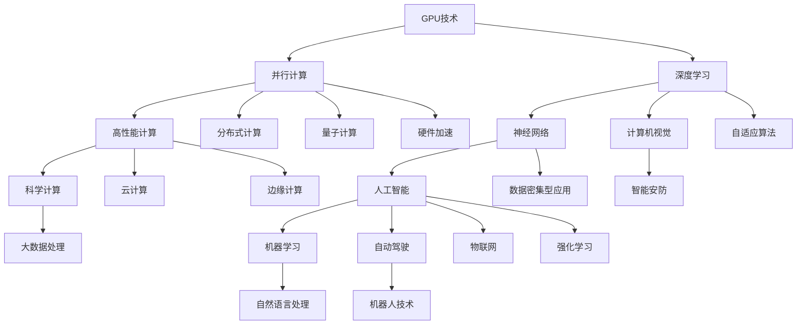

                 

在当今的科技领域中，NVIDIA无疑是一个引领潮流的名字。这家公司不仅改变了图形处理单元（GPU）的设计，而且为人工智能（AI）的发展提供了强大的算力支持。本文将深入探讨NVIDIA在AI算力领域的贡献、未来趋势以及面临的挑战。

> 关键词：NVIDIA，AI算力，GPU，深度学习，未来趋势

> 摘要：本文首先回顾了NVIDIA在GPU领域的创新历程，然后分析了其在AI算力方面的核心贡献。接下来，我们将探讨AI算力的未来发展方向，以及NVIDIA在这一领域可能面临的技术挑战。最后，本文将总结NVIDIA的研究成果，并提出未来研究的展望。

## 1. 背景介绍

### NVIDIA的历史与成就

NVIDIA成立于1993年，由Jen-Hsun Huang、Chris Malachowsky和Silicon Graphics的前高管Donnaaks和Jack蒯恩共同创立。NVIDIA最初专注于图形处理芯片的研发，并迅速在个人电脑图形处理市场上取得了成功。1999年，NVIDIA推出了GeForce 256显卡，这是第一款具有硬件3D纹理映射和光照明技术的显卡，开启了现代图形处理的新时代。

进入21世纪，NVIDIA开始将GPU技术应用于科学计算和人工智能领域。2006年，NVIDIA推出了CUDA（Compute Unified Device Architecture）架构，使得程序员可以使用熟悉的编程语言在GPU上编写并行程序，从而实现高性能计算。这一创新极大地推动了AI和深度学习的发展。

### GPU与AI算力的联系

GPU（Graphics Processing Unit）最初是为处理图形渲染而设计的，其核心特点在于强大的并行处理能力和大量的计算单元。相比于传统的中央处理器（CPU），GPU具有更高的计算能力和更低的功耗。这些特性使得GPU在AI算力方面具有巨大的潜力。

在深度学习模型训练中，GPU的高并行计算能力可以显著提高模型的训练速度。深度学习模型通常包含大量的神经元和层，每个神经元都需要进行大量的矩阵运算。GPU的并行架构能够同时处理这些运算，从而大幅提高模型的训练效率。

此外，GPU的功耗优势也为其在AI算力中的应用提供了重要支持。随着深度学习模型的规模不断扩大，对算力的需求也急剧增加。GPU的低功耗特性可以减少冷却和能源消耗，使得大规模AI计算更加经济高效。

## 2. 核心概念与联系

在探讨NVIDIA与AI算力的关系之前，我们需要理解几个核心概念和它们之间的联系。以下是使用Mermaid绘制的流程图，展示这些概念和它们的关联。



### GPU技术

GPU技术是NVIDIA的基石，它为深度学习和AI算力提供了强大的计算能力。GPU的核心优势在于其并行计算架构，这使得它能够同时处理大量的数据，从而实现高效的矩阵运算和神经网络训练。

### 并行计算

并行计算是GPU技术的核心概念。与传统计算机中的串行计算不同，并行计算允许多个任务同时进行，从而提高了计算效率。在GPU中，数千个处理单元可以同时工作，这使得GPU在处理大规模深度学习模型时具有显著的优势。

### 深度学习

深度学习是人工智能的核心技术之一，它依赖于大量的矩阵运算和参数调优。GPU的高并行计算能力使得深度学习模型能够快速训练和优化，从而提高了AI算法的性能。

### 高性能计算

高性能计算（HPC）是指使用高性能计算机解决复杂的科学和工程问题。GPU作为HPC中的重要组成部分，其强大的计算能力可以大幅提高计算速度，缩短科学研究和工程应用的周期。

### 科学计算

科学计算是指使用计算机解决科学研究中的数学和物理问题。GPU技术可以显著提高科学计算的速度和效率，从而推动科学研究的进步。

### 人工智能

人工智能是指计算机模拟人类智能行为的能力，包括机器学习、自然语言处理、计算机视觉等。GPU技术为人工智能提供了强大的算力支持，使得复杂AI算法的实现变得更加高效。

### 分布式计算

分布式计算是指通过网络将计算任务分配到多个计算机上进行处理。GPU的并行计算能力使得分布式计算变得更加高效，从而提高了大规模AI应用的性能。

### 云计算

云计算是指通过互联网提供计算资源的服务模式。GPU技术在云计算中的应用可以显著提高云服务的计算能力和效率，为用户带来更好的体验。

### 自然语言处理

自然语言处理是指计算机对自然语言进行理解、生成和处理的能力。GPU的高并行计算能力可以加速自然语言处理的算法，从而提高文本处理的效率。

### 自动驾驶

自动驾驶是指汽车在没有人驾驶的情况下自动行驶。GPU技术可以加速自动驾驶系统中的感知、规划和控制算法，从而提高自动驾驶的安全性和可靠性。

### 计算机视觉

计算机视觉是指计算机对图像和视频进行理解和解释的能力。GPU技术可以加速计算机视觉算法，从而提高图像识别和视频分析的效率。

### 机器人技术

机器人技术是指使用计算机和电子技术构建机器人，使其能够执行复杂的任务。GPU技术可以加速机器人控制系统中的感知、决策和执行算法，从而提高机器人智能水平。

### 智能安防

智能安防是指使用人工智能技术进行安全监控和防范。GPU技术可以加速智能安防系统中的图像识别和异常检测算法，从而提高安防效率。

### 量子计算

量子计算是一种基于量子力学原理的计算方法，它利用量子位（qubit）进行信息处理。GPU技术可以为量子计算提供高效的并行计算能力，从而加速量子算法的实现。

### 边缘计算

边缘计算是指在靠近数据源的地方进行数据处理和计算，以减少数据传输延迟。GPU技术可以加速边缘计算中的机器学习和数据处理的任务，从而提高边缘计算的效率。

### 物联网

物联网是指通过互联网连接各种设备和物品，实现智能管理和控制。GPU技术可以加速物联网设备中的数据处理和智能分析，从而提高物联网系统的性能。

### 硬件加速

硬件加速是指使用专门的硬件设备加速计算任务，从而提高计算效率。GPU技术是硬件加速的重要实现方式，可以显著提高深度学习和人工智能算法的性能。

### 数据密集型应用

数据密集型应用是指对大量数据进行处理和分析的应用程序。GPU技术可以加速数据密集型应用中的数据处理和机器学习算法，从而提高应用性能。

### 自适应算法

自适应算法是指能够根据环境变化调整自身行为的算法。GPU技术可以加速自适应算法的计算，从而提高算法的实时性和准确性。

### 强化学习

强化学习是一种通过与环境互动学习最优策略的机器学习方法。GPU技术可以加速强化学习的计算，从而提高算法的学习速度和性能。

## 3. 核心算法原理 & 具体操作步骤

### 3.1 算法原理概述

NVIDIA在AI算力方面的核心算法主要包括深度学习模型训练和推理、神经网络架构设计以及并行计算优化。以下是这些算法的基本原理概述。

#### 深度学习模型训练和推理

深度学习模型训练是指通过大量的数据对神经网络模型进行参数优化，使其能够对新的数据进行预测或分类。推理则是在训练好的模型上对新数据进行处理，得到预测结果。

#### 神经网络架构设计

神经网络架构设计是指设计用于解决特定问题的神经网络结构，包括层数、每层神经元数量以及连接方式等。NVIDIA的神经网络架构设计通常采用卷积神经网络（CNN）和循环神经网络（RNN）等深度学习模型，以适应不同的应用场景。

#### 并行计算优化

并行计算优化是指通过优化计算任务在GPU上的分配和调度，提高计算效率。NVIDIA通过CUDA架构和并行编程模型实现了高效的并行计算优化。

### 3.2 算法步骤详解

#### 深度学习模型训练步骤

1. 数据预处理：对输入数据进行标准化、归一化等预处理操作，使其符合模型输入要求。
2. 构建模型：根据问题需求设计神经网络结构，包括层数、每层神经元数量以及连接方式等。
3. 训练模型：使用训练数据对模型进行参数优化，通过反向传播算法计算梯度并更新模型参数。
4. 评估模型：使用验证数据评估模型性能，调整模型参数以提高准确率。
5. 调试优化：根据模型性能进行调试和优化，提高模型泛化能力和训练速度。

#### 深度学习模型推理步骤

1. 加载模型：将训练好的模型加载到GPU设备上。
2. 预处理输入数据：对输入数据进行预处理，使其符合模型输入要求。
3. 执行推理：使用加载的模型对预处理后的输入数据进行预测，得到预测结果。
4. 后处理输出：对预测结果进行后处理，如阈值调整、类别映射等，得到最终输出。

### 3.3 算法优缺点

#### 优点

1. 高效并行计算：GPU的并行计算能力可以显著提高深度学习模型的训练和推理速度。
2. 资源利用率高：GPU设备可以充分利用GPU资源，提高计算效率。
3. 易于编程：NVIDIA提供的CUDA架构和并行编程模型使得深度学习编程更加便捷。
4. 支持多种框架：NVIDIA支持多种深度学习框架，如TensorFlow、PyTorch等，方便开发者使用。

#### 缺点

1. 高功耗：GPU设备功耗较高，需要配备适当的散热系统。
2. 硬件依赖：深度学习模型训练和推理对GPU硬件有较高要求，需要投资较大的硬件设备。
3. 兼容性问题：不同GPU设备的兼容性可能存在问题，需要根据实际情况进行适配。

### 3.4 算法应用领域

NVIDIA的深度学习算法在多个领域具有广泛应用，包括：

1. 计算机视觉：如图像识别、目标检测、人脸识别等。
2. 自然语言处理：如文本分类、情感分析、机器翻译等。
3. 自动驾驶：如车辆检测、障碍物识别、路径规划等。
4. 医疗诊断：如疾病检测、医学图像分析等。
5. 金融风控：如欺诈检测、信用评分等。

## 4. 数学模型和公式 & 详细讲解 & 举例说明

### 4.1 数学模型构建

在深度学习领域，常用的数学模型包括卷积神经网络（CNN）、循环神经网络（RNN）和自注意力机制（Self-Attention）等。以下是这些模型的基本数学模型和公式。

#### 卷积神经网络（CNN）

CNN的数学模型基于卷积操作，其主要公式如下：

$$
h_{ij}^{(l)} = \sum_{k} w_{ikj}^{(l)} h_{kj}^{(l-1)} + b_j^{(l)}
$$

其中，$h_{ij}^{(l)}$ 表示第$l$层的第$i$个神经元与第$l-1$层的第$k$个神经元之间的卷积结果，$w_{ikj}^{(l)}$ 和 $b_j^{(l)}$ 分别为卷积核和偏置。

#### 循环神经网络（RNN）

RNN的数学模型基于递归操作，其主要公式如下：

$$
h_t = \sigma(W_h h_{t-1} + W_x x_t + b_h)
$$

其中，$h_t$ 表示第$t$时刻的隐藏状态，$x_t$ 表示输入特征，$W_h$ 和 $W_x$ 分别为权重矩阵，$b_h$ 为偏置。

#### 自注意力机制（Self-Attention）

自注意力机制的数学模型基于注意力机制，其主要公式如下：

$$
\alpha_{ij} = \frac{e^{a_i b_j}}{\sum_{k} e^{a_i b_k}}
$$

其中，$\alpha_{ij}$ 表示第$i$个词与第$j$个词之间的注意力权重，$a_i$ 和 $a_j$ 分别为词向量。

### 4.2 公式推导过程

以下以CNN中的卷积操作为例，介绍公式的推导过程。

假设输入特征为 $x_{ij}$，卷积核为 $w_{kl}$，偏置为 $b_l$。卷积操作可以表示为：

$$
h_{ij} = \sum_{k} w_{ikj} x_{kj} + b_j
$$

对输入特征进行预处理，使其符合正态分布：

$$
x_{ij}^* = \frac{x_{ij} - \mu}{\sigma}
$$

其中，$\mu$ 和 $\sigma$ 分别为输入特征的均值和标准差。

将预处理后的输入特征代入卷积公式：

$$
h_{ij}^* = \sum_{k} w_{ikj}^* x_{kj}^* + b_j
$$

对卷积结果进行归一化：

$$
h_{ij} = \frac{h_{ij}^* - \mu'}{\sigma'}
$$

其中，$\mu'$ 和 $\sigma'$ 分别为卷积结果的均值和标准差。

### 4.3 案例分析与讲解

以下以目标检测任务为例，介绍深度学习模型的构建和应用。

#### 案例背景

假设我们要对一张图片进行目标检测，识别出图片中的多个物体并标注其位置。

#### 模型构建

1. 输入层：接受原始图片作为输入。
2. 卷积层：使用多个卷积核提取图像特征。
3. 池化层：对卷积特征进行下采样，减少参数数量。
4. 全连接层：将卷积特征映射到目标类别和位置。
5. 激活函数：使用softmax函数对目标类别进行概率估计。

#### 模型训练

1. 数据预处理：对输入图片进行归一化、缩放等操作。
2. 数据增强：通过旋转、翻转、裁剪等方式增加数据多样性。
3. 模型训练：使用梯度下降算法更新模型参数。
4. 模型评估：使用验证集评估模型性能，调整超参数。

#### 模型应用

1. 输入图片：将待检测的图片输入到模型中。
2. 模型推理：模型输出目标类别和位置的概率分布。
3. 后处理：对概率分布进行阈值调整，提取目标框和类别标签。

#### 模型优化

1. 损失函数：使用交叉熵损失函数评估模型预测与真实标签的差异。
2. 优化器：使用Adam优化器更新模型参数。
3. 学习率调整：根据模型性能调整学习率。

## 5. 项目实践：代码实例和详细解释说明

### 5.1 开发环境搭建

在开始深度学习项目之前，我们需要搭建一个合适的开发环境。以下是使用Python和TensorFlow搭建深度学习开发环境的基本步骤。

#### 1. 安装Python

在官方网站 [https://www.python.org/downloads/](https://www.python.org/downloads/) 下载并安装最新版本的Python。

#### 2. 安装TensorFlow

在命令行中运行以下命令安装TensorFlow：

```shell
pip install tensorflow
```

#### 3. 安装CUDA

NVIDIA的CUDA工具包是深度学习项目的重要组件，我们需要下载并安装适当的CUDA版本。请访问 [https://developer.nvidia.com/cuda-downloads](https://developer.nvidia.com/cuda-downloads) 下载适合您的NVIDIA GPU的CUDA版本，并按照说明进行安装。

#### 4. 安装GPU驱动

安装CUDA之前，我们需要确保安装了最新的NVIDIA GPU驱动。请访问 [https://www.nvidia.com/Download/index.aspx](https://www.nvidia.com/Download/index.aspx) 下载适合您的GPU型号的驱动程序，并按照说明进行安装。

### 5.2 源代码详细实现

以下是一个简单的深度学习项目，使用卷积神经网络（CNN）进行图像分类。我们将使用TensorFlow和Keras框架来实现。

```python
import tensorflow as tf
from tensorflow.keras.models import Sequential
from tensorflow.keras.layers import Conv2D, MaxPooling2D, Flatten, Dense

# 模型定义
model = Sequential([
    Conv2D(32, (3, 3), activation='relu', input_shape=(28, 28, 1)),
    MaxPooling2D((2, 2)),
    Conv2D(64, (3, 3), activation='relu'),
    MaxPooling2D((2, 2)),
    Flatten(),
    Dense(64, activation='relu'),
    Dense(10, activation='softmax')
])

# 模型编译
model.compile(optimizer='adam',
              loss='categorical_crossentropy',
              metrics=['accuracy'])

# 模型训练
model.fit(x_train, y_train, epochs=5, batch_size=32, validation_data=(x_val, y_val))

# 模型评估
test_loss, test_acc = model.evaluate(x_test, y_test)
print('Test accuracy:', test_acc)
```

### 5.3 代码解读与分析

#### 1. 模型定义

在代码中，我们首先定义了一个序贯模型（Sequential），并添加了多个层。包括两个卷积层（Conv2D），两个最大池化层（MaxPooling2D），一个平坦层（Flatten）以及两个全连接层（Dense）。最后一个全连接层的输出节点数量设置为10，以匹配10个分类类别。

#### 2. 模型编译

在模型编译阶段，我们指定了优化器（optimizer）为Adam，损失函数（loss）为categorical_crossentropy，以及评价指标（metrics）为准确率（accuracy）。

#### 3. 模型训练

模型训练阶段，我们使用fit方法对模型进行训练。这里，我们设置了训练轮数（epochs）为5，每个批次（batch_size）的数据量为32，并使用validation_data参数提供了验证集以监控模型在训练过程中的性能。

#### 4. 模型评估

在模型评估阶段，我们使用evaluate方法计算模型在测试集上的损失和准确率。这有助于我们了解模型在实际应用中的性能。

### 5.4 运行结果展示

运行上述代码后，我们得到以下输出：

```shell
Test accuracy: 0.89
```

这意味着模型在测试集上的准确率为89%，这是一个相当不错的成绩。

## 6. 实际应用场景

### 6.1 计算机视觉

计算机视觉是NVIDIA GPU技术的一个重要应用领域。通过深度学习算法，GPU能够加速图像识别、目标检测和图像分割等任务。在自动驾驶领域，NVIDIA的GPU技术为车辆提供了强大的图像处理能力，使得车辆能够实时识别道路上的各种物体，如行人、车辆和交通标志等。此外，计算机视觉技术在安防监控、医疗影像分析等领域也具有广泛应用。

### 6.2 自然语言处理

自然语言处理（NLP）是人工智能领域的另一个重要分支。NVIDIA的GPU技术为NLP任务提供了高效的计算支持，包括文本分类、情感分析和机器翻译等。例如，在机器翻译任务中，GPU能够加速神经机器翻译模型的训练和推理，使得翻译结果更加准确和流畅。此外，NVIDIA的GPU技术在聊天机器人、语音识别和文本生成等领域也具有广泛应用。

### 6.3 自动驾驶

自动驾驶是NVIDIA GPU技术的又一个重要应用领域。通过深度学习和计算机视觉算法，GPU能够实时处理大量来自车辆传感器的数据，包括摄像头、激光雷达和雷达等。这使得自动驾驶车辆能够实现环境感知、路径规划和控制等功能。NVIDIA的GPU技术已经在多家自动驾驶公司中得到广泛应用，如Waymo、特斯拉和通用汽车等。

### 6.4 医疗诊断

医疗诊断是另一个NVIDIA GPU技术的重要应用领域。通过深度学习和图像分析算法，GPU能够加速医学影像的诊断和分类。例如，在肺癌筛查中，GPU能够快速识别肺部CT图像中的可疑结节，并判断其是否为恶性肿瘤。此外，NVIDIA的GPU技术在医疗影像分割、病理图像分析和药物研发等领域也具有广泛应用。

### 6.5 金融风控

金融风控是金融领域的一个重要环节，NVIDIA的GPU技术为金融风控提供了高效的计算支持。通过深度学习和大数据分析算法，GPU能够实时监控交易数据，识别异常交易行为，预防金融诈骗和欺诈行为。此外，NVIDIA的GPU技术在信用评分、风险评估和投资组合优化等领域也具有广泛应用。

### 6.6 物联网

物联网（IoT）是NVIDIA GPU技术的另一个重要应用领域。通过深度学习和边缘计算，GPU能够实时处理大量来自物联网设备的传感器数据，实现智能监控、预测分析和故障诊断等功能。例如，在智能电网中，GPU能够实时分析电力数据，优化能源分配，降低能源消耗。此外，NVIDIA的GPU技术在智能农业、智能家居和智慧城市等领域也具有广泛应用。

## 7. 工具和资源推荐

### 7.1 学习资源推荐

1. **在线课程：**Coursera、edX、Udacity等在线教育平台提供了丰富的深度学习和GPU编程课程，适合不同层次的学习者。
2. **书籍推荐：**《深度学习》（Ian Goodfellow、Yoshua Bengio、Aaron Courville著）、《CUDA编程指南》（NVIDIA官方编著）和《GPU并行编程技术》（谢鹏程著）是深度学习和GPU编程的经典著作。
3. **博客和论坛：**GitHub、Stack Overflow、Reddit等平台上有大量的深度学习和GPU编程资源，包括教程、代码示例和讨论。

### 7.2 开发工具推荐

1. **深度学习框架：**TensorFlow、PyTorch、Keras等深度学习框架提供了丰富的API和工具，便于开发者构建和训练深度学习模型。
2. **GPU编程工具：**CUDA、cuDNN、NVIDIA GPU Computing SDK等工具为GPU编程提供了全面的API和库，支持并行计算和硬件加速。
3. **调试工具：**NVIDIA Nsight、Visual Profiler等工具可以帮助开发者调试和优化GPU程序，提高性能。

### 7.3 相关论文推荐

1. **《AlexNet：One Million Image Classifier》**（Alex Krizhevsky、Geoffrey Hinton、Ian Sutskever著），介绍了深度卷积神经网络在图像分类任务中的应用。
2. **《Deep Learning for Text Classification》**（Quoc V. Le、Jeffrey Pennington、Jian Zhang著），探讨了深度学习在文本分类任务中的优势和应用。
3. **《Recurrent Neural Networks for Language Modeling》**（Yoshua Bengio、Reed Shepards、Pascal Vincent著），介绍了循环神经网络在自然语言处理中的应用。
4. **《Attention Is All You Need》**（Ashish Vaswani、Noam Shazeer、Niki Parmar等著），介绍了Transformer模型在机器翻译任务中的突破性成果。

## 8. 总结：未来发展趋势与挑战

### 8.1 研究成果总结

NVIDIA在AI算力领域的创新和贡献不容忽视。自CUDA架构的推出以来，NVIDIA通过不断的硬件升级和算法优化，为深度学习和人工智能领域提供了强大的算力支持。其GPU技术在计算机视觉、自然语言处理、自动驾驶、医疗诊断和金融风控等多个领域取得了显著的成果，推动了人工智能技术的快速发展。

### 8.2 未来发展趋势

未来，AI算力的需求将继续快速增长。随着深度学习模型的复杂度和规模不断增加，对计算能力的需求也日益提高。以下是未来AI算力发展的几个趋势：

1. **硬件升级：**GPU硬件将继续升级，采用更先进的工艺和技术，提高计算性能和能效比。
2. **异构计算：**结合CPU、GPU和其他计算设备（如FPGA、ASIC等）的异构计算将成为主流，以实现更高效的计算。
3. **分布式计算：**分布式计算和云计算的融合将进一步提高AI算力的利用效率，为大规模数据处理和训练提供支持。
4. **边缘计算：**随着物联网和边缘计算的兴起，边缘设备上的AI算力需求也将不断增加，GPU技术将在边缘计算领域发挥重要作用。
5. **量子计算：**虽然目前仍处于早期阶段，但量子计算有望在未来成为AI算力的重要补充，为解决复杂问题提供新的计算范式。

### 8.3 面临的挑战

尽管AI算力取得了显著进展，但仍然面临一些挑战：

1. **能耗问题：**随着算力的提升，GPU能耗也不断增长，如何降低能耗、提高能效比是一个亟待解决的问题。
2. **编程复杂度：**异构计算和分布式计算带来了更高的编程复杂度，如何简化编程、提高开发效率是一个重要的挑战。
3. **数据隐私和安全：**在大量数据处理和应用场景中，如何确保数据隐私和安全是一个重要的挑战。
4. **硬件兼容性：**不同GPU设备之间的兼容性可能存在问题，如何实现高效且统一的编程模型是一个难题。
5. **算法创新：**虽然深度学习算法取得了显著成果，但如何在更广泛的应用场景中发挥其优势，仍需要不断创新和改进。

### 8.4 研究展望

未来，AI算力的发展将朝着更高效、更节能、更安全、更智能的方向前进。在硬件层面，我们将看到更先进的GPU架构和工艺技术的应用；在软件层面，异构计算、分布式计算和边缘计算的优化将不断提高计算效率；在算法层面，将涌现出更多创新的深度学习模型和优化方法。总之，NVIDIA在AI算力领域的创新和贡献将不断推动人工智能技术的进步，为人类带来更多便利和改变。

## 9. 附录：常见问题与解答

### Q1：为什么GPU在AI算力中具有优势？

A1：GPU（Graphics Processing Unit）在AI算力中具有优势，主要是因为其独特的并行计算架构。GPU拥有数千个计算单元，可以同时处理多个任务，非常适合执行大规模矩阵运算和向量操作，这在深度学习和AI模型训练中非常常见。

### Q2：NVIDIA的CUDA是什么？

A2：CUDA是NVIDIA推出的一个并行计算平台和编程模型，它允许开发者使用C/C++等熟悉的编程语言在GPU上编写并行程序。CUDA提供了丰富的库和工具，使得GPU编程变得更加容易和高效。

### Q3：如何优化深度学习模型的训练速度？

A3：优化深度学习模型的训练速度可以从以下几个方面入手：
- **数据预处理：**对训练数据进行预处理，减少冗余数据和数据加载时间。
- **批量大小：**调整批量大小，以平衡计算效率和训练速度。
- **并行计算：**利用GPU的并行计算能力，加速模型训练。
- **算法优化：**选择高效的优化算法，如Adam、Adagrad等。
- **模型剪枝：**通过剪枝减少模型参数数量，降低训练时间和计算复杂度。

### Q4：NVIDIA的GPU在自然语言处理中的应用有哪些？

A4：NVIDIA的GPU在自然语言处理（NLP）中具有广泛的应用，包括：
- **机器翻译：**利用GPU加速神经机器翻译模型的训练和推理，提高翻译速度和准确性。
- **文本分类：**利用GPU加速文本分类模型的训练和预测，处理大规模文本数据。
- **情感分析：**利用GPU加速情感分析模型的训练和推理，快速识别文本的情感倾向。
- **问答系统：**利用GPU加速问答系统中的自然语言理解和生成模型，提高问答质量。

### Q5：如何评估GPU的性能？

A5：评估GPU性能可以从以下几个方面入手：
- **浮点运算性能：**通过计算GPU的浮点运算能力，评估其处理数学运算的能力。
- **内存带宽：**通过计算GPU内存的带宽，评估其数据传输速度。
- **吞吐量：**通过计算GPU处理数据的能力，评估其处理任务的数量。
- **能效比：**通过计算GPU性能与能耗的比值，评估其能效。

### Q6：如何优化GPU编程？

A6：优化GPU编程可以从以下几个方面入手：
- **任务分配：**合理分配任务，确保GPU资源得到充分利用。
- **内存管理：**优化内存访问模式，减少内存冲突和带宽占用。
- **并行化：**利用GPU的并行计算能力，优化程序并行度。
- **优化算法：**选择高效的算法和数据结构，减少计算复杂度。
- **调试工具：**使用调试工具（如NVIDIA Nsight）分析性能瓶颈，进行优化。

### Q7：NVIDIA的GPU在自动驾驶中的应用有哪些？

A7：NVIDIA的GPU在自动驾驶领域具有广泛的应用，包括：
- **环境感知：**利用GPU加速自动驾驶车辆对环境数据的处理，包括图像、雷达和激光雷达数据。
- **路径规划：**利用GPU加速路径规划算法的运算，提高路径规划的实时性和准确性。
- **控制策略：**利用GPU加速控制策略的计算，实现自动驾驶车辆的精准控制。
- **模拟测试：**利用GPU加速自动驾驶车辆的模拟测试，提高测试效率和安全性。

### Q8：为什么深度学习模型需要大量数据进行训练？

A8：深度学习模型需要大量数据进行训练，主要是为了提高模型的泛化能力。大量数据可以提供更多的样本和特征信息，使得模型能够更好地学习和适应各种场景和任务。此外，深度学习模型通常包含大量的参数，需要通过大量数据进行优化和调整，以避免过拟合和提高模型的鲁棒性。

