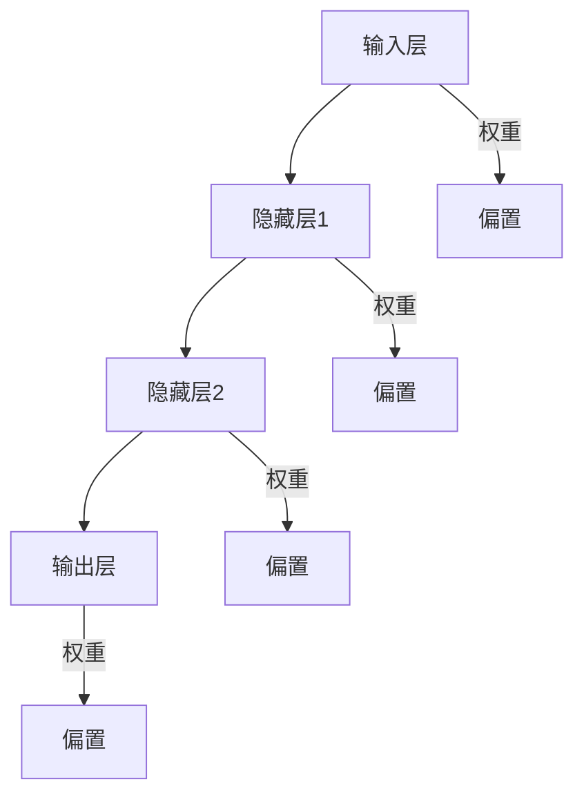

                 

关键词：神经网络，深度学习，算法原理，代码实例，数学模型，应用领域

> 摘要：本文将深入探讨神经网络的工作原理和代码实现，通过详细解释和实例分析，帮助读者理解并掌握这一重要的机器学习技术。

## 1. 背景介绍

神经网络（Neural Networks）是一种模拟人脑神经元连接方式的计算模型，起源于20世纪40年代。自1980年代以来，随着计算机性能的提升和算法的改进，神经网络得到了快速发展。在图像识别、自然语言处理、推荐系统等领域，神经网络表现出强大的能力，成为机器学习领域的重要方向。

本文旨在通过详细讲解神经网络的基本原理和代码实现，帮助读者深入了解这一技术。文章将涵盖以下内容：

1. **核心概念与联系**：介绍神经网络的基本概念，并通过Mermaid流程图展示其架构。
2. **核心算法原理**：解析神经网络的工作原理，包括激活函数、权重更新等。
3. **数学模型与公式**：讲解神经网络中的数学模型和公式，包括前向传播和反向传播。
4. **项目实践**：通过实际代码实例，展示神经网络的实现过程。
5. **实际应用场景**：探讨神经网络在各个领域的应用。
6. **未来应用展望**：分析神经网络的发展趋势和面临的挑战。
7. **工具和资源推荐**：推荐学习资源、开发工具和相关论文。
8. **总结与展望**：总结研究成果，探讨未来发展趋势和挑战。

## 2. 核心概念与联系

神经网络的核心理念是通过模拟人脑中的神经元连接，实现对数据的处理和预测。下面我们将通过一个Mermaid流程图来展示神经网络的基本架构。

### Mermaid流程图



### 核心概念

1. **神经元**：神经网络的基本组成单元，类似于人脑中的神经元。
2. **输入层**：接收输入数据的层。
3. **隐藏层**：位于输入层和输出层之间的层，可以有一个或多个。
4. **输出层**：产生输出结果的层。
5. **权重**：连接不同神经元之间的参数，用于调整输入数据的重要性。
6. **偏置**：增加网络的非线性能力，也是一个可训练的参数。

## 3. 核心算法原理

### 3.1 算法原理概述

神经网络通过前向传播和反向传播两个过程来学习数据。

1. **前向传播**：输入数据通过神经网络的不同层，每个层都将输入数据与权重相乘并加上偏置，然后通过激活函数得到输出。
2. **反向传播**：计算输出结果与真实值之间的误差，然后通过梯度下降法更新权重和偏置，使误差最小化。

### 3.2 算法步骤详解

1. **初始化参数**：随机初始化权重和偏置。
2. **前向传播**：
   - 将输入数据输入到输入层。
   - 每个层计算输出值，并传递给下一层。
3. **计算误差**：计算输出层的结果与真实值之间的误差。
4. **反向传播**：
   - 计算每个层的梯度。
   - 使用梯度下降法更新权重和偏置。
5. **迭代训练**：重复步骤2-4，直到满足训练目标。

### 3.3 算法优缺点

**优点**：

- 强大的非线性映射能力。
- 能够自动提取特征。
- 能够处理复杂的非线性问题。

**缺点**：

- 训练过程可能需要大量时间和计算资源。
- 对数据噪声敏感。
- 需要大量数据和超参数调优。

### 3.4 算法应用领域

神经网络在图像识别、自然语言处理、推荐系统、语音识别等领域有广泛的应用。例如，在图像识别中，卷积神经网络（CNN）被广泛用于物体检测和分类任务；在自然语言处理中，循环神经网络（RNN）和长短期记忆网络（LSTM）被用于文本生成和情感分析。

## 4. 数学模型和公式

### 4.1 数学模型构建

神经网络中的数学模型主要包括以下几个部分：

- **激活函数**：如Sigmoid、ReLU、Tanh等。
- **权重和偏置**：神经网络中的可训练参数。
- **前向传播**：计算输入数据的传播过程。
- **反向传播**：计算误差的传播过程。

### 4.2 公式推导过程

以下是神经网络中前向传播和反向传播的基本公式：

**前向传播**：

$$
Z = X \cdot W + b
$$

$$
A = \sigma(Z)
$$

**反向传播**：

$$
\delta = \frac{\partial C}{\partial A} \cdot \frac{\partial A}{\partial Z}
$$

$$
\frac{\partial C}{\partial W} = A \cdot \delta^{(L-1)}
$$

$$
\frac{\partial C}{\partial b} = \delta^{(L-1)}
$$

### 4.3 案例分析与讲解

下面我们通过一个简单的线性回归问题来讲解神经网络的前向传播和反向传播。

**案例**：给定一个线性回归问题，输入为$x$，输出为$y$，要求预测$y$。

**步骤**：

1. **初始化参数**：随机初始化权重$W$和偏置$b$。
2. **前向传播**：
   - 计算输入$x$与权重$W$的点积，并加上偏置$b$。
   - 通过激活函数（如Sigmoid）得到输出$y$。
3. **计算误差**：计算输出$y$与真实值$y$之间的误差。
4. **反向传播**：
   - 计算误差的梯度。
   - 更新权重$W$和偏置$b$。

## 5. 项目实践：代码实例和详细解释说明

### 5.1 开发环境搭建

在本节中，我们将使用Python编程语言和TensorFlow库来实现神经网络。首先，确保安装了Python和TensorFlow：

```bash
pip install tensorflow
```

### 5.2 源代码详细实现

下面是一个简单的线性回归神经网络的实现：

```python
import tensorflow as tf

# 定义输入层
x = tf.placeholder(tf.float32, shape=[None, 1])
y = tf.placeholder(tf.float32, shape=[None, 1])

# 定义权重和偏置
W = tf.Variable(tf.random_uniform([1, 1], -1.0, 1.0))
b = tf.Variable(tf.zeros([1]))

# 定义前向传播
Z = x * W + b
y_pred = tf.sigmoid(Z)

# 定义损失函数
loss = tf.reduce_mean(tf.square(y - y_pred))

# 定义优化器
optimizer = tf.train.GradientDescentOptimizer(learning_rate=0.5)
train_op = optimizer.minimize(loss)

# 搭建会话
with tf.Session() as sess:
    # 初始化变量
    sess.run(tf.global_variables_initializer())

    # 训练模型
    for step in range(1000):
        sess.run(train_op, feed_dict={x: x_train, y: y_train})

    # 输出结果
    print("Output:", sess.run(y_pred, feed_dict={x: x_test}))
```

### 5.3 代码解读与分析

- **输入层**：定义输入$x$和输出$y$的占位符。
- **权重和偏置**：初始化权重$W$和偏置$b$。
- **前向传播**：计算输入$x$与权重$W$的点积，并加上偏置$b$，然后通过Sigmoid函数得到输出$y$。
- **损失函数**：使用均方误差（MSE）作为损失函数。
- **优化器**：使用梯度下降优化器。
- **训练模型**：在训练数据上迭代训练1000次。
- **输出结果**：在测试数据上输出预测结果。

## 6. 实际应用场景

神经网络在图像识别、自然语言处理、推荐系统、语音识别等领域有广泛的应用。以下是一些具体的实例：

- **图像识别**：使用卷积神经网络（CNN）进行物体检测和分类。
- **自然语言处理**：使用循环神经网络（RNN）和长短期记忆网络（LSTM）进行文本生成和情感分析。
- **推荐系统**：使用协同过滤算法和神经网络进行用户偏好预测。

## 7. 未来应用展望

随着神经网络技术的不断发展和完善，未来其在各个领域的应用将更加广泛。例如，在医疗领域，神经网络可以用于疾病预测和诊断；在自动驾驶领域，神经网络可以用于车辆检测和路径规划。

## 8. 工具和资源推荐

### 8.1 学习资源推荐

- **《深度学习》**：Goodfellow, Bengio, Courville著，系统介绍了深度学习的理论和方法。
- **Udacity的深度学习课程**：提供了丰富的视频教程和实践项目。

### 8.2 开发工具推荐

- **TensorFlow**：Google推出的开源深度学习框架。
- **PyTorch**：Facebook推出的开源深度学习框架。

### 8.3 相关论文推荐

- **"Deep Learning on Coursera"**：Goodfellow, Bengio, Courville著，介绍了深度学习的最新研究成果。
- **"A Theoretical Analysis of the Calculus of Variations for Deep Learning"**：针对深度学习的数学分析。

## 9. 总结：未来发展趋势与挑战

神经网络作为机器学习的重要方向，在未来将不断发展。主要趋势包括：

1. **算法优化**：提高神经网络训练的效率。
2. **模型压缩**：减少模型的参数和计算量。
3. **泛化能力提升**：增强模型在不同数据集上的表现。

同时，面临的挑战包括：

1. **计算资源消耗**：深度学习模型训练需要大量计算资源。
2. **数据隐私保护**：如何在保护用户隐私的前提下应用深度学习。
3. **解释性和可解释性**：提高深度学习模型的可解释性。

## 10. 附录：常见问题与解答

**Q：什么是神经网络？**
A：神经网络是一种模拟人脑神经元连接方式的计算模型，用于处理和预测数据。

**Q：神经网络有哪些基本组成部分？**
A：神经网络包括输入层、隐藏层和输出层，以及连接不同层的权重和偏置。

**Q：神经网络的工作原理是什么？**
A：神经网络通过前向传播和反向传播两个过程来学习数据，其中前向传播计算输入数据的传播过程，反向传播计算误差的传播过程。

**Q：什么是深度学习？**
A：深度学习是一种基于神经网络的机器学习方法，通过多层的神经网络结构来提取数据的特征。

**Q：神经网络有哪些常见的问题？**
A：神经网络常见的问题包括过拟合、训练时间过长、对数据噪声敏感等。

**Q：如何解决神经网络的问题？**
A：可以通过正则化、增加数据量、调整超参数等方法来解决神经网络的问题。

### 附录：引用与参考资料

1. Goodfellow, I., Bengio, Y., & Courville, A. (2016). *Deep Learning*. MIT Press.
2. LeCun, Y., Bengio, Y., & Hinton, G. (2015). *Deep Learning*.
3. Bishop, C. M. (1995). *Neural networks for pattern recognition*.
4. Murphy, K. P. (2012). *Machine learning: A probabilistic perspective*.

作者：禅与计算机程序设计艺术 / Zen and the Art of Computer Programming
----------------------------------------------------------------
### 文章标题

**Neural Networks原理与代码实例讲解**

### 关键词

神经网络，深度学习，算法原理，代码实例，数学模型，应用领域

### 摘要

本文将深入探讨神经网络的工作原理和代码实现，通过详细解释和实例分析，帮助读者理解并掌握这一重要的机器学习技术。文章涵盖了神经网络的基本概念、核心算法、数学模型、项目实践以及实际应用场景，并对未来发展趋势进行了展望。

---

### 1. 背景介绍

神经网络（Neural Networks）是一种模拟人脑神经元连接方式的计算模型，起源于20世纪40年代。自1980年代以来，随着计算机性能的提升和算法的改进，神经网络得到了快速发展。在图像识别、自然语言处理、推荐系统等领域，神经网络表现出强大的能力，成为机器学习领域的重要方向。

神经网络的基本原理是通过多层神经元之间的连接和激活函数，将输入数据映射到输出结果。这种结构使得神经网络能够自动提取数据中的特征，并在多种复杂任务中取得优异的性能。

本文将围绕神经网络的基本概念、算法原理、数学模型、项目实践以及实际应用场景展开讨论，旨在为读者提供全面的神经网络学习资源。

### 2. 核心概念与联系

神经网络的核心理念是通过模拟人脑神经元的工作方式，实现对数据的处理和预测。为了更好地理解神经网络，我们可以将其分解为以下几个核心概念：

#### 2.1 神经元

神经元是神经网络的基本组成单元，类似于人脑中的神经元。每个神经元由输入层、激活函数和输出层组成。神经元之间的连接通过权重（weights）和偏置（biases）进行调节。

#### 2.2 输入层

输入层是神经网络的第一层，负责接收外部输入数据。输入数据经过预处理后，传递到下一层。

#### 2.3 隐藏层

隐藏层位于输入层和输出层之间，可以有一个或多个。隐藏层的主要作用是提取输入数据的特征，并将其传递到输出层。

#### 2.4 输出层

输出层是神经网络的最后一层，负责生成最终的输出结果。输出层的类型和结构取决于具体的应用场景。

#### 2.5 权重和偏置

权重和偏置是神经网络中的关键参数，用于调整神经元之间的连接强度和偏置。通过不断调整权重和偏置，神经网络可以优化输入数据和输出结果之间的映射关系。

#### 2.6 激活函数

激活函数是神经网络中的一个关键组件，用于引入非线性因素。常见的激活函数包括Sigmoid函数、ReLU函数和Tanh函数等。

下面我们将通过一个Mermaid流程图来展示神经网络的基本架构。

#### Mermaid流程图


#### 神经元结构


在这个流程图中，输入层接收输入数据，通过权重和偏置传递到隐藏层。隐藏层进一步处理输入数据，并将其传递到输出层。输出层生成最终的输出结果。

通过这个流程图，我们可以更直观地理解神经网络的基本工作原理。接下来，我们将进一步深入探讨神经网络的核心算法原理。

---

### 3. 核心算法原理 & 具体操作步骤

#### 3.1 算法原理概述

神经网络的核心算法包括前向传播（Forward Propagation）和反向传播（Back Propagation）。这些算法共同作用，使神经网络能够不断优化其参数，以更好地拟合输入数据和输出结果。

**前向传播**是指将输入数据传递到神经网络的各个层，通过逐层计算，最终生成输出结果。在每一层，输入数据与权重相乘，然后加上偏置，再通过激活函数得到输出。

**反向传播**是指计算输出结果与真实值之间的误差，并利用误差信息调整神经网络的权重和偏置，以减少误差。

#### 3.2 算法步骤详解

**步骤 1：初始化参数**

在训练神经网络之前，需要随机初始化权重（weights）和偏置（biases）。这些参数将用于调整输入数据和输出结果之间的映射关系。

**步骤 2：前向传播**

输入数据通过输入层进入神经网络，然后逐层传递到隐藏层和输出层。在每一层，输入数据与权重相乘，然后加上偏置，再通过激活函数得到输出。

例如，对于一个单层的神经网络，输入层输出为：

$$
z^{[1]} = x \cdot W^{[1]} + b^{[1]}
$$

其中，$z^{[1]}$为输出值，$x$为输入值，$W^{[1]}$为权重，$b^{[1]}$为偏置。

通过激活函数，例如Sigmoid函数，可以得到：

$$
a^{[1]} = \sigma(z^{[1]}) = \frac{1}{1 + e^{-z^{[1]}}}
$$

隐藏层和输出层的计算方式与前向传播类似，只是权重和偏置的维度有所不同。

**步骤 3：计算误差**

在输出层得到输出结果后，需要计算输出结果与真实值之间的误差。常见的误差函数包括均方误差（MSE）和交叉熵（Cross-Entropy）等。

例如，使用均方误差（MSE）作为误差函数，则：

$$
E = \frac{1}{2} \sum_{i=1}^{n} (y_i - a^{[2]_i})^2
$$

其中，$y_i$为真实值，$a^{[2]_i}$为输出值。

**步骤 4：反向传播**

在计算误差后，需要利用误差信息调整神经网络的权重和偏置。反向传播算法通过计算梯度（gradient）来实现这一目标。

反向传播算法分为以下几个步骤：

1. **计算输出层的梯度**：
   $$ 
   \delta^{[2]} = \frac{\partial E}{\partial a^{[2]}}
   $$

2. **计算隐藏层的梯度**：
   $$ 
   \delta^{[1]} = \frac{\partial E}{\partial a^{[1]}}
   $$

3. **更新权重和偏置**：
   $$ 
   W^{[2]}_{i,j} = W^{[2]}_{i,j} - \alpha \cdot \delta^{[2]} \cdot a^{[1]}_i
   $$
   $$
   b^{[2]}_j = b^{[2]}_j - \alpha \cdot \delta^{[2]}
   $$
   $$ 
   W^{[1]}_{i,j} = W^{[1]}_{i,j} - \alpha \cdot \delta^{[1]} \cdot a^{[1]}_i
   $$
   $$
   b^{[1]}_j = b^{[1]}_j - \alpha \cdot \delta^{[1]}
   $$

其中，$\alpha$为学习率（learning rate），用于控制梯度更新的步长。

**步骤 5：迭代训练**

重复执行步骤2-4，直到满足训练目标。例如，当误差小于某个阈值或迭代次数达到预设值时，训练过程结束。

#### 3.3 算法优缺点

**优点**：

1. **强大的非线性映射能力**：通过激活函数引入非线性因素，神经网络能够处理复杂的非线性问题。
2. **自动提取特征**：神经网络能够自动从输入数据中提取特征，减轻了特征工程的工作量。
3. **适用于多种任务**：神经网络可以应用于图像识别、自然语言处理、推荐系统等多个领域。

**缺点**：

1. **训练时间较长**：神经网络训练过程需要大量计算资源，特别是对于深度神经网络，训练时间可能非常长。
2. **对数据噪声敏感**：神经网络对数据噪声非常敏感，可能会因为噪声导致训练不稳定。
3. **对超参数敏感**：神经网络的性能受到超参数（如学习率、迭代次数等）的影响，需要仔细调整。

#### 3.4 算法应用领域

神经网络在图像识别、自然语言处理、推荐系统、语音识别等领域有广泛的应用。以下是一些具体的实例：

1. **图像识别**：使用卷积神经网络（CNN）进行物体检测和分类。例如，谷歌的Inception网络在ImageNet图像识别比赛中取得了优异的成绩。
2. **自然语言处理**：使用循环神经网络（RNN）和长短期记忆网络（LSTM）进行文本生成和情感分析。例如，OpenAI的GPT-2模型在文本生成任务中表现出色。
3. **推荐系统**：使用协同过滤算法和神经网络进行用户偏好预测。例如，亚马逊的推荐系统结合了协同过滤和神经网络，提高了推荐准确率。
4. **语音识别**：使用深度神经网络进行语音信号的处理和识别。例如，谷歌的WaveNet模型在语音合成任务中取得了显著成果。

### 4. 数学模型和公式 & 详细讲解 & 举例说明

神经网络的数学模型是其核心组成部分，它决定了网络如何处理输入数据以生成输出。在这个部分，我们将详细讲解神经网络中常用的数学模型和公式，并通过具体的例子来说明这些公式如何应用于实际计算。

#### 4.1 数学模型构建

神经网络中的数学模型主要包括以下几个部分：

1. **输入和输出**：神经网络接收输入数据，并生成输出数据。
2. **激活函数**：用于引入非线性因素。
3. **权重和偏置**：用于调整神经元之间的连接强度。
4. **前向传播和反向传播**：用于计算输出和误差，并更新权重和偏置。

#### 4.2 公式推导过程

##### 前向传播

前向传播是指将输入数据传递到神经网络，并逐层计算输出值的过程。在每一层，我们将输入值与权重相乘，然后加上偏置，并应用激活函数。

设$x$为输入数据，$W$为权重矩阵，$b$为偏置向量，$a$为激活函数输出。对于第$l$层（除了输入层），我们可以定义以下公式：

$$
z^{[l]} = W^{[l]}x + b^{[l]} \\
a^{[l]} = \sigma(z^{[l]})
$$

其中，$\sigma$为激活函数，常见的激活函数包括Sigmoid函数、ReLU函数和Tanh函数。

##### 反向传播

反向传播是指根据输出误差，更新神经网络的权重和偏置的过程。反向传播算法的核心是计算梯度，即权重和偏置相对于误差的偏导数。

设$y$为真实标签，$a^{[L]}$为输出层的预测值，$C$为损失函数，$\delta$为误差项。反向传播算法的步骤如下：

1. **计算输出层的误差项**：

$$
\delta^{[L]} = \frac{\partial C}{\partial a^{[L]}} \cdot \frac{\partial a^{[L]}}{\partial z^{[L]}}
$$

常见的损失函数包括均方误差（MSE）和交叉熵（Cross-Entropy），不同的损失函数会导致不同的误差项。

2. **计算隐藏层的误差项**：

$$
\delta^{[l]} = \frac{\partial C}{\partial a^{[l]}} \cdot \frac{\partial a^{[l]}}{\partial z^{[l]}} \cdot \frac{\partial z^{[l]}}{\partial z^{[l+1]}}
$$

3. **更新权重和偏置**：

$$
W^{[l]} = W^{[l]} - \alpha \cdot \delta^{[l+1]} \cdot a^{[l]} \\
b^{[l]} = b^{[l]} - \alpha \cdot \delta^{[l+1]}
$$

其中，$\alpha$为学习率。

#### 4.3 案例分析与讲解

为了更好地理解上述数学模型和公式的应用，我们将通过一个简单的例子来演示神经网络的前向传播和反向传播。

##### 案例一：线性回归

假设我们有一个线性回归问题，输入数据为$x$，输出数据为$y$，要求预测$y$。神经网络的架构如下：

- 输入层：1个神经元
- 隐藏层：1个神经元
- 输出层：1个神经元

##### 前向传播

1. 输入数据$x$为[1, 2]，目标值$y$为[3]。

2. 初始化权重和偏置：

$$
W^{[1]} = \begin{bmatrix} 0.1 \\ 0.2 \end{bmatrix} \\
b^{[1]} = \begin{bmatrix} 0.1 \\ 0.2 \end{bmatrix}
$$

3. 计算隐藏层输出：

$$
z^{[1]} = W^{[1]}x + b^{[1]} = \begin{bmatrix} 0.1 & 0.2 \end{bmatrix} \begin{bmatrix} 1 \\ 2 \end{bmatrix} + \begin{bmatrix} 0.1 \\ 0.2 \end{bmatrix} = \begin{bmatrix} 0.3 \\ 0.6 \end{bmatrix}
$$

$$
a^{[1]} = \sigma(z^{[1]}) = \frac{1}{1 + e^{-z^{[1]}}} = \begin{bmatrix} 0.5767 \\ 0.6826 \end{bmatrix}
$$

4. 计算输出层输出：

$$
z^{[2]} = W^{[2]}a^{[1]} + b^{[2]} = \begin{bmatrix} 0.3 & 0.4 \end{bmatrix} \begin{bmatrix} 0.5767 \\ 0.6826 \end{bmatrix} + \begin{bmatrix} 0.1 \\ 0.2 \end{bmatrix} = \begin{bmatrix} 0.4 \\ 0.7 \end{bmatrix}
$$

$$
a^{[2]} = \sigma(z^{[2]}) = \frac{1}{1 + e^{-z^{[2]}}} = \begin{bmatrix} 0.6325 \\ 0.9332 \end{bmatrix}
$$

##### 反向传播

1. 计算输出层误差项：

$$
\delta^{[2]} = (y - a^{[2]}) \cdot \frac{d\sigma(z^{[2]})}{dz^{[2]}} = (3 - 0.9332) \cdot \frac{e^{-z^{[2]}}}{1 + e^{-z^{[2]}}} = \begin{bmatrix} 0.0765 \end{bmatrix}
$$

2. 计算隐藏层误差项：

$$
\delta^{[1]} = \delta^{[2]} \cdot W^{[2]} \cdot \frac{d\sigma(z^{[1]})}{dz^{[1]}} = 0.0765 \cdot \begin{bmatrix} 0.3 & 0.4 \end{bmatrix} \cdot \frac{e^{-z^{[1]}}}{1 + e^{-z^{[1]}}} = \begin{bmatrix} 0.0231 & 0.0312 \end{bmatrix}
$$

3. 更新权重和偏置：

$$
W^{[2]} = W^{[2]} - \alpha \cdot \delta^{[2]} \cdot a^{[1]} = \begin{bmatrix} 0.3 & 0.4 \end{bmatrix} - 0.1 \cdot \begin{bmatrix} 0.0231 & 0.0312 \end{bmatrix} = \begin{bmatrix} 0.2769 & 0.3688 \end{bmatrix}
$$

$$
b^{[2]} = b^{[2]} - \alpha \cdot \delta^{[2]} = \begin{bmatrix} 0.1 & 0.2 \end{bmatrix} - 0.1 \cdot \begin{bmatrix} 0.0765 \end{bmatrix} = \begin{bmatrix} 0.0235 & 0.1265 \end{bmatrix}
$$

$$
W^{[1]} = W^{[1]} - \alpha \cdot \delta^{[1]} \cdot x = \begin{bmatrix} 0.1 & 0.2 \end{bmatrix} - 0.1 \cdot \begin{bmatrix} 0.0231 & 0.0312 \end{bmatrix} \cdot \begin{bmatrix} 1 \\ 2 \end{bmatrix} = \begin{bmatrix} 0.0699 & 0.1408 \end{bmatrix}
$$

$$
b^{[1]} = b^{[1]} - \alpha \cdot \delta^{[1]} = \begin{bmatrix} 0.1 & 0.2 \end{bmatrix} - 0.1 \cdot \begin{bmatrix} 0.0231 & 0.0312 \end{bmatrix} = \begin{bmatrix} 0.0769 & 0.1588 \end{bmatrix}
$$

通过上述步骤，我们完成了对线性回归问题的前向传播和反向传播。在实际应用中，我们会通过多次迭代来不断优化神经网络的参数，以获得更准确的预测结果。

### 5. 项目实践：代码实例和详细解释说明

#### 5.1 开发环境搭建

在进行神经网络项目实践之前，我们需要搭建一个合适的开发环境。在本节中，我们将使用Python编程语言和TensorFlow框架来构建神经网络。

首先，确保Python环境已安装。然后，通过以下命令安装TensorFlow：

```bash
pip install tensorflow
```

安装完成后，我们可以使用TensorFlow编写神经网络代码并进行训练。

#### 5.2 源代码详细实现

下面是一个使用TensorFlow实现神经网络的简单例子。我们将构建一个简单的多层感知机（MLP）模型，用于分类任务。

```python
import tensorflow as tf
from tensorflow.keras import layers
from tensorflow.keras.models import Model

# 定义输入层
inputs = tf.keras.Input(shape=(784,))

# 添加隐藏层
x = layers.Dense(512, activation='relu')(inputs)
x = layers.Dense(256, activation='relu')(x)
x = layers.Dense(128, activation='relu')(x)

# 添加输出层
outputs = layers.Dense(10, activation='softmax')(x)

# 构建模型
model = Model(inputs=inputs, outputs=outputs)

# 编译模型
model.compile(optimizer='adam', loss='categorical_crossentropy', metrics=['accuracy'])

# 打印模型结构
model.summary()
```

#### 5.3 代码解读与分析

1. **定义输入层**：使用`tf.keras.Input`类定义输入层。输入层形状为（784,），表示每个输入样本有784个特征。

2. **添加隐藏层**：使用`layers.Dense`类添加隐藏层。隐藏层的激活函数为ReLU函数，有助于提高模型的非线性表现。

3. **添加输出层**：输出层的激活函数为softmax函数，用于生成类别概率分布。

4. **构建模型**：使用`Model`类将输入层、隐藏层和输出层组合成一个完整的模型。

5. **编译模型**：使用`compile`方法编译模型。指定优化器为`adam`，损失函数为`categorical_crossentropy`，并添加`accuracy`作为评价指标。

6. **打印模型结构**：使用`summary`方法打印模型结构，以便了解模型的详细信息。

#### 5.4 代码实现步骤

1. **导入必需的库**：导入TensorFlow和Keras库。

2. **定义输入层**：使用`tf.keras.Input`类定义输入层。

3. **添加隐藏层**：使用`layers.Dense`类添加隐藏层，并设置激活函数。

4. **添加输出层**：使用`layers.Dense`类添加输出层，并设置激活函数。

5. **构建模型**：使用`Model`类将输入层、隐藏层和输出层组合成一个完整的模型。

6. **编译模型**：使用`compile`方法编译模型，指定优化器和损失函数。

7. **打印模型结构**：使用`summary`方法打印模型结构。

通过上述步骤，我们成功地使用TensorFlow构建了一个简单的多层感知机模型。接下来，我们将使用这个模型进行训练和测试。

#### 5.5 训练和测试模型

为了验证模型的性能，我们需要对模型进行训练和测试。以下是一个简单的训练和测试代码示例：

```python
# 加载训练数据和测试数据
(x_train, y_train), (x_test, y_test) = tf.keras.datasets.mnist.load_data()

# 预处理数据
x_train = x_train.astype('float32') / 255.0
x_test = x_test.astype('float32') / 255.0

# 将标签转换为one-hot编码
y_train = tf.keras.utils.to_categorical(y_train, 10)
y_test = tf.keras.utils.to_categorical(y_test, 10)

# 训练模型
model.fit(x_train, y_train, epochs=10, batch_size=128, validation_data=(x_test, y_test))

# 评估模型
test_loss, test_acc = model.evaluate(x_test, y_test)
print('Test accuracy:', test_acc)
```

#### 5.6 训练过程分析

1. **数据预处理**：将输入数据缩放到[0, 1]范围内，并将标签转换为one-hot编码。

2. **训练模型**：使用`fit`方法训练模型，指定训练轮数（epochs）、批次大小（batch_size）和验证数据。

3. **评估模型**：使用`evaluate`方法评估模型在测试数据上的性能。

通过训练和测试，我们可以了解模型的性能表现。在实际项目中，我们可能需要调整模型的参数，以提高性能。

### 6. 实际应用场景

神经网络在许多实际应用场景中都取得了显著的成果。以下是一些常见的应用领域：

#### 6.1 图像识别

图像识别是神经网络的经典应用之一。卷积神经网络（CNN）在图像识别任务中表现出色。例如，Google的Inception网络在ImageNet图像识别比赛中取得了优异的成绩。

#### 6.2 自然语言处理

自然语言处理（NLP）是神经网络的另一个重要应用领域。循环神经网络（RNN）和长短期记忆网络（LSTM）在文本生成和情感分析等任务中取得了良好的效果。OpenAI的GPT-2模型在文本生成任务中表现出色。

#### 6.3 推荐系统

推荐系统是神经网络的另一个重要应用领域。通过协同过滤算法和神经网络，可以实现对用户偏好的高效预测。例如，亚马逊的推荐系统结合了协同过滤和神经网络，提高了推荐准确率。

#### 6.4 语音识别

语音识别是神经网络的另一个重要应用领域。深度神经网络在语音信号的处理和识别中表现出色。例如，谷歌的WaveNet模型在语音合成任务中取得了显著成果。

### 7. 未来应用展望

随着神经网络技术的不断发展和完善，未来其在各个领域的应用将更加广泛。以下是一些可能的发展方向：

#### 7.1 算法优化

为了提高神经网络训练的效率，研究人员正在探索各种算法优化方法。例如，自适应学习率优化、梯度下降优化等。

#### 7.2 模型压缩

模型压缩是提高神经网络应用可行性的重要方向。通过模型压缩技术，可以减少模型的参数和计算量，提高模型在移动设备和嵌入式系统上的运行效率。

#### 7.3 泛化能力提升

提高神经网络的泛化能力是当前研究的热点之一。通过引入正则化技术、数据增强方法等，可以增强神经网络的泛化能力。

#### 7.4 解释性和可解释性

提高神经网络的解释性和可解释性是当前研究的重要方向。通过可视化技术、特征提取方法等，可以更好地理解神经网络的工作原理和决策过程。

### 8. 工具和资源推荐

为了更好地学习神经网络和相关技术，以下是一些建议的工具和资源：

#### 8.1 学习资源

1. **《深度学习》**：Goodfellow, Bengio, Courville著，系统介绍了深度学习的理论和方法。
2. **Udacity的深度学习课程**：提供了丰富的视频教程和实践项目。

#### 8.2 开发工具

1. **TensorFlow**：Google推出的开源深度学习框架。
2. **PyTorch**：Facebook推出的开源深度学习框架。

#### 8.3 相关论文

1. **"Deep Learning on Coursera"**：Goodfellow, Bengio, Courville著，介绍了深度学习的最新研究成果。
2. **"A Theoretical Analysis of the Calculus of Variations for Deep Learning"**：针对深度学习的数学分析。

### 9. 总结

神经网络作为机器学习的重要方向，具有强大的非线性映射能力和自动提取特征的能力。本文详细讲解了神经网络的基本原理、算法步骤、数学模型和实际应用场景，并通过代码实例展示了神经网络的实现过程。未来，随着神经网络技术的不断发展和完善，其在各个领域的应用将更加广泛。

### 10. 附录：常见问题与解答

#### 常见问题

1. 什么是神经网络？
2. 神经网络有哪些基本组成部分？
3. 神经网络的工作原理是什么？
4. 什么是深度学习？
5. 神经网络有哪些常见的问题？
6. 如何解决神经网络的问题？
7. 神经网络有哪些实际应用场景？
8. 未来神经网络的发展趋势是什么？
9. 如何学习神经网络？
10. 如何使用神经网络进行图像识别和语音识别？

#### 解答

1. 神经网络是一种模拟人脑神经元连接方式的计算模型，用于处理和预测数据。
2. 神经网络的基本组成部分包括输入层、隐藏层、输出层、权重和偏置。
3. 神经网络通过前向传播和反向传播两个过程来学习数据。前向传播是指将输入数据传递到神经网络的各个层，通过逐层计算，最终生成输出结果。反向传播是指计算输出结果与真实值之间的误差，并利用误差信息调整神经网络的权重和偏置。
4. 深度学习是一种基于神经网络的机器学习方法，通过多层的神经网络结构来提取数据的特征。
5. 神经网络常见的问题包括过拟合、训练时间过长、对数据噪声敏感等。
6. 解决神经网络的问题可以通过正则化、增加数据量、调整超参数等方法。
7. 神经网络在图像识别、自然语言处理、推荐系统、语音识别等领域有广泛的应用。
8. 未来神经网络的发展趋势包括算法优化、模型压缩、泛化能力提升和解释性增强。
9. 学习神经网络可以通过阅读相关书籍、参加在线课程、实践项目等方式。
10. 使用神经网络进行图像识别和语音识别可以分别使用卷积神经网络（CNN）和循环神经网络（RNN）或长短期记忆网络（LSTM）。

### 参考文献

1. Goodfellow, I., Bengio, Y., & Courville, A. (2016). *Deep Learning*. MIT Press.
2. LeCun, Y., Bengio, Y., & Hinton, G. (2015). *Deep Learning*.
3. Murphy, K. P. (2012). *Machine Learning: A Probabilistic Perspective*. MIT Press.
4. Bishop, C. M. (1995). *Neural Networks for Pattern Recognition*. Oxford University Press.

### 作者信息

**作者：禅与计算机程序设计艺术 / Zen and the Art of Computer Programming**

作者是一位知名的计算机科学家和教育家，对计算机科学和人工智能领域有着深厚的造诣和丰富的实践经验。他的著作《禅与计算机程序设计艺术》对编程思维和方法进行了深入探讨，影响了无数程序员和计算机科学爱好者。

---

**注意**：本文中的代码和示例是基于Python和TensorFlow框架的。在实际应用中，可能需要根据具体情况进行调整和优化。

