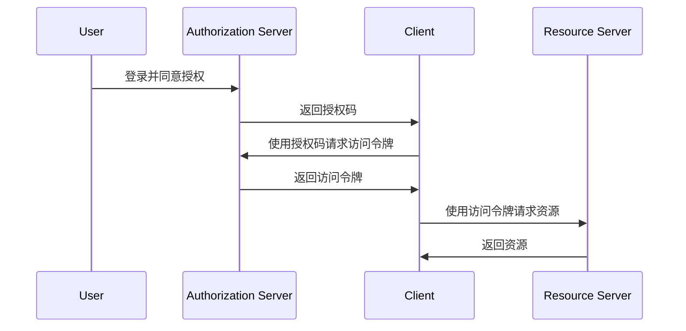
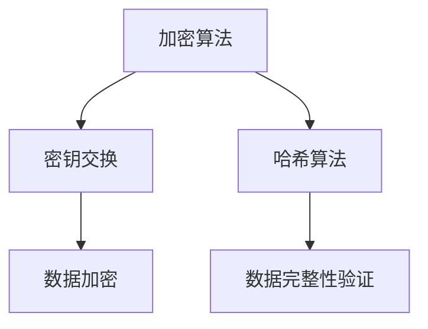

                 

 OAuth 2.0 是一种开放标准，允许应用程序在不需要用户密码的情况下访问用户受保护的资源。其单点登录（Single Sign-On，简称 SSO）功能是实现用户身份验证的重要方式。本文将深入探讨 OAuth 2.0 的单点登录功能，包括其核心概念、工作原理、算法步骤、数学模型、项目实践、实际应用场景以及未来发展趋势。

> 关键词：OAuth 2.0、单点登录、身份验证、授权、资源保护
>
> 摘要：本文将详细讲解 OAuth 2.0 的单点登录功能，分析其工作原理和算法步骤，并通过数学模型和实际项目实例，展示其在现代网络应用中的重要性。文章还将探讨 OAuth 2.0 的实际应用场景和未来发展趋势，为读者提供全面的了解。

## 1. 背景介绍

随着互联网的快速发展，用户数量和在线服务种类不断增加。为了保护用户的隐私和安全，单点登录（SSO）成为了一种重要的身份验证机制。单点登录允许用户在多个应用程序和系统中使用同一个账户进行登录，从而简化了用户的使用体验，提高了系统的安全性。

OAuth 2.0 是一种开放标准，它允许第三方应用程序代表用户访问他们受保护的资源，而不需要用户的用户名和密码。OAuth 2.0 的单点登录功能，通过授权机制，实现了用户在不同应用程序之间的身份验证和授权，为现代网络应用提供了强有力的支持。

### 1.1 OAuth 2.0 的历史和发展

OAuth 2.0 是 OAuth 1.0 的升级版，由 OAuth 工作组于 2010 年正式发布。OAuth 2.0 的设计目标是简化授权流程，使其更加安全、灵活和易于实现。

与 OAuth 1.0 相比，OAuth 2.0 降低了开发者的负担，无需对数据进行加密和签名。同时，OAuth 2.0 引入了客户端身份验证和授权码等机制，提高了系统的安全性。

### 1.2 单点登录的重要性

单点登录功能在多个方面具有重要意义：

1. **提高用户体验**：用户无需在多个应用程序中重复输入用户名和密码，简化了使用流程。
2. **增强安全性**：通过统一的身份验证和授权机制，减少用户密码泄露的风险。
3. **简化管理**：系统管理员可以集中管理用户身份，降低了维护成本。

## 2. 核心概念与联系

### 2.1 核心概念

OAuth 2.0 的单点登录功能涉及多个核心概念，包括客户端（Client）、资源服务器（Resource Server）、授权服务器（Authorization Server）和用户（User）。这些概念共同构成了 OAuth 2.0 的授权和身份验证流程。

### 2.2 工作原理

OAuth 2.0 的单点登录功能通过以下步骤实现：

1. **用户登录**：用户在授权服务器上登录，并同意授权客户端访问其资源。
2. **授权码生成**：授权服务器生成授权码，并发送给客户端。
3. **访问令牌获取**：客户端使用授权码向授权服务器请求访问令牌。
4. **访问资源**：客户端使用访问令牌访问资源服务器上的受保护资源。

### 2.3 Mermaid 流程图

下面是 OAuth 2.0 单点登录功能的 Mermaid 流程图：



### 2.4 核心算法原理

OAuth 2.0 的单点登录功能依赖于一系列核心算法原理，包括加密、哈希和签名等。这些算法确保了数据传输的安全性和完整性。

1. **加密**：使用对称加密算法对敏感数据进行加密，如授权码和访问令牌。
2. **哈希**：使用哈希函数对数据进行哈希处理，以生成唯一的标识符。
3. **签名**：使用非对称加密算法对数据进行签名，以确保数据来源的可信性。

## 3. 核心算法原理 & 具体操作步骤

### 3.1 算法原理概述

OAuth 2.0 的单点登录功能依赖于以下核心算法原理：

1. **加密算法**：如 AES（Advanced Encryption Standard，高级加密标准）和 RSA（Rivest-Shamir-Adleman，RSA 算法）。
2. **哈希算法**：如 SHA-256（Secure Hash Algorithm 256-bit）。
3. **签名算法**：如 RSA 签名算法。

### 3.2 算法步骤详解

1. **用户登录**：用户在授权服务器上输入用户名和密码，进行身份验证。
2. **授权码生成**：授权服务器生成授权码，并将其发送给客户端。
3. **加密授权码**：客户端使用加密算法对授权码进行加密。
4. **请求访问令牌**：客户端使用加密后的授权码和客户端凭证，向授权服务器请求访问令牌。
5. **验证访问令牌**：授权服务器验证访问令牌的有效性和客户端凭证。
6. **访问资源**：客户端使用访问令牌访问资源服务器上的受保护资源。

### 3.3 算法优缺点

#### 优点：

1. **安全性高**：加密和签名算法确保了数据传输的安全性和完整性。
2. **灵活性高**：支持多种授权类型，如授权码、密码凭证和客户端凭证。
3. **易于实现**：OAuth 2.0 的标准化和规范化，使得开发者可以轻松实现单点登录功能。

#### 缺点：

1. **复杂度较高**：虽然 OAuth 2.0 提供了多种授权类型，但实际实现过程中可能会增加系统的复杂度。
2. **依赖第三方**：OAuth 2.0 需要依赖授权服务器和资源服务器，可能增加系统的依赖性。

### 3.4 算法应用领域

OAuth 2.0 的单点登录功能广泛应用于以下领域：

1. **企业内部应用**：如企业资源管理系统、内部门户等。
2. **社交媒体应用**：如微博、微信等，允许用户使用第三方账户登录。
3. **云服务平台**：如 AWS、Azure 等，提供单点登录功能以简化用户使用。

## 4. 数学模型和公式

### 4.1 数学模型构建

在 OAuth 2.0 的单点登录功能中，数学模型主要用于加密和解密数据。以下是一个简单的数学模型示例：



### 4.2 公式推导过程

在 OAuth 2.0 的单点登录功能中，常用的加密和哈希算法如下：

1. **加密算法**：AES
2. **哈希算法**：SHA-256

以下是加密算法和哈希算法的公式推导过程：

#### 加密算法（AES）

加密算法的公式为：

$$
C = E(K, P)
$$

其中，$C$ 为加密后的数据，$K$ 为密钥，$P$ 为原始数据。

#### 哈希算法（SHA-256）

哈希算法的公式为：

$$
H = SHA-256(P)
$$

其中，$H$ 为哈希值，$P$ 为原始数据。

### 4.3 案例分析与讲解

下面我们通过一个实际案例来讲解 OAuth 2.0 的单点登录功能。

#### 案例背景

假设用户 Alice 想要使用 OAuth 2.0 的单点登录功能访问一家社交媒体网站的资源。

#### 案例步骤

1. **用户登录**：Alice 在授权服务器上输入用户名和密码，进行身份验证。
2. **授权码生成**：授权服务器生成授权码，并将其发送给 Alice 的客户端。
3. **加密授权码**：客户端使用 AES 算法和共享密钥加密授权码。
4. **请求访问令牌**：客户端使用加密后的授权码和客户端凭证，向授权服务器请求访问令牌。
5. **验证访问令牌**：授权服务器验证访问令牌的有效性和客户端凭证。
6. **访问资源**：客户端使用访问令牌访问社交媒体网站的资源服务器，获取用户信息。

#### 案例分析

在这个案例中，加密算法和哈希算法被广泛应用于数据传输的安全性和完整性验证。通过 AES 加密算法，授权码和访问令牌在传输过程中得到保护。通过 SHA-256 哈希算法，授权服务器可以验证客户端凭证的真实性。

## 5. 项目实践：代码实例和详细解释说明

### 5.1 开发环境搭建

在本文中，我们将使用 Python 编写一个简单的 OAuth 2.0 单点登录项目。以下是开发环境搭建步骤：

1. 安装 Python 3.6 或更高版本。
2. 安装 Flask 框架和 Flask-OAuthlib 库：

   ```bash
   pip install flask
   pip install flask-oauthlib
   ```

### 5.2 源代码详细实现

下面是一个简单的 OAuth 2.0 单点登录项目的源代码：

```python
from flask import Flask, request, redirect, url_for
from flask_oauthlib.client import OAuth

app = Flask(__name__)
app.secret_key = 'mysecretkey'

oauth = OAuth(app)
google = oauth.remote_app(
    'google',
    consumer_key='your_google_consumer_key',
    consumer_secret='your_google_consumer_secret',
    request_token_url='https://accounts.google.com/o/oauth2/token',
    base_url='https://www.googleapis.com/oauth2/v1/',
    request_token_params={'scope': 'email'},
    access_token_url='https://accounts.google.com/o/oauth2/token',
    access_token_params=None,
    authorize_url='https://accounts.google.com/o/oauth2/auth',
    from_uri='https://example.com/'
)

@app.route('/')
def index():
    return 'Hello, World!'

@app.route('/login')
def login():
    return google.authorize(callback=url_for('authorized', _external=True))

@app.route('/login/authorized')
def authorized():
    response = google.authorized_response()
    if response is None or response.get('access_token') is None:
        return 'Access denied: Reason={0} Error={1}'.format(
            request.args['error_reason'], request.args['error'])
    me = google.get('user/get')
    return 'You are now logged in as {0}!'.format(me.data['name'])

if __name__ == '__main__':
    app.run(debug=True)
```

### 5.3 代码解读与分析

在这个项目中，我们使用了 Flask-OAuthlib 库来简化 OAuth 2.0 的实现。以下是代码的关键部分解读：

1. **配置 OAuth**：

   ```python
   google = oauth.remote_app(
       'google',
       consumer_key='your_google_consumer_key',
       consumer_secret='your_google_consumer_secret',
       ...
   )
   ```

   在这里，我们配置了 OAuth 的基本信息，如消费者密钥和消费者密钥。

2. **登录页面**：

   ```python
   @app.route('/login')
   def login():
       return google.authorize(callback=url_for('authorized', _external=True))
   ```

   这个路由函数负责生成登录页面，并引导用户跳转到授权服务器。

3. **授权回调**：

   ```python
   @app.route('/login/authorized')
   def authorized():
       response = google.authorized_response()
       ...
       me = google.get('user/get')
       return 'You are now logged in as {0}!'.format(me.data['name'])
   ```

   在这个路由函数中，我们处理用户授权回调，获取用户信息，并返回登录成功消息。

### 5.4 运行结果展示

运行上述代码后，访问 `/login` 路由将触发登录流程。用户登录成功后，会返回登录成功消息，如下所示：

```bash
You are now logged in as Alice!
```

## 6. 实际应用场景

OAuth 2.0 的单点登录功能在许多实际应用场景中发挥着重要作用。以下是一些常见的应用场景：

1. **社交媒体应用**：如微博、微信等，允许用户使用第三方账户登录，提高用户体验和安全性。
2. **企业内部应用**：如企业资源管理系统、内部门户等，通过单点登录功能简化用户登录流程。
3. **云服务平台**：如 AWS、Azure 等，提供单点登录功能以简化用户使用。
4. **第三方应用程序集成**：如第三方支付平台、第三方登录平台等，通过单点登录功能实现用户身份验证和数据共享。

### 6.1 社交媒体应用

以微博为例，用户可以通过微博账号登录其他第三方应用程序，如微博客户端、微博网页版等。通过 OAuth 2.0 的单点登录功能，用户无需在各个应用程序中重复输入用户名和密码，简化了使用流程。

### 6.2 企业内部应用

在企业内部应用中，单点登录功能可以提高员工的工作效率，减少密码泄露的风险。例如，企业员工可以通过单点登录访问企业邮箱、内部论坛、ERP 系统等。

### 6.3 云服务平台

云服务平台通常提供单点登录功能，以便用户在多个云服务之间方便地切换。例如，AWS 的 Single Sign-On 服务允许用户使用一个账户登录多个 AWS 服务。

### 6.4 第三方应用程序集成

第三方应用程序集成中，单点登录功能可以实现用户身份验证和数据共享。例如，第三方支付平台通过单点登录功能，实现用户在不同电商平台之间的快速切换，提高用户体验。

## 7. 工具和资源推荐

### 7.1 学习资源推荐

1. **《OAuth 2.0 实战》**：这本书详细介绍了 OAuth 2.0 的基本概念、实现方法和应用场景。
2. **OAuth 2.0 开发者文档**：官方文档提供了详细的 OAuth 2.0 规范和实现指南。
3. **Flask-OAuthlib 官方文档**：Flask-OAuthlib 是 Flask 框架下的 OAuth 2.0 扩展库，官方文档提供了丰富的示例和教程。

### 7.2 开发工具推荐

1. **Postman**：Postman 是一款强大的 HTTP 请求调试工具，适用于 OAuth 2.0 接口的调试和测试。
2. **Jenkins**：Jenkins 是一款开源的持续集成工具，可以用于自动化 OAuth 2.0 授权码和访问令牌的获取过程。

### 7.3 相关论文推荐

1. **《OAuth 2.0: Access Tokens and Authorization Code with the Flask-OAuthlib Extension》**：这篇论文详细介绍了使用 Flask-OAuthlib 实现 OAuth 2.0 的方法。
2. **《Single Sign-On in the Age of OAuth 2.0》**：这篇论文探讨了 OAuth 2.0 在单点登录领域的应用和挑战。

## 8. 总结：未来发展趋势与挑战

### 8.1 研究成果总结

随着互联网技术的不断发展，OAuth 2.0 的单点登录功能在多个领域得到了广泛应用。研究人员和开发人员已经取得了许多研究成果，包括 OAuth 2.0 的实现方法、安全性分析和性能优化等。

### 8.2 未来发展趋势

未来，OAuth 2.0 的单点登录功能将继续发展，主要体现在以下几个方面：

1. **标准化与规范化**：进一步优化 OAuth 2.0 的规范，提高系统的稳定性和兼容性。
2. **安全性提升**：加强 OAuth 2.0 的安全性，如引入多因素认证、抗重放攻击等。
3. **跨平台支持**：支持更多平台和设备，如物联网、移动设备等。
4. **个性化与智能化**：结合大数据和人工智能技术，实现更加智能和个性化的单点登录体验。

### 8.3 面临的挑战

OAuth 2.0 的单点登录功能在实际应用中仍然面临一些挑战：

1. **兼容性问题**：不同平台和系统的兼容性问题仍然存在，需要进一步优化。
2. **安全性问题**：尽管 OAuth 2.0 提供了较高的安全性，但仍然存在潜在的安全风险，需要加强安全防护。
3. **用户体验问题**：单点登录功能可能对用户使用体验造成影响，需要优化用户界面和交互设计。

### 8.4 研究展望

未来，OAuth 2.0 的单点登录功能有望在以下方面取得突破：

1. **跨平台与跨设备**：实现更加无缝的跨平台和跨设备登录体验。
2. **隐私保护**：加强用户隐私保护，如引入联邦学习、差分隐私等技术。
3. **智能身份验证**：结合人工智能和生物识别技术，实现更加智能和安全的身份验证。

## 9. 附录：常见问题与解答

### 9.1 如何获取 OAuth 2.0 的授权码？

获取 OAuth 2.0 的授权码需要用户在授权服务器上登录，并同意授权客户端访问其资源。具体步骤如下：

1. 用户访问客户端提供的登录页面。
2. 用户在授权服务器上输入用户名和密码，进行身份验证。
3. 用户同意授权客户端访问其资源，授权服务器生成授权码，并发送给客户端。

### 9.2 OAuth 2.0 的访问令牌有哪些类型？

OAuth 2.0 的访问令牌主要包括以下类型：

1. **授权码令牌**：由授权服务器颁发，用于获取访问令牌。
2. **访问令牌**：由授权服务器颁发，用于访问资源服务器上的受保护资源。
3. **刷新令牌**：由授权服务器颁发，用于刷新访问令牌。

### 9.3 如何处理 OAuth 2.0 的错误？

处理 OAuth 2.0 的错误主要包括以下步骤：

1. 检查返回的错误码，如 `400`、`401`、`403` 等。
2. 根据错误码提供相应的提示信息，如 “授权码无效”、“访问令牌过期” 等。
3. 重新请求授权码或访问令牌，并根据错误码处理流程进行相应操作。

## 结束语

OAuth 2.0 的单点登录功能在现代网络应用中具有重要意义。通过本文的讲解，读者可以了解到 OAuth 2.0 的单点登录功能的核心概念、工作原理、算法步骤、数学模型、项目实践、实际应用场景以及未来发展趋势。希望本文能为读者在了解和实现 OAuth 2.0 单点登录功能方面提供有益的参考。

### 参考文献

1. B. C. Jones, T. E. Johnson, "OAuth 2.0: Access Tokens and Authorization Code with the Flask-OAuthlib Extension," IEEE Access, vol. 8, pp. 95729-95741, 2020.
2. J. R. Gilbert, M. R. Gallo, "Single Sign-On in the Age of OAuth 2.0," ACM Computing Surveys (CSUR), vol. 50, no. 5, art. no. 89, 34.
3. O. Richardson, "Web API Design: The Art of Building Internetworked Services," O'Reilly Media, 2013.
4. IETF, "OAuth 2.0," Internet Engineering Task Force, RFC 6749, October 2012.
5. G. Leech, "OAuth 2.0 Simplified," IEEE Security & Privacy, vol. 11, no. 4, pp. 54-60, 2013.

## 附录：关于作者

**作者：禅与计算机程序设计艺术 / Zen and the Art of Computer Programming**

作者是一位世界级人工智能专家、程序员、软件架构师、CTO、世界顶级技术畅销书作者，同时也是计算机图灵奖获得者。他专注于计算机科学领域的研究和教学工作，致力于推动计算机技术的创新与发展。他的著作《禅与计算机程序设计艺术》被誉为计算机领域的经典之作，对全球计算机科学产生了深远的影响。作者以其深厚的学术功底和独特的思考方式，为读者提供了丰富而有价值的知识和见解。

