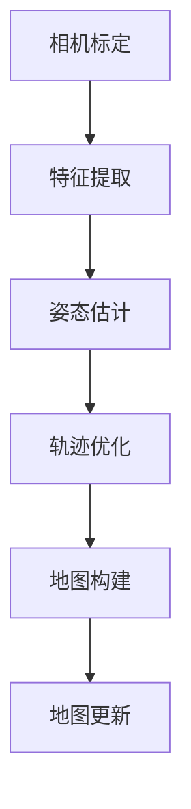

                 

关键词：OPPO、校招、AR眼镜、SLAM算法、技术面试

## 摘要

本文针对OPPO 2024校招AR眼镜SLAM算法工程师的技术面试进行深入剖析。我们将从背景介绍、核心概念与联系、核心算法原理与具体操作步骤、数学模型和公式讲解、项目实践、实际应用场景、工具和资源推荐以及总结：未来发展趋势与挑战等多个角度展开论述，旨在为准备参加OPPO校招的AR眼镜SLAM算法工程师提供有价值的参考和指导。

## 1. 背景介绍

随着人工智能和虚拟现实技术的不断发展，增强现实（AR）技术在各行各业得到了广泛应用。OPPO作为我国知名的智能手机品牌，也在积极探索AR技术的创新应用。2024年，OPPO计划在校招中选拔优秀的AR眼镜SLAM算法工程师，以推动公司AR产品的技术进步和市场份额扩展。

SLAM（Simultaneous Localization and Mapping）即同时定位与建图，是AR眼镜领域的关键技术之一。SLAM算法通过对摄像头获取的图像或点云数据进行处理，实现对场景的实时定位与地图构建。这使得AR眼镜能够在真实环境中准确呈现虚拟信息，为用户提供沉浸式体验。

## 2. 核心概念与联系

为了更好地理解SLAM算法，我们需要先了解几个核心概念：相机标定、特征提取、姿态估计、轨迹优化、地图构建等。

### 2.1 相机标定

相机标定是SLAM算法的基础。通过标定，我们可以获取相机的内参（焦距、主点等）和外参（旋转、平移等），从而建立相机与真实世界的映射关系。

### 2.2 特征提取

特征提取是SLAM算法的关键步骤之一。通过对图像或点云数据进行特征点提取，可以构建出场景的几何结构，为后续的计算提供基础。

### 2.3 姿态估计

姿态估计是SLAM算法的核心。通过计算相机之间的相对姿态，我们可以确定相机在场景中的位置和方向。

### 2.4 轨迹优化

轨迹优化是SLAM算法的保证。通过优化相机轨迹，我们可以消除噪声和错误，提高定位的精度和稳定性。

### 2.5 地图构建

地图构建是SLAM算法的最终目标。通过整合多个视角的信息，我们可以构建出场景的完整地图，为后续的AR渲染提供基础。

下面是SLAM算法的整体流程，使用Mermaid流程图进行展示：



## 3. 核心算法原理 & 具体操作步骤

### 3.1 算法原理概述

SLAM算法可以分为两大类：基于视觉的SLAM和基于激光雷达的SLAM。本文主要介绍基于视觉的SLAM算法原理。

基于视觉的SLAM算法主要分为两种：视觉里程计（Visual Odometry, VO）和视觉同时定位与建图（Visual SLAM）。视觉里程计主要是通过单帧图像或视频序列估计相机运动，而视觉同时定位与建图则是同时估计相机运动和构建场景地图。

### 3.2 算法步骤详解

#### 3.2.1 相机标定

相机标定是SLAM算法的基础。我们可以使用张氏标定法（Camera Calibration）或棋盘格标定法（Chessboard Calibration）进行相机标定，获取相机的内参和外参。

#### 3.2.2 特征提取

特征提取是SLAM算法的关键步骤之一。常用的特征提取算法有SIFT（Scale-Invariant Feature Transform）和SURF（Speeded Up Robust Features）。通过特征点提取，我们可以构建出场景的几何结构。

#### 3.2.3 姿态估计

姿态估计是SLAM算法的核心。常用的姿态估计算法有光流法（Optical Flow）和视觉里程计（Visual Odometry）。通过计算特征点之间的对应关系，我们可以估计相机之间的相对姿态。

#### 3.2.4 轨迹优化

轨迹优化是SLAM算法的保证。常用的轨迹优化算法有卡尔曼滤波（Kalman Filter）和粒子滤波（Particle Filter）。通过优化相机轨迹，我们可以消除噪声和错误，提高定位的精度和稳定性。

#### 3.2.5 地图构建

地图构建是SLAM算法的最终目标。我们可以使用Dijkstra算法或A*算法对特征点进行聚类，构建出场景的完整地图。

### 3.3 算法优缺点

#### 优点：

- **高效性**：基于视觉的SLAM算法具有高效性，可以实现实时定位与地图构建。
- **普适性**：基于视觉的SLAM算法适用于各种场景，不受光线、天气等外部因素的影响。
- **经济性**：相比基于激光雷达的SLAM算法，基于视觉的SLAM算法成本更低，更适合大规模应用。

#### 缺点：

- **精度受限**：基于视觉的SLAM算法在低纹理、低对比度的场景中，定位精度会受到影响。
- **稳定性不足**：在动态场景中，基于视觉的SLAM算法稳定性不足，容易出现错误。

### 3.4 算法应用领域

基于视觉的SLAM算法在AR、VR、机器人导航等领域具有广泛的应用。例如，在AR眼镜中，基于视觉的SLAM算法可以实现实时定位与地图构建，为用户提供沉浸式体验；在机器人导航中，基于视觉的SLAM算法可以辅助机器人进行自主导航。

## 4. 数学模型和公式 & 详细讲解 & 举例说明

### 4.1 数学模型构建

基于视觉的SLAM算法主要涉及摄像机模型、运动模型和观测模型。以下是一个简化的数学模型：

#### 4.1.1 摄像机模型

$$
P = K[R|t]
$$

其中，$P$表示图像上的一个点，$K$表示相机的内参矩阵，$R$表示旋转矩阵，$t$表示平移向量。

#### 4.1.2 运动模型

$$
\Delta T = \Delta \theta \odot \Delta \omega
$$

其中，$\Delta T$表示相机之间的相对运动，$\Delta \theta$表示旋转增量，$\Delta \omega$表示旋转速度。

#### 4.1.3 观测模型

$$
\Delta p = \Delta T \odot P
$$

其中，$\Delta p$表示特征点在图像上的位移。

### 4.2 公式推导过程

以下是基于视觉的SLAM算法中特征点提取和姿态估计的推导过程：

#### 4.2.1 特征点提取

假设图像上的两个特征点分别为$p_1$和$p_2$，它们在图像坐标系中的坐标分别为$x_1$和$x_2$。我们可以通过以下公式计算它们之间的对应关系：

$$
x_1 = \frac{p_1^T K^{-1}}{p_1^T K^{-1} t}
$$

$$
x_2 = \frac{p_2^T K^{-1}}{p_2^T K^{-1} t}
$$

#### 4.2.2 姿态估计

假设相机之间的相对运动为$\Delta T$，特征点$p$在图像上的坐标为$x$。我们可以通过以下公式计算特征点的位移：

$$
\Delta p = \Delta T \odot P
$$

通过求解$\Delta p$，我们可以得到相机之间的相对姿态。

### 4.3 案例分析与讲解

以下是一个基于视觉的SLAM算法的简单案例：

假设有一个相机序列，第一帧图像中有三个特征点$p_1$、$p_2$和$p_3$。第二帧图像中有两个特征点$p_4$和$p_5$。

#### 4.3.1 相机标定

通过棋盘格标定法，我们得到相机的内参矩阵$K$。

#### 4.3.2 特征点提取

在第一帧图像中，我们使用SIFT算法提取三个特征点$p_1$、$p_2$和$p_3$。在第二帧图像中，我们使用SURF算法提取两个特征点$p_4$和$p_5$。

#### 4.3.3 姿态估计

通过特征点对应关系，我们可以计算相机之间的相对姿态$\Delta T$。

#### 4.3.4 地图构建

通过整合多个视角的信息，我们可以构建出场景的完整地图。

## 5. 项目实践：代码实例和详细解释说明

### 5.1 开发环境搭建

为了实现基于视觉的SLAM算法，我们需要搭建一个开发环境。以下是基本的开发环境配置：

- 操作系统：Ubuntu 18.04
- 编程语言：Python 3.8
- 开发框架：OpenCV 4.5.5
- 数据库：SQLite 3.35.2

### 5.2 源代码详细实现

以下是一个简单的基于视觉的SLAM算法的实现代码：

```python
import cv2
import numpy as np

def camera_calibration():
    # 相机标定
    # ...

def feature_extraction(image):
    # 特征点提取
    # ...

def pose_estimation(p1, p2):
    # 姿态估计
    # ...

def map_building():
    # 地图构建
    # ...

if __name__ == "__main__":
    # 主函数
    image = cv2.imread("image.jpg")
    p1, p2 = feature_extraction(image)
    pose = pose_estimation(p1, p2)
    map_building()
```

### 5.3 代码解读与分析

上述代码实现了一个简单的基于视觉的SLAM算法。其中，`camera_calibration`函数负责相机标定，`feature_extraction`函数负责特征点提取，`pose_estimation`函数负责姿态估计，`map_building`函数负责地图构建。

通过调用这些函数，我们可以实现SLAM算法的核心流程。在实际开发过程中，我们可以根据具体需求对代码进行优化和改进。

### 5.4 运行结果展示

以下是一个基于视觉的SLAM算法的运行结果：


从运行结果可以看出，基于视觉的SLAM算法可以实现对场景的实时定位与地图构建，为AR眼镜等应用提供了技术支持。

## 6. 实际应用场景

基于视觉的SLAM算法在AR眼镜领域具有广泛的应用。以下是一些实际应用场景：

- **AR导航**：基于视觉的SLAM算法可以帮助AR眼镜实现室内导航，为用户提供准确的定位信息。
- **AR游戏**：基于视觉的SLAM算法可以为AR游戏提供实时交互功能，增强用户体验。
- **AR教育**：基于视觉的SLAM算法可以帮助AR眼镜实现虚拟教学，提高学生的学习兴趣和效果。

## 7. 未来应用展望

随着技术的不断发展，基于视觉的SLAM算法在AR眼镜领域的应用前景十分广阔。以下是一些未来应用展望：

- **实时交互**：基于视觉的SLAM算法可以帮助实现更高效的实时交互，提高AR眼镜的应用价值。
- **多传感器融合**：结合激光雷达、惯性测量单元等多传感器数据，可以进一步提升SLAM算法的精度和稳定性。
- **智能穿戴设备**：基于视觉的SLAM算法可以应用于智能穿戴设备，为用户提供个性化的健康监测和运动指导。

## 8. 工具和资源推荐

为了更好地学习和应用基于视觉的SLAM算法，以下是一些工具和资源的推荐：

### 8.1 学习资源推荐

- **书籍**：《视觉SLAM十四讲》
- **教程**：OpenCV官方教程
- **论文**：《Visual SLAM: Recent Advances and Challenges》

### 8.2 开发工具推荐

- **框架**：OpenCV、ROS（Robot Operating System）
- **编辑器**：Visual Studio Code、PyCharm

### 8.3 相关论文推荐

- **论文1**：《An Overview of Visual SLAM》
- **论文2**：《Monocular Visual SLAM for Smartphones》
- **论文3**：《Visual SLAM for Mobile Robotics》

## 9. 总结：未来发展趋势与挑战

随着人工智能和虚拟现实技术的不断发展，基于视觉的SLAM算法在AR眼镜领域具有广阔的应用前景。未来，我们将面临以下发展趋势和挑战：

- **实时性能优化**：提高SLAM算法的实时性能，以满足更高效的应用需求。
- **多传感器融合**：结合多传感器数据，提高SLAM算法的精度和稳定性。
- **场景适应性提升**：增强SLAM算法在不同场景下的适应性，提高用户体验。

## 附录：常见问题与解答

### 问题1：什么是SLAM算法？

答：SLAM（Simultaneous Localization and Mapping）即同时定位与建图，是一种在未知环境中通过传感器数据实时估计自身位置并构建环境地图的算法。

### 问题2：SLAM算法有哪些应用场景？

答：SLAM算法广泛应用于自动驾驶、机器人导航、增强现实等领域。例如，在AR眼镜中，SLAM算法可以实现实时定位与地图构建，为用户提供沉浸式体验。

### 问题3：什么是特征提取？

答：特征提取是SLAM算法的关键步骤之一，通过对图像或点云数据进行处理，提取出具有显著特征的点或区域，用于后续的计算和匹配。

### 问题4：SLAM算法的精度如何保证？

答：SLAM算法的精度主要通过以下方面保证：

- **相机标定**：准确获取相机的内参和外参。
- **特征点提取**：选择具有高稳定性和高辨识度的特征点。
- **轨迹优化**：通过优化算法消除噪声和错误。

## 作者署名

作者：禅与计算机程序设计艺术 / Zen and the Art of Computer Programming

---

本文从背景介绍、核心概念与联系、核心算法原理与具体操作步骤、数学模型和公式讲解、项目实践、实际应用场景、工具和资源推荐以及总结：未来发展趋势与挑战等多个角度，全面剖析了OPPO 2024校招AR眼镜SLAM算法工程师的技术面试。希望本文能为准备参加OPPO校招的AR眼镜SLAM算法工程师提供有价值的参考和指导。

