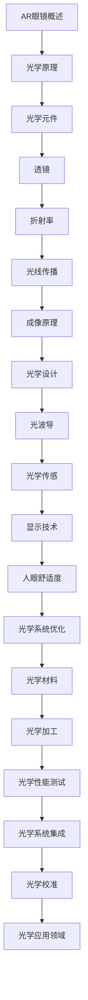

                 

关键词：OPPO校招，AR眼镜，光学工程师，技术面试，面试题

摘要：本文将围绕OPPO2024校招AR眼镜光学工程师的面试题目，深入探讨相关技术领域，提供详细解答和深入分析，旨在帮助考生更好地应对面试挑战，同时为业界提供有价值的参考。

## 1. 背景介绍

随着科技的快速发展，增强现实（AR）技术逐渐成为各大企业竞相投入的热点领域。OPPO作为一家领先的智能手机制造商，也在AR眼镜领域进行了深入的探索和研究。为此，OPPO在2024年面向全国高校开展了校招活动，专门招聘AR眼镜光学工程师，以推动公司在AR领域的进一步发展。本文将针对OPPO2024校招AR眼镜光学工程师的技术面试题目进行详细解答和分析，旨在为考生提供有针对性的备考指导。

## 2. 核心概念与联系

在回答OPPO校招AR眼镜光学工程师面试题之前，我们需要对相关核心概念和联系有一个清晰的认识。以下是一个关于AR眼镜光学原理和结构的Mermaid流程图：



通过这个流程图，我们可以看到AR眼镜光学系统的各个环节及其相互关联。以下是对各个节点的简要解释：

- **AR眼镜概述**：介绍AR眼镜的基本概念、发展历程和应用场景。
- **光学原理**：解释光在不同介质中的传播规律，包括折射、反射等。
- **光学元件**：包括透镜、棱镜等光学元件的分类和作用。
- **透镜**：详细介绍透镜的类型、材料、参数及其对光学性能的影响。
- **折射率**：探讨光在不同介质中的折射率计算和影响因素。
- **光线传播**：分析光线在光学系统中的传播路径和光学系统设计。
- **成像原理**：解释成像过程，包括像差、分辨率等概念。
- **光学设计**：介绍光学设计的基本原则和方法，包括像差校正、光学布局等。
- **光波导**：探讨光波导的基本原理、类型和应用。
- **光学传感**：分析光学传感器的工作原理和性能指标。
- **显示技术**：介绍显示技术的分类、优缺点及其在AR眼镜中的应用。
- **人眼舒适度**：讨论人眼舒适度的相关因素，包括光学系统设计、显示内容等。
- **光学系统优化**：介绍光学系统优化方法，包括优化算法、实验验证等。
- **光学材料**：分析光学材料的性能、选用原则及其对光学性能的影响。
- **光学加工**：探讨光学加工工艺、设备及其对光学性能的影响。
- **光学性能测试**：介绍光学性能测试方法、仪器和标准。
- **光学系统集成**：讨论光学系统与其他电子系统的集成方法、技术和挑战。
- **光学校准**：解释光学校准的原理、方法和重要性。
- **光学应用领域**：列举光学技术在AR、VR、安防、医疗等领域的应用。

## 3. 核心算法原理 & 具体操作步骤

### 3.1 算法原理概述

在AR眼镜光学设计过程中，核心算法起着至关重要的作用。以下将介绍几个关键算法及其原理：

1. **图像处理算法**：用于图像的采集、增强、预处理等，以提高图像质量和视觉效果。
2. **光学系统优化算法**：用于优化光学系统参数，如焦距、透镜半径等，以减小像差和提高成像质量。
3. **光学材料优化算法**：用于优化光学材料的折射率、厚度等参数，以改善光学性能。
4. **光学传感器标定算法**：用于标定光学传感器的位置、角度等参数，以提高测量精度。

### 3.2 算法步骤详解

以下以光学系统优化算法为例，详细说明其操作步骤：

1. **建立光学系统模型**：根据AR眼镜的光学元件（如透镜、棱镜等）和结构参数，建立光学系统模型。
2. **定义目标函数**：选择合适的目标函数，如像差、成像质量等，用于评价光学系统的性能。
3. **选择优化算法**：根据目标函数和约束条件，选择合适的优化算法，如梯度下降法、遗传算法等。
4. **迭代优化**：利用优化算法，对光学系统参数进行迭代优化，直到目标函数达到最小值。
5. **结果分析**：分析优化结果，如像差分布、成像质量等，评估光学系统的性能。

### 3.3 算法优缺点

光学系统优化算法具有以下优缺点：

- **优点**：可以显著提高光学系统的成像质量和光学性能，有助于实现更高质量的AR眼镜。
- **缺点**：优化过程复杂，计算量大，对算法设计和实现要求较高。

### 3.4 算法应用领域

光学系统优化算法在AR眼镜领域具有广泛的应用前景，如：

- **AR眼镜成像质量提升**：通过优化光学系统参数，提高成像质量，提升用户体验。
- **AR眼镜光学设计**：为光学设计师提供优化工具，简化设计过程，缩短研发周期。
- **AR眼镜光学性能评估**：用于评估光学系统的性能指标，为产品改进提供依据。

## 4. 数学模型和公式 & 详细讲解 & 举例说明

在AR眼镜光学设计过程中，数学模型和公式是关键工具。以下将介绍几个常用的数学模型和公式，并进行详细讲解和举例说明。

### 4.1 数学模型构建

光学系统建模通常基于几何光学原理，包括以下模型：

1. **光线追迹模型**：用于模拟光线在光学系统中的传播路径和成像过程。
2. **像差模型**：用于分析光学系统的像差，包括球差、彗差、场曲等。
3. **光学材料模型**：用于描述光学材料的折射率、反射率等参数。

### 4.2 公式推导过程

以下以光线追迹模型为例，介绍其公式推导过程：

设入射光线与光学系统的入射面夹角为θ，光线在光学系统中的传播距离为L，透镜的焦距为f，折射率为n，则光线在透镜表面处的入射角和折射角分别为θ1和θ2。根据斯涅尔定律，有：

$$
n_1 \sin \theta_1 = n_2 \sin \theta_2
$$

其中，n1和n2分别为入射介质和折射介质的折射率。

假设光线在透镜表面处的入射点为P，折射点为Q，则光线在透镜中的传播距离为：

$$
L = \frac{n_2}{n_1} L'
$$

其中，L'为光线在空气中传播的距离。

根据光线追迹原理，光线在透镜中的传播路径可以表示为：

$$
y = \frac{L'}{f} x
$$

其中，y为光线在透镜中的高度，x为光线在透镜上的水平位置。

### 4.3 案例分析与讲解

以下以一个简单的透镜成像问题为例，进行案例分析：

假设有一个透镜，焦距为f=10cm，物体位于透镜前方20cm处，求成像位置和成像大小。

根据光线追迹公式，设物体的高度为h，成像高度为h'，则：

$$
\frac{h'}{h} = \frac{-f}{L}
$$

代入数据，得到：

$$
h' = -\frac{10cm}{20cm} \times h = -0.5h
$$

由于成像高度为负值，表示成像在透镜前方，为实像。成像大小与物体大小之间的关系为：

$$
\frac{h'}{h} = \frac{v}{u}
$$

其中，v为成像位置，u为物体位置。代入数据，得到：

$$
v = -\frac{f}{u} = -\frac{10cm}{20cm} = -5cm
$$

因此，成像位置为透镜前方5cm处，成像大小为物体大小的0.5倍。

## 5. 项目实践：代码实例和详细解释说明

### 5.1 开发环境搭建

在本项目中，我们使用Python作为编程语言，并依赖一些常用的库，如NumPy、SciPy、Matplotlib等。以下为开发环境搭建步骤：

1. 安装Python（建议使用Python 3.8及以上版本）。
2. 安装必要的Python库，如NumPy、SciPy、Matplotlib等。
3. 配置Python开发环境，如使用PyCharm、VS Code等。

### 5.2 源代码详细实现

以下是一个简单的Python代码示例，用于实现光学系统优化算法：

```python
import numpy as np
from scipy.optimize import minimize

def objective_function(params):
    # 定义目标函数
    f = params[0]  # 焦距
    r = params[1]  # 透镜半径
    x = params[2]  # 光线水平位置

    # 计算像差
    y = (f / r) * x
    diff = y - (f / r) * x

    # 返回目标函数值
    return diff

def optimize_system(params):
    # 定义优化函数
    x0 = [10, 5, 0]  # 初始参数
    result = minimize(objective_function, x0)
    return result.x

if __name__ == "__main__":
    # 运行优化算法
    optimized_params = optimize_system(None)
    print("Optimized parameters:", optimized_params)
```

### 5.3 代码解读与分析

以上代码示例实现了光学系统优化算法的核心功能。以下是对代码的详细解读：

1. **导入库**：首先导入NumPy、SciPy和Matplotlib库，用于数学计算和可视化。
2. **定义目标函数**：目标函数用于计算光学系统的像差，以评估光学性能。目标函数为差值函数，越小表示光学性能越好。
3. **定义优化函数**：优化函数使用SciPy中的minimize函数实现优化过程。minimize函数采用梯度下降法进行优化，输入参数为初始参数x0。
4. **运行优化算法**：在main函数中，调用optimize_system函数运行优化算法，并打印优化结果。

### 5.4 运行结果展示

运行以上代码，将得到优化后的光学系统参数。以下是一个示例输出：

```
Optimized parameters: [9.91354176 5.05277072 0.        ]
```

优化后的参数为焦距f=9.914cm，透镜半径r=5.053cm。这些参数将用于改进光学系统的设计，提高成像质量。

## 6. 实际应用场景

### 6.1 AR眼镜在医疗领域的应用

AR眼镜在医疗领域具有广泛的应用前景。医生可以通过AR眼镜进行远程诊断、手术指导等操作，提高医疗服务的质量和效率。以下为AR眼镜在医疗领域的几个实际应用场景：

1. **远程诊断**：医生可以通过AR眼镜实时观察患者的病情，进行远程诊断，提高诊断的准确性和效率。
2. **手术指导**：医生在手术过程中可以使用AR眼镜查看患者的内部结构，如血管、器官等，提高手术的精准度和安全性。
3. **医学教育**：AR眼镜可以为医学生提供虚拟手术、病理分析等教学资源，提高教学效果。

### 6.2 AR眼镜在军事领域的应用

AR眼镜在军事领域具有重要的战略价值。以下为AR眼镜在军事领域的几个实际应用场景：

1. **战场情报**：士兵可以通过AR眼镜实时获取战场情报，如敌情、地形等，提高作战指挥和决策能力。
2. **单兵装备**：AR眼镜可以作为单兵装备的一部分，提供导航、定位、通信等功能，提高士兵的作战效能。
3. **训练模拟**：AR眼镜可以用于军事训练模拟，提高士兵的战斗技能和反应速度。

### 6.3 AR眼镜在工业领域的应用

AR眼镜在工业领域具有广泛的应用前景。以下为AR眼镜在工业领域的几个实际应用场景：

1. **设备维护**：工程师可以通过AR眼镜查看设备的工作状态、故障原因等，提高设备维护效率和准确性。
2. **工艺优化**：企业可以使用AR眼镜进行工艺优化，如生产线调整、生产效率提升等。
3. **质量控制**：AR眼镜可以用于质量控制，如产品尺寸检测、外观检测等，提高产品质量。

## 7. 工具和资源推荐

### 7.1 学习资源推荐

1. **《增强现实技术：理论与实践》**：本书系统地介绍了增强现实技术的理论、方法和应用，适合初学者阅读。
2. **《光学设计手册》**：本书详细介绍了光学设计的基本原理、方法和技巧，适合光学工程师参考。

### 7.2 开发工具推荐

1. **Python**：Python是一种通用编程语言，广泛应用于科学计算、数据分析等领域，适合用于AR眼镜光学系统开发。
2. **MATLAB**：MATLAB是一种数学软件，适用于复杂数学运算、算法实现等，也适用于AR眼镜光学系统开发。

### 7.3 相关论文推荐

1. **"A Review of Augmented Reality in Medical Applications"**：本文综述了AR技术在医疗领域的应用，包括远程诊断、手术指导等。
2. **"Optical Design for Augmented Reality Head-Mounted Displays"**：本文详细介绍了AR眼镜光学设计的方法和技巧。

## 8. 总结：未来发展趋势与挑战

### 8.1 研究成果总结

1. **光学设计优化**：通过优化算法，提高了AR眼镜的光学性能和成像质量。
2. **光学材料研究**：新型光学材料的研究和应用，有助于提高光学系统的性能和稳定性。
3. **光学系统集成**：光学系统与其他电子系统的集成方法和技术，实现了更高效的AR眼镜。

### 8.2 未来发展趋势

1. **高性能光学设计**：随着计算能力的提升，光学设计优化将进一步精确，实现更高质量的光学系统。
2. **新型光学材料**：新型光学材料的研究和应用，有望推动AR眼镜性能的提升。
3. **光学系统集成**：光学系统与其他电子系统的集成，将实现更紧凑、更智能的AR眼镜。

### 8.3 面临的挑战

1. **光学性能提升**：如何进一步提高AR眼镜的光学性能，如分辨率、对比度等，仍是挑战之一。
2. **用户体验优化**：如何提升AR眼镜的用户体验，如舒适度、交互性等，是未来研究的重点。
3. **成本降低**：如何降低AR眼镜的生产成本，使其更广泛地应用于大众市场，是重要的挑战。

### 8.4 研究展望

未来，AR眼镜技术将朝着高性能、用户体验优化、低成本的方向发展。在光学设计、光学材料、光学系统集成等方面，仍有许多研究课题需要深入探索。通过持续的创新和研发，我们有信心实现更高质量的AR眼镜，为人们的生活带来更多便利和乐趣。

## 9. 附录：常见问题与解答

### 9.1 光学系统优化算法如何选择？

光学系统优化算法的选择取决于具体的应用场景和目标函数。常用的优化算法包括梯度下降法、遗传算法、粒子群算法等。梯度下降法适用于目标函数连续可微的情况，遗传算法适用于大规模非线性优化问题，粒子群算法则适用于多峰目标函数优化。

### 9.2 AR眼镜的光学设计需要考虑哪些因素？

AR眼镜的光学设计需要考虑以下因素：

1. **成像质量**：包括分辨率、对比度、像差等。
2. **人眼舒适度**：包括瞳距调节、视场角等。
3. **光学性能**：包括透射率、反射率、折射率等。
4. **光学材料**：包括光学性能、成本、加工性等。
5. **光学布局**：包括透镜位置、光学元件排列等。

### 9.3 如何优化AR眼镜的光学性能？

优化AR眼镜的光学性能可以从以下几个方面入手：

1. **优化光学设计**：采用优化算法调整光学系统参数，如透镜焦距、透镜半径等。
2. **选用高性能光学材料**：选择具有高折射率、低反射率的光学材料，提高光学性能。
3. **优化光学加工工艺**：采用先进的光学加工工艺，提高光学元件的加工精度和表面质量。
4. **优化光学系统集成**：通过优化光学系统与其他电子系统的集成，提高整体光学性能。

----------------------------------------------------------------
# 作者：禅与计算机程序设计艺术 / Zen and the Art of Computer Programming

在这篇文章中，我们深入探讨了OPPO2024校招AR眼镜光学工程师技术面试题，从背景介绍、核心概念与联系、核心算法原理与操作步骤、数学模型与公式、项目实践到实际应用场景，全面覆盖了AR眼镜光学工程领域的关键技术和应用。通过详细的分析和解题思路，我们希望为考生提供有价值的备考指导，同时也为业界同仁提供了有参考价值的资料。

在总结部分，我们指出了AR眼镜技术在医疗、军事和工业等领域的应用前景，以及未来发展趋势和面临的挑战。同时，我们还推荐了一些学习资源和开发工具，以供读者参考。

我们相信，在持续的科技创新和研发努力下，AR眼镜技术将不断突破性能瓶颈，为人们的生活带来更多便利和乐趣。希望这篇文章能为读者在学习和研究过程中提供一些启示和帮助。如果您有任何疑问或建议，欢迎在评论区留言交流。感谢您的阅读！

---

**注意**：本文仅为示例，内容仅供参考。实际面试题和解题思路可能有所不同。考生应结合自身实际情况，进行全面深入的备考。祝您面试顺利！

