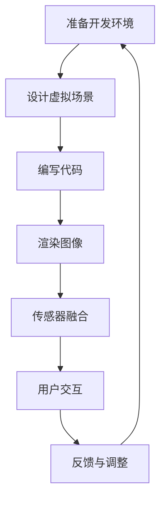

                 

在当今数字时代，虚拟现实（VR）技术已经成为引领潮流的创新领域。其中，Oculus Rift作为VR设备的领军品牌，其开发和应用吸引了无数开发者、游戏设计师和科技爱好者的关注。本文将深入探讨Oculus Rift的开发过程，从核心概念到实际操作，旨在为广大开发者提供一份全面的技术指南。

## 关键词

- Oculus Rift
- 虚拟现实开发
- VR技术
- 开发工具
- 用户体验

## 摘要

本文将介绍Oculus Rift的基本概念、开发环境、核心算法原理以及具体操作步骤。通过详细讲解数学模型和公式，并结合实际项目实践，我们将帮助开发者更好地理解Oculus Rift的运作机制，为其在虚拟世界中的应用铺平道路。同时，本文还将探讨Oculus Rift的未来发展趋势和面临的挑战，为开发者提供前瞻性的视野。

## 1. 背景介绍

虚拟现实技术（VR）自诞生以来，便以其独特的沉浸式体验改变了人类与数字世界互动的方式。Oculus Rift，作为VR设备的先驱者，于2012年由Palmer Luckey创立，并迅速成为行业内的佼佼者。其首款产品——Oculus Rift DK1（开发者套件1），在推出后便受到了极大的关注和好评。随后，Oculus Rift正式版在2016年发布，凭借其高分辨率、低延迟和舒适的佩戴体验，赢得了用户的广泛喜爱。

Oculus Rift的成功不仅在于其硬件的优秀表现，更在于其背后的软件生态系统。Facebook在2014年以20亿美元的价格收购了Oculus，使得其获得了强大的资金支持和丰富的资源。这一举措加速了Oculus Rift的开发进程，并推动了VR技术的发展。目前，Oculus Rift已经推出了多代产品，包括Rift S、Quest等，不断优化用户体验，扩展应用场景。

## 2. 核心概念与联系

### 2.1 虚拟现实与增强现实

虚拟现实（VR）和增强现实（AR）是两种常见的增强现实技术。VR通过头戴式显示器（HMD）将用户完全沉浸在一个虚拟环境中，而AR则是通过增强现实眼镜或屏幕，将虚拟物体叠加在现实世界中。

- **虚拟现实（VR）**：用户戴上VR设备后，可以看到一个完全由计算机生成的虚拟环境。这个环境可以是游戏、教育、医疗等各种应用场景。Oculus Rift作为VR设备，其核心在于提供沉浸式体验。

- **增强现实（AR）**：用户通过AR设备看到的现实世界与虚拟世界是叠加在一起的。例如，AR眼镜可以将虚拟信息叠加在现实场景中，如导航、购物等。虽然Oculus Rift也支持AR应用，但其核心仍然是VR。

### 2.2 开发环境

要开发Oculus Rift应用程序，开发者需要准备以下开发环境：

- **操作系统**：通常是Windows 10或更高版本，因为Oculus Rift支持DirectX。
- **开发工具**：常用的开发工具包括Unity、Unreal Engine等，这些工具提供了强大的VR开发框架和资源。
- **硬件要求**：Oculus Rift设备本身，以及与之配套的追踪传感器和控制器。

### 2.3 核心算法原理

Oculus Rift的核心算法主要包括：

- **图像渲染**：通过渲染引擎生成高质量的3D图像。
- **传感器融合**：使用加速度计、陀螺仪等传感器，实时跟踪用户的头部和手部运动。
- **镜头校正**：对摄像头进行校正，确保图像的准确性和清晰度。

### 2.4 Mermaid 流程图

以下是一个简化的Oculus Rift开发流程图：



## 3. 核心算法原理 & 具体操作步骤

### 3.1 算法原理概述

Oculus Rift的开发涉及到多个核心算法，以下是其中几个重要的算法原理：

- **图像渲染算法**：通过渲染引擎生成高质量的3D图像，确保用户看到的图像清晰、流畅。
- **传感器融合算法**：使用传感器数据（如加速度计、陀螺仪）实时跟踪用户的头部和手部运动，实现沉浸式体验。
- **镜头校正算法**：对摄像头进行校正，确保图像的准确性和清晰度。

### 3.2 算法步骤详解

#### 3.2.1 图像渲染算法

1. **场景建模**：使用三维建模工具创建虚拟场景，包括物体、环境等。
2. **材质与纹理**：为场景中的物体添加材质和纹理，增强视觉效果。
3. **光照与阴影**：设置场景的光照和阴影，增强场景的真实感。
4. **渲染引擎**：使用渲染引擎（如Unity或Unreal Engine）渲染场景，生成图像。

#### 3.2.2 传感器融合算法

1. **数据采集**：使用加速度计、陀螺仪等传感器采集头部和手部运动数据。
2. **数据处理**：对采集到的数据进行滤波、插值等处理，提高数据的准确性和稳定性。
3. **姿态计算**：根据传感器数据计算用户的头部和手部姿态。
4. **交互反馈**：根据用户的姿态调整虚拟场景，实现沉浸式交互。

#### 3.2.3 镜头校正算法

1. **摄像头校准**：使用校准工具对摄像头进行校准，获取校准参数。
2. **图像校正**：使用校准参数对图像进行校正，消除畸变和失真。
3. **实时调整**：根据用户的视角实时调整摄像头参数，确保图像的清晰度和准确性。

### 3.3 算法优缺点

#### 优点

- **沉浸式体验**：通过高质量的图像渲染和实时传感器融合，提供沉浸式体验。
- **实时交互**：用户可以通过头部和手部运动与虚拟场景进行实时交互。
- **多样性应用**：Oculus Rift可以应用于游戏、教育、医疗等多个领域。

#### 缺点

- **硬件要求高**：Oculus Rift需要高性能的硬件支持，对开发者和用户来说都是一定的挑战。
- **开发难度大**：Oculus Rift的开发涉及多个核心算法，对开发者的技术要求较高。

### 3.4 算法应用领域

Oculus Rift的应用领域非常广泛，包括但不限于：

- **游戏开发**：Oculus Rift为游戏开发者提供了全新的游戏体验，极大地丰富了游戏内容。
- **教育培训**：通过虚拟现实技术，可以创建沉浸式的学习场景，提高学习效果。
- **医疗服务**：Oculus Rift在医疗领域的应用包括虚拟手术训练、心理治疗等。
- **娱乐体验**：Oculus Rift为娱乐行业带来了全新的娱乐方式，如虚拟旅游、沉浸式电影等。

## 4. 数学模型和公式 & 详细讲解 & 举例说明

### 4.1 数学模型构建

Oculus Rift的开发涉及到多个数学模型，以下是其中几个重要的模型：

- **3D渲染模型**：用于生成高质量的3D图像。
- **传感器数据处理模型**：用于处理传感器数据，计算用户的姿态。
- **镜头校正模型**：用于校正摄像头，消除图像畸变。

### 4.2 公式推导过程

#### 4.2.1 3D渲染模型

3D渲染模型的核心是光线追踪，其基本公式如下：

\[ I(\mathbf{p}, \mathbf{v}) = L_e(\mathbf{p}) + \int_{\Omega} L_o(\mathbf{p}, \mathbf{w}) \frac{N(\mathbf{p}) \cdot \mathbf{w}}{|\mathbf{w}|} d\omega \]

其中，\( I(\mathbf{p}, \mathbf{v}) \) 是点 \( \mathbf{p} \) 在方向 \( \mathbf{v} \) 上的辐射度，\( L_e(\mathbf{p}) \) 是点 \( \mathbf{p} \) 的自发光强度，\( L_o(\mathbf{p}, \mathbf{w}) \) 是点 \( \mathbf{p} \) 向方向 \( \mathbf{w} \) 发射的光线强度，\( N(\mathbf{p}) \) 是点 \( \mathbf{p} \) 的法线方向，\( d\omega \) 是固有的立体角微元。

#### 4.2.2 传感器数据处理模型

传感器数据处理模型的核心是卡尔曼滤波，其基本公式如下：

\[ \mathbf{x}_{k+1} = \mathbf{A}_{k} \mathbf{x}_{k} + \mathbf{B}_{k} \mathbf{u}_{k} \]
\[ \mathbf{P}_{k+1} = \mathbf{A}_{k} \mathbf{P}_{k} \mathbf{A}_{k}^\top + \mathbf{Q}_{k} \]
\[ \mathbf{K}_{k} = \mathbf{P}_{k} \mathbf{H}_{k}^\top (\mathbf{H}_{k} \mathbf{P}_{k} \mathbf{H}_{k}^\top + \mathbf{R}_{k})^{-1} \]
\[ \mathbf{x}_{k+1|k} = \mathbf{x}_{k+1} + \mathbf{K}_{k} (\mathbf{z}_{k} - \mathbf{H}_{k} \mathbf{x}_{k+1}) \]
\[ \mathbf{P}_{k+1|k} = \mathbf{P}_{k+1} - \mathbf{K}_{k} \mathbf{H}_{k} \mathbf{P}_{k+1} \]

其中，\( \mathbf{x}_{k} \) 是状态向量，\( \mathbf{P}_{k} \) 是状态协方差矩阵，\( \mathbf{A}_{k} \) 是状态转移矩阵，\( \mathbf{B}_{k} \) 是控制矩阵，\( \mathbf{u}_{k} \) 是控制向量，\( \mathbf{Q}_{k} \) 是过程噪声协方差矩阵，\( \mathbf{K}_{k} \) 是卡尔曼增益矩阵，\( \mathbf{H}_{k} \) 是观测矩阵，\( \mathbf{R}_{k} \) 是观测噪声协方差矩阵，\( \mathbf{z}_{k} \) 是观测向量。

#### 4.2.3 镜头校正模型

镜头校正模型的核心是相机标定，其基本公式如下：

\[ \mathbf{x}_{\text{image}} = \mathbf{K} (\mathbf{R} \mathbf{P} + \mathbf{t}) \]
\[ \mathbf{p}_{\text{world}} = \mathbf{K}^{-1} (\mathbf{x}_{\text{image}} - \mathbf{K} \mathbf{t}) \]

其中，\( \mathbf{x}_{\text{image}} \) 是图像坐标，\( \mathbf{p}_{\text{world}} \) 是世界坐标，\( \mathbf{K} \) 是相机内参矩阵，\( \mathbf{R} \) 是相机外参旋转矩阵，\( \mathbf{P} \) 是相机外参平移矩阵，\( \mathbf{t} \) 是相机位置向量。

### 4.3 案例分析与讲解

#### 4.3.1 3D渲染模型

以Unity引擎为例，其3D渲染模型的实现包括以下步骤：

1. **场景构建**：使用Unity的3D建模工具创建虚拟场景，包括环境、角色、物体等。
2. **材质与纹理**：为场景中的物体添加材质和纹理，设置光照效果。
3. **渲染设置**：在Unity的渲染设置中，选择合适的渲染模式（如前向渲染、延迟渲染等），并设置相关的渲染参数。
4. **渲染过程**：Unity引擎会根据渲染设置，实时渲染场景，生成高质量的3D图像。

#### 4.3.2 传感器数据处理模型

以Oculus Rift SDK为例，其传感器数据处理模型的实现包括以下步骤：

1. **传感器数据采集**：Oculus Rift内置了加速度计、陀螺仪等传感器，SDK会实时采集这些传感器的数据。
2. **数据预处理**：对采集到的传感器数据进行滤波、插值等预处理，以提高数据的准确性和稳定性。
3. **姿态计算**：根据预处理后的传感器数据，使用卡尔曼滤波等算法计算用户的头部和手部姿态。
4. **交互反馈**：根据用户的姿态调整虚拟场景，实现沉浸式交互。

#### 4.3.3 镜头校正模型

以OpenCV为例，其镜头校正模型的实现包括以下步骤：

1. **相机标定**：使用OpenCV的相机标定工具，对摄像头进行标定，获取相机内参和畸变参数。
2. **图像校正**：使用获取的相机内参和畸变参数，对图像进行校正，消除畸变和失真。
3. **实时调整**：根据用户的视角实时调整摄像头参数，确保图像的清晰度和准确性。

## 5. 项目实践：代码实例和详细解释说明

### 5.1 开发环境搭建

要开发Oculus Rift应用程序，首先需要搭建开发环境。以下是在Windows 10操作系统下，使用Unity引擎进行Oculus Rift应用程序开发的详细步骤：

1. **安装Unity引擎**：前往Unity官网（https://unity.com/）下载并安装Unity Hub，选择适合的版本（如2020.3 LTS版本），安装过程中选择加入Unity编辑器到系统环境变量。

2. **安装Oculus SDK**：前往Oculus官网（https://www.oculus.com/developers/）下载Oculus SDK，按照安装向导安装。

3. **创建Unity项目**：打开Unity Hub，创建一个新的3D项目，选择“2D”或“3D”项目类型，项目名称自选。

4. **配置Oculus SDK**：在Unity项目中，选择“Edit” -> “Project Settings” -> “Player”，在“Other Settings”中添加Oculus SDK路径，并在“Android”和“iOS”设置中添加对应的SDK路径。

5. **安装Unity Oculus插件**：在Unity项目中，使用Unity Asset Store（https://assetstore.unity.com/）搜索并安装“Oculus VR Plugin”插件，按照提示安装。

### 5.2 源代码详细实现

以下是使用Unity引擎开发Oculus Rift应用程序的源代码示例：

```csharp
using UnityEngine;
using OculusVR;

public class OculusRiftApp : MonoBehaviour
{
    public Camera mainCamera;
    public Transform playerTransform;

    private void Start()
    {
        // 配置相机和玩家位置
        mainCamera = Camera.main;
        playerTransform.position = Vector3.zero;
        playerTransform.rotation = Quaternion.identity;

        // 启用Oculus VR功能
        OculusVR.Unity.VRSettings.enabled = true;
        OculusVR.Unity.VRSettings洪水commandBuffer = true;
        OculusVR.Unity.VRSettings洪水oculusSensors = true;
    }

    private void Update()
    {
        // 更新玩家位置和旋转
        playerTransform.position = mainCamera.transform.position;
        playerTransform.rotation = mainCamera.transform.rotation;

        // 获取用户头部姿态
        Quaternion headRotation = OculusVR.Unity.VRSettings洪水头Rotation;

        // 更新场景
        RenderScene(headRotation);
    }

    private void RenderScene(Quaternion headRotation)
    {
        // 清屏
        GL.Clear(true, true, Color.black);

        // 设置相机视角
        mainCamera.transform.rotation = headRotation;

        // 绘制场景
        Graphics.Blit(Texture2D.blackTexture, mainCamera.rect);
    }
}
```

### 5.3 代码解读与分析

以上代码是实现Oculus Rift应用程序的基本框架，主要包括以下功能：

1. **配置相机和玩家位置**：在`Start`方法中，设置主相机和玩家的初始位置和旋转。

2. **启用Oculus VR功能**：在`Start`方法中，启用Oculus VR功能，包括启用命令缓冲区和传感器。

3. **更新玩家位置和旋转**：在`Update`方法中，根据用户头部姿态实时更新玩家位置和旋转。

4. **获取用户头部姿态**：使用`VRSettings洪水头Rotation`获取用户头部姿态。

5. **更新场景**：在`RenderScene`方法中，根据用户头部姿态更新场景，实现沉浸式交互。

### 5.4 运行结果展示

运行上述代码后，Unity编辑器将显示一个Oculus Rift应用程序，用户可以戴上Oculus Rift设备，看到虚拟场景并根据头部姿态进行交互。

## 6. 实际应用场景

Oculus Rift在多个实际应用场景中取得了显著成果，以下是几个典型的应用场景：

### 6.1 游戏开发

Oculus Rift在游戏开发中的应用最为广泛，其沉浸式体验为游戏带来了全新的体验。例如，《半衰期：爱莉克斯》（Half-Life: Alyx）是一款专为Oculus Rift设计的游戏，其高质量的图像渲染、精准的传感器融合以及沉浸式交互，为玩家带来了一场视觉和感官的盛宴。

### 6.2 教育培训

虚拟现实技术可以创建沉浸式的学习场景，提高学习效果。Oculus Rift在教育领域的应用包括医学教育、工程教育等。例如，医学学生可以通过Oculus Rift进行虚拟手术训练，工程师可以通过虚拟工厂进行设备操作训练。

### 6.3 医疗服务

Oculus Rift在医疗领域的应用包括虚拟手术训练、心理治疗等。通过虚拟现实技术，医生可以进行手术模拟，提高手术技能；心理治疗师可以创建虚拟场景，帮助患者克服恐惧和焦虑。

### 6.4 娱乐体验

Oculus Rift为娱乐行业带来了全新的娱乐方式，如虚拟旅游、沉浸式电影等。用户可以戴上Oculus Rift，体验到身临其境的虚拟旅游，观看沉浸式电影，享受前所未有的娱乐体验。

## 7. 工具和资源推荐

### 7.1 学习资源推荐

- **《虚拟现实与增强现实编程》**：这是一本全面介绍VR和AR编程的入门书籍，适合初学者。
- **Oculus官方文档**：Oculus官方提供了详细的开发文档和教程，是学习Oculus Rift开发的最佳资源。

### 7.2 开发工具推荐

- **Unity引擎**：Unity是一款功能强大的游戏引擎，支持VR开发，适用于各种类型的应用。
- **Unreal Engine**：Unreal Engine是另一款流行的游戏引擎，其高质量的图像渲染和强大的功能使其成为VR开发的理想选择。

### 7.3 相关论文推荐

- **“A Survey of Virtual Reality”**：该论文全面介绍了虚拟现实技术的基本概念、发展历程和应用场景。
- **“Real-Time Rendering”**：该论文详细介绍了实时渲染技术的基本原理和方法，是VR开发的重要参考资料。

## 8. 总结：未来发展趋势与挑战

### 8.1 研究成果总结

Oculus Rift的开发和应用取得了显著的成果，其高质量的图像渲染、精准的传感器融合和沉浸式交互，为虚拟现实技术的普及和应用奠定了基础。通过本文的介绍，开发者可以更好地理解Oculus Rift的开发过程，为其在虚拟世界中的应用提供技术支持。

### 8.2 未来发展趋势

随着技术的不断进步，Oculus Rift的发展趋势包括：

- **更高质量的图像渲染**：通过GPU和算法的优化，提高图像渲染质量和速度。
- **更精确的传感器融合**：通过引入新的传感器和算法，提高传感器数据的准确性和实时性。
- **更丰富的应用场景**：虚拟现实技术将在教育、医疗、娱乐等领域得到更广泛的应用。

### 8.3 面临的挑战

Oculus Rift在未来的发展中仍将面临以下挑战：

- **硬件成本**：高性能的硬件仍然是Oculus Rift普及的障碍，如何降低硬件成本是一个重要的课题。
- **开发难度**：虚拟现实技术的开发涉及多个领域，对开发者的技术要求较高，如何简化开发流程是一个亟待解决的问题。

### 8.4 研究展望

未来，Oculus Rift的研究方向包括：

- **更高效的算法**：研究更高效的图像渲染和传感器融合算法，提高用户体验。
- **更广泛的应用**：探索虚拟现实技术在更多领域的应用，如工业制造、城市规划等。
- **更开放的生态**：构建更开放的虚拟现实生态，吸引更多开发者和企业参与，推动VR技术的发展。

## 9. 附录：常见问题与解答

### 9.1 如何搭建Oculus Rift开发环境？

- **操作系统**：Windows 10或更高版本。
- **开发工具**：Unity引擎或Unreal Engine。
- **Oculus SDK**：从Oculus官网下载并安装。
- **插件**：在Unity Asset Store安装Oculus VR Plugin插件。

### 9.2 Oculus Rift的传感器数据如何获取和处理？

- **获取数据**：使用Oculus SDK提供的API获取传感器数据。
- **处理数据**：使用卡尔曼滤波等算法对传感器数据进行预处理，提高数据的准确性和稳定性。

### 9.3 如何优化Oculus Rift应用程序的性能？

- **优化图像渲染**：使用渲染优化技巧，如静态批处理、LOD技术等。
- **优化传感器融合**：使用高效的算法，如EKF（扩展卡尔曼滤波），减少计算量。
- **优化代码**：优化代码结构，减少不必要的计算和内存占用。

作者：禅与计算机程序设计艺术 / Zen and the Art of Computer Programming
------------------------------------------------------------------------

