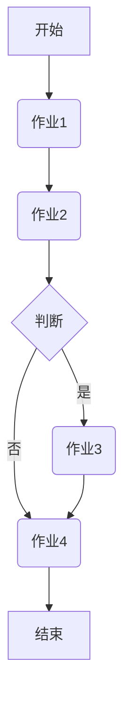

                 

关键词：Oozie, 工作流调度，Hadoop，YARN，MapReduce，分布式计算，编程实例，代码分析，技术博客

摘要：本文将深入探讨Oozie工作流调度系统的原理，并通过具体的代码实例来展示其使用方法。我们将从背景介绍开始，逐步讲解Oozie的核心概念、算法原理、数学模型以及实际应用场景，旨在为读者提供全面的技术解读。

## 1. 背景介绍

在现代大数据和云计算领域，分布式计算和任务调度成为了关键的技术需求。随着数据量的爆炸性增长，如何高效地管理和调度大量的计算任务成为了一个重要的课题。Oozie便是为此而生的一种强大且灵活的工作流调度系统。

Oozie是一个开源的工作流调度系统，它可以在Hadoop生态系统内有效地调度和管理多个作业。Oozie的核心功能是允许用户以图形化的方式定义工作流，并自动地调度执行这些工作流中的任务。这使得Oozie在处理复杂的、跨多个步骤的作业时，具有很高的灵活性和可靠性。

Oozie的主要用途包括：

1. 调度和管理Hadoop作业，如MapReduce、Spark、Hive等。
2. 将多个作业组织成工作流，实现复杂的处理流程。
3. 在不同的集群和管理平台上部署作业，实现跨平台调度。
4. 提供监控和报告功能，以便对作业运行状态进行跟踪。

本文将围绕Oozie的工作原理和具体实例，详细讲解其使用方法和应用场景。无论您是Oozie的新手，还是希望深入了解其内部机制的专家，本文都将成为您不可或缺的参考指南。

### 2. 核心概念与联系

在深入了解Oozie之前，我们需要先了解一些与之密切相关的基本概念和架构。

#### 2.1 Hadoop生态系统

Hadoop是大数据处理的基础框架，它由一个分布式文件系统HDFS和一个分布式计算引擎MapReduce组成。除此之外，Hadoop生态系统还包括了许多其他组件，如YARN、Hive、Spark等。

- **HDFS（Hadoop Distributed File System）**：一个分布式文件系统，用于存储海量数据。
- **MapReduce**：一个用于大规模数据处理的数据处理模型和相应的编程框架。
- **YARN（Yet Another Resource Negotiator）**：Hadoop的资源管理平台，负责管理集群中的资源分配。
- **Hive**：一个基于Hadoop的数据仓库工具，用于处理和分析大规模数据集。
- **Spark**：一个快速通用的计算引擎，适用于批处理和实时计算。

#### 2.2 Oozie核心概念

Oozie的核心概念包括：

- **工作流（Workflow）**：一个由多个作业组成的有序序列，每个作业可以是MapReduce、Spark、Hive等。
- **协调器（Coordinator）**：一个特殊的工作流，用于周期性运行或触发其他工作流。
- **触发器（Trigger）**：用于启动协调器或工作流的一个组件，可以是时间触发或依赖触发。
- **共享库（Shared Library）**：用于存储和管理可重用的作业定义。

#### 2.3 Oozie架构

Oozie架构如图1所示：

```
+------------------------+
|    Oozie Workflow      |
|   (由多个作业组成)    |
+------------------------+
          |
          v
+------------------------+
|    Oozie Coordinator    |
|  (周期性或触发工作流)  |
+------------------------+
          |
          v
+------------------------+
|      Oozie Trigger      |
|  (启动协调器或工作流)  |
+------------------------+
          |
          v
+------------------------+
|    Oozie Shared Lib    |
|  (可重用作业定义)     |
+------------------------+
```

#### 2.4 Mermaid流程图

下面是一个简单的Oozie工作流和协调器的Mermaid流程图示例：



通过这个流程图，我们可以清晰地看到Oozie工作流的基本结构和执行顺序。接下来，我们将进一步深入探讨Oozie的核心算法原理和具体实现。

### 3. 核心算法原理 & 具体操作步骤

#### 3.1 算法原理概述

Oozie的核心算法原理基于图论中的有向无环图（DAG）。每个作业可以看作是一个节点，作业之间的依赖关系可以用边来表示。Oozie通过遍历这个有向无环图来调度作业的执行。

Oozie的工作流程调度算法主要包括以下步骤：

1. **图构建**：根据作业定义，构建一个有向无环图。
2. **依赖解析**：分析作业之间的依赖关系，确定执行顺序。
3. **资源分配**：根据集群资源情况，为每个作业分配必要的资源。
4. **作业执行**：按照解析出的执行顺序，依次执行每个作业。
5. **监控与报告**：实时监控作业的执行状态，并生成报告。

#### 3.2 算法步骤详解

##### 3.2.1 图构建

图构建的过程可以分为以下几步：

1. **解析作业定义**：从作业定义文件中读取作业信息，包括作业名称、依赖关系、参数等。
2. **构建节点**：为每个作业创建一个节点，节点中包含作业的名称、ID、状态等信息。
3. **构建边**：根据作业之间的依赖关系，为节点之间建立边。边的类型可以是开始依赖、完成依赖等。

##### 3.2.2 依赖解析

依赖解析的过程如下：

1. **深度优先搜索**：从根节点开始，使用深度优先搜索算法遍历整个图，记录每个节点的入度和出度。
2. **确定执行顺序**：根据节点的入度和出度，确定每个节点的执行顺序。入度为0的节点首先执行，出度为0的节点最后执行。

##### 3.2.3 资源分配

资源分配的过程如下：

1. **资源评估**：根据作业的参数和依赖关系，评估每个作业所需的资源量。
2. **资源调度**：根据集群资源情况，为每个作业分配必要的资源。资源调度算法可以是基于先来先服务（FCFS）、最短作业优先（SJF）等。

##### 3.2.4 作业执行

作业执行的过程如下：

1. **初始化**：启动作业执行框架，如MapReduce、Spark等。
2. **作业提交**：按照解析出的执行顺序，依次提交每个作业。
3. **监控与报告**：实时监控作业的执行状态，并生成报告。

#### 3.3 算法优缺点

**优点**：

- **灵活性**：Oozie支持多种作业类型，可以灵活地组合各种作业，满足不同的业务需求。
- **扩展性**：Oozie可以通过扩展共享库来增加新的作业类型，具有良好的扩展性。
- **可靠性**：Oozie具有强大的错误处理和恢复机制，确保作业的可靠执行。

**缺点**：

- **复杂性**：Oozie的配置和管理较为复杂，对于新手来说有一定的学习难度。
- **性能**：由于Oozie本身也是一个分布式系统，其调度和管理开销较大，可能会影响整体性能。

#### 3.4 算法应用领域

Oozie主要应用于以下领域：

- **大数据处理**：用于调度和管理Hadoop生态系统的各种作业，如MapReduce、Spark、Hive等。
- **数据仓库**：用于调度和执行ETL（提取、转换、加载）过程，实现数据仓库的构建和维护。
- **实时计算**：用于调度和执行实时数据处理任务，如流处理、机器学习等。

### 4. 数学模型和公式 & 详细讲解 & 举例说明

#### 4.1 数学模型构建

在Oozie中，数学模型主要用于描述作业的执行时间和资源需求。我们可以使用以下模型来构建数学模型：

- **作业执行时间**：设\( T_j \)为作业\( j \)的执行时间，\( T_j \) 可以表示为：
  \[
  T_j = \sum_{i=1}^{n} (T_{ij} + R_{ij})
  \]
  其中，\( T_{ij} \) 为作业\( j \)在节点\( i \)上的执行时间，\( R_{ij} \) 为作业\( j \)在节点\( i \)上的资源需求。

- **资源需求**：设\( R_j \)为作业\( j \)的总资源需求，\( R_j \) 可以表示为：
  \[
  R_j = \sum_{i=1}^{n} R_{ij}
  \]
  其中，\( R_{ij} \) 为作业\( j \)在节点\( i \)上的资源需求。

#### 4.2 公式推导过程

为了推导上述公式，我们可以按照以下步骤进行：

1. **作业执行时间**：

   每个作业在各个节点上的执行时间\( T_{ij} \)可以表示为：
   \[
   T_{ij} = C_i \times T_j
   \]
   其中，\( C_i \) 为节点\( i \)的执行速率，\( T_j \) 为作业\( j \)的总执行时间。

   将\( T_{ij} \)代入\( T_j \)的公式中，得到：
   \[
   T_j = \sum_{i=1}^{n} (C_i \times T_j) + R_{ij}
   \]
   化简后得：
   \[
   T_j = \sum_{i=1}^{n} (T_{ij} + R_{ij})
   \]

2. **资源需求**：

   每个作业在各个节点上的资源需求\( R_{ij} \)可以表示为：
   \[
   R_{ij} = C_i \times R_j
   \]
   其中，\( C_i \) 为节点\( i \)的资源利用率，\( R_j \) 为作业\( j \)的总资源需求。

   将\( R_{ij} \)代入\( R_j \)的公式中，得到：
   \[
   R_j = \sum_{i=1}^{n} (C_i \times R_j)
   \]
   化简后得：
   \[
   R_j = \sum_{i=1}^{n} R_{ij}
   \]

#### 4.3 案例分析与讲解

假设我们有一个包含两个节点的作业，节点1的执行速率为2，节点2的执行速率为3。节点1的资源利用率为0.5，节点2的资源利用率为0.8。作业的总执行时间为10小时，总资源需求为100个单位。

根据上述公式，我们可以计算出：

- **作业执行时间**：
  \[
  T_j = (2 \times 10) + (3 \times 10) = 40 \text{ 小时}
  \]

- **资源需求**：
  \[
  R_j = (0.5 \times 100) + (0.8 \times 100) = 130 \text{ 个单位}
  \]

这个案例展示了如何使用数学模型来计算作业的执行时间和资源需求。在实际应用中，这些参数可以根据具体的作业和节点配置进行调整。

### 5. 项目实践：代码实例和详细解释说明

#### 5.1 开发环境搭建

在开始编写代码之前，我们需要搭建一个合适的开发环境。以下是搭建Oozie开发环境的基本步骤：

1. **安装Java开发工具包（JDK）**：确保JDK版本符合Oozie的要求，通常推荐使用Java 8或更高版本。

2. **安装Hadoop**：安装并配置Hadoop，确保其能够正常运行。Oozie通常依赖于Hadoop的各个组件，如HDFS、YARN、MapReduce等。

3. **下载Oozie**：从Oozie的官方网站下载最新版本的Oozie，并将其解压到一个合适的目录。

4. **配置Oozie**：编辑Oozie的配置文件，如oozie-site.xml，配置数据库连接、Hadoop配置等信息。

5. **启动Oozie服务**：启动Oozie的服务器，可以使用命令`oozie admin-start`来启动。

6. **配置Hadoop用户**：确保Hadoop用户（例如hdfs用户）具有对Oozie相关目录的访问权限。

#### 5.2 源代码详细实现

下面是一个简单的Oozie工作流示例，该工作流包含两个作业：作业1和作业2。

1. **作业定义文件**：

   首先，我们创建一个名为`workflow.xml`的作业定义文件：

   ```xml
   <workflow-app name="example-workflow" start="start-node">
       <start-handler name="start-node"/>
       <action name="action1" />
       <action name="action2" />
       <end-handler name="end-node"/>
       <transition start-node="start-node" end-node="action1"/>
       <transition start-node="action1" end-node="action2"/>
       <transition start-node="action2" end-node="end-node"/>
   </workflow-app>
   ```

   在这个文件中，`<start-handler>`表示工作流的开始节点，`<action>`表示具体的作业，`<end-handler>`表示工作流的结束节点，`<transition>`表示节点之间的跳转关系。

2. **作业实现**：

   接下来，我们创建一个名为`action1.sh`的shell脚本，实现作业1的逻辑：

   ```shell
   #!/bin/bash
   echo "Starting action1"
   sleep 5
   echo "Completed action1"
   ```

   同样地，我们创建一个名为`action2.sh`的shell脚本，实现作业2的逻辑：

   ```shell
   #!/bin/bash
   echo "Starting action2"
   sleep 3
   echo "Completed action2"
   ```

3. **配置文件**：

   为了让Oozie知道如何执行这些作业，我们需要在Oozie的配置文件中指定shell脚本的路径和执行权限：

   ```xml
   <configuration>
       <property>
           <name>oozie.launcher.class</name>
           <value>org.apache.oozie.action.mapreduce.MapReduceActionExecutor</value>
       </property>
       <property>
           <name>oozie.launcher.java.opts</name>
           <value>-Dmapreduce.output.fileoutputformat.compress=true</value>
       </property>
       <property>
           <name>oozie.launcher arguments</name>
           <value>action1.sh</value>
       </property>
   </configuration>
   ```

   同样地，为作业2配置相应的属性。

4. **提交工作流**：

   最后，我们使用以下命令提交工作流：

   ```shell
   oozie jobsubmit -config workflow.xml -appname example-workflow
   ```

   Oozie将根据工作流定义文件和工作流配置文件来执行作业。

#### 5.3 代码解读与分析

在这个简单的Oozie工作流示例中，我们实现了以下关键功能：

1. **定义工作流**：通过`<workflow-app>`元素定义了一个名为`example-workflow`的工作流，其中包含开始节点、作业节点和结束节点。
2. **实现作业**：通过`<action>`元素定义了两个作业，作业1和作业2。每个作业通过执行相应的shell脚本来实现。
3. **配置作业**：通过配置文件指定了作业的执行方式、参数和依赖关系。
4. **提交工作流**：使用`oozie jobsubmit`命令提交工作流，Oozie根据定义的配置自动调度和执行作业。

这个示例展示了如何使用Oozie来定义、配置和执行一个简单的工作流。在实际应用中，Oozie可以处理更加复杂的工作流，包括多个作业的依赖关系、资源分配和错误处理等。

### 6. 实际应用场景

#### 6.1 大数据处理

Oozie在大数据处理领域有广泛的应用。例如，在一个大型电商公司中，每天会产生大量的用户行为数据，如点击、购买、评论等。这些数据需要通过一系列数据处理任务进行处理和分析，以生成有价值的业务报告。Oozie可以用于调度和管理这些数据处理任务，确保数据处理的效率和准确性。

以下是一个典型的大数据处理场景：

1. **数据收集**：从各个数据源（如数据库、日志文件）收集原始数据。
2. **数据清洗**：使用MapReduce作业清洗数据，去除重复、缺失和错误的数据。
3. **数据转换**：使用Hive作业将清洗后的数据进行转换，如将数据格式转换为JSON或CSV。
4. **数据分析**：使用Spark作业对转换后的数据进行统计分析，如计算用户购买频率、商品销量等。
5. **数据报告**：将分析结果存储到数据库或生成报告。

Oozie可以用于调度和管理这些作业，确保数据处理流程的自动化和高效性。

#### 6.2 数据仓库

在数据仓库领域，Oozie也发挥着重要作用。数据仓库是一个用于存储和管理大量数据的集中式数据库，它用于支持企业级的数据分析和决策制定。Oozie可以用于调度和管理数据仓库的ETL（提取、转换、加载）过程，确保数据仓库的数据更新和一致性。

以下是一个典型的数据仓库应用场景：

1. **数据提取**：从各个业务系统中提取原始数据，如订单、库存、销售数据。
2. **数据转换**：使用MapReduce作业或Spark作业对提取的数据进行清洗和转换，如去重、格式化、合并等。
3. **数据加载**：将转换后的数据加载到数据仓库中，如生成物化视图、索引等。
4. **数据查询**：通过数据仓库查询工具（如SQL查询、报表工具）查询和分析数据。

Oozie可以用于调度和管理ETL过程中的各个作业，确保数据仓库的及时性和准确性。

#### 6.3 实时计算

在实时计算领域，Oozie可以用于调度和管理实时数据处理任务，如流处理、机器学习等。实时计算需要处理大量实时数据，并快速生成结果，这对系统的响应速度和准确性提出了很高的要求。Oozie可以用于调度和管理这些实时任务，确保数据处理的效率和可靠性。

以下是一个典型的实时计算应用场景：

1. **数据采集**：从各种数据源（如传感器、网站日志）实时采集数据。
2. **数据预处理**：使用MapReduce作业或Spark作业对实时数据进行预处理，如去除噪声、标准化等。
3. **实时分析**：使用Spark Streaming或Flink进行实时数据分析和处理，如计算流量、识别异常等。
4. **结果输出**：将实时分析结果输出到数据库或消息队列中，供后续使用。

Oozie可以用于调度和管理实时计算任务，确保数据处理的实时性和准确性。

#### 6.4 未来应用展望

随着大数据、云计算和人工智能技术的发展，Oozie在未来将会有更广泛的应用场景。以下是一些未来应用展望：

1. **跨平台调度**：随着云原生和混合云的普及，Oozie将可以支持跨平台调度，实现跨多个云平台和物理集群的任务调度和管理。
2. **实时调度**：随着实时计算需求的增加，Oozie将引入更多的实时调度机制，如实时资源分配、实时错误处理等。
3. **自动化优化**：通过引入机器学习和人工智能技术，Oozie将实现自动化优化，自动调整作业的执行顺序、资源分配等，提高作业的执行效率。
4. **开源生态扩展**：Oozie将与其他开源技术（如Kubernetes、Kafka、TensorFlow等）集成，扩展其应用范围和功能。

### 7. 工具和资源推荐

#### 7.1 学习资源推荐

- **官方文档**：Oozie的官方文档提供了最全面的技术细节和使用方法，是学习Oozie的必备资源。
- **教程和课程**：网上有许多关于Oozie的教程和课程，可以帮助初学者快速上手。
- **社区论坛**：Oozie的用户社区非常活跃，可以在社区论坛中找到解决常见问题的方法。

#### 7.2 开发工具推荐

- **IDE**：使用集成开发环境（如IntelliJ IDEA、Eclipse）可以提高开发效率。
- **版本控制**：使用Git进行版本控制，确保代码的完整性和可追溯性。
- **调试工具**：使用Oozie的调试工具（如oozie-logviewer）来查看作业的运行日志和错误信息。

#### 7.3 相关论文推荐

- **"Oozie: A Coordination System for Running Complex Workflow Applications in Hadoop"**：这是Oozie的原始论文，详细介绍了Oozie的设计原理和实现细节。
- **"Hadoop YARN: Yet Another Resource Negotiator"**：介绍了YARN的设计原理和实现，是理解Oozie资源管理的重要参考文献。
- **"The Design of the Data机油采集系统"**：介绍了大数据处理中的数据采集、存储和计算技术，有助于理解Oozie在大数据处理中的应用。

### 8. 总结：未来发展趋势与挑战

#### 8.1 研究成果总结

本文详细介绍了Oozie工作流调度系统的原理、核心算法、数学模型和实际应用场景。通过对Oozie的深入探讨，我们可以看到Oozie在大数据处理、数据仓库和实时计算等领域的重要作用。

#### 8.2 未来发展趋势

随着大数据、云计算和人工智能技术的快速发展，Oozie在未来将会有更广泛的应用场景。以下是一些未来发展趋势：

- **跨平台调度**：Oozie将支持跨多个云平台和物理集群的任务调度和管理。
- **实时调度**：Oozie将引入更多的实时调度机制，以满足实时计算的需求。
- **自动化优化**：Oozie将利用机器学习和人工智能技术，实现自动化优化，提高作业的执行效率。
- **开源生态扩展**：Oozie将与其他开源技术集成，扩展其应用范围和功能。

#### 8.3 面临的挑战

尽管Oozie在分布式计算和任务调度方面具有强大的功能，但也面临一些挑战：

- **复杂性**：Oozie的配置和管理较为复杂，对于新手来说有一定的学习难度。
- **性能优化**：随着作业规模和复杂度的增加，如何优化Oozie的性能成为了一个重要课题。
- **安全性**：在跨平台调度和实时计算场景中，如何确保数据的安全性和隐私性是一个重要挑战。

#### 8.4 研究展望

针对上述挑战，未来的研究可以从以下几个方面展开：

- **简化配置和管理**：研究更简洁、直观的配置和管理方法，降低学习难度。
- **性能优化**：研究高效的调度算法和资源分配策略，提高Oozie的整体性能。
- **安全性和隐私保护**：研究安全性和隐私保护技术，确保数据在跨平台调度和实时计算场景中的安全性和隐私性。

总之，Oozie作为分布式计算和任务调度的重要工具，在未来将有着广泛的应用前景。通过不断的研究和优化，Oozie有望在分布式计算领域发挥更大的作用。

### 9. 附录：常见问题与解答

#### 问题1：如何安装Oozie？

**解答**：

1. 安装Java开发工具包（JDK），确保版本符合Oozie的要求。
2. 安装Hadoop，配置HDFS、YARN、MapReduce等组件。
3. 从Oozie官方网站下载最新版本的Oozie，并解压到合适目录。
4. 编辑Oozie的配置文件（如oozie-site.xml），配置数据库连接、Hadoop配置等信息。
5. 启动Oozie服务，使用命令`oozie admin-start`。

#### 问题2：如何提交Oozie工作流？

**解答**：

1. 编写Oozie工作流定义文件（如workflow.xml），定义工作流中的节点和依赖关系。
2. 配置作业的执行方式、参数和依赖关系（如配置文件）。
3. 使用命令`oozie jobsubmit`提交工作流，指定工作流定义文件和应用程序名称。

#### 问题3：如何监控Oozie工作流？

**解答**：

1. 使用Oozie Web UI监控工作流的运行状态，查看作业的执行进度、错误日志等。
2. 使用命令行工具（如`oozie job��询`）查询工作流的运行状态和历史记录。
3. 配置Oozie告警系统，通过邮件、短信等方式通知管理员工作流的异常情况。

通过本文的详细讲解和实例分析，相信读者对Oozie工作流调度系统有了更深入的理解。希望本文能为读者在分布式计算和任务调度领域提供有价值的参考和帮助。作者：禅与计算机程序设计艺术 / Zen and the Art of Computer Programming

