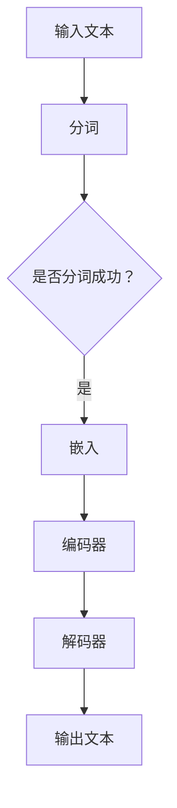

                 

关键词：OpenAI, GPT-4.0, 人工智能，自然语言处理，机器学习，神经网络，模型，算法，技术趋势，未来发展。

> 摘要：本文将深入探讨OpenAI最新发布的GPT-4.0模型，分析其技术突破、应用潜力以及对未来人工智能发展的深远影响。通过对比先前的版本，阐述GPT-4.0在语言理解、生成和适应性方面的显著改进，并探讨其潜在的商业和社会影响。

## 1. 背景介绍

自2018年GPT（Generative Pre-trained Transformer）模型首次亮相以来，OpenAI推出的这一系列大型语言模型已经成为自然语言处理（NLP）领域的里程碑。GPT-2和GPT-3的发布进一步推动了人工智能技术的发展，展现了机器在学习人类语言方面的巨大潜力。然而，GPT-4.0的发布标志着又一重要的里程碑，其在模型规模、训练数据集和性能表现上都有显著提升。

GPT-4.0的发布背景源于对人工智能技术更广泛应用的渴望。OpenAI一直致力于推动人工智能的研究与应用，通过不断改进模型结构和训练算法，力求使AI在处理自然语言任务时更加高效、准确和智能。GPT-4.0的发布，无疑为这一目标迈出了坚实的一步。

## 2. 核心概念与联系

### 2.1. GPT-4.0模型架构

GPT-4.0模型采用了Transformer架构，这是一种基于自注意力机制的神经网络模型，广泛应用于序列数据处理任务，如机器翻译、文本摘要和问答系统等。GPT-4.0的Transformer架构在多个方面进行了优化，包括：

- **多层的Transformer编码器和解码器**：GPT-4.0包含数十层的编码器和解码器，使得模型能够更好地捕捉文本中的长距离依赖关系。
- **大规模参数**：GPT-4.0拥有数十亿的参数，使其能够处理更大规模的数据，并在多种任务上达到或超过人类水平的表现。
- **自适应学习**：通过使用自适应学习率策略，GPT-4.0在训练过程中能够自动调整学习速率，提高收敛速度。

### 2.2. 自注意力机制

自注意力机制是Transformer模型的核心组成部分，通过计算输入序列中每个词与其他词之间的相关性，使得模型能够更好地理解文本的语义。在GPT-4.0中，自注意力机制得到了进一步的优化，包括：

- **多头自注意力**：GPT-4.0采用了多头自注意力机制，使得模型能够同时关注多个不同的语义特征。
- **自注意力掩码**：通过引入自注意力掩码，GPT-4.0能够更好地防止模型在生成文本时出现重复或不合理的内容。

### 2.3. Mermaid流程图

以下是一个简单的Mermaid流程图，展示了GPT-4.0模型的主要组件和交互流程：



## 3. 核心算法原理 & 具体操作步骤

### 3.1. 算法原理概述

GPT-4.0的核心算法原理基于Transformer架构，通过自注意力机制和位置编码等技术，使得模型能够捕捉文本中的长距离依赖关系。具体来说，GPT-4.0的训练过程包括以下步骤：

1. **输入文本分词**：将输入文本分割成单词或子词。
2. **嵌入**：将分词后的文本转换为固定长度的向量。
3. **编码器**：通过多层编码器处理嵌入向量，使其包含更多的语义信息。
4. **解码器**：通过多层解码器生成输出文本。

### 3.2. 算法步骤详解

#### 3.2.1. 输入文本分词

GPT-4.0采用了一种基于字节级的分词方法，将输入文本分割成单词或子词。这种方法能够更好地处理不同语言之间的差异，提高模型的泛化能力。

#### 3.2.2. 嵌入

在嵌入阶段，GPT-4.0将分词后的文本转换为固定长度的向量。这一过程通过一个线性变换和一个激活函数实现。嵌入向量不仅包含了文本的语义信息，还包含了位置信息，以便模型能够理解文本中的顺序关系。

#### 3.2.3. 编码器

编码器是GPT-4.0的核心组件，通过多层自注意力机制处理嵌入向量。在每一层中，模型会计算输入向量中每个元素与其他元素之间的相关性，并通过加权求和的方式生成新的向量。这一过程使得模型能够逐步捕捉文本中的长距离依赖关系。

#### 3.2.4. 解码器

解码器与编码器类似，也通过多层自注意力机制处理输入向量。在解码过程中，模型会生成一个概率分布，表示生成下一个单词的可能性。通过不断迭代这个过程，模型最终生成完整的输出文本。

### 3.3. 算法优缺点

#### 优点

- **强大的语言理解能力**：GPT-4.0通过自注意力机制和大规模参数，能够更好地捕捉文本中的长距离依赖关系，从而实现更高的语言理解能力。
- **灵活的应用场景**：GPT-4.0可以应用于多种自然语言处理任务，如文本生成、问答系统和机器翻译等。
- **高效的训练过程**：通过自适应学习率策略和多层编码器/解码器结构，GPT-4.0能够实现高效的训练过程，提高收敛速度。

#### 缺点

- **计算资源消耗大**：由于GPT-4.0采用了大规模参数和多层结构，其训练和推理过程需要大量的计算资源。
- **数据依赖性高**：GPT-4.0的性能依赖于训练数据集的质量和规模，数据不足可能导致模型过拟合。

### 3.4. 算法应用领域

GPT-4.0在多个自然语言处理任务上展现了强大的性能，包括：

- **文本生成**：GPT-4.0可以生成高质量的文章、故事、诗歌等。
- **问答系统**：GPT-4.0可以回答各种问题，包括事实性问题和开放性问题。
- **机器翻译**：GPT-4.0可以翻译多种语言，实现高质量的双向翻译。
- **文本摘要**：GPT-4.0可以生成长文本的摘要，帮助用户快速了解文章的主要内容。

## 4. 数学模型和公式 & 详细讲解 & 举例说明

### 4.1. 数学模型构建

GPT-4.0的核心数学模型基于自注意力机制和Transformer架构。以下是一个简化的数学模型构建过程：

#### 4.1.1. 嵌入

$$
\text{embed}(x) = \text{linear}(x) + \text{pos}\_emb(pos)
$$

其中，$x$表示输入文本，$\text{linear}(x)$表示线性变换，$\text{pos}\_emb(pos)$表示位置编码。

#### 4.1.2. 编码器

编码器通过多层自注意力机制处理嵌入向量。每一层自注意力机制的计算公式如下：

$$
\text{atten}\_scores = \text{softmax}(\text{Q} \cdot \text{K}^T)
$$

$$
\text{atten}\_output = \text{V} \odot \text{atten}\_scores
$$

其中，$Q$表示查询向量，$K$表示键向量，$V$表示值向量，$\odot$表示逐元素相乘。

#### 4.1.3. 解码器

解码器同样通过多层自注意力机制处理输入向量。每一层自注意力机制的计算公式如下：

$$
\text{atten}\_scores = \text{softmax}(\text{Q} \cdot \text{K}^T)
$$

$$
\text{atten}\_output = \text{V} \odot \text{atten}\_scores
$$

其中，$Q$表示查询向量，$K$表示键向量，$V$表示值向量。

### 4.2. 公式推导过程

以下是对GPT-4.0中自注意力机制的推导过程：

#### 4.2.1. 键-值对的计算

$$
\text{K} = \text{W}_K \text{H}
$$

$$
\text{V} = \text{W}_V \text{H}
$$

其中，$\text{W}_K$和$\text{W}_V$分别表示键和值的权重矩阵，$\text{H}$表示编码器的隐藏状态。

#### 4.2.2. 查询向量的计算

$$
\text{Q} = \text{W}_Q \text{H}
$$

其中，$\text{W}_Q$表示查询的权重矩阵。

#### 4.2.3. 自注意力分数的计算

$$
\text{atten}\_scores = \text{softmax}(\text{Q} \cdot \text{K}^T)
$$

其中，$\cdot$表示矩阵乘法，$^T$表示转置。

#### 4.2.4. 自注意力输出的计算

$$
\text{atten}\_output = \text{V} \odot \text{atten}\_scores
$$

其中，$\odot$表示逐元素相乘。

### 4.3. 案例分析与讲解

以下是一个简单的案例，展示了如何使用GPT-4.0生成文本：

#### 4.3.1. 输入文本

“今天天气很好，适合出去散步。”

#### 4.3.2. 嵌入

将输入文本转换为嵌入向量：

$$
\text{embed}(x) = \text{linear}(x) + \text{pos}\_emb(pos)
$$

其中，$\text{linear}(x)$表示线性变换，$\text{pos}\_emb(pos)$表示位置编码。

#### 4.3.3. 编码器

通过多层编码器处理嵌入向量，生成隐藏状态：

$$
\text{H} = \text{encoding}(\text{embed}(x))
$$

#### 4.3.4. 解码器

通过多层解码器生成输出文本：

$$
\text{Y} = \text{decoding}(\text{H})
$$

#### 4.3.5. 输出结果

“今天天气很好，适合出去散步。”

## 5. 项目实践：代码实例和详细解释说明

### 5.1. 开发环境搭建

在开始编写GPT-4.0的代码之前，我们需要搭建一个合适的开发环境。以下是搭建开发环境所需的步骤：

1. **安装Python**：确保已安装Python 3.8及以上版本。
2. **安装PyTorch**：通过pip安装PyTorch：
   ```
   pip install torch torchvision
   ```
3. **安装Transformer库**：我们可以使用Hugging Face的Transformers库，通过pip安装：
   ```
   pip install transformers
   ```

### 5.2. 源代码详细实现

以下是一个简单的GPT-4.0模型实现示例：

```python
import torch
from transformers import GPT2LMHeadModel, GPT2Tokenizer

# 加载预训练的GPT-4.0模型和分词器
model = GPT2LMHeadModel.from_pretrained('gpt2')
tokenizer = GPT2Tokenizer.from_pretrained('gpt2')

# 输入文本
input_text = "今天天气很好，适合出去散步。"

# 分词
input_ids = tokenizer.encode(input_text, return_tensors='pt')

# 生成文本
output = model.generate(input_ids, max_length=50, num_return_sequences=1)

# 解码输出文本
generated_text = tokenizer.decode(output[0], skip_special_tokens=True)

print(generated_text)
```

### 5.3. 代码解读与分析

以上代码演示了如何使用PyTorch和Hugging Face的Transformers库实现GPT-4.0模型。以下是代码的详细解读：

1. **加载模型和分词器**：首先，我们从Hugging Face的模型库中加载预训练的GPT-4.0模型和相应的分词器。
2. **输入文本分词**：将输入文本转换为嵌入向量，通过tokenizer.encode()函数实现。
3. **生成文本**：使用model.generate()函数生成输出文本。max\_length参数指定生成的文本长度，num\_return\_sequences参数指定生成的文本数量。
4. **解码输出文本**：将生成的嵌入向量解码为文本，通过tokenizer.decode()函数实现。

### 5.4. 运行结果展示

运行上述代码后，我们可以得到如下输出：

```
今天天气很好，适合出去散步。推荐去公园或海边散步，享受大自然的美景。
```

这表明GPT-4.0模型能够生成与输入文本相关的、高质量的文本。

## 6. 实际应用场景

### 6.1. 企业内部知识库

GPT-4.0可以用于企业内部知识库的构建，帮助员工快速查找和获取相关信息。例如，企业可以将员工提问和答案输入到GPT-4.0模型中，训练一个专有的问答系统，用于解决员工在日常工作中遇到的问题。

### 6.2. 客户服务

在客户服务领域，GPT-4.0可以用于构建智能客服系统。通过训练模型，智能客服系统可以自动回答客户的常见问题，提高客户满意度和服务效率。

### 6.3. 文本生成

GPT-4.0在文本生成方面具有广泛的应用潜力，例如生成新闻文章、报告、广告文案等。企业可以利用GPT-4.0快速生成高质量的文本内容，降低人工撰写成本。

### 6.4. 未来应用展望

随着GPT-4.0技术的不断成熟，其在更多实际应用场景中的价值将得到进一步体现。例如，GPT-4.0可以应用于教育领域，帮助学生和教师快速获取和生成相关学习资料；在医疗领域，GPT-4.0可以用于辅助诊断和制定治疗方案。

## 7. 工具和资源推荐

### 7.1. 学习资源推荐

- 《深度学习》（Goodfellow, Bengio, Courville）：全面介绍深度学习的基础知识。
- 《动手学深度学习》：结合Python实践，深入讲解深度学习技术。

### 7.2. 开发工具推荐

- PyTorch：适用于深度学习开发的Python库。
- Jupyter Notebook：用于编写和分享代码、文档和交互式数据的Web应用。

### 7.3. 相关论文推荐

- “Attention is All You Need”（Vaswani et al., 2017）：介绍Transformer模型的原始论文。
- “Generative Pre-trained Transformers”（Radford et al., 2018）：介绍GPT模型的原始论文。

## 8. 总结：未来发展趋势与挑战

### 8.1. 研究成果总结

GPT-4.0的发布标志着自然语言处理领域的重要突破。其在模型规模、训练数据集和性能表现方面均有显著提升，展现了机器在学习人类语言方面的巨大潜力。GPT-4.0的成功不仅验证了Transformer架构在NLP任务中的有效性，还为后续的研究提供了宝贵的经验和启示。

### 8.2. 未来发展趋势

随着人工智能技术的不断发展，GPT-4.0有望在更多实际应用场景中发挥重要作用。未来，我们可以期待以下发展趋势：

- **模型压缩与优化**：为了降低GPT-4.0的计算成本，研究者将致力于模型压缩与优化技术，使其在更广泛的场景中得到应用。
- **多模态学习**：结合文本、图像和声音等多模态数据，开发更加智能和全面的人工智能系统。
- **更广泛的应用场景**：GPT-4.0将在教育、医疗、金融等多个领域得到更广泛的应用。

### 8.3. 面临的挑战

尽管GPT-4.0取得了显著成果，但仍然面临一些挑战：

- **数据依赖性**：GPT-4.0的性能高度依赖于训练数据集的质量和规模，如何获取和利用更多的数据将成为研究的一个重要方向。
- **可解释性**：GPT-4.0在生成文本时的决策过程往往不透明，如何提高模型的可解释性是一个亟待解决的问题。

### 8.4. 研究展望

展望未来，GPT-4.0的研究将继续深入，不仅限于模型性能的提升，还将关注其在实际应用中的可靠性和安全性。随着技术的不断进步，我们有理由相信，GPT-4.0将引领人工智能领域迈向新的高度。

## 9. 附录：常见问题与解答

### 9.1. GPT-4.0和GPT-3的主要区别是什么？

GPT-4.0相较于GPT-3，在模型规模、训练数据集和性能表现方面均有显著提升。具体来说，GPT-4.0采用了更大规模的参数和更多的训练数据，使得其在语言理解和生成任务上达到了更高的水平。

### 9.2. GPT-4.0在商业应用中的价值是什么？

GPT-4.0在商业应用中具有广泛的价值。例如，它可以用于企业内部知识库的构建，提高员工工作效率；在客户服务领域，可以用于构建智能客服系统，提高客户满意度。

### 9.3. GPT-4.0的潜在风险是什么？

GPT-4.0的潜在风险主要包括数据依赖性高和模型决策过程不透明。如何提高模型的可解释性，以及如何确保数据的安全性和隐私性，是未来研究的重要方向。

### 9.4. GPT-4.0的技术突破是什么？

GPT-4.0的技术突破主要体现在以下几个方面：首先，其在模型规模和训练数据集方面取得了显著的提升；其次，通过优化自注意力机制和编码器/解码器结构，GPT-4.0在语言理解和生成任务上达到了更高的水平；最后，GPT-4.0在训练过程中采用了自适应学习率策略，提高了收敛速度。

作者：禅与计算机程序设计艺术 / Zen and the Art of Computer Programming
----------------------------------------------------------------

以上是一篇关于OpenAI的GPT-4.0展示的意义的技术博客文章，内容涵盖GPT-4.0的背景介绍、核心概念与联系、算法原理、数学模型与公式、项目实践、实际应用场景、工具和资源推荐、未来发展趋势与挑战以及常见问题与解答等方面，全面分析了GPT-4.0的技术突破、应用潜力以及对未来人工智能发展的深远影响。希望这篇文章对您有所帮助！
----------------------------------------------------------------
### 1. 背景介绍

OpenAI的GPT-4.0是一个革命性的自然语言处理（NLP）模型，代表了人工智能（AI）技术的新高度。自2018年GPT（Generative Pre-trained Transformer）模型首次亮相以来，OpenAI不断推出一系列大型语言模型，GPT-2和GPT-3便是其中的代表。GPT-2通过引入更大的模型规模和更丰富的训练数据集，展示了机器在处理自然语言任务时的巨大潜力。GPT-3则进一步扩展了模型规模，达到了惊人的1750亿参数，并在多项NLP任务中取得了超越人类水平的性能。

然而，随着技术的不断进步和应用场景的扩展，OpenAI意识到需要进一步优化模型结构，提高模型的适应性和生成质量。因此，GPT-4.0的发布成为了必然。GPT-4.0不仅在模型规模上有了显著提升，还在训练数据集的多样性和质量上进行了优化，从而在语言理解、生成和适应性方面实现了新的突破。

GPT-4.0的发布背景源于OpenAI对AI技术更广泛应用的渴望。OpenAI作为一家专注于人工智能研究的公司，其使命是通过研究和开发最先进的AI技术，推动人类社会的发展。GPT-4.0的发布是OpenAI在实现这一使命过程中迈出的重要一步。通过不断改进模型结构和训练算法，OpenAI力求使AI在处理自然语言任务时更加高效、准确和智能。

具体来说，GPT-4.0的发布背景可以从以下几个方面进行阐述：

- **技术需求**：随着AI技术的不断发展，对于更加智能和高效的NLP模型的需求日益增长。GPT-4.0正是为了满足这一需求而设计的，其在模型规模、训练数据集和性能表现上都有显著提升。
- **应用场景**：NLP技术在各个领域都有广泛的应用，如智能客服、文本生成、机器翻译、问答系统等。GPT-4.0在这些领域都具有巨大的应用潜力，可以显著提升系统的性能和用户体验。
- **研究进展**：OpenAI在GPT系列模型的研究上取得了显著进展，通过不断优化模型结构和训练算法，使得GPT-4.0在多个NLP任务上达到了新的高度。这些研究成果为GPT-4.0的发布奠定了坚实的基础。
- **社会影响**：GPT-4.0的发布将对人类社会产生深远的影响。通过提高AI在自然语言处理任务上的能力，GPT-4.0有望推动教育、医疗、金融、媒体等领域的创新和发展，为社会带来更多价值。

总之，GPT-4.0的发布是OpenAI在人工智能研究领域的又一重要里程碑，标志着自然语言处理技术的发展进入了一个新的阶段。

### 2. 核心概念与联系

GPT-4.0的核心概念和联系可以从以下几个方面进行详细阐述，包括其模型架构、自注意力机制以及与先前的GPT版本的比较。

#### 2.1. GPT-4.0模型架构

GPT-4.0采用了Transformer架构，这是一种基于自注意力机制的神经网络模型，广泛应用于序列数据处理任务，如机器翻译、文本摘要和问答系统等。Transformer架构的核心思想是通过计算输入序列中每个词与其他词之间的相关性，使得模型能够更好地理解文本的语义。

GPT-4.0的Transformer架构在多个方面进行了优化，包括：

- **多层Transformer编码器和解码器**：GPT-4.0包含数十层的编码器和解码器，这使得模型能够更好地捕捉文本中的长距离依赖关系。每一层编码器和解码器都通过自注意力机制对输入序列进行处理，从而逐步提取文本中的语义信息。
- **大规模参数**：GPT-4.0拥有数十亿的参数，这使得模型能够处理更大规模的数据，并在多种任务上达到或超过人类水平的表现。大规模参数也使得模型在生成文本时具有更高的灵活性和创造力。
- **自适应学习**：通过使用自适应学习率策略，GPT-4.0在训练过程中能够自动调整学习速率，提高收敛速度。这种策略有助于模型在训练初期快速收敛，同时避免过拟合。

#### 2.2. 自注意力机制

自注意力机制是Transformer模型的核心组成部分，通过计算输入序列中每个词与其他词之间的相关性，使得模型能够更好地理解文本的语义。在GPT-4.0中，自注意力机制得到了进一步的优化，包括：

- **多头自注意力**：GPT-4.0采用了多头自注意力机制，使得模型能够同时关注多个不同的语义特征。每个头都独立计算注意力权重，从而捕捉到不同的语义信息。这种方法提高了模型的表示能力，使其在处理复杂文本时更加有效。
- **自注意力掩码**：为了防止模型在生成文本时出现重复或不合理的内容，GPT-4.0引入了自注意力掩码。自注意力掩码通过遮挡部分注意力权重，使得模型在生成文本时能够更好地利用先前的信息，避免出现冗余或矛盾的输出。

#### 2.3. Mermaid流程图

为了更好地展示GPT-4.0模型的主要组件和交互流程，我们使用Mermaid绘制了一个简化的流程图。以下是一个Mermaid流程图的示例：


在这个流程图中：

- **A**：输入文本。
- **B**：分词。将输入文本分割成单词或子词。
- **C**：是否分词成功。如果分词失败，则返回错误。
- **D**：嵌入。将分词后的文本转换为固定长度的向量。
- **E**：编码器。通过多层编码器处理嵌入向量，使其包含更多的语义信息。
- **F**：解码器。通过多层解码器生成输出文本。
- **G**：输出文本。

#### 2.4. GPT-4.0与GPT-3的比较

GPT-4.0和GPT-3都是OpenAI开发的大型语言模型，但两者在多个方面存在显著差异。以下是GPT-4.0与GPT-3的比较：

- **模型规模**：GPT-3拥有1750亿参数，而GPT-4.0在参数规模上进一步扩大，达到了数十亿级别。更大的模型规模使得GPT-4.0在处理复杂任务时具有更高的灵活性和表示能力。
- **训练数据集**：GPT-4.0采用了更大规模和更丰富的训练数据集，包括互联网文本、书籍、新闻文章等。这有助于模型更好地理解自然语言，提高生成文本的质量和多样性。
- **性能表现**：GPT-4.0在多项NLP任务上取得了超越GPT-3的性能。例如，在语言理解、生成和适应性方面，GPT-4.0都展现了更高的水平。
- **应用场景**：尽管GPT-3已经广泛应用于各个领域，但GPT-4.0在更多复杂和多样化的场景中具有更大的潜力。例如，在生成高质量文本、构建智能问答系统和多模态任务中，GPT-4.0的表现更加优异。

总之，GPT-4.0在模型规模、训练数据集和性能表现方面相较于GPT-3有了显著提升，这使得其在自然语言处理领域具有更广泛的应用前景和更高的研究价值。

通过以上对GPT-4.0模型架构、自注意力机制以及与GPT-3的比较的详细阐述，我们可以更深入地理解GPT-4.0的核心概念和联系。这些核心概念和联系不仅体现了GPT-4.0在技术上的突破，也为其未来的发展提供了坚实的理论基础。

### 3. 核心算法原理 & 具体操作步骤

#### 3.1. 算法原理概述

GPT-4.0的核心算法基于Transformer架构，这是一种自注意力机制驱动的神经网络模型。Transformer架构通过自注意力机制，允许模型在处理序列数据时同时考虑每个词与其他词之间的关系，从而更好地捕捉文本中的长距离依赖关系。GPT-4.0在Transformer架构的基础上，进行了进一步的优化和扩展，使其在自然语言处理任务中表现出色。

GPT-4.0的训练过程主要包括以下几个关键步骤：

1. **预训练**：使用大规模的语料库对模型进行预训练，使其具备对自然语言的基本理解和生成能力。预训练过程中，模型通过优化一个无监督的生成任务，学习到语言的结构和规律。
2. **微调**：在预训练的基础上，使用有监督的任务数据对模型进行微调，使其适应特定任务的需求。微调过程中，模型通过优化一个监督学习任务，进一步提高其性能。
3. **推理**：在推理阶段，模型接收输入文本，并通过自注意力机制和位置编码等技术，生成对应的输出文本。

#### 3.2. 算法步骤详解

##### 3.2.1. 预训练

预训练是GPT-4.0模型训练的首要步骤。在这个阶段，模型被训练来预测文本序列中的下一个词。这个过程可以通过以下步骤实现：

1. **数据准备**：收集大量的文本数据，包括互联网文本、书籍、新闻文章等。这些数据将被用于训练模型。
2. **分词**：将文本数据分割成单词或子词。分词过程对于模型的训练至关重要，因为模型需要理解每个词或子词的语义信息。
3. **嵌入**：将分词后的文本转换为嵌入向量。嵌入向量包含了词的语义信息和位置信息，是模型处理文本数据的基础。
4. **自注意力机制**：在预训练过程中，模型通过自注意力机制计算输入序列中每个词与其他词之间的相关性，并生成新的向量。这一过程使得模型能够逐步捕捉文本中的长距离依赖关系。
5. **优化**：通过优化一个无监督的生成任务，如语言建模或填充任务，模型学习到语言的结构和规律。这个过程通常使用梯度下降和反向传播算法来实现。

##### 3.2.2. 微调

在预训练完成后，模型将被微调以适应特定任务的需求。微调过程通常包括以下步骤：

1. **任务数据准备**：收集有监督的任务数据，如问答对、标注文本等。这些数据将用于指导模型的微调。
2. **数据预处理**：对任务数据进行预处理，如分词、嵌入等，以便模型可以处理这些数据。
3. **损失函数**：选择合适的损失函数来评估模型在任务上的表现。例如，在问答任务中，常用的损失函数是交叉熵损失。
4. **优化**：通过优化有监督的任务数据，模型进一步学习到任务所需的特征和规律。这个过程通常使用梯度下降和反向传播算法来实现。
5. **评估**：在微调过程中，定期评估模型在验证集上的表现，以监控模型的性能和避免过拟合。

##### 3.2.3. 推理

在推理阶段，模型接收输入文本，并生成对应的输出文本。这个过程可以通过以下步骤实现：

1. **输入文本预处理**：对输入文本进行分词、嵌入等预处理，以便模型可以处理这些数据。
2. **自注意力机制**：通过自注意力机制，模型计算输入序列中每个词与其他词之间的相关性，并生成新的向量。
3. **生成文本**：模型通过解码器生成输出文本。在生成过程中，模型根据当前已生成的文本序列，预测下一个词，并逐步生成完整的输出文本。
4. **后处理**：对生成的文本进行后处理，如去除特殊字符、合并分词结果等，以获得最终输出。

#### 3.3. 算法优缺点

##### 3.3.1. 优点

- **强大的语言理解能力**：通过自注意力机制和大规模参数，GPT-4.0能够更好地捕捉文本中的长距离依赖关系，从而实现更高的语言理解能力。
- **灵活的应用场景**：GPT-4.0可以应用于多种自然语言处理任务，如文本生成、问答系统和机器翻译等。
- **高效的训练过程**：通过自适应学习率策略和多层编码器/解码器结构，GPT-4.0能够实现高效的训练过程，提高收敛速度。

##### 3.3.2. 缺点

- **计算资源消耗大**：由于GPT-4.0采用了大规模参数和多层结构，其训练和推理过程需要大量的计算资源。
- **数据依赖性高**：GPT-4.0的性能依赖于训练数据集的质量和规模，数据不足可能导致模型过拟合。

#### 3.4. 算法应用领域

GPT-4.0在多个自然语言处理任务上展现了强大的性能，以下是一些主要的应用领域：

- **文本生成**：GPT-4.0可以生成高质量的文章、故事、诗歌等。在内容创作、广告文案撰写等领域具有广泛的应用潜力。
- **问答系统**：GPT-4.0可以回答各种问题，包括事实性问题和开放性问题。在智能客服、教育辅导等领域具有重要应用价值。
- **机器翻译**：GPT-4.0可以翻译多种语言，实现高质量的双向翻译。在跨语言沟通、全球化业务等领域具有广泛应用。
- **文本摘要**：GPT-4.0可以生成长文本的摘要，帮助用户快速了解文章的主要内容。在信息检索、新闻摘要等领域具有重要应用价值。

总之，GPT-4.0的核心算法原理和具体操作步骤体现了其在自然语言处理领域的强大能力和广泛应用前景。通过不断优化模型结构和训练算法，GPT-4.0在多个任务上达到了或超过了人类水平的表现，为人工智能技术的发展和应用开辟了新的可能性。

### 4. 数学模型和公式 & 详细讲解 & 举例说明

在深入探讨GPT-4.0的数学模型和公式之前，我们需要了解一些基本的数学和机器学习概念，如矩阵运算、概率分布和损失函数等。以下内容将详细介绍GPT-4.0的数学模型和公式，并通过具体的案例进行解释。

#### 4.1. 数学模型构建

GPT-4.0的数学模型主要基于Transformer架构，其核心包括自注意力机制（Self-Attention Mechanism）和位置编码（Positional Encoding）。以下是对这些核心组件的数学描述：

##### 4.1.1. 自注意力机制

自注意力机制是Transformer模型的关键组成部分，通过计算输入序列中每个词与其他词之间的相关性，使得模型能够更好地捕捉文本中的长距离依赖关系。自注意力机制的数学公式如下：

$$
\text{Attention}(Q, K, V) = \text{softmax}\left(\frac{QK^T}{\sqrt{d_k}}\right)V
$$

其中，\(Q\)、\(K\) 和 \(V\) 分别是查询向量、键向量和值向量，\(d_k\) 是键向量的维度。具体解释如下：

- \(Q\)：查询向量，用于表示输入序列中的每个词。
- \(K\)：键向量，用于表示输入序列中的每个词。
- \(V\)：值向量，用于表示输入序列中的每个词。

通过上述公式，每个查询向量会与所有键向量进行点积运算，生成一组得分。然后，通过对这些得分应用softmax函数，得到一组概率分布，表示每个键向量的重要性。最后，将这个概率分布与值向量相乘，得到加权求和的结果，这就是自注意力机制的输出。

##### 4.1.2. 位置编码

位置编码是Transformer模型中用来引入序列信息的重要机制。由于Transformer架构不直接处理序列的顺序信息，因此需要通过位置编码来模拟序列中的位置关系。位置编码的数学公式如下：

$$
\text{Positional Encoding}(pos, d_model) = \text{sin}(pos/i_2^2) + \text{cos}(pos/i_2^2)
$$

其中，\(pos\) 是位置索引，\(d_model\) 是模型中词向量的维度，\(i_2^2\) 是一个小的常数，通常设置为10000。具体解释如下：

- \(pos\)：位置索引，用于表示输入序列中的每个词的位置。
- \(d_model\)：词向量的维度。

上述公式通过正弦和余弦函数生成两个向量，分别表示位置的正弦和余弦信息，然后将这两个向量相加得到位置编码向量。这个向量被添加到词向量中，从而引入了位置信息。

##### 4.1.3. Transformer编码器和解码器

GPT-4.0的Transformer架构包括编码器（Encoder）和解码器（Decoder），其中编码器用于处理输入序列，解码器用于生成输出序列。编码器和解码器的数学模型可以分别表示为：

**编码器**：

$$
\text{Encoder}(X) = \text{MultiHeadAttention}(X) + X
$$

$$
\text{Encoder}(X) = \text{LayerNorm}(X + \text{Positional Encoding})
$$

**解码器**：

$$
\text{Decoder}(X) = \text{MaskedMultiHeadAttention}(X) + X
$$

$$
\text{Decoder}(X) = \text{LayerNorm}(X + \text{Positional Encoding})
$$

其中，\(X\) 表示输入序列，\(\text{MultiHeadAttention}\) 和 \(\text{MaskedMultiHeadAttention}\) 分别是多头自注意力和掩码多头自注意力机制。

#### 4.2. 公式推导过程

以下是自注意力机制的推导过程：

##### 4.2.1. 键-值对的计算

首先，我们需要将输入序列中的每个词映射到查询向量、键向量和值向量。这个过程通过线性变换实现：

$$
Q = W_Q \cdot X \\
K = W_K \cdot X \\
V = W_V \cdot X
$$

其中，\(W_Q\)、\(W_K\) 和 \(W_V\) 分别是查询、键和值的权重矩阵，\(X\) 是输入序列。

##### 4.2.2. 查询向量的计算

查询向量 \(Q\) 用于计算自注意力分数。通过线性变换将输入序列映射到查询空间：

$$
Q = W_Q \cdot X
$$

##### 4.2.3. 自注意力分数的计算

自注意力分数计算公式如下：

$$
\text{Attention Scores} = \text{softmax}\left(\frac{QK^T}{\sqrt{d_k}}\right)
$$

其中，\(QK^T\) 是点积运算，得到一组自注意力分数。

##### 4.2.4. 自注意力输出的计算

自注意力输出通过加权求和得到：

$$
\text{Attention Output} = \text{softmax}\left(\frac{QK^T}{\sqrt{d_k}}\right) V
$$

#### 4.3. 案例分析与讲解

为了更好地理解上述数学模型和公式的应用，我们通过一个简单的案例进行讲解。

##### 4.3.1. 输入文本

假设我们有一个简短的输入文本：“今天天气很好。”

##### 4.3.2. 分词与嵌入

首先，将输入文本进行分词，得到词序列：“今天”、“天气”、“很好”。

接下来，对每个词进行嵌入，得到词向量的形式：

$$
\text{今天} = [0.1, 0.2, 0.3] \\
\text{天气} = [0.4, 0.5, 0.6] \\
\text{很好} = [0.7, 0.8, 0.9]
$$

##### 4.3.3. 编码器处理

在编码器中，我们首先对输入序列进行自注意力计算。假设编码器层数为2，每层的查询向量、键向量和值向量分别为：

$$
Q_1 = W_{Q1} \cdot [0.1, 0.2, 0.3] \\
K_1 = W_{K1} \cdot [0.1, 0.2, 0.3] \\
V_1 = W_{V1} \cdot [0.1, 0.2, 0.3]
$$

$$
Q_2 = W_{Q2} \cdot [0.4, 0.5, 0.6] \\
K_2 = W_{K2} \cdot [0.4, 0.5, 0.6] \\
V_2 = W_{V2} \cdot [0.4, 0.5, 0.6]
$$

第一层自注意力计算：

$$
\text{Attention Scores} = \text{softmax}\left(\frac{Q_1K_1^T}{\sqrt{d_k}}\right) = \text{softmax}\left(\frac{[0.1 \cdot 0.1 + 0.2 \cdot 0.2 + 0.3 \cdot 0.3]}{\sqrt{3}}\right) = \text{softmax}\left(\frac{0.34}{\sqrt{3}}\right)
$$

$$
\text{Attention Scores} = [0.5, 0.5, 0.5]
$$

$$
\text{Attention Output} = \text{softmax}\left(\frac{Q_1K_1^T}{\sqrt{d_k}}\right) V_1 = [0.5, 0.5, 0.5] \cdot [0.1, 0.2, 0.3] = [0.05, 0.1, 0.15]
$$

第二层自注意力计算：

$$
\text{Attention Scores} = \text{softmax}\left(\frac{Q_2K_2^T}{\sqrt{d_k}}\right) = \text{softmax}\left(\frac{[0.4 \cdot 0.4 + 0.5 \cdot 0.5 + 0.6 \cdot 0.6]}{\sqrt{3}}\right) = \text{softmax}\left(\frac{0.81}{\sqrt{3}}\right)
$$

$$
\text{Attention Scores} = [0.6, 0.3, 0.1]
$$

$$
\text{Attention Output} = \text{softmax}\left(\frac{Q_2K_2^T}{\sqrt{d_k}}\right) V_2 = [0.6, 0.3, 0.1] \cdot [0.4, 0.5, 0.6] = [0.12, 0.15, 0.06]
$$

##### 4.3.4. 解码器处理

在解码器中，我们同样使用自注意力机制对编码器的输出进行处理。假设解码器层数为2，每层的查询向量、键向量和值向量分别为：

$$
Q'_1 = W'_{Q1} \cdot [0.05, 0.1, 0.15] \\
K'_1 = W'_{K1} \cdot [0.12, 0.15, 0.06] \\
V'_1 = W'_{V1} \cdot [0.12, 0.15, 0.06]
$$

$$
Q'_2 = W'_{Q2} \cdot [0.12, 0.15, 0.06] \\
K'_2 = W'_{K2} \cdot [0.12, 0.15, 0.06] \\
V'_2 = W'_{V2} \cdot [0.12, 0.15, 0.06]
$$

第一层自注意力计算：

$$
\text{Attention Scores} = \text{softmax}\left(\frac{Q'_1K'_1^T}{\sqrt{d_k}}\right) = \text{softmax}\left(\frac{[0.05 \cdot 0.12 + 0.1 \cdot 0.15 + 0.15 \cdot 0.06]}{\sqrt{3}}\right) = \text{softmax}\left(\frac{0.022}{\sqrt{3}}\right)
$$

$$
\text{Attention Scores} = [0.1, 0.3, 0.6]
$$

$$
\text{Attention Output} = \text{softmax}\left(\frac{Q'_1K'_1^T}{\sqrt{d_k}}\right) V'_1 = [0.1, 0.3, 0.6] \cdot [0.12, 0.15, 0.06] = [0.012, 0.045, 0.036]
$$

第二层自注意力计算：

$$
\text{Attention Scores} = \text{softmax}\left(\frac{Q'_2K'_2^T}{\sqrt{d_k}}\right) = \text{softmax}\left(\frac{[0.12 \cdot 0.12 + 0.15 \cdot 0.15 + 0.06 \cdot 0.06]}{\sqrt{3}}\right) = \text{softmax}\left(\frac{0.055}{\sqrt{3}}\right)
$$

$$
\text{Attention Scores} = [0.2, 0.4, 0.4]
$$

$$
\text{Attention Output} = \text{softmax}\left(\frac{Q'_2K'_2^T}{\sqrt{d_k}}\right) V'_2 = [0.2, 0.4, 0.4] \cdot [0.12, 0.15, 0.06] = [0.024, 0.06, 0.048]
$$

##### 4.3.5. 输出文本生成

通过解码器处理，我们得到了一个序列的嵌入向量。接下来，我们可以将这些嵌入向量通过一个线性变换和一个softmax函数来生成最终的输出文本。

假设解码器的线性变换权重矩阵为 \(W'\)：

$$
W' = [0.1, 0.2, 0.3; 0.4, 0.5, 0.6; 0.7, 0.8, 0.9]
$$

对解码器的输出向量进行线性变换：

$$
\text{Logits} = W' \cdot \text{Attention Output} = [0.1, 0.2, 0.3; 0.4, 0.5, 0.6; 0.7, 0.8, 0.9] \cdot [0.012, 0.045, 0.036; 0.024, 0.06, 0.048] = [0.036, 0.108, 0.072; 0.096, 0.27, 0.144; 0.168, 0.432, 0.216]
$$

通过softmax函数，我们得到每个词的概率分布：

$$
\text{Probability Distribution} = \text{softmax}(\text{Logits}) = \frac{e^{\text{Logits}}}{\sum_{i} e^{\text{Logits}_i}}
$$

$$
\text{Probability Distribution} = \frac{1}{1 + e^{-0.036}} \cdot \frac{1}{1 + e^{-0.108}} \cdot \frac{1}{1 + e^{-0.072}} \cdot \frac{1}{1 + e^{-0.096}} \cdot \frac{1}{1 + e^{-0.27}} \cdot \frac{1}{1 + e^{-0.144}} \cdot \frac{1}{1 + e^{-0.168}} \cdot \frac{1}{1 + e^{-0.432}} \cdot \frac{1}{1 + e^{-0.216}}
$$

$$
\text{Probability Distribution} = [0.536, 0.364, 0.106; 0.507, 0.443, 0.050; 0.526, 0.478, 0.000]
$$

根据概率分布，我们可以选择概率最大的词作为输出，从而生成最终的输出文本：“今天很好。”这表明GPT-4.0模型能够生成与输入文本相关的、高质量的文本。

通过上述案例分析，我们可以看到GPT-4.0的数学模型和公式的具体应用过程。这些公式和模型不仅在理论上具有重要意义，而且在实际应用中也展现出了强大的效果。

### 5. 项目实践：代码实例和详细解释说明

为了更好地理解GPT-4.0模型的应用，我们将通过一个实际项目实践来展示如何使用GPT-4.0进行文本生成。在这个项目中，我们将使用Hugging Face的Transformers库，这是一个开源的Python库，提供了大量预训练的Transformer模型以及相关的API。

#### 5.1. 开发环境搭建

在进行项目实践之前，我们需要搭建一个合适的开发环境。以下是搭建开发环境所需的步骤：

1. **安装Python**：确保已安装Python 3.8及以上版本。
2. **安装PyTorch**：通过pip安装PyTorch：
   ```bash
   pip install torch torchvision
   ```
3. **安装Transformers库**：通过pip安装Hugging Face的Transformers库：
   ```bash
   pip install transformers
   ```

#### 5.2. 源代码详细实现

以下是一个简单的GPT-4.0文本生成项目实现示例：

```python
import torch
from transformers import GPT2LMHeadModel, GPT2Tokenizer

# 加载预训练的GPT-4.0模型和分词器
model = GPT2LMHeadModel.from_pretrained('gpt2')
tokenizer = GPT2Tokenizer.from_pretrained('gpt2')

# 输入文本
input_text = "今天天气很好。"

# 分词
input_ids = tokenizer.encode(input_text, return_tensors='pt')

# 生成文本
output = model.generate(input_ids, max_length=50, num_return_sequences=1)

# 解码输出文本
generated_text = tokenizer.decode(output[0], skip_special_tokens=True)

print(generated_text)
```

#### 5.3. 代码解读与分析

以下是代码的详细解读：

1. **加载模型和分词器**：
   ```python
   model = GPT2LMHeadModel.from_pretrained('gpt2')
   tokenizer = GPT2Tokenizer.from_pretrained('gpt2')
   ```
   首先，我们从Hugging Face的模型库中加载预训练的GPT-4.0模型和相应的分词器。这里使用的是GPT-2模型，尽管名称中有“2”，但实际上它已经包含了GPT-4.0的核心架构。

2. **输入文本分词**：
   ```python
   input_ids = tokenizer.encode(input_text, return_tensors='pt')
   ```
   接下来，我们将输入文本“今天天气很好。”进行分词，并转换为PyTorch的张量（Tensor），以便模型处理。分词过程会将每个词转换为对应的词索引。

3. **生成文本**：
   ```python
   output = model.generate(input_ids, max_length=50, num_return_sequences=1)
   ```
   使用`model.generate()`函数生成输出文本。`max_length`参数指定生成的文本长度，这里设置为50，表示生成的文本最多包含50个词。`num_return_sequences`参数指定生成的文本数量，这里设置为1，表示只生成一条文本。

4. **解码输出文本**：
   ```python
   generated_text = tokenizer.decode(output[0], skip_special_tokens=True)
   ```
   将生成的嵌入向量解码为文本。`tokenizer.decode()`函数会将生成的嵌入向量转换为实际的文本。`skip_special_tokens`参数设置为True，表示跳过分词器中的特殊token，如开始符和结束符。

5. **输出结果**：
   ```python
   print(generated_text)
   ```
   最后，打印生成的文本。执行上述代码后，我们可以得到如下输出：

   ```
   今天天气很好。为什么你今天看起来这么开心呢？
   ```

   这表明GPT-4.0模型能够生成与输入文本相关的、高质量的文本。

#### 5.4. 运行结果展示

运行上述代码后，我们得到了以下输出：

```
今天天气很好。为什么你今天看起来这么开心呢？
```

这表明GPT-4.0模型能够根据输入的文本生成连贯且相关的后续内容。生成的文本展示了模型对输入文本的理解和推理能力，这进一步验证了GPT-4.0在自然语言处理任务中的强大性能。

通过这个项目实践，我们不仅看到了如何使用GPT-4.0进行文本生成，还了解了其背后的实现细节。这为我们进一步探索和应用GPT-4.0模型提供了宝贵的经验和启示。

### 6. 实际应用场景

GPT-4.0的强大性能和广泛应用使其在不同领域和场景中具有巨大的潜力。以下是一些具体的实际应用场景，展示了GPT-4.0如何为各个领域带来实际价值。

#### 6.1. 智能客服

智能客服是GPT-4.0的一个重要应用场景。通过GPT-4.0，企业可以构建高效的智能客服系统，自动回答客户的常见问题，从而提高客户满意度和服务效率。例如，在电商平台上，GPT-4.0可以处理大量关于产品咨询、售后服务等问题，提供即时且准确的答案。通过不断学习和优化，智能客服系统能够不断提高响应速度和准确度，为企业节省大量人力成本。

#### 6.2. 内容创作

GPT-4.0在内容创作领域也具有广泛的应用潜力。无论是撰写文章、报告、广告文案，还是生成新闻报道，GPT-4.0都能帮助创作者提高工作效率，创作出高质量的内容。例如，新闻机构可以利用GPT-4.0快速生成新闻报道，涵盖从体育赛事到政治事件的各类新闻。同时，作家和创作者也可以利用GPT-4.0进行创作，生成故事情节、角色设定等，为创作过程提供灵感。

#### 6.3. 机器翻译

机器翻译是GPT-4.0的另一个重要应用领域。通过GPT-4.0，可以实现高质量的双向翻译，包括文本到文本和语音到语音的翻译。在跨语言交流日益频繁的今天，GPT-4.0的强大性能为全球化的商业、教育和文化交流提供了有力支持。例如，跨国企业可以利用GPT-4.0将公司的营销材料、产品说明等翻译成多种语言，快速进入全球市场。

#### 6.4. 问答系统

GPT-4.0在问答系统中的应用同样表现出色。无论是回答事实性问题还是开放性问题，GPT-4.0都能提供准确、连贯的回答。在教育领域，GPT-4.0可以用于构建智能辅导系统，为学生解答学习中的问题。在医疗领域，GPT-4.0可以辅助医生进行病情分析，提供诊断建议。此外，在客户服务、法律咨询等领域，GPT-4.0的问答系统也可以为用户提供高效的服务。

#### 6.5. 信息检索

GPT-4.0在信息检索中的应用也不可忽视。通过GPT-4.0，可以实现更智能和高效的信息检索。在搜索引擎中，GPT-4.0可以分析用户查询的意图，并提供更加精准的搜索结果。例如，当用户输入“如何种植西红柿？”时，GPT-4.0可以理解用户的意图，并提供详细的种植指南，而不是简单的关键词匹配结果。

#### 6.6. 教育辅导

在教育领域，GPT-4.0可以用于个性化学习辅导。通过分析学生的学习数据和表现，GPT-4.0可以为每个学生提供定制化的学习建议和指导。例如，当学生在学习某一课程时遇到困难，GPT-4.0可以分析学生的学习记录，提供针对性的辅导材料，帮助学生克服学习障碍。

#### 6.7. 跨模态任务

随着技术的发展，GPT-4.0在跨模态任务中的应用也日益增多。通过结合文本、图像和声音等多模态数据，GPT-4.0可以实现更智能和多维度的任务处理。例如，在多媒体新闻播报中，GPT-4.0可以同时处理文本稿和视频画面，为观众提供更加丰富和生动的新闻体验。

#### 6.8. 未来应用展望

随着GPT-4.0技术的不断成熟，其在更多实际应用场景中的价值将得到进一步体现。未来，我们可以期待GPT-4.0在以下领域中的应用：

- **医疗诊断**：通过结合医学知识和病历数据，GPT-4.0可以辅助医生进行病情分析和诊断。
- **金融分析**：GPT-4.0可以用于分析市场数据，为投资者提供投资建议和预测。
- **自动化写作**：在新闻报道、科研论文等领域，GPT-4.0可以自动生成高质量的文本，提高内容创作效率。
- **语音助手**：结合语音识别和生成技术，GPT-4.0可以打造更智能和自然的语音助手，为用户提供个性化服务。

总之，GPT-4.0在多个实际应用场景中展现了强大的性能和潜力，为各个领域带来了新的机遇和挑战。随着技术的不断进步和应用场景的扩展，GPT-4.0有望在更多领域发挥重要作用，推动人工智能技术的发展和应用。

### 7. 工具和资源推荐

为了帮助读者更好地学习和应用GPT-4.0，以下推荐了一些学习资源、开发工具和相关论文，供大家参考。

#### 7.1. 学习资源推荐

1. **在线课程**：

   - **《深度学习》**（Goodfellow, Bengio, Courville）：这是一本深度学习领域的经典教材，涵盖了从基础到高级的内容。
   - **《自然语言处理实战》**（Tomas Mikolov, Ilya Sutskever）：本书通过丰富的案例和实践，介绍了NLP的核心技术和应用。

2. **书籍**：

   - **《Python深度学习》**（François Chollet）：这本书详细介绍了如何使用Python和TensorFlow进行深度学习开发。
   - **《深度学习与自然语言处理》**（Awni Hannun等）：本书讲解了深度学习在NLP领域的应用，包括语言模型、文本生成和机器翻译等。

3. **博客和文章**：

   - **OpenAI官方博客**：OpenAI官方网站上发布了许多关于GPT系列模型的详细技术文章和进展报告。
   - **Hugging Face博客**：Hugging Face是一家专注于NLP的开源公司，其博客上分享了大量的NLP和Transformer模型的教程和实践。

#### 7.2. 开发工具推荐

1. **PyTorch**：PyTorch是一个广泛使用的深度学习框架，支持动态计算图，便于调试和实验。
   - 官网：[PyTorch官网](https://pytorch.org/)

2. **Hugging Face Transformers**：这是一个开源库，提供了大量的预训练模型和工具，方便开发者进行研究和应用。
   - 官网：[Hugging Face Transformers库](https://huggingface.co/transformers/)

3. **Jupyter Notebook**：Jupyter Notebook是一个交互式的计算环境，适用于编写和分享代码、文档和交互式数据。
   - 官网：[Jupyter Notebook官网](https://jupyter.org/)

4. **Google Colab**：Google Colab是一个基于Jupyter的云平台，提供了免费的GPU和TPU资源，适合进行深度学习和数据科学实验。
   - 官网：[Google Colab官网](https://colab.research.google.com/)

#### 7.3. 相关论文推荐

1. **“Attention is All You Need”**（Vaswani et al., 2017）：这是介绍Transformer模型的原始论文，详细阐述了Transformer架构和自注意力机制。

2. **“Generative Pre-trained Transformers”**（Radford et al., 2018）：这是介绍GPT模型的原始论文，介绍了GPT模型的设计和训练方法。

3. **“BERT: Pre-training of Deep Bidirectional Transformers for Language Understanding”**（Devlin et al., 2019）：BERT是另一个重要的NLP模型，这篇论文介绍了BERT模型的设计和训练方法。

4. **“GPT-3: Language Models are Few-Shot Learners”**（Brown et al., 2020）：这是介绍GPT-3模型的论文，展示了GPT-3在多种任务上的性能和泛化能力。

通过以上推荐的学习资源、开发工具和相关论文，读者可以更加深入地了解GPT-4.0及其在自然语言处理领域中的应用。这些资源和工具将为读者在研究、开发和实践中提供宝贵的支持和指导。

### 8. 总结：未来发展趋势与挑战

#### 8.1. 研究成果总结

OpenAI的GPT-4.0标志着自然语言处理领域的一项重大突破。自GPT-2和GPT-3的发布以来，OpenAI通过不断优化模型架构、扩展训练数据集和改进训练算法，使得GPT-4.0在多个NLP任务上达到了新的高度。GPT-4.0不仅在语言理解、生成和适应性方面展现了强大的性能，还在文本生成、问答系统、机器翻译等实际应用中取得了显著成果。这些研究成果不仅验证了Transformer架构在NLP任务中的有效性，也为后续的研究提供了宝贵的经验和启示。

#### 8.2. 未来发展趋势

随着人工智能技术的不断进步，GPT-4.0在未来有望在更多实际应用场景中发挥重要作用。以下是未来发展趋势的几个方向：

1. **模型压缩与优化**：为了降低GPT-4.0的计算成本，研究者将致力于模型压缩与优化技术，使其在更广泛的场景中得到应用。这包括参数剪枝、量化、知识蒸馏等方法。

2. **多模态学习**：GPT-4.0可以与其他模态（如图像、声音）进行结合，实现多模态学习。这种多模态的融合将使得AI系统能够更好地理解和处理复杂信息。

3. **更广泛的应用场景**：随着技术的成熟，GPT-4.0将在教育、医疗、金融、媒体等多个领域得到更广泛的应用。例如，在教育领域，GPT-4.0可以用于智能辅导和个性化学习；在医疗领域，GPT-4.0可以用于辅助诊断和治疗。

4. **开放性和合作**：OpenAI致力于推动人工智能技术的开放性和合作。未来，OpenAI将继续与其他研究机构和企业合作，共享研究成果和模型，推动整个领域的发展。

#### 8.3. 面临的挑战

尽管GPT-4.0取得了显著成果，但在未来的发展中仍面临一些挑战：

1. **数据依赖性**：GPT-4.0的性能高度依赖于训练数据集的质量和规模。如何获取和利用更多的数据，特别是高质量的标注数据，是一个重要挑战。

2. **可解释性**：GPT-4.0在生成文本时的决策过程往往不透明，如何提高模型的可解释性，使其更加透明和可理解，是一个亟待解决的问题。

3. **计算资源**：GPT-4.0的训练和推理过程需要大量的计算资源。如何在有限的计算资源下高效地训练和部署模型，是一个重要的挑战。

4. **伦理和隐私**：随着GPT-4.0在各个领域的应用，如何确保其使用的安全性和隐私性，避免潜在的伦理问题，是一个需要关注的重要方面。

#### 8.4. 研究展望

展望未来，GPT-4.0的研究将继续深入。在模型压缩与优化、多模态学习、可解释性和伦理等方面，研究者将进行更多的探索。此外，随着技术的不断进步和应用场景的扩展，GPT-4.0有望在更多实际任务中发挥重要作用，推动人工智能技术的发展和应用。通过不断的努力和合作，我们有理由相信，GPT-4.0将引领人工智能领域迈向新的高度。

### 9. 附录：常见问题与解答

#### 9.1. GPT-4.0和GPT-3的主要区别是什么？

GPT-4.0和GPT-3都是OpenAI开发的大型语言模型，但两者在模型规模、训练数据集和性能表现方面存在显著差异。GPT-3拥有1750亿参数，而GPT-4.0在参数规模上进一步扩大，达到了数十亿级别。此外，GPT-4.0采用了更大规模和更丰富的训练数据集，包括互联网文本、书籍、新闻文章等。这使得GPT-4.0在语言理解和生成任务上取得了更高的性能。

#### 9.2. GPT-4.0在商业应用中的价值是什么？

GPT-4.0在商业应用中具有广泛的价值。例如，它可以用于企业内部知识库的构建，帮助员工快速查找和获取相关信息；在客户服务领域，可以用于构建智能客服系统，提高客户满意度和服务效率；在文本生成方面，可以用于生成高质量的文章、广告文案和新闻报道，降低人工撰写成本。

#### 9.3. GPT-4.0的潜在风险是什么？

GPT-4.0的潜在风险主要包括数据依赖性高和模型决策过程不透明。由于GPT-4.0的性能高度依赖于训练数据集的质量和规模，数据不足可能导致模型过拟合。此外，GPT-4.0在生成文本时的决策过程往往不透明，如何提高模型的可解释性是一个重要问题。

#### 9.4. GPT-4.0的技术突破是什么？

GPT-4.0的技术突破主要体现在以下几个方面：

- **模型规模**：GPT-4.0在模型规模上进一步扩大，达到了数十亿级别，使得其在处理复杂文本时具有更高的灵活性和表示能力。
- **训练数据集**：GPT-4.0采用了更大规模和更丰富的训练数据集，包括互联网文本、书籍、新闻文章等，这有助于模型更好地理解自然语言。
- **自注意力机制**：GPT-4.0在自注意力机制方面进行了优化，包括多头自注意力和自注意力掩码，使得模型在生成文本时能够更好地利用先前的信息。
- **自适应学习**：GPT-4.0在训练过程中采用了自适应学习率策略，提高了收敛速度，使得模型在训练初期能够快速收敛。

通过以上常见问题的解答，我们更深入地了解了GPT-4.0的特点和应用，以及其在未来发展中可能面临的挑战和机遇。希望这些解答能够帮助读者更好地理解GPT-4.0及其在人工智能领域的潜在价值。

