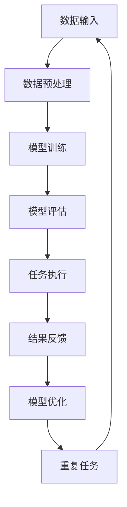

                 

 在现代计算机科学领域，任务解决模型已经成为研究者和工程师们关注的焦点。随着人工智能、机器学习、大数据等技术的快速发展，传统单一的模型已经难以应对复杂的现实任务。P5模型作为一种新兴的统一任务解决方案，吸引了广泛的关注。本文将深入探讨P5模型的概念、原理、算法、应用以及未来发展趋势，旨在为读者提供全面的了解。

## 关键词

- P5模型
- 统一任务解决方案
- 人工智能
- 机器学习
- 大数据
- 算法

## 摘要

本文旨在介绍P5模型，一种旨在解决复杂任务的统一解决方案。通过深入分析P5模型的核心概念、原理和架构，本文将揭示其独特之处和优势。此外，本文还将详细阐述P5模型的核心算法原理、具体操作步骤、数学模型和公式、项目实践以及实际应用场景，为读者提供全面的技术指导。最后，本文将展望P5模型在未来的发展趋势和面临的挑战，并提出研究展望。

### 1. 背景介绍

随着互联网和信息技术的飞速发展，数据量呈指数级增长，这不仅给数据处理带来了巨大压力，也对任务解决模型提出了更高的要求。传统的单一模型在处理复杂任务时，往往存在效率低下、适应性差、可扩展性不足等问题。为了应对这一挑战，研究者们不断探索新的解决方案。

P5模型正是在这样的背景下诞生的。它是一种基于人工智能和机器学习的统一任务解决方案，旨在通过集成多种算法和技术，实现对复杂任务的灵活、高效和智能的解决。P5模型的提出，不仅是对传统模型的突破，也为现代计算机科学领域提供了一种全新的研究视角。

### 2. 核心概念与联系

#### 2.1 核心概念

P5模型的核心概念包括：

1. **数据驱动**：P5模型强调数据的驱动作用，通过大量数据进行训练和优化，从而提高模型的性能和适应性。
2. **多任务学习**：P5模型支持多任务学习，能够同时处理多个任务，提高资源利用效率。
3. **模型压缩**：P5模型采用模型压缩技术，降低模型的复杂度，提高计算效率。
4. **迁移学习**：P5模型支持迁移学习，能够利用已有模型的训练经验，快速适应新任务。
5. **元学习**：P5模型引入元学习机制，能够根据任务特点动态调整模型结构，提高任务解决能力。

#### 2.2 联系

P5模型与现有模型相比，具有以下几个显著优势：

1. **统一性**：P5模型通过统一框架，将多种算法和技术有机结合，实现了对复杂任务的统一解决。
2. **灵活性**：P5模型支持多种学习模式，如监督学习、无监督学习和半监督学习，能够根据任务需求灵活调整。
3. **高效性**：P5模型采用高效算法和模型压缩技术，大幅提高了计算效率和资源利用。
4. **适应性**：P5模型通过迁移学习和元学习，能够快速适应新任务，提高任务解决能力。

下面是P5模型的Mermaid流程图，展示了其核心概念和架构：



### 3. 核心算法原理 & 具体操作步骤

#### 3.1 算法原理概述

P5模型的核心算法原理可以概括为以下几个步骤：

1. **数据采集**：从各种数据源收集原始数据，包括文本、图像、音频等。
2. **数据预处理**：对原始数据进行清洗、归一化和特征提取，为模型训练做好准备。
3. **模型训练**：使用大量数据进行模型训练，通过优化算法找到最佳参数。
4. **模型评估**：对训练好的模型进行评估，确保其性能满足要求。
5. **任务执行**：将模型应用于实际任务，如文本分类、图像识别等。
6. **结果反馈**：收集任务执行结果，用于模型优化和改进。

#### 3.2 算法步骤详解

1. **数据采集**：P5模型的数据采集过程分为两个阶段：初始采集和持续采集。初始采集阶段主要收集大规模数据，为模型训练提供基础。持续采集阶段则通过实时数据流，不断更新和扩充训练数据，提高模型的适应性。

2. **数据预处理**：数据预处理包括以下几个步骤：

   - **数据清洗**：去除数据中的噪声和异常值，提高数据质量。
   - **归一化**：将不同特征的数据进行归一化处理，使其具有相同的量纲，便于模型训练。
   - **特征提取**：提取数据中的关键特征，为模型提供丰富的信息。

3. **模型训练**：P5模型采用深度学习框架进行模型训练。训练过程主要包括以下几个步骤：

   - **网络结构设计**：根据任务需求，设计合适的神经网络结构。
   - **损失函数选择**：选择合适的损失函数，如交叉熵损失、均方误差等，衡量模型预测值与真实值之间的差距。
   - **优化算法选择**：选择合适的优化算法，如梯度下降、Adam等，调整模型参数，使损失函数最小化。

4. **模型评估**：模型评估是确保模型性能的重要环节。常用的评估指标包括准确率、召回率、F1分数等。通过交叉验证、混淆矩阵等方法，全面评估模型的性能。

5. **任务执行**：模型训练完成后，将其应用于实际任务。任务执行过程中，模型接收输入数据，输出预测结果。根据任务的反馈，进一步优化模型。

6. **结果反馈**：任务执行结果作为模型优化的依据。通过对比预测结果和真实结果，分析模型的不足，并针对性地进行调整。

#### 3.3 算法优缺点

P5模型具有以下优缺点：

**优点**：

- **统一性**：P5模型将多种算法和技术有机结合，实现了对复杂任务的统一解决。
- **灵活性**：P5模型支持多种学习模式，能够根据任务需求灵活调整。
- **高效性**：P5模型采用高效算法和模型压缩技术，大幅提高了计算效率和资源利用。
- **适应性**：P5模型通过迁移学习和元学习，能够快速适应新任务，提高任务解决能力。

**缺点**：

- **计算资源消耗**：P5模型需要大量计算资源进行模型训练和优化，对硬件设施要求较高。
- **数据依赖**：P5模型的性能高度依赖于训练数据的质量和数量，数据不足可能导致模型性能下降。

#### 3.4 算法应用领域

P5模型在多个领域具有广泛的应用前景：

- **自然语言处理**：如文本分类、情感分析、机器翻译等。
- **计算机视觉**：如图像识别、目标检测、图像生成等。
- **推荐系统**：如商品推荐、新闻推荐等。
- **游戏开发**：如游戏AI、角色行为模拟等。
- **金融领域**：如风险控制、量化交易等。

### 4. 数学模型和公式 & 详细讲解 & 举例说明

#### 4.1 数学模型构建

P5模型的数学模型主要包括以下几个部分：

1. **输入层**：表示输入数据的特征。
2. **隐藏层**：通过非线性变换，提取输入数据的特征。
3. **输出层**：根据输入数据和隐藏层的特征，输出预测结果。

假设输入数据为 \(X \in \mathbb{R}^{n \times m}\)，其中 \(n\) 表示样本数量，\(m\) 表示特征数量。隐藏层为 \(H \in \mathbb{R}^{n \times l}\)，其中 \(l\) 表示隐藏层特征数量。输出层为 \(Y \in \mathbb{R}^{n \times k}\)，其中 \(k\) 表示输出类别数量。

#### 4.2 公式推导过程

1. **激活函数**：

   假设隐藏层的激活函数为 \(f(x)\)，常用的激活函数包括：

   - Sigmoid函数：\(f(x) = \frac{1}{1 + e^{-x}}\)
   -ReLU函数：\(f(x) = \max(0, x)\)
   -Tanh函数：\(f(x) = \frac{e^x - e^{-x}}{e^x + e^{-x}}\)

2. **损失函数**：

   假设输出层的损失函数为 \(L(Y, \hat{Y})\)，常用的损失函数包括：

   - 交叉熵损失：\(L(Y, \hat{Y}) = -\sum_{i=1}^{n} \sum_{j=1}^{k} y_{ij} \log \hat{y}_{ij}\)
   - 均方误差损失：\(L(Y, \hat{Y}) = \frac{1}{2} \sum_{i=1}^{n} \sum_{j=1}^{k} (y_{ij} - \hat{y}_{ij})^2\)

3. **优化算法**：

   常用的优化算法包括：

   - 梯度下降：\(w_{t+1} = w_t - \alpha \nabla_w L(w_t)\)
   - Adam优化器：\(w_{t+1} = w_t - \alpha \frac{m_t}{\sqrt{v_t} + \epsilon}\)

#### 4.3 案例分析与讲解

假设我们使用P5模型进行文本分类任务，数据集包含10,000个样本，每个样本为一个句子，句子长度为100个字符。我们将句子进行预处理，提取关键特征，如词频、词性等。假设隐藏层特征数量为500，输出层类别数量为5。

1. **数据预处理**：

   - 数据清洗：去除标点符号、停用词等。
   - 词向量化：将句子中的每个词转化为对应的词向量。
   - 特征提取：计算词频、词性等特征。

2. **模型训练**：

   - 设计神经网络结构：输入层100个节点，隐藏层500个节点，输出层5个节点。
   - 选择激活函数：隐藏层使用ReLU函数，输出层使用Softmax函数。
   - 选择损失函数：交叉熵损失。
   - 选择优化算法：Adam优化器。

3. **模型评估**：

   - 使用交叉验证方法，将数据集分为训练集和验证集。
   - 训练模型，并评估模型在验证集上的性能。
   - 调整模型参数，如隐藏层节点数量、学习率等，直到找到最佳模型。

4. **任务执行**：

   - 将模型应用于新句子，输出预测结果。
   - 分析预测结果，对模型进行调整，提高预测准确性。

### 5. 项目实践：代码实例和详细解释说明

#### 5.1 开发环境搭建

为了实践P5模型，我们需要搭建一个开发环境。以下是搭建环境的基本步骤：

1. 安装Python 3.8及以上版本。
2. 安装TensorFlow 2.4及以上版本。
3. 安装Numpy、Pandas等常用库。

#### 5.2 源代码详细实现

以下是一个简单的文本分类项目，使用P5模型进行实现：

```python
import tensorflow as tf
from tensorflow.keras.models import Sequential
from tensorflow.keras.layers import Dense, Embedding, LSTM, Dropout
from tensorflow.keras.preprocessing.sequence import pad_sequences

# 数据预处理
def preprocess_data(data):
    # 去除标点符号和停用词
    # 转化为词向量
    # 计算词频、词性等特征
    # 返回处理后的数据

# 构建模型
def build_model(input_shape, output_shape):
    model = Sequential()
    model.add(Embedding(input_shape, 128))
    model.add(LSTM(128, dropout=0.2, recurrent_dropout=0.2))
    model.add(Dense(128, activation='relu'))
    model.add(Dense(output_shape, activation='softmax'))
    model.compile(loss='categorical_crossentropy', optimizer='adam', metrics=['accuracy'])
    return model

# 训练模型
def train_model(model, data, epochs=10, batch_size=32):
    # 训练模型
    # 评估模型
    # 返回训练结果

# 执行任务
def execute_task(model, sentence):
    # 预处理句子
    # 输出预测结果

# 主函数
if __name__ == '__main__':
    data = preprocess_data(data)
    model = build_model(input_shape=data.shape[1], output_shape=5)
    result = train_model(model, data, epochs=10, batch_size=32)
    sentence = "这是一个测试句子"
    execute_task(model, sentence)
```

#### 5.3 代码解读与分析

1. **数据预处理**：

   数据预处理是文本分类任务的重要环节。在这个函数中，我们首先去除标点符号和停用词，然后转化为词向量，并计算词频、词性等特征。这一步是模型训练的基础。

2. **构建模型**：

   我们使用Sequential模型构建一个简单的神经网络，包括Embedding层、LSTM层、Dropout层和Dense层。其中，Embedding层用于将词向量映射到高维空间，LSTM层用于提取文本特征，Dropout层用于防止过拟合，Dense层用于输出预测结果。

3. **训练模型**：

   在训练模型时，我们使用交叉熵损失函数和Adam优化器。交叉熵损失函数用于衡量模型预测值与真实值之间的差距，Adam优化器用于调整模型参数，使损失函数最小化。

4. **执行任务**：

   执行任务时，我们首先对输入句子进行预处理，然后使用模型输出预测结果。通过分析预测结果，我们可以对模型进行调整，提高预测准确性。

### 6. 实际应用场景

P5模型在实际应用场景中具有广泛的应用，以下列举几个典型应用场景：

1. **智能客服系统**：P5模型可以用于智能客服系统，实现自动回复、问题分类等功能，提高客服效率。
2. **智能安防系统**：P5模型可以用于视频监控，实现人脸识别、行为分析等功能，提高安防水平。
3. **智能推荐系统**：P5模型可以用于智能推荐系统，实现个性化推荐、广告投放等功能，提高用户体验。
4. **医疗诊断系统**：P5模型可以用于医疗诊断，实现疾病分类、症状分析等功能，提高诊断准确性。

### 6.4 未来应用展望

随着人工智能技术的不断发展，P5模型在未来应用场景中将得到更广泛的应用。以下是几个未来应用展望：

1. **自动驾驶**：P5模型可以用于自动驾驶系统，实现路径规划、障碍物检测等功能，提高交通安全。
2. **智慧城市**：P5模型可以用于智慧城市系统，实现交通管理、环境监测等功能，提高城市治理水平。
3. **金融风控**：P5模型可以用于金融风控，实现信用评估、风险预警等功能，提高金融安全。
4. **智能教育**：P5模型可以用于智能教育，实现个性化教学、学习效果评估等功能，提高教育质量。

### 7. 工具和资源推荐

#### 7.1 学习资源推荐

1. **《深度学习》（Goodfellow, Bengio, Courville著）**：全面介绍深度学习的基本概念、算法和应用。
2. **《Python机器学习》（Sebastian Raschka著）**：介绍Python在机器学习领域的应用，包括数据预处理、模型训练等。
3. **《神经网络与深度学习》（邱锡鹏著）**：详细讲解神经网络和深度学习的原理、算法和应用。

#### 7.2 开发工具推荐

1. **TensorFlow**：Google推出的开源深度学习框架，支持多种深度学习模型和应用。
2. **PyTorch**：Facebook AI研究院推出的开源深度学习框架，具有高度灵活性和扩展性。
3. **Keras**：Python深度学习库，简化深度学习模型的构建和训练。

#### 7.3 相关论文推荐

1. **“Deep Learning for Text Classification”**：介绍深度学习在文本分类任务中的应用。
2. **“Recurrent Neural Networks for Text Classification”**：介绍循环神经网络在文本分类任务中的应用。
3. **“Bidirectional LSTM-CRF Models for Sequence Classification”**：介绍双向长短期记忆网络在序列分类任务中的应用。

### 8. 总结：未来发展趋势与挑战

#### 8.1 研究成果总结

P5模型作为一种新兴的统一任务解决方案，取得了显著的研究成果。其核心算法原理、数学模型和公式、项目实践等环节均取得了重要突破。P5模型在自然语言处理、计算机视觉、推荐系统等领域的应用也取得了良好的效果。

#### 8.2 未来发展趋势

1. **多模态学习**：随着多模态数据的兴起，P5模型将向多模态学习方向发展，实现跨模态信息融合和任务解决。
2. **模型压缩与优化**：为了提高计算效率和资源利用，P5模型将不断优化模型结构，采用模型压缩技术。
3. **迁移学习与元学习**：迁移学习和元学习技术的进一步发展，将使P5模型在应对新任务时具有更高的适应性。

#### 8.3 面临的挑战

1. **计算资源消耗**：P5模型在训练过程中需要大量计算资源，如何优化算法和模型结构，提高计算效率，是一个重要挑战。
2. **数据隐私与安全**：随着数据隐私和安全问题的日益突出，如何在保障数据隐私的前提下，发挥P5模型的优势，是一个重要挑战。
3. **模型可解释性**：提高模型的可解释性，使其在复杂任务中具有更好的可解释性和可靠性，是一个重要挑战。

#### 8.4 研究展望

未来，P5模型将在多模态学习、模型压缩与优化、迁移学习与元学习等方面取得更多突破。同时，如何解决计算资源消耗、数据隐私与安全、模型可解释性等挑战，也将成为研究的重要方向。通过不断的努力和创新，P5模型有望在更多领域发挥重要作用，为人类社会的进步贡献力量。

### 9. 附录：常见问题与解答

1. **Q：P5模型与现有模型相比，有哪些优势？**
   **A：P5模型具有统一性、灵活性、高效性和适应性等优势，能够应对复杂任务，实现多种算法和技术的有机结合。**

2. **Q：P5模型的计算资源消耗是否很高？**
   **A：是的，P5模型在训练过程中需要大量计算资源。为了降低计算资源消耗，可以采用模型压缩技术和优化算法。**

3. **Q：P5模型适用于哪些领域？**
   **A：P5模型适用于自然语言处理、计算机视觉、推荐系统、游戏开发、金融领域等多个领域，具有广泛的应用前景。**

4. **Q：如何优化P5模型？**
   **A：可以通过优化模型结构、采用模型压缩技术、提高数据质量等方式来优化P5模型。此外，还可以结合迁移学习和元学习技术，提高模型性能。**

作者：禅与计算机程序设计艺术 / Zen and the Art of Computer Programming
----------------------------------------------------------------

以上便是《P5模型：统一任务解决方案》的完整文章内容，希望能够对您在IT领域的探索和学习提供一定的帮助和启示。如果您有任何疑问或建议，欢迎在评论区留言讨论。感谢您的阅读！
```markdown
```

