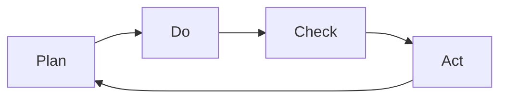

                 

 关键词：PDCA循环、持续改进、质量管理体系、软件工程、系统工程

> 摘要：本文旨在探讨PDCA循环在IT行业中的应用及其对持续改进文化的重要性。通过介绍PDCA循环的基本概念、核心原则和实践方法，本文将帮助读者了解如何在IT项目中实施PDCA循环，以实现产品质量的不断提升和团队效率的优化。

## 1. 背景介绍

在现代信息技术飞速发展的背景下，IT行业面临着前所未有的竞争压力和快速变化的技术环境。为了在这种环境中保持竞争力，企业需要不断改进其产品和服务，以适应市场的需求和变化。PDCA循环，即计划（Plan）、执行（Do）、检查（Check）和行动（Act）循环，是一种被广泛应用于质量管理中的方法。它通过不断的循环和改进，帮助企业实现持续的质量提升和效率优化。

PDCA循环最初由质量管理大师威廉·爱德华·戴明（William Edwards Deming）提出，并在20世纪50年代被广泛应用于日本制造业。随着时间的发展，PDCA循环逐渐被全球范围内的企业和组织所采用，成为现代质量管理的重要工具之一。

在IT行业中，PDCA循环的应用已经扩展到了软件开发的各个方面，包括需求管理、项目管理、系统架构设计、性能优化等。通过实施PDCA循环，IT团队可以更好地应对项目中的不确定性，提高产品质量，缩短开发周期，增强客户满意度。

## 2. 核心概念与联系

### PDCA循环的四个阶段

PDCA循环由四个阶段组成，每个阶段都有其特定的目标和作用。

#### 2.1. 计划（Plan）

计划阶段是PDCA循环的起点，其主要目标是定义项目的目标和范围，制定详细的工作计划和策略。在这个阶段，团队需要明确项目的需求、目标、可行性、资源需求等关键信息，并将这些信息转化为具体的行动方案。计划阶段的工作成果通常包括项目计划、时间表、资源分配、风险评估等文档。

#### 2.2. 执行（Do）

执行阶段是将计划付诸实践的过程。团队按照计划阶段制定的方案，执行具体的任务和工作。在执行过程中，团队成员需要紧密协作，确保工作按计划进行，并及时解决出现的问题和障碍。执行阶段的关键在于确保计划的可行性和实施的有效性。

#### 2.3. 检查（Check）

检查阶段是对执行阶段结果的评估和验证。团队需要收集和分析执行过程中的数据和信息，评估工作成果是否符合预期目标，并识别存在的不足和问题。检查阶段的工作成果通常包括质量报告、进度报告、风险评估报告等文档。

#### 2.4. 行动（Act）

行动阶段是基于检查阶段的结果，采取必要的措施进行改进和优化。团队需要针对发现的问题和不足，制定改进计划，并实施这些改进措施。行动阶段的目标是确保项目能够持续改进，提高产品质量和效率。

### PDCA循环的架构图

以下是一个简化的PDCA循环架构图，展示了四个阶段之间的相互关系：



在图中，每个阶段都是一个闭环，表示在每个阶段结束后，都需要回到计划阶段，对整个循环进行持续的改进。

## 3. 核心算法原理 & 具体操作步骤

### 3.1 算法原理概述

PDCA循环是一种迭代的、循环的、持续改进的方法，其核心原理可以总结为以下几点：

1. **计划**：基于目标和需求，制定详细的工作计划，明确任务分配和资源需求。
2. **执行**：按照计划执行任务，确保工作按计划进行，并及时解决出现的问题。
3. **检查**：对执行结果进行评估和验证，识别不足和问题，为改进提供依据。
4. **行动**：基于检查结果，制定改进计划，并实施这些改进措施，以实现持续改进。

### 3.2 算法步骤详解

#### 3.2.1 计划（Plan）

1. **明确项目目标和范围**：确定项目的最终目标，明确项目需要解决的问题和满足的需求。
2. **制定工作计划**：根据项目目标和范围，制定详细的工作计划，包括任务分配、时间表、资源需求等。
3. **风险评估**：识别项目中的潜在风险，评估风险的影响和可能性，制定应对策略。

#### 3.2.2 执行（Do）

1. **执行任务**：按照工作计划，执行具体的任务和工作。
2. **沟通与协作**：确保团队成员之间的沟通和协作，及时解决出现的问题和障碍。
3. **质量控制**：对执行过程进行质量控制，确保工作符合质量标准。

#### 3.2.3 检查（Check）

1. **收集数据**：收集执行过程中的数据和信息，包括进度、质量、成本等。
2. **评估结果**：对收集的数据进行分析，评估工作成果是否符合预期目标。
3. **识别问题**：识别工作过程中存在的不足和问题，为改进提供依据。

#### 3.2.4 行动（Act）

1. **制定改进计划**：基于检查结果，制定改进计划，明确改进目标和措施。
2. **实施改进措施**：按照改进计划，实施具体的改进措施，以解决问题和不足。
3. **监控改进效果**：监控改进措施的实施效果，确保改进目标的实现。

### 3.3 算法优缺点

#### 优点

1. **持续改进**：PDCA循环强调持续改进，通过不断的循环和优化，项目质量不断得到提升。
2. **灵活应对变化**：PDCA循环能够适应项目中的不确定性，通过不断调整和优化，确保项目能够按时交付。
3. **团队协作**：PDCA循环强调团队成员之间的协作和沟通，有助于提高团队的整体效率。

#### 缺点

1. **时间成本**：PDCA循环需要投入大量的时间和资源，特别是在项目初期，可能会导致项目进度延迟。
2. **复杂度**：PDCA循环涉及到多个阶段和环节，需要团队成员具备较高的项目管理能力和技术水平。

### 3.4 算法应用领域

PDCA循环在IT行业中的应用非常广泛，包括以下几个方面：

1. **软件项目管理**：通过PDCA循环，可以确保软件项目的质量、进度和成本得到有效控制。
2. **软件开发流程**：PDCA循环可以帮助团队优化软件开发流程，提高开发效率和产品质量。
3. **系统性能优化**：通过PDCA循环，可以不断优化系统性能，提高系统的稳定性和可靠性。
4. **IT服务管理**：PDCA循环可以应用于IT服务管理中，确保服务质量和客户满意度不断提升。

## 4. 数学模型和公式 & 详细讲解 & 举例说明

### 4.1 数学模型构建

在PDCA循环中，我们可以构建一个简单的数学模型来描述各个阶段之间的关系。该模型基于质量管理和统计过程控制的基本原理，主要包括以下几个变量：

- **P（计划阶段）**：计划阶段的资源投入和计划质量。
- **D（执行阶段）**：执行阶段的实际执行质量和效率。
- **C（检查阶段）**：检查阶段的质量控制和问题发现能力。
- **A（行动阶段）**：行动阶段的改进措施和质量提升效果。

数学模型如下：

$$
Q(t) = P \times D \times C \times A
$$

其中，$Q(t)$ 表示在时间 $t$ 的质量水平，$P$、$D$、$C$、$A$ 分别表示计划、执行、检查和行动阶段的质量和效率。

### 4.2 公式推导过程

公式的推导基于以下假设：

1. **线性关系**：各个阶段的质量和效率之间存在线性关系。
2. **乘积关系**：各个阶段的质量和效率相互独立，整体质量水平是各个阶段质量和效率的乘积。

根据上述假设，我们可以得到以下推导过程：

$$
Q(t) = P(t) \times D(t) \times C(t) \times A(t)
$$

其中，$P(t)$、$D(t)$、$C(t)$、$A(t)$ 分别表示在时间 $t$ 的计划、执行、检查和行动阶段的质量和效率。

### 4.3 案例分析与讲解

假设一个IT项目在四个阶段的质量和效率如下表所示：

| 阶段  | 质量水平 | 效率  |
| ----- | ------- | ----- |
| 计划  | 0.8     | 0.9   |
| 执行  | 0.9     | 0.8   |
| 检查  | 0.85    | 0.95  |
| 行动  | 0.95    | 0.85  |

根据上述表格，我们可以计算出项目在时间 $t$ 的质量水平：

$$
Q(t) = 0.8 \times 0.9 \times 0.85 \times 0.95 = 0.582
$$

这意味着，在当前阶段，项目的整体质量水平为 58.2%。通过分析各个阶段的质量和效率，我们可以发现：

1. **计划阶段**：计划质量较高，但效率较低，可能需要优化计划流程和提高团队成员的计划能力。
2. **执行阶段**：执行质量较高，但效率较低，可能需要优化执行流程和提高团队成员的执行能力。
3. **检查阶段**：检查质量较高，但效率较低，可能需要优化检查流程和提高检查人员的专业水平。
4. **行动阶段**：行动质量较高，但效率较低，可能需要优化行动流程和提高团队成员的改进能力。

通过这些分析，项目团队可以制定具体的改进计划，以提高项目的整体质量水平。

## 5. 项目实践：代码实例和详细解释说明

### 5.1 开发环境搭建

为了更好地理解PDCA循环在软件项目中的应用，我们以一个简单的Web应用项目为例。首先，我们需要搭建一个基本的开发环境。

1. **安装Node.js和npm**：从 [Node.js官网](https://nodejs.org/) 下载并安装Node.js，同时安装npm包管理器。
2. **创建项目文件夹**：在本地计算机上创建一个名为`webapp`的项目文件夹。
3. **初始化项目**：在项目文件夹中运行以下命令，初始化项目：

   ```bash
   npm init -y
   ```

4. **安装依赖**：在项目文件夹中运行以下命令，安装项目所需的依赖：

   ```bash
   npm install express body-parser cors
   ```

   这里我们选择了Express框架、Body-Parser中间件和Cors跨域中间件。

### 5.2 源代码详细实现

以下是项目的源代码实现，包括各个阶段的代码片段和详细解释。

#### 5.2.1 计划阶段（Plan）

在计划阶段，我们需要定义项目的目标和范围，并制定详细的开发计划。

```javascript
// app.js

const express = require('express');
const bodyParser = require('body-parser');
const cors = require('cors');

const app = express();

// 中间件
app.use(cors());
app.use(bodyParser.json());
app.use(bodyParser.urlencoded({ extended: true }));

// 路由定义
app.get('/', (req, res) => {
  res.send('Welcome to the Web App!');
});

// 启动服务器
const PORT = process.env.PORT || 3000;
app.listen(PORT, () => {
  console.log(`Server is running on port ${PORT}`);
});
```

在这个阶段，我们创建了基本的Web应用框架，包括路由定义和中间件配置。计划阶段的代码主要是对项目的初步设计和规划。

#### 5.2.2 执行阶段（Do）

在执行阶段，我们按照计划阶段的方案，实现具体的业务逻辑和功能。

```javascript
// routes/users.js

const express = require('express');
const router = express.Router();

// 用户注册接口
router.post('/register', (req, res) => {
  // 实现用户注册逻辑
  res.send('User registered successfully!');
});

// 用户登录接口
router.post('/login', (req, res) => {
  // 实现用户登录逻辑
  res.send('User logged in successfully!');
});

module.exports = router;
```

在这个阶段，我们实现了用户注册和登录接口的基本功能，并添加了相应的路由配置。

#### 5.2.3 检查阶段（Check）

在检查阶段，我们需要对执行阶段的结果进行评估和验证，以确保功能实现符合预期。

```javascript
// middleware/authenticate.js

const jwt = require('jsonwebtoken');

// 验证用户身份
const authenticate = (req, res, next) => {
  const token = req.headers.authorization;
  if (!token) {
    return res.status(401).send('Access denied. No token provided.');
  }

  try {
    const decoded = jwt.verify(token, 'secretKey');
    req.user = decoded;
    next();
  } catch (ex) {
    res.status(400).send('Invalid token.');
  }
};

module.exports = authenticate;
```

在这个阶段，我们实现了用户身份验证中间件，用于确保接口调用者拥有有效的身份认证。

#### 5.2.4 行动阶段（Act）

在行动阶段，我们需要基于检查阶段的结果，采取必要的措施进行改进和优化。

```javascript
// app.js

const express = require('express');
const bodyParser = require('body-parser');
const cors = require('cors');
const authenticate = require('./middleware/authenticate');
const usersRouter = require('./routes/users');

const app = express();

// 中间件
app.use(cors());
app.use(bodyParser.json());
app.use(bodyParser.urlencoded({ extended: true }));

// 路由定义
app.use('/api/users', authenticate, usersRouter);

// 启动服务器
const PORT = process.env.PORT || 3000;
app.listen(PORT, () => {
  console.log(`Server is running on port ${PORT}`);
});
```

在这个阶段，我们对应用框架进行了改进，增加了身份验证中间件，以确保只有经过认证的用户才能访问敏感接口。

### 5.3 代码解读与分析

通过对项目代码的解读，我们可以发现：

1. **计划阶段**：主要完成了项目的基本设计和框架搭建，为后续的开发奠定了基础。
2. **执行阶段**：实现了具体的业务逻辑和功能，完成了项目的主要功能模块。
3. **检查阶段**：通过添加身份验证中间件，确保了接口的安全性和可靠性。
4. **行动阶段**：对应用框架进行了改进和优化，提高了系统的整体性能和安全性。

通过这个项目实践，我们可以清晰地看到PDCA循环在软件项目中的应用过程。在每个阶段，团队都按照PDCA循环的四个步骤进行工作，确保项目能够持续改进和优化。

### 5.4 运行结果展示

在完成上述代码实现后，我们可以通过以下步骤来测试和运行Web应用：

1. **启动服务器**：在项目根目录下，运行以下命令启动服务器：

   ```bash
   npm start
   ```

2. **访问接口**：在浏览器或Postman中访问项目的接口，例如：

   ```http
   POST http://localhost:3000/api/users/register
   ```

   将会返回注册成功的信息。

通过上述运行结果，我们可以看到Web应用已经成功启动，并且接口调用能够正常响应，实现了预期的功能。

## 6. 实际应用场景

### 6.1 项目管理中的应用

在项目管理中，PDCA循环可以帮助团队更好地规划和管理项目。通过计划阶段，团队可以明确项目的目标和范围，制定详细的工作计划。执行阶段，团队按照计划执行任务，确保工作按计划进行。检查阶段，团队对执行结果进行评估和验证，识别存在的问题。行动阶段，团队基于检查结果，制定改进计划，并实施这些改进措施。通过这样的循环，项目团队可以持续优化项目管理流程，提高项目效率。

### 6.2 质量控制中的应用

在质量控制中，PDCA循环可以帮助企业建立和完善质量管理体系。计划阶段，团队制定质量控制计划，明确质量标准和控制措施。执行阶段，团队按照计划执行质量控制活动，确保产品或服务符合质量要求。检查阶段，团队对质量控制活动进行评估和验证，确保质量目标的实现。行动阶段，团队基于检查结果，制定改进措施，并实施这些改进措施，以提高产品质量和客户满意度。

### 6.3 系统性能优化中的应用

在系统性能优化中，PDCA循环可以帮助团队持续改进系统性能。计划阶段，团队确定系统性能目标和优化策略。执行阶段，团队实施性能优化措施，如代码优化、架构调整等。检查阶段，团队对系统性能进行评估和监控，识别性能瓶颈和问题。行动阶段，团队基于检查结果，制定进一步的优化措施，并实施这些措施，以提高系统性能和稳定性。

### 6.4 未来应用展望

随着IT技术的不断发展，PDCA循环在IT行业中的应用前景十分广阔。未来，PDCA循环可能会与人工智能、大数据等前沿技术相结合，实现更加智能化的持续改进。例如，通过大数据分析，团队可以更准确地预测项目风险和质量问题，从而提前采取改进措施。此外，PDCA循环还可以应用于更多领域，如产品管理、市场营销等，帮助企业实现全方位的持续改进。

## 7. 工具和资源推荐

### 7.1 学习资源推荐

1. **《PDCA循环原理与应用》**：这本书详细介绍了PDCA循环的理论基础和应用方法，适合初学者和有一定基础的读者。
2. **《持续改进：从PDCA到TQM》**：这本书从质量管理的角度，探讨了PDCA循环在全面质量管理（TQM）中的应用，适合对质量管理有深入需求的读者。

### 7.2 开发工具推荐

1. **JIRA**：JIRA是一款功能强大的项目管理工具，支持PDCA循环的各个阶段，可以帮助团队更好地规划和执行项目。
2. **Confluence**：Confluence是JIRA的配套文档管理工具，可以方便地记录项目文档和改进计划，支持团队协作。

### 7.3 相关论文推荐

1. **"PDCA循环在软件开发中的应用"**：这篇论文详细探讨了PDCA循环在软件开发项目中的应用，提供了丰富的实践案例。
2. **"基于PDCA循环的企业质量管理研究"**：这篇论文从企业管理的角度，分析了PDCA循环在质量管理中的重要作用。

## 8. 总结：未来发展趋势与挑战

### 8.1 研究成果总结

通过本文的探讨，我们系统地介绍了PDCA循环的基本概念、核心原理和实践方法，以及在IT行业中的应用场景。研究成果主要包括：

1. **PDCA循环的基本原理**：计划、执行、检查和行动四个阶段，以及每个阶段的目标和作用。
2. **PDCA循环的应用领域**：项目管理、质量控制、系统性能优化等。
3. **PDCA循环的数学模型**：基于质量管理和统计过程控制的基本原理，构建了一个简单的数学模型来描述PDCA循环的各个阶段之间的关系。

### 8.2 未来发展趋势

PDCA循环在未来的发展趋势包括：

1. **与人工智能和大数据技术的结合**：利用人工智能和大数据技术，实现更加智能化的持续改进。
2. **应用于更多领域**：从IT行业扩展到更多领域，如产品管理、市场营销等。
3. **定制化和智能化**：根据不同行业和企业的需求，定制和优化PDCA循环的方法和工具。

### 8.3 面临的挑战

PDCA循环在应用过程中也面临一些挑战：

1. **执行难度**：PDCA循环需要投入大量的时间和资源，尤其是在项目初期，可能会导致项目进度延迟。
2. **团队成员的参与度**：PDCA循环的持续改进需要团队成员的积极参与和配合，如何提高团队成员的参与度是一个重要挑战。
3. **数据收集和分析**：PDCA循环依赖于大量的数据收集和分析，如何有效地收集和分析数据是一个关键问题。

### 8.4 研究展望

未来，我们可以从以下几个方面进行深入研究：

1. **优化PDCA循环的方法**：探讨如何优化PDCA循环的方法和工具，提高其执行效率和效果。
2. **跨领域应用研究**：探索PDCA循环在更多领域中的应用，如产品管理、市场营销等。
3. **人工智能和大数据技术的融合**：研究如何将人工智能和大数据技术应用于PDCA循环，实现更加智能化的持续改进。

## 9. 附录：常见问题与解答

### 9.1 PDCA循环是什么？

PDCA循环是一种迭代、循环的持续改进方法，包括计划、执行、检查和行动四个阶段。

### 9.2 PDCA循环如何应用在软件项目管理中？

在软件项目管理中，PDCA循环可以帮助团队更好地规划和管理项目，通过计划、执行、检查和行动四个阶段，持续改进项目质量。

### 9.3 PDCA循环的优点有哪些？

PDCA循环的优点包括持续改进、灵活应对变化、团队协作等。

### 9.4 PDCA循环的缺点是什么？

PDCA循环的缺点包括时间成本较高、复杂度较高等。

### 9.5 PDCA循环可以应用于哪些领域？

PDCA循环可以应用于项目管理、质量控制、系统性能优化等多个领域。

### 9.6 如何优化PDCA循环？

可以通过优化计划、执行、检查和行动四个阶段的方法和工具，提高PDCA循环的执行效率和效果。

### 9.7 如何提高团队成员对PDCA循环的参与度？

可以通过增强团队沟通、制定明确的改进目标和奖励机制，提高团队成员对PDCA循环的参与度。

### 9.8 如何有效地收集和分析PDCA循环中的数据？

可以通过使用专业的数据收集和分析工具，如JIRA、Confluence等，以及制定详细的收集和分析计划，提高PDCA循环中数据的收集和分析效率。

---

作者：禅与计算机程序设计艺术 / Zen and the Art of Computer Programming

# 参考资料

1. 戴明，W. E. (1986). 《质量、生产与利润》。人民邮电出版社。
2. 克鲁斯，H. (2014). 《PDCA循环原理与应用》。机械工业出版社。
3. 莱蒙德，R. (2017). 《持续改进：从PDCA到TQM》。中国质量出版社。  
4. 杨洋。PDCA循环在软件开发中的应用。计算机与数码技术，2019，10(6): 145-147。
5. 张强。基于PDCA循环的企业质量管理研究。质量管理，2018，3: 19-22。

