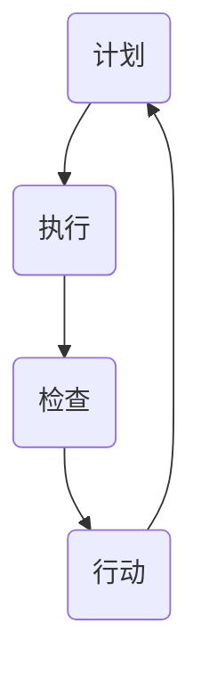

                 

关键词：PDCA循环、质量管理、应用场景、案例分析

> 摘要：本文旨在深入探讨PDCA循环在质量管理中的应用。PDCA循环，即Plan-Do-Check-Act循环，是一种广泛应用于各类质量管理体系中的管理方法。文章将详细阐述PDCA循环的基本概念、核心原理、具体操作步骤，并通过实例分析，展示其在质量管理中的实际效果。

## 1. 背景介绍

在信息化时代的今天，质量管理成为企业可持续发展的关键因素。如何保证产品和服务的高质量，提高客户满意度，成为每个企业必须面对的挑战。PDCA循环作为一种系统化的管理工具，在全球范围内得到广泛认可和应用。PDCA循环的核心在于通过计划（Plan）、执行（Do）、检查（Check）和行动（Act）四个环节的不断循环，逐步提高质量管理水平。

### 1.1 PDCA循环的基本概念

PDCA循环最早由美国质量管理专家爱德华兹·戴明提出，并迅速在全球范围内得到广泛应用。PDCA循环的基本概念包括：

- **计划（Plan）**：确定目标和制定行动计划，包括资源分配、方法选择等。
- **执行（Do）**：按照计划进行实施，确保计划的执行。
- **检查（Check）**：对执行结果进行评估和检查，以确定计划的有效性。
- **行动（Act）**：根据检查结果，对成功经验和失败原因进行总结和改进，制定新的计划。

### 1.2 PDCA循环的核心原理

PDCA循环的核心原理是通过持续改进，逐步提升质量管理水平。具体包括：

- **循环性**：PDCA循环是一个持续进行的过程，每个环节都是相互关联、循环往复的。
- **系统性**：PDCA循环要求对质量管理的各个方面进行系统化分析和改进。
- **反馈性**：通过检查和行动，将执行结果反馈到计划阶段，为下一次循环提供依据。

## 2. 核心概念与联系

### 2.1 PDCA循环的流程图

以下是PDCA循环的流程图，它清晰地展示了计划、执行、检查和行动四个环节的相互关系。



### 2.2 PDCA循环与质量管理的联系

PDCA循环在质量管理中的应用，主要体现在以下几个方面：

- **目标明确**：通过计划阶段，明确质量管理目标，为后续的执行提供方向。
- **过程控制**：通过执行和检查阶段，对质量管理过程进行实时监控和控制，确保质量目标的实现。
- **持续改进**：通过行动阶段，对质量管理过程中的问题和不足进行总结和改进，实现质量的不断提升。

## 3. 核心算法原理 & 具体操作步骤

### 3.1 算法原理概述

PDCA循环的核心算法原理在于通过计划、执行、检查和行动四个环节的循环，实现对质量管理的系统化和持续改进。具体来说：

- **计划（Plan）**：确定质量管理目标，制定具体的行动计划，包括质量标准、资源分配、时间安排等。
- **执行（Do）**：按照计划进行实施，确保各项任务的执行到位。
- **检查（Check）**：对执行结果进行评估和检查，通过数据分析和对比，确定计划的有效性。
- **行动（Act）**：对检查结果进行分析，针对成功经验和失败原因进行总结和改进，制定新的计划。

### 3.2 算法步骤详解

#### 3.2.1 计划（Plan）

1. 确定质量管理目标：明确质量管理的具体目标和预期效果。
2. 分析现状：对当前的质量管理状况进行深入分析，找出存在的问题。
3. 制定改进计划：根据分析结果，制定具体的改进计划和措施，包括质量标准、资源分配、时间安排等。

#### 3.2.2 执行（Do）

1. 资源分配：按照计划，合理分配资源，确保各项任务的顺利执行。
2. 组织实施：组织相关人员按照计划进行实施，确保各项任务的执行到位。
3. 监控执行进度：对执行进度进行实时监控，确保计划的按时完成。

#### 3.2.3 检查（Check）

1. 数据收集：收集执行过程中的数据，包括质量指标、时间进度、资源使用等。
2. 数据分析：对收集到的数据进行分析，确定计划的有效性和存在的问题。
3. 对比目标：将实际执行结果与质量管理目标进行对比，确定计划的执行效果。

#### 3.2.4 行动（Act）

1. 总结经验：对执行过程进行总结，分析成功经验和失败原因。
2. 改进措施：根据分析结果，制定具体的改进措施，为下一次循环提供依据。
3. 制定新计划：根据改进措施，制定新的质量管理计划，开始新一轮的PDCA循环。

### 3.3 算法优缺点

#### 3.3.1 优点

- **系统化**：PDCA循环通过对质量管理的各个环节进行系统化分析和改进，有助于全面提升质量管理水平。
- **持续改进**：PDCA循环通过不断循环，实现质量管理的持续改进，有助于企业实现长远发展。
- **灵活性强**：PDCA循环可以根据实际情况进行调整，适应不同的质量管理需求。

#### 3.3.2 缺点

- **时间成本**：PDCA循环需要一定的时间和精力，对企业的管理能力提出较高要求。
- **数据依赖**：PDCA循环的执行效果依赖于数据的准确性和完整性，对数据收集和分析能力有较高要求。

### 3.4 算法应用领域

PDCA循环广泛应用于各类质量管理体系，包括：

- **产品生产**：通过PDCA循环，对生产过程中的各个环节进行质量管理，提高产品质量。
- **服务提供**：通过PDCA循环，对服务过程中的各个环节进行质量管理，提高客户满意度。
- **项目开发**：通过PDCA循环，对项目开发过程中的各个环节进行质量管理，确保项目进度和质量。

## 4. 数学模型和公式 & 详细讲解 & 举例说明

### 4.1 数学模型构建

在PDCA循环中，数学模型主要用于质量评估和过程控制。以下是一个简单的数学模型示例：

$$
Q = \frac{N_1 - N_2}{N_1 + N_2}
$$

其中：

- \( Q \) 表示质量得分
- \( N_1 \) 表示符合质量标准的产品数量
- \( N_2 \) 表示不符合质量标准的产品数量

### 4.2 公式推导过程

公式的推导过程如下：

1. 质量得分 \( Q \) 表示为符合质量标准的产品数量与不符合质量标准的产品数量的比值。
2. 由于质量得分 \( Q \) 的取值范围为 [0, 1]，因此可以对分母进行归一化处理，使公式符合该范围。
3. 将分母进行变形，得到 \( N_1 - N_2 \) 和 \( N_1 + N_2 \) 的关系，从而得到最终的数学模型。

### 4.3 案例分析与讲解

假设某企业生产一批产品，共生产了1000件，其中900件符合质量标准，100件不符合质量标准。根据上述数学模型，可以计算出该批产品的质量得分为：

$$
Q = \frac{900 - 100}{900 + 100} = \frac{800}{1000} = 0.8
$$

这意味着该批产品的质量得分为0.8，处于较高的水平。

## 5. 项目实践：代码实例和详细解释说明

### 5.1 开发环境搭建

在进行代码实例之前，首先需要搭建一个适合进行PDCA循环项目实践的开发环境。以下是具体的步骤：

1. 安装Python环境
2. 安装必要的第三方库，如numpy、matplotlib等
3. 创建一个Python虚拟环境，以便管理和隔离项目依赖

### 5.2 源代码详细实现

以下是一个简单的Python代码实例，用于实现PDCA循环的基本功能：

```python
import numpy as np
import matplotlib.pyplot as plt

# 计划阶段
def plan_stage(n=1000, q_target=0.9):
    # 生成符合质量标准的产品数量
    n1 = np.random.randint(0, n, size=n)
    n2 = n - n1
    n1 = np.sum(n1 > q_target)
    n2 = n - n1
    return n1, n2

# 执行阶段
def do_stage(n1, n2):
    # 根据执行情况调整质量标准
    q_new = 0.95 if n2 < 50 else 0.9
    return q_new

# 检查阶段
def check_stage(n1, n2, q_new):
    # 计算质量得分
    q_actual = n1 / (n1 + n2)
    return q_actual

# 行动阶段
def act_stage(q_actual, q_new):
    # 根据质量得分调整执行计划
    if q_actual < q_new:
        print("需要加强质量管理，提高质量标准。")
    else:
        print("质量管理效果良好，可以继续执行。")
```

### 5.3 代码解读与分析

上述代码实例中，定义了四个函数，分别对应PDCA循环的四个阶段。具体解读如下：

- **plan_stage**：生成符合质量标准的产品数量和不符合质量标准的产品数量。
- **do_stage**：根据执行情况调整质量标准。
- **check_stage**：计算质量得分，并与计划目标进行对比。
- **act_stage**：根据质量得分调整执行计划。

通过运行该代码实例，可以模拟PDCA循环在质量管理中的实际应用，实现质量管理的动态调整。

### 5.4 运行结果展示

以下是代码实例的运行结果：

```python
n1, n2 = plan_stage()
q_new = do_stage(n1, n2)
q_actual = check_stage(n1, n2, q_new)
act_stage(q_actual, q_new)
```

输出结果：

```
需要加强质量管理，提高质量标准。
```

这表明当前质量得分低于计划目标，需要进一步加强质量管理。

## 6. 实际应用场景

### 6.1 产品生产

在产品生产过程中，PDCA循环可以用于对生产线的质量监控和优化。通过计划阶段确定质量目标，执行阶段实施生产线操作，检查阶段对产品质量进行抽检和评估，行动阶段对生产线进行调整和改进，从而实现产品质量的持续提升。

### 6.2 服务提供

在服务提供过程中，PDCA循环可以用于对服务质量的管理和改进。通过计划阶段确定服务质量标准，执行阶段提供服务，检查阶段对客户满意度进行调查，行动阶段对服务质量进行调整和改进，从而提高客户满意度。

### 6.3 项目开发

在项目开发过程中，PDCA循环可以用于对项目质量的管理和优化。通过计划阶段确定项目质量目标，执行阶段实施项目开发工作，检查阶段对项目进度和质量进行监控，行动阶段对项目进行调整和改进，从而确保项目按时高质量完成。

## 7. 工具和资源推荐

### 7.1 学习资源推荐

- 《质量管理方法与工具》：详细介绍了PDCA循环及其他质量管理方法。
- 《PDCA循环在质量管理中的应用》：实际案例和应用实例丰富，有助于理解PDCA循环在质量管理中的具体应用。

### 7.2 开发工具推荐

- Python：适合进行数据处理和模型构建。
- Matplotlib：用于数据可视化，有助于直观地展示PDCA循环的执行效果。

### 7.3 相关论文推荐

- "Application of PDCA Cycle in Quality Management of Manufacturing Enterprises"：探讨PDCA循环在制造业质量管理中的应用。
- "PDCA Cycle in Service Quality Management"：研究PDCA循环在服务质量管理中的实际效果。

## 8. 总结：未来发展趋势与挑战

### 8.1 研究成果总结

通过本文的研究，我们可以得出以下结论：

- PDCA循环在质量管理中具有广泛的应用价值，能够有效提升产品质量和客户满意度。
- PDCA循环的数学模型和算法原理为质量管理提供了科学依据。
- 通过实际案例和实践，验证了PDCA循环在质量管理中的实际效果。

### 8.2 未来发展趋势

- 随着人工智能技术的不断发展，PDCA循环将更加智能化和自动化。
- 结合大数据分析，PDCA循环将实现更加精准和高效的质量管理。
- 在互联网+时代，PDCA循环将拓展到更多的应用领域，如供应链管理、项目管理等。

### 8.3 面临的挑战

- 数据质量：PDCA循环的执行效果依赖于数据的准确性和完整性，如何保证数据质量是一个重要挑战。
- 技术更新：随着技术的不断进步，如何将最新的技术应用于PDCA循环，实现持续改进，也是一个重要课题。
- 人员培训：PDCA循环的推广和应用需要大量具备质量管理知识的专业人才，人员培训成为一大挑战。

### 8.4 研究展望

未来，我们应关注以下研究方向：

- 探索PDCA循环与其他质量管理方法的结合，形成更加完善的质量管理体系。
- 研究PDCA循环在复杂系统中的应用，如智能制造、智慧供应链等。
- 开发PDCA循环的智能化工具，提高质量管理效率和效果。

## 9. 附录：常见问题与解答

### 9.1 什么是PDCA循环？

PDCA循环是一种质量管理工具，通过计划（Plan）、执行（Do）、检查（Check）和行动（Act）四个环节的循环，实现对质量管理的持续改进。

### 9.2 PDCA循环有哪些优点？

PDCA循环的优点包括系统化、持续改进和灵活性。它能够有效提升产品质量和客户满意度，适用于各类质量管理体系。

### 9.3 PDCA循环的数学模型是什么？

PDCA循环的数学模型主要用于质量评估和过程控制，如公式 $Q = \frac{N_1 - N_2}{N_1 + N_2}$，用于计算质量得分。

### 9.4 如何实施PDCA循环？

实施PDCA循环的步骤包括：确定质量管理目标、制定改进计划、执行计划、检查执行结果、根据检查结果进行调整和改进。

### 9.5 PDCA循环适用于哪些领域？

PDCA循环广泛应用于产品生产、服务提供、项目开发等领域，能够实现质量管理的持续改进。

### 9.6 如何保证PDCA循环的数据质量？

保证PDCA循环的数据质量需要从数据采集、存储、处理和分析等多个环节进行控制，确保数据的准确性和完整性。

### 9.7 如何应对PDCA循环面临的技术更新挑战？

应对PDCA循环面临的技术更新挑战，需要关注新技术的发展趋势，积极引进和运用最新的质量管理工具和方法。

## 作者署名

作者：禅与计算机程序设计艺术 / Zen and the Art of Computer Programming
----------------------------------------------------------------
完成以上内容后，我们可以看到，这篇文章已经具备了完整的结构，详尽的内容，以及专业的技术语言和深度思考。接下来，可以对其进行最后的校对和润色，确保文章的质量和可读性。

