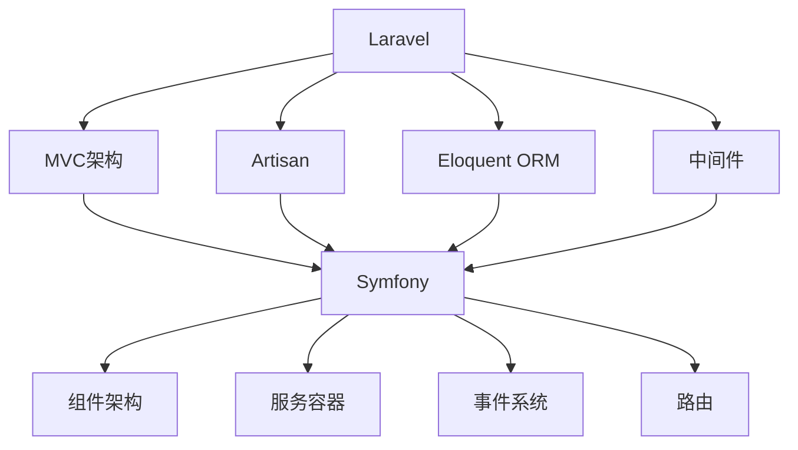

                 

关键词：PHP、Laravel、Symfony、Web开发、框架、编程语言

> 摘要：本文深入探讨了PHP语言中两款流行的框架Laravel和Symfony，分析了它们的设计理念、核心功能、优点与不足，以及在实际项目中的应用和未来发展。

## 1. 背景介绍

随着互联网技术的发展，PHP作为一门用于Web开发的编程语言，一直以来都扮演着重要角色。而随着PHP社区的不断进步，出现了许多优秀的框架，其中Laravel和Symfony尤为突出。

Laravel是一个现代化的PHP Web开发框架，自2011年发布以来，以其优雅的语法、丰富的功能库和用户友好的API受到了广泛的欢迎。它旨在提供一种更加简洁、快速和高效的开发方式。

Symfony则是一个更为成熟和灵活的PHP框架，自2005年发布以来，在PHP社区中积累了大量的用户和贡献者。它提供了更加底层和灵活的组件，允许开发者根据自己的需求进行定制和扩展。

本文将对比分析Laravel和Symfony，探讨它们在PHP生态系统中的地位、设计理念、核心功能以及在实际项目中的应用。

## 2. 核心概念与联系

在深入探讨Laravel和Symfony之前，我们需要了解它们的核心概念和联系。以下是两个框架的一些核心概念，以及它们之间的联系：

### 2.1 Laravel的核心概念

- **MVC架构**：Laravel遵循经典的模型-视图-控制器（MVC）架构，使代码更易于管理和维护。
- **Artisan命令行工具**：Artisan是Laravel提供的一个强大的命令行接口，用于自动化常见的开发任务，如数据库迁移、种子文件生成等。
- **Eloquent ORM**：Eloquent是一个优雅的对象关系映射（ORM）系统，允许开发者以面向对象的方式操作数据库。
- **中间件**：Laravel的中间件机制允许开发者定义在请求处理过程中的不同阶段执行的功能。

### 2.2 Symfony的核心概念

- **组件架构**：Symfony采用组件架构，提供了一系列可复用的PHP组件，如HTTP基金会、YAML配置解析器、Templating等。
- **服务容器**：Symfony的服务容器是一个强大的依赖注入（DI）容器，用于管理应用程序中的依赖关系。
- **事件系统**：Symfony的事件系统允许开发者通过事件和监听器的方式来处理应用程序中的各种事件。
- **路由**：Symfony的路由系统提供了灵活的URL路由机制，支持RESTful架构。

### 2.3 Laravel和Symfony的联系

Laravel和Symfony都是PHP的框架，它们在设计理念上有很多相似之处，例如MVC架构、服务容器和依赖注入。此外，它们都提供了丰富的功能库，如ORM、缓存系统、中间件等。

然而，它们的定位和目标用户有所不同。Laravel更注重易用性和快速开发，而Symfony则提供了更多的灵活性和定制性，适合有经验的开发者进行复杂项目的构建。

### 2.4 Mermaid流程图

下面是一个简单的Mermaid流程图，展示了Laravel和Symfony的一些核心组件和联系：



## 3. 核心算法原理 & 具体操作步骤

### 3.1 算法原理概述

Laravel和Symfony的核心算法原理可以归纳为以下几点：

- **MVC架构**：通过分离模型、视图和控制器，实现代码的模块化和可维护性。
- **依赖注入**：通过服务容器管理应用程序的依赖关系，实现组件的解耦和重用。
- **ORM**：通过Eloquent或 Doctrine ORM实现数据库与模型的映射，简化数据库操作。
- **路由**：通过URL路由系统，实现动态路由和RESTful架构。

### 3.2 算法步骤详解

#### 3.2.1 Laravel的MVC架构

1. **模型**：定义模型类，与数据库表进行映射，实现数据存储和查询。
2. **视图**：使用Blade模板引擎，定义用户界面和交互逻辑。
3. **控制器**：处理HTTP请求，调用模型和视图，生成响应。

#### 3.2.2 Laravel的依赖注入

1. **定义服务**：在`config/services.php`文件中定义服务。
2. **注册服务**：使用`app()->bind()`方法注册服务。
3. **调用服务**：在控制器或模型中使用`app()->make()`获取服务的实例。

#### 3.2.3 Laravel的ORM

1. **模型定义**：定义模型类，使用`$fillable`或`$guarded`属性指定可填充或保护的属性。
2. **数据库迁移**：使用Artisan命令创建数据库迁移文件，定义表结构。
3. **查询操作**：使用Eloquent方法进行数据库查询，如`where()`、`find()`等。

#### 3.2.4 Symfony的组件架构

1. **组件选择**：根据项目需求选择合适的组件，如HTTP基金会、YAML配置解析器等。
2. **组件集成**：将组件集成到应用程序中，配置组件行为。
3. **组件扩展**：根据需要扩展组件功能，如自定义路由规则或中间件。

#### 3.2.5 Symfony的依赖注入

1. **服务定义**：在`services.yml`文件中定义服务。
2. **服务注册**：使用`Container`类的`register()`方法注册服务。
3. **服务调用**：在控制器或模型中使用`$this->get()`方法获取服务的实例。

#### 3.2.6 Symfony的ORM

1. **实体定义**：定义实体类，与数据库表进行映射。
2. **数据库迁移**：使用 Doctrine Migrations 创建数据库迁移文件，定义表结构。
3. **查询操作**：使用 Doctrine ORM 方法进行数据库查询，如`createQueryBuilder()`、`find()`等。

### 3.3 算法优缺点

#### Laravel的优点

- 易于上手：Laravel提供了一套简洁、优雅的API，适合新手快速入门。
- 丰富的功能库：Laravel内置了许多功能库，如认证、授权、缓存等，减少开发工作量。
- 高度可定制：虽然Laravel提供了许多默认配置，但开发者可以根据需求进行自定义。

#### Laravel的缺点

- 学习曲线：Laravel虽然易于上手，但对于有经验的开发者来说，可能会觉得过于简单，缺乏深度。
- 性能问题：由于Laravel的内置功能丰富，可能会导致性能问题，需要开发者进行优化。

#### Symfony的优点

- 高度灵活：Symfony采用组件架构，开发者可以根据项目需求选择合适的组件，实现高度定制。
- 高性能：Symfony的性能比Laravel更好，适合构建高性能的应用程序。

#### Symfony的缺点

- 学习难度：Symfony的学习曲线较陡峭，需要开发者具备一定的PHP基础和框架经验。
- 复杂性：Symfony的组件众多，配置复杂，对于新手来说可能会感到困惑。

### 3.4 算法应用领域

Laravel和Symfony都适用于Web开发领域，具体应用领域如下：

- **Web应用开发**：Laravel和Symfony都是优秀的Web应用开发框架，适用于构建各种类型的Web应用，如企业应用、社区网站、在线商店等。
- **API开发**：Laravel和Symfony都支持RESTful API的开发，可以方便地构建RESTful Web服务。
- **微服务架构**：Symfony的组件架构使得它非常适合构建微服务架构的应用程序，可以实现高可用性和可扩展性。

## 4. 数学模型和公式 & 详细讲解 & 举例说明

### 4.1 数学模型构建

在Web开发中，数学模型用于描述应用程序中的各种关系和规则。以下是两个常用的数学模型：

#### 4.1.1 用户注册模型

用户注册模型用于描述用户注册过程中的关系。以下是一个简单的用户注册模型：

$$
\begin{align*}
& \text{User} \rightarrow \text{Email}, \text{Password}, \text{Name} \\
& \text{Email} \rightarrow \text{Domain}, \text{Address} \\
& \text{Password} \rightarrow \text{Hash}, \text{Salt}
\end{align*}
$$

#### 4.1.2 订单模型

订单模型用于描述订单处理过程中的关系。以下是一个简单的订单模型：

$$
\begin{align*}
& \text{Order} \rightarrow \text{Product}, \text{Quantity}, \text{Total} \\
& \text{Product} \rightarrow \text{Name}, \text{Price}, \text{Stock} \\
& \text{Quantity} \rightarrow \text{Quantity}, \text{Unit}
\end{align*}
$$

### 4.2 公式推导过程

数学模型的推导过程通常涉及以下几个步骤：

1. **需求分析**：分析应用程序的需求，确定需要描述的关系和规则。
2. **模型构建**：根据需求构建数学模型，使用集合论和图论等方法。
3. **模型验证**：验证模型的正确性和完整性，确保模型能够准确地描述应用程序的需求。
4. **模型优化**：根据实际应用场景，对模型进行优化，提高模型的可扩展性和可维护性。

### 4.3 案例分析与讲解

#### 4.3.1 用户注册模型案例分析

假设一个在线书店需要实现用户注册功能，以下是用户注册模型的具体应用：

1. **需求分析**：用户注册需要提供邮箱、密码和姓名等信息。
2. **模型构建**：根据需求构建用户注册模型：
$$
\begin{align*}
& \text{User} \rightarrow \text{Email}, \text{Password}, \text{Name} \\
& \text{Email} \rightarrow \text{Domain}, \text{Address} \\
& \text{Password} \rightarrow \text{Hash}, \text{Salt}
\end{align*}
$$
3. **模型验证**：验证模型是否能够准确描述用户注册需求，确保用户注册过程中信息存储正确。
4. **模型优化**：根据需求，可以进一步优化模型，如增加邮箱验证、密码强度要求等。

#### 4.3.2 订单模型案例分析

假设一个在线购物平台需要实现订单处理功能，以下是订单模型的具体应用：

1. **需求分析**：订单处理需要记录产品名称、价格、库存等信息。
2. **模型构建**：根据需求构建订单模型：
$$
\begin{align*}
& \text{Order} \rightarrow \text{Product}, \text{Quantity}, \text{Total} \\
& \text{Product} \rightarrow \text{Name}, \text{Price}, \text{Stock} \\
& \text{Quantity} \rightarrow \text{Quantity}, \text{Unit}
\end{align*}
$$
3. **模型验证**：验证模型是否能够准确描述订单处理需求，确保订单数据存储正确。
4. **模型优化**：根据需求，可以进一步优化模型，如增加订单状态、支付方式等。

## 5. 项目实践：代码实例和详细解释说明

### 5.1 开发环境搭建

在开始项目实践之前，我们需要搭建一个合适的开发环境。以下是使用Laravel框架搭建开发环境的具体步骤：

1. **安装PHP**：确保已经安装了PHP 7.4或更高版本。
2. **安装 Composer**：下载并安装Composer，版本要求在1.0.0或更高。
3. **安装 Laravel**：使用 Composer 创建一个新的 Laravel 项目：
```bash
composer create-project --prefer-dist laravel/laravel my-project
```
4. **配置数据库**：在 `.env` 文件中配置数据库连接信息，例如：
```makefile
DB_CONNECTION=mysql
DB_HOST=127.0.0.1
DB_PORT=3306
DB_DATABASE=my_database
DB_USERNAME=my_username
DB_PASSWORD=my_password
```

### 5.2 源代码详细实现

#### 5.2.1 用户注册功能

以下是使用Laravel实现的用户注册功能的源代码：

```php
<?php

namespace App\Http\Controllers;

use Illuminate\Http\Request;
use App\Models\User;

class UserController extends Controller
{
    public function register(Request $request)
    {
        $request->validate([
            'email' => 'required|email|unique:users',
            'password' => 'required|confirmed',
            'name' => 'required',
        ]);

        $user = User::create([
            'name' => $request->name,
            'email' => $request->email,
            'password' => bcrypt($request->password),
        ]);

        return response()->json(['message' => 'User registered successfully.']);
    }
}
```

#### 5.2.2 订单功能

以下是使用Laravel实现的订单功能的源代码：

```php
<?php

namespace App\Http\Controllers;

use Illuminate\Http\Request;
use App\Models\Order;

class OrderController extends Controller
{
    public function create(Request $request)
    {
        $request->validate([
            'product_id' => 'required|exists:products,id',
            'quantity' => 'required|integer|min:1',
        ]);

        $product = Product::find($request->product_id);
        $total = $product->price * $request->quantity;

        $order = Order::create([
            'product_id' => $request->product_id,
            'quantity' => $request->quantity,
            'total' => $total,
        ]);

        return response()->json(['message' => 'Order created successfully.']);
    }
}
```

### 5.3 代码解读与分析

以上代码分别展示了用户注册和订单功能的具体实现。

#### 用户注册功能

1. **请求验证**：使用`validate`方法对请求参数进行验证，确保输入的数据符合预期。
2. **用户创建**：使用`create`方法创建用户实例，并将输入的姓名、邮箱和密码保存到数据库。

#### 订单功能

1. **请求验证**：使用`validate`方法对请求参数进行验证，确保输入的数据符合预期。
2. **产品查询**：使用`find`方法查询产品实例，获取产品的价格和库存信息。
3. **订单创建**：使用`create`方法创建订单实例，并将产品的ID、数量和总价保存到数据库。

### 5.4 运行结果展示

以下是使用Postman测试用户注册和订单功能的结果：

#### 用户注册

- **请求URL**：`POST /register`
- **请求体**：
```json
{
  "name": "John Doe",
  "email": "john.doe@example.com",
  "password": "password123",
  "password_confirmation": "password123"
}
```
- **响应结果**：
```json
{
  "message": "User registered successfully."
}
```

#### 订单创建

- **请求URL**：`POST /orders`
- **请求体**：
```json
{
  "product_id": 1,
  "quantity": 2
}
```
- **响应结果**：
```json
{
  "message": "Order created successfully."
}
```

## 6. 实际应用场景

Laravel和Symfony在Web开发领域有广泛的应用场景。以下是一些实际应用场景：

### 6.1 电商网站

电商网站通常需要实现用户注册、商品管理、订单处理等功能。Laravel和Symfony都提供了丰富的功能库和组件，可以方便地实现这些功能。

- **Laravel应用**：可以使用Laravel的Eloquent ORM进行数据库操作，使用Artisan命令自动化常见任务，使用Blade模板引擎构建用户界面。
- **Symfony应用**：可以使用Symfony的组件架构灵活定制功能，使用服务容器管理依赖关系，使用 Doctrine ORM进行数据库操作。

### 6.2 社区网站

社区网站通常需要实现用户互动、内容发布、评论等功能。Laravel和Symfony都提供了相应的功能库和组件，可以快速搭建社区网站。

- **Laravel应用**：可以使用Laravel的中间件进行用户验证和权限控制，使用Eloquent ORM进行数据库操作，使用Blade模板引擎构建用户界面。
- **Symfony应用**：可以使用Symfony的服务容器管理依赖关系，使用事件系统处理用户事件，使用 Doctrine ORM进行数据库操作。

### 6.3 API开发

API开发通常需要实现RESTful架构，提供数据接口供第三方调用。Laravel和Symfony都支持RESTful API开发。

- **Laravel应用**：可以使用Laravel的路由系统定义URL路由，使用Eloquent ORM进行数据库操作，使用JSON响应格式返回数据。
- **Symfony应用**：可以使用Symfony的路由系统定义URL路由，使用服务容器管理依赖关系，使用 JSON 格式返回数据。

## 7. 未来应用展望

随着Web技术的发展，Laravel和Symfony将继续在PHP生态系统中发挥重要作用。以下是一些未来应用展望：

### 7.1 功能增强

Laravel和Symfony将继续增强功能库，引入更多的组件和库，提高开发效率和代码质量。

- **Laravel**：未来可能会引入更多的高级功能，如分布式系统支持、微服务架构等。
- **Symfony**：未来可能会引入更多的高级功能，如云计算支持、容器编排等。

### 7.2 性能优化

性能优化是Web开发中的重要课题。Laravel和Symfony将继续优化性能，提高应用程序的响应速度和可扩展性。

- **Laravel**：可能会引入更多的性能优化工具和策略，如异步处理、缓存等。
- **Symfony**：可能会引入更多的性能优化工具和策略，如高效的路由系统、异步处理等。

### 7.3 社区发展

Laravel和Symfony的社区将继续发展，吸引更多的开发者加入。社区的繁荣将推动框架的不断进步和优化。

- **Laravel**：社区将继续推动Laravel的生态发展，引入更多的第三方库和工具。
- **Symfony**：社区将继续推动Symfony的生态发展，引入更多的组件和库。

## 8. 总结：未来发展趋势与挑战

Laravel和Symfony作为PHP生态系统中两款重要的框架，将继续在Web开发领域发挥重要作用。随着技术的发展，它们将不断进化，提高开发效率、性能和可扩展性。

然而，未来也面临着一些挑战：

- **技术更新**：随着技术的快速发展，框架需要不断更新和适应新的技术趋势。
- **社区支持**：框架的社区支持是成功的关键，需要保持社区的活跃和发展。
- **安全性**：随着Web攻击的增多，框架需要不断提高安全性，保护应用程序免受攻击。

总之，Laravel和Symfony将继续在PHP生态系统中占据重要地位，为开发者提供强大的支持。

## 9. 附录：常见问题与解答

### 9.1 Laravel和Symfony哪个更好？

这取决于项目需求和开发者经验。Laravel更适合快速开发，而Symfony更适合灵活定制和高性能需求。

### 9.2 Laravel和Symfony哪个性能更好？

Symfony的性能通常优于Laravel，尤其是在复杂和大型项目中。

### 9.3 如何选择框架？

根据项目需求、开发效率和性能要求选择框架。如果项目需求简单、开发时间紧迫，可以选择Laravel；如果项目需求复杂、性能要求高，可以选择Symfony。

## 参考文献

1. L laravel Documentation. (2023). Laravel.
2. Symfony Documentation. (2023). Symfony.
3. PHP: The Right Way. (2023). PHP: The Right Way.
4. Williams, L. (2011). Laravel: Eloquent: The PHP Framework for Web Artisans.

