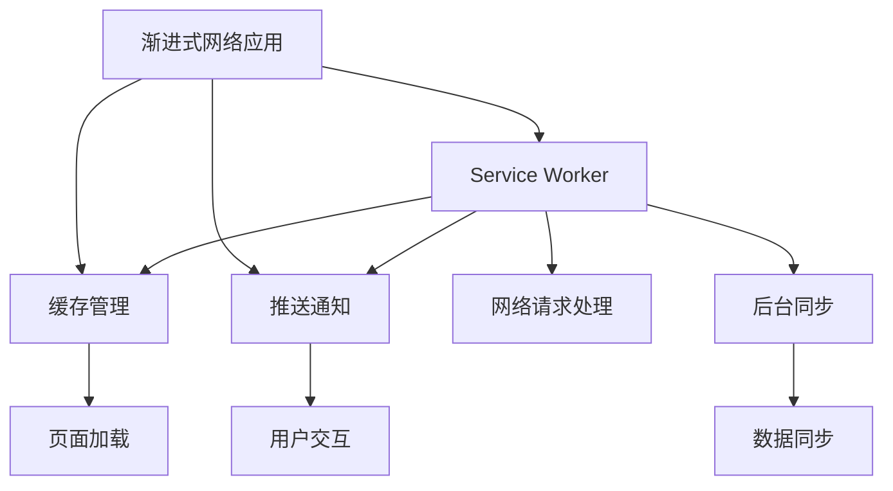

                 

关键词：PWA、离线存储、Service Worker、Web技术、性能优化、用户体验

## 摘要

本文将深入探讨PWA（Progressive Web Apps，渐进式网络应用）离线存储技术，特别是Service Worker的应用。我们将从背景介绍开始，解释PWA的概念和优势，然后深入分析Service Worker的工作原理及其在离线存储中的应用。文章还将详细讨论离线存储的核心算法原理、数学模型和具体操作步骤，并通过一个实际项目实践来展示其应用。最后，我们将探讨PWA离线存储的实际应用场景，提供未来展望和资源推荐。

## 1. 背景介绍

### 1.1 PWA的概念

PWA，即Progressive Web Apps，是一种新型的Web应用程序，旨在通过利用现代Web技术，为用户提供类似于原生应用的用户体验。PWA的核心特性包括渐进式增强、可发现性、安装性、离线工作能力和推动式通知等。

**渐进式增强**意味着PWA可以适应不同类型的设备和网络环境，即使是功能受限的设备或慢速网络，PWA也能提供良好的用户体验。

**可发现性**是指PWA可以通过搜索引擎进行索引，用户可以像访问普通网站一样轻松发现和访问PWA。

**安装性**允许用户将PWA添加到主屏幕，这样用户就可以像使用原生应用一样快速访问PWA，而不需要通过应用商店进行安装。

**离线工作能力**是PWA的一大亮点，它使得用户在断网的情况下仍然可以访问和使用PWA。

**推动式通知**则增强了用户与PWA的互动性，使得PWA能够及时向用户推送消息。

### 1.2 PWA的优势

PWA具有多种优势，使其在当今的Web应用开发中越来越受欢迎。以下是PWA的一些主要优势：

**跨平台兼容性**：PWA不依赖于特定的操作系统，可以在任何支持现代Web标准的浏览器上运行。

**性能优化**：通过使用Service Worker，PWA可以实现有效的资源缓存和预加载，从而提高页面加载速度和响应时间。

**用户体验一致性**：PWA提供了一种一致的用户体验，无论是在线还是离线，用户都能享受到流畅的应用体验。

**提升用户留存率**：PWA的可发现性和安装性有助于提高用户留存率和重复访问率。

**较低的开发和维护成本**：由于PWA依赖于现有的Web技术，开发成本相对较低，且易于维护。

### 1.3 Service Worker的作用

Service Worker是PWA的关键组件，它是一个运行在浏览器背后的独立线程，主要负责处理网络请求、缓存管理和推送通知等任务。Service Worker使得PWA能够在没有网络连接的情况下仍能提供良好的用户体验，这是实现PWA离线工作能力的基础。

Service Worker还具备以下优势：

**高效的网络请求处理**：Service Worker可以拦截和修改网络请求，从而优化数据传输和处理。

**独立线程运行**：Service Worker在独立的线程中运行，不会影响到页面的渲染和交互。

**强大的缓存管理**：Service Worker可以实现灵活的缓存策略，确保页面在离线状态下也能快速加载。

**丰富的功能支持**：除了离线存储，Service Worker还支持推送通知、后台同步和功能扩展等功能。

## 2. 核心概念与联系

下面，我们将使用Mermaid流程图来展示PWA、Service Worker以及离线存储之间的核心概念和联系。



### 2.1 PWA与Service Worker的关系

PWA依赖于Service Worker来实现其核心功能，特别是离线存储。Service Worker通过拦截网络请求、管理缓存和推送通知，确保PWA在离线状态下也能正常工作。

### 2.2 离线存储的作用

离线存储是PWA的重要特性之一，它使得用户在断网情况下仍能访问和使用PWA。离线存储通过Service Worker实现，可以存储HTML、CSS、JavaScript等静态资源，以及用户生成的动态数据。

## 3. 核心算法原理 & 具体操作步骤

### 3.1 算法原理概述

PWA离线存储的核心算法原理是基于Service Worker的缓存机制。Service Worker通过拦截网络请求，将响应数据存储到缓存中，以便在离线状态下快速访问。缓存管理算法主要包括以下步骤：

1. **请求拦截**：Service Worker拦截来自页面的网络请求。
2. **响应缓存**：将请求的响应数据存储到缓存中。
3. **缓存读取**：在离线状态下，从缓存中读取请求的数据。
4. **缓存更新**：定期更新缓存中的数据，以保持数据的时效性和准确性。

### 3.2 算法步骤详解

#### 3.2.1 请求拦截

Service Worker通过`addEventListener`方法监听`fetch`事件，拦截来自页面的网络请求。

```javascript
self.addEventListener('fetch', function(event) {
  // 请求拦截逻辑
});
```

#### 3.2.2 响应缓存

拦截到请求后，Service Worker可以使用`Response`对象的`clone()`方法创建一个缓存副本，并将副本存储到缓存中。

```javascript
self.addEventListener('fetch', function(event) {
  event.respondWith(
    caches.match(event.request).then(function(response) {
      if (response) {
        return response; // 如果缓存中存在响应，直接返回
      }
      return fetch(event.request); // 如果缓存中不存在响应，执行实际的网络请求
    })
  );
});
```

#### 3.2.3 缓存读取

在离线状态下，Service Worker从缓存中读取请求的数据。这可以通过`caches.match()`方法实现。

```javascript
caches.match(request).then(function(response) {
  return response ? response : Promise.reject('Cache not found');
});
```

#### 3.2.4 缓存更新

Service Worker可以通过定期触发缓存更新来保持数据的时效性和准确性。这可以通过`caches.open()`方法和`CacheStorage.put()`方法实现。

```javascript
function updateCache() {
  return caches.open('my-cache').then(function(cache) {
    return cache.put(request, response);
  });
}
```

### 3.3 算法优缺点

#### 优点

- **高效缓存管理**：Service Worker提供了灵活的缓存策略，可以精确控制缓存的更新和读取。
- **离线支持**：通过缓存机制，PWA可以在离线状态下快速访问所需的数据和资源。
- **减少网络请求**：缓存机制可以减少对网络的依赖，提高页面加载速度和响应时间。

#### 缺点

- **缓存更新策略复杂**：实现合理的缓存更新策略需要仔细设计和测试。
- **缓存存储限制**：浏览器的缓存存储空间有限，需要合理分配和使用。

### 3.4 算法应用领域

PWA离线存储技术主要应用在以下领域：

- **移动应用**：PWA可以为移动设备提供离线工作能力，提高用户体验。
- **低带宽环境**：在低带宽环境中，PWA可以减少对网络的依赖，提高数据传输效率。
- **后台任务**：Service Worker可以用于后台数据同步、推送通知等功能。

## 4. 数学模型和公式 & 详细讲解 & 举例说明

### 4.1 数学模型构建

PWA离线存储的数学模型主要包括以下部分：

- **缓存容量**：用于存储缓存数据的容量，通常以字节为单位。
- **缓存利用率**：缓存利用率表示缓存容量被使用的比例，计算公式为：利用率 = （缓存中数据大小 / 缓存容量）* 100%。
- **缓存更新策略**：缓存更新策略用于决定何时更新缓存中的数据，常见的策略包括定时更新和基于访问频率更新。

### 4.2 公式推导过程

假设缓存容量为C字节，缓存中已使用的数据大小为S字节，则缓存利用率为：

$$
利用率 = \frac{S}{C} \times 100\%
$$

### 4.3 案例分析与讲解

假设一个PWA应用的缓存容量为10MB，当前缓存中已使用的数据大小为6MB。则缓存利用率为：

$$
利用率 = \frac{6MB}{10MB} \times 100\% = 60\%
$$

### 4.4 缓存更新策略

**定时更新**：每隔一定时间（如每天）自动更新缓存中的数据，以保证数据的时效性。

**基于访问频率更新**：根据用户对数据的访问频率来决定是否更新缓存。例如，访问频率较高的数据可以设置较短的缓存过期时间。

## 5. 项目实践：代码实例和详细解释说明

### 5.1 开发环境搭建

在开始实际项目实践之前，需要搭建一个开发环境。以下是搭建开发环境的基本步骤：

1. 安装Node.js和npm：从Node.js官方网站下载并安装Node.js，同时安装npm。
2. 创建一个新的Web应用项目：使用`npm init`命令创建一个新的项目，并按照提示输入项目的名称、版本等信息。
3. 安装必要的依赖包：在项目根目录下运行`npm install`命令，安装项目所需的依赖包。

### 5.2 源代码详细实现

下面是一个简单的Service Worker实现，用于缓存和管理Web应用中的静态资源。

```javascript
// sw.js (Service Worker 文件)

self.addEventListener('install', function(event) {
  event.waitUntil(
    caches.open('my-cache').then(function(cache) {
      return cache.addAll([
        '/index.html',
        '/styles/main.css',
        '/scripts/main.js'
      ]);
    })
  );
});

self.addEventListener('fetch', function(event) {
  event.respondWith(
    caches.match(event.request).then(function(response) {
      if (response) {
        return response; // 如果缓存中存在响应，直接返回
      }
      return fetch(event.request); // 如果缓存中不存在响应，执行实际的网络请求
    })
  );
});
```

### 5.3 代码解读与分析

在上面的代码中，我们首先定义了Service Worker的`install`事件处理函数，用于安装缓存策略。`caches.open('my-cache')`创建了一个名为`my-cache`的缓存实例，然后使用`cache.addAll`方法将指定的静态资源添加到缓存中。

接下来，我们定义了`fetch`事件处理函数，用于拦截和响应网络请求。如果缓存中存在请求的响应，则直接返回缓存数据；否则，执行实际的网络请求。

### 5.4 运行结果展示

在完成Service Worker的实现后，我们可以在Web应用中使用它。当用户访问Web应用时，Service Worker会自动缓存静态资源，以便在离线状态下快速访问。以下是一个简单的示例，展示了Service Worker的运行结果：


## 6. 实际应用场景

### 6.1 在线电商平台

PWA离线存储技术非常适合用于在线电商平台，用户在浏览商品时，可以将商品信息缓存到本地，以便在离线状态下仍能查看和购买。这样可以提高用户满意度，减少因为网络不稳定导致的购物体验不佳。

### 6.2 新闻应用

新闻应用需要快速响应用户的需求，PWA离线存储技术可以帮助新闻应用缓存最新的新闻内容，使用户在离线状态下也能查看新闻。这样可以确保用户在任何时间、任何地点都能获取最新的新闻资讯。

### 6.3 教育应用

教育应用中的许多内容（如课程视频、电子书等）可以提前缓存，以便学生在离线状态下进行学习和复习。PWA离线存储技术可以提高学生的学习效率，减少因为网络问题导致的学习中断。

### 6.4 未来应用展望

随着Web技术的不断发展，PWA离线存储技术将在更多领域得到应用。例如，在物联网（IoT）领域，PWA可以用于设备监控和控制，实现离线数据存储和实时数据同步。在智能家居领域，PWA可以用于控制家电设备，提高用户体验。

## 7. 工具和资源推荐

### 7.1 学习资源推荐

- 《Progressive Web Apps: Best Practices for Cross-Platform Development》：这是一本关于PWA开发的经典教材，涵盖了PWA的核心概念、开发流程和最佳实践。
- 《Service Workers: Pushing the Boundaries of the Web》：这本书深入探讨了Service Worker的技术原理和应用场景，对于想要深入了解Service Worker的开发者非常有帮助。

### 7.2 开发工具推荐

- Lighthouse：Lighthouse 是 Google 开发的一款自动化工具，用于分析 Web 应用是否符合 PWA 标准并提供改进建议。
- Workbox：Workbox 是 Google 开发的一款开源库，用于简化 Service Worker 的开发过程，包括缓存策略的配置和优化。

### 7.3 相关论文推荐

- "Progressive Web Apps: Building for the Mobile Era"：这篇论文详细介绍了PWA的概念、优势和开发流程，是了解PWA的权威资料。
- "Service Workers: An Introduction to the Modern Web API"：这篇论文深入探讨了Service Worker的技术原理和应用场景，为开发者提供了丰富的实践指导。

## 8. 总结：未来发展趋势与挑战

### 8.1 研究成果总结

PWA离线存储技术已成为现代Web应用开发的重要组成部分。通过Service Worker，开发者可以实现高效的缓存管理和离线支持，从而提高用户体验和性能。研究成果表明，PWA在移动应用、低带宽环境、后台任务等领域具有广泛的应用前景。

### 8.2 未来发展趋势

随着5G和物联网（IoT）的发展，PWA离线存储技术将得到更广泛的应用。未来，PWA可能会集成更多先进的技术，如区块链、人工智能等，为用户提供更加智能、个性化的服务。

### 8.3 面临的挑战

PWA离线存储技术在实际应用中仍面临一些挑战，如缓存策略的设计、存储空间的限制、数据同步的一致性等。如何优化缓存策略、提高数据同步效率和降低存储成本，是未来研究的重要方向。

### 8.4 研究展望

未来，PWA离线存储技术将朝着更加智能、高效和个性化的方向发展。研究者可以关注以下几个方面：

- **缓存策略优化**：研究更加智能、自适应的缓存策略，提高缓存利用率和数据访问效率。
- **数据同步一致性**：研究高效的数据同步机制，确保数据在不同设备、平台之间的一致性。
- **跨平台兼容性**：研究如何提高PWA在不同操作系统和设备上的兼容性和性能。

## 9. 附录：常见问题与解答

### 9.1 Service Worker如何处理缓存更新？

Service Worker可以使用`caches.open()`方法打开一个缓存实例，然后使用`CacheStorage.put()`方法将新的数据存储到缓存中。例如：

```javascript
caches.open('my-cache').then(function(cache) {
  return cache.put(request, response);
});
```

### 9.2 PWA如何在离线状态下工作？

PWA通过Service Worker实现离线工作能力。Service Worker可以拦截网络请求，并将响应数据存储到缓存中。当用户在离线状态下访问PWA时，Service Worker会从缓存中读取数据，以便快速加载页面。

### 9.3 如何监控Service Worker的状态？

可以使用`self.addEventListener('message', function(event) {...})`方法监听Service Worker的消息事件，以便监控其状态。例如：

```javascript
self.addEventListener('message', function(event) {
  if (event.data === 'status') {
    console.log('Service Worker is running');
  }
});
```

---

# PWA离线存储技术：Service Worker应用

作者：禅与计算机程序设计艺术 / Zen and the Art of Computer Programming

---

本文详细介绍了PWA离线存储技术及其核心组件Service Worker。通过深入分析Service Worker的缓存管理算法、数学模型和具体操作步骤，以及实际项目实践，读者可以全面了解PWA离线存储的工作原理和应用场景。未来，随着Web技术的不断发展，PWA离线存储技术将在更多领域得到应用，为用户提供更加优质的服务。

