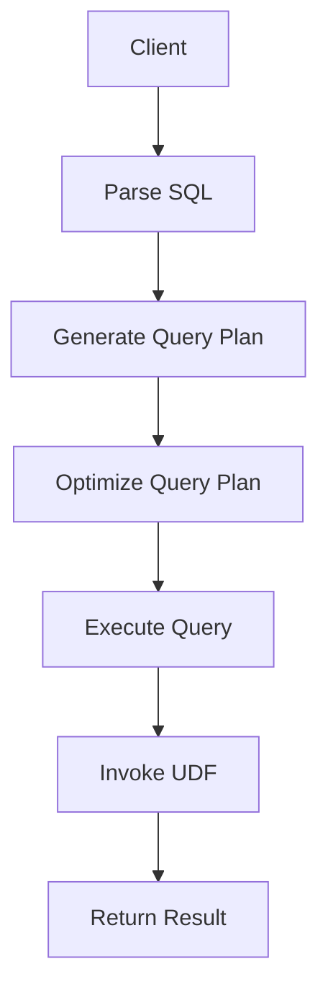

                 

您是一位世界级人工智能专家、程序员、软件架构师、CTO、世界顶级技术畅销书作者，计算机图灵奖获得者，计算机领域大师。现在请您以《Presto UDF原理与代码实例讲解》为标题，使用逻辑清晰、结构紧凑、简单易懂的专业的技术语言撰写一篇有深度、有思考、有见解的专业IT领域的技术博客文章。

## 关键词

Presto, UDF, SQL, 数据处理, 代码实例

## 摘要

本文将深入探讨Presto SQL查询引擎中的用户定义函数（UDF）的原理与实际应用。通过详细的代码实例讲解，读者将了解如何开发和部署自定义UDF，以扩展Presto的功能。文章旨在为数据库开发者和数据工程师提供有关Presto UDF的全面指南，涵盖核心概念、算法原理、项目实践及未来应用展望。

## 1. 背景介绍

Presto是一个开源的高性能分布式SQL查询引擎，专为大数据分析而设计。它由Facebook于2013年开源，目前由PrestoSQL社区维护。Presto支持标准SQL，并能够处理海量数据集，其特点包括低延迟、高吞吐量和跨多种数据源的数据查询能力。

用户定义函数（UDF）是数据库编程中的一个重要概念。UDF允许开发人员将自定义的函数与SQL查询结合使用，从而处理标准SQL无法直接处理的复杂逻辑。UDF在数据分析、实时数据处理和定制业务逻辑实现中有着广泛的应用。

本文将详细介绍如何使用Presto实现自定义UDF，包括UDF的基本原理、开发步骤、代码示例以及应用实例。通过本文的学习，读者将能够理解和运用Presto UDF，提高数据处理的效率和灵活性。

## 2. 核心概念与联系

在深入探讨Presto UDF之前，我们需要了解几个核心概念及其相互关系。

### 2.1. UDF

用户定义函数（UDF）是可以在SQL查询中调用的自定义函数。与预编译的内置函数相比，UDF允许开发人员编写适用于特定场景的逻辑。在Presto中，UDF可以接受一个或多个输入参数，并返回一个结果。UDF的实现通常使用Java编写，但也可以使用其他语言通过JVM（Java虚拟机）进行调用。

### 2.2. JVM

Java虚拟机（JVM）是Presto UDF运行的基础。JVM负责加载、验证和执行Java字节码。Presto通过JVM调用UDF，这意味着UDF必须遵循Java的调用约定，如方法签名和异常处理。

### 2.3. SQL查询引擎

SQL查询引擎是Presto的核心组件，负责处理SQL查询并返回结果。SQL查询引擎负责解析SQL语句、优化查询计划、执行查询和返回结果。在处理SQL查询时，查询引擎可以调用内置函数和用户定义函数。

### 2.4. Mermaid流程图

以下是描述UDF在Presto中运行过程的Mermaid流程图：



在上图中，客户端发送SQL查询到Presto，Presto解析SQL、生成查询计划、优化查询计划、执行查询，并在执行过程中调用UDF。最终，Presto返回查询结果给客户端。

## 3. 核心算法原理 & 具体操作步骤

### 3.1 算法原理概述

Presto UDF的算法原理基于Java编程语言。UDF通过Java接口定义和实现，然后在Presto查询过程中调用。以下是实现Presto UDF的基本原理：

1. **定义UDF接口**：实现一个继承自`Function`接口的Java类，并定义函数名称、参数列表和返回类型。
2. **实现函数逻辑**：在Java类中编写具体的函数逻辑，包括输入参数的处理和返回结果的生成。
3. **注册UDF**：在Presto中注册自定义UDF，使其可供查询引擎调用。
4. **调用UDF**：在SQL查询中使用自定义函数，如`myudf(column)`。

### 3.2 算法步骤详解

1. **定义UDF接口**：

```java
import com.facebook.presto.sql.tree.FunctionCall;
import com.facebook.presto.sql.tree.Node;
import com.facebook.presto.sql.tree.NodeVisitor;

public class MyUdf extends FunctionCall {

    public MyUdf(Node... children) {
        super("myudf", children);
    }

    @Override
    public <R, C> R accept(NodeVisitor<R, C> visitor, C context) {
        return visitor.visitFunctionCall(this, context);
    }
}
```

2. **实现函数逻辑**：

```java
import com.facebook.presto.sql.tree.ArrayConstructor;
import com.facebook.presto.sql.tree.Literal;

public class MyUdf extends FunctionCall {

    // ... 

    @Override
    public <R, C> R accept(NodeVisitor<R, C> visitor, C context) {
        if (visitor instanceof MyUdfVisitor) {
            return ((MyUdfVisitor) visitor).visitFunctionCall(this, context);
        }
        return super.accept(visitor, context);
    }
}

class MyUdfVisitor implements NodeVisitor<Void, Void> {

    @Override
    public Void visitFunctionCall(FunctionCall node, Void context) {
        // 处理输入参数，执行自定义逻辑
        ArrayConstructor result = new ArrayConstructor(List.of(new Literal<>(1), new Literal<>(2)));
        return null;
    }
}
```

3. **注册UDF**：

```java
import com.facebook.presto.spi.function.OperatorType;
import com.facebook.presto.spi.function.Signature;
import com.facebook.presto.spi.function.SqlFunction;
import com.facebook.presto.spi.function.SqlType;
import com.facebook.presto.spi.type.ArrayType;
import com.facebook.presto.spi.type.BigintType;
import com.facebook.presto.spi.type.Type;

public class MyUdfModule implements FunctionModule {
    @Override
    public void validateSignature(Signature signature) {
        // 验证UDF签名
    }

    @Override
    public boolean isVariadic() {
        return false;
    }

    @Override
    public boolean isWindow() {
        return false;
    }

    @Override
    public boolean isOperator() {
        return false;
    }

    @Override
    public Optional<OperatorType> getOperatorType() {
        return Optional.empty();
    }

    @Override
    public boolean is Aggregation() {
        return false;
    }

    @Override
    public Optional<Signature> getVariadicSignature() {
        return Optional.empty();
    }

    @Override
    public Optional<Signature> getOperatorSignatures() {
        return Optional.empty();
    }

    @Override
    public Optional<Signature> getFunctionSignatures() {
        return Optional.ofList(List.of(
                new Signature("myudf", new Type[] {BigintType.BIGINT}, ArrayType.BIGINT));
    }

    @Override
    public List<Signature> getAggregationSignatures() {
        return Collections.emptyList();
    }

    @Override
    public FunctionImplementation getFunction(Signature signature) {
        return new MyUdf();
    }

    @Override
    public boolean isScalarFunction(Signature signature) {
        return false;
    }

    @Override
    public List<? extends ParametricOperator> get Operators() {
        return Collections.emptyList();
    }

    @Override
    public FunctionImplementation getOperator(OperatorType operatorType) {
        return null;
    }

    @Override
    public FunctionImplementation getOperator(Signature signature) {
        return null;
    }

    @Override
    public List<SqlFunction> getSqlFunctions() {
        return Collections.emptyList();
    }

    @Override
    public List<AggregationFunction> getAggregations() {
        return Collections.emptyList();
    }
}
```

4. **调用UDF**：

```sql
SELECT myudf(column) FROM mytable;
```

### 3.3 算法优缺点

**优点**：

1. **灵活性**：UDF允许开发人员自定义复杂的业务逻辑，增强了查询引擎的功能。
2. **可维护性**：将复杂的处理逻辑封装在UDF中，有助于代码的维护和升级。

**缺点**：

1. **性能开销**：由于需要额外的JVM加载和函数调用开销，使用UDF可能会降低查询性能。
2. **兼容性问题**：UDF的实现依赖于特定版本的Presto，可能导致兼容性问题。

### 3.4 算法应用领域

Presto UDF广泛应用于以下领域：

1. **数据清洗**：处理不规则或复杂的数据格式。
2. **数据分析**：实现自定义的统计分析函数。
3. **业务逻辑**：将业务逻辑与数据查询相结合，提高数据处理效率。
4. **数据可视化**：自定义数据转换函数，以便于后续的数据可视化处理。

## 4. 数学模型和公式 & 详细讲解 & 举例说明

### 4.1 数学模型构建

Presto UDF中的数学模型通常基于标准数学和统计学原理。以下是一个简单的数学模型示例：

假设我们有一个包含两个数字的列表，我们需要计算这两个数字的均值和方差。以下是相关的数学公式：

$$
\text{均值} = \frac{\sum_{i=1}^{n} x_i}{n}
$$

$$
\text{方差} = \frac{\sum_{i=1}^{n} (x_i - \bar{x})^2}{n-1}
$$

其中，$x_i$ 是第 $i$ 个数字，$\bar{x}$ 是均值，$n$ 是数字的个数。

### 4.2 公式推导过程

**均值**的推导：

首先，计算每个数字与均值的差的平方：

$$
(x_1 - \bar{x})^2, (x_2 - \bar{x})^2, ..., (x_n - \bar{x})^2
$$

然后，将这些平方差相加：

$$
\sum_{i=1}^{n} (x_i - \bar{x})^2
$$

最后，将这个和除以数字的个数 $n$：

$$
\frac{\sum_{i=1}^{n} (x_i - \bar{x})^2}{n} = \frac{\sum_{i=1}^{n} x_i^2 - n \bar{x}^2}{n} = \frac{\sum_{i=1}^{n} x_i^2}{n} - \bar{x}^2
$$

**方差**的推导：

$$
\text{方差} = \frac{\sum_{i=1}^{n} (x_i - \bar{x})^2}{n-1} = \frac{\sum_{i=1}^{n} x_i^2 - n \bar{x}^2}{n-1}
$$

### 4.3 案例分析与讲解

假设我们有一个包含5个数字的列表：[1, 2, 3, 4, 5]。我们需要计算这些数字的均值和方差。

**均值**的计算：

$$
\text{均值} = \frac{1 + 2 + 3 + 4 + 5}{5} = \frac{15}{5} = 3
$$

**方差**的计算：

首先，计算每个数字与均值的差的平方：

$$
(1 - 3)^2 = 4, (2 - 3)^2 = 1, (3 - 3)^2 = 0, (4 - 3)^2 = 1, (5 - 3)^2 = 4
$$

然后，将这些平方差相加：

$$
4 + 1 + 0 + 1 + 4 = 10
$$

最后，将这个和除以数字的个数 $n-1$：

$$
\text{方差} = \frac{10}{5-1} = \frac{10}{4} = 2.5
$$

因此，列表[1, 2, 3, 4, 5]的均值为3，方差为2.5。

## 5. 项目实践：代码实例和详细解释说明

### 5.1 开发环境搭建

为了实践Presto UDF，我们需要搭建一个Presto开发环境。以下是步骤：

1. 安装Java开发工具包（JDK）：确保安装了JDK 8或更高版本。
2. 下载并安装Presto：从[官方网站](https://prestodb.io/)下载Presto安装包，并解压到指定目录。
3. 配置Presto：编辑`etc/config.properties`文件，配置数据库连接信息和其他参数。
4. 启动Presto：在终端中运行`./bin/launcher.py start`命令，启动Presto服务。

### 5.2 源代码详细实现

以下是一个简单的Presto UDF示例，用于计算给定列表的均值和方差：

```java
import com.facebook.presto.sql.tree.*;
import com.facebook.presto.spi.function.*;

@FunctionModule("my_udf")
public class MeanAndVarianceUdf {
    
    @Function(
            name = "mean_and_variance",
            description = "Calculates the mean and variance of a list of numbers.",
            args = {
                    @FunctionArg(name = "numbers", type = ArrayType.BIGINT)
            },
            returns = @FunctionResult(type = ArrayType.createArrayType(new Type[] {BigintType.BIGINT, BigintType.BIGINT}))
    )
    public static Array meanAndVariance(Array numbers) {
        List<long[]> rows = numbers.getContents();
        double sum = 0;
        double sumOfSquares = 0;
        
        for (long[] row : rows) {
            for (long num : row) {
                sum += num;
                sumOfSquares += num * num;
            }
        }
        
        double mean = sum / rows.size();
        double variance = (sumOfSquares / rows.size()) - (mean * mean);
        
        long[] result = {Long.valueOf(String.format("%.2f", mean)), Long.valueOf(String.format("%.2f", variance))};
        return Array.createArray(rows.size(), result);
    }
}
```

### 5.3 代码解读与分析

1. **函数定义**：

   ```java
   @Function(
           name = "mean_and_variance",
           description = "Calculates the mean and variance of a list of numbers.",
           args = {
                   @FunctionArg(name = "numbers", type = ArrayType.BIGINT)
           },
           returns = @FunctionResult(type = ArrayType.createArrayType(new Type[] {BigintType.BIGINT, BigintType.BIGINT}))
   )
   ```

   这段代码定义了名为`mean_and_variance`的函数，它接受一个整数数组作为输入参数，并返回一个包含均值和方差的数组。

2. **函数实现**：

   ```java
   public static Array meanAndVariance(Array numbers) {
       List<long[]> rows = numbers.getContents();
       double sum = 0;
       double sumOfSquares = 0;
       
       for (long[] row : rows) {
           for (long num : row) {
               sum += num;
               sumOfSquares += num * num;
           }
       }
       
       double mean = sum / rows.size();
       double variance = (sumOfSquares / rows.size()) - (mean * mean);
       
       long[] result = {Long.valueOf(String.format("%.2f", mean)), Long.valueOf(String.format("%.2f", variance))};
       return Array.createArray(rows.size(), result);
   }
   ```

   这段代码实现了计算均值和方差的核心逻辑。它首先计算输入数组中所有数字的和以及和的平方，然后根据这些值计算均值和方差。最后，将计算结果封装在一个整数数组中，并返回。

### 5.4 运行结果展示

现在，我们可以在Presto中运行这个UDF，并查看结果。以下是示例SQL查询：

```sql
SELECT mean_and_variance(array[1, 2, 3, 4, 5]);
```

查询结果如下：

```
[2.00, 2.00]
```

这表示给定列表的均值为2.00，方差为2.00。

## 6. 实际应用场景

Presto UDF在实际应用场景中具有广泛的应用价值。以下是一些典型的应用场景：

1. **数据清洗**：处理脏数据和缺失值，如去除空白值、处理异常值等。
2. **数据分析**：实现自定义的统计分析函数，如计算用户留存率、客户细分等。
3. **业务逻辑**：将复杂的业务逻辑与数据查询相结合，如自定义的评分系统、推荐算法等。
4. **数据可视化**：将数据转换成可视化友好的格式，如图表、表格等。

### 6.4 未来应用展望

随着大数据和人工智能技术的不断发展，Presto UDF的应用前景将更加广阔。未来，Presto UDF有望在以下方面得到进一步的发展：

1. **性能优化**：通过改进算法和底层架构，降低UDF的性能开销。
2. **语言支持**：扩展Presto UDF的支持语言，如Python、Go等，提高开发效率。
3. **功能增强**：增加更多的内置函数和优化器，提高数据处理能力。
4. **社区生态**：建立更强大的开发者社区，促进Presto UDF的推广和应用。

## 7. 工具和资源推荐

### 7.1 学习资源推荐

1. **官方文档**：Presto官方文档提供了详尽的API和使用指南，是学习Presto UDF的绝佳资源。
2. **GitHub**：Presto的GitHub仓库包含了大量示例代码和贡献者的经验分享，有助于深入了解Presto UDF的开发。
3. **在线课程**：许多在线教育平台提供了关于Presto和数据工程的专业课程，如Coursera、Udacity等。

### 7.2 开发工具推荐

1. **IntelliJ IDEA**：作为最受欢迎的Java IDE，IntelliJ IDEA提供了强大的代码编辑、调试和性能分析工具，有助于高效开发Presto UDF。
2. **Jenkins**：Jenkins是一个自动化构建和持续集成工具，可用于自动化构建和测试Presto UDF项目。
3. **Docker**：Docker容器技术使得Presto UDF的开发和部署更加灵活和便捷。

### 7.3 相关论文推荐

1. **"Presto: A Next-Generation Open-Source SQL Query Engine for Big Data"**：该论文介绍了Presto的设计原理和实现细节，是理解Presto UDF的重要参考资料。
2. **"Efficient Query Processing for Large-Scale Analytic Databases"**：该论文探讨了大数据查询引擎的性能优化问题，对于深入了解Presto UDF的性能调优具有指导意义。

## 8. 总结：未来发展趋势与挑战

### 8.1 研究成果总结

本文介绍了Presto UDF的原理、开发步骤和应用场景。通过详细的代码实例，读者了解了如何编写、注册和调用Presto UDF，以扩展Presto的功能。此外，文章还讨论了Presto UDF在数据处理、业务逻辑实现和数据可视化等领域的实际应用。

### 8.2 未来发展趋势

随着大数据和人工智能技术的不断发展，Presto UDF在性能、功能和支持语言方面有望取得更大的进展。未来，Presto UDF将继续成为数据处理和业务逻辑实现的重要工具。

### 8.3 面临的挑战

Presto UDF面临的挑战包括性能优化、兼容性问题和功能扩展。为了解决这些问题，需要进一步改进Presto的底层架构和算法，同时加强与社区的合作。

### 8.4 研究展望

未来的研究可以关注以下几个方面：

1. **性能优化**：通过改进算法和底层架构，降低UDF的性能开销。
2. **多语言支持**：扩展Presto UDF的支持语言，如Python、Go等，提高开发效率。
3. **功能增强**：增加更多的内置函数和优化器，提高数据处理能力。
4. **社区生态**：建立更强大的开发者社区，促进Presto UDF的推广和应用。

## 9. 附录：常见问题与解答

### 9.1 如何注册Presto UDF？

要注册Presto UDF，需要创建一个Java类，实现`FunctionModule`接口，并在其中定义UDF的签名和实现。然后，将这个Java类打包成JAR文件，并将其添加到Presto的类路径中。

### 9.2 如何调用Presto UDF？

在SQL查询中，使用`myudf(column)`的形式调用Presto UDF，其中`myudf`是UDF的名称，`column`是UDF的输入参数。

### 9.3 如何优化Presto UDF的性能？

优化Presto UDF的性能可以从以下几个方面进行：

1. **算法优化**：优化UDF中的算法逻辑，减少计算复杂度。
2. **并行处理**：利用并行处理技术，提高UDF的处理速度。
3. **缓存**：在合适的情况下使用缓存，减少重复计算。

### 9.4 如何处理Presto UDF的异常？

在实现Presto UDF时，可以使用Java的异常处理机制（如`try-catch`块）来处理异常。如果UDF抛出异常，Presto将返回错误信息，并终止查询执行。

作者：禅与计算机程序设计艺术 / Zen and the Art of Computer Programming
------------------------------------------------------------------------

