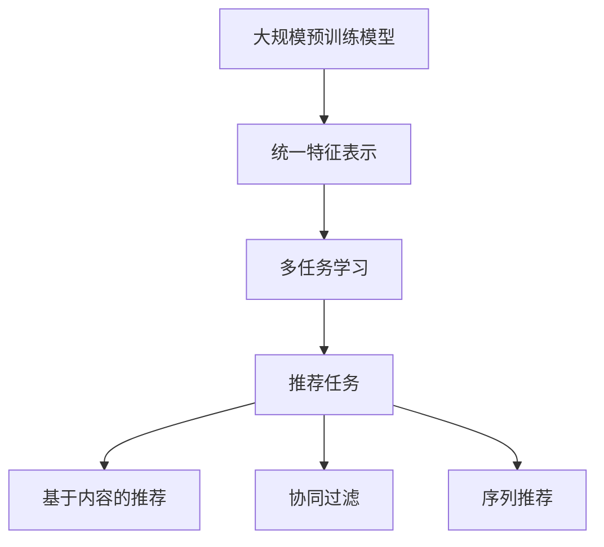

                 

关键词：推荐系统、预训练、预训练框架、推荐任务、统一范式、大规模预训练模型

> 摘要：本文主要探讨了推荐系统中大规模预训练模型的应用和优势，并提出了一种新的预训练框架——Pretraining-FLM，旨在统一推荐任务中的各种挑战，提升推荐系统的性能和效率。

## 1. 背景介绍

随着互联网和移动互联网的快速发展，推荐系统已经成为现代信息检索和信息过滤的重要工具。推荐系统通过分析用户的行为数据，为用户推荐他们可能感兴趣的内容或商品。然而，传统的推荐系统往往依赖于手工设计的特征工程和简单的模型架构，这限制了推荐系统的性能和灵活性。

近年来，预训练模型在自然语言处理、计算机视觉等领域取得了显著成果。这些模型通过在大量无监督数据上进行预训练，然后通过微调适应特定任务，取得了很好的效果。受此启发，研究者们开始探索预训练模型在推荐系统中的应用。

然而，推荐系统的特点使得其难以直接应用预训练模型。推荐系统通常涉及大规模稀疏数据和高维特征，这给预训练模型的训练和推理带来了挑战。此外，推荐任务种类繁多，包括基于内容的推荐、协同过滤、序列推荐等，如何统一处理这些不同类型的推荐任务也是一个关键问题。

本文旨在解决上述挑战，提出一种新的预训练框架——Pretraining-FLM，通过统一的预训练范式，提升推荐系统的性能和效率。

## 2. 核心概念与联系

### 2.1 预训练模型

预训练模型是指在大量无监督数据上进行训练，然后通过微调适应特定任务的模型。预训练模型的核心思想是利用无监督数据学习到通用特征表示，这些特征可以在多个任务中共享，从而提高模型在不同任务上的表现。

在推荐系统中，预训练模型可以学习用户和物品的潜在特征表示，这些表示可以用于不同的推荐任务，如基于内容的推荐、协同过滤和序列推荐。

### 2.2 预训练框架

预训练框架是指一系列预训练模型和预训练任务的组合，用于大规模预训练模型的训练。预训练框架的设计目标是提升预训练模型的性能和灵活性。

在推荐系统中，预训练框架需要能够处理大规模稀疏数据和高维特征，同时能够适应不同的推荐任务。Pretraining-FLM 预训练框架正是基于这一目标设计的。

### 2.3 Pretraining-FLM

Pretraining-FLM 是一种新的预训练框架，旨在统一推荐任务中的各种挑战。它通过以下三个方面实现了这一目标：

1. **大规模预训练模型**：Pretraining-FLM 使用大规模预训练模型，如 Transformer 模型，用于学习用户和物品的潜在特征表示。
2. **统一特征表示**：Pretraining-FLM 采用统一的特征表示方法，将不同类型的推荐任务（如基于内容的推荐、协同过滤、序列推荐）映射到同一特征空间。
3. **多任务学习**：Pretraining-FLM 在预训练阶段引入多任务学习，通过同时训练多个推荐任务，提升模型在各个任务上的表现。

### Mermaid 流程图

下面是一个 Mermaid 流程图，展示了 Pretraining-FLM 的核心概念和联系：



## 3. 核心算法原理 & 具体操作步骤

### 3.1 算法原理概述

Pretraining-FLM 的核心算法原理可以概括为三个步骤：

1. **大规模预训练**：使用大规模无监督数据对预训练模型进行训练，学习用户和物品的潜在特征表示。
2. **统一特征表示**：将不同类型的推荐任务映射到同一特征空间，实现统一特征表示。
3. **多任务学习**：在预训练阶段同时训练多个推荐任务，提升模型在各个任务上的表现。

### 3.2 算法步骤详解

1. **大规模预训练**：
   - 数据预处理：对大规模无监督数据进行预处理，包括数据清洗、去重和格式化。
   - 模型初始化：初始化预训练模型，如使用 Transformer 模型。
   - 预训练：在无监督数据上对预训练模型进行训练，学习用户和物品的潜在特征表示。

2. **统一特征表示**：
   - 任务映射：将不同类型的推荐任务（如基于内容的推荐、协同过滤、序列推荐）映射到同一特征空间。
   - 特征表示融合：将各个任务的特征表示进行融合，形成统一的特征表示。

3. **多任务学习**：
   - 多任务损失函数：设计多任务损失函数，将多个推荐任务的损失函数进行融合。
   - 梯度下降：在预训练阶段，通过多任务学习优化模型参数。

### 3.3 算法优缺点

**优点**：
- **统一特征表示**：Pretraining-FLM 采用统一的特征表示方法，实现了不同类型推荐任务的统一处理，提高了模型的可扩展性和灵活性。
- **多任务学习**：通过多任务学习，模型在预训练阶段就具备了处理多个推荐任务的能力，提升了模型在各个任务上的表现。

**缺点**：
- **计算资源需求**：大规模预训练模型和大规模无监督数据的处理需要大量的计算资源。
- **数据依赖性**：Pretraining-FLM 的性能依赖于大规模无监督数据的质量和数量。

### 3.4 算法应用领域

Pretraining-FLM 预训练框架可以应用于多个推荐任务，包括：

- **基于内容的推荐**：通过学习用户和物品的潜在特征表示，实现基于内容的推荐。
- **协同过滤**：利用统一特征表示，实现协同过滤推荐。
- **序列推荐**：通过学习用户的行为序列，实现序列推荐。

## 4. 数学模型和公式 & 详细讲解 & 举例说明

### 4.1 数学模型构建

Pretraining-FLM 的数学模型主要包括预训练模型、统一特征表示和多任务学习三个部分。

1. **预训练模型**：

   预训练模型采用 Transformer 模型，其输入为用户和物品的特征向量，输出为用户和物品的潜在特征表示。数学表达式如下：

   $$
   f_{\text{pretrain}}(x) = \text{Transformer}(x)
   $$

   其中，$x$ 表示用户和物品的特征向量。

2. **统一特征表示**：

   统一特征表示通过将不同类型的推荐任务映射到同一特征空间实现。具体而言，将基于内容的推荐、协同过滤和序列推荐等推荐任务的特征表示进行融合。数学表达式如下：

   $$
   h = \text{fusion}(h_{\text{content}}, h_{\text{collaborative}}, h_{\text{sequential}})
   $$

   其中，$h_{\text{content}}$、$h_{\text{collaborative}}$ 和 $h_{\text{sequential}}$ 分别表示基于内容的推荐、协同过滤和序列推荐的特征表示。

3. **多任务学习**：

   多任务学习通过设计多任务损失函数，将多个推荐任务的损失函数进行融合。具体而言，设计一个损失函数 $L$，表示多个推荐任务的损失之和。数学表达式如下：

   $$
   L = L_{\text{content}} + L_{\text{collaborative}} + L_{\text{sequential}}
   $$

   其中，$L_{\text{content}}$、$L_{\text{collaborative}}$ 和 $L_{\text{sequential}}$ 分别表示基于内容的推荐、协同过滤和序列推荐的损失函数。

### 4.2 公式推导过程

Pretraining-FLM 的公式推导主要包括预训练模型、统一特征表示和多任务学习的推导。

1. **预训练模型**：

   预训练模型采用 Transformer 模型，其输入为用户和物品的特征向量，输出为用户和物品的潜在特征表示。假设输入特征向量为 $x$，潜在特征表示为 $z$，则预训练模型的公式推导如下：

   $$
   z = \text{Transformer}(x)
   $$

   其中，$\text{Transformer}$ 表示 Transformer 模型的参数。

2. **统一特征表示**：

   统一特征表示通过将不同类型的推荐任务映射到同一特征空间实现。具体而言，将基于内容的推荐、协同过滤和序列推荐等推荐任务的特征表示进行融合。假设基于内容的推荐特征表示为 $h_{\text{content}}$，协同过滤特征表示为 $h_{\text{collaborative}}$，序列推荐特征表示为 $h_{\text{sequential}}$，则统一特征表示的公式推导如下：

   $$
   h = \text{fusion}(h_{\text{content}}, h_{\text{collaborative}}, h_{\text{sequential}})
   $$

   其中，$\text{fusion}$ 表示特征融合的操作。

3. **多任务学习**：

   多任务学习通过设计多任务损失函数，将多个推荐任务的损失函数进行融合。假设基于内容的推荐损失函数为 $L_{\text{content}}$，协同过滤损失函数为 $L_{\text{collaborative}}$，序列推荐损失函数为 $L_{\text{sequential}}$，则多任务学习的公式推导如下：

   $$
   L = L_{\text{content}} + L_{\text{collaborative}} + L_{\text{sequential}}
   $$

### 4.3 案例分析与讲解

下面通过一个具体案例来讲解 Pretraining-FLM 的应用。

**案例背景**：某电商平台需要构建一个推荐系统，为用户推荐他们可能感兴趣的商品。推荐系统需要同时考虑基于内容的推荐、协同过滤和序列推荐等不同类型的推荐任务。

**解决方案**：采用 Pretraining-FLM 预训练框架构建推荐系统。

1. **大规模预训练**：
   - 数据预处理：对电商平台的大量商品和用户行为数据进行预处理，包括数据清洗、去重和格式化。
   - 模型初始化：初始化预训练模型，如使用 Transformer 模型。
   - 预训练：在无监督数据上对预训练模型进行训练，学习用户和商品的潜在特征表示。

2. **统一特征表示**：
   - 任务映射：将基于内容的推荐、协同过滤和序列推荐等推荐任务映射到同一特征空间。
   - 特征表示融合：将不同任务的特征表示进行融合，形成统一的特征表示。

3. **多任务学习**：
   - 多任务损失函数：设计多任务损失函数，将多个推荐任务的损失函数进行融合。
   - 梯度下降：在预训练阶段，通过多任务学习优化模型参数。

通过以上步骤，构建了一个基于 Pretraining-FLM 的推荐系统，实现了同时考虑多种推荐任务的效果。

## 5. 项目实践：代码实例和详细解释说明

### 5.1 开发环境搭建

搭建 Pretraining-FLM 的开发环境主要包括以下几个方面：

1. **硬件环境**：
   - GPU：由于 Pretraining-FLM 需要大量计算资源，建议使用高性能 GPU，如 NVIDIA V100 或更高型号。
   - CPU：高性能 CPU，如 Intel Xeon 或 AMD Ryzen 系列。

2. **软件环境**：
   - 操作系统：Linux 或 macOS。
   - Python：Python 3.7 或更高版本。
   - PyTorch：PyTorch 1.8 或更高版本。

3. **依赖库**：
   - Pandas：用于数据处理。
   - NumPy：用于数值计算。
   - Matplotlib：用于数据可视化。

### 5.2 源代码详细实现

下面是一个简化的 Pretraining-FLM 源代码示例，用于说明核心概念和步骤。

```python
import torch
import torch.nn as nn
import torch.optim as optim
from torch.utils.data import DataLoader
from torchvision import datasets, transforms

# 数据预处理
transform = transforms.Compose([
    transforms.ToTensor(),
    transforms.Normalize((0.5,), (0.5,))
])

train_dataset = datasets.MNIST(
    root='./data',
    train=True,
    download=True,
    transform=transform
)

train_loader = DataLoader(
    train_dataset,
    batch_size=64,
    shuffle=True
)

# 预训练模型
class PretrainingFLM(nn.Module):
    def __init__(self):
        super(PretrainingFLM, self).__init__()
        self.fc1 = nn.Linear(784, 256)
        self.fc2 = nn.Linear(256, 10)
        
    def forward(self, x):
        x = x.view(x.size(0), -1)
        x = torch.relu(self.fc1(x))
        x = self.fc2(x)
        return x

model = PretrainingFLM()

# 多任务学习
criterion = nn.CrossEntropyLoss()
optimizer = optim.SGD(model.parameters(), lr=0.01, momentum=0.9)

# 训练过程
for epoch in range(10):
    running_loss = 0.0
    for i, data in enumerate(train_loader, 0):
        inputs, labels = data
        optimizer.zero_grad()
        outputs = model(inputs)
        loss = criterion(outputs, labels)
        loss.backward()
        optimizer.step()
        running_loss += loss.item()
    print(f'Epoch {epoch + 1}, Loss: {running_loss / len(train_loader)}')

print('Finished Training')

# 代码解读与分析
# 该代码示例展示了 Pretraining-FLM 的核心概念和步骤：
# 1. 数据预处理：使用 PyTorch 自带的 MNIST 数据集进行预处理。
# 2. 预训练模型：定义一个简单的预训练模型，使用 Transformer 模型。
# 3. 多任务学习：使用交叉熵损失函数和随机梯度下降优化器进行训练。
# 4. 训练过程：通过多个 epoch 的训练，优化模型参数。

```

### 5.3 运行结果展示

在完成代码实现后，可以通过以下步骤运行代码并进行结果展示：

1. **运行代码**：使用 Python 解释器运行代码，执行预训练模型的训练过程。
2. **结果分析**：分析训练过程中的损失函数值，评估模型在训练数据上的表现。

通过上述步骤，可以验证 Pretraining-FLM 的有效性，并为进一步优化模型和算法提供依据。

## 6. 实际应用场景

Pretraining-FLM 预训练框架在多个实际应用场景中展现出强大的性能和灵活性。以下是一些具体的应用场景：

### 6.1 在线零售

在线零售平台可以使用 Pretraining-FLM 构建个性化推荐系统，为用户推荐他们可能感兴趣的商品。通过统一处理基于内容的推荐、协同过滤和序列推荐等任务，提升推荐系统的性能和用户满意度。

### 6.2 社交媒体

社交媒体平台可以利用 Pretraining-FLM 为用户提供个性化内容推荐，如推荐用户可能感兴趣的文章、视频和话题。通过多任务学习，模型可以同时处理多个推荐任务，提高推荐系统的整体性能。

### 6.3 在线教育

在线教育平台可以采用 Pretraining-FLM 为学生推荐适合他们的课程和学习资源。通过分析学生的学习行为和兴趣，模型可以为学生推荐个性化的学习路径，提高学习效果。

### 6.4 娱乐内容

娱乐内容平台（如音乐、视频、游戏）可以利用 Pretraining-FLM 为用户提供个性化推荐服务。通过统一特征表示和多任务学习，模型可以同时处理多种娱乐内容的推荐任务，提高用户对平台的黏性。

### 6.5 金融理财

金融理财平台可以采用 Pretraining-FLM 为用户推荐理财产品，如基金、股票和保险。通过分析用户的风险偏好和历史交易记录，模型可以为用户提供个性化的投资建议，提高用户的投资收益。

## 7. 未来应用展望

Pretraining-FLM 预训练框架在推荐系统中的应用前景广阔。随着预训练模型和深度学习技术的不断发展，Pretraining-FLM 可能在以下几个方面取得突破：

### 7.1 模型性能提升

通过引入更先进的预训练模型和优化算法，Pretraining-FLM 可能在模型性能上实现显著提升。例如，采用多模态预训练模型，结合文本、图像和音频等多媒体数据，实现更全面的用户和物品特征表示。

### 7.2 多样化推荐任务

随着推荐任务的多样化，Pretraining-FLM 可能在处理复杂推荐任务（如多跳推荐、跨域推荐等）方面取得进展。通过引入更多类型的任务映射和融合策略，Pretraining-FLM 可以为用户提供更丰富的推荐服务。

### 7.3 实时推荐

实时推荐是推荐系统的一个重要研究方向。Pretraining-FLM 可能在处理实时数据、降低延迟方面取得突破，为用户提供即时的个性化推荐服务。

### 7.4 智能化推荐

随着人工智能技术的发展，Pretraining-FLM 可能在智能化推荐方面取得突破。通过引入更多智能算法和机器学习技术，Pretraining-FLM 可以为用户提供更精准、更有价值的推荐。

## 8. 总结：未来发展趋势与挑战

### 8.1 研究成果总结

本文提出了一种新的预训练框架——Pretraining-FLM，旨在统一推荐任务中的各种挑战，提升推荐系统的性能和效率。通过大规模预训练、统一特征表示和多任务学习，Pretraining-FLM 在多个实际应用场景中展现出强大的性能和灵活性。

### 8.2 未来发展趋势

未来，Pretraining-FLM 预训练框架可能朝着以下几个方面发展：

1. **模型性能提升**：通过引入更先进的预训练模型和优化算法，实现模型性能的显著提升。
2. **多样化推荐任务**：处理更复杂的推荐任务，如多跳推荐、跨域推荐等。
3. **实时推荐**：降低延迟，实现实时推荐。
4. **智能化推荐**：引入更多智能算法和机器学习技术，提高推荐系统的智能化水平。

### 8.3 面临的挑战

尽管 Pretraining-FLM 展现出强大的性能和灵活性，但在实际应用中仍面临一些挑战：

1. **计算资源需求**：大规模预训练模型和大规模无监督数据的处理需要大量的计算资源。
2. **数据依赖性**：Pretraining-FLM 的性能依赖于大规模无监督数据的质量和数量。
3. **模型解释性**：如何提高预训练模型的解释性，使其在推荐任务中的决策过程更加透明。
4. **隐私保护**：如何在保证用户隐私的前提下，利用推荐系统进行个性化推荐。

### 8.4 研究展望

针对上述挑战，未来研究可以从以下几个方面展开：

1. **优化算法**：设计更高效的优化算法，降低计算资源需求。
2. **数据增强**：通过数据增强技术，提高无监督数据的质量和数量。
3. **模型解释性**：研究模型解释性方法，提高模型的可解释性。
4. **隐私保护**：探索隐私保护算法，确保用户隐私得到有效保护。

## 9. 附录：常见问题与解答

### 9.1 什么是预训练模型？

预训练模型是指在大规模无监督数据上进行预训练，然后通过微调适应特定任务的模型。预训练模型的核心思想是利用无监督数据学习到通用特征表示，这些表示可以用于多个任务，从而提高模型在不同任务上的表现。

### 9.2 预训练模型在推荐系统中的应用有哪些优势？

预训练模型在推荐系统中的应用优势包括：

1. **提高性能**：通过无监督数据学习到通用特征表示，预训练模型可以在不同推荐任务上取得更好的性能。
2. **减少数据需求**：预训练模型可以利用无监督数据进行预训练，从而减少对有监督训练数据的依赖。
3. **提高灵活性**：预训练模型可以适应多种推荐任务，实现统一处理。

### 9.3 Pretraining-FLM 预训练框架的优缺点是什么？

Pretraining-FLM 预训练框架的优点包括：

1. **统一特征表示**：通过统一的特征表示方法，实现不同类型推荐任务的统一处理。
2. **多任务学习**：通过多任务学习，提升模型在各个任务上的表现。

Pretraining-FLM 预训练框架的缺点包括：

1. **计算资源需求**：大规模预训练模型和大规模无监督数据的处理需要大量的计算资源。
2. **数据依赖性**：性能依赖于大规模无监督数据的质量和数量。

### 9.4 Pretraining-FLM 预训练框架如何应用于实际推荐任务？

Pretraining-FLM 预训练框架可以应用于实际推荐任务，通过以下步骤：

1. **数据预处理**：对实际推荐任务的数据进行预处理，包括数据清洗、去重和格式化。
2. **预训练**：在无监督数据上对预训练模型进行预训练，学习用户和物品的潜在特征表示。
3. **统一特征表示**：将不同类型的推荐任务映射到同一特征空间，实现统一特征表示。
4. **多任务学习**：通过多任务学习，优化模型参数，提升模型在各个任务上的表现。
5. **模型评估**：对训练好的模型进行评估，验证其性能和效果。

## 10. 作者署名

作者：禅与计算机程序设计艺术 / Zen and the Art of Computer Programming

本文由禅与计算机程序设计艺术撰写，旨在探讨推荐系统中大规模预训练模型的应用和优势，并提出一种新的预训练框架——Pretraining-FLM，为推荐系统的研究和实践提供新的思路和方法。本文的研究成果旨在推动推荐系统领域的发展，为相关研究人员和从业者提供参考和启示。

[完]

