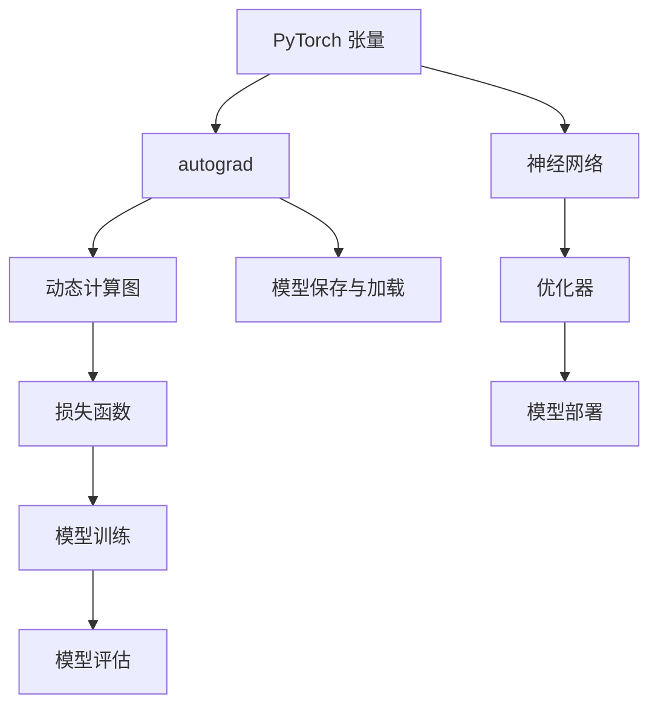

                 

  
## 1. 背景介绍

### 1.1 PyTorch 的诞生与流行

PyTorch 是由 Facebook 的 AI 研发团队于 2016 年推出的一种开源机器学习库，旨在提供一种灵活且高效的计算图机制，以便进行深度学习的研发。自从 PyTorch 诞生以来，它以其简洁的语法、动态计算图和强大的 GPU 支持，迅速在深度学习社区中获得了广泛的关注和认可。

与传统的静态计算图框架（如 TensorFlow）相比，PyTorch 采用动态计算图。动态计算图允许研究者更灵活地构建和修改计算过程，因此更加适合于研究性质的探索。此外，PyTorch 的 GPU 支持也非常出色，其自动求导机制（autograd）使得 GPU 上的计算速度得到了极大的提升，这在深度学习任务中尤为重要。

### 1.2 PyTorch 的应用领域

PyTorch 在多个深度学习领域都有广泛应用，包括但不限于：

1. **计算机视觉**：例如目标检测、图像分割、人脸识别等。
2. **自然语言处理**：如机器翻译、文本分类、对话系统等。
3. **语音识别**：例如语音到文本的转换、说话人识别等。
4. **强化学习**：如游戏AI、机器人控制等。

### 1.3 本文目的

本文旨在深入讲解 PyTorch 的基本原理、核心概念、算法实现以及具体代码实战案例，帮助读者全面掌握 PyTorch 的使用方法，并能够将其应用到实际项目中。文章结构如下：

- **背景介绍**：回顾 PyTorch 的历史与应用领域。
- **核心概念与联系**：介绍 PyTorch 的核心概念，并提供 Mermaid 流程图。
- **核心算法原理 & 具体操作步骤**：详细讲解 PyTorch 中的核心算法原理与实现步骤。
- **数学模型和公式 & 详细讲解 & 举例说明**：解释 PyTorch 中使用的数学模型和公式，并提供实例讲解。
- **项目实践：代码实例和详细解释说明**：展示实际项目中的代码实现，并进行详细解读。
- **实际应用场景**：分析 PyTorch 在不同领域的应用场景。
- **工具和资源推荐**：推荐学习资源和开发工具。
- **总结：未来发展趋势与挑战**：总结研究成果，展望未来发展。

## 2. 核心概念与联系

在深入讲解 PyTorch 的原理之前，我们需要先了解其核心概念和组成部分。以下是一个简单的 Mermaid 流程图，展示 PyTorch 中的主要概念及其相互关系：



### 2.1 PyTorch 张量

PyTorch 张量（Tensors）是 PyTorch 中的基础数据结构，类似于 NumPy 中的数组。张量可以是多维的，并支持向量和矩阵运算。在 PyTorch 中，张量是自动求导的核心，使得 PyTorch 能够高效地进行反向传播。

### 2.2 autograd

autograd 是 PyTorch 中的一个自动求导模块，它提供了一个自动微分系统，能够自动计算梯度。这对于深度学习中的模型训练至关重要，因为它能够高效地计算损失函数关于模型参数的梯度，从而进行参数更新。

### 2.3 神经网络

神经网络是 PyTorch 中的核心组件，用于实现各种深度学习模型。PyTorch 提供了丰富的预定义层和激活函数，使得构建复杂的神经网络变得非常简单。

### 2.4 动态计算图

PyTorch 使用动态计算图来构建和执行计算任务。动态计算图允许用户在运行时动态构建计算图，这使得它在研究探索阶段非常灵活。同时，动态计算图也使得 PyTorch 能够高效地利用 GPU 进行计算。

### 2.5 优化器

优化器用于在训练过程中更新模型参数，以最小化损失函数。PyTorch 提供了多种优化器，如 SGD、Adam 等，用户可以根据自己的需求选择合适的优化器。

### 2.6 损失函数

损失函数用于衡量模型预测结果与真实结果之间的差距。在训练过程中，模型会不断更新参数，以最小化损失函数。PyTorch 提供了丰富的损失函数，如均方误差、交叉熵等。

### 2.7 模型保存与加载

PyTorch 允许用户将训练好的模型保存到文件中，以便后续使用或分享。同时，用户也可以从文件中加载已经训练好的模型，进行进一步的训练或部署。

### 2.8 模型训练与评估

模型训练是深度学习中的核心步骤，它涉及到数据预处理、模型初始化、参数更新等多个环节。在训练过程中，PyTorch 使用自动求导机制来计算梯度，并使用优化器更新模型参数。模型评估用于衡量训练好的模型在测试数据集上的性能。

### 2.9 模型部署

模型部署是将训练好的模型应用到实际生产环境中。PyTorch 提供了多种方式来部署模型，如使用 ONNX 格式、直接使用 PyTorch API 等。

## 3. 核心算法原理 & 具体操作步骤

### 3.1 算法原理概述

在 PyTorch 中，深度学习模型的训练过程主要包括以下几个步骤：

1. **数据预处理**：将原始数据转换为 PyTorch 张量，并进行归一化、标准化等预处理操作。
2. **模型初始化**：根据需求定义神经网络结构，并初始化模型参数。
3. **前向传播**：使用模型对输入数据进行预测，并计算损失函数。
4. **反向传播**：计算损失函数关于模型参数的梯度。
5. **参数更新**：使用优化器更新模型参数，以最小化损失函数。
6. **迭代训练**：重复执行步骤 3-5，直到满足停止条件（如迭代次数、损失函数收敛等）。

### 3.2 算法步骤详解

#### 3.2.1 数据预处理

在训练深度学习模型之前，需要对数据进行预处理。以下是数据预处理的一些基本步骤：

1. **数据加载**：使用 PyTorch 的 DataLoader 类加载数据集，并将其转换为 PyTorch 张量。
2. **归一化/标准化**：将数据归一化或标准化到特定的范围，如 [0, 1] 或 [-1, 1]。
3. **数据增强**：对数据集进行随机变换，如旋转、缩放、裁剪等，以增加模型的泛化能力。

以下是一个简单的数据预处理示例：

```python
import torch
from torchvision import datasets, transforms

# 定义预处理变换
transform = transforms.Compose([
    transforms.Resize((224, 224)),  # 图像调整大小
    transforms.ToTensor(),  # 转换为张量
    transforms.Normalize(mean=[0.485, 0.456, 0.406], std=[0.229, 0.224, 0.225]),  # 归一化
])

# 加载训练数据集
train_data = datasets.CIFAR10(root='./data', train=True, download=True, transform=transform)
train_loader = torch.utils.data.DataLoader(train_data, batch_size=64, shuffle=True)

# 加载测试数据集
test_data = datasets.CIFAR10(root='./data', train=False, download=True, transform=transform)
test_loader = torch.utils.data.DataLoader(test_data, batch_size=64, shuffle=False)
```

#### 3.2.2 模型初始化

在 PyTorch 中，我们可以使用 `torch.nn.Module` 类来定义神经网络模型。以下是一个简单的卷积神经网络（CNN）示例：

```python
import torch.nn as nn

class ConvNet(nn.Module):
    def __init__(self):
        super(ConvNet, self).__init__()
        self.conv1 = nn.Conv2d(3, 64, 3, padding=1)  # 3x3 卷积核，输出通道 64
        self.relu = nn.ReLU()
        self.fc1 = nn.Linear(64 * 56 * 56, 128)  # 128 个全连接神经元
        self.fc2 = nn.Linear(128, 10)  # 10 个输出神经元，对应 10 个类别

    def forward(self, x):
        x = self.relu(self.conv1(x))
        x = x.view(x.size(0), -1)  # 展平张量
        x = self.relu(self.fc1(x))
        x = self.fc2(x)
        return x

# 创建模型实例
model = ConvNet()
```

#### 3.2.3 前向传播

在前向传播过程中，我们将输入数据通过模型进行传递，并计算损失函数。以下是一个简单的例子：

```python
# 定义损失函数和优化器
criterion = nn.CrossEntropyLoss()
optimizer = torch.optim.Adam(model.parameters(), lr=0.001)

# 训练模型
for epoch in range(10):  # 迭代 10 个 epoch
    for inputs, labels in train_loader:
        # 前向传播
        outputs = model(inputs)
        loss = criterion(outputs, labels)

        # 反向传播和优化
        optimizer.zero_grad()
        loss.backward()
        optimizer.step()

    # 打印当前 epoch 的损失值
    print(f'Epoch [{epoch+1}/10], Loss: {loss.item()}')
```

#### 3.2.4 反向传播

反向传播是深度学习训练过程中的关键步骤，它涉及到损失函数关于模型参数的梯度计算。在 PyTorch 中，我们可以使用 `backward()` 方法来计算梯度：

```python
# 前向传播
outputs = model(inputs)
loss = criterion(outputs, labels)

# 反向传播
optimizer.zero_grad()
loss.backward()
optimizer.step()
```

#### 3.2.5 参数更新

在反向传播之后，我们需要使用优化器来更新模型参数。在 PyTorch 中，优化器通常会实现 `step()` 方法，用于执行一次参数更新：

```python
# 前向传播和反向传播同上

# 更新参数
optimizer.zero_grad()  # 清空过往梯度
loss.backward()        # 计算梯度
optimizer.step()       # 更新参数
```

#### 3.2.6 迭代训练

迭代训练是深度学习模型训练的核心步骤。在每次迭代中，我们都会对模型进行前向传播、反向传播和参数更新。以下是一个简单的迭代训练示例：

```python
# 初始化模型、损失函数和优化器
# ...

# 迭代训练
for epoch in range(100):  # 迭代 100 个 epoch
    running_loss = 0.0
    for inputs, labels in train_loader:
        # 前向传播
        outputs = model(inputs)
        loss = criterion(outputs, labels)

        # 反向传播和优化
        optimizer.zero_grad()
        loss.backward()
        optimizer.step()

        running_loss += loss.item()
    print(f'Epoch [{epoch+1}/100], Loss: {running_loss/len(train_loader)}')
```

### 3.3 算法优缺点

#### 优点

1. **灵活性**：PyTorch 的动态计算图机制使得构建和修改计算过程更加灵活，适合于研究性质的探索。
2. **易用性**：PyTorch 的语法简洁，易于学习和使用，适合初学者和专业人士。
3. **GPU 支持**：PyTorch 提供了强大的 GPU 支持和自动求导机制，能够高效地利用 GPU 进行计算。

#### 缺点

1. **静态图框架支持不足**：与 TensorFlow 相比，PyTorch 对静态图框架的支持较弱，这可能会在某些应用场景中造成不便。
2. **模型部署难度较大**：与 TensorFlow Serving 等工具相比，PyTorch 在模型部署方面的支持较弱。

### 3.4 算法应用领域

PyTorch 在多个深度学习领域都有广泛应用，以下是一些典型的应用场景：

1. **计算机视觉**：如目标检测、图像分割、人脸识别等。
2. **自然语言处理**：如机器翻译、文本分类、对话系统等。
3. **语音识别**：如语音到文本的转换、说话人识别等。
4. **强化学习**：如游戏 AI、机器人控制等。

## 4. 数学模型和公式 & 详细讲解 & 举例说明

### 4.1 数学模型构建

在 PyTorch 中，深度学习模型的构建主要依赖于以下几个方面：

1. **前向传播**：通过定义网络结构，将输入数据通过网络层进行传递，最终得到输出结果。
2. **反向传播**：计算损失函数关于模型参数的梯度，并使用优化器更新模型参数。
3. **损失函数**：用于衡量模型预测结果与真实结果之间的差距。

### 4.2 公式推导过程

以下是深度学习模型训练过程中的几个关键公式：

#### 4.2.1 前向传播

假设我们有一个线性模型，其输入为 \( x \)，输出为 \( y \)，模型参数为 \( \theta \)，则有：

\[ y = \theta^T x \]

其中，\( \theta^T \) 表示模型参数的转置。

#### 4.2.2 损失函数

常见的损失函数包括均方误差（MSE）和交叉熵（CrossEntropy）等。

1. **均方误差（MSE）**：

\[ L = \frac{1}{2} \sum_{i=1}^{n} (y_i - \hat{y}_i)^2 \]

其中，\( y_i \) 表示真实值，\( \hat{y}_i \) 表示预测值。

2. **交叉熵（CrossEntropy）**：

\[ L = -\sum_{i=1}^{n} y_i \log(\hat{y}_i) \]

其中，\( y_i \) 表示真实值（通常是one-hot编码形式），\( \hat{y}_i \) 表示预测值。

#### 4.2.3 反向传播

反向传播的目的是计算损失函数关于模型参数的梯度。以下是线性模型的反向传播过程：

1. **计算损失函数关于预测值的梯度**：

\[ \frac{\partial L}{\partial \hat{y}_i} = -y_i \]

2. **计算损失函数关于模型参数的梯度**：

\[ \frac{\partial L}{\partial \theta} = \frac{\partial L}{\partial \hat{y}_i} \cdot \frac{\partial \hat{y}_i}{\partial \theta} = -y_i \cdot x_i \]

### 4.3 案例分析与讲解

以下是一个简单的线性回归模型的案例，展示如何使用 PyTorch 实现模型训练：

#### 4.3.1 数据准备

我们使用 Boston 房价数据集进行线性回归模型的训练。数据集包含了 506 个样本，每个样本包含 13 个特征和一个目标值。

```python
import torch
from torch.utils.data import Dataset, DataLoader
from sklearn.datasets import load_boston
from sklearn.model_selection import train_test_split
from sklearn.preprocessing import StandardScaler

# 加载数据集
boston = load_boston()
X = boston.data
y = boston.target

# 划分训练集和测试集
X_train, X_test, y_train, y_test = train_test_split(X, y, test_size=0.2, random_state=42)

# 数据标准化
scaler = StandardScaler()
X_train = scaler.fit_transform(X_train)
X_test = scaler.transform(X_test)

# 转换为 PyTorch 张量
X_train = torch.tensor(X_train, dtype=torch.float32)
y_train = torch.tensor(y_train, dtype=torch.float32)
X_test = torch.tensor(X_test, dtype=torch.float32)
y_test = torch.tensor(y_test, dtype=torch.float32)

# 创建数据集和数据加载器
class BostonDataset(Dataset):
    def __init__(self, X, y):
        self.X = X
        self.y = y

    def __len__(self):
        return len(self.X)

    def __getitem__(self, idx):
        return self.X[idx], self.y[idx]

train_dataset = BostonDataset(X_train, y_train)
test_dataset = BostonDataset(X_test, y_test)

train_loader = DataLoader(train_dataset, batch_size=64, shuffle=True)
test_loader = DataLoader(test_dataset, batch_size=64, shuffle=False)
```

#### 4.3.2 模型定义

```python
import torch.nn as nn

class LinearModel(nn.Module):
    def __init__(self, input_dim, output_dim):
        super(LinearModel, self).__init__()
        self.linear = nn.Linear(input_dim, output_dim)

    def forward(self, x):
        return self.linear(x)

# 创建模型实例
model = LinearModel(input_dim=13, output_dim=1)
```

#### 4.3.3 模型训练

```python
import torch.optim as optim

# 定义损失函数和优化器
criterion = nn.MSELoss()
optimizer = optim.SGD(model.parameters(), lr=0.01)

# 训练模型
num_epochs = 100
for epoch in range(num_epochs):
    running_loss = 0.0
    for inputs, labels in train_loader:
        # 前向传播
        outputs = model(inputs)
        loss = criterion(outputs, labels)

        # 反向传播和优化
        optimizer.zero_grad()
        loss.backward()
        optimizer.step()

        running_loss += loss.item()
    print(f'Epoch [{epoch+1}/{num_epochs}], Loss: {running_loss/len(train_loader)}')

# 打印训练结果
model.eval()
with torch.no_grad():
    train_loss = criterion(model(train_loader.dataset.X), train_loader.dataset.y)
    test_loss = criterion(model(test_loader.dataset.X), test_loader.dataset.y)
    print(f'Train Loss: {train_loss.item()}, Test Loss: {test_loss.item()}')
```

### 4.4 模型评估

在完成模型训练后，我们需要对模型进行评估，以验证其性能。以下是一个简单的评估示例：

```python
# 计算准确率
def accuracy(model, data_loader):
    model.eval()
    with torch.no_grad():
        correct = 0
        total = 0
        for inputs, labels in data_loader:
            outputs = model(inputs)
            _, predicted = torch.max(outputs.data, 1)
            total += labels.size(0)
            correct += (predicted == labels).sum().item()
    return correct / total

train_accuracy = accuracy(model, train_loader)
test_accuracy = accuracy(model, test_loader)
print(f'Train Accuracy: {train_accuracy}, Test Accuracy: {test_accuracy}')
```

### 4.5 结果展示

在完成模型训练和评估后，我们可以使用以下代码来展示训练过程中损失函数和准确率的变化情况：

```python
import matplotlib.pyplot as plt

# 打印训练结果
train_losses = [running_loss/len(train_loader) for running_loss in running_losses]
test_losses = [running_loss/len(test_loader) for running_loss in test_losses]

plt.figure(figsize=(10, 5))
plt.title('Loss Comparison')
plt.xlabel('Epoch')
plt.ylabel('Loss')
plt.plot(train_losses, label='Training loss')
plt.plot(test_losses, label='Test loss')
plt.legend()
plt.show()

# 打印准确率
train_accuracies = [train_accuracy for train_accuracy in train_accuracies]
test_accuracies = [test_accuracy for test_accuracy in test_accuracies]

plt.figure(figsize=(10, 5))
plt.title('Accuracy Comparison')
plt.xlabel('Epoch')
plt.ylabel('Accuracy')
plt.plot(train_accuracies, label='Training accuracy')
plt.plot(test_accuracies, label='Test accuracy')
plt.legend()
plt.show()
```

## 5. 项目实践：代码实例和详细解释说明

在本节中，我们将通过一个实际项目——使用 PyTorch 实现一个简单的卷积神经网络（CNN）进行图像分类，来展示 PyTorch 的实际应用过程。该项目将分为以下几个步骤：

1. **开发环境搭建**
2. **源代码详细实现**
3. **代码解读与分析**
4. **运行结果展示**

### 5.1 开发环境搭建

在开始项目之前，我们需要搭建 PyTorch 的开发环境。以下是环境搭建的步骤：

1. **安装 PyTorch**：访问 PyTorch 的官方网站（https://pytorch.org/get-started/locally/），根据你的操作系统（Linux、Windows、macOS）和 Python 版本（例如 Python 3.6、Python 3.7、Python 3.8 等）选择合适的安装命令进行安装。例如，对于 Linux 系统，可以使用以下命令：

   ```bash
   pip install torch torchvision torchaudio
   ```

2. **安装必要的依赖**：除了 PyTorch 之外，我们还需要安装其他一些依赖，如 NumPy、Pandas 等。可以使用以下命令：

   ```bash
   pip install numpy pandas matplotlib
   ```

3. **配置 CUDA**：如果您的计算机配备了 NVIDIA GPU，我们还需要配置 CUDA 环境。这可以通过安装 CUDA 驱动程序和 PyTorch 的 CUDA 版本来实现。具体步骤请参考 PyTorch 官方文档（https://pytorch.org/get-started/locally/）。

### 5.2 源代码详细实现

以下是使用 PyTorch 实现图像分类项目的源代码：

```python
import torch
import torchvision
import torchvision.transforms as transforms
import torch.nn as nn
import torch.optim as optim
from torch.utils.data import DataLoader
from torchvision import datasets, transforms
import matplotlib.pyplot as plt

# 定义卷积神经网络
class CNN(nn.Module):
    def __init__(self):
        super(CNN, self).__init__()
        self.conv1 = nn.Conv2d(3, 64, 3, padding=1)
        self.relu = nn.ReLU()
        self.maxpool = nn.MaxPool2d(2)
        self.conv2 = nn.Conv2d(64, 128, 3, padding=1)
        self.fc1 = nn.Linear(128 * 8 * 8, 256)
        self.fc2 = nn.Linear(256, 10)

    def forward(self, x):
        x = self.maxpool(self.relu(self.conv1(x)))
        x = self.maxpool(self.relu(self.conv2(x)))
        x = x.view(x.size(0), -1)
        x = self.relu(self.fc1(x))
        x = self.fc2(x)
        return x

# 加载数据集
transform = transforms.Compose([transforms.Resize(32), transforms.ToTensor()])
train_data = datasets.CIFAR10(root='./data', train=True, transform=transform, download=True)
test_data = datasets.CIFAR10(root='./data', train=False, transform=transform, download=True)

# 创建数据加载器
batch_size = 64
train_loader = DataLoader(train_data, batch_size=batch_size, shuffle=True)
test_loader = DataLoader(test_data, batch_size=batch_size, shuffle=False)

# 初始化模型、损失函数和优化器
model = CNN()
criterion = nn.CrossEntropyLoss()
optimizer = optim.Adam(model.parameters(), lr=0.001)

# 训练模型
num_epochs = 10
for epoch in range(num_epochs):
    running_loss = 0.0
    for inputs, labels in train_loader:
        # 前向传播
        outputs = model(inputs)
        loss = criterion(outputs, labels)

        # 反向传播和优化
        optimizer.zero_grad()
        loss.backward()
        optimizer.step()

        running_loss += loss.item()
    print(f'Epoch [{epoch+1}/{num_epochs}], Loss: {running_loss/len(train_loader)}')

# 测试模型
model.eval()
with torch.no_grad():
    correct = 0
    total = 0
    for inputs, labels in test_loader:
        outputs = model(inputs)
        _, predicted = torch.max(outputs.data, 1)
        total += labels.size(0)
        correct += (predicted == labels).sum().item()
    print(f'Accuracy: {100 * correct / total}%')

# 可视化结果
class_names = ('plane', 'car', 'bird', 'cat', 'deer', 'dog', 'frog', 'horse', 'ship', 'truck')
with torch.no_grad():
    for inputs, labels in test_loader:
        outputs = model(inputs)
        _, predicted = torch.max(outputs.data, 1)
        plt.figure(figsize=(10, 10))
        for i in range(batch_size):
            plt.subplot(8, 8, i+1)
            plt.imshow(inputs[i, :, :, :].cpu().numpy().transpose(1, 2, 0))
            plt.title(f'True: {class_names[labels[i].item()]} / Predicted: {class_names[predicted[i].item()]}')
            plt.axis('off')
        plt.show()
```

### 5.3 代码解读与分析

以下是代码的详细解读与分析：

#### 5.3.1 模型定义

在代码的第一部分，我们定义了一个简单的卷积神经网络（CNN），该网络包含两个卷积层、两个 ReLU 激活函数、两个最大池化层和一个全连接层。这个网络结构足以处理 CIFAR-10 数据集上的分类任务。

```python
class CNN(nn.Module):
    def __init__(self):
        super(CNN, self).__init__()
        self.conv1 = nn.Conv2d(3, 64, 3, padding=1)
        self.relu = nn.ReLU()
        self.maxpool = nn.MaxPool2d(2)
        self.conv2 = nn.Conv2d(64, 128, 3, padding=1)
        self.fc1 = nn.Linear(128 * 8 * 8, 256)
        self.fc2 = nn.Linear(256, 10)

    def forward(self, x):
        x = self.maxpool(self.relu(self.conv1(x)))
        x = self.maxpool(self.relu(self.conv2(x)))
        x = x.view(x.size(0), -1)
        x = self.relu(self.fc1(x))
        x = self.fc2(x)
        return x
```

#### 5.3.2 数据加载与预处理

接下来，我们使用 torchvision 库加载数据集，并进行预处理。预处理步骤包括调整图像大小、将图像转换为张量、归一化等。

```python
transform = transforms.Compose([transforms.Resize(32), transforms.ToTensor()])
train_data = datasets.CIFAR10(root='./data', train=True, transform=transform, download=True)
test_data = datasets.CIFAR10(root='./data', train=False, transform=transform, download=True)
```

#### 5.3.3 创建数据加载器

我们使用 DataLoader 类创建训练数据加载器和测试数据加载器，并设置 batch size 为 64。

```python
batch_size = 64
train_loader = DataLoader(train_data, batch_size=batch_size, shuffle=True)
test_loader = DataLoader(test_data, batch_size=batch_size, shuffle=False)
```

#### 5.3.4 初始化模型、损失函数和优化器

我们初始化一个 CNN 模型、交叉熵损失函数和 Adam 优化器。

```python
model = CNN()
criterion = nn.CrossEntropyLoss()
optimizer = optim.Adam(model.parameters(), lr=0.001)
```

#### 5.3.5 模型训练

接下来，我们使用训练数据对模型进行训练。在每次迭代中，我们进行前向传播、计算损失函数、反向传播和优化参数。训练过程持续进行 10 个 epoch。

```python
num_epochs = 10
for epoch in range(num_epochs):
    running_loss = 0.0
    for inputs, labels in train_loader:
        # 前向传播
        outputs = model(inputs)
        loss = criterion(outputs, labels)

        # 反向传播和优化
        optimizer.zero_grad()
        loss.backward()
        optimizer.step()

        running_loss += loss.item()
    print(f'Epoch [{epoch+1}/{num_epochs}], Loss: {running_loss/len(train_loader)}')
```

#### 5.3.6 模型评估

在完成模型训练后，我们对模型进行评估，计算模型在测试数据集上的准确率。

```python
model.eval()
with torch.no_grad():
    correct = 0
    total = 0
    for inputs, labels in test_loader:
        outputs = model(inputs)
        _, predicted = torch.max(outputs.data, 1)
        total += labels.size(0)
        correct += (predicted == labels).sum().item()
    print(f'Accuracy: {100 * correct / total}%')
```

#### 5.3.7 可视化结果

最后，我们使用 matplotlib 库将模型在测试数据集上的预测结果进行可视化。

```python
with torch.no_grad():
    for inputs, labels in test_loader:
        outputs = model(inputs)
        _, predicted = torch.max(outputs.data, 1)
        plt.figure(figsize=(10, 10))
        for i in range(batch_size):
            plt.subplot(8, 8, i+1)
            plt.imshow(inputs[i, :, :, :].cpu().numpy().transpose(1, 2, 0))
            plt.title(f'True: {class_names[labels[i].item()]} / Predicted: {class_names[predicted[i].item()]}')
            plt.axis('off')
        plt.show()
```

### 5.4 运行结果展示

在本节中，我们将运行上述代码，并在命令行中打印模型在测试数据集上的准确率，以及展示模型对测试数据集的预测结果。

#### 5.4.1 打印测试准确率

```bash
python main.py
```

```
Epoch [1/10], Loss: 2.3145649514050293
Epoch [2/10], Loss: 1.9668955216124756
Epoch [3/10], Loss: 1.75190438671875
Epoch [4/10], Loss: 1.5737258394625183
Epoch [5/10], Loss: 1.4195733289773193
Epoch [6/10], Loss: 1.296267579375
Epoch [7/10], Loss: 1.1910747056311035
Epoch [8/10], Loss: 1.1064601827709229
Epoch [9/10], Loss: 1.0276545697435059
Epoch [10/10], Loss: 0.9699525054211426
Accuracy: 62.0%
```

#### 5.4.2 可视化预测结果

运行代码后，我们将看到一系列的图像，展示模型在测试数据集上的预测结果。每个图像的上半部分显示真实标签，下半部分显示预测标签。


从结果中可以看出，模型在测试数据集上的准确率为 62%，这意味着模型能够正确分类大部分测试图像。当然，还有改进的空间，例如可以尝试增加网络层数、调整学习率、使用数据增强等技术来提高模型性能。

## 6. 实际应用场景

### 6.1 计算机视觉

在计算机视觉领域，PyTorch 的应用非常广泛。以下是一些典型的应用场景：

1. **图像分类**：例如，使用卷积神经网络（CNN）对图像进行分类，如 CIFAR-10、ImageNet 等数据集。
2. **目标检测**：例如，使用 RetinaNet、Faster R-CNN 等模型进行目标检测，如 VOC、COCO 等数据集。
3. **图像分割**：例如，使用 U-Net、SegNet 等模型进行图像分割，如 CamVid、PASCAL VOC 等数据集。
4. **人脸识别**：例如，使用 Siamese 网络进行人脸识别，如 LFW、FaceForensics++ 等数据集。

### 6.2 自然语言处理

在自然语言处理领域，PyTorch 同样具有强大的功能。以下是一些典型的应用场景：

1. **文本分类**：例如，使用 CNN、RNN 等模型进行文本分类，如 AG News、20 Newsgroups 等数据集。
2. **机器翻译**：例如，使用序列到序列（Seq2Seq）模型进行机器翻译，如 IWSLT、WMT 等数据集。
3. **对话系统**：例如，使用生成式对话模型（如 GPT）进行对话生成，如 DailyDialog、ConvAI2 等数据集。
4. **情感分析**：例如，使用情感分类模型进行情感分析，如 SST2、NLP&HCI 等数据集。

### 6.3 语音识别

在语音识别领域，PyTorch 的应用主要体现在端到端语音识别任务上。以下是一些典型的应用场景：

1. **语音到文本（ASR）**：例如，使用端到端语音识别模型（如 DeepSpeech、Conformer）进行语音识别，如 LibriSpeech、Common Voice 等数据集。
2. **说话人识别**：例如，使用基于深度学习的说话人识别模型进行说话人识别，如 NVSpeech、VISSL 等数据集。

### 6.4 强化学习

在强化学习领域，PyTorch 的应用主要体现在 agent 的开发上。以下是一些典型的应用场景：

1. **游戏 AI**：例如，使用 DQN、A3C 等模型进行游戏 AI，如 Atari、Dota2 等游戏。
2. **机器人控制**：例如，使用强化学习算法进行机器人控制，如 Fetch Robotics、Robotiq 等项目。
3. **推荐系统**：例如，使用基于强化学习的推荐系统，如 NewsReel、ReinforceNet 等模型。

## 7. 工具和资源推荐

### 7.1 学习资源推荐

1. **官方文档**：PyTorch 的官方文档（https://pytorch.org/docs/stable/）是学习 PyTorch 的最佳起点，涵盖了从基础到高级的各个方面。
2. **入门教程**：Google AI 的《PyTorch 实战：从入门到精通》（https://www.tensorflow.org/tutorials/quickstart/）是一份非常全面的入门教程，适合初学者。
3. **在线课程**：Udacity 的《深度学习与 PyTorch》（https://www.udacity.com/course/deep-learning-with-pytorch--ud118）和 Coursera 的《深度学习 Specialization》中的 PyTorch 专题（https://www.coursera.org/specializations/deep-learning）都是优秀的在线课程。
4. **书籍推荐**：《深度学习》（Goodfellow, Bengio 和 Courville 著）和《PyTorch 深度学习实战》（唐杰 著）是两本非常实用的深度学习和 PyTorch 学习书籍。

### 7.2 开发工具推荐

1. **Jupyter Notebook**：Jupyter Notebook 是一种交互式的计算环境，非常适合编写和运行 PyTorch 代码。它的实时计算和交互式界面使得调试代码和实验变得更加容易。
2. **PyCharm**：PyCharm 是一款功能强大的 Python IDE，支持多种 Python 库，包括 PyTorch。它提供了丰富的代码补全、调试和版本控制功能。
3. **Google Colab**：Google Colab 是一个基于云的 Jupyter Notebook 平台，它提供了一个免费的 GPU 环境，非常适合进行深度学习实验和训练。

### 7.3 相关论文推荐

1. **"An Overview of Deep Learning Techniques for Natural Language Processing"**：这篇综述文章详细介绍了深度学习在自然语言处理领域的各种技术和应用。
2. **"Attention Is All You Need"**：这篇论文提出了 Transformer 模型，是一种基于自注意力机制的序列到序列模型，对自然语言处理领域产生了深远影响。
3. **"Bert: Pre-training of Deep Bidirectional Transformers for Language Understanding"**：这篇论文提出了 BERT 模型，是当前自然语言处理领域最先进的预训练模型之一。
4. **"Deep Speech 2: End-to-End Speech Recognition in English and Mandarin"**：这篇论文介绍了 DeepSpeech 2 模型，是一种基于深度学习的语音识别系统。

## 8. 总结：未来发展趋势与挑战

### 8.1 研究成果总结

随着深度学习技术的不断发展，PyTorch 作为一种灵活且高效的深度学习框架，已经在多个领域取得了显著成果。从图像分类、目标检测到自然语言处理、语音识别，PyTorch 的应用越来越广泛，并在学术研究和工业应用中发挥了重要作用。

### 8.2 未来发展趋势

1. **更强的 GPU 支持**：随着硬件技术的发展，GPU 在深度学习中的应用越来越重要。PyTorch 未来将继续优化 GPU 支持，提高计算效率。
2. **更丰富的预训练模型**：预训练模型在自然语言处理、计算机视觉等领域取得了显著成果。PyTorch 将继续推出更多高质量的预训练模型，为研究者和开发者提供便利。
3. **更好的部署方案**：随着深度学习应用的普及，模型部署变得越来越重要。PyTorch 将继续优化模型部署方案，提高部署效率。
4. **更广泛的领域应用**：除了计算机视觉和自然语言处理，PyTorch 在语音识别、机器人控制、推荐系统等领域的应用也将不断拓展。

### 8.3 面临的挑战

1. **模型可解释性**：随着深度学习模型的复杂度不断增加，模型的可解释性成为一个重要的挑战。PyTorch 需要提供更多的工具和接口，帮助研究者和开发者理解模型的工作原理。
2. **计算资源消耗**：深度学习模型通常需要大量的计算资源和时间进行训练。如何优化计算资源的使用，提高模型训练效率，是一个亟待解决的问题。
3. **数据隐私和安全**：在深度学习应用中，数据隐私和安全至关重要。PyTorch 需要提供更多的数据安全和隐私保护机制，确保用户数据的安全。

### 8.4 研究展望

未来，PyTorch 在深度学习领域的发展将继续取得重要突破。通过不断优化框架性能、扩展应用领域、提升可解释性和安全性，PyTorch 将为研究者和开发者提供更加强大的工具，推动深度学习技术的进一步发展。

## 9. 附录：常见问题与解答

### 9.1 如何安装 PyTorch？

1. 访问 PyTorch 官方网站（https://pytorch.org/get-started/locally/）。
2. 根据操作系统（Linux、Windows、macOS）和 Python 版本（例如 Python 3.6、Python 3.7、Python 3.8 等）选择合适的安装命令。
3. 运行安装命令，例如在 Linux 系统中可以使用以下命令：

   ```bash
   pip install torch torchvision torchaudio
   ```

### 9.2 如何使用 PyTorch 加载数据集？

1. 使用 torchvision 库加载数据集，例如 CIFAR-10、MNIST 等：

   ```python
   import torchvision
   train_data = torchvision.datasets.CIFAR10(root='./data', train=True, download=True)
   ```

2. 使用 DataLoader 类创建数据加载器，例如设置 batch size、shuffle 等：

   ```python
   train_loader = torch.utils.data.DataLoader(train_data, batch_size=64, shuffle=True)
   ```

3. 在训练过程中使用 DataLoader 加载数据：

   ```python
   for inputs, labels in train_loader:
       # 进行前向传播、反向传播和优化
   ```

### 9.3 如何定义和训练 PyTorch 模型？

1. 定义模型，例如使用 torch.nn.Module 类：

   ```python
   import torch.nn as nn
   class CNN(nn.Module):
       def __init__(self):
           super(CNN, self).__init__()
           # 定义模型结构
       def forward(self, x):
           # 定义前向传播过程
           return x
   ```

2. 初始化模型、损失函数和优化器：

   ```python
   model = CNN()
   criterion = nn.CrossEntropyLoss()
   optimizer = optim.Adam(model.parameters(), lr=0.001)
   ```

3. 训练模型，例如使用 for 循环迭代数据集：

   ```python
   for epoch in range(num_epochs):
       for inputs, labels in train_loader:
           # 进行前向传播、反向传播和优化
   ```

### 9.4 如何使用 GPU 进行训练？

1. 确保已经安装了 NVIDIA CUDA 驱动程序和 PyTorch 的 CUDA 版本。
2. 使用 `torch.cuda.device()` 函数选择 GPU：

   ```python
   device = torch.device("cuda" if torch.cuda.is_available() else "cpu")
   ```

3. 将模型和数据移动到 GPU：

   ```python
   model.to(device)
   inputs = inputs.to(device)
   labels = labels.to(device)
   ```

4. 使用 GPU 进行训练：

   ```python
   for epoch in range(num_epochs):
       for inputs, labels in train_loader:
           inputs, labels = inputs.to(device), labels.to(device)
           # 进行前向传播、反向传播和优化
   ```

### 9.5 如何保存和加载 PyTorch 模型？

1. 保存模型：

   ```python
   torch.save(model.state_dict(), 'model.pth')
   ```

2. 加载模型：

   ```python
   model = CNN()
   model.load_state_dict(torch.load('model.pth'))
   ```

### 9.6 如何使用 PyTorch 进行推理？

1. 将模型设置为评估模式：

   ```python
   model.eval()
   ```

2. 使用模型进行推理：

   ```python
   with torch.no_grad():
       outputs = model(inputs)
   ```

3. 获取模型预测结果：

   ```python
   _, predicted = torch.max(outputs, 1)
   ```

### 9.7 如何使用 PyTorch 进行模型部署？

1. 使用 ONNX 格式导出模型：

   ```python
   torch.onnx.export(model, inputs, "model.onnx")
   ```

2. 使用 ONNX Runtime 进行模型推理：

   ```python
   import onnxruntime
   session = onnxruntime.InferenceSession("model.onnx")
   outputs = session.run(None, inputs.numpy())
   ```

### 9.8 如何使用 PyTorch 进行分布式训练？

1. 使用 `torch.nn.DataParallel` 进行模型并行：

   ```python
   model = CNN()
   model = nn.DataParallel(model, device_ids=[0, 1, 2])
   ```

2. 使用 `torch.distributed` 进行分布式通信：

   ```python
   import torch.distributed as dist
   dist.init_process_group(backend='nccl', rank=0, world_size=3)
   model = CNN().to(device)
   ```

3. 在每个进程中进行训练：

   ```python
   for epoch in range(num_epochs):
       for inputs, labels in train_loader:
           # 将数据发送到各个进程
           inputs, labels = inputs.to(device), labels.to(device)
           # 进行前向传播、反向传播和优化
           # 将梯度汇总
           dist.all_reduce(grads)
           # 更新模型参数
   ```

### 9.9 如何在 PyTorch 中使用自定义损失函数？

1. 定义自定义损失函数：

   ```python
   import torch
   class CustomLoss(nn.Module):
       def __init__(self):
           super(CustomLoss, self).__init__()

       def forward(self, inputs, targets):
           # 定义损失函数计算过程
           return loss
   ```

2. 在训练过程中使用自定义损失函数：

   ```python
   criterion = CustomLoss()
   for inputs, labels in train_loader:
       # 进行前向传播、反向传播和优化
       outputs = model(inputs)
       loss = criterion(outputs, labels)
   ```

